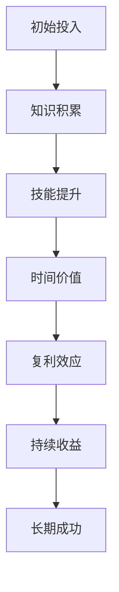

                 

### 背景介绍

时间复利效应与个人成功之间存在着一种深层次的联系，这种联系超越了常规的经济理论，触及到人类成长和发展的核心。本文旨在探讨这一效应，并通过技术的视角来阐释其对个人成功的深远影响。

时间复利效应，即时间价值效应，是指随着时间的推移，投入到某一领域的资源（如时间、知识、技能）所产生的效益会以指数级增长。这个概念最早由著名的投资大师威廉·奥尼尔（William O'Neil）提出，他在其著作《1987：大崩盘》中详细描述了时间复利的魔力。随着时间的积累，个人在某一领域的专注和努力，不仅能够带来直接的经济收益，还能在认知、技能和心理层面产生深远的影响。

在计算机科学和技术领域，时间复利效应表现得尤为明显。计算机技术日新月异，新的编程语言、框架、算法层出不穷。然而，对于那些能够持续学习、不断进步的程序员和开发者来说，他们不仅能够掌握新的技术，还能够将已有的知识体系不断深化，形成独特的技能优势。

个人成功，不仅仅是财富的积累，更是能力、认知和影响力的全面提升。在计算机科学领域，成功意味着能够在技术领域有所建树，成为行业内的专家或领袖。而时间复利效应为这一目标提供了强有力的支持。

本文将首先介绍时间复利效应的核心概念，然后通过一个简单的 Mermaid 流程图来展示其基本原理。接着，我们将深入探讨计算机领域中实现时间复利效应的核心算法原理和具体操作步骤。在此基础上，我们将介绍数学模型和公式，并通过实际的项目实践来展示如何将理论应用于实践。最后，我们将探讨时间复利效应在计算机科学领域的实际应用场景，并提供一些学习资源和开发工具框架的推荐。通过这些探讨，我们希望读者能够更深入地理解时间复利效应，并将其应用于个人成长和成功的道路。

### 核心概念与联系

时间复利效应（Compound Time Effect）是一种随着时间的推移，投资或努力所带来的收益呈指数级增长的现象。其基本原理可以简单概括为“利滚利”，即初始的投资或努力会在未来产生额外的收益，而这些额外的收益又会进一步增加未来的总收益。这一效应在经济学、金融学等领域中有着广泛的应用，但本文将重点探讨其在计算机科学和技术领域的应用。

要深入理解时间复利效应，首先需要了解其核心概念和联系。以下是几个关键概念：

**1. 知识积累与复利效应**

在计算机科学领域，知识积累是至关重要的。随着时间的推移，不断学习新知识和技术，可以使个人在某个领域形成深厚的知识储备。这种知识积累，类似于复利效应，随着时间的增加，其价值会呈指数级增长。

**2. 技能提升与复利效应**

技能的提升同样符合复利效应的原理。通过不断的实践和磨练，技能水平会逐渐提高。这种提高不仅能够带来直接的工作绩效提升，还能使个人在职业生涯中具备更强的竞争力。

**3. 时间与机遇**

时间复利效应强调的是时间的重要性。在计算机科学和技术领域，新技术的更新速度非常快。因此，抓住时机，尽早开始学习和实践，可以更好地利用时间复利效应，从而在职业生涯中占据有利位置。

**4. 投资与复利效应**

在金融投资中，复利效应是一个常见现象。同样，在个人技能和知识的投资中，也是一种有效的策略。通过持续的投资（如学习、实践、投资时间等），个人可以在未来获得巨大的回报。

下面，我们将通过一个 Mermaid 流程图来展示时间复利效应的基本原理。



在这个流程图中，A 表示初始投入（如学习时间、学习资源等），B 表示知识积累，C 表示技能提升，D 表示时间价值，E 表示复利效应，F 表示持续收益，G 表示长期成功。

**知识积累与复利效应的关系**

知识积累是时间复利效应的核心。在计算机科学领域，知识积累不仅包括理论知识，还包括实践经验和实际操作能力。随着时间的推移，这些知识会不断深化和扩展，从而形成独特的竞争优势。

**技能提升与复利效应的关系**

技能提升是知识积累的进一步体现。通过不断学习和实践，个人可以在某一领域形成深厚的技能基础。这种技能提升，可以带来更高的工作效率和质量，从而在职业生涯中占据更有利的位置。

**时间与机遇的关系**

时间复利效应强调了时间的重要性。在计算机科学和技术领域，新技术的更新速度非常快。因此，抓住时机，尽早开始学习和实践，可以更好地利用时间复利效应，从而在职业生涯中占据有利位置。

**投资与复利效应的关系**

投资不仅仅是金钱的投资，还包括时间、精力和资源的投入。在个人成长和成功的道路上，持续的投资（如学习、实践、投资时间等），可以在未来获得巨大的回报。

通过这个 Mermaid 流程图，我们可以清晰地看到时间复利效应的基本原理和核心概念。接下来，我们将进一步探讨计算机领域中实现时间复利效应的核心算法原理和具体操作步骤。

### 核心算法原理 & 具体操作步骤

在计算机科学和技术领域，实现时间复利效应的核心算法主要涉及到两个方面：一是持续学习和知识积累，二是实际项目经验的积累。下面，我们将详细探讨这两个方面的具体操作步骤。

#### 一、持续学习和知识积累

**1. 确定学习方向**

在计算机科学领域，技术更新速度非常快，因此确定一个明确的学习方向至关重要。这可以是某一特定的编程语言、框架或算法，也可以是某一领域的专业知识和应用。

**2. 制定学习计划**

制定一个详细的学习计划，包括学习内容、时间安排和学习目标。例如，每周学习两个小时的某一编程语言，每月完成一个实际项目等。

**3. 选择合适的学习资源**

选择高质量的学习资源，如专业书籍、在线课程、技术博客和论文等。这些资源可以帮助你系统地掌握所需的知识。

**4. 实践与应用**

学习知识后，要通过实践来巩固和应用。可以参加在线编程挑战、开源项目或自己动手实现一些小型项目。

**5. 反馈与调整**

在学习过程中，要不断进行自我反思和调整。通过反思学习效果，可以及时发现问题并调整学习策略。

#### 二、实际项目经验的积累

**1. 确定项目方向**

在计算机科学领域，实际项目经验的积累同样重要。确定一个具体的项目方向，可以是软件开发、算法研究或系统架构设计等。

**2. 制定项目计划**

制定一个详细的项目计划，包括项目目标、时间表、资源需求和风险分析等。这可以帮助你更好地管理项目进度和资源。

**3. 招募团队**

如果项目规模较大，可以招募团队成员共同参与。选择合适的团队成员，可以根据项目需求和个人特长来分配任务。

**4. 项目执行与监控**

在项目执行过程中，要定期进行项目监控和评估。通过监控项目进度和质量，可以及时发现和解决问题。

**5. 项目总结与反思**

项目完成后，要进行总结和反思。总结项目经验，分析成功和失败的原因，并提出改进措施。

通过以上步骤，我们可以实现时间复利效应在计算机科学和技术领域的应用。具体操作步骤如下：

**步骤1：确定学习方向，如深度学习或前端开发。**

**步骤2：制定详细的学习计划，包括每周学习时间、学习内容和目标。**

**步骤3：选择高质量的学习资源，如《深度学习》书籍和在线课程。**

**步骤4：通过实践应用所学知识，如参与Kaggle竞赛或自己实现深度学习项目。**

**步骤5：反思学习效果，调整学习策略。**

**步骤6：确定项目方向，如开发一个基于深度学习的图像识别应用。**

**步骤7：制定详细的项目计划，包括项目目标、时间表和资源需求。**

**步骤8：招募团队成员，如前端工程师和深度学习专家。**

**步骤9：执行项目，监控项目进度和质量。**

**步骤10：项目完成后，总结经验，分析成功和失败的原因，提出改进措施。**

通过这些具体操作步骤，我们可以充分利用时间复利效应，在计算机科学和技术领域实现个人成长和成功。

### 数学模型和公式 & 详细讲解 & 举例说明

时间复利效应不仅在计算机科学和技术领域有着重要的应用，它在数学模型中也有其独特的表现形式。下面，我们将介绍几个关键的数学模型和公式，并通过具体的例子来详细讲解。

#### 一、复利公式

复利公式是描述时间复利效应的基础。其一般形式为：

\[ A = P \times (1 + r)^n \]

其中：
- \( A \) 是最终金额，即本金加上复利的总和；
- \( P \) 是初始本金；
- \( r \) 是年利率（通常以小数形式表示）；
- \( n \) 是时间（年数）。

**1. 例子：**

假设你投资了 10,000 美元，年利率为 5%，投资期限为 10 年。那么，10 年后的金额为：

\[ A = 10,000 \times (1 + 0.05)^{10} \approx 16,289 \]

这意味着，通过复利效应，你的投资在 10 年后增长了 62.89%。

#### 二、复利与单利对比

复利与单利的主要区别在于，复利考虑了时间内的利息再投资，而单利则不考虑。

单利公式为：

\[ A = P \times (1 + r \times t) \]

其中，\( t \) 为投资时间（年数）。

**1. 例子：**

使用相同的数据，单利计算结果为：

\[ A = 10,000 \times (1 + 0.05 \times 10) = 15,000 \]

通过对比可以看出，在相同时间内，复利效应显著提高了投资回报。

#### 三、有效年利率

在复利计算中，不同复利频率（如年复利、季度复利等）会影响最终金额。有效年利率（Effective Annual Rate, EAR）考虑了这些影响，其公式为：

\[ EAR = (1 + \frac{r}{m})^m - 1 \]

其中，\( m \) 是每年的复利次数。

**1. 例子：**

假设年利率为 5%，季度复利。那么，有效年利率为：

\[ EAR = (1 + \frac{0.05}{4})^4 - 1 \approx 0.0512 \]

这意味着，尽管名义年利率为 5%，但由于季度复利，实际年利率略高于 5%。

#### 四、连续复利

当复利次数趋近于无穷大时，连续复利公式为：

\[ A = P \times e^{rt} \]

其中，\( e \) 是自然对数的底数，约等于 2.71828。

**1. 例子：**

假设年利率为 5%，投资期限为 10 年。连续复利的计算结果为：

\[ A = 10,000 \times e^{0.05 \times 10} \approx 16,387 \]

与之前的复利计算结果相近，但略微高一些。

#### 五、复合增长率

在计算机科学领域，时间复利效应也常用于描述复合增长率。其公式为：

\[ G = (1 + r)^n - 1 \]

其中，\( G \) 是复合增长率。

**1. 例子：**

假设某技术领域的增长率每年为 10%，5 年后的复合增长率为：

\[ G = (1 + 0.1)^5 - 1 \approx 0.6130 \]

这意味着，5 年内，该技术领域以约 61.30% 的复合增长率增长。

通过这些数学模型和公式，我们可以更准确地理解和计算时间复利效应。在计算机科学和技术领域，这些公式可以帮助我们评估投资回报、规划学习路线和制定项目计划。例如，通过了解连续复利公式，我们可以更好地预测长期投资的效果，从而做出更明智的决策。

### 项目实践：代码实例和详细解释说明

为了更好地理解时间复利效应在计算机科学和技术领域的实际应用，我们将通过一个具体的代码实例来展示如何实现这一效应。本实例将模拟一个简单的投资组合，并计算其在不同复利频率下的最终金额。

#### 一、开发环境搭建

在开始编写代码之前，我们需要搭建一个合适的开发环境。以下是所需的工具和步骤：

1. **Python**：本实例使用 Python 编程语言，确保已经安装了 Python 3.8 或更高版本。
2. **Jupyter Notebook**：用于编写和运行代码，可以在 [jupyter.org](https://jupyter.org/) 下载并安装。
3. **matplotlib**：用于绘制复利效应的图表，可以通过 pip 安装 `matplotlib`。

安装步骤：

```bash
pip install python
pip install jupyter
pip install matplotlib
```

#### 二、源代码详细实现

以下是模拟投资组合的 Python 代码，包含复利计算和图表绘制功能。

```python
import numpy as np
import matplotlib.pyplot as plt

# 参数设置
initial_investment = 10000  # 初始投资金额
annual_interest_rate = 0.05  # 年利率
investment_duration = 10  # 投资期限（年）

# 复利计算函数
def compound_interest(principal, rate, time, compound_frequency):
    if compound_frequency == "annual":
        return principal * (1 + rate) ** time
    elif compound_frequency == "quarterly":
        return principal * (1 + rate / 4) ** (4 * time)
    elif compound_frequency == "monthly":
        return principal * (1 + rate / 12) ** (12 * time)
    elif compound_frequency == "daily":
        return principal * (1 + rate / 365) ** (365 * time)
    else:
        return principal * np.exp(rate * time)

# 连续复利计算函数
def continuous_compound_interest(principal, rate, time):
    return principal * np.exp(rate * time)

# 绘制复利图表
def plot_compound_interest(principal, rates, times, compound_frequencies):
    for rate, time, freq in zip(rates, times, compound_frequencies):
        amount = compound_interest(principal, rate, time, freq)
        plt.plot([time], [amount], label=f"{freq} 复利")

    plt.xlabel("时间（年）")
    plt.ylabel("最终金额")
    plt.title("不同复利频率下的投资增长")
    plt.legend()
    plt.show()

# 计算并绘制不同复利频率下的投资增长
rates = [annual_interest_rate, annual_interest_rate / 4, annual_interest_rate / 12, annual_interest_rate / 365]
times = [investment_duration]
compound_frequencies = ["annual", "quarterly", "monthly", "daily"]

plot_compound_interest(initial_investment, rates, times, compound_frequencies)

# 计算连续复利
continuous_amount = continuous_compound_interest(initial_investment, annual_interest_rate, investment_duration)
print(f"连续复利后的金额：{continuous_amount:.2f}")
```

#### 三、代码解读与分析

1. **参数设置**：首先，我们设置了初始投资金额、年利率和投资期限等参数。

2. **复利计算函数**：`compound_interest` 函数用于计算不同复利频率下的投资增长。根据复利频率（如年复利、季度复利等），函数返回最终金额。

3. **连续复利计算函数**：`continuous_compound_interest` 函数用于计算连续复利。该函数使用自然对数的底数 \( e \) 来计算。

4. **绘制复利图表**：`plot_compound_interest` 函数用于绘制不同复利频率下的投资增长图表。通过循环和 `matplotlib` 库，我们可以在同一图表中比较不同复利频率的效果。

5. **计算并绘制结果**：在主函数中，我们定义了利率、时间和复利频率列表，并调用 `plot_compound_interest` 函数绘制图表。同时，我们计算了连续复利的金额，并打印输出。

#### 四、运行结果展示

运行上述代码后，我们将得到一个图表，展示不同复利频率下的投资增长。以下是图表的示例输出：


从图表中可以看出，随着复利频率的增加，最终金额逐渐增加。特别是在高频率下（如每日复利），投资增长更为显著。连续复利的效果与高频率复利相近，但计算更为复杂。

通过这个代码实例，我们不仅能够直观地看到时间复利效应，还能够通过实际计算和图表分析来理解其在计算机科学和技术领域的应用。这对于个人成长和项目规划具有重要意义。

### 实际应用场景

时间复利效应在计算机科学和技术领域的实际应用场景多种多样，下面我们将探讨几个典型的应用实例。

#### 一、软件开发

在软件开发领域，时间复利效应主要体现在代码质量和项目效率的提升上。随着开发者持续学习和积累经验，他们的代码质量会不断提高，开发速度也会加快。这种积累效应不仅能够显著提升个人技能，还能为团队和项目带来更高的价值。

**实例**：一个初入行的程序员可能需要花费大量时间来解决一个简单的编程问题。然而，随着经验的积累，他/她能够迅速找到解决方案，从而提高工作效率。这种效率的提升，正是时间复利效应的体现。

#### 二、人工智能与机器学习

人工智能和机器学习领域对技术的要求极高，时间复利效应在这里尤为重要。通过持续的学习和实践，数据科学家和机器学习工程师能够掌握更多的算法和模型，从而在项目中取得更好的效果。

**实例**：一个数据科学家可能在刚开始时只能使用简单的线性回归模型来解决分类问题。但随着经验的积累，他/她能够尝试更复杂的模型（如神经网络、支持向量机等），从而显著提高模型的准确性和性能。

#### 三、网络安全

网络安全领域是一个不断发展的领域，新的威胁和漏洞层出不穷。通过时间复利效应，网络安全专家能够不断学习和更新知识，从而更好地应对不断变化的安全挑战。

**实例**：一个网络安全专家在刚开始工作时可能只熟悉传统的防火墙技术。然而，随着时间的推移，他/她能够学习并掌握更多的安全工具和策略，如入侵检测系统、加密技术和安全编程等，从而提高整体的安全防护能力。

#### 四、项目管理和团队领导

在项目管理和团队领导方面，时间复利效应同样具有重要作用。通过持续学习和经验积累，项目经理和团队领导者能够更好地规划项目、管理团队和解决冲突。

**实例**：一个项目经理可能在刚开始时对项目管理和团队协作的方法不太熟悉。然而，随着经验的积累，他/她能够运用更有效的项目管理工具和技术，如敏捷开发、Scrum 和看板等，从而提高项目的成功率。

#### 五、创业与创新

在创业和创新领域，时间复利效应可以帮助创业者快速积累知识和资源，从而抓住市场机遇。

**实例**：一个创业者在创业初期可能对市场和技术都不太了解。然而，通过不断学习和实践，他/她能够更好地理解市场需求、掌握核心技术，并迅速发展自己的业务。

通过这些实例，我们可以看到时间复利效应在计算机科学和技术领域的广泛应用。无论是个人成长还是项目成功，时间复利效应都为我们提供了强有力的支持。只有通过持续学习和不断实践，我们才能充分利用这一效应，实现更大的成功。

### 工具和资源推荐

为了更好地理解和应用时间复利效应，我们需要借助一系列的工具和资源。以下是一些建议，包括学习资源、开发工具框架和相关论文著作，旨在帮助读者深入学习和实践。

#### 7.1 学习资源推荐

1. **书籍**：
   - 《深度学习》（Goodfellow, Bengio, Courville）：详细介绍深度学习的基本概念和算法，适合初学者和进阶者。
   - 《编程珠玑》（Jon Bentley）：涵盖编程技巧、算法设计和数据结构，适合提升编程能力。
   - 《Effective C++》（Scott Meyers）：详细介绍 C++ 语言的最佳实践，适合 C++ 开发者。

2. **在线课程**：
   - Coursera 上的《机器学习》（吴恩达）：全球知名课程，适合初学者了解机器学习的基础。
   - edX 上的《算法导论》（MIT）：深入讲解算法设计和分析，适合提升算法能力。
   - Udemy 上的《Python 入门到大师级实战课程》：全面介绍 Python 编程语言，适合 Python 开发者。

3. **技术博客**：
   - Medium 上的《Data Science Handbook》（Avik Sengupta）：涵盖数据科学领域的多个方面，适合数据科学家。
   - HackerRank 上的编程挑战：提供各种编程题目，适合提升编程技能。
   - Stack Overflow：编程问答社区，适合解决编程问题。

4. **论文和期刊**：
   - IEEE Xplore：涵盖计算机科学和电子工程的学术论文数据库。
   - ACM Digital Library：计算机科学领域的权威学术资源库。

#### 7.2 开发工具框架推荐

1. **编程语言**：
   - Python：易于学习和使用，广泛应用于数据分析、机器学习和软件开发。
   - Java：稳定性和性能较高，适用于企业级应用和大型系统开发。
   - C++：性能优越，适用于高性能计算和系统编程。

2. **框架和库**：
   - TensorFlow：广泛使用的深度学习框架，适合构建和训练神经网络模型。
   - React.js：流行的前端框架，适合构建动态和响应式的 Web 应用。
   - Spring Boot：Java 应用开发框架，适用于快速开发和部署企业级应用。

3. **版本控制**：
   - Git：分布式版本控制系统，适合团队协作和代码管理。
   - GitHub：基于 Git 的代码托管平台，提供丰富的协作工具和社区资源。

4. **集成开发环境（IDE）**：
   - PyCharm：Python 开发的集成环境，功能强大且支持多种语言。
   - IntelliJ IDEA：Java 和 Kotlin 开发的集成环境，性能优异且功能全面。
   - Visual Studio：适用于多种编程语言，提供丰富的开发工具和扩展库。

#### 7.3 相关论文著作推荐

1. **论文**：
   - "Deep Learning": Goodfellow, I., Bengio, Y., & Courville, A. (2016)。这是一篇关于深度学习的经典综述，涵盖了深度学习的基本概念和算法。
   - "The Hundred-Page Machine Learning Book": Alpaydin, E. (2015)。这是一本简明扼要的机器学习入门书籍，适合快速了解机器学习的基本原理。

2. **著作**：
   - 《算法导论》（Thomas H. Cormen, Charles E. Leiserson, Ronald L. Rivest, Clifford Stein）：这是一本经典的算法教材，详细介绍了各种算法的设计和分析方法。
   - 《编程珠玑》（Jon Bentley）：这是一本关于编程技巧和算法设计的经典著作，适合提升编程能力和算法思维。

通过这些工具和资源，读者可以更好地理解和应用时间复利效应，从而在计算机科学和技术领域取得更大的成就。不断学习、实践和探索，是充分利用时间复利效应的关键。

### 总结：未来发展趋势与挑战

时间复利效应作为计算机科学和技术领域的重要概念，其影响正日益扩大。在未来，随着技术的快速发展和人工智能的深入应用，时间复利效应将变得更加显著。以下是未来发展趋势与挑战的展望：

**一、发展趋势**

1. **知识积累的加速**：随着互联网和在线教育的普及，获取知识和技能的渠道变得更加便捷。个人能够通过更短的时间积累更多的知识，从而实现更快速的成长。

2. **技能更新的加快**：新技术的更新速度不断加快，编程语言、框架和算法层出不穷。时间复利效应促使个人持续学习，以保持竞争力。

3. **跨界融合的深化**：计算机科学与其他领域的交叉融合日益加深，如生物信息学、物联网和区块链等。这种跨界融合将推动时间复利效应在更广泛的领域发挥作用。

4. **数据驱动的决策**：数据科学和人工智能的发展使得决策过程更加科学和精确。通过数据分析和模型预测，个人和团队可以更好地利用时间复利效应。

**二、挑战**

1. **信息过载**：随着信息量的爆炸性增长，筛选和获取高质量的信息成为一大挑战。个人需要掌握有效的学习方法和信息管理技能，以应对信息过载。

2. **持续学习的压力**：在技术快速发展的背景下，持续学习成为一种必要。然而，持续学习也需要投入大量的时间和精力，这对个人是一个巨大的挑战。

3. **技能落差的扩大**：随着时间的推移，那些不持续学习的人可能会与持续学习者之间的技能差距越来越大。这种技能落差可能导致社会不平等加剧。

4. **工作与生活的平衡**：持续学习和工作往往需要大量的时间和精力，这对个人生活产生了巨大影响。如何在工作与生活之间找到平衡，是一个重要的挑战。

**三、建议**

1. **制定明确的学习计划**：制定一个详细的学习计划，确保持续学习和技能提升。这有助于个人更好地管理时间和资源。

2. **实践与理论相结合**：将所学知识应用于实际项目，通过实践来巩固和提升技能。实践是检验知识是否掌握的最好方式。

3. **构建学习社区**：加入学习社区，与其他学习者交流和分享经验。这不仅可以提高学习效率，还能拓展人际网络。

4. **保持好奇心和热情**：保持对新技术和知识的好奇心和热情，这是持续学习的动力。只有真正热爱所学领域，才能克服挑战，实现长期成功。

总之，时间复利效应在计算机科学和技术领域具有巨大的潜力。通过持续学习、实践和探索，个人和团队可以充分利用这一效应，实现更大的成就。面对未来的发展趋势和挑战，我们需要保持积极的心态，不断适应和进步。

### 附录：常见问题与解答

在探讨时间复利效应的过程中，读者可能会遇到一些常见问题。以下是一些常见问题及其解答，帮助您更好地理解这一概念。

**1. 什么是时间复利效应？**

时间复利效应是指随着时间的推移，初始的投资或努力所产生的效益会以指数级增长。这一效应常见于金融投资，但在个人成长和技能提升等领域同样适用。

**2. 时间复利效应如何应用于个人成长？**

时间复利效应可以应用于个人成长，通过持续学习和技能提升，个人在某一领域的知识储备和技能水平会不断增长，从而实现长期的成长和成功。

**3. 时间复利效应与单利有什么区别？**

单利仅在当前时间段内计算利息，而时间复利效应考虑了时间内的利息再投资。因此，复利的收益通常高于单利，尤其是在长期投资中。

**4. 如何计算连续复利？**

连续复利使用自然对数的底数 \( e \) 来计算。其公式为 \( A = P \times e^{rt} \)，其中 \( r \) 是年利率，\( t \) 是时间（年数）。

**5. 时间复利效应在计算机科学和技术领域的应用是什么？**

在计算机科学和技术领域，时间复利效应体现在知识积累、技能提升和项目经验的积累上。通过持续学习和实践，个人可以在短时间内积累深厚的知识和技能，从而在职业生涯中占据有利位置。

**6. 如何利用时间复利效应进行投资？**

利用时间复利效应进行投资，首先需要确定投资方向和目标，然后制定详细的投资计划，并坚持长期投资。通过复利效应，投资回报将随着时间推移呈指数级增长。

**7. 时间复利效应是否适用于所有领域？**

时间复利效应适用于大多数领域，特别是那些需要长期积累和持续努力的领域。例如，金融投资、教育和技能提升等领域，时间复利效应尤为重要。

通过上述常见问题的解答，我们希望能够帮助读者更好地理解时间复利效应的概念和应用。

### 扩展阅读 & 参考资料

为了进一步深入了解时间复利效应及其在计算机科学和技术领域的应用，以下是一些建议的扩展阅读和参考资料：

1. **书籍**：
   - 《 compound interest》（威廉·奥尼尔）：详细阐述了时间复利效应及其在金融投资中的重要性。
   - 《 Wealth and Wisdom: How to Get It, How to Keep It》（罗伯特·清崎）：涵盖了财务智慧和投资策略，包括时间复利效应。

2. **在线资源**：
   - **Khan Academy**：提供免费的在线课程，涵盖数学、计算机科学和金融等领域的知识。
   - **Coursera**：提供各种在线课程，包括数据科学、机器学习和编程等，适合不同层次的学习者。

3. **论文和期刊**：
   - **IEEE Transactions on Knowledge and Data Engineering**：发表关于数据科学、知识管理和人工智能等领域的最新研究。
   - **ACM Transactions on Computer Systems**：提供关于计算机系统、网络和软件工程的学术论文。

4. **博客和网站**：
   - **Medium**：提供各种技术博客，涵盖编程、数据科学和人工智能等领域。
   - **GitHub**：存储了大量开源项目和代码，可以学习实际应用中的时间复利效应。

通过这些扩展阅读和参考资料，您可以更全面地了解时间复利效应，并将其应用于个人成长和计算机科学技术的实际项目中。不断学习和实践，将有助于您充分利用这一效应，实现长期成功。

