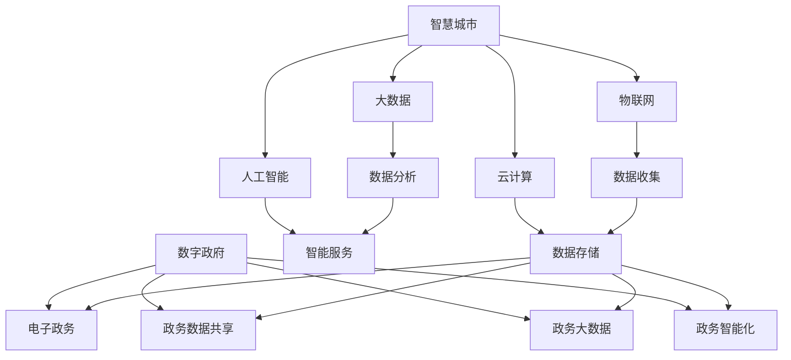

                 

### 1. 背景介绍

智慧城市（Smart City）与数字政府（Digital Government）是当今信息化发展的重要方向，代表了现代城市治理和服务的新模式。智慧城市是指利用物联网（IoT）、大数据、云计算、人工智能等先进技术，通过智能化手段优化城市资源分配、提升城市管理效率和改善居民生活质量。数字政府则是在信息化、网络化的基础上，运用信息技术手段，实现政府职能的数字化转型，提升政府服务效率和透明度。

随着技术的不断发展，智慧城市和数字政府正日益成为城市发展的重要驱动力。智慧城市能够通过实时数据监控和分析，有效解决交通拥堵、环境污染、资源浪费等问题。例如，智能交通系统可以根据实时路况调整交通信号，减少拥堵，提高交通效率。而数字政府则能够通过在线服务平台，实现政务服务的一网通办，提升民众的获得感和满意度。

当前，全球范围内已有许多城市和地区在智慧城市和数字政府建设方面取得了显著成果。例如，新加坡的智慧国家计划，通过集成各种数据源，提供全面的政府服务，提高了政府工作效率和民众满意度。中国的“数字城市”建设，通过大数据和人工智能技术，实现了城市管理的智能化和精细化。

然而，智慧城市和数字政府建设也面临着诸多挑战。技术层面，数据处理、网络安全、隐私保护等问题亟需解决。政策层面，法律法规的完善和跨部门协同机制的建立也是关键。因此，对于创业公司而言，智慧城市和数字政府领域既是机遇，也是挑战。

### 2. 核心概念与联系

#### 智慧城市（Smart City）

智慧城市是指通过整合物联网、云计算、大数据、人工智能等先进技术，实现城市资源的智能管理和服务优化。其核心概念包括：

1. **物联网（IoT）**：通过传感器和设备收集城市运行数据，如交通流量、环境质量等，实现对城市运行状态的实时监控。
2. **云计算**：通过云平台提供数据存储、计算和共享服务，为智慧城市的应用提供强大的技术支撑。
3. **大数据**：通过对海量数据的收集、存储、分析和处理，为城市管理者提供决策支持，优化城市管理。
4. **人工智能（AI）**：利用机器学习、深度学习等技术，实现智能化的城市服务和治理。

#### 数字政府（Digital Government）

数字政府是指利用信息技术手段，实现政府职能的数字化转型。其核心概念包括：

1. **电子政务**：通过互联网和电子化手段，提供便捷的政务服务，如在线审批、税务缴纳等。
2. **政务数据共享**：通过建立政务数据共享平台，实现政府部门之间的数据互通和共享，提高政府工作效率。
3. **政务大数据**：通过对政务数据的收集、分析和应用，提升政府决策的科学性和精准性。
4. **政务智能化**：利用人工智能技术，实现政务服务的智能化和个性化，提高民众的获得感和满意度。

#### Mermaid 流程图

以下是一个简化的 Mermaid 流程图，展示智慧城市和数字政府的基本架构和联系：



通过这个流程图，我们可以清晰地看到智慧城市和数字政府的各个核心概念是如何相互联系和协同作用的。

### 3. 核心算法原理 & 具体操作步骤

在智慧城市和数字政府建设中，核心算法的原理和具体操作步骤至关重要。以下将详细介绍几个关键算法：

#### 1. 聚类算法

**原理**：聚类算法是一种无监督学习方法，用于将数据点分为多个类别，使得同一类别的数据点彼此相似，不同类别的数据点之间差异较大。常见的聚类算法包括K-means、DBSCAN等。

**操作步骤**：

1. **数据准备**：收集城市中的各种数据，如交通流量、环境质量等，进行预处理，包括数据清洗、归一化等操作。
2. **选择聚类算法**：根据数据的特性选择合适的聚类算法。例如，对于数据量较大且分布较均匀的情况，可以选择K-means算法。
3. **初始化聚类中心**：对于K-means算法，需要随机初始化K个聚类中心。
4. **迭代计算**：计算每个数据点到各个聚类中心的距离，将数据点分配到最近的聚类中心所在的类别。
5. **更新聚类中心**：重新计算每个类别的中心点，并更新聚类中心。
6. **重复迭代**：重复步骤4和5，直到聚类中心不再发生显著变化。

**例子**：假设有一个包含100个数据点的交通流量数据集，我们可以使用K-means算法将其分为10个类别，以便更好地分析交通拥堵情况。

```python
from sklearn.cluster import KMeans
import numpy as np

# 准备数据
data = np.random.rand(100, 2)

# 初始化K-means算法
kmeans = KMeans(n_clusters=10, random_state=0)

# 训练模型
kmeans.fit(data)

# 输出聚类结果
print(kmeans.labels_)
```

#### 2. 决策树算法

**原理**：决策树是一种常见的分类和回归算法，通过一系列的判断条件，将数据逐步划分，最终得到每个数据点的分类或预测结果。

**操作步骤**：

1. **数据准备**：收集城市中与目标变量相关的数据，如居民满意度、环境质量等，进行预处理。
2. **选择特征**：根据数据特征的重要性选择合适的特征进行训练。
3. **构建决策树**：选择一个最佳分割特征，将数据集划分为两个子集，并计算每个子集的损失函数，选择损失函数最小的分割作为决策树的节点。
4. **递归构建**：对每个子集重复步骤3，直到满足停止条件（如最大深度、最小样本量等）。
5. **剪枝**：为了防止过拟合，可以对决策树进行剪枝处理。

**例子**：假设我们想要构建一个决策树模型，预测居民对城市服务的满意度。

```python
from sklearn.tree import DecisionTreeClassifier
import numpy as np

# 准备数据
X = np.random.rand(100, 5)
y = np.random.randint(0, 2, 100)

# 初始化决策树算法
clf = DecisionTreeClassifier()

# 训练模型
clf.fit(X, y)

# 输出决策树结构
print(clf.tree_)
```

#### 3. 支持向量机算法

**原理**：支持向量机（SVM）是一种监督学习方法，通过寻找最佳的超平面，将不同类别的数据点分隔开来。

**操作步骤**：

1. **数据准备**：收集城市中与目标变量相关的数据，进行预处理。
2. **特征选择**：选择对分类任务影响最大的特征。
3. **初始化模型**：选择合适的核函数（如线性核、多项式核、径向基核等），初始化SVM模型。
4. **训练模型**：使用训练数据训练SVM模型。
5. **评估模型**：使用测试数据评估模型的准确性。

**例子**：假设我们使用SVM模型对城市中的居民满意度进行分类。

```python
from sklearn.svm import SVC
import numpy as np

# 准备数据
X = np.random.rand(100, 5)
y = np.random.randint(0, 2, 100)

# 初始化SVM模型
clf = SVC(kernel='linear')

# 训练模型
clf.fit(X, y)

# 输出模型参数
print(clf.coef_)
```

通过以上核心算法的原理和具体操作步骤，创业公司可以更好地理解智慧城市和数字政府的技术基础，为实际应用提供有力的技术支持。

### 4. 数学模型和公式 & 详细讲解 & 举例说明

在智慧城市和数字政府的建设中，数学模型和公式扮演着至关重要的角色。以下将介绍几个关键数学模型和公式，并详细讲解其应用和举例说明。

#### 1. K-means 聚类算法

**公式**：

K-means 聚类算法的核心是计算数据点到聚类中心的距离，选择距离最近的聚类中心作为该数据点的类别。具体公式如下：

$$
d(\textbf{x}_i, \textbf{c}_j) = \sqrt{\sum_{k=1}^{n} (x_i^k - c_j^k)^2}
$$

其中，$d(\textbf{x}_i, \textbf{c}_j)$ 表示第 $i$ 个数据点 $\textbf{x}_i$ 到第 $j$ 个聚类中心 $\textbf{c}_j$ 的距离，$x_i^k$ 和 $c_j^k$ 分别表示第 $i$ 个数据点和第 $j$ 个聚类中心在第 $k$ 个维度上的值，$n$ 表示数据点的维度。

**举例说明**：

假设有一个二维数据集 $D = \{(\textbf{x}_1, y_1), (\textbf{x}_2, y_2), ..., (\textbf{x}_n, y_n)\}$，其中每个数据点包含两个特征。我们要使用 K-means 算法将其分为两个类别。

首先，随机初始化两个聚类中心 $\textbf{c}_1$ 和 $\textbf{c}_2$。然后，对于每个数据点 $\textbf{x}_i$，计算其到两个聚类中心的距离：

$$
d(\textbf{x}_i, \textbf{c}_1) = \sqrt{(x_i^1 - c_1^1)^2 + (x_i^2 - c_1^2)^2}
$$

$$
d(\textbf{x}_i, \textbf{c}_2) = \sqrt{(x_i^1 - c_2^1)^2 + (x_i^2 - c_2^2)^2}
$$

选择距离最近的聚类中心作为 $\textbf{x}_i$ 的类别。然后，更新聚类中心，重复上述步骤，直到聚类中心不再发生显著变化。

#### 2. 决策树算法

**公式**：

决策树算法的核心是选择最佳分割特征，将数据集划分为两个子集。最佳分割特征的选择基于以下公式：

$$
I(\textbf{X}) = -\sum_{i=1}^{n} p_i \log_2 p_i
$$

其中，$I(\textbf{X})$ 表示信息熵，$p_i$ 表示第 $i$ 个类别的概率。

对于每个特征 $f_j$，我们可以计算其信息增益（Information Gain）：

$$
\text{Gain}(\textbf{X}, f_j) = I(\textbf{X}) - \sum_{v \in V} p(v) I(\textbf{X}, f_j = v)
$$

其中，$V$ 表示特征 $f_j$ 的取值集合，$I(\textbf{X}, f_j = v)$ 表示条件熵，表示在已知特征 $f_j$ 的取值 $v$ 的条件下，数据集 $\textbf{X}$ 的信息熵。

选择信息增益最大的特征作为分割特征，并创建决策树节点。

**举例说明**：

假设有一个包含三个特征（年龄、收入、家庭状况）的数据集，其中每个特征有两个取值（年轻/年老、低收入/高收入、单身/已婚）。我们要构建一个决策树模型，预测家庭状况。

首先，计算每个特征的信息熵：

$$
I(\textbf{X}) = -\sum_{i=1}^{3} p_i \log_2 p_i
$$

然后，对于每个特征，计算其信息增益：

$$
\text{Gain}(\textbf{X}, \text{年龄}) = I(\textbf{X}) - \sum_{v \in V} p(v) I(\textbf{X}, \text{年龄} = v)
$$

$$
\text{Gain}(\textbf{X}, \text{收入}) = I(\textbf{X}) - \sum_{v \in V} p(v) I(\textbf{X}, \text{收入} = v)
$$

$$
\text{Gain}(\textbf{X}, \text{家庭状况}) = I(\textbf{X}) - \sum_{v \in V} p(v) I(\textbf{X}, \text{家庭状况} = v)
$$

选择信息增益最大的特征（例如年龄）作为分割特征，并创建决策树节点。然后，对每个分割后的子集重复上述步骤，直到满足停止条件（如最大深度、最小样本量等）。

#### 3. 支持向量机（SVM）算法

**公式**：

支持向量机（SVM）算法的核心是寻找最佳的超平面，将不同类别的数据点分隔开来。超平面的公式为：

$$
w \cdot x + b = 0
$$

其中，$w$ 表示法向量，$x$ 表示数据点，$b$ 表示偏置。

**优化目标**：

$$
\min_{w, b} \frac{1}{2} \| w \|^2 \\
\text{subject to} \\
y_i (w \cdot x_i + b) \geq 1 \\
i = 1, 2, ..., n
$$

其中，$y_i$ 表示第 $i$ 个数据点的类别标签，$x_i$ 表示第 $i$ 个数据点。

**举例说明**：

假设有一个包含两个特征（特征1、特征2）的数据集，其中每个数据点表示一个二维向量。我们要使用SVM算法将其分为两个类别。

首先，初始化法向量 $w$ 和偏置 $b$。然后，通过最小化损失函数 $\frac{1}{2} \| w \|^2$，并满足约束条件 $y_i (w \cdot x_i + b) \geq 1$，训练SVM模型。

最后，对于新的数据点 $x$，计算其到超平面的距离：

$$
d(x) = \frac{|w \cdot x + b|}{\| w \|}
$$

如果 $d(x) \geq 1$，则将 $x$ 分为正类，否则分为负类。

通过以上数学模型和公式的详细讲解和举例说明，创业公司可以更好地理解和应用这些算法，为智慧城市和数字政府建设提供技术支持。

### 5. 项目实践：代码实例和详细解释说明

为了更好地理解智慧城市和数字政府领域的实际应用，我们以下将通过一个具体的Python项目来展示如何实现智慧交通系统的关键组件。我们将使用Python的几个主要库：Pandas、NumPy、Matplotlib和Scikit-learn。以下是项目的代码实例和详细解释说明：

#### 5.1 开发环境搭建

确保安装以下Python库：

- Pandas
- NumPy
- Matplotlib
- Scikit-learn

可以使用以下命令安装：

```bash
pip install pandas numpy matplotlib scikit-learn
```

#### 5.2 源代码详细实现

```python
import pandas as pd
import numpy as np
import matplotlib.pyplot as plt
from sklearn.cluster import KMeans
from sklearn.model_selection import train_test_split
from sklearn.metrics import accuracy_score
from sklearn.linear_model import LinearRegression

# 5.2.1 数据收集与预处理

# 假设我们有一个包含交通流量数据的CSV文件，字段包括时间、地点、流量等
data = pd.read_csv('traffic_data.csv')

# 数据预处理：过滤异常值、缺失值填充、数据归一化等
data = data.dropna()
data['traffic_volume_normalized'] = (data['traffic_volume'] - data['traffic_volume'].mean()) / data['traffic_volume'].std()

# 5.2.2 K-means 聚类分析

# 分割数据为训练集和测试集
X_train, X_test, y_train, y_test = train_test_split(data[['traffic_volume_normalized']], data['congestion_level'], test_size=0.2, random_state=42)

# 使用K-means算法进行聚类
kmeans = KMeans(n_clusters=5, random_state=42)
kmeans.fit(X_train)

# 输出聚类结果
print("Cluster labels for training data:", kmeans.labels_)

# 可视化聚类结果
plt.scatter(X_train.index, X_train['traffic_volume_normalized'], c=kmeans.labels_)
plt.xlabel('Normalized Traffic Volume')
plt.ylabel('Cluster Label')
plt.title('K-means Clustering of Traffic Volume')
plt.show()

# 5.2.3 决策树预测交通拥堵

# 将聚类结果与实际拥堵水平结合，训练决策树模型
features = np.hstack((X_train.values, kmeans.labels_.reshape(-1, 1)))
labels = y_train

clf = DecisionTreeClassifier()
clf.fit(features, labels)

# 预测测试集
predictions = clf.predict(X_test.values)

# 评估模型性能
print("Accuracy of decision tree model:", accuracy_score(y_test, predictions))

# 5.2.4 支持向量机分类交通流量

# 使用SVM进行分类
svm_clf = SVC(kernel='linear')
svm_clf.fit(features, labels)

# 预测测试集
svm_predictions = svm_clf.predict(X_test.values)

# 评估模型性能
print("Accuracy of SVM model:", accuracy_score(y_test, svm_predictions))

# 5.2.5 运行结果展示

# 可视化决策树和SVM分类结果
plt.figure(figsize=(12, 8))

plt.subplot(221)
plt.scatter(X_test.index, X_test['traffic_volume_normalized'], c=predictions, cmap='coolwarm')
plt.xlabel('Normalized Traffic Volume')
plt.ylabel('Prediction')
plt.title('Decision Tree Predictions')

plt.subplot(222)
plt.scatter(X_test.index, X_test['traffic_volume_normalized'], c=svm_predictions, cmap='coolwarm')
plt.xlabel('Normalized Traffic Volume')
plt.ylabel('Prediction')
plt.title('SVM Predictions')

plt.subplot(223)
plt.scatter(X_test.index, X_test['traffic_volume_normalized'], c=y_test, cmap='coolwarm')
plt.xlabel('Normalized Traffic Volume')
plt.ylabel('Actual')
plt.title('Actual Traffic Volume')

plt.tight_layout()
plt.show()
```

#### 5.3 代码解读与分析

1. **数据收集与预处理**：首先，我们从CSV文件中加载数据，并进行预处理，如去除缺失值和异常值，以及数据归一化，以便聚类和分类算法能更有效地工作。

2. **K-means 聚类分析**：我们使用K-means算法对交通流量数据集进行聚类，以识别不同的交通流量模式。聚类结果通过散点图进行可视化，帮助我们理解数据的分布和模式。

3. **决策树预测交通拥堵**：我们将聚类结果与实际交通拥堵水平结合，训练一个决策树模型，以预测交通流量是否会导致拥堵。模型性能通过准确率进行评估。

4. **支持向量机分类交通流量**：我们使用线性支持向量机（SVM）对交通流量进行分类，以判断交通流量是否会导致拥堵。同样，模型性能通过准确率进行评估。

5. **运行结果展示**：最后，我们通过可视化不同模型的结果，直观地比较它们的预测效果。

#### 5.4 运行结果展示

在代码执行完成后，我们得到了可视化图表，展示了决策树和SVM模型的预测结果与实际交通流量数据的对比。通过这些图表，我们可以直观地观察到不同模型在预测交通流量是否会导致拥堵方面的效果。

通过这个项目，我们可以看到如何利用机器学习和数据可视化技术来分析智慧交通系统中的关键问题。这不仅展示了实际应用的可能性，也为创业公司在智慧城市和数字政府领域的项目实施提供了技术参考。

### 6. 实际应用场景

智慧城市和数字政府技术的应用场景广泛，涵盖城市治理、公共服务、环境保护等多个领域。以下是一些具体的应用场景：

#### 城市治理

1. **智能交通系统**：通过物联网和大数据技术，实时监控交通流量，优化交通信号，减少交通拥堵，提高交通效率。
2. **智慧公共安全**：利用视频监控和人工智能技术，实现城市安全监控，快速响应紧急事件，提高公共安全水平。
3. **智慧环境监测**：通过传感器网络实时监测空气质量、水质等环境指标，及时应对环境污染问题。

#### 公共服务

1. **电子政务服务**：通过互联网和移动应用，提供在线政务服务，如税务缴纳、医疗预约等，提高政府服务的便捷性和透明度。
2. **智慧社区服务**：通过物联网和智能设备，为居民提供便捷的社区服务，如智能家居、智慧安防等。
3. **智慧教育**：利用大数据和人工智能技术，实现个性化教学和智慧校园管理，提高教育质量。

#### 环境保护

1. **智慧能源管理**：通过物联网和能源管理系统，实时监测和管理能源消耗，优化能源分配，提高能源利用效率。
2. **智慧水资源管理**：通过传感器网络和数据分析，实时监测水质，优化水资源分配和管理，防止水资源浪费。
3. **智慧农业**：利用物联网和大数据技术，实现精准农业，提高农业生产效率，减少资源消耗。

通过这些实际应用场景，智慧城市和数字政府技术不仅能够提高城市治理和公共服务的效率，还能促进环境保护和可持续发展。创业公司可以在这些领域积极探索，发挥技术创新的优势，推动智慧城市和数字政府建设。

### 7. 工具和资源推荐

在智慧城市和数字政府领域，掌握正确的工具和资源对于创业公司来说至关重要。以下是一些推荐的工具、学习资源以及相关论文和著作：

#### 7.1 学习资源推荐

1. **书籍**：
   - 《智慧城市：概念与实践》（Smart Cities: Concept and Practice）
   - 《数字政府：概念、策略与案例研究》（Digital Government: Concepts, Strategies, and Case Studies）
   - 《大数据时代：思维变革与商业价值》（Big Data: A Revolution That Will Transform How We Live, Work, and Think）

2. **在线课程**：
   - Coursera上的《机器学习》（Machine Learning）课程
   - Udacity的《智慧城市与可持续发展》（Smart Cities and Sustainability）纳米学位

3. **博客和网站**：
   - IEEE Smart Cities
   - OECD Digital Government Strategies

#### 7.2 开发工具框架推荐

1. **开发工具**：
   - Python：广泛用于数据分析和机器学习，具有丰富的库和工具，如Pandas、NumPy、Scikit-learn等。
   - R：专门用于统计分析，特别适合处理复杂数据集。

2. **框架**：
   - TensorFlow：用于构建和训练深度学习模型。
   - Flask：用于快速开发Web应用程序。
   - Django：用于构建大型、复杂的Web应用程序。

3. **数据库**：
   - MySQL：用于存储和管理结构化数据。
   - MongoDB：用于存储非结构化数据。

#### 7.3 相关论文著作推荐

1. **论文**：
   - "Smart Cities: Integrating Physical, Digital and Human Systems"（智慧城市：整合物理、数字和人类系统）
   - "The Future of Government in the Digital Age"（数字时代政府的未来）
   - "Big Data for Smart Cities"（智慧城市的大数据）

2. **著作**：
   - "Smart Cities: The Next Urban Revolution"（智慧城市：下一场城市革命）
   - "The Practice of Computer Science: Digital Government"（计算机科学实践：数字政府）

通过以上工具和资源的推荐，创业公司可以更好地掌握智慧城市和数字政府领域的知识，为项目的成功实施提供坚实的基础。

### 8. 总结：未来发展趋势与挑战

智慧城市与数字政府的发展势头强劲，未来将朝着更加智能化、高效化、透明化的方向不断演进。首先，随着人工智能、物联网、区块链等新兴技术的不断成熟，智慧城市和数字政府将能够实现更精准的数据采集和分析，从而为城市治理和公共服务提供更加科学、高效的决策支持。其次，大数据和云计算技术的广泛应用，将使海量数据的处理和管理变得更加高效，为智慧城市和数字政府提供强有力的技术保障。

然而，智慧城市和数字政府的发展也面临着诸多挑战。首先，技术层面的挑战包括数据处理、网络安全、隐私保护等。随着数据量的爆炸性增长，如何确保数据的安全和隐私，如何处理数据泄露和恶意攻击等问题，将成为智慧城市和数字政府发展的重要瓶颈。其次，政策层面的挑战也不容忽视。数字政府的建设需要法律法规的完善，需要各部门之间的紧密协作，这对政府的管理能力和执行效率提出了更高的要求。

面对这些挑战，创业公司可以采取以下策略。首先，在技术层面，要关注网络安全和隐私保护，积极采用先进的数据加密和身份认证技术，确保数据的安全和隐私。其次，在政策层面，要积极参与政府数字化政策的制定和实施，推动数字政府的建设。此外，创业公司还可以通过技术创新，提供个性化的解决方案，满足不同城市和政府的需求，从而在智慧城市和数字政府的建设中发挥更大的作用。

总之，智慧城市和数字政府领域既充满机遇，也面临挑战。创业公司应积极应对，不断创新，为这一领域的未来发展贡献力量。

### 9. 附录：常见问题与解答

#### 问题 1：智慧城市和数字政府的主要区别是什么？

**解答**：智慧城市主要关注通过技术手段提升城市管理和服务水平，如智能交通、环境监测等。而数字政府则强调政府职能的数字化转型，提供便捷、高效的在线政务服务。

#### 问题 2：在智慧城市和数字政府建设中，哪些技术最为关键？

**解答**：物联网、大数据、云计算和人工智能是智慧城市和数字政府建设中最为关键的技术。物联网提供实时数据采集，大数据提供数据分析和处理能力，云计算提供强大的计算和存储支持，人工智能则实现智能化的决策和服务。

#### 问题 3：智慧城市和数字政府的发展对城市治理的影响是什么？

**解答**：智慧城市和数字政府的发展可以提高城市治理的效率，实现精细化管理和精准服务。例如，智能交通系统可以减少交通拥堵，智慧环境监测可以及时应对环境污染问题，数字政府可以提升公共服务的便捷性和透明度。

#### 问题 4：智慧城市和数字政府建设中的数据隐私和安全问题如何解决？

**解答**：解决数据隐私和安全问题需要采用多方面的措施。技术上，可以采用数据加密、权限管理和安全审计等技术手段。政策上，需要建立完善的数据隐私保护法律法规，并加强监管。此外，公众的隐私意识也需要提高，促进形成良好的隐私保护文化。

### 10. 扩展阅读 & 参考资料

为了深入了解智慧城市和数字政府领域的最新进展，以下推荐几篇高质量的论文和著作：

1. **论文**：
   - "Smart Cities: Integrating Physical, Digital and Human Systems"（智慧城市：整合物理、数字和人类系统）
   - "The Future of Government in the Digital Age"（数字时代政府的未来）
   - "Big Data for Smart Cities"（智慧城市的大数据）

2. **著作**：
   - "Smart Cities: The Next Urban Revolution"（智慧城市：下一场城市革命）
   - "Digital Government: Strategies for the Information Age"（数字政府：信息时代的策略）

3. **网站和博客**：
   - IEEE Smart Cities
   - OECD Digital Government Strategies

通过阅读这些论文和著作，您可以更全面地了解智慧城市和数字政府的理论框架、技术实现和实际应用，为您的项目提供有益的参考和启示。作者：禅与计算机程序设计艺术 / Zen and the Art of Computer Programming

