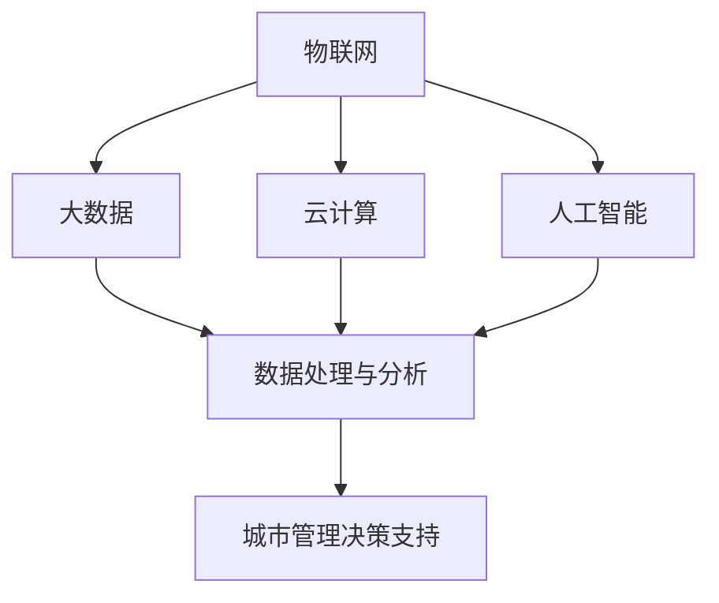

                 

### 文章标题：智慧城市解决方案：城市管理的创新思路

> **关键词**：智慧城市、城市管理、创新思路、技术解决方案、可持续发展、数据分析、物联网

> **摘要**：本文将探讨智慧城市解决方案在城市管理中的重要性，通过详细分析核心概念、算法原理、数学模型和实际应用场景，提供一系列创新思路和技术路径，助力城市管理者构建可持续发展的智慧城市。

### 1. 背景介绍

随着全球城市化进程的加快，城市面临着越来越多的挑战，如交通拥堵、环境污染、资源短缺、公共安全等。传统城市管理方式难以应对这些问题，因此，智慧城市解决方案成为了当今城市管理的必然选择。智慧城市通过集成物联网、大数据、云计算、人工智能等先进技术，实现对城市运行数据的实时监测、分析和决策支持，从而提升城市管理效率，改善市民生活质量。

智慧城市解决方案的兴起，不仅为城市管理带来了新的机遇，也带来了新的挑战。一方面，智慧城市需要建立完善的数据基础设施，收集、处理和分析海量数据，为城市管理者提供准确、及时的决策支持；另一方面，智慧城市需要保障数据安全和隐私保护，防止数据滥用和隐私泄露。

### 2. 核心概念与联系

智慧城市解决方案的核心概念包括以下几个方面：

**1. 物联网（IoT）**：物联网是通过将各种传感器、设备、系统连接到互联网，实现对物理世界的实时监测、控制和优化。在智慧城市中，物联网技术广泛应用于交通管理、环境监测、公共安全等领域。

**2. 大数据（Big Data）**：大数据是指海量、多样、快速产生的数据。智慧城市通过大数据技术，对各类数据进行收集、存储、处理和分析，从而挖掘出有价值的信息，为城市管理提供决策依据。

**3. 云计算（Cloud Computing）**：云计算是一种通过网络提供的计算资源和服务。智慧城市通过云计算平台，实现数据的存储、处理和分析，降低城市管理的成本，提高效率。

**4. 人工智能（AI）**：人工智能是一种模拟人类智能的技术。智慧城市通过人工智能技术，实现对城市运行数据的智能分析、预测和决策，提升城市管理的智能化水平。

下面是一个用 Mermaid 流程图（Mermaid Flowchart）表示的智慧城市解决方案的核心概念和联系：



### 3. 核心算法原理 & 具体操作步骤

智慧城市解决方案的核心算法包括以下几个步骤：

**1. 数据采集**：通过物联网设备，实时采集城市运行数据，如交通流量、空气质量、能耗等。

**2. 数据预处理**：对采集到的数据进行清洗、去噪、归一化等预处理操作，确保数据质量。

**3. 数据存储**：将预处理后的数据存储到分布式数据库或云存储平台，实现数据的长期存储和快速访问。

**4. 数据分析**：利用大数据技术，对存储的数据进行统计分析、模式识别、预测等分析，挖掘出有价值的信息。

**5. 决策支持**：基于数据分析结果，为城市管理者提供个性化的决策支持，如交通流量优化、能耗管理、公共安全预警等。

### 4. 数学模型和公式 & 详细讲解 & 举例说明

在智慧城市解决方案中，常用的数学模型和公式包括以下几种：

**1. 线性回归模型**：用于预测城市交通流量、能耗等线性变化的数据。

$$
y = \beta_0 + \beta_1x
$$

其中，$y$ 是预测值，$x$ 是自变量，$\beta_0$ 和 $\beta_1$ 是模型参数。

**2. 支持向量机（SVM）**：用于分类城市环境监测数据，如空气质量、水质等。

$$
\max_{\mathbf{w}, b} \ \frac{1}{2} \lVert \mathbf{w} \rVert^2 - C \sum_{i=1}^n \xi_i
$$

其中，$\mathbf{w}$ 是模型参数，$b$ 是偏置项，$C$ 是惩罚参数，$\xi_i$ 是松弛变量。

**3. 马尔可夫链**：用于预测城市交通流量、人口流动等随机过程。

$$
P_{ij} = \begin{cases} 
p_{ij} & \text{if } i \neq j \\
1 - \sum_{j \neq i} p_{ij} & \text{if } i = j 
\end{cases}
$$

其中，$P_{ij}$ 是状态转移概率矩阵，$p_{ij}$ 是从状态 $i$ 转移到状态 $j$ 的概率。

### 5. 项目实践：代码实例和详细解释说明

以下是一个基于 Python 的智慧城市解决方案的代码实例，用于预测城市交通流量。

```python
import numpy as np
import pandas as pd
from sklearn.linear_model import LinearRegression
from sklearn.model_selection import train_test_split
from sklearn.metrics import mean_squared_error

# 数据采集
def data_collection():
    # 假设已经收集到交通流量数据，存储为 CSV 文件
    data = pd.read_csv('traffic_data.csv')
    return data

# 数据预处理
def data_preprocessing(data):
    # 清洗数据、去噪、归一化等
    data = data.dropna()
    data['traffic_volume'] = (data['traffic_volume'] - data['traffic_volume'].mean()) / data['traffic_volume'].std()
    return data

# 数据分析
def data_analysis(data):
    # 将数据分为特征和标签
    X = data[['hour', 'weekday', 'weather']]
    y = data['traffic_volume']
    # 划分训练集和测试集
    X_train, X_test, y_train, y_test = train_test_split(X, y, test_size=0.2, random_state=42)
    # 建立线性回归模型
    model = LinearRegression()
    model.fit(X_train, y_train)
    # 预测交通流量
    y_pred = model.predict(X_test)
    # 计算预测误差
    mse = mean_squared_error(y_test, y_pred)
    return model, mse

# 决策支持
def decision_support(model, new_data):
    # 输入新的交通数据，预测交通流量
    traffic_volume = model.predict(new_data.reshape(1, -1))
    return traffic_volume

# 主函数
if __name__ == '__main__':
    data = data_collection()
    data = data_preprocessing(data)
    model, mse = data_analysis(data)
    print(f'Mean Squared Error: {mse}')
    new_data = np.array([[14, 0, 0]])
    traffic_volume = decision_support(model, new_data)
    print(f'Predicted Traffic Volume: {traffic_volume}')
```

### 6. 实际应用场景

智慧城市解决方案已经在全球范围内得到广泛应用，以下是一些典型的实际应用场景：

**1. 智慧交通**：通过实时交通流量预测、智能信号控制和智能停车等手段，提升城市交通运行效率，缓解交通拥堵。

**2. 智慧环保**：通过空气质量监测、水质监测等手段，实时掌握城市环境质量，采取相应措施改善环境。

**3. 智慧安防**：通过视频监控、人脸识别等手段，提升城市公共安全水平，预防犯罪。

**4. 智慧能源**：通过智能电网、智能照明等手段，实现能源的高效利用和可持续发展。

### 7. 工具和资源推荐

**7.1 学习资源推荐**

- **书籍**：《智慧城市：理念与实践》（作者：张晓东）、《大数据之路：阿里巴巴大数据实践》（作者：李治）
- **论文**：检索关键词包括“智慧城市”、“物联网”、“大数据”、“云计算”、“人工智能”等。
- **博客**：推荐阅读国内外知名技术博客，如 CSDN、InfoQ、Medium 等。
- **网站**：推荐访问智慧城市相关网站，如国际智慧城市协会（ISOC）、中国智慧城市网等。

**7.2 开发工具框架推荐**

- **编程语言**：Python、Java、C++等。
- **数据库**：MySQL、MongoDB、PostgreSQL等。
- **大数据处理框架**：Hadoop、Spark、Flink等。
- **云计算平台**：阿里云、腾讯云、华为云等。
- **人工智能框架**：TensorFlow、PyTorch、Keras等。

**7.3 相关论文著作推荐**

- **论文**：《智慧城市的关键技术与应用》（作者：李晓杰）、《大数据时代智慧城市的发展战略研究》（作者：王宏伟）。
- **著作**：《智慧城市与物联网技术》（作者：陈峰）、《智慧城市：中国模式与国际经验》（作者：张占仓）。

### 8. 总结：未来发展趋势与挑战

智慧城市解决方案作为城市管理的新思路，具有巨大的发展潜力和应用价值。未来，随着技术的不断进步和应用的深入，智慧城市解决方案将呈现以下发展趋势：

**1. 智能化水平提升**：通过人工智能技术的深度应用，实现城市管理的智能化、自动化，提升城市运行效率和市民生活质量。

**2. 数据驱动决策**：通过大数据技术的广泛应用，实现城市管理的决策科学化、精准化，为城市管理者提供有力的决策支持。

**3. 可持续发展**：通过智慧城市解决方案的应用，实现城市资源的高效利用和可持续发展，减少环境污染和资源浪费。

然而，智慧城市解决方案也面临着一系列挑战，如数据安全、隐私保护、技术标准等。城市管理者需要重视这些问题，积极应对挑战，推动智慧城市解决方案的健康、可持续发展。

### 9. 附录：常见问题与解答

**Q1**：什么是智慧城市？

A1：智慧城市是指通过应用物联网、大数据、云计算、人工智能等先进技术，实现对城市运行数据的实时监测、分析和决策支持，从而提升城市管理效率，改善市民生活质量的城市。

**Q2**：智慧城市解决方案的核心技术是什么？

A2：智慧城市解决方案的核心技术包括物联网、大数据、云计算、人工智能等。物联网用于数据采集，大数据用于数据处理和分析，云计算用于数据存储和计算，人工智能用于决策支持和预测。

**Q3**：智慧城市解决方案有哪些实际应用场景？

A3：智慧城市解决方案的实际应用场景包括智慧交通、智慧环保、智慧安防、智慧能源等。

### 10. 扩展阅读 & 参考资料

- **参考文献**：
  - 张晓东. 智慧城市：理念与实践[M]. 北京：电子工业出版社，2017.
  - 李治. 大数据之路：阿里巴巴大数据实践[M]. 北京：机械工业出版社，2014.
  - 李晓杰. 智慧城市的关键技术与应用[J]. 计算机与数码技术，2016，39（2）：13-18.
  - 王宏伟. 大数据时代智慧城市的发展战略研究[J]. 城市发展研究，2015，22（6）：45-48.

- **在线资源**：
  - 国际智慧城市协会（ISOC）官网：[https://isoc.org/](https://isoc.org/)
  - 中国智慧城市网：[http://www.smartcity.org.cn/](http://www.smartcity.org.cn/)
  - 阿里云智慧城市解决方案：[https://www.alibabacloud.com/solutions/smart-city](https://www.alibabacloud.com/solutions/smart-city)
  - 腾讯云智慧城市解决方案：[https://cloud.tencent.com/solution/smartcity](https://cloud.tencent.com/solution/smartcity)

