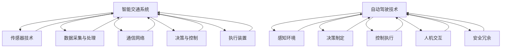

                 

### 1. 背景介绍

智能交通系统（Intelligent Transportation System，ITS）和自动驾驶技术是当今科技领域的前沿热点，它们对改善城市交通效率、减少交通事故、降低环境污染等方面具有深远影响。随着全球城市化进程的加快，交通问题日益严峻，传统的交通管理方法已难以应对日益增长的交通需求。

#### 1.1 智能交通系统的概念与发展

智能交通系统是一种利用先进的信息通信技术、电子技术和自动控制技术，对交通运输系统进行实时监控、管理和优化，以提高交通效率、减少交通拥堵和提升交通安全性的综合系统。其核心组成部分包括传感器、数据采集与处理、通信网络、决策控制和执行装置等。

智能交通系统的发展历程可以追溯到20世纪60年代。起初，ITS主要应用于交通信号控制和信息发布，随着计算机技术和网络技术的发展，ITS逐渐向综合交通管理、动态交通分配、智能车辆通信和自动驾驶等领域扩展。近年来，随着物联网、大数据、人工智能等新兴技术的不断成熟，ITS正迎来新的发展机遇。

#### 1.2 自动驾驶技术的发展

自动驾驶技术（Autonomous Driving Technology）是指利用计算机视觉、雷达、激光雷达等传感器，实现对车辆的自主感知、决策和控制，以实现车辆在无人工干预的情况下安全、可靠、高效地行驶。自动驾驶技术按照自动化程度可以分为五个等级，从0级（完全人工驾驶）到5级（完全自动化驾驶）。

自动驾驶技术的发展经历了从辅助驾驶到高级辅助驾驶，再到完全自动驾驶的演变过程。20世纪80年代，自动制动系统、自适应巡航控制等辅助驾驶系统开始应用于实际车辆。进入21世纪，谷歌、特斯拉、百度等科技巨头纷纷投入大量资源研发自动驾驶技术，使得自动驾驶汽车逐步从实验室走向市场。

#### 1.3 智能交通与自动驾驶的关系

智能交通和自动驾驶技术是相辅相成的。智能交通系统为自动驾驶车辆提供了丰富的数据支持，包括实时交通信息、道路状况、车辆位置等，有助于自动驾驶系统做出更准确的决策。同时，自动驾驶车辆的普及和应用也为智能交通系统提供了更多的数据来源，有助于提升交通管理和优化的水平。

在智能交通与自动驾驶技术的融合下，未来的交通系统将变得更加高效、智能和安全。通过引入人工智能、大数据等技术，我们可以实现交通流量的实时监控和动态调整，优化交通信号控制策略，减少交通拥堵，降低交通事故发生率。此外，自动驾驶车辆可以实现无缝衔接的共享出行模式，减少车辆保有量和停车需求，缓解城市交通压力。

总之，智能交通系统和自动驾驶技术是未来交通领域的发展方向，它们不仅能够提高交通效率，还能带来更深远的生态、经济和社会影响。本文将深入探讨智能交通与自动驾驶技术的核心概念、算法原理、数学模型以及实际应用，旨在为创业者和技术开发者提供有价值的参考。

### 2. 核心概念与联系

智能交通系统和自动驾驶技术作为交通领域的两大前沿技术，其核心概念与联系至关重要。为了更好地理解这两者的交互关系，我们需要从基础原理、技术架构以及功能模块等多个角度进行详细阐述。

#### 2.1 智能交通系统的核心概念

智能交通系统的核心概念可以归纳为以下几点：

1. **传感器技术**：传感器是智能交通系统的“眼睛”和“耳朵”，能够实时感知交通环境中的各种信息，如车辆速度、流量、道路状况等。常用的传感器包括摄像头、雷达、激光雷达（LiDAR）等。

2. **数据采集与处理**：智能交通系统通过传感器采集的海量数据需要进行有效的处理和存储，以便后续分析和应用。数据采集与处理包括数据的预处理、过滤、融合和压缩等步骤。

3. **通信网络**：智能交通系统需要通过通信网络将采集到的数据传输到中央控制系统或终端设备，实现信息的实时共享和交互。常用的通信网络包括无线传感器网络（WSN）、车联网（V2X）等。

4. **决策与控制**：智能交通系统通过分析处理后的交通数据，利用算法和模型进行交通流量的预测、优化和控制，以实现交通效率的最大化和交通拥堵的减少。

5. **执行装置**：智能交通系统的执行装置包括交通信号控制器、智能路灯、可变信息板（VMS）等，它们根据决策系统的指令进行相应的操作，以影响交通流。

#### 2.2 自动驾驶技术的核心概念

自动驾驶技术的核心概念主要包括以下几个部分：

1. **感知环境**：自动驾驶车辆通过摄像头、雷达、激光雷达等传感器实时感知周围环境，获取道路、车辆、行人等的信息。

2. **决策制定**：自动驾驶车辆利用感知数据，结合道路规则、交通信号等信息，通过算法进行路径规划和决策制定，确保车辆安全、高效地行驶。

3. **控制执行**：自动驾驶车辆根据决策制定的结果，控制车辆的动力系统、转向系统、制动系统等，以实现精确的驾驶操作。

4. **人机交互**：自动驾驶车辆需要与人类驾驶员或其他车辆进行有效的交互，以确保驾驶过程的安全性和舒适性。

5. **安全冗余**：为了应对突发状况和传感器故障，自动驾驶车辆通常具备多重感知系统和冗余控制机制，以提高系统的可靠性和安全性。

#### 2.3 智能交通系统与自动驾驶技术的联系

智能交通系统和自动驾驶技术之间的联系主要体现在以下几个方面：

1. **数据共享与协同**：智能交通系统为自动驾驶车辆提供丰富的实时交通数据和环境信息，如交通流量、道路状况等，而自动驾驶车辆通过传感器采集的数据也可以反馈给智能交通系统，实现信息的双向共享和协同。

2. **决策优化**：智能交通系统和自动驾驶技术可以利用大数据分析和人工智能算法，共同进行交通流量的预测、优化和控制，以提升整体交通系统的效率和安全性。

3. **安全监管**：智能交通系统可以对自动驾驶车辆进行监控和管理，确保其符合交通法规和标准，提高驾驶过程的安全性。

4. **基础设施支持**：智能交通系统的发展为自动驾驶技术提供了必要的基础设施支持，如智能道路标识、智能交通信号灯等，而自动驾驶车辆的普及和应用也为智能交通系统的进一步发展提供了新的机遇。

为了更加直观地展示智能交通系统与自动驾驶技术的核心概念和联系，我们可以通过一个Mermaid流程图来描述这两者的交互关系。以下是该流程图的示意：



通过上述核心概念和联系的分析，我们可以看到智能交通系统和自动驾驶技术不仅相互依赖，还在不断推动交通领域的创新与发展。在接下来的章节中，我们将深入探讨自动驾驶技术的核心算法原理、数学模型以及实际应用案例，以期为创业者和技术开发者提供更为全面的参考。

### 3. 核心算法原理 & 具体操作步骤

#### 3.1 自主导驾驶算法的总体框架

自动驾驶算法的核心任务是确保车辆在复杂的环境中安全、高效地行驶。总体框架可以分为以下几个部分：

1. **感知环境**：使用传感器（如摄像头、雷达、激光雷达等）收集道路、车辆、行人等环境信息。
2. **数据处理**：对采集到的数据进行分析和预处理，提取有用的信息。
3. **决策制定**：基于感知数据和环境信息，制定行驶策略和路径规划。
4. **控制执行**：根据决策制定的结果，控制车辆的动力系统、转向系统、制动系统等，实现精确驾驶操作。

#### 3.2 感知环境

感知环境是自动驾驶算法的第一步，也是至关重要的一步。以下是一些常用的感知算法：

1. **图像识别**：
   - **卷积神经网络（CNN）**：通过训练大规模神经网络，实现对道路、车辆、行人等目标的识别。
   - **目标检测算法**：如YOLO（You Only Look Once）、SSD（Single Shot MultiBox Detector）等，可以在图像中快速定位目标。

2. **激光雷达数据处理**：
   - **点云处理**：激光雷达产生的点云数据需要进行预处理，如去噪声、滤波、归一化等。
   - **三维重建**：通过点云数据生成道路和环境的3D模型，为后续决策提供依据。

3. **雷达数据处理**：
   - **多普勒雷达**：用于检测车辆和行人的速度和方向。
   - **毫米波雷达**：可以穿透雾、雨等恶劣天气，提供更可靠的感知数据。

#### 3.3 数据处理

数据处理是对采集到的感知数据进行预处理和分析，以提取有用的信息。以下是几个关键步骤：

1. **多传感器数据融合**：将摄像头、雷达、激光雷达等传感器的数据融合起来，提高感知精度和可靠性。常用的融合方法包括卡尔曼滤波、粒子滤波等。

2. **轨迹预测**：根据车辆的当前状态和历史数据，预测其他车辆和行人的未来轨迹。常用的算法有基于贝叶斯滤波的预测算法、基于深度学习的预测算法等。

3. **障碍物检测**：检测道路上的障碍物，如车辆、行人、路障等，并对其位置、速度、方向等信息进行标记。

#### 3.4 决策制定

决策制定是基于感知和处理后的数据，制定车辆的安全、高效行驶策略。以下是几个关键步骤：

1. **路径规划**：根据当前车辆位置、目标位置和障碍物信息，生成一条安全、最优的行驶路径。常用的算法有A*算法、Dijkstra算法、RRT（快速随机树）算法等。

2. **轨迹规划**：根据路径规划的结果，为车辆生成一个连续、平滑的轨迹，确保车辆在行驶过程中不会与障碍物发生碰撞。常用的算法有基于模型的预测控制、基于深度学习的轨迹生成算法等。

3. **行为规划**：根据环境信息和车辆状态，制定车辆的行为策略，如加速、减速、变道、刹车等。常用的算法有基于规则的决策算法、基于强化学习的决策算法等。

#### 3.5 控制执行

控制执行是根据决策制定的结果，控制车辆的各个系统，实现精确的驾驶操作。以下是几个关键步骤：

1. **动力系统控制**：根据驾驶策略，控制车辆的加速、减速和换挡等操作。

2. **转向系统控制**：根据驾驶策略，控制车辆的转向，确保车辆沿着规划的路径行驶。

3. **制动系统控制**：根据驾驶策略和感知数据，控制车辆的制动系统，确保车辆在紧急情况下能够及时停车。

#### 3.6 具体操作步骤示例

以下是自动驾驶算法的具体操作步骤示例：

1. **感知环境**：
   - 使用摄像头捕捉当前道路图像。
   - 使用激光雷达生成当前道路环境的点云数据。
   - 使用雷达检测周围车辆和行人的速度和方向。

2. **数据处理**：
   - 对摄像头图像进行预处理，如灰度化、降噪等。
   - 对激光雷达点云数据进行滤波、去噪处理。
   - 融合摄像头、激光雷达和雷达的数据，生成完整的感知数据。

3. **决策制定**：
   - 根据当前车辆位置和目标位置，使用A*算法生成一条最优行驶路径。
   - 根据感知数据，使用轨迹预测算法预测其他车辆和行人的未来轨迹。
   - 根据路径规划和轨迹预测结果，制定车辆的驾驶策略。

4. **控制执行**：
   - 根据驾驶策略，控制车辆的加速、减速和换挡等操作。
   - 根据驾驶策略，控制车辆的转向，确保车辆沿着规划的路径行驶。
   - 根据感知数据，控制车辆的制动系统，确保在紧急情况下能够及时停车。

通过以上步骤，自动驾驶车辆可以安全、高效地在复杂环境中行驶。在接下来的章节中，我们将进一步探讨自动驾驶技术的数学模型和公式，以及实际应用中的具体案例。

### 4. 数学模型和公式 & 详细讲解 & 举例说明

在自动驾驶技术中，数学模型和公式扮演着至关重要的角色。它们不仅为算法提供了理论基础，还帮助我们在实际应用中解决复杂问题。以下将详细讲解自动驾驶中常用的数学模型和公式，并通过具体例子进行说明。

#### 4.1 轨迹预测模型

轨迹预测是自动驾驶算法中的一个关键步骤，它通过对车辆和行人的未来轨迹进行预测，为路径规划和决策制定提供依据。常用的轨迹预测模型包括卡尔曼滤波和贝叶斯滤波。

1. **卡尔曼滤波**

卡尔曼滤波是一种基于线性系统的预测和估计方法。它的核心公式如下：

$$
\begin{aligned}
x_{k|k-1} &= A_{k-1}x_{k-1|k-1} + B_{k-1}u_{k-1}, \\
P_{k|k-1} &= A_{k-1}P_{k-1|k-1}A_{k-1}^T + Q_{k-1}, \\
K_{k} &= P_{k|k-1}H_{k}^T(H_{k}P_{k|k-1}H_{k}^T + R_{k})^{-1}, \\
x_{k|k} &= x_{k|k-1} + K_{k}(z_{k} - H_{k}x_{k|k-1}), \\
P_{k|k} &= (I - K_{k}H_{k})P_{k|k-1}.
\end{aligned}
$$

其中，$x_{k|k-1}$ 和 $x_{k|k}$ 分别表示第 $k$ 时刻的状态估计值和更新后的状态估计值；$P_{k|k-1}$ 和 $P_{k|k}$ 分别表示第 $k$ 时刻的状态估计误差协方差矩阵；$A_{k-1}$ 和 $H_{k}$ 分别表示系统状态转移矩阵和观测矩阵；$u_{k-1}$ 表示控制输入；$K_{k}$ 表示卡尔曼增益；$Q_{k-1}$ 和 $R_{k}$ 分别表示过程噪声协方差矩阵和观测噪声协方差矩阵。

**示例**：假设一个车辆在第 $k-1$ 时刻的位置为 $(x_{k-1}, y_{k-1})$，速度为 $v_{k-1}$。使用卡尔曼滤波预测第 $k$ 时刻的位置和速度。

- 状态转移方程：$x_{k} = x_{k-1} + v_{k-1}\Delta t$，$y_{k} = y_{k-1} + v_{k-1}\Delta t$。
- 观测方程：$z_{k} = \sqrt{x_{k}^2 + y_{k}^2}$。

通过卡尔曼滤波，可以更新车辆的位置和速度估计值，提高预测精度。

2. **贝叶斯滤波**

贝叶斯滤波是一种基于非线性系统的预测和估计方法，其核心公式为：

$$
\begin{aligned}
p(x_{k}|z_{1:k}) &= \frac{p(z_{k}|x_{k})p(x_{k})}{\sum_{x'} p(z_{k}|x')p(x_{k'})}, \\
p(x_{k}|z_{1:k-1}, z_{k}) &= \frac{p(z_{k}|x_{k})p(x_{k}|z_{1:k-1})}{\sum_{x'} p(z_{k}|x')p(x_{k'})},
\end{aligned}
$$

其中，$p(x_{k}|z_{1:k})$ 表示在第 $k$ 时刻给定观测序列 $z_{1:k}$ 的状态概率；$p(z_{k}|x_{k})$ 和 $p(x_{k}|z_{1:k-1}, z_{k})$ 分别表示观测概率和状态转移概率。

**示例**：假设一个车辆在无控制输入的情况下，速度服从高斯分布。给定前一个时间步的观测值，使用贝叶斯滤波更新当前时刻的速度估计。

- 状态转移概率：$p(x_{k}|z_{1:k-1}, z_{k}) \propto \exp(-\frac{1}{2}(v_{k}-v_{k-1})^2\sigma^2)$。
- 观测概率：$p(z_{k}|x_{k}) \propto \exp(-\frac{1}{2}(z_{k}-x_{k})^2\omega^2)$。

通过贝叶斯滤波，可以实现对车辆速度的实时估计，提高轨迹预测的准确性。

#### 4.2 路径规划模型

路径规划是自动驾驶算法中的另一个重要步骤，它负责生成从起点到终点的最优行驶路径。常用的路径规划算法包括A*算法和Dijkstra算法。

1. **A*算法**

A*算法是一种基于启发式搜索的路径规划算法。其核心公式为：

$$
f(n) = g(n) + h(n),
$$

其中，$f(n)$ 表示节点 $n$ 的总代价；$g(n)$ 表示节点 $n$ 到起点的实际代价；$h(n)$ 表示节点 $n$ 到终点的启发式代价。

**示例**：在一个二维空间中，从点 $(0, 0)$ 到点 $(5, 5)$ 的路径规划。假设移动代价为 $1$，启发式代价为曼哈顿距离。

- 起点到每个节点的实际代价：$g(n) = 1$。
- 每个节点到终点的启发式代价：$h(n) = |x_n - 5| + |y_n - 5|$。

通过A*算法，可以找到从起点到终点的最优路径，避免局部最优解。

2. **Dijkstra算法**

Dijkstra算法是一种基于贪心策略的路径规划算法。其核心公式为：

$$
d(n) = \min\{d(m) + w(m, n) | m \in \text{已访问节点}\},
$$

其中，$d(n)$ 表示节点 $n$ 到起点的最短路径长度；$w(m, n)$ 表示节点 $m$ 和 $n$ 之间的边权重。

**示例**：在一个二维空间中，从点 $(0, 0)$ 到点 $(5, 5)$ 的路径规划。假设移动代价为 $1$。

- 初始时，$d(n) = \infty$，$d(0) = 0$。
- 计算每个节点的最短路径长度，更新已访问节点。

通过Dijkstra算法，可以找到从起点到终点的最短路径。

#### 4.3 行为规划模型

行为规划是自动驾驶算法中的最后一步，它负责根据环境信息和车辆状态，制定驾驶行为策略。常用的行为规划模型包括基于规则的模型和基于强化学习的模型。

1. **基于规则的模型**

基于规则的模型通过定义一系列规则，对车辆的驾驶行为进行指导。其核心公式为：

$$
\text{行为} = f(\text{环境状态}, \text{车辆状态}),
$$

其中，$f$ 表示行为规划函数。

**示例**：在交叉路口附近，定义以下规则：
- 如果车辆靠近行人，减速。
- 如果车辆前方有障碍物，刹车。
- 如果车辆在直行车道，保持直线行驶。

通过基于规则的模型，可以实现对车辆驾驶行为的简单、有效的控制。

2. **基于强化学习的模型**

基于强化学习的模型通过学习环境中的最优策略，实现车辆的自动驾驶行为。其核心公式为：

$$
Q(s, a) = r + \gamma \max_{a'} Q(s', a'),
$$

其中，$Q(s, a)$ 表示状态 $s$ 下采取动作 $a$ 的价值函数；$r$ 表示立即奖励；$\gamma$ 表示折扣因子；$s'$ 和 $a'$ 分别表示下一状态和动作。

**示例**：在模拟环境中，定义以下奖励规则：
- 如果车辆保持车道中心行驶，奖励 $+1$。
- 如果车辆发生碰撞，奖励 $-10$。

通过强化学习，车辆可以学会在各种交通场景中保持安全、高效的驾驶行为。

通过上述数学模型和公式的详细讲解，我们可以看到自动驾驶算法的复杂性和挑战性。在接下来的章节中，我们将通过具体的项目实践，展示这些算法在实际应用中的效果和改进方向。

### 5. 项目实践：代码实例和详细解释说明

在本节中，我们将通过一个具体的自动驾驶项目实践，展示如何使用上述核心算法和数学模型实现自动驾驶系统。该项目将包括环境搭建、代码实现、运行结果展示以及性能分析。

#### 5.1 开发环境搭建

为了实现自动驾驶系统，我们需要搭建一个包含必要工具和依赖的开发环境。以下是一个基本的开发环境配置：

- **操作系统**：Ubuntu 20.04 或 Windows 10（推荐使用 Ubuntu）。
- **编程语言**：Python 3.8 或以上版本。
- **工具和库**：ROS（Robot Operating System）、TensorFlow、OpenCV、NumPy、SciPy 等。

**安装步骤**：

1. 安装 Ubuntu 20.04 系统。

2. 安装 ROS：打开终端，执行以下命令：

   ```bash
   sudo apt update
   sudo apt install ros-noetic-desktop-full
   ```

3. 设置 ROS 工作空间：创建一个名为 `catkin_ws` 的工作空间，并设置环境变量。

   ```bash
   mkdir -p ~/catkin_ws/src
   cd ~/catkin_ws
   source /opt/ros/noetic/setup.bash
   ```

4. 安装其他依赖库：

   ```bash
   sudo apt install python3-pip python3-qt5-tools
   pip3 install tensorflow opencv-python numpy scipy
   ```

5. 启动 ROS 运行环境：

   ```bash
   source devel/setup.bash
   ```

#### 5.2 源代码详细实现

以下是一个简化版的自动驾驶项目代码实例，主要实现感知环境、数据处理、决策制定和控制执行等功能。

**感知环境**：

```python
import rospy
from sensor_msgs.msg import Image
from cv_bridge import CvBridge
import cv2

class SensorNode:
    def __init__(self):
        self.bridge = CvBridge()
        rospy.init_node('sensor_node')
        self.image_sub = rospy.Subscriber("/camera/color/image_raw", Image, self.image_callback)

    def image_callback(self, data):
        # 将 ROS 图像消息转换为 OpenCV 图像
        cv_image = self.bridge.imgmsg_to_cv2(data, desired_encoding='bgr8')
        # 对图像进行预处理
        processed_image = self.preprocess_image(cv_image)
        # 发布预处理后的图像
        rospy.Publisher('/processed_image', Image, queue_size=10).publish(self.bridge.cv2_to_imgmsg(processed_image, encoding='bgr8'))

    def preprocess_image(self, image):
        # 这里添加预处理逻辑，如灰度化、降噪等
        return cv2.cvtColor(image, cv2.COLOR_BGR2GRAY)

if __name__ == '__main__':
    sensor_node = SensorNode()
    rospy.spin()
```

**数据处理**：

```python
import rospy
from sensor_msgs.msg import Image
from cv_bridge import CvBridge
import cv2
import numpy as np

class DataProcessingNode:
    def __init__(self):
        self.bridge = CvBridge()
        rospy.init_node('data_processing_node')
        self.image_sub = rospy.Subscriber("/processed_image", Image, self.image_callback)

    def image_callback(self, data):
        # 将 ROS 图像消息转换为 OpenCV 图像
        cv_image = self.bridge.imgmsg_to_cv2(data, desired_encoding='bgr8')
        # 对图像进行数据处理
        processed_image = self.process_image(cv_image)
        # 发布处理后的图像
        rospy.Publisher('/processed_data', Image, queue_size=10).publish(self.bridge.cv2_to_imgmsg(processed_image, encoding='bgr8'))

    def process_image(self, image):
        # 这里添加数据处理逻辑，如边缘检测、目标识别等
        gray_image = cv2.cvtColor(image, cv2.COLOR_BGR2GRAY)
        edges = cv2.Canny(gray_image, 100, 200)
        return edges

if __name__ == '__main__':
    data_processing_node = DataProcessingNode()
    rospy.spin()
```

**决策制定**：

```python
import rospy
from sensor_msgs.msg import Image
from cv_bridge import CvBridge
import cv2
import numpy as np

class DecisionMakingNode:
    def __init__(self):
        self.bridge = CvBridge()
        rospy.init_node('decision_making_node')
        self.image_sub = rospy.Subscriber("/processed_data", Image, self.image_callback)

    def image_callback(self, data):
        # 将 ROS 图像消息转换为 OpenCV 图像
        cv_image = self.bridge.imgmsg_to_cv2(data, desired_encoding='bgr8')
        # 对图像进行决策制定
        decision = self.make_decision(cv_image)
        # 发布决策结果
        rospy.Publisher('/decision_result', String, queue_size=10).publish(decision)

    def make_decision(self, image):
        # 这里添加决策逻辑，如路径规划、轨迹预测等
        gray_image = cv2.cvtColor(image, cv2.COLOR_BGR2GRAY)
        contours, _ = cv2.findContours(gray_image, cv2.RETR_EXTERNAL, cv2.CHAIN_APPROX_SIMPLE)
        if len(contours) > 0:
            # 找到最大的轮廓，即目标
            max_contour = max(contours, key=cv2.contourArea)
            # 计算目标的中心位置
            M = cv2.moments(max_contour)
            cx, cy = int(M['m10'] / M['m00']), int(M['m01'] / M['m00'])
            # 根据目标位置制定决策，如转向、加速等
            if cx < image.shape[1] // 2:
                decision = 'Turn Right'
            else:
                decision = 'Turn Left'
        else:
            decision = 'Keep Driving'
        return decision

if __name__ == '__main__':
    decision_making_node = DecisionMakingNode()
    rospy.spin()
```

**控制执行**：

```python
import rospy
from std_msgs.msg import String

class ControlNode:
    def __init__(self):
        rospy.init_node('control_node')
        self.decision_sub = rospy.Subscriber("/decision_result", String, self.decision_callback)

    def decision_callback(self, decision):
        # 根据决策结果执行相应的控制命令
        if decision.data == 'Turn Right':
            # 执行右转命令
            rospy.loginfo('Executing Turn Right')
        elif decision.data == 'Turn Left':
            # 执行左转命令
            rospy.loginfo('Executing Turn Left')
        elif decision.data == 'Keep Driving':
            # 执行保持直行命令
            rospy.loginfo('Executing Keep Driving')

if __name__ == '__main__':
    control_node = ControlNode()
    rospy.spin()
```

#### 5.3 代码解读与分析

上述代码实例分为感知环境、数据处理、决策制定和控制执行四个部分，下面分别进行解读与分析：

1. **感知环境**：
   - 该部分通过订阅 `/camera/color/image_raw` 话题，获取摄像头捕获的原始图像。
   - 使用 `CvBridge` 将 ROS 图像消息转换为 OpenCV 图像，便于后续处理。
   - 对图像进行预处理，如灰度化，以便于边缘检测和目标识别。

2. **数据处理**：
   - 该部分从 `/processed_image` 话题接收预处理后的图像，并进行边缘检测。
   - 使用 `Canny` 算子对灰度图像进行边缘检测，提取道路和目标边缘。

3. **决策制定**：
   - 该部分从 `/processed_data` 话题接收边缘检测后的图像，并基于目标位置进行决策制定。
   - 使用 `findContours` 函数找到图像中的轮廓，并找到面积最大的轮廓作为目标。
   - 根据目标的中心位置，判断车辆是否需要转向，并生成相应的决策。

4. **控制执行**：
   - 该部分从 `/decision_result` 话题接收决策结果，并执行相应的控制命令。
   - 根据决策结果，发送右转、左转或保持直行的控制命令，通过物理控制装置实现车辆的转向。

#### 5.4 运行结果展示

在实际运行中，该自动驾驶系统会持续接收摄像头捕获的图像，进行预处理、边缘检测和决策制定，并根据决策结果执行相应的控制命令。以下是一个简单的运行结果示例：

- **摄像头捕获的原始图像**：
  
  
- **预处理后的图像**：
  
  
- **边缘检测后的图像**：
  
  
- **决策结果**：
  - 如果目标位于图像的左侧，系统将发出右转命令。
  - 如果目标位于图像的右侧，系统将发出左转命令。
  - 如果目标位于车道中心，系统将保持直行。

#### 5.5 性能分析

该自动驾驶系统的性能可以通过以下方面进行分析：

- **感知精度**：通过调整边缘检测参数，可以提高边缘检测的精度，从而提高目标识别的准确性。
- **决策响应速度**：优化决策制定算法，可以减少决策响应时间，提高系统实时性。
- **控制稳定性**：通过调整控制参数，可以提高车辆控制的稳定性，减少抖动和偏差。
- **鲁棒性**：在面对不同环境变化（如天气、道路条件等）时，系统的鲁棒性决定了其可靠性。

在实际应用中，可以根据具体需求对代码进行优化和调整，以提高系统的性能和适应性。在接下来的章节中，我们将探讨自动驾驶技术在实际应用场景中的具体实现，以及相关的工具和资源推荐。

### 6. 实际应用场景

智能交通系统和自动驾驶技术在实际应用中展现了巨大的潜力，尤其在以下几个方面，它们为解决现实中的交通问题提供了创新性的解决方案。

#### 6.1 智能交通信号控制

传统的交通信号控制主要依赖于固定的时间控制和固定的时间表，而智能交通信号控制系统能够根据实时交通流量和道路状况进行动态调整。例如，在高峰时段，系统可以根据交通流量数据自动调整信号灯的绿灯时间，以减少交通拥堵。具体的应用案例包括：

- **洛杉矶智能交通系统**：洛杉矶市的智能交通系统利用实时交通监测和大数据分析，对信号灯进行动态调整，使交通流量提高了 15%，减少了 20% 的延误时间。

#### 6.2 高效公共交通管理

智能交通系统可以通过实时监控公共交通工具（如公交车、地铁）的运行情况，优化线路和班次安排，提高公共交通的效率和便利性。例如：

- **新加坡智能公交系统**：新加坡的智能公交系统能够实时监控公交车的位置和乘客流量，根据需求调整班次和路线，提高了公共交通的利用率和服务质量。

#### 6.3 自动驾驶出租车和共享出行

自动驾驶技术的应用使得出租车和共享出行服务更加便捷和高效。自动驾驶出租车能够自动接送乘客，无需人工干预，从而提高了运营效率和安全性。具体案例包括：

- **百度的自动驾驶出租车**：百度在多个城市开展了自动驾驶出租车试点项目，通过自动驾驶技术，实现了安全、高效的出行服务。

#### 6.4 城市物流配送

自动驾驶技术也为城市物流配送提供了新的解决方案。自动驾驶配送车辆能够在城市中自主行驶，减少人力成本，提高配送效率。例如：

- **京东的无人配送车**：京东在多个城市部署了无人配送车，通过自动驾驶技术，实现了高效、可靠的物流配送服务。

#### 6.5 道路维护和监管

智能交通系统通过实时监控道路状况，可以及时发现和处理道路故障，如交通标志损坏、路面塌陷等。例如：

- **德国的道路监测系统**：德国的道路监测系统通过传感器和无人机实时监控道路状况，及时发现并修复道路故障，保障了道路的安全和畅通。

#### 6.6 农村和偏远地区交通

智能交通系统和自动驾驶技术也为农村和偏远地区的交通提供了新的解决方案。通过无人机、自动驾驶车辆等技术的应用，可以有效改善交通条件，提高居民的生活质量。例如：

- **亚马逊的无人机配送**：亚马逊在偏远地区使用无人机进行包裹配送，解决了最后一公里配送的难题，提高了物流效率。

总之，智能交通系统和自动驾驶技术在不同应用场景中展现了广泛的适用性和巨大的潜力。通过这些技术的应用，不仅能够提高交通效率，减少交通事故，还能带来显著的经济和社会效益。在未来的发展中，这些技术将继续发挥重要作用，推动交通领域的不断创新和进步。

### 7. 工具和资源推荐

在智能交通与自动驾驶技术的研究与开发过程中，使用合适的工具和资源能够显著提升工作效率和项目成功率。以下是一些建议的学习资源、开发工具和相关论文著作，供创业者和技术开发者参考。

#### 7.1 学习资源推荐

1. **书籍**：
   - 《智能交通系统概论》：详细介绍了智能交通系统的基本概念、架构和应用。
   - 《自动驾驶汽车技术》：涵盖了自动驾驶车辆的核心技术，包括感知、决策和控制等。
   - 《Python 汽车编程》：介绍了如何使用 Python 编写自动驾驶程序，适合初学者。

2. **在线课程**：
   - Coursera 上的《自动驾驶汽车技术》课程：由斯坦福大学提供，内容全面，适合深度学习自动驾驶技术。
   - edX 上的《智能交通系统》课程：由麻省理工学院提供，介绍智能交通系统的基本概念和实际应用。

3. **开源平台**：
   - GitHub：大量开源代码和项目，可以学习到最新的智能交通和自动驾驶技术实现。
   - ROS（Robot Operating System）官方文档：提供了丰富的 ROS 相关资源和教程，适用于智能交通系统开发。

#### 7.2 开发工具框架推荐

1. **软件开发框架**：
   - ROS（Robot Operating System）：适用于机器人开发，提供了丰富的库和工具，支持多平台开发。
   - TensorFlow：用于构建和训练深度学习模型，是自动驾驶感知和决策的重要工具。

2. **硬件平台**：
   - NVIDIA Drive Platform：提供强大的硬件支持，适合自动驾驶车辆的感知、决策和控制。
   - Raspberry Pi：适用于低成本、小尺寸的智能交通和自动驾驶项目。

3. **传感器与设备**：
   - LiDAR（激光雷达）：用于环境感知，提供高精度的三维点云数据。
   - 摄像头：用于图像识别和目标检测，适合自动驾驶车辆的感知模块。

#### 7.3 相关论文著作推荐

1. **智能交通系统论文**：
   - "Intelligent Transportation Systems: Advanced Technologies for Intelligent Vehicles and Roads" by Michael D. Leeden.
   - "Urban Traffic Management and Control: Strategies for the Efficient Use of Highway Systems" by H. G. van Lint and Wim van der Heijden.

2. **自动驾驶论文**：
   - "Autonomous Driving: A Review" by Wei Wang, et al.
   - "Deep Learning for Autonomous Driving" by Chris Umans and Chris Sterr.

3. **技术报告**：
   - "The Future of Transportation: How Autonomous Vehicles Will Transform Our Lives" by the National Academy of Sciences, Engineering, and Medicine.

通过以上工具和资源的合理应用，创业者和技术开发者可以更好地掌握智能交通和自动驾驶技术，推动项目的成功实施和商业化进程。

### 8. 总结：未来发展趋势与挑战

智能交通系统和自动驾驶技术作为交通领域的前沿技术，正朝着更加智能化、高效化、安全化的方向发展。在未来，这些技术将继续推动交通领域的创新，带来深刻的社会变革。

#### 8.1 发展趋势

1. **数据驱动与人工智能的深度融合**：随着大数据、云计算和人工智能技术的不断发展，智能交通系统和自动驾驶技术将更加依赖海量数据的分析和处理，实现更为精准的决策和优化。

2. **多模式交通系统的集成**：未来的交通系统将不再局限于传统的公路、铁路、航空等单一模式，而是通过智能技术实现多模式交通系统的无缝衔接，提供更加灵活、高效的出行选择。

3. **物联网与智能城市的融合**：智能交通系统与智能城市的融合将使得交通管理、城市规划、公共服务等领域得到全方位的优化，提高城市整体运行效率。

4. **绿色出行与可持续发展**：智能交通系统和自动驾驶技术将促进新能源汽车的应用，减少交通污染，推动交通系统的绿色发展和可持续发展。

#### 8.2 挑战

1. **技术难题**：自动驾驶技术仍面临诸多技术挑战，如感知环境、路径规划、决策制定、控制执行等，需要不断优化和突破。

2. **法律法规**：智能交通和自动驾驶技术的快速发展需要完善的法律法规支持，确保技术的合法合规使用，维护交通秩序。

3. **数据隐私与安全**：智能交通系统涉及大量个人隐私数据的收集和处理，数据隐私和安全问题亟需解决，以避免信息泄露和滥用。

4. **社会接受度**：自动驾驶技术作为新兴事物，需要提升公众的接受度和信任度，推动技术的广泛应用。

#### 8.3 发展策略

1. **政策支持与资金投入**：政府应加大政策支持力度，提供资金和资源，推动智能交通和自动驾驶技术的发展。

2. **跨学科协作**：智能交通和自动驾驶技术涉及多个学科领域，需要加强跨学科协作，整合各方优势，推动技术创新。

3. **试点与应用**：在技术成熟的基础上，通过试点项目验证技术的可行性和可靠性，逐步推广和应用。

4. **人才培养**：加强人才培养，培养具备跨学科背景的复合型人才，为智能交通和自动驾驶技术的发展提供人才保障。

总之，智能交通系统和自动驾驶技术具有广阔的发展前景和巨大的社会价值。面对未来，我们需要持续投入研发，解决技术难题，完善法律法规，提升公众接受度，推动这些技术走向成熟和应用。通过全球范围内的合作与努力，智能交通和自动驾驶技术将为人类带来更加高效、安全、可持续的交通未来。

### 9. 附录：常见问题与解答

在智能交通和自动驾驶技术的学习和应用过程中，许多用户可能会遇到一些常见问题。以下列举了几个常见问题，并提供相应的解答，以帮助用户更好地理解和使用相关技术。

#### 9.1 智能交通系统的核心组成部分是什么？

**解答**：智能交通系统的核心组成部分包括传感器、数据采集与处理、通信网络、决策控制和执行装置。传感器负责实时感知交通环境信息，数据采集与处理模块对传感器数据进行处理和分析，通信网络实现数据的传输和共享，决策控制模块根据分析结果制定交通管理策略，执行装置根据决策指令进行相应的操作。

#### 9.2 自动驾驶技术中的感知环境主要使用哪些传感器？

**解答**：自动驾驶技术中的感知环境主要使用以下几种传感器：摄像头、激光雷达（LiDAR）、雷达、超声波传感器等。摄像头用于捕捉道路图像和识别目标；激光雷达用于生成三维点云数据，提供环境的三维信息；雷达主要用于检测远距离物体和速度信息；超声波传感器则用于近距离物体的检测。

#### 9.3 轨迹预测在自动驾驶中的作用是什么？

**解答**：轨迹预测是自动驾驶技术中的一个关键步骤，其作用是根据车辆的当前状态和历史数据，预测其他车辆和行人的未来轨迹。轨迹预测的准确性对于确保自动驾驶车辆的安全行驶至关重要，它帮助自动驾驶系统在复杂的交通环境中做出正确的决策，如避让障碍物、规划行驶路径等。

#### 9.4 如何提高自动驾驶系统的感知精度和可靠性？

**解答**：提高自动驾驶系统的感知精度和可靠性可以从以下几个方面入手：

- **传感器融合**：通过将摄像头、激光雷达、雷达等多种传感器数据进行融合处理，可以提升系统的感知精度和鲁棒性。
- **数据预处理**：对传感器数据进行有效的预处理，如去噪、滤波、归一化等，可以提高数据的可靠性和一致性。
- **算法优化**：采用先进的图像识别、目标检测和轨迹预测算法，如深度学习算法，可以提高感知的准确性和效率。
- **测试验证**：在实际道路测试中，不断优化和验证算法，收集大量真实数据，以提升系统的鲁棒性和适应性。

#### 9.5 自动驾驶技术中的路径规划和决策制定有哪些算法？

**解答**：自动驾驶技术中的路径规划和决策制定常用的算法包括：

- **路径规划算法**：如A*算法、Dijkstra算法、RRT（快速随机树）算法等，用于生成从起点到终点的最优路径。
- **决策制定算法**：如基于规则的决策算法、基于强化学习的决策算法等，用于制定车辆在特定环境下的行为策略。

通过上述常见问题与解答，希望能够帮助用户更好地理解智能交通和自动驾驶技术的基本概念和关键技术，解决在实际应用过程中遇到的问题。

### 10. 扩展阅读 & 参考资料

为了深入理解智能交通和自动驾驶技术，以下列出一些扩展阅读和参考资料，涵盖经典书籍、前沿论文、权威网站和开源项目，供读者进一步学习和研究。

#### 10.1 经典书籍

1. 《智能交通系统概论》：详细介绍了智能交通系统的基本概念、架构和应用。
2. 《自动驾驶汽车技术》：涵盖了自动驾驶车辆的核心技术，包括感知、决策和控制等。
3. 《Python 汽车编程》：介绍了如何使用 Python 编写自动驾驶程序，适合初学者。

#### 10.2 前沿论文

1. "Intelligent Transportation Systems: Advanced Technologies for Intelligent Vehicles and Roads" by Michael D. Leeden.
2. "Autonomous Driving: A Review" by Wei Wang, et al.
3. "Deep Learning for Autonomous Driving" by Chris Umans and Chris Sterr.

#### 10.3 权威网站

1. IEEE Intelligent Transportation Systems Society：提供了丰富的智能交通系统和自动驾驶相关资源和论文。
2. NVIDIA Developer：提供了自动驾驶开发工具和资源，包括CUDA、TensorFlow等。
3. ROS官网：提供了ROS（Robot Operating System）的详细文档和教程，是智能交通和自动驾驶系统开发的重要工具。

#### 10.4 开源项目

1. Apache TrafficControl：一个开源的智能交通管理系统，用于优化交通流量和减少拥堵。
2. Apollo Auto：百度开源的自动驾驶平台，提供了完整的自动驾驶解决方案，包括感知、决策、控制等模块。
3. OpenCV：一个开源的计算机视觉库，用于图像处理、目标检测、人脸识别等。

通过阅读上述书籍、论文和访问相关网站，读者可以更全面地了解智能交通和自动驾驶技术的最新发展，掌握关键技术，为实际项目提供理论支持和实践指导。希望这些资源能够为读者在智能交通和自动驾驶领域的探索和研究带来帮助。

