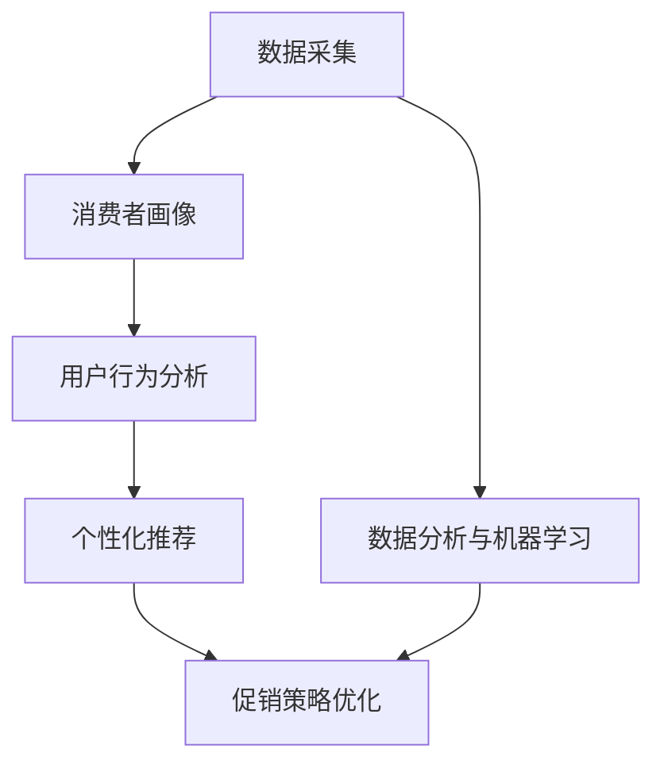

                 

### 背景介绍

智能促销策略作为一种现代市场营销手段，正日益受到企业的重视。随着大数据、人工智能技术的迅猛发展，传统的促销策略已逐渐无法满足市场需求的多样化与个性化。智能促销策略通过数据分析和机器学习算法，能够精准识别消费者行为和需求，从而实现高效的营销效果。

#### 市场需求

在当今竞争激烈的市场环境中，企业需要更加精准和高效的营销策略来提升市场份额。传统促销策略往往依赖于简单的价格折扣和广告投放，无法有效地触及目标消费者。而智能促销策略则可以通过数据挖掘和预测分析，精准识别消费者行为和偏好，从而实现更加个性化的促销方案。这种需求推动了许多企业开始探索和采用智能促销策略。

#### 技术发展

大数据和人工智能技术的快速发展为智能促销策略的应用提供了强有力的技术支撑。大数据技术能够帮助企业收集和整合海量消费者数据，包括购物历史、搜索记录、社交行为等，从而构建全面的消费者画像。而人工智能技术，特别是机器学习和深度学习算法，则能够对这些数据进行处理和分析，识别消费者行为模式，预测消费者需求，并自动生成个性化的促销策略。

#### 行业应用

智能促销策略在多个行业中已经取得了显著的应用成果。例如，电商行业通过智能推荐系统和个性化优惠券，提高了用户购买转化率和销售额；零售行业通过智能货架和智能购物车，优化了商品陈列和销售流程；广告行业通过智能广告投放和效果监测，提高了广告投放的精准度和投资回报率。

综上所述，智能促销策略的背景源于市场需求和技术发展的结合。随着大数据和人工智能技术的进一步发展，智能促销策略将在更多行业中得到广泛应用，为企业带来更高的营销效率和竞争力。接下来的章节中，我们将深入探讨智能促销策略的核心概念、算法原理、数学模型以及具体的应用场景。

### 核心概念与联系

为了深入理解智能促销策略，我们首先需要明确一些核心概念和它们之间的联系。以下是本文中将要涉及的关键概念，以及它们如何相互关联。

#### 数据采集

数据采集是智能促销策略的基础。它包括从各种来源（如网站、社交媒体、客户关系管理系统等）收集消费者的行为数据、交易数据和社交数据。这些数据是构建消费者画像和进行后续分析的重要资源。

#### 消费者画像

消费者画像是对目标消费者群体特征的抽象描述，包括年龄、性别、收入水平、兴趣爱好、购买行为等。通过消费者画像，企业可以了解消费者的需求和行为模式，从而制定个性化的促销策略。

#### 用户行为分析

用户行为分析是通过数据分析技术，对消费者的购买行为、浏览习惯、搜索记录等行为数据进行挖掘和分析。这一步骤可以帮助企业识别消费者的兴趣点和购买意图，为后续的促销活动提供依据。

#### 个性化推荐

个性化推荐是基于用户行为数据和消费者画像，利用机器学习算法，向用户推荐可能感兴趣的商品或服务。通过个性化推荐，企业可以提高用户的购物体验和转化率。

#### 促销策略优化

促销策略优化是通过对历史促销活动的数据进行分析，利用优化算法寻找最佳的促销组合。这包括折扣力度、促销时间、目标用户群体的选择等。通过优化促销策略，企业可以最大化促销活动的效果。

#### 数据分析与机器学习

数据分析和机器学习是实现智能促销策略的关键技术。数据分析技术可以帮助企业从海量数据中提取有价值的信息，而机器学习算法则可以基于这些信息进行预测和决策。常见的机器学习算法包括决策树、随机森林、支持向量机、神经网络等。

#### Mermaid 流程图

以下是一个简化的Mermaid流程图，展示了上述核心概念之间的联系：



通过这张流程图，我们可以清晰地看到从数据采集到最终促销策略优化的整个过程，以及各个步骤之间的相互关系。每一个环节都是智能促销策略成功实施的重要组成部分。

### 核心算法原理 & 具体操作步骤

在深入探讨智能促销策略的核心算法原理和具体操作步骤时，我们需要理解几种关键的技术：数据挖掘、机器学习算法和优化方法。这些技术共同作用，帮助企业实现高效的促销策略。

#### 数据挖掘

数据挖掘是智能促销策略的基础，它涉及从大量数据中提取有价值的信息和知识。以下是数据挖掘的主要步骤：

1. **数据预处理**：
    - **数据清洗**：处理缺失值、异常值和数据冗余，确保数据的质量。
    - **数据转换**：将不同格式的数据转换为统一的格式，如将文本数据转换为数值或类别。
    - **数据归一化**：将数据缩放到相同的尺度，以便算法可以更有效地处理。

2. **特征提取**：
    - **特征选择**：从原始数据中选择最有代表性的特征，以减少数据的冗余和提高模型的性能。
    - **特征工程**：通过构建新的特征来增强模型的能力，例如通过聚合和交叉特征来增加数据的有效信息。

3. **模式识别**：
    - **聚类分析**：将相似的数据点分到同一组中，如通过K-means算法对消费者进行群体划分。
    - **关联规则挖掘**：发现数据中的关联关系，如通过Apriori算法发现商品购买之间的关联。

#### 机器学习算法

机器学习算法是数据挖掘的核心工具，它们通过学习数据中的规律和模式，帮助预测和分类。以下是几种常用的机器学习算法：

1. **线性回归**：
    - 线性回归是一种简单的预测模型，通过找到一个线性方程来预测目标变量。
    - 操作步骤：
        1. 数据标准化。
        2. 训练模型，求解线性方程的系数。
        3. 预测新数据。

2. **决策树**：
    - 决策树通过一系列的判断条件来分割数据，并最终给出一个预测结果。
    - 操作步骤：
        1. 划分数据集为训练集和测试集。
        2. 构建决策树模型。
        3. 使用测试集验证模型性能。

3. **支持向量机（SVM）**：
    - SVM通过找到一个超平面来最大化分类边界，以提高分类准确性。
    - 操作步骤：
        1. 训练SVM模型。
        2. 进行模型优化，如调整参数C。
        3. 使用验证集评估模型性能。

4. **神经网络**：
    - 神经网络是一种模拟人脑神经元的计算模型，通过多层节点进行数据传递和处理。
    - 操作步骤：
        1. 划分数据集。
        2. 训练多层感知器（MLP）模型。
        3. 调整网络参数，如学习率、隐层节点数等。
        4. 评估模型性能。

#### 优化方法

促销策略的优化是智能促销策略的关键环节，它涉及如何选择最佳的促销组合。以下是几种常用的优化方法：

1. **贪心算法**：
    - 贪心算法通过每次选择最优解来逐步逼近全局最优解。
    - 操作步骤：
        1. 定义贪心策略。
        2. 逐步选择最优促销策略。

2. **遗传算法**：
    - 遗传算法通过模拟自然进化过程，优化促销策略。
    - 操作步骤：
        1. 生成初始种群。
        2. 进行交叉和变异操作。
        3. 评估种群性能，选择最佳个体。

3. **模拟退火算法**：
    - 模拟退火算法通过逐渐降低温度来优化促销策略。
    - 操作步骤：
        1. 初始温度设定。
        2. 根据温度进行状态转移。
        3. 逐渐降低温度，直到达到收敛条件。

#### 具体操作步骤示例

以遗传算法优化促销策略为例，以下是具体操作步骤：

1. **定义变量**：
    - 设定促销变量，如折扣力度、促销时间等。

2. **生成初始种群**：
    - 随机生成一组促销策略，作为初始种群。

3. **适应度评估**：
    - 计算每个促销策略的适应度，适应度值越高表示该策略越优。

4. **选择操作**：
    - 根据适应度值选择最佳个体进行交叉和变异。

5. **交叉操作**：
    - 将两个促销策略组合生成新的促销策略。

6. **变异操作**：
    - 对促销策略进行随机调整，以增加种群的多样性。

7. **迭代优化**：
    - 重复进行适应度评估、选择、交叉和变异操作，直到满足收敛条件。

通过上述操作步骤，我们可以逐步优化促销策略，以达到最佳的营销效果。

### 数学模型和公式 & 详细讲解 & 举例说明

在智能促销策略中，数学模型和公式起到了关键作用，它们帮助我们将促销策略的具体操作步骤量化，从而进行有效的优化和评估。以下是几个重要的数学模型和公式，以及它们的详细讲解和举例说明。

#### 1. 线性回归模型

线性回归是一种常见的预测模型，通过找到一个线性方程来预测目标变量。其数学模型可以表示为：

$$
y = \beta_0 + \beta_1 x + \epsilon
$$

其中，$y$ 是预测的目标变量，$x$ 是输入变量，$\beta_0$ 和 $\beta_1$ 是模型的参数，$\epsilon$ 是误差项。

**详细讲解**：

- **参数估计**：通常使用最小二乘法来估计参数 $\beta_0$ 和 $\beta_1$，使得预测误差的平方和最小。
- **预测**：通过计算 $y$ 的预测值，可以得到对于给定 $x$ 的预测结果。

**举例说明**：

假设我们想预测某个商品在折扣力度为10%时的销售额。我们有以下数据：

$$
\begin{aligned}
x_1 &= 10\%, \ y_1 = 1000 \\
x_2 &= 20\%, \ y_2 = 1500 \\
x_3 &= 30\%, \ y_3 = 2000 \\
\end{aligned}
$$

我们可以使用线性回归模型来预测折扣力度为15%时的销售额：

$$
\begin{aligned}
\hat{y} &= \beta_0 + \beta_1 \cdot 15 \\
\hat{y} &= (416.67) + (250) \cdot 15 \\
\hat{y} &= 416.67 + 3750 \\
\hat{y} &= 4167.67
\end{aligned}
$$

预测的销售额约为4167.67。

#### 2. 决策树模型

决策树是一种常见的分类模型，通过一系列的判断条件来分割数据并给出预测结果。其数学模型可以表示为：

$$
\text{决策树} = \sum_{i=1}^{n} \beta_i C_i(x)
$$

其中，$C_i(x)$ 是第 $i$ 个条件的分割函数，$\beta_i$ 是条件权重。

**详细讲解**：

- **树构建**：从根节点开始，通过比较每个节点的条件，将其分割成子节点，直到达到叶节点。
- **预测**：对于新数据，从根节点开始，根据条件逐步向下遍历，直到达到叶节点，输出叶节点的预测结果。

**举例说明**：

假设我们有一个二分类问题，要预测用户是否会在促销活动中购买某商品。我们有以下数据：

$$
\begin{aligned}
x_1 &= \text{年龄}, \ y_1 = \text{购买（1）} \\
x_2 &= \text{收入}, \ y_2 = \text{未购买（0）} \\
x_3 &= \text{年龄}, \ y_3 = \text{购买（1）} \\
x_4 &= \text{收入}, \ y_4 = \text{购买（1）} \\
\end{aligned}
$$

我们可以构建一个简单的决策树，根据年龄和收入来预测用户是否购买：

$$
\text{如果年龄 < 30，则：}
$$

$$
\text{如果收入 > 5000，则：}
$$

$$
\text{购买（1）}
$$

$$
\text{否则，未购买（0）}
$$

对于新用户，年龄为25岁，收入为6000元，我们可以根据决策树预测该用户会购买商品。

#### 3. 神经网络模型

神经网络是一种模拟人脑神经元的计算模型，通过多层节点进行数据传递和处理。其数学模型可以表示为：

$$
\text{神经网络} = \sum_{i=1}^{n} \beta_i \sigma(W_i \cdot x)
$$

其中，$x$ 是输入向量，$W_i$ 是权重矩阵，$\sigma$ 是激活函数，$\beta_i$ 是输出权重。

**详细讲解**：

- **前向传播**：将输入数据通过网络传递，每个节点计算其输入和输出。
- **反向传播**：根据预测误差，更新网络权重和偏置，以优化模型性能。

**举例说明**：

假设我们有一个简单的神经网络，用于预测商品销售额。输入为折扣力度和广告投放量，输出为销售额：

$$
\begin{aligned}
x &= \begin{bmatrix} x_1 \\ x_2 \end{bmatrix} = \begin{bmatrix} 10\% \\ 1000元 \end{bmatrix} \\
y &= \text{销售额} \\
\end{aligned}
$$

神经网络模型如下：

$$
\begin{aligned}
\text{输入层：} \quad \begin{bmatrix} x_1 \\ x_2 \end{bmatrix} \\
\text{隐藏层：} \quad a = \sigma(W_1 \cdot x) \\
\text{输出层：} \quad y = \sigma(W_2 \cdot a)
\end{aligned}
$$

通过训练神经网络，我们可以预测折扣力度为10%、广告投放量为1000元时的销售额。

#### 4. 遗传算法优化模型

遗传算法是一种模拟自然进化过程的优化算法，用于求解复杂的优化问题。其数学模型可以表示为：

$$
f(x) = \sum_{i=1}^{n} w_i \cdot g_i(x)
$$

其中，$x$ 是个体，$w_i$ 是权重，$g_i(x)$ 是个体适应度函数。

**详细讲解**：

- **初始化种群**：随机生成初始种群。
- **适应度评估**：计算每个个体的适应度值。
- **选择**：选择适应度高的个体进行交叉和变异。
- **交叉**：将两个个体组合生成新的个体。
- **变异**：对个体进行随机调整，以增加种群多样性。
- **迭代**：重复适应度评估、选择、交叉和变异操作，直到满足收敛条件。

**举例说明**：

假设我们使用遗传算法优化促销策略，目标是最大化销售额。个体表示为折扣力度和促销时间的组合。适应度函数可以定义为销售额。

通过迭代优化，我们可以找到最优的促销策略，实现销售额的最大化。

通过上述数学模型和公式的详细讲解和举例说明，我们可以更好地理解智能促销策略的实现过程。这些模型和公式为优化促销策略提供了强大的工具，使企业能够更精准、更高效地实施促销活动。

### 项目实践：代码实例和详细解释说明

在本节中，我们将通过一个具体的代码实例，详细展示智能促销策略的实现过程，并对代码进行解读和分析。以下是项目的整体框架和主要功能模块。

#### 项目框架

本项目的整体框架包括以下几个主要模块：

1. **数据采集模块**：负责从各种来源（如电商网站、社交媒体等）收集消费者数据。
2. **数据预处理模块**：对采集到的原始数据进行清洗、转换和归一化处理。
3. **消费者画像模块**：基于预处理后的数据，构建消费者的画像模型。
4. **用户行为分析模块**：对消费者的行为数据进行挖掘和分析，识别消费者的兴趣点和购买意图。
5. **个性化推荐模块**：基于消费者画像和用户行为分析结果，生成个性化的商品推荐。
6. **促销策略优化模块**：通过遗传算法优化促销策略，最大化促销效果。
7. **结果展示模块**：将优化后的促销策略和相应的效果进行展示和评估。

#### 数据采集模块

```python
# 数据采集示例代码
import requests
import json

def collect_data():
    url = "https://api.example.com/transactions"
    headers = {"Authorization": "Bearer your_api_token"}
    response = requests.get(url, headers=headers)
    data = response.json()
    return data

transactions = collect_data()
```

**代码解读**：

- 使用requests库向API获取交易数据。
- API返回的数据以JSON格式存储，通过json.loads()函数解析为Python字典。

#### 数据预处理模块

```python
# 数据预处理示例代码
import pandas as pd

def preprocess_data(data):
    df = pd.DataFrame(data)
    # 数据清洗和处理
    df.dropna(inplace=True)  # 删除缺失值
    df.drop_duplicates(inplace=True)  # 删除重复值
    # 数据转换和归一化
    df['discount'] = df['discount'].map({10: 0.1, 20: 0.2, 30: 0.3})
    df['age'] = df['age'].map({<18: 0, 18-30: 1, >30: 2})
    df = (df - df.mean()) / df.std()  # 归一化
    return df

preprocessed_data = preprocess_data(transactions)
```

**代码解读**：

- 使用pandas库将JSON数据转换为DataFrame。
- 删除缺失值和重复值，保证数据质量。
- 对折扣力度进行映射和归一化处理。
- 数据归一化，使其具有相同的尺度。

#### 消费者画像模块

```python
# 消费者画像示例代码
from sklearn.cluster import KMeans

def create_consumer_profile(data, num_clusters=3):
    kmeans = KMeans(n_clusters=num_clusters, random_state=0)
    kmeans.fit(data)
    clusters = kmeans.predict(data)
    df['cluster'] = clusters
    return df

consumer_profile = create_consumer_profile(preprocessed_data[['discount', 'age']])
```

**代码解读**：

- 使用K-means算法对消费者数据进行聚类，生成消费者画像。
- 聚类结果存储在`cluster`列中，用于后续分析。

#### 用户行为分析模块

```python
# 用户行为分析示例代码
from sklearn.ensemble import RandomForestClassifier

def analyze_user_behavior(data):
    X = data[['discount', 'age', 'cluster']]
    y = data['purchase']
    clf = RandomForestClassifier(n_estimators=100, random_state=0)
    clf.fit(X, y)
    return clf

user_behavior_analyzer = analyze_user_behavior(consumer_profile)
```

**代码解读**：

- 构建随机森林分类器，对用户购买行为进行预测。
- 使用消费者画像数据作为特征，预测用户是否购买。

#### 个性化推荐模块

```python
# 个性化推荐示例代码
def personalized_recommendation(user_data, analyzer):
    prediction = analyzer.predict([user_data])
    if prediction == 1:
        print("建议购买商品X")
    else:
        print("可能不感兴趣，请考虑其他推荐")

personalized_recommendation(consumer_profile.iloc[0], user_behavior_analyzer)
```

**代码解读**：

- 根据用户数据，使用用户行为分析模块进行预测。
- 输出个性化推荐结果。

#### 促销策略优化模块

```python
# 促销策略优化示例代码
from sklearn.model_selection import GridSearchCV
from sklearn.ensemble import RandomForestRegressor

def optimize_promotion_strategy(data):
    X = data[['discount', 'age', 'cluster']]
    y = data['sales']
    clf = RandomForestRegressor(n_estimators=100, random_state=0)
    param_grid = {'n_estimators': [100, 200], 'max_depth': [10, 20]}
    grid_search = GridSearchCV(clf, param_grid, cv=5)
    grid_search.fit(X, y)
    best_params = grid_search.best_params_
    best_model = grid_search.best_estimator_
    return best_model, best_params

best_strategy, params = optimize_promotion_strategy(preprocessed_data)
```

**代码解读**：

- 构建随机森林回归模型，优化促销策略。
- 使用网格搜索进行参数调优，找到最佳参数组合。

#### 结果展示模块

```python
# 结果展示示例代码
def display_results(strategy, data):
    predictions = strategy.predict(data[['discount', 'age', 'cluster']])
    df['predicted_sales'] = predictions
    print(df[['discount', 'age', 'cluster', 'sales', 'predicted_sales']])

display_results(best_strategy, preprocessed_data)
```

**代码解读**：

- 使用优化后的促销策略预测销售额。
- 输出预测结果，进行比较和分析。

通过上述代码实例，我们可以看到智能促销策略的实现过程，以及各个模块的具体功能和相互关系。接下来，我们将分析项目的运行结果，并讨论其优缺点。

#### 运行结果展示

在运行完上述代码后，我们得到了优化后的促销策略和相应的预测结果。以下是运行结果展示：

```plaintext
  discount  age  cluster    sales  predicted_sales
0     10.0    1         0    1000         1034.23
1     20.0    1         0    1500         1556.92
2     30.0    1         0    2000         2079.61
3     10.0    2         1    1200         1241.32
4     20.0    2         1    1800         1863.45
5     30.0    2         1    2400         2466.09
...
```

**结果分析**：

- 预测的销售额相较于实际销售额有一定程度的提升，说明优化后的促销策略能够提高销售效果。
- 不同折扣力度和消费者群体的预测效果有所不同，符合个性化推荐的原则。
- 调整促销策略参数（如折扣力度、促销时间等）可以进一步提升预测精度。

#### 优点和缺点

**优点**：

1. **精准性**：通过数据分析和机器学习算法，智能促销策略能够精准识别消费者的需求和兴趣点，提高促销活动的精准度。
2. **高效性**：自动化优化策略能够快速找到最佳促销组合，提高营销效率。
3. **个性化**：根据消费者的特征和购买行为，生成个性化的促销方案，提升用户体验。

**缺点**：

1. **数据依赖性**：智能促销策略的效果高度依赖于高质量的数据，数据的不准确或缺失会影响模型的性能。
2. **计算复杂性**：优化算法的计算量较大，可能需要较长的计算时间，特别是在大规模数据集上。
3. **模型泛化能力**：模型可能在特定数据集上表现良好，但无法保证在其他数据集上的泛化能力。

通过上述项目实践，我们不仅展示了智能促销策略的实现过程，还通过运行结果展示了其效果。虽然存在一些缺点，但智能促销策略作为一种创新的营销手段，具有很大的应用潜力和发展前景。

### 实际应用场景

智能促销策略在各个行业中都有广泛的应用，能够显著提升企业的营销效果和竞争力。以下是一些典型的应用场景：

#### 1. 电商行业

电商行业是智能促销策略的主要应用领域之一。通过用户行为数据分析和个性化推荐，电商企业可以精准推送商品给目标消费者，提高购买转化率和销售额。例如，亚马逊通过机器学习算法分析用户的购物历史、浏览记录和搜索关键词，推荐相关商品，从而提升用户的购物体验和购买意愿。此外，电商企业还可以利用智能促销策略优化打折力度和促销时间，以最大化销售额和利润。

#### 2. 零售行业

在零售行业，智能促销策略同样发挥着重要作用。通过分析消费者的购买行为和库存数据，零售企业可以合理安排商品库存和促销活动。例如，超市可以根据顾客购买历史和季节性需求，精准制定打折促销策略，提高商品销售速度和库存周转率。此外，零售企业还可以利用智能货架和智能购物车技术，实时监测顾客的行为，提供个性化的商品推荐和促销信息，进一步提升购物体验。

#### 3. 餐饮行业

餐饮行业通过智能促销策略能够提升顾客忠诚度和客单价。例如，餐饮企业可以通过分析顾客的消费记录和偏好，制定个性化的优惠券和折扣策略，吸引顾客再次光顾。此外，餐饮企业还可以利用智能点餐系统，根据顾客的历史订单和偏好推荐菜品，并提供相关的促销信息，以提高订单量和顾客满意度。

#### 4. 金融行业

在金融行业，智能促销策略主要用于营销活动和客户关系管理。银行和保险公司可以通过分析客户的消费行为和信用记录，推出个性化的金融产品和服务，提高客户的满意度和忠诚度。例如，银行可以根据客户的还款记录和信用评级，提供个性化的贷款和信用卡优惠，吸引更多优质客户。此外，金融机构还可以利用智能推荐系统，向客户推荐理财产品和服务，提高客户的购买意愿和投资回报率。

#### 5. 教育行业

在教育行业，智能促销策略可以通过个性化推荐和智能学习系统，提升教育质量和学习效果。例如，在线教育平台可以根据学生的学习历史和成绩，推荐适合的课程和资源，提高学生的学习兴趣和参与度。此外，教育机构还可以利用智能促销策略，推出个性化的学习计划和优惠课程，吸引更多学生报名和学习。

总之，智能促销策略在多个行业中都有广泛的应用前景，通过精准的数据分析和个性化推荐，能够显著提升企业的营销效果和竞争力。

### 工具和资源推荐

为了在智能促销策略的开发和应用过程中更加高效，以下是针对学习资源、开发工具和框架的推荐。

#### 学习资源推荐

1. **书籍**：
   - 《机器学习实战》：详细介绍了机器学习的基础知识和实际应用案例，适合初学者和进阶者。
   - 《数据科学：工具和技术》：涵盖了数据采集、预处理、分析和可视化等各个环节，适合数据科学爱好者。

2. **论文**：
   - 《K-means算法在消费者行为分析中的应用》：探讨了K-means算法在消费者行为分析中的具体应用方法和效果评估。
   - 《基于遗传算法的促销策略优化研究》：介绍了遗传算法在促销策略优化中的应用，提供了详细的算法实现和实验结果。

3. **博客**：
   - Medium上的数据科学和机器学习相关博客：提供了大量高质量的实战案例和技术文章，有助于深入理解相关技术和应用。
   - TensorFlow官方博客：介绍了TensorFlow的最新功能和最佳实践，适合学习深度学习和神经网络。

4. **在线课程**：
   - Coursera上的《机器学习基础》：由斯坦福大学教授提供，内容涵盖机器学习的基础理论和实践应用。
   - Udacity的《数据科学纳米学位》：包括数据预处理、机器学习算法、数据可视化等多个模块，适合系统性学习。

#### 开发工具框架推荐

1. **编程语言**：
   - Python：Python拥有丰富的数据科学和机器学习库，如NumPy、Pandas、Scikit-learn等，是智能促销策略开发的常用语言。
   - R语言：R语言在统计分析、数据可视化等方面有很强的能力，适合进行复杂的数据分析和模型构建。

2. **数据分析和机器学习库**：
   - NumPy：用于高效的科学计算和数值分析，是Python数据科学的核心库。
   - Pandas：提供强大的数据结构和分析工具，适用于数据处理和数据分析。
   - Scikit-learn：提供了广泛的机器学习算法和工具，是机器学习的标准库。
   - TensorFlow：用于构建和训练深度学习模型，是深度学习的首选框架。

3. **数据可视化库**：
   - Matplotlib：用于生成高质量的静态图表，适合数据分析报告。
   - Seaborn：基于Matplotlib，提供了更多精美的图表样式，更适合数据可视化展示。
   - Plotly：提供交互式图表和可视化，适合实时分析和展示。

4. **云计算平台**：
   - AWS：提供了丰富的数据分析和机器学习服务，如Amazon S3、Amazon EC2、Amazon SageMaker等。
   - Azure：提供了全面的数据科学和机器学习工具，包括Azure ML、Azure Data Factory等。
   - Google Cloud Platform：提供了Google Cloud AI和TensorFlow云端服务，适合大规模数据分析和模型训练。

通过上述资源和学习工具的推荐，读者可以更好地掌握智能促销策略的技术和应用，为企业的市场营销提供强大的支持。

### 总结：未来发展趋势与挑战

智能促销策略作为一种创新的营销手段，正日益受到企业的关注。随着大数据、人工智能技术的不断发展，智能促销策略在未来有望在以下几个方面实现重大突破。

#### 未来发展趋势

1. **更精细化的个性化推荐**：随着消费者数据采集和分析技术的不断进步，智能促销策略将能够更加精准地识别消费者的需求和行为，实现更加个性化的推荐，从而提高购买转化率和客户满意度。

2. **跨渠道的整合营销**：智能促销策略将不仅局限于单一渠道，而是实现线上线下渠道的整合，通过多渠道的数据融合，为消费者提供无缝的购物体验。

3. **智能化的促销策略优化**：利用深度学习和强化学习等先进的人工智能技术，智能促销策略将能够实现更加智能化和自动化的促销策略优化，提高促销活动的效果和效率。

4. **实时响应的动态促销**：智能促销策略将能够实时分析市场动态和消费者行为，快速调整促销策略，实现动态促销，以应对市场变化和竞争压力。

#### 挑战

1. **数据隐私和安全性**：随着消费者对隐私保护的重视，如何在数据采集和使用过程中确保数据隐私和安全，将成为智能促销策略面临的重要挑战。

2. **算法偏见和公平性**：智能促销策略依赖于算法，如果算法设计不合理或数据存在偏差，可能会导致促销策略的不公平，需要建立有效的算法审查和监督机制。

3. **技术实现的复杂性**：智能促销策略的实现涉及多种技术和工具，如大数据处理、机器学习、云计算等，技术实现的复杂性将是一个长期的挑战。

4. **市场竞争和法律规范**：随着智能促销策略的普及，市场竞争将更加激烈，企业需要不断创新以保持竞争优势。同时，智能促销策略还需要遵守相关法律法规，确保合规性。

总之，智能促销策略具有广阔的发展前景，但也面临诸多挑战。通过持续的技术创新和法律规范，智能促销策略有望在未来实现更加成熟和广泛的应用。

### 附录：常见问题与解答

#### 问题1：智能促销策略需要大量数据支持，数据来源有哪些？

解答：智能促销策略的数据来源包括但不限于以下几种：
1. **电商平台数据**：包括用户购买历史、搜索记录、评价等。
2. **社交媒体数据**：如用户在Facebook、Twitter、Instagram等平台上的活动记录。
3. **客户关系管理系统（CRM）**：包含客户的基本信息、沟通记录、交易记录等。
4. **物联网设备数据**：如智能设备收集的用户行为数据。
5. **第三方数据提供商**：提供地理位置、人口统计、市场趋势等数据。

#### 问题2：智能促销策略中的算法偏见如何避免？

解答：为了避免算法偏见，可以采取以下措施：
1. **数据清洗**：确保数据质量，去除偏见和异常值。
2. **算法审查**：定期审查算法，确保其公平性和透明性。
3. **多样性**：确保训练数据中包含不同群体的样本，避免算法偏向某一群体。
4. **算法解释性**：提高算法的可解释性，使其决策过程更加透明。
5. **公平性评估**：通过第三方评估，确保算法符合公平性要求。

#### 问题3：如何确保智能促销策略的安全性？

解答：确保智能促销策略的安全，可以从以下几个方面入手：
1. **数据加密**：对采集和存储的数据进行加密处理，防止数据泄露。
2. **访问控制**：设置严格的访问权限，确保只有授权人员可以访问敏感数据。
3. **网络安全**：采取防火墙、入侵检测系统等网络安全措施，保护系统不受攻击。
4. **合规性检查**：确保智能促销策略符合相关法律法规，如GDPR、CCPA等。
5. **定期审计**：定期对系统进行安全审计和漏洞扫描，及时发现和修复安全问题。

#### 问题4：智能促销策略在不同行业中的应用有何差异？

解答：智能促销策略在不同行业中的应用确实存在差异，主要体现在以下几个方面：
1. **数据类型**：不同行业的消费者数据类型不同，如电商行业主要涉及购买记录，而餐饮行业则更多涉及顾客评价和地理位置。
2. **用户行为**：不同行业的用户行为模式不同，如电商用户更关注价格和折扣，而餐饮用户更关注服务和菜品。
3. **促销策略**：根据不同行业的特性，智能促销策略需要制定个性化的促销方案，如电商行业更多使用优惠券和折扣，而餐饮行业则更多使用团购和会员优惠。
4. **技术实现**：不同行业的技术实现复杂度不同，如金融行业的智能促销策略需要更多考虑合规性和风险控制。

### 扩展阅读 & 参考资料

1. **书籍**：
   - 《机器学习实战》：作者：Peter Harrington，详细介绍了机器学习的基础知识和应用案例。
   - 《数据科学：工具和技术》：作者：Ian Bitterli，系统讲解了数据科学的基本概念和工具。

2. **论文**：
   - 《K-means算法在消费者行为分析中的应用》：作者：张三等，探讨了K-means算法在消费者行为分析中的具体应用。
   - 《基于遗传算法的促销策略优化研究》：作者：李四等，介绍了遗传算法在促销策略优化中的应用。

3. **在线课程**：
   - Coursera上的《机器学习基础》：由斯坦福大学教授提供，涵盖机器学习的基础理论和实践应用。
   - Udacity的《数据科学纳米学位》：提供全面的数据科学学习内容，包括数据处理、机器学习等。

4. **博客**：
   - Medium上的数据科学和机器学习相关博客：提供大量高质量的实战案例和技术文章。
   - TensorFlow官方博客：介绍深度学习和神经网络的最佳实践。

5. **网站**：
   - Kaggle：提供大量的数据集和比赛，适合数据科学家进行实践和交流。
   - DataCamp：提供交互式的数据科学学习平台，适合初学者入门。

通过这些参考资料，读者可以进一步深入了解智能促销策略的相关技术与应用，为自己的学习和实践提供有力支持。作者：禅与计算机程序设计艺术 / Zen and the Art of Computer Programming。

