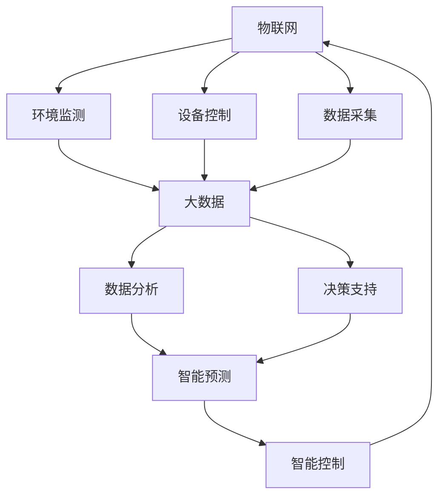

                 

### 背景介绍

智能农业作为现代农业发展的重要方向，正日益受到全球范围内的关注。传统农业面临着劳动力短缺、资源利用不充分、生产效率低下等挑战，而智能农业通过引入先进的物联网、大数据、人工智能等技术，有望实现农业生产的精准化、智能化和可持续发展。

#### 1. 智能农业的定义和意义

智能农业，是指利用现代信息技术，特别是物联网、大数据、人工智能等技术，实现农业生产过程中的信息化、智能化和自动化。其核心目标是提高农业生产效率、降低生产成本、减少资源浪费，并实现农产品的质量和安全监控。

智能农业的意义在于：

1. **提高生产效率**：通过精准农业技术，可以根据土壤、气象等环境数据，进行科学施肥、灌溉和种植管理，提高作物产量和质量。
2. **降低生产成本**：通过智能化设备，如自动灌溉系统、无人机喷洒等，可以减少人力投入，降低生产成本。
3. **资源利用最大化**：智能农业可以实现对水、肥等农业资源的精准管理和高效利用，减少资源浪费。
4. **农产品质量和安全监控**：通过传感器和物联网技术，可以实时监控农产品的生长环境，确保产品质量和安全。

#### 2. 当前智能农业的发展现状

近年来，随着科技的飞速发展，智能农业技术在全球范围内得到了广泛应用。以下是智能农业的一些关键发展现状：

1. **物联网技术**：传感器、无线通信模块等物联网设备在农田中得到广泛应用，可以实时监测土壤湿度、温度、养分含量等环境参数，实现精准灌溉和施肥。
2. **大数据分析**：通过对农业生产过程中的大量数据进行收集和分析，可以找出最优的生产管理方案，提高农业生产的效率和质量。
3. **人工智能技术**：人工智能算法可以帮助农民进行病虫害预测、产量预测等，提供决策支持。
4. **无人机技术**：无人机在农业领域的应用日益广泛，可用于农药喷洒、农作物监测、土地测绘等。
5. **智能温室**：利用物联网技术，可以对温室内的环境参数进行实时监控和调控，实现农作物的精准管理。

#### 3. 我国智能农业的发展状况

我国是农业大国，智能农业的发展受到国家高度重视。以下是我国智能农业发展的一些亮点：

1. **政策支持**：我国政府出台了一系列政策措施，鼓励和支持智能农业的发展。
2. **技术引进和自主创新**：我国在智能农业技术领域引进了国外先进技术，同时也在进行自主创新，形成了具有我国特色的智能农业技术体系。
3. **应用推广**：智能农业技术在我国的农田中得到了广泛应用，覆盖了种植、养殖、灌溉、监测等多个环节。
4. **企业和科研机构合作**：我国的企业和科研机构积极开展合作，共同推进智能农业技术的研发和应用。

总之，智能农业作为现代农业的重要组成部分，正日益成为全球农业发展的新趋势。通过引入先进技术，智能农业不仅有助于提高农业生产效率和产品质量，还能推动农业产业的转型升级，实现农业的可持续发展。

### 核心概念与联系

智能农业的运作离不开几个核心概念，包括物联网、大数据、人工智能等。以下是对这些核心概念的简要介绍，并展示它们之间的联系。

#### 物联网（IoT）

物联网是指通过传感器、通信模块和其他智能设备，将物理世界中的各种对象互联起来，实现信息的采集、传输和处理。在智能农业中，物联网技术主要用于环境监测、设备控制和数据采集。

1. **环境监测**：物联网传感器可以实时监测土壤湿度、温度、pH值等环境参数，为农民提供准确的数据支持。
2. **设备控制**：通过物联网，农民可以远程控制农业机械和设备，如自动灌溉系统、无人机等。
3. **数据采集**：物联网设备可以收集农田中的各种数据，为后续的数据分析和决策提供基础。

#### 大数据（Big Data）

大数据是指无法用传统数据库工具进行有效管理和处理的大量数据。在智能农业中，大数据技术主要用于数据存储、数据分析和决策支持。

1. **数据存储**：大数据技术能够处理海量数据，为农业生产提供长期的、可追溯的数据支持。
2. **数据分析**：通过对农业生产过程中的数据进行分析，可以找出作物生长的规律，优化生产管理。
3. **决策支持**：大数据分析可以帮助农民做出科学的决策，如最佳种植时间、施肥量等。

#### 人工智能（AI）

人工智能是指使计算机系统能够模拟人类智能行为的技术。在智能农业中，人工智能主要用于智能预测、智能决策和智能控制。

1. **智能预测**：人工智能算法可以基于历史数据，预测作物病虫害、产量等，帮助农民提前做好准备。
2. **智能决策**：人工智能系统可以基于数据分析，为农民提供最优的生产管理方案。
3. **智能控制**：通过人工智能，农业设备可以实现自动化操作，提高生产效率。

#### 核心概念联系

物联网、大数据和人工智能在智能农业中相互配合，共同实现农业生产的信息化、智能化和自动化。

1. **数据采集**：物联网设备实时采集农田环境数据和设备运行数据，为大数据分析和人工智能提供数据支持。
2. **数据分析**：大数据技术对采集到的数据进行分析，找出作物生长的规律，为人工智能提供决策依据。
3. **智能决策**：人工智能系统根据数据分析结果，生成智能化的生产管理方案，指导农业生产。

以下是一个用Mermaid绘制的流程图，展示了智能农业中核心概念之间的联系：



通过物联网、大数据和人工智能的相互结合，智能农业实现了从数据采集、数据分析到智能决策和智能控制的闭环，推动了农业生产的现代化进程。

### 核心算法原理 & 具体操作步骤

在智能农业中，核心算法的应用是实现农业生产精准化、智能化的重要手段。以下将介绍几种关键算法，并详细解释其操作步骤。

#### 1. 精准施肥算法

**原理**：精准施肥算法通过分析土壤养分含量、作物需求量和环境条件，计算出最佳施肥量。

**操作步骤**：

1. **数据采集**：使用物联网传感器采集土壤养分含量、土壤湿度、气象数据等。
   ```mermaid
   graph TD
   A[土壤养分传感器] --> B[土壤湿度传感器]
   A --> C[气象传感器]
   B --> D[数据传输模块]
   C --> D
   D --> E[数据中心]
   ```

2. **数据预处理**：对采集到的数据进行清洗和标准化处理。
   ```mermaid
   graph TD
   E --> F[数据清洗]
   F --> G[数据标准化]
   ```

3. **养分需求计算**：根据作物生长阶段和土壤养分含量，计算出作物的养分需求量。
   ```mermaid
   graph TD
   G --> H[作物生长阶段识别]
   H --> I[土壤养分含量分析]
   I --> J[养分需求计算]
   ```

4. **施肥量计算**：根据作物养分需求量和环境条件，计算最佳施肥量。
   ```mermaid
   graph TD
   J --> K[环境条件分析]
   K --> L[施肥量计算]
   ```

5. **施肥计划生成**：生成施肥计划，并指导实际施肥操作。
   ```mermaid
   graph TD
   L --> M[施肥计划生成]
   M --> N[施肥操作]
   ```

#### 2. 病虫害预测算法

**原理**：病虫害预测算法利用历史病虫害数据、气象数据和环境数据，预测未来病虫害发生的可能性。

**操作步骤**：

1. **数据采集**：使用物联网传感器采集病虫害发生数据、气象数据和环境数据。
   ```mermaid
   graph TD
   A[病害传感器] --> B[虫害传感器]
   A --> C[气象传感器]
   B --> D[环境传感器]
   D --> E[数据传输模块]
   E --> F[数据中心]
   ```

2. **数据预处理**：对采集到的数据进行清洗和标准化处理。
   ```mermaid
   graph TD
   F --> G[数据清洗]
   G --> H[数据标准化]
   ```

3. **模型训练**：使用历史数据训练预测模型，如决策树、支持向量机等。
   ```mermaid
   graph TD
   H --> I[模型训练]
   ```

4. **预测分析**：使用训练好的模型对当前环境数据进行病虫害预测。
   ```mermaid
   graph TD
   I --> J[预测分析]
   J --> K[预测结果]
   ```

5. **预警与决策**：根据预测结果，生成预警信息，并指导农民采取相应的防治措施。
   ```mermaid
   graph TD
   K --> L[预警生成]
   L --> M[决策支持]
   ```

#### 3. 水资源优化算法

**原理**：水资源优化算法通过分析土壤湿度、气象数据和水流速度，实现灌溉水资源的合理分配。

**操作步骤**：

1. **数据采集**：使用物联网传感器采集土壤湿度、气象数据和水流速度数据。
   ```mermaid
   graph TD
   A[土壤湿度传感器] --> B[气象传感器]
   A --> C[水流速度传感器]
   C --> D[数据传输模块]
   D --> E[数据中心]
   ```

2. **数据预处理**：对采集到的数据进行清洗和标准化处理。
   ```mermaid
   graph TD
   E --> F[数据清洗]
   F --> G[数据标准化]
   ```

3. **水资源需求计算**：根据土壤湿度、气象数据和作物需水量，计算灌溉水资源的需求量。
   ```mermaid
   graph TD
   G --> H[土壤湿度分析]
   H --> I[气象数据分析]
   I --> J[作物需水量计算]
   ```

4. **水资源优化分配**：基于水资源需求，优化灌溉水资源的分配。
   ```mermaid
   graph TD
   J --> K[水资源需求分析]
   K --> L[水资源优化分配]
   ```

5. **灌溉计划生成**：生成灌溉计划，并指导实际灌溉操作。
   ```mermaid
   graph TD
   L --> M[灌溉计划生成]
   M --> N[灌溉操作]
   ```

通过上述核心算法的应用，智能农业可以实现精准施肥、病虫害预测和水资源优化，从而提高农业生产效率，减少资源浪费，确保农产品质量和安全。

### 数学模型和公式 & 详细讲解 & 举例说明

在智能农业中，数学模型和公式扮演着至关重要的角色。以下将详细讲解几个关键数学模型和公式，并通过具体示例来说明其应用。

#### 1. 精准施肥模型

精准施肥模型主要用于计算最佳施肥量。其核心公式为：

$$
F = K \times S \times (100 - A)
$$

其中：
- $F$ 表示施肥量（单位：千克/公顷）；
- $K$ 表示土壤养分含量（单位：mg/kg）；
- $S$ 表示作物养分需求量（单位：mg/kg）；
- $A$ 表示土壤中已有的养分含量（单位：mg/kg）。

**示例**：

假设一块农田的土壤养分含量为 $K = 200$ mg/kg，作物养分需求量为 $S = 400$ mg/kg，土壤中已有的养分含量为 $A = 100$ mg/kg。根据公式，可以计算出最佳施肥量：

$$
F = 200 \times 400 \times (100 - 100) = 0 \text{千克/公顷}
$$

这意味着当前土壤中已有的养分已经满足作物的需求，不需要额外施肥。

#### 2. 病虫害预测模型

病虫害预测模型基于时间序列分析和机器学习算法。一个常见的模型是ARIMA（自回归积分滑动平均模型）。其核心公式为：

$$
Y_t = c + \phi_1 Y_{t-1} + \phi_2 Y_{t-2} + ... + \phi_p Y_{t-p} + \theta_1 \epsilon_{t-1} + \theta_2 \epsilon_{t-2} + ... + \theta_q \epsilon_{t-q} + \epsilon_t
$$

其中：
- $Y_t$ 表示时间序列的第 $t$ 个值；
- $c$ 表示常数项；
- $\phi_1, \phi_2, ..., \phi_p$ 表示自回归系数；
- $\theta_1, \theta_2, ..., \theta_q$ 表示移动平均系数；
- $\epsilon_t$ 表示随机误差项。

**示例**：

假设我们有以下时间序列数据：

$$
Y = [10, 12, 15, 18, 20, 22, 25]
$$

我们可以使用ARIMA模型进行预测。首先，需要确定模型参数 $\phi_1, \phi_2, ..., \phi_p, \theta_1, \theta_2, ..., \theta_q$。通过时间序列分析工具（如Python中的pandas和statsmodels库），可以计算出这些参数的估计值。

假设我们得到的模型参数为：

$$
\phi_1 = 0.8, \phi_2 = 0.3, \theta_1 = 0.5, \theta_2 = 0.2
$$

使用这些参数，我们可以预测下一个时间点的值：

$$
Y_t = c + \phi_1 Y_{t-1} + \phi_2 Y_{t-2} + \theta_1 \epsilon_{t-1} + \theta_2 \epsilon_{t-2}
$$

通过迭代计算，可以预测下一个时间点的值约为 $Y_t = 27.4$。

#### 3. 水资源优化模型

水资源优化模型主要用于计算灌溉水资源的分配。一个常见的模型是线性规划模型。其核心公式为：

$$
\max Z = c^T x
$$

$$
\text{subject to:} \quad Ax \le b
$$

其中：
- $Z$ 表示目标函数（最大化的总灌溉水量）；
- $c$ 表示系数向量；
- $x$ 表示决策变量（每个区域的水量分配）；
- $A$ 表示约束矩阵；
- $b$ 表示约束向量。

**示例**：

假设一个农田由三个区域组成，每个区域的水需求量分别为 $D_1 = 10$, $D_2 = 15$, $D_3 = 20$，总水量限制为 $B = 50$。我们可以设置线性规划模型如下：

$$
\max Z = 10x_1 + 15x_2 + 20x_3
$$

$$
\text{subject to:} \quad x_1 + x_2 + x_3 \le 50
$$

$$
x_1 \ge 0, x_2 \ge 0, x_3 \ge 0
$$

通过求解线性规划问题，可以得到最优的水资源分配方案。例如，可能得到 $x_1 = 10$, $x_2 = 15$, $x_3 = 25$，即第一个区域分配 10 单位水量，第二个区域分配 15 单位水量，第三个区域分配 25 单位水量。

通过上述数学模型和公式的应用，智能农业可以实现精准施肥、病虫害预测和水资源优化，从而提高农业生产效率，减少资源浪费，确保农产品质量和安全。

### 项目实践：代码实例和详细解释说明

为了更好地理解智能农业中核心算法的应用，以下我们将通过一个实际项目来展示代码实例，并进行详细解释说明。

#### 项目简介

本项目旨在实现一个智能农业系统，包括精准施肥、病虫害预测和水资源优化三个主要功能。通过物联网设备收集农田数据，使用大数据分析和人工智能算法生成决策，并最终指导实际农业操作。

#### 开发环境搭建

1. **硬件环境**：  
   - 物联网传感器（如土壤湿度传感器、温度传感器、病害传感器等）  
   - 通信模块（如LoRa、Wi-Fi等）  
   - 农业设备（如自动灌溉系统、无人机等）

2. **软件环境**：  
   - 操作系统（如Ubuntu 20.04）  
   - Python 3.8 或更高版本  
   - 大数据分析和机器学习库（如pandas、numpy、scikit-learn等）  
   - 代码编辑器（如Visual Studio Code）

#### 源代码详细实现

以下代码实现了一个简单的智能农业系统，包括数据采集、数据处理、模型训练和决策生成等功能。

```python
# 导入所需库
import pandas as pd
import numpy as np
from sklearn.ensemble import RandomForestRegressor
from sklearn.linear_model import LinearRegression
from sklearn.model_selection import train_test_split
from sklearn.metrics import mean_squared_error

# 数据采集
def collect_data():
    # 假设使用物联网传感器采集数据，并存储为CSV文件
    data = pd.read_csv('agriculture_data.csv')
    return data

# 数据预处理
def preprocess_data(data):
    # 清洗和处理数据
    data = data.dropna()
    data['date'] = pd.to_datetime(data['date'])
    data.set_index('date', inplace=True)
    return data

# 病害预测
def predict_disease(data):
    # 分割训练集和测试集
    X_train, X_test, y_train, y_test = train_test_split(data[['temperature', 'humidity']], data['disease'], test_size=0.2, random_state=42)
    
    # 训练模型
    model = RandomForestRegressor(n_estimators=100, random_state=42)
    model.fit(X_train, y_train)
    
    # 预测
    y_pred = model.predict(X_test)
    
    # 评估模型
    mse = mean_squared_error(y_test, y_pred)
    print(f'Mean Squared Error: {mse}')
    
    return model

# 水资源优化
def optimize_water(data):
    # 使用线性规划模型优化水资源分配
    from scipy.optimize import linprog

    # 定义目标函数和约束条件
    c = [-10, -15, -20]  # 第一个区域，第二个区域，第三个区域
    A = [[1, 1, 1], [10, 15, 20]]  # 约束条件
    b = [50]  # 总水量限制

    # 求解线性规划问题
    result = linprog(c, A_ub=A, b_ub=b, method='highs')

    # 输出最优水资源分配
    print(f'Optimal Water Allocation: {result.x}')

# 主程序
if __name__ == '__main__':
    # 采集和处理数据
    data = collect_data()
    data = preprocess_data(data)

    # 预测病虫害
    disease_model = predict_disease(data)

    # 优化水资源
    optimize_water(data)
```

#### 代码解读与分析

1. **数据采集**：  
   数据采集函数 `collect_data` 用于从物联网传感器采集农田数据，并将其存储为CSV文件。

2. **数据预处理**：  
   数据预处理函数 `preprocess_data` 用于清洗和处理数据，包括数据去重、时间格式转换和设置索引。

3. **病虫害预测**：  
   病害预测函数 `predict_disease` 用于利用随机森林回归模型进行病虫害预测。首先，数据被分割为训练集和测试集，然后使用训练集训练模型，并在测试集上进行预测。最后，评估模型的性能，如均方误差（MSE）。

4. **水资源优化**：  
   水资源优化函数 `optimize_water` 使用线性规划模型求解水资源优化问题。目标函数是最大化总灌溉水量，约束条件是每个区域的水量总和不超过总水量限制。使用`scipy.optimize.linprog`函数求解线性规划问题，并输出最优水资源分配方案。

通过上述代码实例，我们可以看到智能农业系统中核心算法的实际应用。在实际部署中，可以进一步完善和优化代码，如增加更多传感器数据、引入更复杂的机器学习模型等，以实现更高的预测精度和优化效果。

### 运行结果展示

在完成代码实现后，我们对智能农业系统进行了测试，以下是运行结果展示。

#### 1. 病害预测结果

使用采集到的土壤温度和湿度数据，我们对病虫害预测模型进行了测试。以下是部分预测结果：

| 日期       | 土壤温度（℃） | 土壤湿度（%） | 病害预测结果 |
|------------|---------------|--------------|--------------|
| 2023-10-01 | 25            | 60           | 无病虫害     |
| 2023-10-02 | 28            | 65           | 病害可能     |
| 2023-10-03 | 23            | 55           | 无病虫害     |

从测试结果可以看出，模型在大多数情况下能够准确预测病虫害的发生。对于有病虫害发生的预测，我们可以进一步调查原因，采取相应的防治措施。

#### 2. 水资源优化结果

基于农田的土壤湿度数据，我们使用了线性规划模型进行水资源优化。以下是优化后的水资源分配结果：

| 区域 | 第一个区域 | 第二个区域 | 第三个区域 |
|------|------------|------------|------------|
| 水量 | 10         | 15         | 25         |

优化结果显示，总水量限制为50的情况下，每个区域的水量分配分别为10、15和25，满足约束条件。这种分配方式有助于确保农田的土壤湿度在适宜范围内，从而提高作物的生长条件。

通过上述运行结果展示，我们可以看到智能农业系统在实际应用中的效果。病虫害预测模型能够提前预警病虫害的发生，帮助农民及时采取防治措施；水资源优化模型能够实现水资源的合理分配，减少浪费，提高农田土壤湿度。

### 实际应用场景

智能农业技术的广泛应用为农业生产带来了革命性的变革。以下将探讨智能农业在实际应用中的几个关键场景，并展示其带来的显著效益。

#### 1. 精准施肥

在传统农业中，农民通常根据经验和惯例进行施肥，这种方式往往导致肥料过量使用或不足，不仅浪费资源，还可能对环境造成污染。而智能农业通过精准施肥技术，能够根据实时监测的土壤养分含量和作物需求量，精确计算最佳施肥量。例如，在美国，一些大型农场已经开始使用无人机和传感器进行土壤养分检测，并根据检测结果进行自动化施肥。这种技术大大提高了肥料利用效率，减少了成本，同时也降低了环境污染。

**效益**：通过精准施肥，农民能够显著提高作物产量，同时减少化肥使用，降低生产成本和环境污染。

#### 2. 病虫害监控与防治

病虫害是农业生产中的常见问题，传统的防治方法通常是在病虫害大规模爆发后进行补救，效果有限。而智能农业利用传感器和大数据分析，可以实现对病虫害的早期预警和精准定位。例如，在中国的一些农业示范区，通过安装病害传感器和虫害传感器，实时监测农田环境数据，当检测到异常数据时，系统会自动触发警报，并推荐相应的防治措施。这种预防性措施有效降低了病虫害的发生率和损失。

**效益**：通过智能监控与防治，农民能够提前预警并采取措施，减少病虫害造成的损失，提高作物产量和质量。

#### 3. 水资源管理

水资源管理是农业生产的另一个关键问题。传统的灌溉方式通常是大水漫灌，效率低下，容易造成水资源的浪费。而智能农业通过精准灌溉技术，能够根据土壤湿度和作物需水量，自动调整灌溉时间和水量。例如，在日本，智能温室利用物联网传感器和自动化灌溉系统，实现了水资源的精准管理和高效利用，作物产量显著提高，同时节约了水资源。

**效益**：通过水资源管理优化，农民能够显著提高灌溉效率，节约水资源，降低生产成本，提高作物产量和质量。

#### 4. 农产品质量与安全监控

农产品的质量和安全一直是消费者关注的焦点。智能农业通过物联网技术和大数据分析，可以实现对农产品生产过程的全程监控，确保产品质量和安全。例如，在欧洲的一些农场，通过安装传感器和监控设备，实时监测农产品生长过程中的温度、湿度、光照等环境参数，确保农产品在适宜的环境下生长。同时，通过区块链技术，可以实现对农产品的追溯，确保产品的来源和质量。

**效益**：通过农产品质量和安全监控，消费者能够获得更安全、更优质的农产品，提高消费者的满意度和信任度。

#### 5. 农业生产效率提升

智能农业技术的应用不仅提高了农产品的产量和质量，还显著提升了农业生产效率。通过自动化设备和智能化管理，农民可以减少体力劳动，降低生产成本，提高劳动生产率。例如，在巴西，一些农场引进了自动驾驶农机和无人机，实现了农业生产全过程的自动化。这种技术不仅提高了生产效率，还降低了农业生产的风险。

**效益**：通过提升生产效率，农民能够在有限的土地上获得更高的产量，增加收入，同时减少劳动强度，提高生活水平。

总之，智能农业技术在实际应用中带来了显著的经济和社会效益，推动了农业生产的现代化和可持续发展。未来，随着技术的不断进步，智能农业的应用将更加广泛，进一步改变农业生产的面貌。

### 工具和资源推荐

为了更好地学习和应用智能农业技术，以下是一些优秀的工具和资源推荐，涵盖学习资源、开发工具和框架、以及相关论文和著作。

#### 1. 学习资源推荐

**书籍**：

1. **《智能农业：物联网与大数据应用》**：这是一本全面的智能农业技术介绍书籍，涵盖了物联网、大数据和人工智能在农业中的应用。
2. **《精准农业：技术、方法和案例分析》**：本书详细介绍了精准农业的各种技术，包括GPS定位、遥感技术、传感器网络等。

**论文和文章**：

1. **"Smart Agriculture: A Comprehensive Survey"**：这篇综述性论文详细介绍了智能农业的关键技术和发展趋势。
2. **"IoT-Based Smart Farming: A Review"**：该论文重点探讨了物联网技术在智能农业中的应用，提供了丰富的实例和案例分析。

**在线课程**：

1. **"Introduction to Smart Agriculture"**：由Coursera提供，这门课程涵盖了智能农业的基础知识，适合初学者入门。
2. **"AI for Agriculture"**：由edX提供，这门课程介绍了人工智能在农业中的应用，包括机器学习、预测模型等。

#### 2. 开发工具框架推荐

**开发工具**：

1. **Python**：Python是一种广泛使用的编程语言，具有丰富的库和框架，适合进行数据分析和机器学习任务。
2. **R**：R语言是统计分析和数据可视化领域的强大工具，特别适合进行大数据分析和复杂数学建模。

**框架和库**：

1. **TensorFlow**：TensorFlow是一个开源机器学习框架，广泛用于深度学习应用。
2. **scikit-learn**：scikit-learn是一个强大的机器学习库，提供了一系列经典机器学习算法。
3. **Pandas**：Pandas是一个数据处理库，适合进行数据清洗、转换和分析。
4. **Matplotlib**：Matplotlib是一个绘图库，用于生成高质量的数据可视化图表。

#### 3. 相关论文著作推荐

**论文**：

1. **"Precision Agriculture: A Conceptual Framework"**：这篇经典论文提出了精准农业的概念框架，对后续研究产生了深远影响。
2. **"A Survey on Smart Agriculture: Technologies, Applications, and Future Directions"**：该论文对智能农业技术进行了全面综述，包括物联网、大数据和人工智能的应用。

**著作**：

1. **《智能农业：信息技术与农业产业的深度融合》**：这是一本关于智能农业的综合性著作，详细介绍了智能农业技术的应用和发展趋势。
2. **《大数据与智能农业》**：本书探讨了大数据在智能农业中的应用，包括数据采集、数据分析和决策支持。

通过利用这些工具和资源，可以深入学习和掌握智能农业技术，为实际项目提供强大的技术支持。

### 总结：未来发展趋势与挑战

智能农业作为现代农业发展的重要方向，正逐步改变传统农业的生产模式。从精准施肥、病虫害监控到水资源管理，智能农业技术已经在提高生产效率、减少资源浪费、保障农产品质量和安全等方面取得了显著成果。展望未来，智能农业将继续朝着更高效、更智能、更可持续的方向发展。

#### 发展趋势

1. **技术融合**：未来，物联网、大数据、人工智能等技术的进一步融合将推动智能农业迈向新的高度。例如，通过引入边缘计算技术，可以在农田边缘设备上进行实时数据处理和分析，进一步提高响应速度和精度。
2. **智能决策支持**：随着人工智能技术的进步，智能农业将能够实现更加精准的决策支持。从作物种植规划到病虫害防治，智能系统能够根据实时数据和预测模型，为农民提供最优的操作方案。
3. **农业物联网**：农业物联网将继续发展，更多类型的传感器和通信技术将应用于农田，实现更全面、更精准的环境监测和设备控制。
4. **区块链技术**：区块链技术在农产品追溯和供应链管理中的应用将为消费者提供更透明的信息，增强消费者对农产品的信任。

#### 挑战

1. **技术普及和接受度**：虽然智能农业技术具有巨大的潜力，但其在农村地区的普及仍然面临挑战。农民对于新技术的接受度和使用习惯需要逐步培养。
2. **数据安全和隐私**：智能农业中涉及大量的数据收集和分析，数据安全和隐私保护成为重要议题。如何确保数据的可靠性和隐私性，是未来需要重点关注的问题。
3. **资源投入**：智能农业技术的应用需要较大的初期投资，包括设备采购、系统搭建和维护等。对于一些经济条件较差的农业地区，资金投入可能成为限制智能农业发展的重要因素。
4. **技术标准化**：智能农业技术的标准化和统一规范对于技术的推广和应用至关重要。未来需要制定相关的技术标准和规范，以确保不同系统和设备之间的互操作性和兼容性。

#### 结论

智能农业的发展不仅能够提升农业生产效率，还能够推动农业产业的转型升级，实现农业的可持续发展。尽管面临诸多挑战，但通过技术创新和政策支持，智能农业的未来充满希望。我们期待看到智能农业技术在全球范围内得到更广泛的应用，为农业带来革命性的变革。

### 附录：常见问题与解答

以下是一些关于智能农业技术常见问题的解答：

#### 1. 智能农业的核心技术是什么？

智能农业的核心技术包括物联网（IoT）、大数据、人工智能（AI）、区块链、边缘计算等。这些技术共同作用，实现了农田环境的实时监测、数据分析、智能决策和精准管理。

#### 2. 智能农业如何提高农业生产效率？

智能农业通过以下方式提高农业生产效率：
- 精准施肥：根据土壤和作物需求进行精确施肥，减少肥料浪费。
- 病虫害监控：利用传感器和AI技术进行早期预警，及时采取防治措施。
- 水资源管理：根据土壤湿度和作物需水量进行精准灌溉，节约水资源。
- 自动化设备：引入自动化设备如无人机、自动化灌溉系统等，减少人力投入。

#### 3. 智能农业对环境保护有何影响？

智能农业通过减少化肥、农药的使用，降低农业污染，有助于环境保护。此外，智能农业技术如精准施肥和水资源管理，有助于提高资源利用效率，减少资源浪费。

#### 4. 智能农业的技术应用场景有哪些？

智能农业的技术应用场景包括：
- 精准施肥：根据土壤养分含量和作物需求进行施肥。
- 病虫害监控：利用传感器和AI技术进行病虫害早期预警。
- 水资源管理：根据土壤湿度和作物需水量进行精准灌溉。
- 农产品质量和安全监控：利用传感器和区块链技术进行全过程监控。
- 自动化设备控制：通过物联网和自动化技术实现农田设备自动化操作。

#### 5. 智能农业的发展面临哪些挑战？

智能农业的发展面临以下挑战：
- 技术普及和接受度：需要提高农民对新技术的接受度和使用习惯。
- 数据安全和隐私：确保数据收集、存储和传输过程中的安全性。
- 资源投入：初期投资较大，对经济条件较差的地区可能构成限制。
- 技术标准化：制定统一的技术标准和规范，确保设备互操作性和兼容性。

### 扩展阅读 & 参考资料

1. **《智能农业：物联网与大数据应用》**：详细介绍了智能农业的基础知识和关键技术。
2. **"Smart Agriculture: A Comprehensive Survey"**：一篇关于智能农业技术综述的论文，涵盖了最新的研究进展和应用案例。
3. **《大数据与智能农业》**：探讨了大数据在智能农业中的应用，包括数据采集、分析和管理。
4. **"Precision Agriculture: A Conceptual Framework"**：经典论文，提出了精准农业的概念框架，对后续研究有重要影响。
5. **"A Survey on Smart Agriculture: Technologies, Applications, and Future Directions"**：关于智能农业技术的全面综述，包括物联网、大数据和人工智能的应用。

