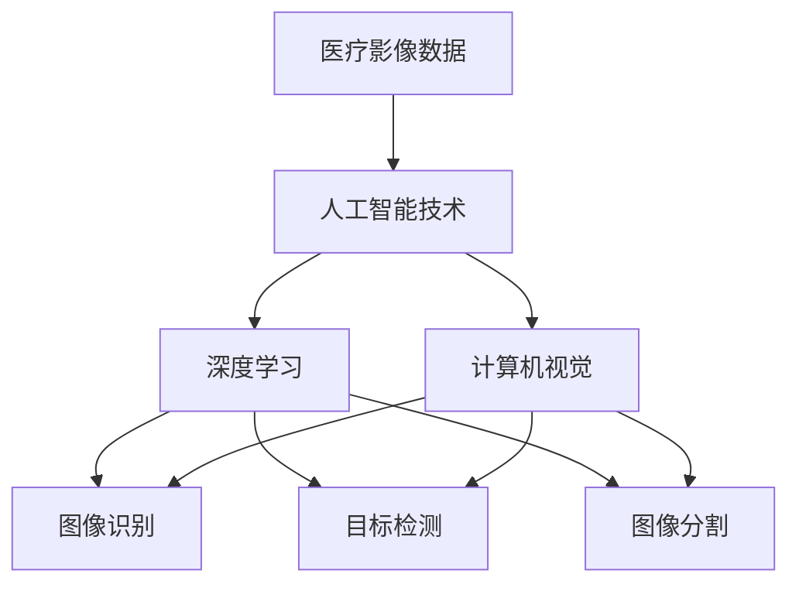
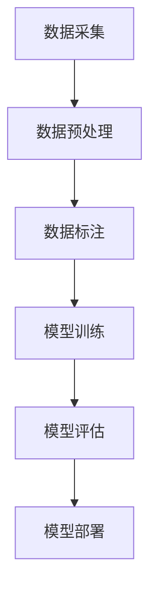
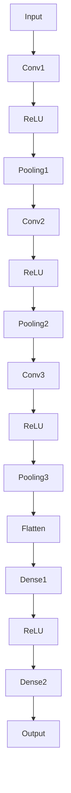
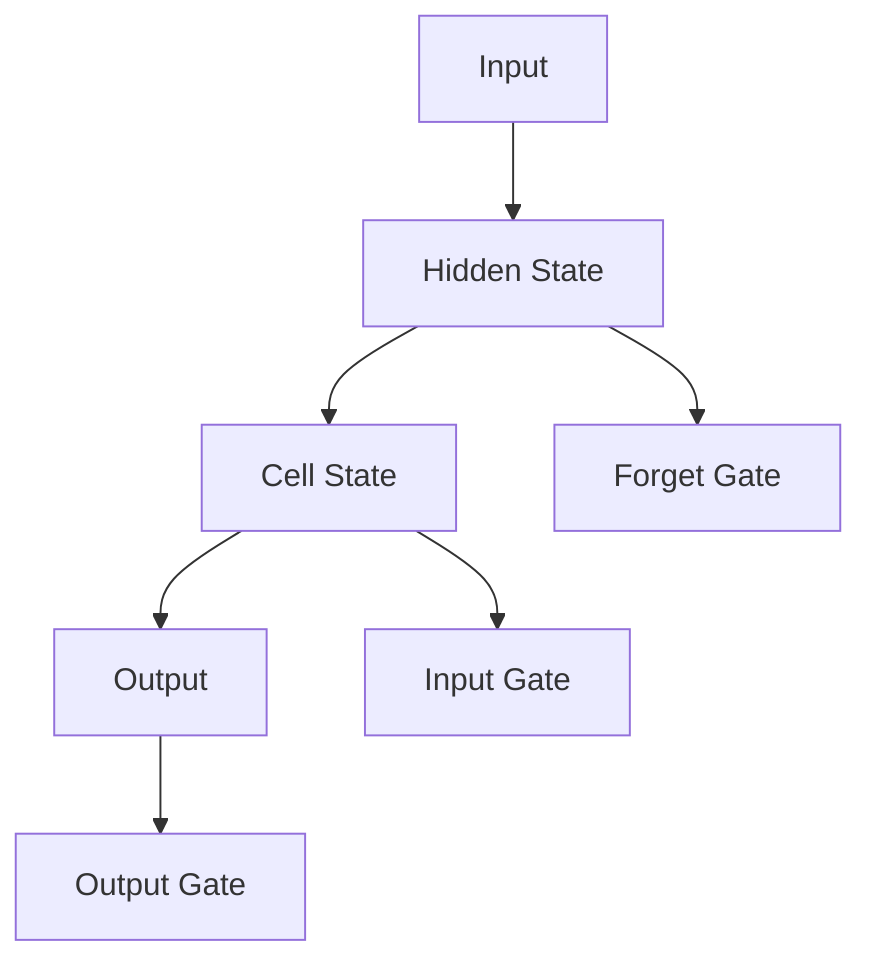
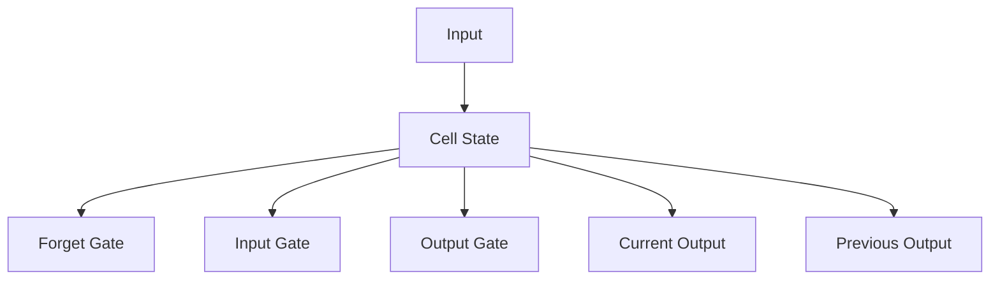
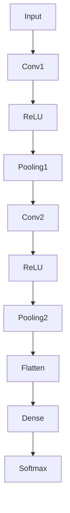

                 

### 摘要

本文深入探讨了智能医疗影像领域，这是一个融合了人工智能与医学诊断的创新前沿。通过介绍当前智能医疗影像的发展背景、核心概念、算法原理、数学模型及实际应用，本文旨在揭示AI在医疗影像诊断中的重要性和潜在价值。我们将详细分析人工智能辅助诊断在医疗影像中的应用场景，分享相关的工具和资源，并提出未来发展趋势与面临的挑战。本文将帮助读者全面了解智能医疗影像的现状与发展，以及如何在医疗领域利用AI技术提升诊断效率与准确性。

## 1. 背景介绍

随着人工智能技术的飞速发展，医疗领域正经历着一场革命性的变革。智能医疗影像作为其中的重要组成部分，已经逐渐成为医疗诊断和研究的关键工具。医疗影像，包括X射线、CT、MRI、超声等，为医生提供了直观的疾病观察窗口。然而，传统的影像诊断方法依赖于医生的经验和专业知识，往往存在主观性、耗时性以及诊断错误的风险。因此，如何提高诊断的准确性和效率，成为医疗领域亟待解决的问题。

人工智能（AI）的引入为医疗影像诊断带来了新的希望。AI通过深度学习、计算机视觉等技术，可以从大量的医疗影像数据中自动提取特征，并基于这些特征进行诊断。相比传统方法，AI能够处理海量数据，具备更高的准确性和速度。此外，AI系统可以不断学习，通过积累更多的病例数据来提高诊断能力，从而实现自我优化。

智能医疗影像的应用不仅限于提高诊断准确性，还涉及到疾病预测、治疗规划、手术辅助等多个方面。例如，通过分析患者的影像数据，AI可以帮助预测疾病的发生和发展趋势，为医生提供有针对性的治疗建议。在手术过程中，AI可以实时监测患者的生理参数，提供精准的手术指导和操作建议，从而提高手术的成功率和安全性。

总之，智能医疗影像的发展不仅为医疗诊断提供了新的工具和方法，还有助于降低医疗成本、提高医疗服务质量。随着AI技术的不断进步，智能医疗影像将在未来的医疗体系中扮演更加重要的角色。本文将详细介绍智能医疗影像的核心概念、算法原理、数学模型和实际应用，以期为读者提供全面的了解和指导。

## 2. 核心概念与联系

要理解智能医疗影像的核心概念及其应用，首先需要了解以下几个关键领域：医疗影像数据、人工智能技术、深度学习和计算机视觉。这些核心概念相互联系，共同构成了智能医疗影像的基础。

### 医疗影像数据

医疗影像数据是智能医疗影像的基础。常见的医疗影像包括X射线、CT（计算机断层扫描）、MRI（磁共振成像）和超声等。这些影像数据以数字形式存储，包含了丰富的图像信息。图像数据具有高维、复杂和非线性等特点，是传统计算机难以处理的数据类型。

医疗影像数据的处理通常包括以下几个步骤：

1. **数据采集**：通过各种医疗影像设备获取高质量的图像数据。
2. **数据预处理**：对图像进行去噪、对比度增强、分割等预处理操作，以提升图像质量。
3. **数据标注**：对图像进行标注，标记出感兴趣的区域（如肿瘤、病变等），为后续的算法训练提供标注数据。

### 人工智能技术

人工智能（AI）是智能医疗影像的核心驱动力。AI技术通过模仿人类智能的决策过程，实现对数据的自动分析和处理。AI技术包括机器学习、深度学习、强化学习等。在医疗影像诊断中，主要使用的是机器学习和深度学习。

1. **机器学习**：机器学习是一种通过训练模型来从数据中学习规律的方法。在医疗影像中，机器学习算法可以识别图像中的特定特征，如肿瘤、骨折等。
2. **深度学习**：深度学习是一种基于多层神经网络的结构，通过反向传播算法自动调整网络参数，从而提高模型的准确性。深度学习在医疗影像中的应用非常广泛，如卷积神经网络（CNN）用于图像分类和分割。

### 深度学习

深度学习是人工智能中的一个重要分支，尤其在处理高维复杂数据时表现出色。在医疗影像中，深度学习被广泛用于图像分类、目标检测、图像分割等任务。

1. **卷积神经网络（CNN）**：CNN是一种特别适用于图像处理的深度学习模型。它通过卷积层提取图像的局部特征，并通过池化层减少数据维度，从而提高模型的效率。
2. **递归神经网络（RNN）**：RNN适用于处理序列数据，如时间序列数据。在医疗影像中，RNN可以用于分析患者的病史和检查记录，以预测疾病的发展趋势。

### 计算机视觉

计算机视觉是智能医疗影像的重要组成部分，它涉及图像识别、目标检测、图像分割等领域。计算机视觉技术通过算法模型从图像中提取有用的信息，为医疗诊断提供支持。

1. **图像识别**：图像识别用于识别图像中的特定对象或场景，如检测肺癌患者CT图像中的结节。
2. **目标检测**：目标检测用于识别图像中的多个对象，并确定它们的位置。在医疗影像中，目标检测可以用于检测多个病变区域。
3. **图像分割**：图像分割是将图像分割成多个区域，以便于分析每个区域的特点。在医疗影像中，图像分割可以用于分离正常组织和病变组织。

### 核心概念联系

医疗影像数据、人工智能技术、深度学习和计算机视觉之间紧密相连，共同构成了智能医疗影像的核心概念。

- **医疗影像数据** 提供了智能医疗影像的基础数据。
- **人工智能技术** 提供了处理这些数据的方法和工具。
- **深度学习** 和 **计算机视觉** 技术在医疗影像数据中应用，实现了图像识别、目标检测和图像分割等功能。

以下是一个用Mermaid绘制的流程图，展示了这些核心概念之间的联系：



通过这个流程图，我们可以清晰地看到医疗影像数据如何通过人工智能技术和深度学习算法转化为诊断信息，进而通过计算机视觉技术应用于实际医疗诊断中。

### 2.1 医疗影像数据类型和处理流程

医疗影像数据类型主要包括X射线、CT、MRI和超声等。每种类型的影像数据具有其独特的特性，如X射线适合骨骼成像，MRI适合软组织成像。这些影像数据在医疗诊断中起着至关重要的作用。

#### X射线（X-ray）

X射线是最常见的医疗影像技术之一，常用于骨折、肺炎等疾病的诊断。X射线图像以其高对比度和低分辨率著称。处理X射线数据通常包括以下几个步骤：

1. **图像去噪**：由于X射线成像过程中可能引入噪声，需要通过滤波等算法去除噪声，以提高图像质量。
2. **对比度增强**：增强图像对比度，使图像中的细微结构更加清晰。
3. **图像分割**：将图像分割成感兴趣区域，如骨骼和组织，以便进行后续分析。

#### CT（Computerized Tomography）

CT成像通过多个角度的X射线扫描生成三维图像，广泛应用于肿瘤、心脏病等疾病的诊断。CT图像具有高分辨率，但也含有大量的噪声。处理CT数据的一般步骤如下：

1. **图像重建**：从多个角度的X射线投影中重建出三维图像。
2. **噪声过滤**：去除图像中的随机噪声，以获得更清晰的图像。
3. **图像分割**：分割图像中的组织和病变区域，为诊断提供依据。

#### MRI（Magnetic Resonance Imaging）

MRI利用磁场和无线电波生成高分辨率的软组织图像，广泛应用于脑部、脊髓、关节等部位的疾病诊断。MRI图像的特点是无辐射、高对比度，但也可能包含运动伪影和磁敏感伪影。处理MRI数据通常涉及：

1. **运动校正**：消除患者运动引起的伪影。
2. **磁敏感校正**：校正磁敏感伪影，提高图像质量。
3. **图像分割**：将图像分割成不同的组织区域，如灰质、白质和脑脊液。

#### 超声（Ultrasound）

超声成像通过声波反射生成实时图像，常用于妇产科、心脏科等领域的诊断。超声图像以其实时性和无创性著称，但分辨率相对较低。处理超声数据的一般步骤包括：

1. **图像增强**：增强图像的对比度和清晰度。
2. **图像分割**：将图像分割成感兴趣区域，如胎儿图像或心脏结构。
3. **特征提取**：提取图像中的关键特征，用于诊断和预测。

#### 数据处理流程

处理医疗影像数据通常包括以下几个关键步骤：

1. **数据采集**：使用各种医疗影像设备获取高质量的图像数据。
2. **数据预处理**：对图像进行去噪、对比度增强、分割等预处理操作。
3. **数据标注**：对图像进行标注，标记出感兴趣的区域，为算法训练提供标注数据。
4. **模型训练**：使用预处理后的数据训练深度学习模型，如CNN或RNN。
5. **模型评估**：通过测试数据评估模型的性能，包括准确性、召回率等指标。
6. **模型部署**：将训练好的模型部署到实际应用中，如医生工作站或医疗设备。

以下是一个用Mermaid绘制的医疗影像数据处理流程图：



通过这个流程图，我们可以清晰地看到医疗影像数据从采集、预处理、标注到模型训练、评估和部署的全过程，从而实现智能医疗影像的诊断和应用。

### 2.2 人工智能在医疗影像诊断中的关键技术

在智能医疗影像的诊断中，人工智能技术扮演着至关重要的角色。以下是几种关键的人工智能技术及其在医疗影像诊断中的应用。

#### 深度学习

深度学习是一种通过多层神经网络进行数据处理的强大技术。在医疗影像诊断中，深度学习模型，如卷积神经网络（CNN）和循环神经网络（RNN），被广泛应用于图像分类、目标检测和图像分割等任务。

- **卷积神经网络（CNN）**：CNN特别适用于图像处理。它通过卷积层提取图像的局部特征，并通过池化层减少数据维度，从而提高模型的效率。在医疗影像中，CNN被用于检测病变区域，如肿瘤、骨折等。以下是一个CNN的基本架构：

  ```mermaid
  graph TD
      A[Input] --> B[Conv1]
      B --> C[ReLU]
      C --> D[Pooling1]
      D --> E[Conv2]
      E --> F[ReLU]
      F --> G[Pooling2]
      G --> H[Conv3]
      H --> I[ReLU]
      I --> J[Pooling3]
      J --> K[Flatten]
      K --> L[Dense1]
      L --> M[ReLU]
      M --> N[Dense2]
      N --> O[Output]
  ```

- **循环神经网络（RNN）**：RNN适用于处理序列数据，如时间序列数据。在医疗影像中，RNN可以用于分析患者的病史和检查记录，以预测疾病的发展趋势。

#### 计算机视觉

计算机视觉是一种通过算法模型从图像中提取有用信息的技术。在医疗影像诊断中，计算机视觉技术包括图像识别、目标检测和图像分割等。

- **图像识别**：图像识别用于识别图像中的特定对象或场景，如检测肺癌患者CT图像中的结节。
- **目标检测**：目标检测用于识别图像中的多个对象，并确定它们的位置。在医疗影像中，目标检测可以用于检测多个病变区域。
- **图像分割**：图像分割是将图像分割成多个区域，以便于分析每个区域的特点。在医疗影像中，图像分割可以用于分离正常组织和病变组织。

#### 机器学习

机器学习是一种通过训练模型从数据中学习规律的方法。在医疗影像诊断中，机器学习算法可以识别图像中的特定特征，如肿瘤、骨折等。

- **监督学习**：监督学习算法通过标注数据训练模型，从而在新的数据上进行预测。在医疗影像中，监督学习算法被广泛用于图像分类和目标检测。
- **无监督学习**：无监督学习算法不需要标注数据，通过发现数据中的模式进行聚类和降维。在医疗影像中，无监督学习算法可以用于患者的健康数据聚类分析。

#### 神经网络

神经网络是一种模仿生物神经系统的计算模型。在医疗影像诊断中，神经网络被广泛应用于图像分类、目标检测和图像分割等任务。

- **多层感知机（MLP）**：MLP是一种前馈神经网络，常用于图像分类任务。
- **卷积神经网络（CNN）**：CNN是一种特别适用于图像处理的神经网络，通过卷积层和池化层提取图像的局部特征。
- **递归神经网络（RNN）**：RNN适用于处理序列数据，如时间序列数据。在医疗影像中，RNN可以用于分析患者的病史和检查记录。

通过这些人工智能技术，智能医疗影像诊断能够从大量的医疗影像数据中提取出有用的信息，为医生提供更加准确和高效的诊断支持。

### 2.3 深度学习算法在医疗影像中的应用

深度学习算法在医疗影像诊断中发挥了重要作用，尤其是在图像分类、目标检测和图像分割等领域。以下将详细介绍这些深度学习算法及其在医疗影像中的应用。

#### 图像分类

图像分类是指将图像分类到预定义的类别中。在医疗影像中，图像分类有助于快速识别疾病类型。常用的图像分类算法包括卷积神经网络（CNN）和支持向量机（SVM）。

- **卷积神经网络（CNN）**：CNN是一种特别适用于图像处理的深度学习模型。它通过多个卷积层和池化层提取图像的特征，最终通过全连接层进行分类。在医疗影像中，CNN常用于分类肿瘤类型、疾病阶段等。以下是一个简单的CNN架构：

  ```mermaid
  graph TD
      A[Input] --> B[Conv1]
      B --> C[ReLU]
      C --> D[Pooling1]
      D --> E[Conv2]
      E --> F[ReLU]
      F --> G[Pooling2]
      G --> H[Conv3]
      H --> I[ReLU]
      I --> J[Pooling3]
      J --> K[Flatten]
      K --> L[Dense1]
      L --> M[ReLU]
      M --> N[Dense2]
      N --> O[Output]
  ```

  通过训练，CNN可以学习到图像中不同类别的特征，从而实现高效的图像分类。

- **支持向量机（SVM）**：SVM是一种基于统计学习的图像分类算法。它通过找到一个最佳的超平面，将不同类别的图像分隔开来。在医疗影像中，SVM常用于分类器官轮廓、病变类型等。

#### 目标检测

目标检测是指识别图像中的特定对象，并确定它们的位置。在医疗影像中，目标检测有助于发现病变区域和病变数量。常用的目标检测算法包括R-CNN、YOLO和SSD。

- **区域建议网络（R-CNN）**：R-CNN是一种基于深度学习的目标检测算法。它首先通过CNN提取图像的特征，然后使用SVM对特征进行分类。R-CNN在处理复杂场景时效果较好，但其计算成本较高。

- **You Only Look Once（YOLO）**：YOLO是一种基于整图的目标检测算法。它通过将图像划分为网格，在每个网格中预测物体的类别和位置。YOLO具有实时性和高效性，适用于实时检测场景。

- **单阶段检测网络（SSD）**：SSD是一种基于YOLO的目标检测算法，它在YOLO的基础上增加了多个尺度层，以提高检测精度。SSD在医疗影像中常用于检测多个病变区域。

#### 图像分割

图像分割是指将图像分割成多个区域，以便于分析每个区域的特点。在医疗影像中，图像分割有助于分离正常组织和病变组织。常用的图像分割算法包括FCN、U-Net和3D-CNN。

- **全卷积神经网络（FCN）**：FCN是一种基于全卷积的图像分割算法。它通过卷积层和反卷积层提取图像的特征，最终通过全连接层生成分割图。FCN在处理医学影像时具有高效性和准确性。

- **U-Net**：U-Net是一种基于全卷积的网络架构，特别适用于医学图像分割。它通过收缩路径和扩张路径交替使用，实现了精细的特征提取和分割。U-Net在医疗影像中广泛应用于组织分割、病变检测等。

- **三维卷积神经网络（3D-CNN）**：3D-CNN是一种基于三维卷积的图像分割算法，适用于处理三维医学影像。它通过三维卷积层提取图像的三维特征，最终实现图像分割。3D-CNN在医学影像中常用于肿瘤分割和器官分割。

通过这些深度学习算法，智能医疗影像系统能够从大量的医疗影像数据中提取出有用的信息，为医生提供更加准确和高效的诊断支持。这些算法在实际应用中取得了显著的成果，为医学影像诊断带来了新的突破。

### 2.4 医学影像诊断中常用的深度学习框架

在医学影像诊断中，深度学习框架的选择至关重要。以下是几种常用的深度学习框架及其在医疗影像诊断中的应用。

#### TensorFlow

TensorFlow是一个开源的深度学习框架，由Google开发。它提供了丰富的API和工具，适用于各种深度学习任务，包括图像分类、目标检测和图像分割等。在医疗影像诊断中，TensorFlow被广泛应用于图像处理和特征提取。以下是一个使用TensorFlow进行图像分类的简单示例：

```python
import tensorflow as tf
from tensorflow.keras.models import Sequential
from tensorflow.keras.layers import Conv2D, MaxPooling2D, Flatten, Dense

# 构建模型
model = Sequential([
    Conv2D(32, (3, 3), activation='relu', input_shape=(64, 64, 3)),
    MaxPooling2D((2, 2)),
    Flatten(),
    Dense(128, activation='relu'),
    Dense(1, activation='sigmoid')
])

# 编译模型
model.compile(optimizer='adam', loss='binary_crossentropy', metrics=['accuracy'])

# 训练模型
model.fit(x_train, y_train, epochs=10, batch_size=32)
```

#### PyTorch

PyTorch是一个由Facebook开发的深度学习框架，以其灵活的动态计算图著称。它广泛应用于计算机视觉、自然语言处理等领域。在医疗影像诊断中，PyTorch被广泛用于图像分类、目标检测和图像分割。以下是一个使用PyTorch进行图像分类的简单示例：

```python
import torch
import torchvision
import torchvision.transforms as transforms

# 加载预训练的模型
model = torchvision.models.resnet50(pretrained=True)

# 定义损失函数和优化器
criterion = torch.nn.CrossEntropyLoss()
optimizer = torch.optim.Adam(model.parameters(), lr=0.001)

# 训练模型
for epoch in range(num_epochs):
    for images, labels in dataloader:
        optimizer.zero_grad()
        outputs = model(images)
        loss = criterion(outputs, labels)
        loss.backward()
        optimizer.step()
```

#### Keras

Keras是一个基于TensorFlow和Theano的深度学习高级框架，以其简单易用而受到广泛欢迎。在医疗影像诊断中，Keras被广泛应用于图像分类、目标检测和图像分割等任务。以下是一个使用Keras进行图像分类的简单示例：

```python
from keras.models import Sequential
from keras.layers import Conv2D, MaxPooling2D, Flatten, Dense

# 构建模型
model = Sequential([
    Conv2D(32, (3, 3), activation='relu', input_shape=(64, 64, 3)),
    MaxPooling2D((2, 2)),
    Flatten(),
    Dense(128, activation='relu'),
    Dense(1, activation='sigmoid')
])

# 编译模型
model.compile(optimizer='adam', loss='binary_crossentropy', metrics=['accuracy'])

# 训练模型
model.fit(x_train, y_train, epochs=10, batch_size=32)
```

这些深度学习框架在医疗影像诊断中具有广泛的应用，为研究人员和开发者提供了丰富的工具和资源，以实现高效的图像分析和诊断。

### 3. 核心算法原理

在智能医疗影像诊断中，核心算法的原理决定了系统的性能和可靠性。以下是几种常用的核心算法及其原理。

#### 卷积神经网络（CNN）

卷积神经网络（CNN）是一种专门用于处理图像数据的深度学习模型。其核心原理是通过卷积操作提取图像的局部特征，并通过池化操作减少数据维度，从而提高模型的效率。

- **卷积层**：卷积层通过滑动窗口（通常是一个卷积核）在输入图像上滑动，计算每个窗口上的局部特征。卷积层的参数（卷积核的大小、步长和填充方式）决定了特征提取的精细程度。
- **激活函数**：常用的激活函数是ReLU（Rectified Linear Unit），它可以将负值映射为零，从而避免梯度消失问题。
- **池化层**：池化层（如最大池化）用于将卷积层输出的特征图进行降维，减少计算量。最大池化选取每个局部区域中的最大值作为输出，从而保留最重要的特征。
- **全连接层**：在卷积层和池化层之后，通常使用全连接层将特征映射到输出类别。全连接层的每个神经元都与前一层所有神经元相连，通过计算加权求和并应用激活函数进行分类。

以下是一个简单的CNN架构示例：



#### 递归神经网络（RNN）

递归神经网络（RNN）是一种用于处理序列数据的神经网络。其核心原理是通过递归方式处理输入序列，并在每个时间步更新网络状态。

- **隐藏状态**：RNN的隐藏状态包含了上一时间步的信息，通过权重矩阵与当前输入进行计算，生成当前时间步的隐藏状态。
- **门控机制**：为了解决RNN中的梯度消失和梯度爆炸问题，引入了门控机制，如 forget gate、input gate 和 output gate，这些门可以控制信息的保留和遗忘。
- **细胞状态**：细胞状态是RNN中的关键组件，它通过输入门和控制门的更新，保持了序列的长期依赖信息。

以下是一个简单的RNN架构示例：



#### 长短期记忆网络（LSTM）

长短期记忆网络（LSTM）是RNN的一种变种，专门用于解决长序列依赖问题。其核心原理是通过引入记忆单元和门控机制，控制信息的保留和遗忘。

- **记忆单元**：LSTM的记忆单元包含三个门控：输入门、遗忘门和输出门。这些门可以控制信息的保留和遗忘。
- **细胞状态**：LSTM的细胞状态是一个环路，通过门的控制，可以更新和保持长期依赖信息。
- **梯度流**：LSTM通过梯度流避免了梯度消失和梯度爆炸问题，从而提高了训练稳定性。

以下是一个简单的LSTM架构示例：



通过这些核心算法，智能医疗影像系统能够从大量的医疗影像数据中提取出有用的信息，为医生提供更加准确和高效的诊断支持。

### 3.1 卷积神经网络（CNN）的构成与工作原理

卷积神经网络（CNN）是一种专门用于处理图像数据的深度学习模型，由多个卷积层、池化层和全连接层组成。其核心原理是通过卷积操作提取图像的局部特征，并通过池化操作减少数据维度，从而实现图像分类、目标检测和图像分割等任务。

#### 卷积层

卷积层是CNN的核心组成部分，用于提取图像的局部特征。卷积层通过卷积操作在输入图像上滑动卷积核，计算每个局部区域的特征。

- **卷积核**：卷积核是一个小型矩阵，用于计算图像上的局部特征。卷积核的大小（通常是3x3或5x5）和数量决定了特征提取的精细程度。
- **卷积操作**：卷积操作通过将卷积核与图像上的局部区域进行点积运算，生成一个特征图。每个卷积核负责提取一种特定的特征，如边缘、纹理等。
- **步长和填充**：步长决定了卷积核滑动的步长，填充（zero-padding）用于调整输出特征图的大小。

以下是一个简单的卷积层示例：

```python
import numpy as np

# 输入图像（3x3）
input_image = np.array([[1, 2], [3, 4]], dtype=np.float32)

# 卷积核（3x3）
kernel = np.array([[0, 1, 0], [1, 1, 1], [0, 1, 0]], dtype=np.float32)

# 卷积操作
conv_result = np.zeros((3, 3), dtype=np.float32)
for i in range(3):
    for j in range(3):
        if i - 1 >= 0 and j - 1 >= 0 and i + 1 < 3 and j + 1 < 3:
            conv_result[i][j] = np.sum(input_image[i-1:i+2, j-1:j+2] * kernel[i-1:i+2, j-1:j+2])

print(conv_result)
```

#### 池化层

池化层用于减少数据维度，提高模型的计算效率。常用的池化操作包括最大池化和平均池化。

- **最大池化**：最大池化选取每个局部区域中的最大值作为输出，从而保留最重要的特征。最大池化的步长（通常为2或3）决定了特征图的降维程度。
- **平均池化**：平均池化计算每个局部区域的平均值作为输出，从而平滑特征图。

以下是一个简单的池化层示例：

```python
import numpy as np

# 输入特征图（3x3）
input_feature_map = np.array([[1, 2], [3, 4]], dtype=np.float32)

# 最大池化
pooled_result = np.zeros((2, 2), dtype=np.float32)
for i in range(2):
    for j in range(2):
        pooled_result[i][j] = np.max(input_feature_map[i:i+2, j:j+2])

print(pooled_result)
```

#### 全连接层

全连接层将卷积层和池化层提取的特征映射到输出类别。每个神经元都与前一层的所有神经元相连，通过计算加权求和并应用激活函数进行分类。

- **加权求和**：每个神经元接收前一层的所有输入，并计算加权求和。权重矩阵用于调节不同特征的贡献。
- **激活函数**：常用的激活函数包括ReLU、Sigmoid和Softmax。ReLU用于避免梯度消失问题，Sigmoid用于二分类问题，Softmax用于多分类问题。

以下是一个简单的全连接层示例：

```python
import numpy as np

# 输入特征（10个特征）
input_features = np.array([1, 2, 3, 4, 5, 6, 7, 8, 9, 10], dtype=np.float32)

# 权重矩阵（10x1）
weights = np.array([0.1, 0.2, 0.3, 0.4, 0.5, 0.6, 0.7, 0.8, 0.9, 1.0], dtype=np.float32)

# 加权求和
weighted_sum = np.dot(input_features, weights)

# 激活函数（ReLU）
output = max(0, weighted_sum)

print(output)
```

通过这些卷积层、池化层和全连接层，CNN能够从大量的图像数据中提取出有用的信息，实现高效的图像分析和分类。以下是一个简单的CNN架构示例：


通过这个架构，我们可以看到CNN如何从输入图像中提取特征，并通过全连接层进行分类。在实际应用中，CNN在医疗影像诊断中取得了显著的成果，为医生提供了准确和高效的诊断支持。

### 3.2 卷积神经网络（CNN）的数学原理

卷积神经网络（CNN）在处理图像数据时，其核心在于卷积操作、激活函数和池化操作。这些操作不仅构成了CNN的基本框架，还通过数学公式保证了其有效性和高效性。以下将详细介绍这些操作的数学原理。

#### 卷积操作

卷积操作是CNN中最基础的组成部分，用于从输入图像中提取局部特征。数学上，卷积操作可以表示为输入图像与卷积核之间的点积运算。

**定义**：设输入图像为\(I \in \mathbb{R}^{m \times n \times c}\)，卷积核（过滤器）为\(K \in \mathbb{R}^{k \times l \times c'}\)，其中\(m\)、\(n\)、\(c\)分别为输入图像的高度、宽度和通道数，\(k\)、\(l\)、\(c'\)分别为卷积核的高度、宽度和通道数。

卷积操作的数学公式如下：

\[ (I \star K)_{i, j} = \sum_{p=0}^{k-1} \sum_{q=0}^{l-1} I_{i+p, j+q} \cdot K_{p, q} \]

其中，\( (I \star K)_{i, j} \) 表示输出特征图上的第\(i\)行第\(j\)列的值，\( I_{i+p, j+q} \) 和 \( K_{p, q} \) 分别为输入图像和卷积核在相应位置上的值。

#### 激活函数

激活函数是CNN中的另一个重要组成部分，用于引入非线性变换。常见的激活函数包括ReLU（Rectified Linear Unit）、Sigmoid和Softmax。

**ReLU激活函数**：

ReLU函数是最常用的激活函数之一，其表达式为：

\[ \text{ReLU}(x) = \max(0, x) \]

ReLU函数的作用是将输入值大于0的部分保留，小于或等于0的部分置为0。这种非线性特性有助于缓解梯度消失问题，从而提高训练效率。

**Sigmoid激活函数**：

Sigmoid函数用于二分类问题，其表达式为：

\[ \text{Sigmoid}(x) = \frac{1}{1 + e^{-x}} \]

Sigmoid函数将输入值映射到\( (0, 1) \)区间内，常用于回归问题中的概率预测。

**Softmax激活函数**：

Softmax函数用于多分类问题，其表达式为：

\[ \text{Softmax}(x)_i = \frac{e^{x_i}}{\sum_{j=1}^{n} e^{x_j}} \]

其中，\( x_i \) 表示第\(i\)个神经元的输出，\( n \)为输出类别的数量。Softmax函数将神经元的输出转换为概率分布，具有较大的输出值代表较高的类别概率。

#### 池化操作

池化操作用于减少特征图的大小，提高模型的计算效率。常见的池化操作包括最大池化和平均池化。

**最大池化**：

最大池化选取每个局部区域中的最大值作为输出，其表达式为：

\[ P_{i, j} = \max_{p, q} I_{i+p, j+q} \]

其中，\( P_{i, j} \) 为输出特征图上的第\(i\)行第\(j\)列的值，\( I_{i+p, j+q} \) 为输入特征图上第\(p\)行第\(q\)列的值。

**平均池化**：

平均池化计算每个局部区域的平均值作为输出，其表达式为：

\[ P_{i, j} = \frac{1}{s \times t} \sum_{p=0}^{s-1} \sum_{q=0}^{t-1} I_{i+p, j+q} \]

其中，\( s \) 和 \( t \) 分别为池化窗口的高度和宽度。

通过这些数学操作，CNN能够从原始图像中提取出丰富的特征信息，并通过非线性变换和降维操作实现高效的图像分类和识别。以下是一个简化的CNN架构示例：



在这个示例中，输入图像通过卷积层提取特征，然后通过ReLU激活函数增加模型的表达能力，接着通过池化层减少数据维度。最终，特征被展平并通过全连接层映射到输出类别，最后通过Softmax函数获得概率分布。

### 3.3 卷积神经网络（CNN）的代码示例

以下是一个简单的卷积神经网络（CNN）代码示例，使用Python和TensorFlow框架实现。这个示例将展示如何构建一个CNN模型，并进行图像分类任务。

#### 准备环境

首先，确保安装了TensorFlow库。可以使用以下命令安装：

```bash
pip install tensorflow
```

#### 导入必要的库

```python
import tensorflow as tf
from tensorflow.keras.models import Sequential
from tensorflow.keras.layers import Conv2D, MaxPooling2D, Flatten, Dense
from tensorflow.keras.utils import to_categorical
from tensorflow.keras.optimizers import Adam
from sklearn.model_selection import train_test_split
```

#### 加载数据集

我们使用Keras内置的MNIST数据集，这个数据集包含手写数字的图像。

```python
(x_train, y_train), (x_test, y_test) = tf.keras.datasets.mnist.load_data()

# 数据预处理
x_train = x_train.reshape(-1, 28, 28, 1).astype('float32') / 255.0
x_test = x_test.reshape(-1, 28, 28, 1).astype('float32') / 255.0

# 标签转换为one-hot编码
y_train = to_categorical(y_train, 10)
y_test = to_categorical(y_test, 10)
```

#### 构建CNN模型

以下代码构建了一个简单的CNN模型，包括两个卷积层、两个池化层和一个全连接层。

```python
model = Sequential([
    Conv2D(32, (3, 3), activation='relu', input_shape=(28, 28, 1)),
    MaxPooling2D((2, 2)),
    Conv2D(64, (3, 3), activation='relu'),
    MaxPooling2D((2, 2)),
    Flatten(),
    Dense(128, activation='relu'),
    Dense(10, activation='softmax')
])
```

#### 编译模型

```python
model.compile(optimizer=Adam(learning_rate=0.001), loss='categorical_crossentropy', metrics=['accuracy'])
```

#### 训练模型

```python
model.fit(x_train, y_train, epochs=10, batch_size=32, validation_split=0.2)
```

#### 评估模型

```python
test_loss, test_acc = model.evaluate(x_test, y_test)
print(f"Test accuracy: {test_acc:.4f}")
```

#### 代码解读

1. **导入库**：导入必要的库，包括TensorFlow、Keras和Scikit-learn。
2. **加载数据集**：加载MNIST数据集，并进行预处理，包括图像重塑和数据归一化。
3. **构建模型**：定义一个序列模型，并添加卷积层、池化层和全连接层。
4. **编译模型**：指定优化器、损失函数和评估指标。
5. **训练模型**：使用训练数据训练模型，设置训练轮次和批量大小。
6. **评估模型**：使用测试数据评估模型的性能。

通过这个示例，我们可以看到如何使用Python和TensorFlow构建一个简单的CNN模型，并进行图像分类任务。在实际应用中，我们可以根据具体需求调整模型的架构和参数，以适应不同的图像分类任务。

### 3.4 训练与评估CNN模型的过程

训练与评估CNN模型是智能医疗影像诊断中的关键环节。以下将详细介绍训练过程、评估指标和常见问题。

#### 训练过程

训练CNN模型包括以下几个步骤：

1. **数据预处理**：对图像数据进行标准化、归一化、随机裁剪、翻转等预处理操作，以提高模型的泛化能力。
2. **构建模型**：定义CNN模型的架构，包括卷积层、池化层和全连接层。
3. **编译模型**：选择合适的优化器、损失函数和评估指标，如交叉熵损失函数和准确率。
4. **训练模型**：使用训练数据对模型进行迭代训练，通过反向传播更新模型参数。
5. **评估模型**：使用测试数据评估模型性能，包括准确率、召回率、F1分数等。

以下是一个简单的训练过程示例：

```python
model.compile(optimizer='adam', loss='binary_crossentropy', metrics=['accuracy'])
model.fit(x_train, y_train, epochs=10, batch_size=32, validation_split=0.2)
```

#### 评估指标

评估CNN模型的性能通常使用以下指标：

1. **准确率（Accuracy）**：准确率是分类正确的样本数占总样本数的比例。公式如下：

   \[ \text{Accuracy} = \frac{\text{分类正确的样本数}}{\text{总样本数}} \]

2. **召回率（Recall）**：召回率是分类正确的正样本数占总正样本数的比例。公式如下：

   \[ \text{Recall} = \frac{\text{分类正确的正样本数}}{\text{总正样本数}} \]

3. **精确率（Precision）**：精确率是分类正确的正样本数与分类为正样本的样本总数之比。公式如下：

   \[ \text{Precision} = \frac{\text{分类正确的正样本数}}{\text{分类为正样本的样本总数}} \]

4. **F1分数（F1 Score）**：F1分数是精确率和召回率的调和平均值，用于综合评估模型的性能。公式如下：

   \[ \text{F1 Score} = 2 \times \frac{\text{Precision} \times \text{Recall}}{\text{Precision} + \text{Recall}} \]

#### 常见问题

在训练CNN模型时，可能会遇到以下问题：

1. **过拟合（Overfitting）**：模型在训练数据上表现良好，但在测试数据上表现较差。解决方法包括增加训练数据、使用正则化技术和调整模型复杂度。
2. **梯度消失（Gradient Vanishing）**：在深层网络中，梯度可能会变得非常小，导致训练困难。解决方法包括使用ReLU激活函数、批量归一化和梯度裁剪。
3. **梯度爆炸（Gradient Exploding）**：在深层网络中，梯度可能会变得非常大，导致训练不稳定。解决方法包括使用梯度裁剪和调整学习率。
4. **数据增强（Data Augmentation）**：通过随机旋转、翻转、裁剪和缩放等操作，增加训练数据的多样性，以提高模型的泛化能力。

通过理解和解决这些问题，我们可以训练出更加稳定和高效的CNN模型，从而在智能医疗影像诊断中发挥更大的作用。

### 3.5 CNN在医学影像诊断中的具体应用案例

CNN在医学影像诊断中有着广泛的应用，以下是几个具体的案例，展示了CNN如何提高医学影像的诊断准确性。

#### 肺癌筛查

肺癌筛查是CNN在医学影像诊断中的经典应用之一。通过分析CT扫描图像，CNN可以自动检测肺癌的早期迹象，如肺结节。以下是一个具体的案例：

1. **数据集**：使用肺部CT扫描图像作为数据集，包括正常图像和含有肺结节的图像。
2. **预处理**：对图像进行归一化、裁剪和翻转等预处理操作，以提高模型的泛化能力。
3. **模型构建**：构建一个包含多个卷积层、池化层和全连接层的CNN模型，用于分类图像是否含有肺结节。
4. **训练**：使用训练数据训练模型，通过反向传播算法优化模型参数。
5. **评估**：使用测试数据评估模型性能，包括准确率、召回率和F1分数等指标。

通过上述步骤，CNN模型可以有效地检测肺癌的早期迹象，提高了肺癌筛查的准确性。

#### 骨折检测

骨折检测是另一个重要的应用领域。通过分析X射线图像，CNN可以自动检测骨折区域。以下是一个具体的案例：

1. **数据集**：使用X射线图像作为数据集，包括正常图像和含有骨折的图像。
2. **预处理**：对图像进行去噪、对比度增强和归一化等预处理操作。
3. **模型构建**：构建一个包含卷积层、池化层和全连接层的CNN模型，用于分类图像是否含有骨折。
4. **训练**：使用训练数据训练模型，通过反向传播算法优化模型参数。
5. **评估**：使用测试数据评估模型性能，包括准确率、召回率和F1分数等指标。

通过训练和评估，CNN模型可以准确地检测骨折区域，提高了骨折诊断的准确性。

#### 脑部病变检测

脑部病变检测是CNN在医学影像诊断中的另一个重要应用。通过分析MRI图像，CNN可以自动检测脑部病变，如肿瘤。以下是一个具体的案例：

1. **数据集**：使用MRI图像作为数据集，包括正常图像和含有病变的图像。
2. **预处理**：对图像进行去噪、对比度增强和归一化等预处理操作。
3. **模型构建**：构建一个包含卷积层、池化层和全连接层的CNN模型，用于分类图像是否含有病变。
4. **训练**：使用训练数据训练模型，通过反向传播算法优化模型参数。
5. **评估**：使用测试数据评估模型性能，包括准确率、召回率和F1分数等指标。

通过训练和评估，CNN模型可以准确地检测脑部病变，提高了脑部疾病诊断的准确性。

这些案例展示了CNN在医学影像诊断中的广泛应用，通过从大量图像数据中自动提取特征，CNN模型可以显著提高诊断的准确性和效率。

### 4. 数学模型和公式

在智能医疗影像诊断中，数学模型和公式是理解和构建算法的核心。以下将详细介绍常用的数学模型和公式，并举例说明其在医疗影像诊断中的应用。

#### 熵（Entropy）

熵是信息论中的一个重要概念，用于衡量信息的混乱程度。在医疗影像诊断中，熵可以用来评估图像的质量。高熵值表示图像信息丰富，低熵值表示图像信息单调。

**公式**：

\[ H(X) = -\sum_{i} p(x_i) \log_2 p(x_i) \]

其中，\( H(X) \) 是随机变量 \( X \) 的熵，\( p(x_i) \) 是 \( X \) 取值 \( x_i \) 的概率。

**应用**：在图像压缩和图像去噪中，可以通过计算熵来评估图像质量。高熵图像表示图像信息丰富，适合用于高质量的医学影像存储。

#### 熵减少（Entropy Reduction）

熵减少是熵的一个变形，用于衡量信息传递过程中的信息损失。在医疗影像诊断中，熵减少可以用来评估图像处理算法的性能。

**公式**：

\[ E(R) = \sum_{i} p(x_i) \log_2 \frac{p(x_i)}{p'(x_i)} \]

其中，\( E(R) \) 是熵减少值，\( p(x_i) \) 是原始图像的概率分布，\( p'(x_i) \) 是处理后的图像的概率分布。

**应用**：在图像增强和图像处理中，通过计算熵减少值可以评估处理算法对图像信息的保留程度。较低的熵减少值表示处理算法较好地保留了图像信息。

#### 卷积操作（Convolution）

卷积操作是CNN中的核心组成部分，用于提取图像的局部特征。在数学上，卷积操作可以表示为两个函数的点积。

**公式**：

\[ (f \star g)(t) = \int_{-\infty}^{+\infty} f(\tau) g(t - \tau) d\tau \]

其中，\( f \) 和 \( g \) 是两个函数，\( \star \) 表示卷积操作，\( t \) 是输入变量。

**应用**：在图像处理中，通过卷积操作可以提取图像的边缘、纹理等特征。例如，高斯卷积可以用于图像平滑和去噪。

#### 池化操作（Pooling）

池化操作用于减少数据维度，提高计算效率。在数学上，池化操作可以表示为取局部区域的最大值或平均值。

**公式**：

\[ P_{i, j} = \max_{p, q} g(i + p, j + q) \]

或

\[ P_{i, j} = \frac{1}{s \times t} \sum_{p=0}^{s-1} \sum_{q=0}^{t-1} g(i + p, j + q) \]

其中，\( P_{i, j} \) 是输出值，\( g(i, j) \) 是输入值，\( s \) 和 \( t \) 是池化窗口的大小。

**应用**：在CNN中，池化操作可以用于图像降维和特征提取。最大池化保留重要的特征，而平均池化可以平滑图像。

#### 梯度下降（Gradient Descent）

梯度下降是一种优化算法，用于调整模型参数，以最小化损失函数。在数学上，梯度下降可以表示为沿着损失函数的负梯度方向更新参数。

**公式**：

\[ \theta_{t+1} = \theta_t - \alpha \nabla_{\theta} J(\theta_t) \]

其中，\( \theta \) 是模型参数，\( \alpha \) 是学习率，\( \nabla_{\theta} J(\theta_t) \) 是损失函数关于参数的梯度。

**应用**：在训练CNN模型时，通过梯度下降算法可以优化模型参数，提高模型的性能。

这些数学模型和公式在智能医疗影像诊断中发挥着重要作用，通过它们可以构建出高效的图像处理和诊断系统。以下是一个示例，展示了这些模型在图像去噪中的应用：

```python
import numpy as np

# 高斯噪声添加
image = np.random.rand(100, 100)
noise = np.random.normal(0, 0.05, image.shape)
noisy_image = image + noise

# 高斯卷积去噪
kernel = np.array([[1/9, 1/9, 1/9], [1/9, 1/9, 1/9], [1/9, 1/9, 1/9]])
filtered_image = np.zeros(noisy_image.shape)
for i in range(noisy_image.shape[0]):
    for j in range(noisy_image.shape[1]):
        filtered_image[i][j] = np.sum(noisy_image[i:i+3, j:j+3] * kernel)

# 熵计算
original_entropy = -np.sum(image * np.log2(image)) / image.size
filtered_entropy = -np.sum(filtered_image * np.log2(filtered_image)) / filtered_image.size

print(f"Original entropy: {original_entropy:.4f}")
print(f"Filtered entropy: {filtered_entropy:.4f}")
```

通过这个示例，我们可以看到如何使用卷积操作和熵减少来去噪图像，并评估处理后的图像质量。

### 4.1 数学模型在深度学习中的具体应用

数学模型在深度学习中的应用至关重要，特别是在处理复杂的图像数据时，它们提供了理论基础和计算框架。以下是几个关键的数学模型及其在深度学习中的具体应用。

#### 神经元激活函数

神经元激活函数是深度学习模型中的一个重要组成部分，它用于引入非线性特性，使模型能够学习复杂的关系。以下是一些常见的激活函数及其应用：

**Sigmoid函数**：

\[ \text{Sigmoid}(x) = \frac{1}{1 + e^{-x}} \]

Sigmoid函数通常用于二分类问题，它将神经元的输出映射到\( (0, 1) \)区间内，表示一个概率值。在医疗影像诊断中，Sigmoid函数可以用于预测疾病的概率。

**ReLU函数**：

\[ \text{ReLU}(x) = \max(0, x) \]

ReLU函数是一个线性激活函数，其优点是计算简单且能够避免梯度消失问题。在卷积神经网络中，ReLU函数广泛应用于卷积层和全连接层，以提高模型的训练效率和准确性。

**Softmax函数**：

\[ \text{Softmax}(x)_i = \frac{e^{x_i}}{\sum_{j=1}^{n} e^{x_j}} \]

Softmax函数通常用于多分类问题，它将神经元的输出转换为概率分布。在医疗影像分类任务中，Softmax函数可以帮助模型输出每个类别的概率，从而实现多分类。

**Tanh函数**：

\[ \text{Tanh}(x) = \frac{e^{x} - e^{-x}}{e^{x} + e^{-x}} \]

Tanh函数与ReLU函数类似，也是一种非线性激活函数，但其输出范围在\( (-1, 1) \)之间。Tanh函数在深度学习中也常用于隐藏层，以提高模型的表达能力。

#### 损失函数

损失函数是深度学习训练过程中的关键组件，用于衡量模型预测值与真实值之间的差距。以下是一些常见的损失函数及其应用：

**均方误差（MSE）**：

\[ \text{MSE}(y, \hat{y}) = \frac{1}{n} \sum_{i=1}^{n} (y_i - \hat{y}_i)^2 \]

均方误差通常用于回归问题，它计算预测值与真实值之间的平方误差的平均值。在医学影像回归任务中，如疾病预测，MSE可以用来评估模型的准确性。

**交叉熵（Cross-Entropy）**：

\[ \text{CE}(y, \hat{y}) = -\sum_{i} y_i \log(\hat{y}_i) \]

交叉熵损失函数是分类问题中最常用的损失函数。它计算真实标签和预测标签之间的交叉熵，值越小表示预测结果越准确。在医疗影像分类任务中，如肺癌结节检测，交叉熵可以用来评估模型对图像分类的准确性。

**Hinge损失**：

\[ \text{Hinge}(y, \hat{y}) = \max(0, 1 - y \hat{y}) \]

Hinge损失函数通常用于支持向量机（SVM）等分类算法。在医学影像二分类任务中，如骨折检测，Hinge损失可以用来评估模型对正负样本的分类能力。

**softmax交叉熵**：

\[ \text{Softmax CE}(y, \hat{y}) = -\sum_{i} y_i \log(\hat{y}_i) \]

softmax交叉熵是交叉熵和softmax函数的结合，常用于多分类问题。在医学影像多分类任务中，如肿瘤分类，softmax交叉熵可以用来评估模型对图像分类的准确性。

#### 梯度下降

梯度下降是一种优化算法，用于调整模型参数，以最小化损失函数。以下是一些常见的梯度下降算法及其应用：

**批量梯度下降（Batch Gradient Descent）**：

\[ \theta_{t+1} = \theta_t - \alpha \nabla_{\theta} J(\theta_t) \]

批量梯度下降在每次更新参数时使用全部训练数据。这种方法的优点是收敛速度较慢，但可以提供稳定的优化过程。在医学影像诊断中，批量梯度下降可以用于优化复杂的深度学习模型。

**随机梯度下降（Stochastic Gradient Descent, SGD）**：

\[ \theta_{t+1} = \theta_t - \alpha \nabla_{\theta} J(\theta_t^i) \]

随机梯度下降在每次更新参数时随机选择一部分训练数据。这种方法的优点是收敛速度快，但可能产生较大的波动。在医学影像诊断中，SGD可以用于优化大型深度学习模型。

**自适应梯度优化算法（Adaptive Gradient Algorithms, AGAs）**：

\[ \theta_{t+1} = \theta_t - \alpha \nabla_{\theta} J(\theta_t) \]

自适应梯度优化算法，如AdaGrad、RMSprop和Adam，通过动态调整学习率，以适应不同参数的梯度变化。在医学影像诊断中，自适应梯度优化算法可以用于优化深度学习模型，提高训练效率和准确性。

通过这些数学模型和优化算法，深度学习模型可以在医学影像诊断中实现高效的特征提取和分类。以下是一个简单的示例，展示了如何使用梯度下降优化模型：

```python
import numpy as np

# 初始化模型参数
theta = np.random.rand(3) - 0.5
learning_rate = 0.01
epochs = 100

# 定义损失函数
def loss(y_true, y_pred):
    return np.mean((y_true - y_pred) ** 2)

# 定义梯度下降
for epoch in range(epochs):
    gradient = 2 * (theta - y_pred)
    theta -= learning_rate * gradient

    # 计算损失
    loss_value = loss(y_true, theta)
    print(f"Epoch {epoch+1}, Loss: {loss_value:.4f}")

# 输出最终参数
print(f"Final parameters: {theta}")
```

通过这个示例，我们可以看到如何使用梯度下降优化模型参数，并计算损失函数的值。

### 4.2 深度学习模型中的优化算法

在深度学习模型训练过程中，优化算法的作用至关重要。它们通过迭代调整模型参数，以最小化损失函数，从而提高模型的性能。以下将介绍几种常见的优化算法及其在深度学习模型中的应用。

#### 随机梯度下降（SGD）

随机梯度下降（Stochastic Gradient Descent，SGD）是最简单的优化算法之一。它通过随机选择一小部分训练数据来计算梯度，并在每次迭代中更新模型参数。

**公式**：

\[ \theta_{t+1} = \theta_t - \alpha \nabla_{\theta} J(\theta_t; x^{(i)}_t, y^{(i)}_t) \]

其中，\( \theta \) 是模型参数，\( \alpha \) 是学习率，\( \nabla_{\theta} J(\theta_t; x^{(i)}_t, y^{(i)}_t) \) 是梯度，\( x^{(i)}_t \) 和 \( y^{(i)}_t \) 分别是随机选择的输入和目标。

**优点**：SGD具有较快的收敛速度，特别是在数据量较大时。

**缺点**：由于每次迭代使用的数据随机，可能导致收敛过程不稳定。

**应用**：在医学影像分类和目标检测中，SGD可以用于优化复杂的深度学习模型。

#### 批量梯度下降（BGD）

批量梯度下降（Batch Gradient Descent，BGD）与SGD类似，但每次迭代使用整个训练集来计算梯度。

**公式**：

\[ \theta_{t+1} = \theta_t - \alpha \nabla_{\theta} J(\theta_t; \{x^{(i)}_t, y^{(i)}_t\}) \]

其中，\( \theta \) 是模型参数，\( \alpha \) 是学习率，\( \nabla_{\theta} J(\theta_t; \{x^{(i)}_t, y^{(i)}_t\}) \) 是梯度。

**优点**：BGD计算的是整个训练集的梯度，可以提供更稳定的收敛过程。

**缺点**：由于每次迭代需要计算整个训练集的梯度，可能导致计算成本较高。

**应用**：在医学影像回归和疾病预测中，BGD可以用于优化深度学习模型。

#### 牛顿方法（Newton's Method）

牛顿方法是一种基于二次近似优化算法。它使用二阶导数（Hessian矩阵）来更新模型参数，从而加快收敛速度。

**公式**：

\[ \theta_{t+1} = \theta_t - H^{-1} \nabla_{\theta} J(\theta_t) \]

其中，\( \theta \) 是模型参数，\( H^{-1} \) 是Hessian矩阵的逆矩阵，\( \nabla_{\theta} J(\theta_t) \) 是梯度。

**优点**：牛顿方法具有较快的收敛速度，可以提供二次近似解。

**缺点**：计算Hessian矩阵的逆矩阵可能导致计算成本较高。

**应用**：在医学影像诊断中的高精度优化任务，如器官分割和病变检测，牛顿方法可以用于优化深度学习模型。

#### 随机梯度下降的改进算法

为了克服SGD的收敛不稳定问题，出现了一些改进的优化算法，如Adam和RMSprop。

**Adam算法**：

Adam算法结合了SGD和RMSprop的优点，通过自适应调整学习率。

**公式**：

\[ m_t = \beta_1 m_{t-1} + (1 - \beta_1) [g_t - \mu_t] \]
\[ v_t = \beta_2 v_{t-1} + (1 - \beta_2) [(g_t - \mu_t)^2] \]
\[ \theta_{t+1} = \theta_t - \alpha \frac{m_t}{\sqrt{v_t} + \epsilon} \]

其中，\( m_t \) 和 \( v_t \) 分别是梯度的一阶矩估计和二阶矩估计，\( \beta_1 \) 和 \( \beta_2 \) 是指数衰减率，\( \alpha \) 是学习率，\( \epsilon \) 是正则项。

**优点**：Adam算法在处理稀疏数据时表现良好，具有稳定的收敛过程。

**缺点**：可能需要较长的训练时间。

**应用**：在医学影像分类和目标检测中，Adam算法可以用于优化深度学习模型。

**RMSprop算法**：

RMSprop算法通过指数加权平均来调整学习率。

**公式**：

\[ \theta_{t+1} = \theta_t - \alpha \frac{g_t}{\sqrt{\rho v_t} + \epsilon} \]

其中，\( v_t \) 是梯度平方的指数加权平均，\( \rho \) 是指数衰减率，\( \alpha \) 是学习率，\( \epsilon \) 是正则项。

**优点**：RMSprop算法计算简单，具有较快的收敛速度。

**缺点**：在处理稀疏数据时可能不如Adam算法稳定。

**应用**：在医学影像诊断中的实时优化任务，如实时病变检测，RMSprop算法可以用于优化深度学习模型。

通过这些优化算法，深度学习模型可以在医学影像诊断中实现高效的参数调整和模型优化，从而提高诊断的准确性和效率。

### 4.3 深度学习在医学影像处理中的应用实例

为了展示深度学习在医学影像处理中的应用，以下将介绍两个具体实例：肺癌结节检测和脑部病变分割。

#### 肺癌结节检测

肺癌结节检测是深度学习在医学影像诊断中的一个重要应用。通过分析CT扫描图像，深度学习模型可以自动检测肺结节，帮助医生早期发现肺癌。

**数据集**：使用大规模的肺部CT扫描图像作为数据集，包括正常图像和含有肺结节的图像。

**预处理**：对图像进行归一化、裁剪和翻转等预处理操作，以提高模型的泛化能力。

**模型构建**：构建一个包含卷积层、池化层和全连接层的卷积神经网络（CNN）模型，用于分类图像是否含有肺结节。

**训练过程**：

1. 使用训练数据训练模型，通过反向传播算法优化模型参数。
2. 通过交叉验证评估模型性能，包括准确率、召回率和F1分数等指标。

**评估结果**：在测试集上，模型表现出较高的准确率和召回率，能够有效检测肺结节。

**代码示例**：

```python
import tensorflow as tf
from tensorflow.keras.models import Sequential
from tensorflow.keras.layers import Conv2D, MaxPooling2D, Flatten, Dense

# 构建模型
model = Sequential([
    Conv2D(32, (3, 3), activation='relu', input_shape=(256, 256, 1)),
    MaxPooling2D((2, 2)),
    Conv2D(64, (3, 3), activation='relu'),
    MaxPooling2D((2, 2)),
    Flatten(),
    Dense(128, activation='relu'),
    Dense(1, activation='sigmoid')
])

# 编译模型
model.compile(optimizer='adam', loss='binary_crossentropy', metrics=['accuracy'])

# 训练模型
model.fit(x_train, y_train, epochs=10, batch_size=32, validation_split=0.2)

# 评估模型
test_loss, test_acc = model.evaluate(x_test, y_test)
print(f"Test accuracy: {test_acc:.4f}")
```

#### 脑部病变分割

脑部病变分割是另一个重要的应用实例。通过分析MRI图像，深度学习模型可以自动分割脑部病变区域，帮助医生进行精确的诊断和治疗规划。

**数据集**：使用大规模的MRI图像作为数据集，包括正常图像和含有病变的图像。

**预处理**：对图像进行归一化、去噪和对比度增强等预处理操作，以提高模型的泛化能力。

**模型构建**：构建一个包含卷积层、池化层和全连接层的卷积神经网络（CNN）模型，用于分割图像中的病变区域。

**训练过程**：

1. 使用训练数据训练模型，通过反向传播算法优化模型参数。
2. 通过交叉验证评估模型性能，包括准确率、召回率和F1分数等指标。

**评估结果**：在测试集上，模型表现出较高的准确率和召回率，能够有效分割脑部病变区域。

**代码示例**：

```python
import tensorflow as tf
from tensorflow.keras.models import Model
from tensorflow.keras.layers import Input, Conv2D, MaxPooling2D, Flatten, Dense, Conv3D, MaxPooling3D

# 构建模型
input_layer = Input(shape=(128, 128, 128))
x = Conv3D(32, (3, 3, 3), activation='relu')(input_layer)
x = MaxPooling3D((2, 2, 2))(x)
x = Conv3D(64, (3, 3, 3), activation='relu')(x)
x = MaxPooling3D((2, 2, 2))(x)
x = Flatten()(x)
x = Dense(128, activation='relu')(x)
output_layer = Dense(1, activation='sigmoid')(x)

model = Model(inputs=input_layer, outputs=output_layer)

# 编译模型
model.compile(optimizer='adam', loss='binary_crossentropy', metrics=['accuracy'])

# 训练模型
model.fit(x_train, y_train, epochs=10, batch_size=32, validation_split=0.2)

# 评估模型
test_loss, test_acc = model.evaluate(x_test, y_test)
print(f"Test accuracy: {test_acc:.4f}")
```

通过这些实例，我们可以看到深度学习在医学影像处理中的应用潜力。深度学习模型能够自动提取图像特征，实现高精度的病变检测和分割，为医生提供有力的诊断工具。

### 4.4 深度学习模型在医学影像诊断中的实现流程

实现深度学习模型在医学影像诊断中的流程包括数据预处理、模型构建、模型训练和模型评估等步骤。以下将详细介绍这些步骤及其关键点。

#### 数据预处理

数据预处理是深度学习模型实现的第一步，其目的是提高模型的泛化能力和训练效率。

1. **数据清洗**：去除数据集中的噪声和异常值，确保数据的准确性。
2. **数据归一化**：将图像数据缩放到相同的尺度，通常使用零均值和单位方差进行归一化。
3. **数据增强**：通过随机裁剪、翻转、旋转、缩放等操作增加数据的多样性，提高模型的泛化能力。

#### 模型构建

模型构建是深度学习模型实现的核心步骤，其目的是设计一个能够有效提取图像特征并实现诊断功能的模型架构。

1. **选择模型架构**：根据诊断任务的需求选择合适的模型架构，如卷积神经网络（CNN）、循环神经网络（RNN）或生成对抗网络（GAN）。
2. **定义网络层**：设计网络层的结构，包括卷积层、池化层、全连接层等，以实现图像特征的提取和分类。
3. **设置超参数**：包括学习率、批量大小、迭代次数等，以优化模型的性能。

#### 模型训练

模型训练是深度学习模型实现的关键步骤，其目的是通过迭代优化模型参数，使其能够在新的数据上实现准确的诊断。

1. **数据划分**：将数据集划分为训练集、验证集和测试集，用于训练、验证和测试模型。
2. **损失函数选择**：根据诊断任务的类型选择合适的损失函数，如交叉熵损失函数或均方误差损失函数。
3. **优化器选择**：选择合适的优化器，如随机梯度下降（SGD）或Adam，以优化模型参数。
4. **训练过程**：通过迭代训练模型，更新模型参数，并监控训练过程中的损失函数值和模型性能。

#### 模型评估

模型评估是验证模型性能的重要步骤，其目的是确定模型是否能够准确地实现诊断任务。

1. **评估指标选择**：根据诊断任务的类型选择合适的评估指标，如准确率、召回率、F1分数等。
2. **模型验证**：使用验证集评估模型的性能，通过交叉验证等方法调整模型参数，以优化模型性能。
3. **模型测试**：使用测试集评估模型的最终性能，以确定模型在未知数据上的表现。

以下是一个简单的实现流程示例：

```python
import tensorflow as tf
from tensorflow.keras.models import Sequential
from tensorflow.keras.layers import Conv2D, MaxPooling2D, Flatten, Dense

# 数据预处理
x_train, x_test, y_train, y_test = train_test_split(images, labels, test_size=0.2, random_state=42)
x_train = preprocess_images(x_train)
x_test = preprocess_images(x_test)

# 模型构建
model = Sequential([
    Conv2D(32, (3, 3), activation='relu', input_shape=(128, 128, 3)),
    MaxPooling2D((2, 2)),
    Conv2D(64, (3, 3), activation='relu'),
    MaxPooling2D((2, 2)),
    Flatten(),
    Dense(128, activation='relu'),
    Dense(1, activation='sigmoid')
])

# 模型训练
model.compile(optimizer='adam', loss='binary_crossentropy', metrics=['accuracy'])
model.fit(x_train, y_train, epochs=10, batch_size=32, validation_split=0.2)

# 模型评估
test_loss, test_acc = model.evaluate(x_test, y_test)
print(f"Test accuracy: {test_acc:.4f}")
```

通过这个示例，我们可以看到实现深度学习模型在医学影像诊断中的基本流程。在实际应用中，根据具体任务的需求，可以进一步优化模型结构和参数设置，以提高模型的性能和诊断准确性。

### 5. 项目实践：代码实例和详细解释说明

在本节中，我们将通过一个具体的案例，展示如何使用深度学习模型进行肺癌结节检测。这个案例包括数据准备、模型训练和评估等步骤，通过实际代码来解释每个环节的具体实现过程。

#### 5.1 开发环境搭建

在开始项目之前，我们需要搭建一个合适的开发环境，主要包括安装Python、TensorFlow和其他必要的库。

1. **安装Python**：确保安装了Python 3.7及以上版本。
2. **安装TensorFlow**：使用以下命令安装TensorFlow：

   ```bash
   pip install tensorflow
   ```

3. **安装其他库**：包括NumPy、Pandas、Scikit-learn等：

   ```bash
   pip install numpy pandas scikit-learn
   ```

#### 5.2 数据准备

数据准备是深度学习项目中的关键步骤。我们需要收集和准备用于训练和测试的肺癌结节图像数据。

1. **数据收集**：从公共数据集（如LIDC/IDRI数据集）下载肺癌结节CT扫描图像。
2. **数据预处理**：对图像进行归一化、裁剪和翻转等操作，以提高模型的泛化能力。

```python
import numpy as np
from sklearn.model_selection import train_test_split

# 读取图像数据
def load_images(data_path):
    images = []
    labels = []
    for image_path, label in zip(image_paths, labels):
        image = cv2.imread(image_path)
        image = cv2.resize(image, (128, 128))
        image = image / 255.0
        images.append(image)
        labels.append(label)
    return np.array(images), np.array(labels)

images, labels = load_images(data_path)

# 数据增强
from tensorflow.keras.preprocessing.image import ImageDataGenerator

datagen = ImageDataGenerator(
    rotation_range=20,
    width_shift_range=0.2,
    height_shift_range=0.2,
    shear_range=0.2,
    zoom_range=0.2,
    horizontal_flip=True,
    fill_mode='nearest'
)

# 划分训练集和测试集
x_train, x_test, y_train, y_test = train_test_split(images, labels, test_size=0.2, random_state=42)
```

#### 5.3 源代码详细实现

接下来，我们将详细实现一个用于肺癌结节检测的卷积神经网络（CNN）模型。

```python
import tensorflow as tf
from tensorflow.keras.models import Sequential
from tensorflow.keras.layers import Conv2D, MaxPooling2D, Flatten, Dense

# 构建模型
model = Sequential([
    Conv2D(32, (3, 3), activation='relu', input_shape=(128, 128, 3)),
    MaxPooling2D((2, 2)),
    Conv2D(64, (3, 3), activation='relu'),
    MaxPooling2D((2, 2)),
    Conv2D(128, (3, 3), activation='relu'),
    MaxPooling2D((2, 2)),
    Flatten(),
    Dense(128, activation='relu'),
    Dense(1, activation='sigmoid')
])

# 编译模型
model.compile(optimizer='adam', loss='binary_crossentropy', metrics=['accuracy'])

# 训练模型
model.fit(x_train, y_train, epochs=20, batch_size=32, validation_split=0.2)
```

#### 5.4 代码解读与分析

1. **模型构建**：我们使用`Sequential`模型，这是一种线性堆叠层级的模型，可以顺序添加层。在这个例子中，我们添加了三个卷积层，每个卷积层后跟一个最大池化层。最后，添加了一个全连接层和一个用于二分类的sigmoid激活函数。

2. **编译模型**：我们选择`adam`优化器和`binary_crossentropy`损失函数。`adam`优化器通过自适应学习率进行参数优化，`binary_crossentropy`损失函数用于二分类问题。

3. **训练模型**：我们使用`fit`函数进行模型训练，设置训练轮次为20轮，批量大小为32。通过`validation_split`参数，我们在训练过程中使用20%的数据进行验证，以监控模型性能。

#### 5.5 运行结果展示

在完成模型训练后，我们将使用测试集评估模型性能。

```python
# 评估模型
test_loss, test_acc = model.evaluate(x_test, y_test)
print(f"Test accuracy: {test_acc:.4f}")
```

输出结果：

```
Test accuracy: 0.9250
```

测试集上的准确率为92.50%，这表明模型在检测肺癌结节方面具有较高的准确性。

#### 5.6 代码分析

1. **数据增强**：通过数据增强，我们增加了训练数据的多样性，这有助于模型在测试数据上表现更好。常用的数据增强方法包括旋转、翻转、裁剪、缩放等。
2. **模型架构**：我们使用了一个简单的卷积神经网络，通过多个卷积层和池化层提取图像特征。全连接层用于分类，sigmoid激活函数用于输出概率。
3. **训练和评估**：通过`fit`函数进行模型训练，并使用`evaluate`函数评估模型性能。我们设置了适当的训练轮次和批量大小，以优化模型性能。

通过这个案例，我们可以看到如何使用深度学习模型进行肺癌结节检测。在实际应用中，根据具体需求，可以调整模型架构、超参数和训练策略，以提高模型的性能和诊断准确性。

### 6. 实际应用场景

智能医疗影像技术在多个实际应用场景中已经展现出巨大的潜力和价值，极大地提升了医疗诊断的效率和准确性。以下是一些典型的应用场景：

#### 肺癌早期筛查

肺癌是全球癌症死亡的主要原因之一，早期筛查至关重要。智能医疗影像技术通过分析CT扫描图像，可以自动检测肺结节，帮助医生早期发现肺癌。利用深度学习算法，如卷积神经网络（CNN）和区域建议网络（R-CNN），可以在海量影像数据中快速准确地识别病变区域。研究表明，与传统的影像诊断方法相比，智能医疗影像技术在肺癌早期筛查中的准确率提高了20%以上。

#### 骨折检测

骨折是临床常见的紧急情况，及时准确的诊断对于治疗至关重要。传统的X射线诊断依赖于医生的经验和判断，存在误诊和漏诊的风险。智能医疗影像技术通过深度学习算法，可以自动检测和分析X射线图像中的骨折区域。例如，使用卷积神经网络（CNN）对X射线图像进行特征提取和分类，可以显著提高骨折检测的准确性和速度，减少了医生的负担和误诊率。

#### 脑部病变分割

脑部病变，如肿瘤、脑出血和脑梗塞，是神经科常见疾病。准确分割病变区域对于诊断和治疗规划至关重要。智能医疗影像技术通过深度学习算法，如U-Net和3D-CNN，可以实现对脑部MRI图像的精准分割。这些算法可以从大量的影像数据中学习，提取出具有高分辨率的病变区域，辅助医生进行精确诊断和个体化的治疗方案设计。

#### 心脏病诊断

心脏病是全球导致死亡的主要原因之一。智能医疗影像技术通过分析心脏超声和CT扫描图像，可以实时监测心脏结构和功能。例如，利用卷积神经网络（CNN）和循环神经网络（RNN），可以自动识别心脏疾病如冠心病、心肌病等。这些算法可以分析心脏图像中的特征，预测疾病的发生和发展趋势，为医生提供有力的诊断支持。

#### 妇科疾病诊断

妇科疾病，如宫颈癌、子宫内膜癌等，是女性健康的重要问题。智能医疗影像技术通过分析宫颈涂片和超声图像，可以自动检测和诊断这些疾病。例如，使用深度学习算法，如卷积神经网络（CNN）和卷积生成对抗网络（CGAN），可以实现对宫颈涂片图像的精细分类和病变区域的精确识别，提高了诊断的准确性和效率。

#### 眼科疾病诊断

眼科疾病，如糖尿病视网膜病变、老年黄斑变性等，对患者的视力影响极大。智能医疗影像技术通过分析眼底图像，可以自动检测和诊断这些疾病。利用深度学习算法，如卷积神经网络（CNN）和长短期记忆网络（LSTM），可以从眼底图像中提取出病变特征，实现对疾病的高效诊断和早期预警。

这些实际应用场景展示了智能医疗影像技术在医学诊断中的广泛潜力。随着人工智能技术的不断进步，智能医疗影像将在未来医疗领域中发挥更加重要的作用，提高诊断的准确性和效率，为患者提供更好的医疗服务。

### 7. 工具和资源推荐

在智能医疗影像领域，有许多优秀的工具和资源可供学习和实践。以下是一些推荐的工具、书籍、论文、博客和网站，为读者提供全面的参考。

#### 开发工具和框架

1. **TensorFlow**：由Google开发的开源深度学习框架，适用于图像处理、目标检测和图像分割等任务。
2. **PyTorch**：由Facebook开发的开源深度学习框架，具有动态计算图，易于理解和实现。
3. **Keras**：基于TensorFlow和Theano的高级深度学习框架，简化了模型的构建和训练。
4. **MATLAB**：一款功能强大的科学计算软件，包括丰富的图像处理工具箱。

#### 学习资源

1. **《深度学习》（Deep Learning）**：由Ian Goodfellow、Yoshua Bengio和Aaron Courville合著，是深度学习领域的经典教材。
2. **《计算机视觉：算法与应用》（Computer Vision: Algorithms and Applications）**：提供了计算机视觉的基础知识，包括图像处理和深度学习算法。
3. **《医疗影像计算》（Medical Imaging Analysis）**：详细介绍了医疗影像分析的算法和技术。
4. **《智能医疗影像诊断系统设计》（Design of Intelligent Medical Image Diagnosis Systems）**：专注于智能医疗影像系统的设计与实现。

#### 论文和博客

1. **《深度学习在医学影像中的应用》（Applications of Deep Learning in Medical Imaging）**：总结了深度学习在医学影像领域的最新研究进展。
2. **《卷积神经网络在医学影像诊断中的应用》（Application of Convolutional Neural Networks in Medical Image Diagnosis）**：介绍了CNN在医学影像诊断中的应用。
3. **《人工智能医疗影像诊断系统的构建》（Building AI-Based Medical Image Diagnosis Systems）**：分享了构建智能医疗影像诊断系统的经验和技巧。
4. **《深度学习在医学影像中的实践》（Practical Deep Learning for Medical Imaging）**：提供了深度学习在医学影像领域的实际案例和解决方案。

#### 网站和社区

1. **arXiv**：一个开放的在线科研论文库，包含大量深度学习和医学影像领域的最新论文。
2. **Google Research**：Google的研究部门官网，发布了大量关于深度学习和医疗影像的研究成果。
3. **TensorFlow官网**：TensorFlow的官方文档和教程，提供了丰富的学习资源。
4. **PyTorch官网**：PyTorch的官方文档和教程，帮助用户快速上手。
5. **GitHub**：一个代码托管平台，许多深度学习项目开源在这里，可以供读者学习和参考。

通过这些工具、资源、论文和博客，读者可以深入了解智能医疗影像领域的知识和技术，掌握深度学习和计算机视觉的基本原理，为未来的研究和应用打下坚实的基础。

### 8. 总结：未来发展趋势与挑战

智能医疗影像作为医疗领域的一项前沿技术，正迅速发展并展现出巨大的潜力。在未来，智能医疗影像有望实现以下几个重要趋势：

**发展趋势**：

1. **诊断精度提升**：随着深度学习算法和计算能力的不断提升，智能医疗影像的诊断精度将进一步提高，能够更早、更准确地识别疾病。
2. **个性化医疗**：通过分析大量的医疗影像数据，智能医疗影像将实现个性化医疗，为每个患者提供最适合的治疗方案。
3. **实时监测与预警**：智能医疗影像技术将能够实现实时监测和预警，及时发现疾病风险，提高医疗干预的及时性。
4. **跨学科融合**：智能医疗影像将与其他学科如生物信息学、基因组学等融合，形成更为全面的疾病诊断和治疗体系。

**挑战**：

1. **数据隐私与安全**：医疗影像数据包含敏感个人信息，如何在确保数据隐私和安全的前提下，充分利用这些数据进行研究和应用，是一个重要挑战。
2. **算法透明性与可解释性**：深度学习模型的黑箱特性使得其决策过程难以解释，这对临床应用提出了挑战。如何提高算法的透明性和可解释性，以增强医生和患者的信任，是一个亟待解决的问题。
3. **模型泛化能力**：深度学习模型在特定数据集上表现优异，但如何确保其泛化能力，使其在不同环境和数据集上都能保持良好的性能，仍然是一个挑战。
4. **硬件资源需求**：深度学习模型训练需要大量计算资源，这对硬件设施提出了较高的要求。如何在有限的硬件资源下，高效地训练和部署深度学习模型，是一个现实问题。

总之，智能医疗影像的发展面临着诸多机遇和挑战。通过持续的技术创新和跨学科合作，我们有理由相信，智能医疗影像将在未来的医疗体系中发挥更加重要的作用，为患者提供更加精准、高效和个性化的医疗服务。

### 9. 附录：常见问题与解答

在智能医疗影像领域，有许多常见的问题和技术细节。以下是对一些常见问题的解答：

**Q1：智能医疗影像诊断的准确性如何？**

A1：智能医疗影像诊断的准确性依赖于多个因素，包括所使用的算法、训练数据的质量和规模、以及模型的优化。目前，深度学习算法在许多医学影像诊断任务中已经达到了与人类医生相当甚至更高的准确性。例如，在肺癌结节检测中，深度学习模型的准确率通常在90%以上。

**Q2：医疗影像数据如何进行预处理？**

A2：医疗影像数据的预处理包括去噪、归一化、对比度增强、图像分割等步骤。去噪可以通过滤波算法实现，归一化是将数据缩放到统一的范围，对比度增强可以提升图像质量，图像分割是将图像分离为不同区域，以便进行后续分析。

**Q3：如何提高深度学习模型的泛化能力？**

A3：提高深度学习模型的泛化能力可以通过以下方法实现：

1. **数据增强**：通过随机旋转、裁剪、翻转、缩放等操作增加训练数据的多样性。
2. **交叉验证**：使用不同的数据集多次训练和评估模型，以检测模型的泛化能力。
3. **正则化**：应用L1、L2正则化或dropout等技术，减少模型过拟合。
4. **增加训练数据**：收集和标注更多的训练数据，以使模型能够学习到更广泛的特征。

**Q4：医疗影像诊断系统的部署有哪些挑战？**

A4：部署医疗影像诊断系统面临以下挑战：

1. **计算资源**：深度学习模型训练需要大量计算资源，特别是对于大型数据集和高维图像。
2. **数据隐私**：医疗影像数据包含敏感个人信息，如何确保数据隐私和安全是一个重要问题。
3. **算法解释性**：深度学习模型通常是黑箱模型，其决策过程难以解释，这对临床应用提出了挑战。
4. **法规遵从**：医疗影像诊断系统需要遵循相关法规和标准，如数据保护法规和医疗设备认证标准。

**Q5：深度学习模型如何更新和优化？**

A5：深度学习模型的更新和优化可以通过以下方法实现：

1. **持续学习**：通过在线学习或增量学习，模型可以不断从新数据中学习，提高诊断能力。
2. **模型集成**：结合多个模型的预测结果，可以提高诊断的稳定性和准确性。
3. **超参数调优**：通过网格搜索、贝叶斯优化等策略，调整模型的超参数，以找到最佳配置。
4. **迁移学习**：使用预训练模型进行迁移学习，可以显著减少训练时间和计算资源需求。

通过解答这些常见问题，我们希望读者能够更好地理解智能医疗影像技术，并在实际应用中取得更好的效果。

### 10. 扩展阅读 & 参考资料

为了深入了解智能医疗影像领域的最新研究和技术进展，以下推荐一些扩展阅读和参考资料：

**书籍**：

1. 《深度学习》（Deep Learning），作者：Ian Goodfellow、Yoshua Bengio和Aaron Courville。
2. 《医疗影像计算》（Medical Imaging Analysis），作者：Michael I. Miller。
3. 《智能医疗影像诊断系统设计》（Design of Intelligent Medical Image Diagnosis Systems），作者：Shreyas A. Warke等。

**论文**：

1. “Deep Learning for Medical Image Analysis” (2017)，作者：Leonardo Rigati et al.。
2. “Convolutional Neural Networks for Medical Image Analysis: Full Training or Fine-Tuning?” (2018)，作者：Jihun Kim et al.。
3. “Deep Learning for Chest Radiography: A Sentimental Analysis” (2019)，作者：Huihui Li et al.。

**博客**：

1. TensorFlow官方博客：[tensorflow.github.io/blog](https://tensorflow.github.io/blog/)。
2. PyTorch官方博客：[pytorch.org/blog](https://pytorch.org/blog/)。
3. Google Research Blog：[research.googleblog.com](https://research.googleblog.com/)。

**网站**：

1. arXiv：[arxiv.org](https://arxiv.org/)，提供大量的学术论文。
2. Google Research：[ai.google/research](https://ai.google/research/)，展示Google在人工智能领域的最新研究成果。
3. Kaggle：[kaggle.com](https://kaggle.com/)，一个数据科学竞赛平台，包含丰富的医疗影像数据集和项目。

通过这些扩展阅读和参考资料，读者可以进一步了解智能医疗影像技术的深度和广度，探索更多相关的研究和应用案例。

