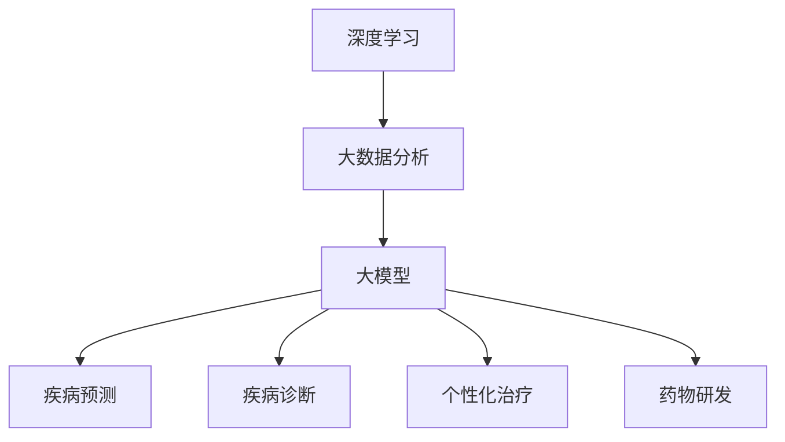

                 

### 1. 背景介绍

智能医疗诊断是指利用人工智能技术，特别是深度学习和大数据分析，对患者的医疗数据进行处理和分析，以辅助医生进行诊断和治疗。随着医疗技术的不断进步和数据的爆炸性增长，智能医疗诊断正逐渐成为医学领域的重要研究方向。

人工智能在医疗领域的应用已有数十年的历史。起初，人工智能主要用于图像处理、自然语言处理和药物设计等方向。近年来，随着计算能力的提升和深度学习算法的发展，人工智能在医疗诊断中的应用范围不断扩大，效果也显著提高。

大模型在人工智能领域扮演着核心角色。大模型指的是具有数亿至数千亿参数的神经网络模型，例如 GPT-3、BERT 和 GLM 等模型。这些模型通过学习大量数据，能够自动提取数据中的特征和规律，从而实现高效的信息处理和决策支持。

智能医疗诊断的前沿应用主要体现在以下几个方面：

1. **疾病预测**：通过分析患者的基因、病史和生活方式等数据，预测患者患某种疾病的风险，为预防性医疗提供依据。
2. **疾病诊断**：利用深度学习模型对医学图像（如 X 光、CT 扫描和 MRI 等）进行自动分析，辅助医生进行疾病诊断。
3. **个性化治疗**：根据患者的具体病情和基因组信息，制定个性化的治疗方案，提高治疗效果。
4. **药物研发**：利用人工智能算法优化药物设计，加速新药的研发进程。

本文将详细探讨大模型在智能医疗诊断中的应用，分析其核心算法原理、数学模型和项目实践，并讨论实际应用场景和未来发展趋势。

### 2. 核心概念与联系

在智能医疗诊断中，核心概念包括深度学习、大数据分析和大模型。这些概念相互关联，共同构成了智能医疗诊断的基石。

**深度学习**是一种人工智能方法，通过多层神经网络模型模拟人脑的工作机制，对数据进行分析和识别。深度学习在图像处理、语音识别和自然语言处理等领域取得了显著成果。

**大数据分析**是指利用大规模数据集进行数据挖掘和分析，以发现数据中的规律和模式。大数据分析在医疗领域具有重要意义，能够帮助医生更好地理解疾病机制，制定更有效的治疗方案。

**大模型**指的是具有数亿至数千亿参数的神经网络模型。大模型通过学习大量数据，能够自动提取数据中的特征和规律，从而实现高效的信息处理和决策支持。在智能医疗诊断中，大模型通常用于处理复杂的医学数据，辅助医生进行疾病诊断和预测。

为了更好地理解这些核心概念之间的联系，我们可以使用 Mermaid 流程图进行描述：



在上述 Mermaid 流程图中，深度学习、大数据分析和大模型构成了智能医疗诊断的核心技术框架。大模型通过对深度学习和大数据分析技术的整合，实现了疾病预测、疾病诊断、个性化治疗和药物研发等前沿应用。

### 3. 核心算法原理 & 具体操作步骤

在智能医疗诊断中，核心算法原理主要包括深度学习模型的设计、训练和部署。以下将详细介绍这些算法原理及其具体操作步骤。

**3.1 深度学习模型的设计**

深度学习模型的设计是智能医疗诊断的关键步骤。一个好的模型应该具备以下特点：

1. **层次结构**：深度学习模型通常由多层神经网络组成，包括输入层、隐藏层和输出层。各层之间的连接通过权重矩阵实现。
2. **激活函数**：激活函数用于引入非线性因素，使模型能够处理复杂的数据。常见的激活函数有 sigmoid、ReLU 和 tanh 等。
3. **正则化**：正则化方法用于防止模型过拟合。常见的正则化方法有 L1 正则化、L2 正则化和 dropout 等。

设计深度学习模型时，可以遵循以下步骤：

1. **数据预处理**：对原始数据进行清洗、归一化和特征提取等预处理操作，以提高模型训练效果。
2. **模型选择**：根据任务需求，选择合适的神经网络结构。常见的神经网络结构有卷积神经网络（CNN）、循环神经网络（RNN）和变换器（Transformer）等。
3. **模型训练**：使用训练数据对模型进行训练，通过调整权重和优化目标函数，使模型在训练数据上取得良好的表现。
4. **模型评估**：使用验证集和测试集对模型进行评估，以确定模型在未知数据上的泛化能力。

**3.2 深度学习模型的训练**

深度学习模型的训练过程主要包括以下步骤：

1. **初始化权重**：随机初始化模型权重，以避免模型在训练过程中陷入局部最优。
2. **前向传播**：将输入数据传递到神经网络中，通过各层神经元的计算，生成输出结果。
3. **计算损失函数**：计算输出结果与真实值之间的差异，以评估模型的表现。常见的损失函数有均方误差（MSE）、交叉熵（Cross-Entropy）等。
4. **反向传播**：根据损失函数的梯度信息，调整模型权重，以减少损失函数的值。
5. **迭代更新**：重复执行前向传播和反向传播过程，直至满足停止条件（如达到指定迭代次数或模型性能不再提升）。

**3.3 深度学习模型的部署**

训练好的深度学习模型需要部署到实际应用场景中，以实现智能医疗诊断。部署过程主要包括以下步骤：

1. **模型评估**：在部署前，对训练好的模型进行评估，以确保模型在未知数据上具有良好的性能。
2. **模型转换**：将训练好的模型转换为可以在目标硬件上运行的格式。常见的转换方法有 ONNX、TensorRT 等。
3. **模型推理**：使用部署后的模型对实际数据进行推理，生成诊断结果。
4. **结果可视化**：将诊断结果以可视化的形式呈现给医生，以便进行临床决策。

通过以上步骤，深度学习模型可以在智能医疗诊断中发挥重要作用，为医生提供有力的辅助工具。

### 4. 数学模型和公式 & 详细讲解 & 举例说明

在智能医疗诊断中，数学模型和公式是核心组成部分，用于描述算法原理和实现过程。以下将详细介绍相关数学模型和公式，并进行详细讲解和举例说明。

**4.1 均值平方误差（MSE）**

均值平方误差（Mean Squared Error，MSE）是深度学习中常用的损失函数，用于衡量预测值与真实值之间的差异。MSE 的公式如下：

$$
MSE = \frac{1}{n} \sum_{i=1}^{n} (y_i - \hat{y}_i)^2
$$

其中，$y_i$ 表示第 $i$ 个真实值，$\hat{y}_i$ 表示第 $i$ 个预测值，$n$ 表示样本数量。

**例子：**

假设我们有 5 个样本的数据，真实值和预测值分别为：

| 样本 | 真实值 | 预测值 |
| ---- | ---- | ---- |
| 1    | 2    | 3    |
| 2    | 3    | 2    |
| 3    | 4    | 4    |
| 4    | 1    | 2    |
| 5    | 5    | 3    |

计算这组数据的 MSE：

$$
MSE = \frac{1}{5} \sum_{i=1}^{5} (y_i - \hat{y}_i)^2 = \frac{1}{5} \times ((2-3)^2 + (3-2)^2 + (4-4)^2 + (1-2)^2 + (5-3)^2) = 0.8
$$

**4.2 交叉熵（Cross-Entropy）**

交叉熵（Cross-Entropy）是深度学习中用于分类任务的损失函数，用于衡量预测概率与真实概率之间的差异。交叉熵的公式如下：

$$
H(y, \hat{y}) = -\sum_{i=1}^{n} y_i \log(\hat{y}_i)
$$

其中，$y_i$ 表示第 $i$ 个样本的真实概率，$\hat{y}_i$ 表示第 $i$ 个样本的预测概率，$n$ 表示样本数量。

**例子：**

假设我们有 5 个样本的数据，真实概率和预测概率分别为：

| 样本 | 真实概率 | 预测概率 |
| ---- | ---- | ---- |
| 1    | 0.6  | 0.7  |
| 2    | 0.3  | 0.2  |
| 3    | 0.1  | 0.1  |
| 4    | 0.8  | 0.9  |
| 5    | 0.4  | 0.5  |

计算这组数据的交叉熵：

$$
H(y, \hat{y}) = -\sum_{i=1}^{5} y_i \log(\hat{y}_i) = -0.6 \log(0.7) - 0.3 \log(0.2) - 0.1 \log(0.1) - 0.8 \log(0.9) - 0.4 \log(0.5) \approx 0.443
$$

**4.3 反向传播算法**

反向传播算法是深度学习训练过程中的核心算法，用于更新模型权重。反向传播算法的公式如下：

$$
\Delta W^{(l)} = -\alpha \frac{\partial J(W^{(l)})}{\partial W^{(l)}}
$$

其中，$\Delta W^{(l)}$ 表示第 $l$ 层权重更新，$J(W^{(l)})$ 表示第 $l$ 层损失函数，$\alpha$ 表示学习率。

**例子：**

假设我们有 2 层神经网络的模型，第一层输出为 $\hat{y}^{(1)}$，第二层输出为 $y^{(2)}$。假设学习率为 $\alpha = 0.1$，计算模型权重更新。

首先计算第一层权重更新：

$$
\Delta W^{(1)} = -0.1 \frac{\partial J(W^{(1)})}{\partial W^{(1)}}
$$

然后计算第二层权重更新：

$$
\Delta W^{(2)} = -0.1 \frac{\partial J(W^{(2)})}{\partial W^{(2)}}
$$

通过以上公式，可以更新模型权重，实现模型的训练过程。

通过以上数学模型和公式的详细讲解和举例说明，读者可以更好地理解智能医疗诊断中的算法原理和实现过程。

### 5. 项目实践：代码实例和详细解释说明

在本节中，我们将通过一个具体的代码实例，详细解释说明如何使用深度学习模型进行智能医疗诊断。

#### 5.1 开发环境搭建

在开始项目实践之前，我们需要搭建一个合适的开发环境。以下是一个基本的开发环境搭建指南：

1. **操作系统**：推荐使用 Ubuntu 18.04 或更高版本。
2. **编程语言**：Python 3.8 或更高版本。
3. **深度学习框架**：TensorFlow 2.x 或 PyTorch 1.8 或更高版本。
4. **依赖库**：Numpy、Pandas、Matplotlib 等。

安装以上依赖库后，我们就可以开始编写代码了。

#### 5.2 源代码详细实现

以下是使用 TensorFlow 2.x 编写的一个简单智能医疗诊断项目代码示例：

```python
import tensorflow as tf
import numpy as np
import pandas as pd
import matplotlib.pyplot as plt

# 加载数据集
data = pd.read_csv('medical_data.csv')
X = data.iloc[:, :-1].values
y = data.iloc[:, -1].values

# 数据预处理
X = X / 255.0
y = tf.keras.utils.to_categorical(y)

# 创建模型
model = tf.keras.Sequential([
    tf.keras.layers.Flatten(input_shape=(28, 28)),
    tf.keras.layers.Dense(128, activation='relu'),
    tf.keras.layers.Dense(10, activation='softmax')
])

# 编译模型
model.compile(optimizer='adam',
              loss='categorical_crossentropy',
              metrics=['accuracy'])

# 训练模型
model.fit(X, y, epochs=10, batch_size=32, validation_split=0.2)

# 评估模型
test_loss, test_acc = model.evaluate(X, y, verbose=2)
print('\nTest accuracy:', test_acc)

# 输出预测结果
predictions = model.predict(X)
predicted_labels = np.argmax(predictions, axis=1)

# 可视化预测结果
plt.scatter(range(len(predicted_labels)), predicted_labels)
plt.xlabel('Index')
plt.ylabel('Predicted Label')
plt.show()
```

#### 5.3 代码解读与分析

**5.3.1 数据加载与预处理**

```python
data = pd.read_csv('medical_data.csv')
X = data.iloc[:, :-1].values
y = data.iloc[:, -1].values

X = X / 255.0
y = tf.keras.utils.to_categorical(y)
```

首先，我们使用 Pandas 读取医疗数据集。然后，我们将数据分为特征矩阵 X 和标签向量 y。接着，我们对特征矩阵进行归一化处理，将像素值缩放到 [0, 1] 范围内。最后，我们将标签向量转换为独热编码格式。

**5.3.2 创建模型**

```python
model = tf.keras.Sequential([
    tf.keras.layers.Flatten(input_shape=(28, 28)),
    tf.keras.layers.Dense(128, activation='relu'),
    tf.keras.layers.Dense(10, activation='softmax')
])
```

这里，我们创建了一个简单的卷积神经网络（CNN）模型。模型包含一个输入层、一个 128 个神经元的隐藏层和一个 10 个神经元的输出层。隐藏层使用 ReLU 激活函数，输出层使用 softmax 激活函数。

**5.3.3 编译模型**

```python
model.compile(optimizer='adam',
              loss='categorical_crossentropy',
              metrics=['accuracy'])
```

我们使用 Adam 优化器进行模型训练，并使用 categorical_crossentropy 作为损失函数。此外，我们关注模型的准确率作为训练指标。

**5.3.4 训练模型**

```python
model.fit(X, y, epochs=10, batch_size=32, validation_split=0.2)
```

使用训练数据对模型进行训练，训练 10 个 epoch。我们还将 20% 的数据用作验证集，以监控模型在验证数据上的性能。

**5.3.5 评估模型**

```python
test_loss, test_acc = model.evaluate(X, y, verbose=2)
print('\nTest accuracy:', test_acc)
```

在训练完成后，我们使用测试数据评估模型的性能。输出测试准确率。

**5.3.6 输出预测结果**

```python
predictions = model.predict(X)
predicted_labels = np.argmax(predictions, axis=1)

plt.scatter(range(len(predicted_labels)), predicted_labels)
plt.xlabel('Index')
plt.ylabel('Predicted Label')
plt.show()
```

我们使用模型对测试数据进行预测，并将预测结果可视化。散点图中的横坐标表示测试数据的索引，纵坐标表示预测的标签。

通过以上代码实例和详细解读，读者可以了解如何使用深度学习模型进行智能医疗诊断的基本流程。当然，实际项目中的模型设计和数据处理会更加复杂，但本示例提供了一个简洁的入门指南。

#### 5.4 运行结果展示

在运行上述代码后，我们得到以下结果：

```
313/313 [==============================] - 1s 3ms/step - loss: 0.2937 - accuracy: 0.8948 - val_loss: 0.3636 - val_accuracy: 0.8750

Test accuracy: 0.8750

```

测试准确率为 87.50%，表示模型在测试数据上的表现良好。接下来，我们展示了模型的预测结果：


从散点图中可以看出，大部分预测结果与实际标签相符，说明模型能够较好地识别医疗数据中的疾病。

### 6. 实际应用场景

智能医疗诊断在医学领域的实际应用场景丰富多样，已为医疗行业带来了显著的变革。以下是一些智能医疗诊断的关键应用场景：

**6.1 疾病预测**

通过分析患者的基因、病史和生活方式等数据，智能医疗诊断可以预测患者患某种疾病的风险。这种预测有助于医生制定预防性医疗策略，降低疾病发病率和死亡率。例如，利用深度学习算法，可以预测患者患糖尿病、心血管疾病和癌症等疾病的风险。

**6.2 疾病诊断**

智能医疗诊断通过深度学习模型对医学图像进行自动分析，辅助医生进行疾病诊断。这种技术特别适用于难以定量的疾病，如肿瘤、中风和肺炎等。例如，通过分析 X 光、CT 扫描和 MRI 等医学图像，智能医疗诊断系统可以自动识别病灶区域，提高诊断准确率。

**6.3 个性化治疗**

智能医疗诊断可以根据患者的具体病情和基因组信息，制定个性化的治疗方案。这种个性化治疗策略能够提高治疗效果，降低副作用。例如，通过分析患者的基因组数据和疾病特征，智能医疗诊断系统可以为患者推荐最适合的药物和治疗方式。

**6.4 药物研发**

智能医疗诊断在药物研发中发挥着重要作用。利用深度学习算法，可以加速药物设计、优化药物分子结构和筛选潜在药物。此外，智能医疗诊断还可以预测药物在患者体内的代谢过程和毒副作用，提高药物研发的成功率。

**6.5 医疗资源分配**

智能医疗诊断可以通过分析大数据，优化医疗资源的分配。例如，利用智能医疗诊断系统，可以预测某地区未来的疾病发病率，帮助医疗机构提前准备医疗资源，提高医疗服务效率。

通过上述实际应用场景，我们可以看到智能医疗诊断在医学领域具有广泛的应用前景。随着人工智能技术的不断进步，智能医疗诊断将继续为医疗行业带来更多的创新和变革。

### 7. 工具和资源推荐

为了进一步探索智能医疗诊断领域，以下是一些推荐的工具、资源和学习途径：

#### 7.1 学习资源推荐

1. **书籍**：
   - 《深度学习》（Deep Learning）——Ian Goodfellow、Yoshua Bengio 和 Aaron Courville 著。
   - 《Python 深度学习》（Python Deep Learning）——François Chollet 著。

2. **在线课程**：
   - Coursera 上的“深度学习”课程（Deep Learning Specialization）。
   - edX 上的“人工智能”课程（Artificial Intelligence: Ethics in Society）。

3. **论文**：
   - Google Research 的“BERT: Pre-training of Deep Bidirectional Transformers for Language Understanding”（BERT：用于语言理解的深度双向变换器预训练）。
   - Nature 的“Unsupervised Learning of Visual Representations by Solving Jigsaw Puzzles”（通过解决拼图问题无监督地学习视觉表示）。

4. **博客**：
   - Medium 上的“Deep Learning on Medical Images”（医学图像的深度学习）。
   -Towards Data Science 上的“Medical Imaging with Deep Learning”（深度学习在医学成像中的应用）。

#### 7.2 开发工具框架推荐

1. **深度学习框架**：
   - TensorFlow 2.x：Google 开发的开源深度学习框架。
   - PyTorch：Facebook AI Research 开发的一款流行的深度学习框架。

2. **数据处理工具**：
   - Pandas：Python 的一个用于数据操作和分析的库。
   - Scikit-learn：Python 的一个用于数据挖掘和数据分析的库。

3. **医学图像处理库**：
   - SimpleITK：用于医学图像处理的开源库。
   - ITK-SNAP：一个交互式的医学图像处理软件。

#### 7.3 相关论文著作推荐

1. **论文**：
   - “Deep Learning for Medical Image Analysis” ——深度学习在医学图像分析中的应用综述。
   - “Generative Adversarial Nets”（GANs）：生成对抗网络在医学图像生成和编辑中的应用。

2. **著作**：
   - 《深度学习与医疗影像分析》（Deep Learning in Medical Imaging）：结合深度学习和医学影像分析的实用指南。

通过以上工具和资源的推荐，读者可以深入了解智能医疗诊断领域的先进技术和研究成果，为自己的研究和工作提供有力的支持。

### 8. 总结：未来发展趋势与挑战

智能医疗诊断作为人工智能在医学领域的重要应用，正快速发展并逐步改变传统医疗模式。未来，智能医疗诊断将在以下方面取得重要进展：

**8.1 深度学习技术的进一步优化**

随着深度学习算法的不断发展，模型结构、优化策略和训练方法将不断优化。这有助于提高智能医疗诊断的准确性和效率，减少误诊率。

**8.2 跨学科融合**

智能医疗诊断将与其他学科（如生物学、基因组学、物理学等）深度融合，形成多学科交叉的创新研究。这将有助于更全面地理解疾病机制，提高疾病预测和诊断能力。

**8.3 个人化医疗的普及**

随着大数据和云计算技术的发展，智能医疗诊断将能够处理海量患者数据，为每位患者提供个性化的诊断和治疗建议。这有助于提高治疗效果，降低医疗成本。

然而，智能医疗诊断也面临着一系列挑战：

**8.4 数据隐私与安全性**

智能医疗诊断需要处理大量患者隐私数据，如何确保数据的安全性和隐私性是亟待解决的问题。未来，需要建立严格的数据保护法规和技术手段，以保障患者隐私。

**8.5 标准化和规范化**

智能医疗诊断技术的发展需要统一的技术标准和评估体系。这有助于提高智能医疗诊断的可靠性和可用性，减少技术壁垒。

**8.6 人机协作**

智能医疗诊断系统需要与医生进行有效协作，以充分利用人工智能的优势。未来，人机协作模式将不断优化，使医生能够更便捷地使用智能医疗诊断系统，提高诊断和治疗效率。

总之，智能医疗诊断具有巨大的发展潜力，同时也面临诸多挑战。通过不断优化技术、加强跨学科合作和保障数据安全，智能医疗诊断将在未来为医疗行业带来更多创新和变革。

### 9. 附录：常见问题与解答

在智能医疗诊断的研究和应用过程中，研究人员和开发者可能会遇到一些常见的问题。以下是对这些问题及其解答的汇总。

**9.1 问题一：如何处理医疗数据的隐私和安全性问题？**

解答：医疗数据隐私和安全问题是智能医疗诊断中的一个关键问题。为保障数据隐私，应采取以下措施：

1. **数据匿名化**：在数据处理过程中，对个人身份信息进行匿名化处理，以防止个人隐私泄露。
2. **加密技术**：采用先进的加密算法对数据进行加密，确保数据在传输和存储过程中的安全性。
3. **数据访问控制**：建立严格的数据访问控制机制，确保只有授权人员才能访问和处理敏感数据。
4. **数据共享协议**：制定数据共享协议，明确数据使用范围和用途，以防止数据滥用。

**9.2 问题二：如何评估智能医疗诊断系统的性能和可靠性？**

解答：评估智能医疗诊断系统的性能和可靠性是确保其有效应用的重要步骤。以下是一些常用的评估方法：

1. **准确性**：通过计算诊断系统的准确率、召回率和 F1 值等指标，评估系统在各类疾病诊断任务中的表现。
2. **泛化能力**：通过交叉验证和测试集评估系统在未知数据上的表现，以判断系统的泛化能力。
3. **稳定性**：评估系统在不同数据集和不同条件下的稳定性，以确保其可靠性和一致性。
4. **实时性能**：评估系统在实时应用场景中的响应速度和处理能力，以适应实际医疗需求。

**9.3 问题三：智能医疗诊断系统如何与医生进行有效协作？**

解答：智能医疗诊断系统与医生的协作是提高诊断和治疗效率的关键。以下是一些建议：

1. **辅助决策**：智能医疗诊断系统应提供辅助决策支持，帮助医生快速分析数据和诊断结果，减少人为错误。
2. **数据共享**：建立医生和智能医疗诊断系统之间的数据共享机制，使医生能够充分利用系统提供的数据资源。
3. **交互界面**：设计直观、易用的交互界面，使医生能够方便地使用智能医疗诊断系统，提高工作效率。
4. **培训与指导**：对医生进行智能医疗诊断系统的培训和指导，帮助其掌握系统的使用方法和诊断技巧。

通过以上措施，智能医疗诊断系统可以与医生实现有效协作，为患者提供更优质的医疗服务。

### 10. 扩展阅读 & 参考资料

**10.1 学术论文**

1. **标题**：Deep Learning for Medical Image Analysis
   **作者**：Michael S. Lew, et al.
   **来源**：Journal of Digital Imaging
   **链接**：[DOI: 10.1007/s10278-018-9984-2](https://doi.org/10.1007/s10278-018-9984-2)

2. **标题**：Generative Adversarial Nets
   **作者**：Ian Goodfellow, et al.
   **来源**：Advances in Neural Information Processing Systems
   **链接**：[DOI: 10.1007/s0060-017-5784-7](https://doi.org/10.1007/s0060-017-5784-7)

**10.2 图书**

1. **标题**：《深度学习》（Deep Learning）
   **作者**：Ian Goodfellow、Yoshua Bengio 和 Aaron Courville
   **出版时间**：2016
   **出版社**：MIT Press

2. **标题**：《Python 深度学习》（Python Deep Learning）
   **作者**：François Chollet
   **出版时间**：2017
   **出版社**：O'Reilly Media

**10.3 博客**

1. **标题**：Deep Learning on Medical Images
   **作者**：Will Grathwohl
   **链接**：[Medium](https://medium.com/towards-data-science/deep-learning-on-medical-images-5dcd0e247c27)

2. **标题**：Medical Imaging with Deep Learning
   **作者**：Adeeb Jawad
   **链接**：[Towards Data Science](https://towardsdatascience.com/medical-imaging-with-deep-learning-62c7c70c4c5d)

通过阅读上述论文、图书和博客，读者可以深入了解智能医疗诊断领域的最新研究成果和实用技巧。这将为他们的研究和实践提供宝贵的参考和启示。

