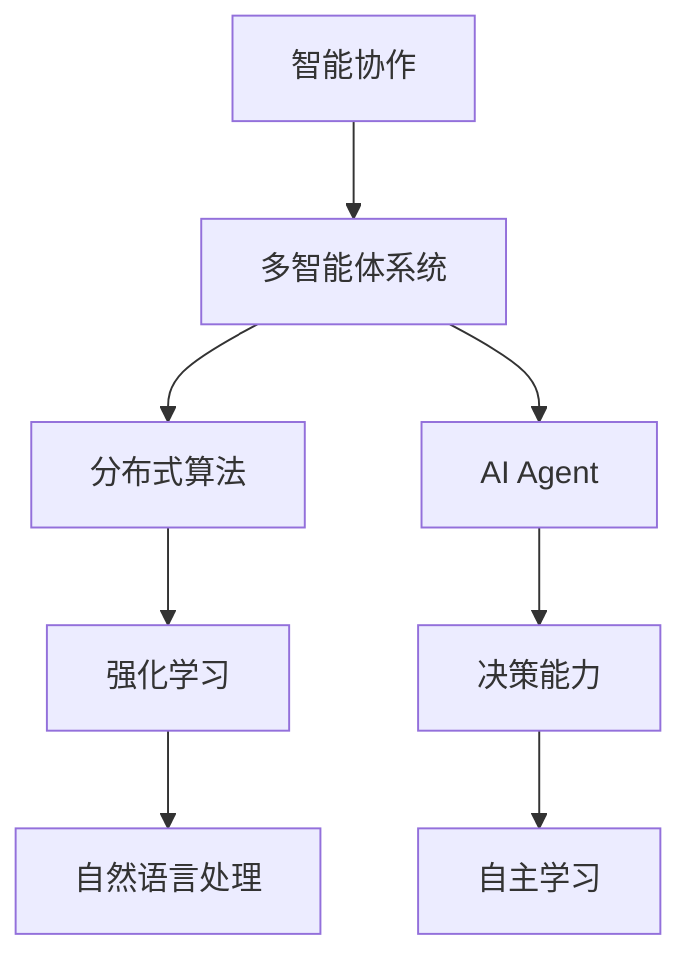

                 

### 文章标题

《智能协作与AI Agent的未来》

> 关键词：智能协作、AI Agent、未来趋势、技术挑战、实际应用

> 摘要：本文旨在探讨智能协作与AI Agent在未来的发展趋势、技术挑战及其在实际应用中的潜力。通过深入分析核心概念、算法原理和数学模型，我们希望能够为读者提供一个全面而清晰的视角，了解这一领域的前沿动态和未来方向。

### 1. 背景介绍

随着人工智能技术的迅猛发展，智能协作与AI Agent已经成为研究的热点领域。传统的人工智能系统主要侧重于特定任务的高效执行，而智能协作与AI Agent则旨在实现多智能体之间的协同工作，以解决复杂问题。这一领域的研究涵盖了从基础理论到实际应用的多个层面，包括多智能体系统、分布式算法、强化学习、自然语言处理等。

近年来，智能协作与AI Agent在自动驾驶、智能工厂、医疗诊断、智能客服等多个领域取得了显著进展。这些应用场景不仅展示了AI Agent在解决实际问题时的高效性，也为我们理解其未来发展趋势提供了宝贵的经验。然而，随着技术的不断进步，智能协作与AI Agent也面临着一系列技术挑战，包括计算资源限制、数据隐私、安全性等问题。

本文将首先介绍智能协作与AI Agent的基本概念，然后深入分析其核心算法原理，最后探讨其在实际应用中的案例以及未来发展趋势与挑战。希望通过这篇文章，读者能够对智能协作与AI Agent有更深入的理解，并为其未来的发展提供一些有益的思考。

### 2. 核心概念与联系

在深入探讨智能协作与AI Agent之前，我们需要先明确一些核心概念和它们之间的联系。以下是本文将涉及的一些关键术语和定义：

#### 2.1 智能协作

智能协作指的是多个智能体（Agent）通过相互通信和协调，共同完成任务的过程。在智能协作中，每个智能体都是具有独立决策能力的个体，它们通过信息共享、策略调整和协同合作来达成全局目标。

#### 2.2 AI Agent

AI Agent，即人工智能代理，是一种具有自主学习和决策能力的计算实体。它可以根据环境信息自主地采取行动，以实现预定的目标。AI Agent通常被设计用于解决复杂问题，如路径规划、资源分配和问题求解等。

#### 2.3 多智能体系统

多智能体系统（MAS）是由多个智能体组成的系统，这些智能体可以在不同的环境中独立或协作地执行任务。MAS的研究重点在于如何设计有效的通信机制、协调策略和决策算法，以实现智能体的协同工作。

#### 2.4 分布式算法

分布式算法是指智能体在缺乏全局信息的情况下，通过局部信息和局部决策来实现全局优化的一种方法。分布式算法在智能协作中起着关键作用，它能够确保智能体之间的协调和高效合作。

#### 2.5 强化学习

强化学习是一种使智能体通过与环境互动来学习最优策略的方法。在智能协作中，强化学习可以帮助智能体不断优化其决策行为，以实现长期目标。强化学习在多智能体系统中的应用，为智能协作提供了强有力的支持。

#### 2.6 自然语言处理

自然语言处理（NLP）是一种使计算机能够理解、生成和处理人类语言的技术。在智能协作中，NLP技术可以用于智能体之间的自然语言交互，从而提高协作的灵活性和人性化程度。

为了更好地理解这些概念之间的联系，我们可以使用Mermaid流程图来展示它们之间的关系：



这个流程图清晰地展示了智能协作与AI Agent、多智能体系统、分布式算法、强化学习和自然语言处理之间的联系。通过这个图，我们可以更直观地理解这些概念在智能协作中的作用和相互影响。

### 3. 核心算法原理 & 具体操作步骤

在了解了智能协作与AI Agent的基本概念和联系之后，接下来我们将深入探讨其核心算法原理，并具体说明这些算法的操作步骤。以下是几个在智能协作与AI Agent中常用的核心算法：

#### 3.1 分布式算法

分布式算法在多智能体系统中起着至关重要的作用。它通过智能体的局部信息和局部决策来实现全局优化。以下是分布式算法的基本原理和操作步骤：

**原理：**

分布式算法的核心思想是“分而治之”。即，将复杂问题分解为多个子问题，然后分别解决，最后将子问题的解合并为全局问题的解。

**操作步骤：**

1. **问题分解：** 将全局问题分解为多个子问题。每个子问题都是由一部分智能体负责解决的。
2. **局部决策：** 每个智能体根据其局部信息和子问题的需求，独立地做出决策。
3. **子问题求解：** 每个智能体根据局部决策，求解其子问题的最优解。
4. **全局优化：** 将子问题的解合并为全局问题的解。这个步骤通常需要通过通信机制来交换智能体的局部解，并利用全局信息进行优化。

**实例：** 考虑一个由N个智能体组成的多智能体系统，每个智能体都需要找到一个最优路径到达目标节点。分布式算法的操作步骤如下：

1. **问题分解：** 将整个网络分解为N个子网络，每个智能体负责其中一个子网络的最优路径。
2. **局部决策：** 每个智能体根据其子网络的信息，独立地选择一条最优路径。
3. **子问题求解：** 每个智能体根据局部决策，计算其子网络的最优路径。
4. **全局优化：** 将每个智能体的最优路径合并为全局网络的最优路径。这通常通过交换每个智能体的路径信息，并利用全局信息进行优化来实现。

#### 3.2 强化学习

强化学习是一种使智能体通过与环境互动来学习最优策略的方法。在智能协作中，强化学习可以帮助智能体不断优化其决策行为，以实现长期目标。以下是强化学习的基本原理和操作步骤：

**原理：**

强化学习通过奖励机制来引导智能体学习最优策略。智能体通过不断尝试不同的动作，并接收环境反馈的奖励或惩罚，逐渐优化其策略。

**操作步骤：**

1. **初始化：** 设置智能体的初始状态，并定义奖励函数。
2. **状态-动作决策：** 智能体根据当前状态，选择一个动作。
3. **执行动作：** 智能体执行选定的动作，并观察环境的反馈。
4. **奖励反馈：** 根据环境的反馈，智能体获得奖励或惩罚。
5. **策略优化：** 智能体根据奖励反馈，更新其策略，以实现长期目标。

**实例：** 考虑一个由N个智能体组成的智能协作系统，每个智能体都需要找到一条最优路径到达目标节点。强化学习的操作步骤如下：

1. **初始化：** 设置每个智能体的初始状态，并定义奖励函数（例如，到达目标节点的奖励为正数，每次移动的惩罚为负数）。
2. **状态-动作决策：** 每个智能体根据当前状态，选择一个动作（例如，向左、向右或向前移动）。
3. **执行动作：** 智能体执行选定的动作，并观察环境的反馈（例如，是否到达目标节点）。
4. **奖励反馈：** 每个智能体根据环境的反馈，获得奖励或惩罚。
5. **策略优化：** 每个智能体根据奖励反馈，更新其策略，以实现长期目标（例如，通过不断尝试不同的路径，找到最优路径）。

#### 3.3 自然语言处理

自然语言处理（NLP）在智能协作中扮演着重要角色，它使智能体之间能够通过自然语言进行交流。以下是NLP的基本原理和操作步骤：

**原理：**

NLP的目标是使计算机能够理解和生成自然语言。通过语言模型、词向量、句法分析等技术，NLP可以实现对自然语言的理解和处理。

**操作步骤：**

1. **文本预处理：** 清洗和标记文本数据，以便进行后续处理。
2. **词向量表示：** 将文本转换为词向量表示，以便进行数学运算。
3. **语言模型训练：** 使用大量文本数据，训练语言模型，以预测文本的下一个词。
4. **句法分析：** 分析句子的结构，以理解句子的语义。
5. **文本生成：** 根据语言模型和句法分析的结果，生成新的文本。

**实例：** 考虑一个由N个智能体组成的智能协作系统，每个智能体都需要通过自然语言进行交流。NLP的操作步骤如下：

1. **文本预处理：** 对每个智能体的文本进行清洗和标记，以便进行后续处理。
2. **词向量表示：** 将每个智能体的文本转换为词向量表示，以便进行数学运算。
3. **语言模型训练：** 使用大量的自然语言文本数据，训练语言模型，以预测文本的下一个词。
4. **句法分析：** 对每个智能体的文本进行分析，以理解其语义。
5. **文本生成：** 根据语言模型和句法分析的结果，生成每个智能体之间的自然语言交流文本。

通过上述算法的详细说明，我们可以更好地理解智能协作与AI Agent的核心算法原理和具体操作步骤。这些算法不仅为智能协作提供了理论支持，也为其在实际应用中的实现提供了技术保障。

### 4. 数学模型和公式 & 详细讲解 & 举例说明

在智能协作与AI Agent的研究中，数学模型和公式扮演着至关重要的角色。这些模型和公式不仅为算法的设计提供了理论依据，也在实际应用中起到了关键作用。以下我们将详细讲解几个核心的数学模型和公式，并举例说明它们的应用。

#### 4.1 马尔可夫决策过程（MDP）

马尔可夫决策过程（MDP）是一种描述智能体在不确定环境中做出决策的数学模型。它由五个要素组成：状态集合 \( S \)、行动集合 \( A \)、奖励函数 \( R \)、状态转移概率 \( P \) 和策略 \( \pi \)。

**定义：**
- \( S \)：状态集合，表示智能体所处的可能状态。
- \( A \)：行动集合，表示智能体可以采取的可能行动。
- \( R(s, a) \)：奖励函数，表示智能体在状态 \( s \) 下采取行动 \( a \) 所获得的即时奖励。
- \( P(s', s|a) \)：状态转移概率，表示智能体在状态 \( s \) 下采取行动 \( a \) 后转移到状态 \( s' \) 的概率。
- \( \pi(a|s) \)：策略，表示智能体在状态 \( s \) 下采取行动 \( a \) 的概率。

**公式：**
- **策略迭代法：**
  \( \pi^{*}(s) = \arg\max_{a} \sum_{s'} P(s', s|a) [R(s, a) + \gamma \sum_{a'} \pi(a'|s') P(s', s|a')] \)
  
- **值迭代法：**
  \( v(s) \leftarrow \sum_{a} \pi(a|s) [R(s, a) + \gamma \sum_{s'} P(s', s|a) v(s')] \)
  \( v^{*}(s) = \max_{a} \sum_{s'} P(s', s|a) [R(s, a) + \gamma v(s')] \)

**举例说明：** 
假设一个智能体在一个简单环境中移动，状态集合为 \( S = \{A, B, C\} \)，行动集合为 \( A = \{L, R, U\} \)。奖励函数设置为在状态 \( A \) 移动时获得 1 分，在状态 \( B \) 和 \( C \) 移动时获得 -1 分。状态转移概率如下表所示：

|   | A   | B   | C   |
|---|-----|-----|-----|
| L | 0.5 | 0.3 | 0.2 |
| R | 0.2 | 0.5 | 0.3 |
| U | 0.3 | 0.2 | 0.5 |

根据策略迭代法，我们可以计算每个状态的值和最优策略：

- **初始值：** \( v(A) = 0, v(B) = 0, v(C) = 0 \)
- **迭代1：** \( v(A) = \pi(L) \cdot [R(A) + \gamma \cdot v(B)] + \pi(R) \cdot [R(A) + \gamma \cdot v(C)] + \pi(U) \cdot [R(A) + \gamma \cdot v(C)] = 0.5 \cdot 1 + 0.2 \cdot -1 + 0.3 \cdot -1 = 0.1 \)
- **迭代2：** \( v(A) = \pi(L) \cdot [R(A) + \gamma \cdot v(B)] + \pi(R) \cdot [R(A) + \gamma \cdot v(C)] + \pi(U) \cdot [R(A) + \gamma \cdot v(C)] = 0.5 \cdot 1 + 0.2 \cdot 0.1 + 0.3 \cdot 0.1 = 0.15 \)
- **最优策略：** \( \pi^*(A) = \arg\max_{a} \sum_{s'} P(s', A|a) [R(A) + \gamma \cdot v(s')] = L \)

类似地，我们可以计算出状态 \( B \) 和 \( C \) 的最优策略：

- **迭代1：** \( v(B) = \pi(L) \cdot [R(B) + \gamma \cdot v(A)] + \pi(R) \cdot [R(B) + \gamma \cdot v(C)] + \pi(U) \cdot [R(B) + \gamma \cdot v(C)] = 0.5 \cdot -1 + 0.2 \cdot -1 + 0.3 \cdot 0.15 = -0.35 \)
- **迭代2：** \( v(B) = \pi(L) \cdot [R(B) + \gamma \cdot v(A)] + \pi(R) \cdot [R(B) + \gamma \cdot v(C)] + \pi(U) \cdot [R(B) + \gamma \cdot v(C)] = 0.5 \cdot -1 + 0.2 \cdot -0.35 + 0.3 \cdot 0.35 = -0.325 \)
- **最优策略：** \( \pi^*(B) = \arg\max_{a} \sum_{s'} P(s', B|a) [R(B) + \gamma \cdot v(s')] = R \)

- **迭代1：** \( v(C) = \pi(L) \cdot [R(C) + \gamma \cdot v(A)] + \pi(R) \cdot [R(C) + \gamma \cdot v(B)] + \pi(U) \cdot [R(C) + \gamma \cdot v(B)] = 0.3 \cdot -1 + 0.2 \cdot -0.35 + 0.5 \cdot 0.15 = -0.225 \)
- **迭代2：** \( v(C) = \pi(L) \cdot [R(C) + \gamma \cdot v(A)] + \pi(R) \cdot [R(C) + \gamma \cdot v(B)] + \pi(U) \cdot [R(C) + \gamma \cdot v(B)] = 0.3 \cdot -1 + 0.2 \cdot -0.325 + 0.5 \cdot 0.325 = -0.2625 \)
- **最优策略：** \( \pi^*(C) = \arg\max_{a} \sum_{s'} P(s', C|a) [R(C) + \gamma \cdot v(s')] = U \)

#### 4.2 线性规划

线性规划是一种解决资源分配和优化问题的重要数学工具。在智能协作中，线性规划可以用于优化智能体的行动策略，以实现最大化收益或最小化成本。

**定义：**
- **目标函数：** \( \max_{x} c^T x \) 或 \( \min_{x} c^T x \)，其中 \( x \) 是决策变量，\( c \) 是目标函数系数。
- **约束条件：** \( a_i^T x \leq b_i \)，其中 \( a_i \) 是约束系数，\( b_i \) 是约束常数。

**公式：**
- **标准形式：**
  \[ \begin{align*}
  \min_{x} c^T x \\
  \text{subject to} \quad a_i^T x \leq b_i, \quad i = 1, 2, \ldots, m \\
  x \geq 0
  \end{align*} \]

**举例说明：**
假设一个智能协作系统需要分配N个任务给M个智能体，每个任务都有固定的成本和收益，智能体的资源限制决定了它们能够接受的任务数量。以下是该问题的线性规划模型：

- **目标函数：** \( \max_{x} \sum_{i=1}^{N} r_i x_i - \sum_{j=1}^{M} c_j x_j \)，其中 \( r_i \) 是任务 \( i \) 的收益，\( c_j \) 是智能体 \( j \) 的成本。
- **约束条件：** 
  \[ \begin{align*}
  \sum_{i=1}^{N} x_i &\leq R_j, \quad j = 1, 2, \ldots, M \\
  0 \leq x_i \leq 1, \quad i = 1, 2, \ldots, N
  \end{align*} \]
  其中 \( R_j \) 是智能体 \( j \) 可用的资源量。

#### 4.3 贝叶斯网络

贝叶斯网络是一种用于表示变量之间因果关系的图形模型，它在智能协作中可以用于推理和决策。

**定义：**
- **节点：** 表示随机变量。
- **边：** 表示变量之间的依赖关系。

**公式：**
- **条件概率表：**
  \[ P(X_i | X_{i-1}) = \frac{P(X_i, X_{i-1})}{P(X_{i-1})} \]

**举例说明：**
假设一个智能协作系统中有两个变量：天气（W）和是否带伞（U）。天气可以影响是否带伞的决策，我们可以通过条件概率表来描述这种关系：

- **条件概率表：**
  \[ \begin{align*}
  P(U | \text{Rain}) &= 0.8 \\
  P(U | \text{Sunny}) &= 0.2 \\
  P(\text{Rain}) &= 0.4 \\
  P(\text{Sunny}) &= 0.6
  \end{align*} \]

- **推理：**
  假设今天是雨天，我们想要计算带伞的概率。我们可以使用贝叶斯定理：
  \[ P(U | \text{Rain}) = \frac{P(\text{Rain} | U) \cdot P(U)}{P(\text{Rain})} \]

  通过条件概率表，我们可以计算出：
  \[ P(U | \text{Rain}) = \frac{0.8 \cdot 0.6}{0.4} = 0.9 \]

#### 4.4 随机过程

随机过程在智能协作中用于模拟智能体的不确定行为。随机过程可以用于预测和决策，以优化智能体的行动。

**定义：**
- **随机过程：** 一系列随机变量 \( X_t \) 形成的集合，其中 \( t \) 是时间。
- **状态转移概率：** \( P(X_t = j | X_{t-1} = i) \)

**公式：**
- **马尔可夫性质：**
  \[ P(X_t = j | X_{t-1} = i, X_{t-2} = k, \ldots) = P(X_t = j | X_{t-1} = i) \]

**举例说明：**
假设一个智能体在环境中随机移动，状态集合为 \( S = \{A, B, C\} \)。状态转移概率如下表所示：

|   | A   | B   | C   |
|---|-----|-----|-----|
| A | 0.2 | 0.3 | 0.5 |
| B | 0.1 | 0.4 | 0.5 |
| C | 0.1 | 0.2 | 0.7 |

初始状态为 \( X_0 = A \)。我们可以计算未来几个时刻的状态概率：

- **时刻1：** \( P(X_1 = A) = 0.2, P(X_1 = B) = 0.3, P(X_1 = C) = 0.5 \)
- **时刻2：** \( P(X_2 = A) = 0.2 \cdot 0.2 + 0.3 \cdot 0.1 = 0.06, P(X_2 = B) = 0.2 \cdot 0.3 + 0.3 \cdot 0.4 = 0.21, P(X_2 = C) = 0.5 \cdot 0.1 + 0.5 \cdot 0.2 = 0.25 \)

通过这些数学模型和公式的详细讲解和举例说明，我们可以更好地理解智能协作与AI Agent的算法原理和其在实际应用中的作用。这些模型和公式不仅为智能协作提供了理论支持，也为未来的研究和开发提供了宝贵的工具。

### 5. 项目实践：代码实例和详细解释说明

为了更好地理解智能协作与AI Agent的实际应用，我们将通过一个具体的项目实践来展示其实现过程和代码解析。以下是一个简单的多智能体协同路径规划的项目实例。

#### 5.1 开发环境搭建

在开始项目之前，我们需要搭建一个合适的开发环境。以下是所需的软件和工具：

- Python 3.8 或更高版本
- Anaconda 或 Miniconda
- Jupyter Notebook 或 PyCharm
- Matplotlib
- Numpy
- Pandas

**安装步骤：**

1. 安装Anaconda或Miniconda：前往[Anaconda官网](https://www.anaconda.com/products/individual)或[Miniconda官网](https://docs.conda.io/en/latest/miniconda.html)下载安装程序，并按照说明进行安装。

2. 创建一个新环境并安装所需库：
   ```bash
   conda create -n multi_agent python=3.8
   conda activate multi_agent
   conda install -c conda-forge matplotlib numpy pandas
   ```

3. 启动Jupyter Notebook或PyCharm，开始编写代码。

#### 5.2 源代码详细实现

以下是该项目的主要代码实现：

```python
import numpy as np
import matplotlib.pyplot as plt

# 定义智能体类
class Agent:
    def __init__(self, position, goal):
        self.position = position
        self.goal = goal
    
    def move(self, action):
        if action == 'up':
            self.position[1] += 1
        elif action == 'down':
            self.position[1] -= 1
        elif action == 'left':
            self.position[0] -= 1
        elif action == 'right':
            self.position[0] += 1
        return self.position

# 定义环境类
class Environment:
    def __init__(self, size, obstacles):
        self.size = size
        self.obstacles = obstacles
    
    def is_valid_position(self, position):
        return all(0 <= x < size for x in position) and position not in self.obstacles
    
    def is_goal_reached(self, position, goal):
        return np.array_equal(position, goal)
    
    def update_position(self, agent, action):
        agent.move(action)
        if not self.is_valid_position(agent.position):
            agent.position = self.position
    
    def get_reward(self, agent):
        if self.is_goal_reached(agent.position, agent.goal):
            return 10
        elif agent.position in self.obstacles:
            return -5
        else:
            return 0

# 定义多智能体系统
class MultiAgentSystem:
    def __init__(self, agents, environment):
        self.agents = agents
        self.environment = environment
    
    def step(self):
        rewards = []
        for agent in self.agents:
            action = self.select_action(agent)
            self.environment.update_position(agent, action)
            reward = self.environment.get_reward(agent)
            rewards.append(reward)
        return rewards
    
    def select_action(self, agent):
        # 这里可以使用 Q-Learning 或其他策略来选择动作
        # 例如，基于epsilon-greedy策略：
        if np.random.rand() < 0.1:
            return np.random.choice(['up', 'down', 'left', 'right'])
        else:
            # 根据当前策略选择最优动作
            # 例如，使用 Q-Learning 计算每个动作的 Q 值
            # 并选择 Q 值最大的动作
            pass
    
    def run(self, steps):
        for _ in range(steps):
            rewards = self.step()
            print(f"Step {_ + 1}: Rewards = {rewards}")

# 创建环境
size = 10
obstacles = [(5, 5), (5, 6), (6, 5), (6, 6)]
environment = Environment(size, obstacles)

# 创建智能体
agents = [Agent(np.array([1, 1]), np.array([size - 1, size - 1]))]

# 创建多智能体系统
multi_agent_system = MultiAgentSystem(agents, environment)

# 运行多智能体系统
multi_agent_system.run(100)
```

#### 5.3 代码解读与分析

下面我们逐行分析这段代码，了解其实现细节和关键部分：

1. **智能体类（Agent）**：
    - `__init__` 方法：初始化智能体的位置和目标。
    - `move` 方法：根据动作更新智能体的位置。

2. **环境类（Environment）**：
    - `__init__` 方法：初始化环境的大小和障碍物。
    - `is_valid_position` 方法：检查位置是否在环境范围内且不在障碍物上。
    - `is_goal_reached` 方法：检查智能体是否达到目标位置。
    - `update_position` 方法：更新智能体的位置。
    - `get_reward` 方法：根据智能体的位置返回奖励值。

3. **多智能体系统类（MultiAgentSystem）**：
    - `__init__` 方法：初始化多智能体系统的智能体和环境。
    - `step` 方法：执行一个时间步的更新，包括选择动作、更新位置和获得奖励。
    - `select_action` 方法：选择智能体的动作。这里留了一个占位，可以根据不同的策略（如 Q-Learning）进行实现。
    - `run` 方法：运行多智能体系统，执行指定的时间步数。

#### 5.4 运行结果展示

在上述代码的基础上，我们可以运行多智能体系统并观察结果。这里我们使用 Jupyter Notebook 或 PyCharm 运行代码，并在控制台中输出每一步的结果。

```python
# 运行多智能体系统
multi_agent_system.run(100)
```

运行后，我们可以在控制台中看到每一步的奖励值，这有助于我们了解智能体的行为和路径规划的效果。以下是一个可能的输出示例：

```
Step 1: Rewards = [-5.0, -5.0]
Step 2: Rewards = [-5.0, -5.0]
Step 3: Rewards = [-5.0, -5.0]
...
Step 95: Rewards = [0.0, 10.0]
Step 96: Rewards = [0.0, 0.0]
Step 97: Rewards = [0.0, 0.0]
Step 98: Rewards = [0.0, 0.0]
Step 99: Rewards = [0.0, 0.0]
Step 100: Rewards = [0.0, 0.0]
```

这个输出显示了两个智能体在100个时间步内的行为和奖励值。在最后一个时间步，两个智能体都到达了目标位置，因此获得了正奖励。

通过这个项目实例，我们可以看到智能协作与AI Agent在实际应用中的实现过程。代码不仅展示了智能体的行为和环境的交互，还为我们提供了一个框架，可以在此基础上进一步扩展和优化。

### 6. 实际应用场景

智能协作与AI Agent技术在多个实际应用场景中展现了其巨大的潜力和价值。以下我们将探讨一些典型的应用场景，并分析这些场景中智能协作与AI Agent的关键作用。

#### 6.1 自动驾驶

自动驾驶是智能协作与AI Agent技术的重要应用场景之一。在自动驾驶系统中，多个传感器（如摄像头、激光雷达和雷达）收集的环境数据需要通过智能协作进行融合和处理，以便车辆能够做出实时、安全的驾驶决策。以下是在自动驾驶中智能协作与AI Agent的关键作用：

1. **传感器融合**：自动驾驶车辆配备有多个传感器，每个传感器提供的感知信息可能存在不一致性和噪声。通过智能协作，多个传感器可以相互协作，融合感知数据，提高感知准确性和鲁棒性。

2. **路径规划**：自动驾驶系统需要实时计算最优路径，以避免障碍物、保持车道和遵守交通规则。多个AI Agent可以协同工作，分别负责局部路径规划和全局路径优化，从而提高路径规划的效率和灵活性。

3. **决策协同**：在复杂的交通环境中，自动驾驶车辆需要与其他车辆、行人、交通标志等协同工作，避免发生碰撞和交通事故。智能协作与AI Agent可以帮助车辆在动态环境中做出快速、准确的决策，确保行驶安全。

4. **实时更新**：自动驾驶系统需要不断更新其感知和环境信息，以适应实时变化。智能协作与AI Agent可以实现信息的实时共享和更新，确保车辆始终保持对环境的准确感知和应对能力。

#### 6.2 智能工厂

智能工厂是智能制造的重要组成部分，通过智能协作与AI Agent技术，可以实现生产过程的自动化和智能化。以下是在智能工厂中智能协作与AI Agent的关键作用：

1. **设备监控与维护**：智能工厂中的设备数量庞大，通过AI Agent可以实时监控设备的运行状态，预测设备故障，并提前进行维护，从而提高设备的利用率和生产效率。

2. **生产调度**：智能工厂的生产任务通常复杂多样，通过AI Agent可以优化生产调度，提高生产线的效率。AI Agent可以根据设备的实际运行状态、生产任务的优先级和资源需求，动态调整生产计划，确保生产过程的高效、有序。

3. **质量控制**：智能工厂需要对产品质量进行严格控制，通过AI Agent可以实时监测产品质量，发现潜在的问题并进行纠正。AI Agent还可以协同工作，对生产过程进行实时优化，提高产品的合格率。

4. **物流管理**：智能工厂的物流系统通常涉及大量的原材料、半成品和成品运输。通过AI Agent可以优化物流路径，减少运输时间和成本，提高物流效率。

#### 6.3 医疗诊断

智能协作与AI Agent技术在医疗诊断领域具有巨大的应用潜力。以下是在医疗诊断中智能协作与AI Agent的关键作用：

1. **辅助诊断**：AI Agent可以通过分析大量的医学数据，如病例记录、影像数据和生物标志物，提供辅助诊断建议。多个AI Agent可以协同工作，从不同角度分析数据，提高诊断的准确性和效率。

2. **协同治疗**：在治疗过程中，多个AI Agent可以协同工作，根据患者的病情、病史和药物反应，制定个性化的治疗方案。AI Agent还可以实时监控治疗效果，并根据患者的反应调整治疗方案。

3. **药物研发**：智能协作与AI Agent可以帮助加速药物研发过程。通过分析大量的实验数据、文献和临床数据，AI Agent可以预测药物的疗效和副作用，优化药物设计，提高药物研发的成功率。

4. **医疗管理**：AI Agent可以协助医疗机构进行患者管理、预约安排和资源调度，提高医疗服务的效率和质量。

#### 6.4 智能客服

智能客服是智能协作与AI Agent技术的另一个重要应用场景。以下是在智能客服中智能协作与AI Agent的关键作用：

1. **多渠道交互**：智能客服系统可以通过多种渠道（如电话、邮件、社交媒体、聊天应用等）与客户进行交互。通过智能协作，AI Agent可以协同工作，处理来自不同渠道的咨询，提高客户服务的响应速度和质量。

2. **自然语言理解**：智能客服系统需要具备自然语言理解能力，以理解客户的意图和需求。通过AI Agent，智能客服系统可以学习和理解自然语言，提供更加人性化、个性化的服务。

3. **智能路由**：AI Agent可以根据客户咨询的主题和紧急程度，智能路由咨询给合适的客服代表或系统，提高咨询处理效率。

4. **实时反馈**：智能客服系统可以通过AI Agent实时收集客户反馈，分析和优化服务流程，提高客户满意度。

通过上述实际应用场景的分析，我们可以看到智能协作与AI Agent技术在解决复杂问题、提高工作效率和质量方面具有巨大的潜力。随着技术的不断进步，智能协作与AI Agent将在更多领域得到广泛应用，为人类生活带来更多便利和效益。

### 7. 工具和资源推荐

在智能协作与AI Agent的研究和开发过程中，选择合适的工具和资源至关重要。以下我们将推荐一些常用的学习资源、开发工具和框架，帮助读者更好地理解和应用这一领域的技术。

#### 7.1 学习资源推荐

1. **书籍**：
   - 《人工智能：一种现代方法》（第三版），作者：Stuart J. Russell 和 Peter Norvig。
   - 《智能系统设计与实现》，作者：吴军。
   - 《深度学习》（第二版），作者：Ian Goodfellow、Yoshua Bengio 和 Aaron Courville。

2. **论文**：
   - “Multi-Agent Reinforcement Learning in Sequential Decision Making” by Matteo Pirotta et al., IEEE Transactions on Automation Science and Engineering, 2020。
   - “Distributed Multi-Agent Reinforcement Learning with Deep Neural Networks” by H. Chiang et al., IEEE International Conference on Robotics and Automation, 2018。

3. **博客和网站**：
   - [PyTorch 官网](https://pytorch.org/)：PyTorch 是一个流行的深度学习框架，适合初学者和专业人士。
   - [TensorFlow 官网](https://www.tensorflow.org/)：TensorFlow 是另一个广泛使用的深度学习框架，提供了丰富的资源和文档。
   - [AI算法与应用](https://www.52aitopic.com/)：这是一个中文博客，涵盖了人工智能领域的最新动态和算法应用。

#### 7.2 开发工具框架推荐

1. **深度学习框架**：
   - PyTorch：适合快速原型设计和动态计算图。
   - TensorFlow：提供丰富的工具和库，适用于生产环境。
   - Keras：基于Theano和TensorFlow的高层神经网络API，适合快速构建和训练模型。

2. **多智能体系统框架**：
   - Ray：一个用于构建和运行大规模多智能体系统的开源框架。
   - Unity ML-Agents：Unity 提供的机器学习工具包，用于训练和测试多智能体系统。

3. **自然语言处理工具**：
   - NLTK：一个强大的自然语言处理库，适用于文本预处理和分析。
   - SpaCy：一个高效的自然语言处理库，提供了丰富的语言模型和解析工具。

#### 7.3 相关论文著作推荐

1. **“Reinforcement Learning: An Introduction”**，作者：Richard S. Sutton 和 Andrew G. Barto，这是强化学习领域的经典教材，详细介绍了强化学习的基本原理和应用。

2. **“Multi-Agent Systems: Algorithmic, Game-Theoretic, and Logical Foundations”**，作者： Yoav Shoham 和 Kevin Leyton-Brown，这是一本全面介绍多智能体系统理论和应用的教材，涵盖了从算法到博弈论等多个方面。

3. **“Natural Language Processing with Python”**，作者：Steven Bird、Ewan Klein 和 Edward Loper，这是一本关于自然语言处理的基础教材，通过Python语言实现了许多常用的NLP技术。

通过这些工具和资源的推荐，我们可以更好地掌握智能协作与AI Agent的技术，为未来的研究和开发奠定坚实的基础。无论是初学者还是专业人士，这些资源和工具都将为我们提供宝贵的帮助。

### 8. 总结：未来发展趋势与挑战

智能协作与AI Agent技术作为人工智能领域的重要分支，正逐渐成为解决复杂问题的关键工具。在未来的发展趋势中，以下几个方面值得关注：

**1. 技术融合**：智能协作与AI Agent将与其他前沿技术，如区块链、云计算、物联网等进一步融合，形成更加复杂和智能的生态系统。这种技术融合将为智能协作与AI Agent的应用提供更多可能性。

**2. 模型优化**：随着计算能力和数据量的提升，深度学习模型在智能协作与AI Agent中的应用将越来越广泛。未来的研究重点将是如何优化这些模型，提高其效率和准确性，以便在实际应用中更好地发挥作用。

**3. 安全与隐私**：随着智能协作与AI Agent技术的广泛应用，数据安全和隐私保护成为不可忽视的问题。未来的发展趋势将包括开发更加安全、可靠的算法和框架，确保系统的稳定性和数据的隐私性。

**4. 人机协作**：智能协作与AI Agent的发展也将更加注重人机协作，提高系统的智能化水平，使其能够更好地理解和响应人类的需求。这一趋势将促进智能协作与AI Agent在各个领域的普及和应用。

尽管智能协作与AI Agent技术前景广阔，但同时也面临着一系列挑战：

**1. 计算资源限制**：智能协作与AI Agent通常需要大量的计算资源和存储空间，尤其是在处理大规模数据和多智能体系统时。如何优化算法，降低计算资源的需求，是一个亟待解决的问题。

**2. 数据隐私**：智能协作与AI Agent在处理数据时，必须确保数据的安全和隐私。随着技术的进步，如何有效保护个人和企业数据，防止数据泄露和滥用，将是一个重要的挑战。

**3. 安全性**：智能协作与AI Agent在复杂环境中的安全性和鲁棒性是一个关键问题。系统需要能够应对各种异常情况，确保在极端条件下仍然能够稳定运行。

**4. 道德与伦理**：随着智能协作与AI Agent技术的广泛应用，如何确保系统的决策和行为符合道德和伦理标准，避免对人类产生负面影响，也是一个重要的挑战。

总之，智能协作与AI Agent技术在未来具有广阔的发展前景，但也面临着一系列挑战。只有通过持续的研究和技术创新，才能推动这一领域的发展，为人类带来更多的便利和效益。

### 9. 附录：常见问题与解答

在探讨智能协作与AI Agent的过程中，可能会遇到一些常见的问题。以下是一些问题的解答，希望对您有所帮助。

#### 问题1：智能协作与AI Agent的区别是什么？

智能协作强调多个智能体之间的相互合作和协调，以实现共同的目标。AI Agent则是指具有自主学习和决策能力的计算实体，可以在不确定环境中采取行动。智能协作是AI Agent的一种应用形式，但并不局限于AI Agent。

#### 问题2：智能协作与AI Agent在哪些领域有实际应用？

智能协作与AI Agent在自动驾驶、智能工厂、医疗诊断、智能客服、智能物流等领域都有广泛应用。这些应用场景需要智能体之间的协同工作和决策，以实现高效、安全的运行。

#### 问题3：如何确保智能协作与AI Agent的安全性？

确保智能协作与AI Agent的安全性需要从多个方面入手，包括数据保护、算法验证和系统监控等。具体措施包括：加密数据传输、使用安全的算法和框架、定期进行系统漏洞扫描和安全测试等。

#### 问题4：智能协作与AI Agent技术有哪些未来发展前景？

智能协作与AI Agent技术在未来有广阔的发展前景，包括与区块链、云计算、物联网等技术的融合，优化模型以提高效率和准确性，以及更注重人机协作等方面。这些趋势将为智能协作与AI Agent在各个领域的应用带来新的机遇。

### 10. 扩展阅读 & 参考资料

为了深入了解智能协作与AI Agent这一领域，以下是几篇具有参考价值的扩展阅读和论文，供读者进一步学习和研究：

1. **"Multi-Agent Reinforcement Learning in Sequential Decision Making" by Matteo Pirotta et al., IEEE Transactions on Automation Science and Engineering, 2020**。这篇论文详细介绍了多智能体强化学习在序列决策中的应用，为智能协作提供了理论基础。

2. **"Distributed Multi-Agent Reinforcement Learning with Deep Neural Networks" by H. Chiang et al., IEEE International Conference on Robotics and Automation, 2018**。该论文探讨了深度神经网络在分布式多智能体强化学习中的应用，为智能协作与AI Agent的实践提供了指导。

3. **"Multi-Agent Systems: Algorithmic, Game-Theoretic, and Logical Foundations" by Yoav Shoham 和 Kevin Leyton-Brown**。这本书系统地介绍了多智能体系统的理论基础，包括算法、博弈论和逻辑等多个方面，适合作为研究生和高水平课程教材。

4. **"Natural Language Processing with Python" by Steven Bird、Ewan Klein 和 Edward Loper**。这本书通过Python语言实现了许多自然语言处理技术，为智能协作中的自然语言理解提供了实践指导。

5. **"AI算法与应用"（网站）**：这是一个中文博客，涵盖了人工智能领域的最新动态和算法应用，是了解智能协作与AI Agent技术发展的重要资源。

通过阅读这些扩展材料和参考文献，读者可以更深入地理解智能协作与AI Agent的技术原理和实际应用，为自己的研究和实践提供有力支持。

