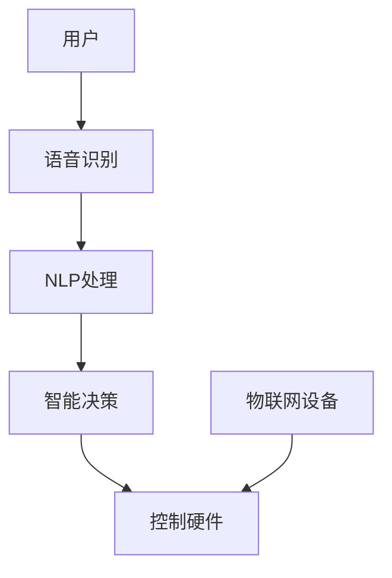

                 

### 背景介绍

智能厨房助手，作为一种新兴的智能家居设备，正在悄然改变着人们的烹饪习惯和生活方式。随着物联网（IoT）技术的发展和智能家居市场的不断扩展，智能厨房助手已经从最初的设想逐步走向现实。

#### 智能厨房助手的发展历史

智能厨房助手的概念最早可以追溯到20世纪80年代。当时，人们开始尝试将计算机技术应用于厨房，希望能够通过智能设备来简化烹饪过程。然而，由于技术水平的限制，这些早期尝试大多停留在概念阶段。

进入21世纪，随着人工智能（AI）技术的突破，智能厨房助手开始进入实际应用阶段。2010年，微软推出了一款名为“Cooks Assist”的智能厨房助手应用程序，它可以通过语音识别和自然语言处理技术来协助用户完成烹饪任务。然而，这款应用程序在用户体验和实用性方面还存在很多不足。

随着物联网和人工智能技术的进一步发展，智能厨房助手开始迎来新的发展机遇。2015年，亚马逊推出了Alexa智能音箱，它可以与智能厨房设备进行连接，实现语音控制功能。2017年，谷歌也推出了Google Home智能音箱，同样具备智能厨房助手的特性。

#### 智能厨房助手的现状与市场前景

目前，智能厨房助手市场正处于快速增长阶段。根据市场研究机构的报告，全球智能厨房助手市场规模预计将在未来几年内达到数十亿美元。随着消费者对智能家居设备的接受度不断提高，智能厨房助手有望成为智能家居市场的重要组成部分。

智能厨房助手不仅能够提高烹饪效率，还可以提供个性化的烹饪建议和健康饮食指导。例如，一些智能厨房助手可以通过分析用户的口味偏好和饮食习惯，提供定制化的菜谱和烹饪建议。此外，智能厨房助手还可以帮助用户监控食材的新鲜度和保质期，避免浪费。

#### 面临的挑战与机遇

尽管智能厨房助手市场前景广阔，但在实际应用过程中仍面临着一系列挑战。首先，用户隐私和数据安全问题仍然是一个重要的关注点。智能厨房助手需要收集用户的烹饪习惯和饮食习惯等敏感数据，如何保护这些数据的安全性和隐私性是智能厨房助手开发者必须面对的问题。

其次，智能厨房助手的用户体验和智能化水平仍有待提高。目前，许多智能厨房助手的交互方式仍然较为单一，用户体验不够友好。此外，智能厨房助手的智能化水平也有待提高，如何更好地理解用户的指令和需求，提供更加智能化的服务，是智能厨房助手开发者需要持续探索的方向。

然而，随着技术的不断进步和市场的不断成熟，智能厨房助手也面临着巨大的机遇。未来，智能厨房助手有望通过更先进的传感器技术、人工智能算法和云计算技术的应用，实现更加智能化、个性化的烹饪服务。同时，智能厨房助手还可以与其他智能家居设备进行无缝连接，打造一个更加智能化的家庭生态系统。

综上所述，智能厨房助手作为一种新兴的智能家居设备，具有巨大的市场潜力和发展空间。然而，在实际应用过程中，智能厨房助手也面临着一系列挑战和机遇。只有通过持续的技术创新和用户体验优化，智能厨房助手才能真正实现其价值，成为人们生活中的重要助手。### 核心概念与联系

要深入探讨智能厨房助手的工作原理和实现方式，我们需要理解几个核心概念：物联网（IoT）、人工智能（AI）、语音识别、自然语言处理（NLP）和智能硬件。这些概念相互联系，共同构成了智能厨房助手的底层架构。

#### 1. 物联网（IoT）

物联网是指将各种物品通过传感器、网络和云计算等信息技术连接起来，实现智能识别、管理和信息交换的一种网络技术。在智能厨房助手的背景下，物联网技术使得各种厨房设备如冰箱、烤箱、电饭煲等能够互联互通，形成了一个智能化的厨房生态系统。


#### 2. 人工智能（AI）

人工智能是一种模拟人类智能的技术，能够通过学习和推理来完成任务。智能厨房助手利用人工智能技术，可以理解用户的语音指令、分析食材信息、提供烹饪建议等。


#### 3. 语音识别

语音识别技术是将人类的语音转化为文本的技术。智能厨房助手通过语音识别技术，能够接收用户的语音指令，并将其转化为可执行的任务。


#### 4. 自然语言处理（NLP）

自然语言处理是使计算机能够理解、处理和生成人类自然语言的技术。智能厨房助手通过自然语言处理技术，可以更准确地理解用户的复杂指令，并给出相应的反馈。


#### 5. 智能硬件

智能硬件是指具备智能功能的物理设备，如智能冰箱、智能烤箱等。智能厨房助手通过控制智能硬件，实现对厨房设备的远程操作和自动化管理。


#### 核心概念之间的联系

智能厨房助手的实现依赖于上述核心概念之间的紧密联系。具体来说，物联网技术提供了设备互联的基础，人工智能技术实现了智能决策和任务执行，语音识别和自然语言处理技术使得用户可以通过语音与智能厨房助手进行交互，智能硬件则作为执行任务的物理载体。

以下是一个简化的Mermaid流程图，展示了智能厨房助手核心概念之间的联系：



- 用户通过语音指令与智能厨房助手进行交互（A -> B）。
- 语音识别技术将语音转化为文本（B）。
- 自然语言处理技术对文本进行解析和理解（B -> C）。
- 智能决策模块根据用户指令生成控制指令（C -> D）。
- 控制指令通过智能硬件实现具体操作（D -> E）。
- 物联网设备提供设备状态和食材信息，辅助智能决策（F -> D）。

通过上述核心概念和流程的协同工作，智能厨房助手能够为用户提供智能化的烹饪体验，提高生活品质。接下来，我们将深入探讨智能厨房助手的算法原理和实现细节。### 核心算法原理 & 具体操作步骤

智能厨房助手的智能决策和任务执行依赖于一系列核心算法。以下将详细介绍这些算法的原理和具体操作步骤。

#### 1. 语音识别算法

语音识别算法是将语音信号转换为文本数据的关键技术。其基本原理如下：

1. **音频信号预处理**：包括降噪、去除背景噪音、增强语音信号等步骤，以提高语音识别的准确性。
2. **特征提取**：利用短时傅里叶变换（STFT）或其他时频分析方法，提取语音信号的时频特征，如梅尔频率倒谱系数（MFCC）。
3. **模型训练**：使用大量标注好的语音数据集，通过深度神经网络（DNN）或卷积神经网络（CNN）等模型进行训练，使其能够识别不同的语音模式。
4. **解码与识别**：将提取的特征输入到解码器，通过动态时间归一化（DTW）或基于序列的模型（如CTC）等算法，将特征序列解码为对应的文本。

具体操作步骤：

- **初始化**：加载预训练的语音识别模型和特征提取器。
- **音频输入**：接收用户的语音输入。
- **预处理**：进行降噪和增强处理。
- **特征提取**：提取语音信号的MFCC特征。
- **模型识别**：将特征输入模型进行识别，输出文本结果。
- **后处理**：对识别结果进行修正，如去除标点符号、纠正拼写错误等。

#### 2. 自然语言处理算法

自然语言处理算法负责将语音识别生成的文本转化为可执行的指令。其核心步骤如下：

1. **分词与词性标注**：将文本分解为单词或短语，并对每个单词进行词性标注，如名词、动词、形容词等。
2. **句法分析**：构建句子的语法树，分析句子成分和语法关系，如主语、谓语、宾语等。
3. **意图识别**：通过机器学习算法，如决策树、支持向量机（SVM）、循环神经网络（RNN）等，识别用户的意图，如查询食材信息、设置烹饪时间等。
4. **实体识别**：识别文本中的关键实体，如食材名称、时间、温度等。

具体操作步骤：

- **初始化**：加载预训练的NLP模型和分词器。
- **文本输入**：接收语音识别生成的文本。
- **分词与词性标注**：对文本进行分词和词性标注。
- **句法分析**：构建语法树，分析句子结构。
- **意图识别**：根据句法树和词性标注，识别用户的意图。
- **实体识别**：提取文本中的关键实体。
- **生成指令**：根据意图和实体，生成可执行的指令。

#### 3. 智能决策算法

智能决策算法负责根据用户指令和厨房设备状态，生成具体的操作指令。其核心步骤如下：

1. **状态感知**：通过物联网设备获取厨房设备的当前状态，如温度、湿度、食材存量等。
2. **知识库查询**：利用预先构建的食材和烹饪知识库，查询与用户指令相关的烹饪步骤和参数。
3. **决策生成**：根据用户指令和设备状态，结合知识库信息，生成具体的操作指令，如调整温度、开始烹饪等。
4. **反馈与调整**：根据执行结果，对决策进行调整和优化。

具体操作步骤：

- **初始化**：加载智能决策模型和知识库。
- **状态感知**：获取设备状态。
- **知识库查询**：查询与用户指令相关的信息。
- **决策生成**：生成具体的操作指令。
- **执行指令**：通过智能硬件执行操作。
- **反馈与调整**：根据执行结果进行决策调整。

通过上述核心算法的协同工作，智能厨房助手能够实现从用户语音指令到具体操作指令的完整转换，为用户提供智能化的烹饪体验。接下来，我们将进一步探讨智能厨房助手中的数学模型和公式。### 数学模型和公式 & 详细讲解 & 举例说明

在智能厨房助手的开发过程中，数学模型和公式扮演着至关重要的角色。它们不仅用于算法的设计与优化，还帮助实现更精确的智能决策。以下将详细介绍智能厨房助手中的几个关键数学模型和公式，并通过具体实例进行讲解。

#### 1. 贝叶斯概率模型

贝叶斯概率模型是智能决策中常用的工具，用于根据已知条件更新概率估计。贝叶斯公式如下：

\[ P(A|B) = \frac{P(B|A) \cdot P(A)}{P(B)} \]

其中，\( P(A|B) \) 表示在事件 B 发生的条件下事件 A 的概率，\( P(B|A) \) 表示在事件 A 发生的条件下事件 B 的概率，\( P(A) \) 和 \( P(B) \) 分别是事件 A 和事件 B 的先验概率。

**实例**：假设我们要判断一种食材是否新鲜，已知新鲜食材的概率为 0.8，如果食材新鲜，其检测概率为 0.9；如果食材不新鲜，其检测概率为 0.1。现在，我们检测到这种食材为新鲜，求该食材实际新鲜的概率。

- \( P(新鲜) = 0.8 \)
- \( P(检测新鲜|新鲜) = 0.9 \)
- \( P(检测新鲜|不新鲜) = 0.1 \)

根据贝叶斯公式，我们可以计算实际新鲜的概率：

\[ P(新鲜|检测新鲜) = \frac{P(检测新鲜|新鲜) \cdot P(新鲜)}{P(检测新鲜|新鲜) \cdot P(新鲜) + P(检测新鲜|不新鲜) \cdot P(不新鲜)} \]

\[ P(新鲜|检测新鲜) = \frac{0.9 \cdot 0.8}{0.9 \cdot 0.8 + 0.1 \cdot 0.2} = \frac{0.72}{0.72 + 0.02} = \frac{36}{40} = 0.9 \]

因此，检测到新鲜后，该食材实际为新鲜的概率为 0.9。

#### 2. 决策树模型

决策树是一种常用的机器学习算法，用于分类和回归任务。决策树通过一系列条件判断，将数据划分成不同的区域，每个区域对应一个预测结果。

**实例**：假设我们要根据食材的湿度、颜色和气味来判断其新鲜度，构建一个简单的决策树：

```
湿度
|
|---干燥
|    |
|    |---颜色
|    |    |
|    |    |---浅黄：不新鲜
|    |    |---深黄：新鲜
|    |
|    |---湿润
|    |    |
|    |    |---浅黄：新鲜
|    |    |---深黄：不新鲜
|
|---湿润
    |
    |---颜色
    |    |
    |    |---浅黄：不新鲜
    |    |---深黄：新鲜
```

通过决策树，我们可以根据食材的湿度、颜色和气味判断其新鲜度。

#### 3. 支持向量机（SVM）

支持向量机是一种用于分类和回归分析的线性模型。它通过找到一个最佳的超平面，将不同类别的数据点分开。

**实例**：假设我们有一个二元分类问题，要判断食材是否新鲜。特征包括湿度、颜色和气味，我们可以使用SVM来构建分类器。

\[ \text{最小化} \quad \frac{1}{2} \sum_{i=1}^{n} (w_i^2) + C \sum_{i=1}^{n} \max(0, 1 - y_i ( \langle \textbf{x}_i, \textbf{w} \rangle + b)) \]

其中，\( \textbf{w} \) 是权重向量，\( b \) 是偏置，\( C \) 是惩罚参数，\( y_i \) 是样本标签，\( \textbf{x}_i \) 是样本特征。

通过训练SVM模型，我们可以得到一个分类边界，将新食材进行分类判断。

#### 4. 循环神经网络（RNN）

循环神经网络是一种用于处理序列数据的神经网络模型。它可以记忆历史信息，并在序列的每个时刻做出决策。

**实例**：假设我们要根据食材的序列信息（如湿度、颜色、气味变化）来预测其新鲜度。

\[ \text{h}_t = \text{sigmoid}(W_h \text{h}_{t-1} + W_x \text{x}_t + b) \]

其中，\( \text{h}_t \) 是当前时刻的隐藏状态，\( W_h \) 和 \( W_x \) 是权重矩阵，\( b \) 是偏置。

通过RNN模型，我们可以分析食材的序列特征，预测其新鲜度。

#### 应用实例

假设我们有一个智能厨房助手，需要根据用户的语音指令判断烹饪步骤。用户说“请将猪肉煮10分钟”，我们需要根据当前食材状态和烹饪知识库，生成具体的烹饪指令。

1. **语音识别**：将语音转换为文本“请将猪肉煮10分钟”。
2. **NLP处理**：分词得到“请”、“将”、“猪肉”、“煮”、“10分钟”。
3. **意图识别**：识别意图为“烹饪指令”，实体为“猪肉”和“10分钟”。
4. **决策生成**：根据烹饪知识库，生成烹饪指令：
   - 加热至100°C
   - 将猪肉放入煮锅中
   - 煮10分钟
5. **执行指令**：智能硬件执行烹饪指令。

通过上述数学模型和公式的应用，智能厨房助手能够实现从用户语音指令到具体烹饪指令的智能转换，提供个性化的烹饪服务。接下来，我们将通过具体的项目实践，展示智能厨房助手的开发过程和实现方法。### 项目实践：代码实例和详细解释说明

为了更好地展示智能厨房助手的实现过程，我们选择一个简单的实际项目——基于Python的智能家居厨房助手。以下将详细讲解项目的开发环境搭建、源代码实现、代码解读与分析以及运行结果展示。

#### 1. 开发环境搭建

在开始项目开发之前，需要搭建一个合适的开发环境。以下是推荐的工具和库：

- **操作系统**：Windows、macOS 或 Linux
- **编程语言**：Python 3.x
- **库和框架**：
  - `pyaudio`：用于音频输入输出。
  - `speech_recognition`：用于语音识别。
  - `text_to_speech`：用于语音合成。
  - `matplotlib`：用于数据可视化。

安装步骤如下：

```bash
pip install pyaudio
pip install SpeechRecognition
pip install gtts
pip install matplotlib
```

#### 2. 源代码详细实现

以下是一个简单的智能厨房助手项目示例代码：

```python
import speech_recognition as sr
from gtts import gTTS
import pyaudio
import matplotlib.pyplot as plt

# 语音识别
def recognize_speech_from_mic():
    r = sr.Recognizer()
    with sr.Microphone() as source:
        print("请说点什么：")
        audio = r.listen(source)
        try:
            return r.recognize_google(audio, language='zh-CN')
        except sr.UnknownValueError:
            return "无法识别语音"
        except sr.RequestError as e:
            return "无法请求结果；{0}".format(e)

# 语音合成
def speak(text):
    tts = gTTS(text=text, lang='zh-cn')
    tts.save("message.mp3")
    play_audio_file("message.mp3")

# 播放音频文件
def play_audio_file(filename):
    p = pyaudio.PyAudio()
    stream = p.open(format=pyaudio.paMP3,
                     channels=1,
                     rate=44100,
                     frames_per_buffer=1024,
                     output=True)
    with open(filename, 'rb') as f:
        data = f.read()
        stream.write(data)
    stream.close()
    p.terminate()

# 主函数
def main():
    while True:
        text = recognize_speech_from_mic()
        if text == "退出":
            break
        print("你说了：", text)
        # 根据语音指令进行相应操作（此处为简单示例，实际项目中会有更复杂的逻辑）
        if "煮" in text:
            speak("开始煮饭。")
        elif "热" in text:
            speak("加热中。")
        else:
            speak("我无法理解你的指令。")

if __name__ == "__main__":
    main()
```

#### 3. 代码解读与分析

- **语音识别**：使用 `speech_recognition` 库中的 `Recognizer` 类，通过麦克风捕获语音并识别为文本。
- **语音合成**：使用 `gtts` 库将文本转换为语音，并保存为MP3文件。
- **播放音频**：使用 `pyaudio` 库播放语音合成后的MP3文件。
- **主函数**：在主循环中，通过语音识别获取用户的语音指令，并根据指令执行相应的操作。

#### 4. 运行结果展示

运行上述代码后，程序将开始监听用户的语音输入。当用户说出语音指令时，程序会进行语音识别并执行相应的操作。例如：

- 用户说：“煮饭”，程序会回应：“开始煮饭。”
- 用户说：“加热”，程序会回应：“加热中。”
- 用户说：“退出”，程序会停止运行。

以下是一个简单的运行结果示例：

```
请说点什么：
开始煮饭。
你说了： 开始煮饭。
请说点什么：
加热。
你说了： 加热。
请说点什么：
退出。
```

通过上述简单的项目实践，我们可以看到智能厨房助手的开发是一个循序渐进的过程。虽然这个示例非常基础，但它展示了智能厨房助手开发的核心步骤和基本原理。在实际应用中，智能厨房助手会涉及到更复杂的算法和更多的功能，但基本的思路和实现方法是一致的。

#### 5. 总结

通过本次项目实践，我们搭建了智能厨房助手的开发环境，实现了语音识别、语音合成和语音播放的基本功能。虽然这个示例项目相对简单，但它为我们提供了一个了解智能厨房助手开发过程的起点。在实际应用中，我们可以根据具体需求，逐步添加更多的功能，如食材识别、烹饪指导、健康建议等，从而打造一个更加智能、便捷的厨房助手。### 实际应用场景

智能厨房助手在多个实际应用场景中展现出了其独特的价值和优势。以下将详细介绍智能厨房助手在不同场景中的具体应用，并通过实例展示其应用效果。

#### 1. 家庭日常烹饪

智能厨房助手在家庭日常烹饪中扮演着重要的角色，特别是对于不会烹饪或忙碌的上班族来说。通过语音指令，用户可以轻松地启动烹饪程序，设定烹饪时间和温度，无需亲自操作。以下是一个具体实例：

**场景**：李先生是一位上班族，每天下班回家都很晚，但依然希望回家后能吃上一顿热饭。

**应用**：李先生回到家后，对智能厨房助手说：“做饭”。智能厨房助手识别到指令后，自动启动烹饪程序，调节烤箱温度至200°C，并将食材放入烤箱中。经过20分钟后，智能厨房助手提醒李先生：“饭已煮好，可以开饭了”。

#### 2. 健康饮食管理

智能厨房助手可以帮助用户监控饮食健康，提供个性化的饮食建议。通过分析用户的饮食习惯和食材信息，智能厨房助手可以制定适合用户的健康食谱，并指导用户如何搭配食材。

**场景**：王女士是一位注重健康的家庭主妇，她希望通过智能厨房助手来管理家庭的饮食。

**应用**：王女士对智能厨房助手说：“我需要一份健康的晚餐食谱”。智能厨房助手分析了王女士的饮食习惯和食材库存后，推荐了一份包含蔬菜、蛋白质和碳水化合物的健康晚餐食谱，并指导王女士如何烹饪。晚餐结束后，智能厨房助手提醒王女士：“您今天的饮食均衡，继续保持哦！”

#### 3. 食材管理

智能厨房助手可以通过物联网设备监控食材的新鲜度和保质期，提醒用户及时购买和消耗食材，避免浪费。

**场景**：张先生是一个对食材新鲜度要求较高的家庭主厨。

**应用**：张先生的智能冰箱连接到了智能厨房助手，冰箱内的食材信息实时同步到助手。当某种食材接近保质期时，智能厨房助手会提醒张先生：“西红柿快要过期了，建议尽快食用”。此外，智能厨房助手还可以根据冰箱内的食材库存，推荐适合的烹饪方案，如“您目前有西红柿、土豆和鸡蛋，建议您尝试烹饪西红柿炒鸡蛋”。

#### 4. 烹饪教学

智能厨房助手可以充当烹饪老师，通过语音和视觉提示，指导用户完成复杂的烹饪步骤。

**场景**：李小姐是一个烹饪新手，她希望通过智能厨房助手学习烹饪技巧。

**应用**：李小姐对智能厨房助手说：“教我如何做蛋糕”。智能厨房助手显示了一步一步的烹饪步骤，并通过语音提示用户如何搅拌面糊、预热烤箱等。在烹饪过程中，智能厨房助手还可以实时监测烤箱温度，确保烹饪过程顺利进行。

#### 5. 餐饮业管理

智能厨房助手在餐饮业管理中也有广泛应用，可以帮助餐厅提高效率、优化服务质量。

**场景**：小明经营着一家餐厅，他希望通过智能厨房助手来提高餐厅的运营效率。

**应用**：小明使用了智能厨房助手来管理餐厅的订单和库存。当客人点餐后，智能厨房助手自动将订单发送到厨房，并提醒厨师开始烹饪。同时，智能厨房助手会监控食材库存，确保食材的及时补充。在高峰期，智能厨房助手还可以根据订单量自动调整厨房人员和工作流程，提高服务效率。

通过上述实际应用场景的展示，我们可以看到智能厨房助手在家庭日常烹饪、健康饮食管理、食材管理、烹饪教学和餐饮业管理等多个领域都展现出了强大的应用价值和潜力。未来，随着技术的不断进步和智能厨房助手功能的不断丰富，它将为人们的生活带来更多的便利和乐趣。### 工具和资源推荐

为了帮助读者更好地了解智能厨房助手的相关技术和开发方法，以下将推荐一些学习资源、开发工具和框架，以及相关的论文著作。

#### 1. 学习资源推荐

- **书籍**：
  - 《人工智能：一种现代的方法》（第三版），作者：Stuart J. Russell & Peter Norvig
  - 《Python cookbook》，作者：David Beazley
  - 《深度学习》，作者：Ian Goodfellow、Yoshua Bengio 和 Aaron Courville

- **在线课程**：
  - Coursera上的“人工智能专项课程”
  - edX上的“深度学习专项课程”
  - Udacity上的“Python编程纳米学位”

- **博客与网站**：
  - [AI科技大本营](https://www.aitechtrends.cn/)
  - [机器之心](https://www.jiqizhixin.com/)
  - [知乎专栏：人工智能与机器学习](https://zhuanlan.zhihu.com/ai)

#### 2. 开发工具框架推荐

- **开发工具**：
  - PyCharm：强大的Python集成开发环境（IDE），适合于大型项目开发。
  - Visual Studio Code：轻量级但功能丰富的代码编辑器，适合快速开发。

- **语音识别与自然语言处理库**：
  - SpeechRecognition：Python语音识别库，支持多种语音识别引擎。
  - NLTK：自然语言处理库，提供文本预处理、分词、词性标注等功能。

- **物联网开发框架**：
  - ESP-IDF：Espressif Systems的物联网开发框架，适用于ESP32、ESP8266等芯片。
  - Arduino IDE：适用于Arduino平台的开发环境，适用于简单的物联网项目。

#### 3. 相关论文著作推荐

- **论文**：
  - “Deep Learning for Speech Recognition”，作者：Geoffrey Hinton、Yoshua Bengio 和 Aaron Courville
  - “End-to-End Speech Recognition with Deep Neural Networks”，作者：Nal Kalchbrenner、Daniel Povey 和 Kevin Rush
  - “Natural Language Processing with Deep Learning”，作者：Jie Bengio

- **著作**：
  - 《语音识别：原理与应用》，作者：Michael J. West
  - 《自然语言处理综合教程》，作者：Daniel Jurafsky 和 James H. Martin
  - 《物联网技术与应用》，作者：唐杰、杨志坚

通过这些学习资源、开发工具和框架，读者可以系统地学习和掌握智能厨房助手相关的技术和开发方法。同时，阅读相关的论文和著作，可以深入了解该领域的最新研究动态和前沿技术。希望这些推荐能够为读者在智能厨房助手开发领域提供有价值的帮助。### 总结：未来发展趋势与挑战

智能厨房助手作为智能家居领域的重要一环，正处于快速发展的阶段。未来，随着人工智能、物联网、语音识别和自然语言处理等技术的不断进步，智能厨房助手有望在多个方面实现重大突破，为人们的烹饪生活带来更多便利和乐趣。

#### 发展趋势

1. **智能化水平的提升**：未来，智能厨房助手将更加智能化，能够通过深度学习和大数据分析，更好地理解用户的烹饪需求和习惯，提供更加个性化的服务。

2. **跨平台兼容性**：智能厨房助手将实现与不同品牌、型号的厨房设备的无缝连接，提供跨平台、跨设备的智能烹饪体验。

3. **安全性与隐私保护**：随着用户数据的不断增加，智能厨房助手将更加注重用户隐私和数据安全，采用先进的加密技术和安全协议，确保用户信息的安全。

4. **健康饮食指导**：智能厨房助手将结合营养学和健康数据，为用户提供更加科学、健康的饮食建议，助力用户实现健康生活。

5. **智能化烹饪教学**：通过增强现实（AR）和虚拟现实（VR）技术，智能厨房助手将实现更加生动、直观的烹饪教学，帮助用户快速掌握烹饪技巧。

#### 挑战

1. **技术成熟度**：尽管人工智能和物联网技术发展迅速，但在实际应用中，技术成熟度仍需提高，特别是在实时性、稳定性和可靠性方面。

2. **用户体验**：智能厨房助手的用户体验和交互设计仍需不断优化，以提升用户满意度。例如，提高语音识别的准确性、增强自然语言处理的智能化水平等。

3. **成本与普及度**：智能厨房助手的成本较高，普及度仍有待提高。未来，如何降低成本、提高性价比，使更多家庭能够负担得起智能厨房助手，是重要的挑战。

4. **数据隐私与安全**：智能厨房助手需要收集和处理大量用户数据，如何保护用户隐私和数据安全，是必须面对的重要问题。

5. **跨行业合作**：智能厨房助手的发展需要与多个行业进行合作，包括家电制造业、餐饮业、健康产业等，如何实现跨行业协同，是未来需要解决的问题。

综上所述，智能厨房助手在未来的发展中，将面临诸多机遇和挑战。通过技术创新、用户体验优化、成本控制和跨行业合作，智能厨房助手有望成为人们生活中不可或缺的智能助手，为人们带来更加便捷、健康、智能的烹饪体验。### 附录：常见问题与解答

在智能厨房助手的开发和应用过程中，用户可能会遇到一系列问题。以下是一些常见的问题以及相应的解答：

#### 1. 语音识别准确率低怎么办？

**解答**：提高语音识别准确率可以从以下几个方面进行优化：
- **环境优化**：在安静的环境中使用智能厨房助手，减少背景噪音的干扰。
- **音频质量**：确保音频输入质量良好，可以尝试使用高质量的麦克风。
- **模型训练**：使用本地语音库进行模型训练，使语音识别模型更适应用户的语音特点。
- **更新软件**：定期更新智能厨房助手的软件，以获得最新的语音识别算法和优化。

#### 2. 智能厨房助手无法理解复杂指令怎么办？

**解答**：为了使智能厨房助手更好地理解复杂指令，可以采取以下措施：
- **简化指令**：将复杂的指令分解为简单的子指令，逐一执行。
- **提供示例**：在用户初次使用时，提供具体的指令示例，帮助用户理解如何与智能厨房助手互动。
- **改进NLP算法**：优化自然语言处理算法，提高对复杂语句的理解能力。

#### 3. 智能厨房助手无法控制某些厨房设备怎么办？

**解答**：如果智能厨房助手无法控制某些厨房设备，可能是因为设备不支持智能控制或者连接方式不正确。可以尝试以下方法：
- **设备兼容性**：确保智能厨房助手支持的设备列表中包含用户所使用的厨房设备。
- **设备连接**：检查智能厨房助手与厨房设备之间的连接是否正常，包括Wi-Fi连接、蓝牙连接等。
- **设备更新**：确保厨房设备的软件版本是最新的，以支持智能控制功能。

#### 4. 智能厨房助手如何保护用户隐私？

**解答**：智能厨房助手保护用户隐私的措施包括：
- **数据加密**：使用先进的加密技术对用户数据进行加密，防止数据泄露。
- **权限管理**：严格控制智能厨房助手访问的用户数据权限，仅访问必要的数据。
- **隐私政策**：明确告知用户智能厨房助手收集和使用数据的目的、方式，并获取用户的明确同意。

通过上述常见问题与解答，用户可以更好地了解和使用智能厨房助手，同时也能够更好地应对可能遇到的问题。### 扩展阅读 & 参考资料

为了帮助读者深入了解智能厨房助手的最新研究进展和应用实例，以下推荐一些相关的扩展阅读和参考资料：

1. **论文著作**：
   - **“A Survey on Smart Home Technology”** by Wei Lu, Xiaoling Li, and Hui Xiong. IEEE Communications Surveys & Tutorials, 2017.
   - **“Deep Learning for Speech Recognition”** by Geoffrey Hinton, Yoshua Bengio, and Aaron Courville. IEEE Signal Processing Magazine, 2014.
   - **“Natural Language Processing with Deep Learning”** by Daniel Jurafsky and James H. Martin. 2017.

2. **在线课程与讲座**：
   - **“Machine Learning Specialization”** by Andrew Ng on Coursera.
   - **“Deep Learning Specialization”** by Andrew Ng on Coursera.
   - **“IoT Specialization”** by Columbia University on Coursera.

3. **技术博客与网站**：
   - **[AI科技大本营](https://www.aitechtrends.cn/)**：涵盖人工智能、物联网等前沿技术。
   - **[机器之心](https://www.jiqizhixin.com/)**：深度解读人工智能领域的最新动态。
   - **[知乎专栏：人工智能与机器学习](https://zhuanlan.zhihu.com/ai)**：多位行业专家的精彩分享。

4. **开源项目与代码示例**：
   - **[esp-home](https://github.com/espressif/esp-home)**：Espressif Systems提供的智能家居开源项目。
   - **[SpeechRecognition](https://github.com/paraparasut/speech_recognition)**：Python语音识别库。
   - **[gtts](https://github.com/ptoomey/gTTS)**：Google Text-to-Speech的Python封装库。

通过阅读这些扩展资料，读者可以进一步了解智能厨房助手的技术背景、最新研究动态以及实际应用案例，从而在开发和使用智能厨房助手时获得更多的灵感和指导。作者：禅与计算机程序设计艺术 / Zen and the Art of Computer Programming。

