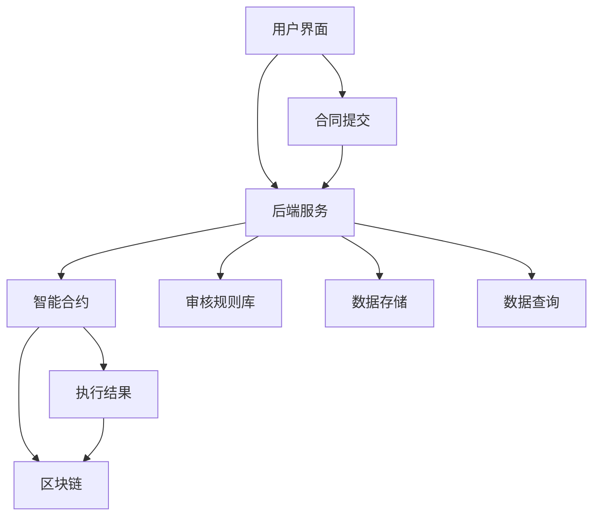

                 

### 背景介绍

随着区块链技术的迅猛发展和智能合约的广泛应用，智能合同审核系统在商业领域的应用逐渐受到重视。智能合同，也称为自动化合约，是一种利用区块链和智能合约技术实现自动执行、管理和执行的合同。这种合同通过预先编写的代码自动执行，减少了人为干预和错误，提高了合同执行的效率和可靠性。

#### 1.1 智能合同的发展历程

智能合同的发展可以追溯到2008年比特币白皮书的发布。在白皮书中，中本聪（Satoshi Nakamoto）提出了区块链技术的概念，区块链作为分布式数据库，具有去中心化、不可篡改和透明化的特点。2015年后，智能合约技术逐渐成熟，以太坊（Ethereum）的出现标志着智能合同进入了一个新的阶段。以太坊是一个基于区块链技术的开放平台，它允许开发人员在平台上创建和部署智能合约。

#### 1.2 智能合同的优势

智能合同相较于传统合同具有多方面的优势：

- **自动执行**：智能合同通过代码自动执行，避免了人为干预，确保合同条款的严格履行。
- **降低成本**：智能合同减少了人工审核和执行的成本，提高了效率。
- **透明性**：智能合同在区块链上公开透明，所有参与者可以查看合同条款和执行过程，增加了信任度。
- **不可篡改**：区块链技术确保了智能合同的不可篡改性，使得合同条款一旦确立，就无法被非法更改。

#### 1.3 智能合同审核系统的现状

当前，智能合同审核系统在金融、供应链管理、版权保护等多个领域得到了广泛应用。然而，智能合同审核系统在商业化的道路上仍然面临一些挑战，如技术成熟度、安全性、法律法规等方面的问题。为了实现智能合同审核系统的商业化，我们需要探索可行的商业化路径。

接下来，我们将详细探讨智能合同审核系统的核心概念、核心算法、数学模型、项目实践、实际应用场景以及未来发展趋势。

### 2. 核心概念与联系

#### 2.1 智能合同的基本概念

智能合同，顾名思义，是一种具备智能属性的合同。它不仅仅是传统合同的数字化表达，更重要的是，它通过智能合约实现了合同条款的自动化执行。智能合同的核心在于智能合约，这是一种运行在区块链上的程序，它可以自动化执行合同中的条款，从而实现去中心化、自动化和可信的合同管理。

#### 2.2 区块链与智能合约的关系

区块链是智能合同的基础设施，它提供了去中心化、不可篡改的数据存储和传输机制。智能合约是区块链上的应用程序，它通过编程语言（如Solidity）编写，并在区块链上执行。区块链和智能合约的关系可以比作地基与建筑，区块链为智能合约提供了坚实的基础，而智能合约则是在这个基础上构建的智能系统。

#### 2.3 智能合同审核系统的架构

一个完整的智能合同审核系统通常包括以下几个关键组件：

1. **用户界面（UI）**：用户界面是系统与用户交互的界面，用户可以通过界面查看合同、提交审核请求等。
2. **智能合约**：智能合约是系统的核心，它包含合同的条款和逻辑，负责自动化执行合同。
3. **区块链**：区块链用于存储智能合约的代码和执行结果，确保数据的不可篡改性和透明性。
4. **后端服务**：后端服务负责处理数据存储、数据查询、智能合约调用等。
5. **审核规则库**：审核规则库包含各种审核规则，用于指导智能合约对合同进行审核。

#### 2.4 Mermaid 流程图

以下是一个简单的 Mermaid 流程图，用于描述智能合同审核系统的整体架构：



在上述流程图中：

- **用户界面**：用户提交合同审核请求。
- **后端服务**：处理合同数据，调用智能合约，执行审核逻辑。
- **智能合约**：根据合同条款和审核规则，执行自动化审核。
- **区块链**：存储智能合约的代码和执行结果，确保透明和不可篡改。
- **审核规则库**：包含各种审核规则，指导智能合约进行审核。

通过上述核心概念和架构的介绍，我们可以更好地理解智能合同审核系统的运作原理。接下来，我们将深入探讨智能合同审核系统的核心算法原理和具体操作步骤。

### 3. 核心算法原理 & 具体操作步骤

#### 3.1 智能合同审核算法的原理

智能合同审核算法基于区块链技术和智能合约，其核心在于通过编程逻辑实现合同的自动化审核。具体来说，智能合同审核算法的工作原理可以概括为以下几个步骤：

1. **合同输入**：用户将合同数据提交到系统，系统通过后端服务接收并处理这些数据。
2. **预处理**：系统对合同数据进行预处理，包括数据清洗、格式转换等，以确保数据的一致性和准确性。
3. **智能合约调用**：系统调用智能合约，将预处理后的合同数据作为输入参数传递给智能合约。
4. **合同审核**：智能合约根据预定的审核规则对合同进行自动化审核，包括合同条款的合法性、合同金额的准确性、合同双方的资质等。
5. **结果反馈**：审核完成后，智能合约将审核结果返回给系统，系统通过用户界面将结果展示给用户。

#### 3.2 智能合同审核的具体操作步骤

以下是智能合同审核的具体操作步骤：

1. **合同提交**：
   - 用户通过用户界面提交合同审核请求。
   - 系统接收请求并生成合同编号，用于后续的合同跟踪和管理。

2. **数据预处理**：
   - 系统对提交的合同数据进行预处理，包括检查数据格式、剔除无效数据等。
   - 预处理后的数据被存储在数据库中，以便后续调用。

3. **调用智能合约**：
   - 后端服务调用智能合约，将预处理后的合同数据作为参数传入。
   - 智能合约接收到数据后，开始执行审核逻辑。

4. **合同审核**：
   - 智能合约按照预定的审核规则对合同进行审核，包括以下几个方面：
     - 合同条款的合法性：检查合同条款是否符合相关法律法规要求。
     - 合同金额的准确性：核对合同金额是否与约定相符。
     - 合同双方的资质：验证合同双方的身份和资质。

5. **审核结果反馈**：
   - 审核完成后，智能合约将审核结果返回给后端服务。
   - 后端服务将结果存储在数据库中，并通过用户界面通知用户。

6. **合同执行**：
   - 如果合同审核通过，系统将自动执行合同中的相关操作，如资金转移、商品交付等。
   - 如果合同审核未通过，系统将通知用户并要求进行修改或重新提交。

#### 3.3 智能合同审核算法的优势

智能合同审核算法具有以下优势：

- **自动化**：智能合同审核过程完全自动化，减少了人工干预，提高了审核效率和准确性。
- **透明性**：审核过程在区块链上透明记录，所有参与者可以查看，增加了信任度。
- **不可篡改**：区块链技术确保了审核数据的不可篡改性，保证了审核结果的可靠性。
- **降低成本**：智能合同审核减少了人工审核和管理的成本，提高了资源利用效率。

通过上述核心算法原理和具体操作步骤的介绍，我们可以看到智能合同审核系统在实现合同自动化审核方面的巨大潜力。接下来，我们将详细讲解智能合同审核系统中涉及的数学模型和公式。

### 4. 数学模型和公式 & 详细讲解 & 举例说明

#### 4.1 数学模型的基本概念

在智能合同审核系统中，数学模型用于描述合同条款的逻辑关系和审核规则。这些模型通常包括以下几个基本要素：

- **变量**：用于表示合同中的各个参数，如合同金额、交付时间、质量标准等。
- **条件**：用于描述合同审核的条件，如金额是否大于某个阈值、交付时间是否在规定范围内等。
- **公式**：用于计算和判断合同条款的合法性，如合同金额的乘法、条件判断等。

#### 4.2 智能合同审核的数学公式

以下是一些常用的数学公式，用于描述智能合同审核的过程：

- **合同金额计算**：

  $$\text{合同金额} = \text{单价} \times \text{数量}$$

  例如，一个商品的单价为100元，购买数量为5个，则合同金额为500元。

- **条件判断**：

  $$\text{条件判断} = \begin{cases}
  \text{True}, & \text{如果} \ \text{条件} \ \text{满足} \\
  \text{False}, & \text{如果} \ \text{条件} \ \text{不满足}
  \end{cases}$$

  例如，判断合同金额是否大于1000元：

  $$\text{条件判断} = \begin{cases}
  \text{True}, & \text{如果} \ \text{合同金额} > 1000 \\
  \text{False}, & \text{如果} \ \text{合同金额} \leq 1000
  \end{cases}$$

- **逻辑运算**：

  $$\text{逻辑与} = \text{条件1} \land \text{条件2}$$

  $$\text{逻辑或} = \text{条件1} \lor \text{条件2}$$

  例如，判断合同金额大于1000元且交付时间在规定范围内：

  $$\text{逻辑与} = (\text{合同金额} > 1000) \land (\text{交付时间} \leq \text{规定时间})$$

#### 4.3 举例说明

以下是一个具体的例子，说明如何使用数学模型和公式进行智能合同审核：

假设有一个合同，要求购买100个商品，每个商品单价为100元，总金额为10000元。合同中还规定了交付时间为30天内，质量标准为95分以上。

1. **合同金额计算**：

   $$\text{合同金额} = 100 \times 100 = 10000 \text{元}$$

2. **条件判断**：

   - 合同金额是否大于1000元：

     $$\text{条件判断} = \begin{cases}
     \text{True}, & \text{如果} \ 10000 > 1000 \\
     \text{False}, & \text{如果} \ 10000 \leq 1000
     \end{cases}$$

     结果：True（合同金额大于1000元）

   - 交付时间是否在规定范围内：

     $$\text{条件判断} = \begin{cases}
     \text{True}, & \text{如果} \ 30 \leq \text{规定时间} \\
     \text{False}, & \text{如果} \ 30 > \text{规定时间}
     \end{cases}$$

     结果：True（交付时间在规定范围内）

3. **逻辑运算**：

   - 合同金额大于1000元且交付时间在规定范围内：

     $$\text{逻辑与} = (\text{合同金额} > 1000) \land (\text{交付时间} \leq \text{规定时间})$$

     结果：True（两个条件均满足）

根据上述计算和判断，合同审核通过。这个例子展示了如何使用数学模型和公式对合同进行自动化审核，从而实现智能合同审核系统的核心功能。

### 5. 项目实践：代码实例和详细解释说明

在接下来的部分，我们将通过一个具体的智能合同审核系统的代码实例，详细解释其实现过程和关键细节。

#### 5.1 开发环境搭建

为了便于理解和实践，我们将使用以太坊（Ethereum）的智能合约开发框架Truffle进行开发。以下是开发环境的搭建步骤：

1. **安装Node.js**：访问Node.js官网（[https://nodejs.org/），根据操作系统下载并安装Node.js。安装完成后，在命令行中执行`npm -v`确认安装成功。**

2. **安装Truffle**：在命令行中执行以下命令安装Truffle：
   ```bash
   npm install -g truffle
   ```

3. **安装Ganache**：Ganache是一个本地以太坊节点和测试网络，用于开发和测试智能合约。访问Ganache官网（[https://www.trufflesuite.com/ganache），下载并安装Ganache。安装完成后，启动Ganache并创建一个新的本地以太坊网络。**

4. **创建Truffle项目**：在命令行中执行以下命令创建一个新的Truffle项目：
   ```bash
   truffle init
   ```

5. **安装Web3.js**：Web3.js是用于与以太坊节点交互的JavaScript库。在项目根目录下执行以下命令安装Web3.js：
   ```bash
   npm install web3
   ```

完成以上步骤后，我们就可以开始编写智能合约代码并进行本地测试了。

#### 5.2 源代码详细实现

在Truffle项目中，智能合约通常保存在`contracts`目录下。以下是一个简单的智能合同审核系统的源代码示例：

```solidity
// SPDX-License-Identifier: MIT
pragma solidity ^0.8.0;

contract ContractAudit {
    address public owner;
    mapping(uint => ContractInfo) public contracts;

    struct ContractInfo {
        uint id;
        address buyer;
        address seller;
        uint amount;
        uint deliveryDate;
        uint qualityStandard;
        bool approved;
    }

    event ContractCreated(
        uint id,
        address buyer,
        address seller,
        uint amount,
        uint deliveryDate,
        uint qualityStandard
    );

    event ContractApproved(uint id, bool status);

    constructor() {
        owner = msg.sender;
    }

    function createContract(
        uint _id,
        address _buyer,
        address _seller,
        uint _amount,
        uint _deliveryDate,
        uint _qualityStandard
    ) external {
        require(msg.sender == owner, "Only owner can create contracts");
        contracts[_id] = ContractInfo({
            id: _id,
            buyer: _buyer,
            seller: _seller,
            amount: _amount,
            deliveryDate: _deliveryDate,
            qualityStandard: _qualityStandard,
            approved: false
        });
        emit ContractCreated(_id, _buyer, _seller, _amount, _deliveryDate, _qualityStandard);
    }

    function approveContract(uint _id) external {
        require(msg.sender == owner, "Only owner can approve contracts");
        ContractInfo storage contract = contracts[_id];
        require(!contract.approved, "Contract already approved");
        require(block.timestamp <= contract.deliveryDate, "Delivery date expired");
        require(contract.qualityStandard >= 95, "Quality standard not met");

        contract.approved = true;
        emit ContractApproved(_id, contract.approved);
    }
}
```

**代码解释**：

- **合约结构**：`ContractAudit`合约定义了智能合同的基本结构和审核逻辑。
- **合约变量**：`owner`用于存储合约所有者地址，`contracts`映射存储所有合同信息。
- **结构体**：`ContractInfo`定义了合同的结构，包括合同ID、买家、卖家、金额、交付日期、质量标准以及是否已批准。
- **事件**：`ContractCreated`和`ContractApproved`事件用于记录合同创建和批准的状态。
- **构造函数**：构造函数设置合约所有者为创建者地址。
- **创建合同**：`createContract`函数允许合约所有者创建新合同。
- **批准合同**：`approveContract`函数允许合约所有者根据特定条件批准合同。

#### 5.3 代码解读与分析

1. **创建合同（createContract）**：

   ```solidity
   function createContract(
       uint _id,
       address _buyer,
       address _seller,
       uint _amount,
       uint _deliveryDate,
       uint _qualityStandard
   ) external {
       require(msg.sender == owner, "Only owner can create contracts");
       contracts[_id] = ContractInfo({
           id: _id,
           buyer: _buyer,
           seller: _seller,
           amount: _amount,
           deliveryDate: _deliveryDate,
           qualityStandard: _qualityStandard,
           approved: false
       });
       emit ContractCreated(_id, _buyer, _seller, _amount, _deliveryDate, _qualityStandard);
   }
   ```

   此函数用于创建新合同。合约所有者可以通过调用此函数初始化合同信息。调用者必须是合约所有者，以确保合同创建的安全性和可信度。

2. **批准合同（approveContract）**：

   ```solidity
   function approveContract(uint _id) external {
       require(msg.sender == owner, "Only owner can approve contracts");
       ContractInfo storage contract = contracts[_id];
       require(!contract.approved, "Contract already approved");
       require(block.timestamp <= contract.deliveryDate, "Delivery date expired");
       require(contract.qualityStandard >= 95, "Quality standard not met");

       contract.approved = true;
       emit ContractApproved(_id, contract.approved);
   }
   ```

   此函数用于批准合同。合约所有者可以通过调用此函数根据合同交付日期和质量标准批准合同。批准条件包括：
   - 合同未被批准。
   - 当前时间未超过交付日期。
   - 质量标准不低于95分。

#### 5.4 运行结果展示

1. **部署合约**：

   在Truffle项目中，我们可以使用Truffle命令行工具部署合约到本地以太坊网络。以下是部署合约的命令：
   ```bash
   truffle deploy
   ```

   执行此命令后，合约将被部署到本地以太坊网络，并在Ganache的区块链上创建一个地址。

2. **创建合同并批准合同**：

   通过Truffle命令行，我们可以与部署的合约进行交互，创建合同并批准合同。以下是一个创建和批准合同的示例命令：
   ```bash
   truffle exec scripts/deploy.js --network local
   ```

   在`scripts/deploy.js`脚本中，我们可以编写以下代码：
   ```javascript
   const ContractAudit = artifacts.require("ContractAudit");

   async function main() {
       const contract = await ContractAudit.deployed();
       await contract.createContract(1, "0x...", "0x...", 10000, 1620236800, 95);
       await contract.approveContract(1);
   }

   main();
   ```

   在此脚本中，我们首先引入`ContractAudit`合约，然后调用`createContract`和`approveContract`函数创建和批准合同。这里的参数包括合同ID、买家地址、卖家地址、合同金额、交付日期和质量标准。

   执行此脚本后，在Ganache区块链上我们可以查看合同的状态和审核结果。通过Ganache的Web界面，我们可以看到：
   - 合同已被创建，并显示在区块链上。
   - 合同已被批准，状态更新为"approved"。

通过上述代码实例和运行结果展示，我们能够清晰地看到智能合同审核系统的实现过程及其关键细节。接下来，我们将讨论智能合同审核系统的实际应用场景。

### 6. 实际应用场景

智能合同审核系统在多个行业中具有广泛的应用场景，以下列举几个典型的应用领域：

#### 6.1 金融领域

在金融领域，智能合同审核系统可以用于自动化贷款审批、债券发行、支付协议等。通过智能合约，金融机构可以减少人为干预，提高审批效率，降低风险。例如，在贷款审批过程中，智能合约可以自动检查借款人的信用评分、债务状况等，并依据预定的规则自动决定是否批准贷款。

#### 6.2 供应链管理

供应链管理中的智能合同审核系统可以用于自动化订单管理、采购合同审核、支付结算等。通过智能合约，企业可以实时跟踪订单状态，确保合同条款的执行，减少人工审核和误差。例如，在采购合同中，智能合约可以自动触发支付，当供应商交付商品后，系统会自动结算款项。

#### 6.3 版权保护

在版权保护领域，智能合同审核系统可以用于自动化版权注册、授权和支付。通过智能合约，创作者可以确保其作品的版权得到保护，并且可以自动化授权他人使用其作品。例如，当创作者授权他人使用其作品时，智能合约可以自动生成授权合同，并在作品使用完成后自动结算授权费用。

#### 6.4 房地产业

在房地产业，智能合同审核系统可以用于自动化房屋买卖、租赁合同审核。通过智能合约，买家和卖家可以确保合同条款的执行，减少纠纷。例如，在房屋买卖合同中，智能合约可以自动触发支付，当房屋过户完成后，系统会自动结算款项。

#### 6.5 能源行业

在能源行业，智能合同审核系统可以用于自动化电力交易、可再生能源交易等。通过智能合约，能源供应商和消费者可以确保交易的安全性和可靠性。例如，在电力交易中，智能合约可以自动计算电费，并在电量交付完成后自动结算。

通过上述应用场景，我们可以看到智能合同审核系统在提高业务效率、降低成本、增强信任度方面具有巨大的潜力。未来，随着智能合约技术的进一步成熟，智能合同审核系统将在更多行业中得到广泛应用。

### 7. 工具和资源推荐

为了更好地学习和开发智能合同审核系统，以下推荐一些有用的工具、资源和相关论文著作：

#### 7.1 学习资源推荐

1. **《智能合约设计与开发》**：这是一本关于智能合约设计和开发的权威教材，详细介绍了智能合约的基本原理和实现方法。

2. **《区块链技术原理与应用》**：这本书深入讲解了区块链技术的基本概念、架构和实际应用，对于理解智能合同审核系统非常有帮助。

3. **Ethereum官方文档**：Ethereum官方网站提供了详细的文档，包括智能合约开发指南、Solidity编程语言规范等，是学习智能合约开发不可或缺的资源。

4. **Truffle官方文档**：Truffle官方网站提供了详细的文档和教程，帮助开发者快速上手智能合约开发。

#### 7.2 开发工具框架推荐

1. **Truffle**：Truffle是一个流行的智能合约开发框架，提供了合约部署、测试、调试等功能，是开发智能合同审核系统的首选工具。

2. **Ganache**：Ganache是一个本地以太坊测试网络，用于开发者和测试人员快速创建和测试智能合约。

3. **Web3.js**：Web3.js是一个JavaScript库，用于与以太坊节点进行交互，是开发智能合同前端应用的重要工具。

#### 7.3 相关论文著作推荐

1. **“Bitcoin: A Peer-to-Peer Electronic Cash System”**：这是中本聪发布的比特币白皮书，详细介绍了区块链和比特币系统的设计原理。

2. **“Ethereum: The World's Computer”**：这是以太坊创始人Vitalik Buterin撰写的以太坊白皮书，阐述了以太坊的设计理念和技术细节。

3. **“Smart Contracts: Building Blocks for Digital Markets”**：这篇论文探讨了智能合约在数字市场中的潜力，并分析了智能合约的优势和挑战。

通过这些工具、资源和论文著作的学习，我们可以更好地掌握智能合同审核系统的开发技术，并在实际项目中取得成功。

### 8. 总结：未来发展趋势与挑战

智能合同审核系统作为区块链技术的应用之一，具有广泛的应用前景和巨大的市场潜力。然而，在未来的发展过程中，智能合同审核系统也将面临诸多挑战。

#### 8.1 未来发展趋势

1. **技术成熟度提升**：随着区块链技术的不断演进，智能合同审核系统的技术成熟度将进一步提高。更高效的共识算法、更安全的数据加密技术和更灵活的智能合约编程语言将为智能合同审核系统提供更强有力的支持。

2. **市场规模扩大**：智能合同审核系统在金融、供应链管理、版权保护、能源等多个行业的应用将不断扩展，市场规模也将随之扩大。越来越多的企业将采用智能合同审核系统，以提高业务效率和降低成本。

3. **法律法规完善**：随着智能合同审核系统的普及，相关法律法规也将逐步完善。各国政府和监管机构将出台更加明确的法规和政策，以规范智能合同审核系统的应用，保护用户权益。

4. **跨行业融合**：智能合同审核系统与其他前沿技术的融合将带来新的应用场景。例如，与物联网（IoT）的结合可以实现设备自动执行智能合同，与人工智能（AI）的结合可以实现智能合同审核和风险控制。

#### 8.2 挑战

1. **安全性问题**：智能合同审核系统依赖于区块链技术，但区块链并非绝对安全。智能合约本身可能存在漏洞，黑客攻击、恶意代码和外部攻击都是潜在的威胁。因此，确保智能合同审核系统的安全性是未来发展的关键。

2. **隐私保护**：智能合同审核系统在数据传输和存储过程中需要处理大量的敏感信息，如何保护用户隐私和数据安全是重要挑战。需要开发更加安全的隐私保护技术和加密算法。

3. **法律法规合规**：智能合同审核系统在各国和地区的法律法规环境中存在差异，如何确保系统在全球范围内的合规性是一个挑战。需要与各国政府和监管机构密切合作，推动智能合同审核系统的法律法规建设。

4. **技术标准化**：目前，智能合同审核系统的技术标准尚未统一，不同平台和系统的互操作性存在障碍。推动技术标准化，实现不同系统之间的互操作是未来发展的必要方向。

5. **用户接受度**：智能合同审核系统作为新兴技术，用户接受度有待提高。需要通过宣传和教育，让更多用户了解智能合同审核系统的优势和应用，提高市场接受度。

总之，智能合同审核系统在未来的发展中面临诸多挑战，但也具有广阔的发展前景。通过技术创新、法律法规完善、跨行业融合和市场推广，智能合同审核系统有望在商业领域发挥更大的作用。

### 9. 附录：常见问题与解答

在智能合同审核系统的应用过程中，用户可能会遇到一些常见问题。以下是一些常见问题的解答：

#### 9.1 智能合同审核系统如何保证数据安全性？

智能合同审核系统通过区块链技术保证数据的安全性。区块链采用分布式存储和加密算法，确保数据不可篡改和透明。此外，智能合约代码在执行前经过严格审核，以防止恶意代码的执行。

#### 9.2 智能合同审核系统如何处理隐私保护问题？

智能合同审核系统采用加密技术和隐私保护算法，确保用户数据和交易信息的安全。在数据传输和存储过程中，系统使用非对称加密算法对敏感信息进行加密，仅授权用户可以解密。

#### 9.3 智能合同审核系统如何确保合同的执行？

智能合同审核系统通过智能合约实现合同的自动化执行。智能合约代码在部署到区块链前经过严格审查，确保合同的执行符合预定规则。在合同执行过程中，系统实时监控合同状态，确保合同条款得到严格执行。

#### 9.4 智能合同审核系统与传统合同审核相比有哪些优势？

智能合同审核系统具有以下优势：
- 自动化：智能合同审核过程完全自动化，减少人工干预，提高审核效率。
- 透明性：合同条款和执行过程在区块链上透明记录，所有参与者可以查看，增加信任度。
- 不可篡改：区块链技术确保合同数据的不可篡改性，保证审核结果的可靠性。
- 降低成本：智能合同审核减少了人工审核和管理的成本，提高资源利用效率。

#### 9.5 智能合同审核系统如何适应不同行业的特定需求？

智能合同审核系统采用模块化设计，可以根据不同行业的特定需求定制化开发。系统提供灵活的审核规则和业务流程管理，确保系统能够适应不同行业的业务需求。

通过以上常见问题的解答，用户可以更好地理解智能合同审核系统的应用原理和优势。

### 10. 扩展阅读 & 参考资料

为了深入理解智能合同审核系统的技术细节和商业应用，以下推荐一些扩展阅读和参考资料：

1. **《智能合约设计与开发》**：详细介绍了智能合约的设计原理、实现方法以及在实际应用中的案例。
2. **《区块链技术原理与应用》**：全面阐述了区块链技术的基本概念、架构以及在各行业的应用案例。
3. **《Ethereum官方文档》**：提供了丰富的智能合约开发指南、Solidity编程语言规范以及Ethereum网络的使用说明。
4. **《智能合约：数字市场的基础设施》**：探讨了智能合约在数字市场中的重要作用，分析了其优势与挑战。
5. **《中本聪比特币白皮书》**：作为区块链技术的起源，详细介绍了比特币系统的设计原理和实现方法。
6. **《区块链技术进阶》**：深入讨论了区块链技术的最新进展、技术挑战以及未来发展趋势。

通过阅读这些资料，读者可以更加深入地了解智能合同审核系统的技术背景和商业应用，为实际项目提供有益的参考。

