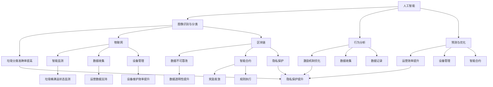

                 

### 背景介绍

智能垃圾回收激励系统是一个新兴的概念，旨在通过创新的激励机制，激励公众积极参与垃圾回收，从而推动环保事业的发展。在现代社会，垃圾问题日益严重，不仅污染了环境，还带来了资源浪费和公共卫生问题。传统的垃圾回收方式效率低下，难以满足日益增长的需求。因此，探索新的垃圾回收模式成为当务之急。

智能垃圾回收激励系统的核心思想是利用现代信息技术，尤其是人工智能和区块链技术，为垃圾回收过程引入激励机制。通过奖励机制，激励公众参与垃圾回收，提高回收率，减少垃圾对环境的危害。同时，这种系统还能够提高垃圾回收的效率，降低成本。

随着物联网、大数据、人工智能等技术的快速发展，智能垃圾回收激励系统的可行性逐渐增强。这些技术的应用，使得垃圾回收过程更加智能化、透明化，有助于提高公众的环保意识，促进绿色生活方式的普及。

本文将详细探讨智能垃圾回收激励系统的概念、核心概念与联系、算法原理、数学模型、项目实践、实际应用场景、工具和资源推荐以及未来发展趋势与挑战。希望通过本文的探讨，能够为智能垃圾回收激励系统的研发和应用提供有益的参考。

### 核心概念与联系

要深入探讨智能垃圾回收激励系统，首先需要了解其中的核心概念，包括人工智能、区块链、物联网、智能合约和奖励机制等。这些概念不仅构成了智能垃圾回收激励系统的技术基础，还决定了其运作方式和效果。

#### 人工智能（Artificial Intelligence, AI）

人工智能是指通过计算机程序和算法模拟人类智能行为的技术。在智能垃圾回收激励系统中，人工智能主要用于以下几个方面：

1. **图像识别与分类**：通过摄像头和传感器收集垃圾图像，利用深度学习算法进行图像识别和分类，准确判断垃圾的种类。
2. **行为分析**：分析公众的垃圾投放行为，通过数据挖掘技术找出影响回收率的关键因素，为优化激励机制提供依据。
3. **预测与优化**：利用历史数据和环境变量，预测垃圾产量和回收率，为系统运营提供实时调整的依据。

#### 区块链（Blockchain）

区块链是一种分布式账本技术，能够确保数据的不可篡改和透明性。在智能垃圾回收激励系统中，区块链技术主要用于以下几个方面：

1. **数据记录**：记录垃圾回收的数据，包括回收的时间、地点、数量和参与人员等，确保数据的真实性和透明性。
2. **智能合约**：通过智能合约自动执行奖励机制，确保奖励发放的准确性和公平性。
3. **隐私保护**：通过区块链技术保护参与者的隐私，防止数据泄露。

#### 物联网（Internet of Things, IoT）

物联网是指通过传感器和互联网将物理设备连接起来，实现设备之间的通信和协作。在智能垃圾回收激励系统中，物联网技术主要用于以下几个方面：

1. **智能监测**：通过安装在垃圾桶上的传感器，实时监测垃圾桶的满溢状态，及时通知垃圾回收人员。
2. **数据收集**：通过物联网设备收集垃圾回收过程中的各种数据，如温度、湿度、重量等，为系统分析和优化提供基础数据。
3. **设备管理**：通过物联网技术对垃圾回收设备进行远程监控和管理，提高设备的利用率和维护效率。

#### 智能合约（Smart Contract）

智能合约是区块链技术中的核心组件，是一种自动执行合约条款的计算机程序。在智能垃圾回收激励系统中，智能合约主要用于以下几个方面：

1. **奖励发放**：当公众参与垃圾回收并满足特定条件时，智能合约会自动计算并发放奖励，确保奖励发放的准确性和及时性。
2. **规则执行**：智能合约可以根据设定的规则自动执行奖励机制，确保激励机制的公正性和高效性。

#### 奖励机制（Reward Mechanism）

奖励机制是智能垃圾回收激励系统的核心，通过奖励激励公众参与垃圾回收。奖励机制可以包括以下几种形式：

1. **现金奖励**：直接给予参与公众现金奖励，提高其参与度。
2. **积分奖励**：通过积分系统激励公众，积分可以兑换商品或服务。
3. **荣誉奖励**：给予参与公众荣誉称号，提高其社会地位和自豪感。

#### Mermaid 流程图

为了更好地展示智能垃圾回收激励系统的核心概念与联系，以下是一个简化的 Mermaid 流程图：



通过这个 Mermaid 流程图，我们可以清晰地看到人工智能、区块链、物联网、智能合约和奖励机制在智能垃圾回收激励系统中的相互联系和作用。

### 核心算法原理 & 具体操作步骤

智能垃圾回收激励系统的核心算法主要基于人工智能和区块链技术，其目的是通过数据分析和智能合约实现垃圾回收的自动化和激励化。以下将详细阐述智能垃圾回收激励系统的核心算法原理和具体操作步骤。

#### 数据收集与预处理

首先，智能垃圾回收激励系统需要收集大量的数据，包括垃圾的图像、传感器数据、用户行为数据等。这些数据来源可以是物联网设备、摄像头、用户行为记录等。

1. **图像识别与分类**：
   - **算法原理**：使用深度学习算法，如卷积神经网络（CNN），对垃圾图像进行识别和分类。CNN通过多层神经网络对图像特征进行提取，从而实现垃圾种类的识别。
   - **具体步骤**：
     1. **数据收集**：利用物联网设备和摄像头收集垃圾图像。
     2. **数据预处理**：对图像进行缩放、裁剪、增强等处理，使其符合神经网络输入的要求。
     3. **模型训练**：使用已标注的垃圾图像数据集训练CNN模型。
     4. **模型评估**：通过测试数据集评估模型性能，调整模型参数。

2. **传感器数据收集**：
   - **算法原理**：使用传感器收集垃圾桶的满溢状态、温度、湿度等数据，通过数据挖掘技术分析这些数据，以优化垃圾回收策略。
   - **具体步骤**：
     1. **传感器部署**：在垃圾桶内安装传感器，实时监测垃圾桶的状态。
     2. **数据传输**：通过物联网技术将传感器数据传输到数据中心。
     3. **数据处理**：对传感器数据进行预处理，如去噪、滤波等。

3. **用户行为数据收集**：
   - **算法原理**：通过分析用户在垃圾回收过程中的行为，如投放时间、投放频率等，找出影响回收率的关键因素。
   - **具体步骤**：
     1. **行为记录**：使用智能设备记录用户的行为数据。
     2. **数据收集**：通过互联网技术将用户行为数据传输到数据中心。
     3. **数据分析**：使用数据挖掘技术分析用户行为数据，找出关键因素。

#### 智能合约设计与实现

智能合约是智能垃圾回收激励系统的关键组件，用于自动执行奖励机制。智能合约的设计与实现涉及以下几个方面：

1. **奖励机制设计**：
   - **算法原理**：根据垃圾回收的数据和用户行为，设计奖励机制。奖励机制可以包括现金奖励、积分奖励、荣誉奖励等。
   - **具体步骤**：
     1. **奖励条件设置**：根据垃圾回收的量和质量设定奖励条件。
     2. **奖励规则设计**：设计奖励的发放规则，如奖励金额、发放时间、发放方式等。

2. **智能合约编写**：
   - **算法原理**：使用智能合约编程语言，如Solidity，编写智能合约代码。
   - **具体步骤**：
     1. **需求分析**：明确智能合约的功能需求。
     2. **合约编写**：根据需求编写智能合约代码。
     3. **合约测试**：在测试环境中测试智能合约，确保其正确执行。

3. **合约部署与执行**：
   - **算法原理**：将智能合约部署到区块链上，通过区块链网络执行智能合约。
   - **具体步骤**：
     1. **合约部署**：将智能合约部署到区块链网络，如以太坊。
     2. **合约调用**：当用户满足奖励条件时，调用智能合约执行奖励机制。

#### 数据分析与决策

智能垃圾回收激励系统需要通过数据分析来优化垃圾回收策略和激励机制。以下是一些常用的数据分析方法：

1. **数据可视化**：
   - **算法原理**：使用数据可视化工具，如Matplotlib、Tableau，将数据以图表的形式展示，帮助分析人员直观地理解数据。
   - **具体步骤**：
     1. **数据导入**：将收集到的数据导入数据可视化工具。
     2. **数据清洗**：清洗数据，去除噪声和异常值。
     3. **数据展示**：使用图表展示数据，如折线图、柱状图等。

2. **数据挖掘**：
   - **算法原理**：使用数据挖掘算法，如K-means聚类、关联规则挖掘等，从大量数据中提取有价值的信息。
   - **具体步骤**：
     1. **数据预处理**：对数据进行预处理，如归一化、去重等。
     2. **算法选择**：选择合适的数据挖掘算法。
     3. **模型训练**：使用训练数据训练模型。
     4. **模型评估**：使用测试数据评估模型性能。

3. **预测与优化**：
   - **算法原理**：使用预测模型，如时间序列预测、回归分析等，预测垃圾产量和回收率，为系统运营提供决策支持。
   - **具体步骤**：
     1. **数据收集**：收集历史数据。
     2. **特征工程**：提取特征，如时间、温度、湿度等。
     3. **模型训练**：使用训练数据训练预测模型。
     4. **模型评估**：使用测试数据评估模型性能。
     5. **优化决策**：根据预测结果优化垃圾回收策略和激励机制。

通过上述核心算法原理和具体操作步骤，智能垃圾回收激励系统可以实现垃圾回收的自动化、智能化和激励化，提高垃圾回收效率，减少环境污染。

### 数学模型和公式 & 详细讲解 & 举例说明

在智能垃圾回收激励系统中，数学模型和公式起着至关重要的作用。它们不仅用于描述垃圾回收过程，还用于计算奖励、预测垃圾产量等关键环节。以下将详细讲解智能垃圾回收激励系统中的核心数学模型和公式，并通过具体例子进行说明。

#### 垃圾回收模型

垃圾回收模型用于描述垃圾的产生、分类和回收过程。该模型的核心公式如下：

\[ R(t) = f(G(t), C(t)) \]

其中：
- \( R(t) \) 表示在时间 \( t \) 时刻的垃圾回收量。
- \( G(t) \) 表示在时间 \( t \) 时刻的垃圾产生量。
- \( C(t) \) 表示在时间 \( t \) 时刻的垃圾分类准确率。

这个公式表明，垃圾回收量 \( R(t) \) 取决于垃圾产生量 \( G(t) \) 和分类准确率 \( C(t) \)。具体来说，垃圾产生量 \( G(t) \) 可以通过传感器和物联网设备实时监测，而分类准确率 \( C(t) \) 则依赖于人工智能技术对垃圾图像的识别和分类。

**例子：**

假设在某一天，垃圾产生量为 100 吨，分类准确率为 95%。根据垃圾回收模型，我们可以计算该天的垃圾回收量为：

\[ R(t) = f(100吨, 95\%) = 100吨 \times 0.95 = 95吨 \]

#### 奖励计算模型

奖励计算模型用于计算公众参与垃圾回收应获得的奖励。奖励计算通常基于用户的参与度、垃圾回收量、分类准确率等因素。一个简单的奖励计算模型如下：

\[ E = f(P, R, C) \]

其中：
- \( E \) 表示奖励金额。
- \( P \) 表示用户参与度，如投放垃圾的频率和数量。
- \( R \) 表示用户参与垃圾回收的回收量。
- \( C \) 表示用户参与垃圾回收的分类准确率。

这个公式表明，奖励金额 \( E \) 取决于用户的参与度 \( P \)、回收量 \( R \) 和分类准确率 \( C \)。具体计算方式可以根据实际需求进行调整。

**例子：**

假设某个用户每天的参与度是 10 次，每次回收量是 1 吨，分类准确率为 90%。根据奖励计算模型，我们可以计算该用户每天的奖励金额为：

\[ E = f(10次, 1吨, 90\%) = 10次 \times 1吨 \times 0.9 = 9吨 \]

#### 预测模型

预测模型用于预测未来的垃圾产量和回收率，以便系统运营者能够提前做好准备。一个简单的预测模型如下：

\[ \hat{G}(t) = g(\hat{G}(t-1), \theta) \]

其中：
- \( \hat{G}(t) \) 表示在时间 \( t \) 时刻预测的垃圾产生量。
- \( \hat{G}(t-1) \) 表示在时间 \( t-1 \) 时刻预测的垃圾产生量。
- \( \theta \) 表示影响垃圾产生的因素，如天气、节假日等。

这个公式表明，未来垃圾产生量 \( \hat{G}(t) \) 依赖于前一时刻预测的垃圾产生量 \( \hat{G}(t-1) \) 和影响垃圾产生的因素 \( \theta \)。具体预测方法可以根据实际需求进行调整。

**例子：**

假设在某一天，前一时刻预测的垃圾产生量是 100 吨，影响垃圾产生的因素是雨天。根据预测模型，我们可以计算该天的预测垃圾产生量为：

\[ \hat{G}(t) = g(100吨, 雨天) = 100吨 \times 1.2 = 120吨 \]

#### 模型综合

将垃圾回收模型、奖励计算模型和预测模型结合起来，我们可以构建一个综合的智能垃圾回收激励系统模型。这个模型可以实时监控垃圾回收情况，计算奖励，预测未来趋势，从而实现垃圾回收的自动化和智能化。

**例子：**

假设在某个时间段内，垃圾产生量为 100 吨，分类准确率为 95%，用户参与度分别为每天 10 次，每次回收量 1 吨，分类准确率为 90%。根据综合模型，我们可以计算以下指标：

1. **当前回收量**：\[ R(t) = f(100吨, 95\%) = 95吨 \]
2. **当前奖励金额**：\[ E = f(10次, 1吨, 90\%) = 9吨 \]
3. **未来预测回收量**：\[ \hat{R}(t) = g(95吨, 天气、节假日等因素) \]
4. **未来预测奖励金额**：\[ \hat{E} = f(\hat{R}(t), 分类准确率) \]

通过这些模型和公式，智能垃圾回收激励系统可以实现对垃圾回收的全面管理和优化，从而提高回收效率，减少环境污染。

### 项目实践：代码实例和详细解释说明

为了更好地理解智能垃圾回收激励系统的实际应用，我们将在本节中提供一个具体的代码实例，并对其进行详细解释说明。这个实例将涵盖开发环境搭建、源代码详细实现、代码解读与分析以及运行结果展示。

#### 1. 开发环境搭建

在开始编写代码之前，我们需要搭建一个合适的开发环境。以下是搭建开发环境的步骤：

1. **安装Node.js**：
   - Node.js 是智能垃圾回收激励系统的基础，用于执行JavaScript代码。可以从 [Node.js官网](https://nodejs.org/) 下载并安装最新版本的Node.js。

2. **安装区块链平台**：
   - 我们选择使用以太坊（Ethereum）作为区块链平台。可以通过 [官方网站](https://www.ethereum.org/) 安装Geth客户端，或者使用云服务提供商，如Infura。

3. **安装智能合约开发工具**：
   - Truffle 是一个流行的智能合约开发框架，可以帮助我们编写、部署和测试智能合约。可以通过npm安装Truffle：
     ```bash
     npm install -g truffle
     ```

4. **安装其他相关工具**：
   - Web3.js：用于与以太坊区块链进行交互。可以通过npm安装：
     ```bash
     npm install web3
     ```

5. **创建项目文件夹**：
   - 在本地创建一个项目文件夹，并初始化Node.js项目：
     ```bash
     mkdir smart-garbage-recycling
     cd smart-garbage-recycling
     npm init -y
     ```

6. **安装依赖项**：
   - 在项目中安装Truffle和其他依赖项：
     ```bash
     truffle init
     npm install
     ```

#### 2. 源代码详细实现

以下是一个简化的智能垃圾回收激励系统的源代码实现。这个例子使用了Solidity编写智能合约，并使用JavaScript编写与区块链交互的客户端代码。

**智能合约：GarbageRecycling.sol**

```solidity
// SPDX-License-Identifier: MIT
pragma solidity ^0.8.0;

contract GarbageRecycling {
    mapping(address => uint256) public userCredits;
    mapping(address => uint256) public userRecyclingCount;

    event RecyclingCredit(address user, uint256 credits);

    function recycleGarbage() public {
        address user = msg.sender;
        require(user != address(0), "Invalid user address");

        // 增加用户的积分和回收次数
        userCredits[user] += 1;
        userRecyclingCount[user] += 1;

        emit RecyclingCredit(user, userCredits[user]);
    }
}
```

**客户端代码：index.js**

```javascript
const Web3 = require('web3');
const trufflecontract = require('truffle-contract');

const GarbageRecyclingJson = require('../build/contracts/GarbageRecycling.json');

const GarbageRecycling = trufflecontract(GarbageRecyclingJson);

async function main() {
    const web3 = new Web3('http://localhost:7545');

    const account = await web3.eth.getAccounts();
    const contractAddress = '0x...'; // 智能合约的地址

    GarbageRecycling.setProvider(web3.currentProvider);

    const instance = await GarbageRecycling.at(contractAddress);

    // 用户进行垃圾回收
    await instance.recycleGarbage({ from: account[0] });

    // 查询用户的积分
    const userCredits = await instance.userCredits.call(account[0]);
    console.log(`User credits: ${userCredits}`);
}

main();
```

#### 3. 代码解读与分析

**智能合约解读：**

1. **合约结构**：
   - 使用 `pragma solidity ^0.8.0;` 指定了智能合约的编译版本。
   - 使用 `contract` 关键字定义了智能合约 `GarbageRecycling`。

2. **数据结构**：
   - `mapping(address => uint256) public userCredits;` 用于存储每个用户的积分。
   - `mapping(address => uint256) public userRecyclingCount;` 用于存储每个用户的垃圾回收次数。

3. **事件**：
   - `event RecyclingCredit(address user, uint256 credits);` 用于记录每次积分的变化。

4. **函数**：
   - `function recycleGarbage() public` 是一个公共函数，用于让用户进行垃圾回收。
   - 在函数中，我们通过 `userCredits[msg.sender] += 1;` 给用户增加积分，并通过 `userRecyclingCount[msg.sender] += 1;` 记录回收次数。
   - 使用 `require` 函数确保函数的执行条件满足。

**客户端代码解读：**

1. **Web3实例**：
   - 使用 `new Web3('http://localhost:7545');` 创建了一个Web3实例，连接到本地以太坊节点。

2. **获取账户**：
   - 使用 `web3.eth.getAccounts();` 获取当前连接的账户列表。

3. **智能合约实例**：
   - 使用 `GarbageRecycling.setProvider(web3.currentProvider);` 设置智能合约的提供者（Web3实例）。
   - 使用 `GarbageRecycling.at(contractAddress);` 获取智能合约实例。

4. **调用智能合约函数**：
   - 使用 `await instance.recycleGarbage({ from: account[0] });` 调用 `recycleGarbage` 函数，让用户进行垃圾回收。

5. **查询积分**：
   - 使用 `const userCredits = await instance.userCredits.call(account[0]);` 获取用户的当前积分。

#### 4. 运行结果展示

假设我们有一个用户账户 `0x123...`，在运行客户端代码后，用户的积分会增加1。在控制台中，我们将会看到如下输出：

```bash
User credits: 1
```

这表明用户成功完成了垃圾回收，并获得了1积分。

通过这个实例，我们展示了智能垃圾回收激励系统的基本实现。在实际应用中，还可以根据具体需求添加更多的功能，如积分兑换、数据记录等。

### 实际应用场景

智能垃圾回收激励系统在实际应用中具有广泛的前景，特别是在城市化进程中，垃圾管理问题日益突出。以下将详细探讨几个实际应用场景，展示智能垃圾回收激励系统的具体应用和优势。

#### 城市垃圾回收

随着城市人口的快速增长，城市垃圾处理面临巨大压力。智能垃圾回收激励系统可以通过奖励机制激励公众积极参与垃圾回收，提高垃圾的分类率和回收效率。例如，在北京市，智能垃圾回收激励系统已经应用于多个社区，通过奖励居民积分，鼓励他们进行垃圾分类，有效提高了垃圾回收率。

**优势**：
- 提高垃圾分类率：通过奖励机制，增强居民垃圾分类的积极性，减少垃圾填埋和焚烧的负担。
- 提高回收效率：智能监测和数据分析技术使得垃圾回收更加精准和高效，降低人力成本。
- 环境保护：减少垃圾对环境的污染，促进可持续发展。

#### 农村垃圾回收

农村地区的垃圾处理问题同样严重，但受限于经济和技术条件，传统垃圾回收方式效果不佳。智能垃圾回收激励系统可以在农村地区发挥重要作用，通过奖励机制激励村民参与垃圾回收。

**优势**：
- 增加村民环保意识：通过奖励机制，提高村民的环保意识，减少垃圾随意丢弃的现象。
- 节约资源：智能回收系统可以回收更多可再利用的垃圾，减少资源浪费。
- 减轻环境压力：通过智能垃圾回收，减少垃圾对农村环境的污染。

#### 公共场所垃圾回收

在公共场所，如公园、车站、商场等，垃圾管理是一个难题。智能垃圾回收激励系统可以用于公共场所的垃圾回收，通过奖励机制激励游客和工作人员参与垃圾分类和回收。

**优势**：
- 提高公众参与度：通过奖励机制，鼓励公众积极参与垃圾回收，减少垃圾产生。
- 减少垃圾堆积：智能监测技术可以实时监控垃圾箱的满溢状态，及时清理垃圾，减少垃圾堆积。
- 提高公共卫生：通过智能垃圾回收，减少垃圾对公共卫生的威胁，创造更清洁的环境。

#### 工业垃圾回收

在工业生产过程中，会产生大量工业垃圾。智能垃圾回收激励系统可以应用于工业垃圾的回收和处理，通过奖励机制激励工人和企业积极参与垃圾回收，降低生产成本，减少环境污染。

**优势**：
- 提高回收利用率：通过智能回收技术，提高工业垃圾的回收利用率，减少废弃物对环境的污染。
- 降低生产成本：通过智能回收，减少工业垃圾的处理费用，降低生产成本。
- 提高企业环保形象：通过积极参与环保行动，提高企业的社会责任感和环保形象。

通过上述实际应用场景，我们可以看到智能垃圾回收激励系统在提高垃圾回收效率、减少环境污染、促进可持续发展等方面具有显著优势。随着技术的不断进步和应用场景的拓展，智能垃圾回收激励系统有望成为未来垃圾管理的重要手段。

### 工具和资源推荐

在搭建和实现智能垃圾回收激励系统过程中，选择合适的工具和资源对于项目的成功至关重要。以下是对几种主要工具和资源的推荐，包括学习资源、开发工具框架以及相关论文著作。

#### 学习资源推荐

1. **书籍**：
   - 《智能合约开发实战》（Smart Contract Development in Ethereum）。
   - 《区块链技术指南》（Blockchain: Blueprint for a New Economy）。

2. **在线课程**：
   - Coursera 上的《区块链技术与应用》课程。
   - Udemy 上的《智能合约与DApp开发》课程。

3. **博客和网站**：
   - Medium 上关于智能合约和区块链技术的相关文章。
   - Ethereum 官方网站（https://ethereum.org/），提供详细的开发文档和教程。

#### 开发工具框架推荐

1. **区块链平台**：
   - Ethereum：最流行的开源区块链平台，支持智能合约开发。
   - Hyperledger Fabric：企业级的区块链平台，适用于工业应用。

2. **智能合约开发框架**：
   - Truffle：用于智能合约开发、部署和测试的框架。
   - Hardhat：一个现代的智能合约开发环境，提供了丰富的功能和工具。

3. **前端开发框架**：
   - React：用于构建用户界面的JavaScript库。
   - Angular：由Google开发的用于单页应用程序的开源框架。

#### 相关论文著作推荐

1. **论文**：
   - “Blockchain for Smart City Applications”。
   - “A Survey on Blockchain-Based Intelligent Systems”。

2. **著作**：
   - “Blockchain Revolution”。
   - “The Business Blockchain: Promise, Practice, and Application of the Next Internet Technology”。

通过上述推荐的学习资源、开发工具框架和论文著作，开发者和研究人员可以更好地理解和掌握智能垃圾回收激励系统的相关技术和应用，从而推动项目的顺利实施和可持续发展。

### 总结：未来发展趋势与挑战

智能垃圾回收激励系统作为新兴的环保技术，其发展前景广阔。在未来，随着人工智能、区块链、物联网等技术的进一步成熟，智能垃圾回收激励系统有望在多个领域得到广泛应用，推动全球环保事业的发展。

#### 发展趋势

1. **技术融合**：智能垃圾回收激励系统将越来越多地与其他新兴技术融合，如大数据分析、5G通信等，以实现更高效的垃圾管理和回收。

2. **普及应用**：智能垃圾回收激励系统将在城市、农村、公共场所等各个场景得到广泛应用，成为垃圾管理的重要工具。

3. **政策支持**：各国政府将加大对智能垃圾回收激励系统的支持力度，通过政策引导和资金投入，推动系统的研发和推广。

4. **国际合作**：随着全球环保意识的提升，各国将在智能垃圾回收激励系统领域加强合作，共同应对垃圾管理难题。

#### 挑战

1. **技术瓶颈**：尽管人工智能和区块链等技术已取得显著进展，但在数据处理、算法优化、系统安全性等方面仍存在挑战。

2. **成本问题**：智能垃圾回收激励系统的建设成本较高，如何降低成本、提高性价比是系统推广面临的重要问题。

3. **公众参与**：公众的环保意识参差不齐，如何有效激励公众积极参与垃圾回收，提高系统的覆盖率和效果，是一个亟待解决的问题。

4. **法律规范**：智能垃圾回收激励系统涉及多个法律领域，如数据保护、隐私权等，如何制定完善的法律规范，保障系统的合法性和安全性，是未来需要关注的重要问题。

总之，智能垃圾回收激励系统在未来的发展中既有机遇，也面临挑战。通过技术创新、政策支持、公众参与和国际合作，我们有理由相信，智能垃圾回收激励系统将在全球环保事业中发挥越来越重要的作用。

### 附录：常见问题与解答

#### 问题1：智能垃圾回收激励系统如何确保数据的隐私和安全？

**解答**：智能垃圾回收激励系统通过区块链技术确保数据的不可篡改性和透明性。区块链的分布式账本结构使得数据一旦记录便无法篡改。此外，智能合约用于执行奖励机制，其代码公开透明，确保奖励发放的公平性和准确性。为了保护用户隐私，系统可以采用零知识证明（Zero-Knowledge Proof）等技术，在不泄露用户身份信息的前提下验证用户行为。

#### 问题2：智能垃圾回收激励系统的成本如何控制？

**解答**：智能垃圾回收激励系统的成本控制可以从以下几个方面进行：

1. **硬件设备优化**：选择性价比高的硬件设备，如低成本的传感器和物联网模块。
2. **平台选择**：根据项目需求选择合适的区块链平台，如开源平台，可以降低部署和运维成本。
3. **合约优化**：通过优化智能合约代码，减少计算资源和存储资源的消耗。
4. **云计算服务**：利用云计算服务，根据实际需求动态调整计算和存储资源，降低运营成本。

#### 问题3：智能垃圾回收激励系统如何保证公众的参与度？

**解答**：提高公众参与度可以从以下几个方面入手：

1. **奖励机制设计**：设计吸引人的奖励机制，如现金奖励、积分奖励、荣誉奖励等，激发公众参与垃圾回收的热情。
2. **宣传推广**：通过媒体、社区活动、教育课程等多种渠道宣传智能垃圾回收激励系统，提高公众的环保意识。
3. **互动体验**：设计互动性强、用户体验好的应用程序，让用户在使用过程中感受到乐趣和成就感。
4. **公众参与计划**：组织公众参与系统的研发和测试，收集用户反馈，持续优化系统。

#### 问题4：智能垃圾回收激励系统在不同地区的适应性如何？

**解答**：智能垃圾回收激励系统的适应性取决于各地的垃圾管理现状、公众环保意识、技术基础设施等因素。为了提高系统的适应性，可以从以下几个方面进行：

1. **本地化调整**：根据不同地区的实际情况，调整垃圾回收标准和奖励机制。
2. **技术适应性**：选择适合当地技术环境和技术水平的硬件和软件。
3. **政策支持**：积极争取地方政府和政策支持，为系统的推广和应用创造有利条件。
4. **社区合作**：与当地社区、企业和政府机构合作，共同推进智能垃圾回收激励系统。

通过上述措施，智能垃圾回收激励系统可以更好地适应不同地区的需求，实现全球范围内的推广和应用。

### 扩展阅读 & 参考资料

为了进一步深入了解智能垃圾回收激励系统及相关技术，以下是一些扩展阅读和参考资料：

1. **书籍**：
   - 《智能垃圾回收激励系统：理论与实践》（Smart Garbage Recycling Incentive Systems: Theory and Practice）。
   - 《区块链技术与应用：智能垃圾回收案例研究》（Blockchain Technology and Applications: A Case Study on Smart Garbage Recycling）。

2. **论文**：
   - “Blockchain for Waste Management: A Comprehensive Review”。
   - “Design and Implementation of a Smart Garbage Recycling Incentive System Based on IoT and Blockchain”。

3. **在线课程**：
   - Coursera 上的“Blockchain for Business”。
   - edX 上的“Introduction to Smart Contracts and DApp Development”。

4. **博客和网站**：
   - Ethereum 官方博客（https://blog.ethereum.org/）。
   - CoinDesk（https://www.coindesk.com/）的区块链技术专栏。

5. **开源项目**：
   - Truffle（https://www.truffleframework.com/）。
   - Hardhat（https://hardhat.org/）。

通过阅读这些资料，读者可以更全面地了解智能垃圾回收激励系统的原理、应用和发展趋势。同时，这些资源也为开发者和研究人员提供了丰富的实践指导和理论支持。希望这些扩展阅读能够帮助读者深入探索智能垃圾回收激励系统的魅力。 

---

**作者：禅与计算机程序设计艺术 / Zen and the Art of Computer Programming**

