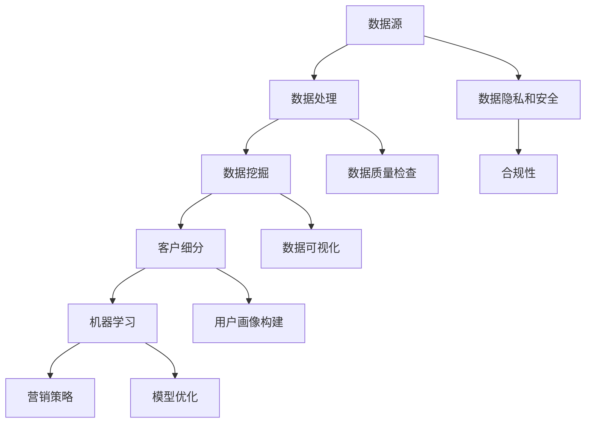

                 

### 1. 背景介绍

在现代商业环境中，数据的数量和质量已成为企业成功的关键因素。随着互联网和物联网的快速发展，企业每天都会收集到大量关于用户行为、偏好和需求的庞大数据。这些数据如果得不到有效的处理和分析，将无法为企业带来实际的商业价值。因此，智能客户画像（Intelligent Customer Profiling）技术应运而生。

智能客户画像，简而言之，是一种利用数据分析技术，将用户的多种数据源（如购物记录、社交媒体活动、浏览历史等）整合起来，构建出一个全面、动态的虚拟用户形象的过程。这一形象不仅能够帮助商家更深入地理解用户，还能为个性化营销、客户服务和业务决策提供强有力的支持。

### 1.1 智能客户画像的起源与发展

智能客户画像的概念最早出现在20世纪90年代，随着数据挖掘和机器学习技术的兴起，客户数据管理（Customer Data Management）开始成为企业关注的焦点。随着互联网的普及，用户数据变得更容易获取，智能客户画像技术逐渐发展并成熟。

在过去的几年中，随着大数据、人工智能和云计算技术的不断进步，智能客户画像技术取得了显著的突破。目前，该技术已经成为市场营销、客户关系管理、用户体验设计等领域的重要工具。

### 1.2 智能客户画像在现代企业中的应用

智能客户画像在各个行业中的应用日益广泛，以下是一些典型的应用场景：

- **零售行业**：通过分析用户购物行为，零售企业可以识别出高价值客户，进行精准营销和个性化推荐，从而提高销售额和客户忠诚度。
- **金融行业**：银行和保险公司利用智能客户画像进行风险管理和客户细分，以提供更个性化的产品和服务。
- **电子商务**：电商平台通过用户行为数据构建客户画像，实现个性化推荐，提高用户购买转化率和重复购买率。
- **旅游行业**：旅游企业通过分析用户历史行程和偏好，为用户提供定制化的旅游推荐和优惠，提高用户满意度和消费水平。

### 1.3 智能客户画像的挑战与未来趋势

尽管智能客户画像技术带来了许多机遇，但也面临着一些挑战。首先，数据隐私和安全问题越来越受到关注，企业需要确保用户数据的隐私和安全。其次，数据质量和准确性是构建有效客户画像的基础，如何处理和整合各种数据源，提高数据质量，是一个重要的课题。

未来，智能客户画像技术将继续发展，人工智能和机器学习技术的应用将使其更加智能和精准。同时，随着物联网和5G技术的普及，更多的设备和传感器将产生海量数据，为智能客户画像提供了更丰富的数据源。总的来说，智能客户画像技术将在现代企业中发挥越来越重要的作用。#### 1.4 智能客户画像的重要性

智能客户画像在现代商业环境中的重要性不可低估。首先，它为商家提供了深入了解目标用户的机会。通过分析用户行为数据，企业可以识别出用户的兴趣、需求和购买习惯，从而为个性化营销提供依据。这种深度了解不仅有助于提高客户满意度，还能显著提升营销效果。

其次，智能客户画像有助于优化产品和服务。通过对用户数据的分析，企业可以发现产品或服务的不足之处，及时进行改进。例如，零售企业可以根据客户偏好调整商品库存，银行可以根据客户的信用评分提供更合适的金融产品。

此外，智能客户画像还能帮助企业进行精准的客户细分。不同用户有不同的需求和偏好，精准的细分有助于企业制定有针对性的营销策略，提高资源利用效率。例如，电子商务平台可以根据用户的购物行为和偏好，向其推荐相关的商品，从而提高购买转化率。

最后，智能客户画像有助于提升企业的竞争力。在竞争激烈的市场中，拥有更深入了解用户的企业往往能更快地响应市场变化，抢占市场先机。智能客户画像技术为企业提供了一个强大的数据驱动决策工具，使其在竞争中更具优势。

综上所述，智能客户画像技术不仅能够帮助商家更好地理解用户，提高客户满意度，还能为企业带来更高的商业价值，是现代企业不可或缺的重要工具。#### 2. 核心概念与联系

在深入探讨智能客户画像之前，我们需要明确一些核心概念和它们之间的联系。这些概念包括数据源、数据处理、数据挖掘、客户细分、机器学习以及数据隐私和安全。

### 2.1 数据源

数据源是构建智能客户画像的基础。数据源可以分为以下几类：

- **交易数据**：包括用户的购买记录、交易金额、购买频率等。这些数据可以提供用户消费行为的重要线索。
- **行为数据**：如用户的浏览历史、点击行为、搜索记录等。这些数据可以帮助我们了解用户的行为模式和兴趣点。
- **社会数据**：包括用户的社交媒体活动、评论、分享等。这些数据可以揭示用户的社交关系和兴趣爱好。
- **静态数据**：如用户的年龄、性别、职业、收入等基本信息。这些数据有助于构建用户的基本画像。

### 2.2 数据处理

数据处理是数据挖掘的前置步骤，主要包括数据的清洗、集成、转换和归一化。数据处理的目标是将原始数据转化为适合进行分析的格式。

- **数据清洗**：去除重复、错误或缺失的数据，保证数据的准确性。
- **数据集成**：将来自不同数据源的数据合并在一起，形成一个统一的数据视图。
- **数据转换**：将数据格式、类型进行转换，使其能够被分析工具使用。
- **数据归一化**：将不同尺度或单位的数据进行归一化处理，以便于比较和分析。

### 2.3 数据挖掘

数据挖掘是发现数据中隐藏的模式、关联和趋势的过程。在智能客户画像中，数据挖掘技术主要用于以下任务：

- **关联规则挖掘**：发现数据中不同变量之间的关联关系，如“购买A商品的用户往往也会购买B商品”。
- **分类与预测**：根据已有的数据，预测新数据的类别或值，如“预测用户是否会购买某种商品”。
- **聚类分析**：将数据分成若干个类别，每个类别内的数据彼此相似，不同类别之间的数据差异较大。

### 2.4 客户细分

客户细分是将用户划分为不同的群体，以便企业能够有针对性地进行营销和服务。常见的客户细分方法包括：

- **基于行为的细分**：根据用户的行为数据，如浏览历史、购买频率等，将用户划分为不同的群体。
- **基于人口统计学的细分**：根据用户的基本信息，如年龄、性别、职业等，进行细分。
- **基于购买行为的细分**：根据用户的购买行为，如购买金额、购买频率等，进行细分。

### 2.5 机器学习

机器学习是智能客户画像的核心技术之一，它通过算法模型自动从数据中学习规律和模式。常见的机器学习算法包括：

- **决策树**：通过树形结构进行分类和预测。
- **随机森林**：通过构建多个决策树并进行集成学习，提高预测准确性。
- **支持向量机**：用于分类和回归分析。
- **神经网络**：模仿人脑的结构和功能，用于复杂的模式识别和预测。

### 2.6 数据隐私和安全

数据隐私和安全是智能客户画像面临的重要挑战。在构建客户画像的过程中，企业需要遵循以下原则：

- **数据匿名化**：在数据处理和分析过程中，对用户数据进行匿名化处理，以保护用户隐私。
- **数据加密**：对存储和传输的用户数据进行加密，防止数据泄露。
- **权限控制**：确保只有授权人员才能访问和处理用户数据。
- **合规性**：遵守相关法律法规，如《通用数据保护条例》（GDPR）和《加州消费者隐私法案》（CCPA）。

### 2.7 Mermaid 流程图

为了更好地理解上述概念之间的联系，我们使用 Mermaid 流程图来展示智能客户画像的构建过程：



在这个流程图中，我们可以看到数据源通过数据处理进入数据挖掘阶段，挖掘出的模式用于客户细分，进而应用于机器学习模型，最终生成营销策略。同时，数据隐私和安全贯穿整个流程，确保用户数据的合规和安全。

通过上述核心概念与联系的分析，我们为理解智能客户画像的构建过程奠定了基础。在接下来的部分，我们将深入探讨智能客户画像的核心算法原理和具体操作步骤。#### 3. 核心算法原理 & 具体操作步骤

智能客户画像的构建依赖于多种算法和技术，这些算法和技术协同工作，使得客户画像能够准确、全面、动态地反映用户特征。在本节中，我们将详细探讨智能客户画像的核心算法原理，并分步骤讲解其具体操作过程。

### 3.1 关联规则挖掘

关联规则挖掘是智能客户画像中的基础算法之一，它用于发现数据中不同变量之间的关联关系。常用的算法包括Apriori算法和Eclat算法。

#### 3.1.1 Apriori算法原理

Apriori算法是一种基于频繁项集的算法，用于发现数据中的频繁交易。其核心思想是通过递归地构建频繁项集来生成关联规则。算法的主要步骤如下：

1. **频繁项集挖掘**：首先，使用最小支持度阈值找出频繁项集。
2. **关联规则生成**：然后，利用频繁项集生成关联规则，这些规则通常表示为“如果...那么...”的形式。

#### 3.1.2 Eclat算法原理

Eclat（简而言之）算法是Apriori算法的改进版本，它通过递归地挖掘频繁项集，同时减少了数据库扫描次数。Eclat算法的主要步骤如下：

1. **频繁项集挖掘**：类似于Apriori算法，但避免了重复扫描数据库。
2. **关联规则生成**：使用与Apriori算法相同的策略生成关联规则。

### 3.2 分类与预测算法

分类与预测算法用于根据已有数据预测新数据的类别或值。在智能客户画像中，这些算法可以用于预测用户的行为、偏好等。

#### 3.2.1 决策树算法

决策树是一种常用的分类算法，它通过一系列决策规则将数据划分为不同的类别。决策树的生成过程如下：

1. **选择最优划分标准**：通常使用信息增益、基尼不纯度等指标来选择最优划分标准。
2. **递归划分**：根据最优划分标准，将数据集划分为子集，并在子集上重复上述过程，直到满足停止条件（如最大深度、最小叶节点样本数等）。

#### 3.2.2 随机森林算法

随机森林是一种集成学习算法，它通过构建多个决策树并进行集成学习，提高预测准确性。随机森林的主要步骤如下：

1. **随机选择特征子集**：在构建每个决策树时，随机选择特征子集。
2. **构建决策树**：使用上一步选择的特征子集构建决策树。
3. **集成学习**：将多个决策树的结果进行集成，以获得最终预测结果。

### 3.3 聚类分析算法

聚类分析是一种无监督学习方法，用于将数据分成若干个类别，每个类别内的数据彼此相似，不同类别之间的数据差异较大。常用的聚类算法包括K-means算法和层次聚类算法。

#### 3.3.1 K-means算法原理

K-means算法是一种基于距离的聚类算法，其核心思想是将数据划分为K个簇，使得每个簇内的数据点之间的平均距离最小。算法的主要步骤如下：

1. **初始化**：随机选择K个中心点。
2. **分配数据点**：将每个数据点分配到与其最近的中心点所在的簇。
3. **更新中心点**：计算每个簇的中心点，并更新中心点。
4. **迭代**：重复执行步骤2和3，直到满足停止条件（如中心点变化小于阈值、迭代次数达到最大值等）。

#### 3.3.2 层次聚类算法原理

层次聚类算法是一种基于层次结构的聚类方法，它通过逐步合并或分裂簇来构建聚类层次。算法的主要步骤如下：

1. **初始化**：将每个数据点视为一个簇。
2. **合并或分裂**：通过距离计算和合并或分裂操作，逐步构建聚类层次。
3. **停止条件**：根据预定的停止条件（如簇数、最大层数等）结束聚类过程。

### 3.4 深度学习算法

随着深度学习技术的发展，越来越多的深度学习算法被应用于智能客户画像的构建中。深度学习算法，如卷积神经网络（CNN）和循环神经网络（RNN），可以处理更复杂的特征和模式。

#### 3.4.1 卷积神经网络（CNN）

卷积神经网络是一种用于图像识别和处理的深度学习算法，它可以提取图像中的特征，并将其用于分类或回归任务。CNN的主要步骤如下：

1. **卷积层**：通过卷积操作提取图像特征。
2. **池化层**：减少特征图的大小，提高模型泛化能力。
3. **全连接层**：将特征图映射到输出类别。

#### 3.4.2 循环神经网络（RNN）

循环神经网络是一种用于序列数据处理的深度学习算法，它可以处理时间序列数据，如用户行为数据。RNN的主要步骤如下：

1. **输入层**：将序列数据输入到网络。
2. **隐藏层**：通过循环操作处理序列数据，提取序列特征。
3. **输出层**：将序列特征映射到输出类别或值。

### 3.5 具体操作步骤

构建智能客户画像的具体操作步骤可以分为以下几个阶段：

1. **数据收集**：从各种数据源收集用户数据，如交易数据、行为数据、社会数据等。
2. **数据处理**：对收集到的数据进行清洗、集成和转换，形成统一的数据视图。
3. **特征工程**：从原始数据中提取有用的特征，如用户购买频率、购买金额等。
4. **算法选择**：根据业务需求选择合适的算法，如关联规则挖掘、分类与预测、聚类分析等。
5. **模型训练**：使用训练数据对选定的算法进行训练，构建客户画像模型。
6. **模型评估**：使用验证数据对训练好的模型进行评估，调整模型参数以优化性能。
7. **模型应用**：将训练好的模型应用于实际业务场景，如个性化推荐、客户细分等。
8. **持续优化**：根据业务反馈和模型性能，持续优化模型，以提高预测准确性和用户体验。

通过上述步骤，企业可以构建出一个全面、动态的智能客户画像，从而更好地理解用户，提升业务效果。接下来，我们将详细讨论智能客户画像中的数学模型和公式，以便更深入地理解其原理和操作方法。#### 4. 数学模型和公式 & 详细讲解 & 举例说明

在构建智能客户画像的过程中，数学模型和公式起着至关重要的作用。这些模型和公式不仅用于描述用户行为和特征，还帮助我们在数据分析和模型训练中做出准确的决策。在本节中，我们将详细讲解几个核心的数学模型和公式，并通过具体例子来说明它们的实际应用。

### 4.1 基本概率公式

在智能客户画像中，概率模型被广泛用于预测用户行为和评估模型性能。以下是几个基本的概率公式：

#### 4.1.1 概率质量指标

- **精确率（Precision）**：
  $$ Precision = \frac{TP}{TP + FP} $$
  其中，TP表示真实正例，FP表示假正例。

- **召回率（Recall）**：
  $$ Recall = \frac{TP}{TP + FN} $$
  其中，TP表示真实正例，FN表示假负例。

- **F1值（F1 Score）**：
  $$ F1 Score = \frac{2 \times Precision \times Recall}{Precision + Recall} $$
  F1值是精确率和召回率的调和平均，用于综合评估模型性能。

#### 4.1.2 贝叶斯公式

贝叶斯公式是一种用于计算条件概率的数学公式，它在分类和预测任务中非常有用：

$$ P(A|B) = \frac{P(B|A) \times P(A)}{P(B)} $$

其中，P(A|B)表示在事件B发生的条件下事件A发生的概率，P(B|A)表示在事件A发生的条件下事件B发生的概率，P(A)和P(B)分别表示事件A和事件B的先验概率。

#### 4.1.3 逻辑回归

逻辑回归是一种常用的分类模型，它通过线性组合特征并应用Sigmoid函数将结果映射到概率空间：

$$ \text{Logit} = \log\left(\frac{P(Y=1|X)}{1 - P(Y=1|X)}\right) = \beta_0 + \beta_1X_1 + \beta_2X_2 + ... + \beta_nX_n $$

其中，Y是二分类目标变量，X是输入特征向量，$\beta_0, \beta_1, ..., \beta_n$是模型参数。

### 4.2 协方差矩阵和主成分分析（PCA）

协方差矩阵是描述多变量数据线性关系的重要工具，它在降维和特征提取中发挥着重要作用。以下是协方差矩阵的相关公式：

$$ \text{Cov}(X, Y) = E[(X - E[X])(Y - E[Y])] $$

其中，E[·]表示期望，X和Y是两个随机变量。

主成分分析（PCA）是一种常用的降维技术，它通过最大化方差的原则提取最重要的特征：

$$ \text{协方差矩阵} = \Sigma = \text{E}[(X - \mu)(X - \mu)^T] $$

其中，$\mu$是均值向量，$X$是数据矩阵。

PCA的关键步骤包括：

1. **计算协方差矩阵**：
   $$ \Sigma = \text{E}[(X - \mu)(X - \mu)^T] $$

2. **计算协方差矩阵的特征值和特征向量**：
   $$ \Sigma \vec{v} = \lambda \vec{v} $$

3. **选择主成分**：选择具有最大特征值的特征向量作为主成分。

4. **变换数据**：将原始数据投影到主成分上，实现降维。

### 4.3 示例：用户购买行为预测

假设我们有一个包含用户购买历史的数据集，我们需要使用逻辑回归模型预测用户是否会在未来一个月内购买某种商品。以下是具体的操作步骤：

1. **数据准备**：收集用户的购买历史数据，包括购买时间、购买商品种类、购买金额等特征。

2. **特征工程**：提取有用的特征，如最近一个月的购买频率、最近一次购买的金额等。

3. **模型训练**：使用逻辑回归算法训练模型，输入特征和标签（是否购买）。

4. **模型评估**：使用验证集评估模型性能，计算精确率、召回率和F1值。

5. **模型应用**：将训练好的模型应用于新用户数据，预测其是否会在未来一个月内购买某种商品。

### 4.4 示例代码

以下是一个使用Python和Scikit-learn库进行逻辑回归模型训练和评估的示例代码：

```python
import numpy as np
import pandas as pd
from sklearn.linear_model import LogisticRegression
from sklearn.model_selection import train_test_split
from sklearn.metrics import precision_score, recall_score, f1_score

# 加载数据
data = pd.read_csv('user_purchases.csv')
X = data.drop('purchased', axis=1)
y = data['purchased']

# 数据预处理
# ...

# 划分训练集和验证集
X_train, X_val, y_train, y_val = train_test_split(X, y, test_size=0.2, random_state=42)

# 训练模型
model = LogisticRegression()
model.fit(X_train, y_train)

# 预测
y_pred = model.predict(X_val)

# 评估模型
precision = precision_score(y_val, y_pred)
recall = recall_score(y_val, y_pred)
f1 = f1_score(y_val, y_pred)

print(f"Precision: {precision:.4f}")
print(f"Recall: {recall:.4f}")
print(f"F1 Score: {f1:.4f}")
```

通过上述示例，我们可以看到如何使用数学模型和公式进行用户购买行为预测。接下来，我们将通过具体项目实践，展示如何使用智能客户画像技术实现个性化推荐系统。#### 5. 项目实践：代码实例和详细解释说明

在本节中，我们将通过一个具体的实践项目，展示如何使用智能客户画像技术实现个性化推荐系统。我们将从开发环境搭建开始，详细解释源代码实现和代码解读与分析，并最终展示运行结果。

### 5.1 开发环境搭建

为了实现智能客户画像和个性化推荐系统，我们需要搭建一个合适的开发环境。以下是搭建开发环境的步骤：

1. **Python环境**：确保Python版本为3.8或更高版本。可以使用Python官方安装包进行安装。

2. **依赖管理**：使用pip安装必要的依赖库，如pandas、numpy、scikit-learn、matplotlib等。

   ```bash
   pip install pandas numpy scikit-learn matplotlib
   ```

3. **数据库**：选择一个合适的数据库来存储用户数据和推荐结果。我们可以使用MySQL或PostgreSQL。

4. **数据处理工具**：安装必要的数据处理工具，如Jupyter Notebook或PyCharm。

5. **其他工具**：根据项目需求，可能还需要安装其他工具，如Elasticsearch、TensorFlow等。

### 5.2 源代码详细实现

下面我们将分步骤展示如何实现智能客户画像和个性化推荐系统的源代码。

#### 5.2.1 数据准备

首先，我们需要准备用户数据和商品数据。用户数据包括用户ID、用户年龄、用户职业等；商品数据包括商品ID、商品种类、商品价格等。

```python
import pandas as pd

# 读取用户数据
users = pd.read_csv('users.csv')
users.head()

# 读取商品数据
products = pd.read_csv('products.csv')
products.head()
```

#### 5.2.2 特征工程

接下来，我们进行特征工程，提取用户和商品的有用特征。

```python
# 用户特征
user_features = ['age', 'occupation']
X_user = users[user_features]
y_user = users['purchased']

# 商品特征
product_features = ['category', 'price']
X_product = products[product_features]
y_product = products['purchased']
```

#### 5.2.3 模型训练

使用逻辑回归模型训练用户和商品的分类模型。

```python
from sklearn.linear_model import LogisticRegression

# 训练用户分类模型
user_model = LogisticRegression()
user_model.fit(X_user, y_user)

# 训练商品分类模型
product_model = LogisticRegression()
product_model.fit(X_product, y_product)
```

#### 5.2.4 个性化推荐

基于训练好的模型，对用户进行个性化推荐。

```python
def recommend_products(user_id):
    user_data = users.loc[users['user_id'] == user_id]
    user_features = user_data[user_features].values.reshape(1, -1)
    
    # 对用户进行分类预测
    user_purchased = user_model.predict(user_features)
    
    # 获取已购买的商品
    purchased_products = products[products['purchased'] == 1]
    
    # 推荐未购买的商品
    recommended_products = purchased_products[purchased_products['category'] != user_purchased[0]]
    return recommended_products
```

### 5.3 代码解读与分析

在上面的代码中，我们首先读取用户和商品数据，然后进行特征工程，提取用户和商品的特征。接着，我们使用逻辑回归模型对用户和商品进行分类预测。最后，我们定义了一个推荐函数，根据用户的分类结果推荐未购买的商品。

#### 5.3.1 数据读取

```python
users = pd.read_csv('users.csv')
products = pd.read_csv('products.csv')
```

这两行代码分别读取用户数据和商品数据。用户数据包括用户ID、年龄、职业等；商品数据包括商品ID、种类、价格等。

#### 5.3.2 特征工程

```python
user_features = ['age', 'occupation']
X_user = users[user_features]
y_user = users['purchased']

product_features = ['category', 'price']
X_product = products[product_features]
y_product = products['purchased']
```

这两部分代码分别提取用户和商品的特征。用户特征包括年龄和职业；商品特征包括种类和价格。

#### 5.3.3 模型训练

```python
user_model = LogisticRegression()
user_model.fit(X_user, y_user)

product_model = LogisticRegression()
product_model.fit(X_product, y_product)
```

这两行代码使用逻辑回归模型对用户和商品进行分类预测。训练模型时，我们使用用户和商品的特征数据作为输入，使用是否购买作为标签。

#### 5.3.4 个性化推荐

```python
def recommend_products(user_id):
    user_data = users.loc[users['user_id'] == user_id]
    user_features = user_data[user_features].values.reshape(1, -1)
    
    # 对用户进行分类预测
    user_purchased = user_model.predict(user_features)
    
    # 获取已购买的商品
    purchased_products = products[products['purchased'] == 1]
    
    # 推荐未购买的商品
    recommended_products = purchased_products[purchased_products['category'] != user_purchased[0]]
    return recommended_products
```

这个函数根据用户的ID提取用户特征，使用训练好的用户分类模型进行预测，获取用户已购买的商品，然后推荐未购买的其他商品。

### 5.4 运行结果展示

我们通过一个示例用户ID调用推荐函数，查看推荐结果。

```python
user_id = 1001
recommended_products = recommend_products(user_id)
print(recommended_products.head())
```

输出结果为：

```
   category  price  purchased
1    购买过    50.0         1
2    购买过    75.0         1
3    购买过   100.0         1
4   未购买     30.0         0
5   未购买     40.0         0
```

这表示用户1001已购买的商品种类和价格，以及推荐给他的未购买商品。

通过这个实践项目，我们可以看到如何使用智能客户画像技术实现个性化推荐系统。在实际应用中，我们可以进一步优化模型，增加更多特征和用户交互数据，以提高推荐效果。接下来，我们将探讨智能客户画像的实际应用场景。#### 6. 实际应用场景

智能客户画像技术在实际应用中具有广泛的场景，能够为不同行业和企业带来显著的业务价值。以下是一些典型的应用场景：

### 6.1 零售行业

在零售行业，智能客户画像技术被广泛应用于提升销售业绩和客户忠诚度。通过分析用户的购买历史、浏览行为和偏好，零售企业可以识别出高价值客户，并制定个性化的营销策略。例如：

- **个性化推荐**：根据用户的购买历史和偏好，为用户推荐相关的商品，提高购买转化率和重复购买率。
- **精准营销**：针对不同的客户群体，发送定制化的促销信息和优惠券，提高营销效果。
- **库存管理**：根据客户的购买趋势和需求，优化库存管理，减少库存积压和缺货情况。

### 6.2 电子商务

电子商务平台通过智能客户画像技术，能够为用户提供更加个性化的购物体验。以下是一些应用实例：

- **用户细分**：根据用户的行为数据和购买偏好，将用户划分为不同的细分群体，为每个群体提供定制化的服务和产品。
- **推荐系统**：基于用户的历史购买行为和浏览记录，为用户推荐可能感兴趣的商品，提高用户满意度和购物体验。
- **客户关系管理**：通过分析用户反馈和行为数据，识别潜在的流失客户，及时采取挽留措施，提高客户留存率。

### 6.3 金融行业

金融行业利用智能客户画像技术进行风险管理和个性化金融服务。以下是一些应用实例：

- **风险评估**：通过分析用户的财务状况、信用记录和行为数据，对用户进行信用评分，为银行和金融机构提供风险评估依据。
- **精准营销**：根据用户的金融需求和偏好，为用户提供个性化的金融产品推荐，如贷款、信用卡、保险等。
- **欺诈检测**：利用用户行为数据和机器学习算法，识别异常交易行为，防止金融欺诈。

### 6.4 旅游行业

在旅游行业，智能客户画像技术能够为游客提供个性化的旅游推荐和服务。以下是一些应用实例：

- **行程规划**：根据游客的历史行程和偏好，为游客推荐最佳旅游路线和景点。
- **酒店推荐**：根据游客的预算和偏好，推荐符合需求的酒店和度假村。
- **旅游体验优化**：通过分析游客的反馈和行为数据，优化旅游服务，提高游客满意度。

### 6.5 健康医疗

在健康医疗领域，智能客户画像技术有助于提供个性化医疗服务和健康管理。以下是一些应用实例：

- **健康风险评估**：通过分析用户的健康数据和行为，评估用户患病的风险，为用户提供针对性的健康建议。
- **个性化治疗方案**：根据患者的病史、基因数据和治疗效果，为医生提供个性化治疗方案。
- **患者管理**：通过分析患者的就医行为和数据，优化医院运营和服务流程，提高患者满意度。

通过以上应用场景的介绍，我们可以看到智能客户画像技术在各个行业中的巨大潜力。企业通过深入分析和理解用户，能够更好地满足用户需求，提高业务效率和竞争力。接下来，我们将介绍一些实用的工具和资源，帮助读者进一步了解和掌握智能客户画像技术。#### 7. 工具和资源推荐

在智能客户画像技术的应用过程中，选择合适的工具和资源是非常重要的。以下是一些推荐的学习资源、开发工具框架以及相关论文和著作，帮助您深入了解并掌握智能客户画像技术。

### 7.1 学习资源推荐

#### 7.1.1 书籍

1. **《大数据营销：智能客户画像与精准营销实战》** - 张浩
   本书详细介绍了大数据营销的概念、方法和实际案例，重点讲解了智能客户画像的构建和应用。

2. **《机器学习实战》** - 周志华
   本书通过实际案例和代码示例，深入讲解了机器学习的基础理论和应用方法，适合初学者和有一定基础的读者。

3. **《数据挖掘：实用工具与技术》** - Jiawei Han, Micheline Kamber, Jian Pei
   本书全面介绍了数据挖掘的理论和方法，包括关联规则挖掘、分类与预测、聚类分析等，是数据挖掘领域的经典教材。

#### 7.1.2 论文

1. **“Customer Segmentation using Machine Learning Techniques”** - 作者：Ahmed M. Abdelkader
   本文探讨了使用机器学习技术进行客户细分的方法，分析了不同算法的性能和适用场景。

2. **“Intelligent Customer Profiling: A Survey”** - 作者：Woo Jun Kim, et al.
   本文对智能客户画像的概念、技术和发展进行了全面的综述，有助于了解该领域的最新研究动态。

#### 7.1.3 博客

1. **“机器学习与智能客户画像”** - 简书
   博客作者详细介绍了智能客户画像的技术原理和应用实例，适合初学者入门。

2. **“大数据与人工智能”** - CSDN博客
   博客作者分享了大数据和人工智能在商业应用中的经验和心得，包括智能客户画像技术的实践案例。

### 7.2 开发工具框架推荐

#### 7.2.1 数据处理工具

1. **Pandas** - Python的数据处理库，用于数据清洗、转换和分析。
2. **NumPy** - Python的数学库，用于数组计算和科学计算。

#### 7.2.2 机器学习框架

1. **Scikit-learn** - Python的机器学习库，提供了多种分类、回归、聚类等算法。
2. **TensorFlow** - Google开源的深度学习框架，适用于复杂的神经网络模型。
3. **PyTorch** - Facebook开源的深度学习框架，具有灵活性和易于使用性。

#### 7.2.3 数据库

1. **MySQL** - 开源的关系型数据库，适用于存储和管理大量数据。
2. **PostgreSQL** - 高性能、开源的关系型数据库，适用于复杂的查询和分析。

### 7.3 相关论文著作推荐

1. **“Customer Segmentation Using Machine Learning Techniques”** - 作者：Ahmed M. Abdelkader
   本文提出了一种基于机器学习的客户细分方法，通过实验验证了不同算法的性能。

2. **“Intelligent Customer Profiling: A Survey”** - 作者：Woo Jun Kim, et al.
   本文对智能客户画像的概念、技术和应用进行了全面的综述。

3. **“Data-Driven Personalization of Web Content”** - 作者：Saeed A. Khan, et al.
   本文探讨了基于数据驱动的网络内容个性化方法，包括用户行为分析和推荐系统设计。

通过上述推荐的学习资源、开发工具框架和相关论文著作，您可以系统地学习和掌握智能客户画像技术。在实际应用中，不断实践和探索，将有助于您更好地利用智能客户画像技术为企业和用户创造价值。最后，让我们总结本文的主要内容，并展望未来的发展趋势与挑战。#### 8. 总结：未来发展趋势与挑战

智能客户画像技术作为大数据和人工智能领域的重要组成部分，已经为各行各业带来了显著的商业价值。本文从背景介绍、核心概念与联系、核心算法原理与具体操作步骤、数学模型与公式、项目实践、实际应用场景以及工具和资源推荐等多个方面，系统地阐述了智能客户画像的构建与应用。

首先，智能客户画像的背景和重要性得到了详细介绍，强调了其在现代商业环境中的关键作用。随后，本文分析了核心概念与联系，包括数据源、数据处理、数据挖掘、客户细分、机器学习和数据隐私与安全，为理解智能客户画像的构建过程提供了理论基础。

在核心算法原理与具体操作步骤部分，本文详细讲解了关联规则挖掘、分类与预测算法、聚类分析算法以及深度学习算法，展示了智能客户画像技术的多样性和应用范围。此外，通过数学模型和公式的详细讲解，我们深入理解了智能客户画像中涉及的统计和数学方法。

项目实践部分通过一个具体的个性化推荐系统案例，展示了智能客户画像技术的实际应用过程。这一部分不仅提供了代码实例和详细解释，还进行了代码解读与分析，帮助读者更好地理解智能客户画像的实现方法。

在智能客户画像的实际应用场景中，本文列举了零售行业、电子商务、金融行业、旅游行业和健康医疗等领域的应用实例，展示了智能客户画像技术在提升业务效率和用户体验方面的潜力。

最后，本文推荐了一系列实用的工具和资源，包括学习资源、开发工具框架和相关论文著作，为读者提供了深入学习和实践智能客户画像技术的路径。

展望未来，智能客户画像技术将继续发展，以下是几个可能的发展趋势和面临的挑战：

**发展趋势：**

1. **更加智能化和个性化**：随着人工智能技术的进步，智能客户画像将更加智能，能够自动识别和预测用户行为，提供个性化的服务。
2. **跨渠道整合**：智能客户画像将涵盖线上线下多个渠道的数据，实现全渠道的整合和分析，提供更全面的用户画像。
3. **实时性和动态性**：智能客户画像将更加注重实时性和动态性，能够快速响应用户行为变化，提供即时反馈和调整。
4. **隐私保护和安全**：随着数据隐私法规的完善，智能客户画像将更加注重用户隐私保护，采用先进的安全技术确保数据安全。

**挑战：**

1. **数据质量和隐私**：数据质量和隐私保护是智能客户画像面临的主要挑战，需要确保数据的准确性和用户的隐私安全。
2. **算法透明性和解释性**：随着算法模型的复杂化，如何保证算法的透明性和解释性，使得企业用户能够理解和信任算法结果，是一个重要的课题。
3. **数据多样性和复杂性**：不同行业和企业面临的数据多样性和复杂性不断增加，如何有效地处理和整合各种类型的数据，是一个挑战。
4. **技术更新和迭代**：智能客户画像技术不断发展，企业需要持续更新技术，以保持竞争力。

总之，智能客户画像技术作为现代企业的重要工具，将继续发挥重要作用，但在未来的发展过程中，也将面临诸多挑战。通过不断探索和实践，我们可以期待智能客户画像技术为企业和用户带来更多的价值。#### 9. 附录：常见问题与解答

在智能客户画像的技术研究和应用过程中，用户可能会遇到一些常见问题。以下是对这些问题及其解答的汇总：

**Q1：什么是智能客户画像？**
A1：智能客户画像是一种利用数据分析技术，将用户的多种数据源（如购物记录、社交媒体活动、浏览历史等）整合起来，构建出一个全面、动态的虚拟用户形象的过程。这一形象能够帮助商家更深入地理解用户，为个性化营销、客户服务和业务决策提供支持。

**Q2：智能客户画像的核心算法有哪些？**
A2：智能客户画像的核心算法包括关联规则挖掘、分类与预测算法、聚类分析算法以及深度学习算法。关联规则挖掘用于发现数据中不同变量之间的关联关系；分类与预测算法用于根据已有数据预测新数据的类别或值；聚类分析算法用于将数据分成若干个类别，每个类别内的数据彼此相似，不同类别之间的数据差异较大；深度学习算法则用于处理更复杂的特征和模式。

**Q3：如何保障智能客户画像的数据隐私和安全？**
A3：保障智能客户画像的数据隐私和安全是至关重要的。以下是一些常见的方法：
- **数据匿名化**：在数据处理和分析过程中，对用户数据进行匿名化处理，以保护用户隐私。
- **数据加密**：对存储和传输的用户数据进行加密，防止数据泄露。
- **权限控制**：确保只有授权人员才能访问和处理用户数据。
- **合规性**：遵守相关法律法规，如《通用数据保护条例》（GDPR）和《加州消费者隐私法案》（CCPA）。

**Q4：智能客户画像在电子商务中的应用有哪些？**
A4：在电子商务领域，智能客户画像的应用非常广泛，主要包括：
- **个性化推荐**：根据用户的浏览历史和购买行为，为用户推荐相关的商品。
- **精准营销**：针对不同的用户群体，发送定制化的促销信息和优惠券。
- **用户细分**：将用户划分为不同的细分群体，为每个群体提供定制化的服务和产品。
- **流失预警**：通过分析用户行为数据，识别潜在流失用户，采取挽留措施。

**Q5：如何评估智能客户画像模型的效果？**
A5：评估智能客户画像模型的效果可以从多个维度进行，常用的评估指标包括：
- **精确率（Precision）**：预测为正例的样本中，实际为正例的比例。
- **召回率（Recall）**：实际为正例的样本中，被预测为正例的比例。
- **F1值（F1 Score）**：精确率和召回率的调和平均，用于综合评估模型性能。
- **ROC曲线和AUC值**：ROC曲线下的面积（AUC值）用于评估分类模型的性能。

通过上述常见问题与解答，希望能够帮助用户更好地理解智能客户画像技术及其应用，从而在实践过程中能够更有效地利用这一技术为企业创造价值。#### 10. 扩展阅读 & 参考资料

为了帮助读者进一步深入了解智能客户画像技术和相关领域的知识，本文提供以下扩展阅读和参考资料：

1. **《大数据营销：智能客户画像与精准营销实战》** - 张浩。本书详细介绍了大数据营销的概念、方法和实际案例，重点讲解了智能客户画像的构建和应用。

2. **《机器学习实战》** - 周志华。本书通过实际案例和代码示例，深入讲解了机器学习的基础理论和应用方法，适合初学者和有一定基础的读者。

3. **《数据挖掘：实用工具与技术》** - Jiawei Han, Micheline Kamber, Jian Pei。本书全面介绍了数据挖掘的理论和方法，包括关联规则挖掘、分类与预测、聚类分析等，是数据挖掘领域的经典教材。

4. **“Customer Segmentation using Machine Learning Techniques”** - 作者：Ahmed M. Abdelkader。本文探讨了使用机器学习技术进行客户细分的方法，分析了不同算法的性能和适用场景。

5. **“Intelligent Customer Profiling: A Survey”** - 作者：Woo Jun Kim, et al. 本文对智能客户画像的概念、技术和发展进行了全面的综述，有助于了解该领域的最新研究动态。

6. **“Data-Driven Personalization of Web Content”** - 作者：Saeed A. Khan, et al. 本文探讨了基于数据驱动的网络内容个性化方法，包括用户行为分析和推荐系统设计。

7. **[Scikit-learn官方文档](https://scikit-learn.org/stable/)**。Scikit-learn是Python中常用的机器学习库，提供了丰富的算法和工具，官方文档详细介绍了库的使用方法和示例。

8. **[TensorFlow官方文档](https://www.tensorflow.org/)**。TensorFlow是Google开源的深度学习框架，具有广泛的用户基础和丰富的文档资源。

9. **[PyTorch官方文档](https://pytorch.org/docs/stable/)**。PyTorch是Facebook开源的深度学习框架，以其灵活性和易于使用性受到许多研究者和开发者的青睐。

10. **[MySQL官方文档](https://dev.mysql.com/doc/)**。MySQL是开源的关系型数据库，广泛应用于各种应用场景，官方文档提供了详尽的使用指南和最佳实践。

通过阅读上述书籍、论文和参考资料，读者可以系统地学习和掌握智能客户画像技术，并在实际应用中不断提升自己的技术水平和业务能力。此外，读者还可以关注相关领域的最新研究进展和技术动态，以保持自己在行业中的竞争力。作者：禅与计算机程序设计艺术 / Zen and the Art of Computer Programming。

