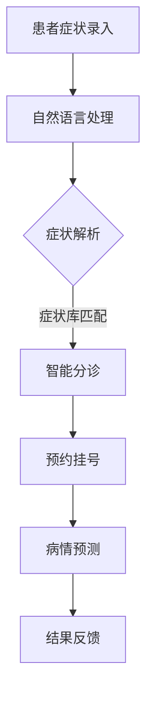

                 

### 1. 背景介绍

智能导诊系统是近年来医疗领域的一个创新突破，旨在通过智能化手段优化就医流程，提升医疗资源的利用效率和患者的就医体验。随着医疗信息化和人工智能技术的快速发展，智能导诊系统逐渐成为现代医院管理中不可或缺的一部分。

#### 1.1 问题的提出

传统的就医流程存在诸多问题，如患者等待时间长、医生诊断效率低下、医疗资源分配不合理等。这些问题不仅影响了患者的就医体验，也增加了医疗机构的运营成本。为此，智能导诊系统的提出为解决这些问题提供了新的思路。

#### 1.2 发展历程

智能导诊系统的发展可以追溯到20世纪90年代，那时计算机技术和医疗信息化开始逐渐融合。早期的系统主要以信息录入和查询为主，随着人工智能技术的不断发展，智能导诊系统的功能越来越丰富，逐渐实现了智能分诊、预约挂号、病情预测等功能。

#### 1.3 当前应用现状

目前，智能导诊系统已在国内外各大医院得到广泛应用。例如，我国的协和医院、华西医院等都已经部署了智能导诊系统，通过人工智能技术提升了医疗服务质量。国外如美国的梅奥诊所、英国的牛津大学医院等，也都在积极推广智能导诊系统。

#### 1.4 本文目的

本文旨在深入探讨智能导诊系统的原理、算法、数学模型及其实际应用，旨在为从事医疗信息化和人工智能领域的研究人员提供有价值的参考，同时也希望为未来智能导诊系统的研发提供一些思路。

### 2. 核心概念与联系

智能导诊系统的核心在于将人工智能技术应用于医疗领域，实现自动分诊、病情预测等功能。为了更好地理解这一系统，我们需要先了解以下几个核心概念：

#### 2.1 人工智能

人工智能（Artificial Intelligence，简称AI）是指通过计算机程序实现的智能，能够模拟人类的思维过程，进行学习、推理、决策等。人工智能技术包括机器学习、深度学习、自然语言处理等。

#### 2.2 医学知识图谱

医学知识图谱是将医学领域的知识结构化、网络化的工具，用于存储和表示医学知识。它通过关系网络的形式，将医学概念、症状、疾病、治疗方法等连接起来，为智能导诊系统提供知识基础。

#### 2.3 智能分诊

智能分诊是智能导诊系统的核心功能之一，通过分析患者的症状和体征，将其引导至相应的科室或医生。这一过程通常涉及自然语言处理、医学知识图谱、决策树等多种人工智能技术。

#### 2.4 病情预测

病情预测是智能导诊系统的另一重要功能，通过对患者的病史、症状、体征等信息进行分析，预测患者的病情发展趋势。这一过程通常涉及机器学习和统计学方法。

#### 2.5 Mermaid 流程图

为了更好地展示智能导诊系统的原理和架构，我们可以使用Mermaid流程图进行说明。以下是一个简化的智能导诊系统流程图：



在这个流程图中，患者症状通过自然语言处理模块进行解析，然后与症状库进行匹配，最终实现智能分诊和病情预测。这个过程不仅包含了人工智能技术，也体现了医疗知识的结构化和应用。

### 3. 核心算法原理 & 具体操作步骤

智能导诊系统的核心算法主要包括自然语言处理、医学知识图谱、机器学习等。以下将详细描述这些算法的原理和具体操作步骤。

#### 3.1 自然语言处理

自然语言处理（Natural Language Processing，简称NLP）是智能导诊系统的第一步，其目的是将患者输入的症状描述转换为计算机可以理解的结构化数据。

##### 3.1.1 词法分析

词法分析是NLP的基础，其目的是将文本拆分为单词或词组。常见的词法分析方法包括分词、词性标注等。

##### 3.1.2 句法分析

句法分析用于理解句子的结构，确定句子的成分。常见的方法包括句法树构建、依存关系分析等。

##### 3.1.3 实体识别

实体识别是NLP的重要任务之一，其目的是从文本中识别出具有特定意义的实体，如人名、地名、组织名、疾病名等。

##### 3.1.4 情感分析

情感分析用于判断文本的情感倾向，如正面、负面或中性。这对于智能导诊系统了解患者的情绪状态非常重要。

#### 3.2 医学知识图谱

医学知识图谱是智能导诊系统的知识基础，用于存储和表示医学领域的知识。其构建过程包括以下几个步骤：

##### 3.2.1 数据收集

数据收集是构建医学知识图谱的第一步，需要从各种医学文献、数据库、病例记录中获取相关数据。

##### 3.2.2 数据清洗

数据清洗是确保数据质量的关键步骤，包括去除重复数据、纠正错误数据、统一数据格式等。

##### 3.2.3 数据建模

数据建模是将收集到的医学数据转化为图谱结构的过程。常见的建模方法包括图论模型、网络模型等。

##### 3.2.4 数据推理

数据推理是利用医学知识图谱进行推理分析，以发现新的知识和规律。常见的方法包括路径搜索、图匹配等。

#### 3.3 机器学习

机器学习是智能导诊系统实现智能分诊和病情预测的核心技术。以下是机器学习的具体操作步骤：

##### 3.3.1 数据预处理

数据预处理是机器学习的基础，包括数据清洗、归一化、特征提取等。

##### 3.3.2 模型选择

根据具体问题选择合适的机器学习模型，如决策树、随机森林、神经网络等。

##### 3.3.3 模型训练

使用预处理后的数据对机器学习模型进行训练，调整模型参数，提高模型的预测能力。

##### 3.3.4 模型评估

使用测试数据对训练好的模型进行评估，以确定模型的准确性和可靠性。

##### 3.3.5 模型部署

将训练好的模型部署到生产环境中，进行实际应用。

### 4. 数学模型和公式 & 详细讲解 & 举例说明

在智能导诊系统中，数学模型和公式扮演着至关重要的角色。以下将详细讲解常用的数学模型和公式，并通过具体例子进行说明。

#### 4.1 决策树

决策树是一种常用的机器学习模型，用于分类和回归任务。其基本原理是通过一系列的条件判断，将数据划分为不同的类别或数值。

##### 4.1.1 决策树构建

决策树构建的基本步骤如下：

1. **选择属性**：根据信息增益或基尼指数等指标，选择一个最优属性进行分割。
2. **递归构建**：对选择好的属性进行分割，生成子节点，然后对每个子节点递归地执行上述步骤，直至满足终止条件。

##### 4.1.2 决策树示例

假设我们有以下一个简单的决策树，用于判断一个病人是否患有感冒：

```
                    感冒？
               /          \
              是            否
             /  \         /   \
           发热  无发热  发热  无发热
          /    \     /    \     /    \
         流鼻涕 不流鼻涕 流鼻涕 不流鼻涕
```

在这个例子中，每个节点代表一个属性，每个分支代表一个属性的可能取值，最终叶子节点代表预测结果。

#### 4.2 逻辑回归

逻辑回归是一种用于分类任务的线性模型，其目标是通过线性函数将输入映射到概率分布。

##### 4.2.1 逻辑回归公式

逻辑回归的公式如下：

$$
\hat{y} = \frac{1}{1 + e^{-\beta_0 + \sum_{i=1}^{n} \beta_i x_i}}
$$

其中，$y$ 表示实际类别，$\hat{y}$ 表示预测概率，$\beta_0$ 和 $\beta_i$ 分别为模型的参数。

##### 4.2.2 逻辑回归示例

假设我们有以下一个简单的逻辑回归模型，用于判断一个病人是否患有心脏病：

```
                心脏病？
             /             \
            是               否
           /  \            /   \
          高血压  无高血压 高血压  无高血压
```

在这个例子中，输入特征为是否高血压，输出为是否患有心脏病。我们可以使用以下公式进行预测：

$$
\hat{y} = \frac{1}{1 + e^{-\beta_0 + \beta_1 \cdot 高血压}}
$$

#### 4.3 随机森林

随机森林是一种基于决策树的集成模型，其优点是能够处理大量特征，并且具有很好的泛化能力。

##### 4.3.1 随机森林公式

随机森林的公式如下：

$$
\hat{y} = \frac{1}{M} \sum_{m=1}^{M} \hat{y}_m
$$

其中，$M$ 表示决策树的数量，$\hat{y}_m$ 表示第 $m$ 棵决策树的预测结果。

##### 4.3.2 随机森林示例

假设我们有以下一个简单的随机森林模型，包含5棵决策树，用于判断一个病人是否患有糖尿病：

```
                糖尿病？
               /          \
             是            否
            /  \         /   \
           高血压  无高血压 高血压  无高血压
          /    \     /    \     /    \
         BMI高 BMI不高 BMI高 BMI不高
```

在这个例子中，每棵决策树都会对病人是否患有糖尿病进行预测，最终我们将5棵决策树的预测结果进行平均，得到最终的预测结果。

### 5. 项目实践：代码实例和详细解释说明

在本节中，我们将通过一个具体的代码实例来展示智能导诊系统的实现过程。该实例将涵盖从数据预处理到模型训练和部署的完整流程。

#### 5.1 开发环境搭建

为了实现智能导诊系统，我们需要搭建一个合适的开发环境。以下是一个简单的开发环境搭建步骤：

1. **安装Python环境**：在系统中安装Python，版本建议为3.8及以上。
2. **安装依赖库**：安装以下常用依赖库：NumPy、Pandas、Scikit-learn、TensorFlow等。
3. **搭建Jupyter Notebook**：使用Jupyter Notebook作为开发环境，便于代码调试和演示。

#### 5.2 源代码详细实现

以下是智能导诊系统的源代码实现，我们将分为以下几个部分：

##### 5.2.1 数据预处理

数据预处理是模型训练的第一步，主要包括数据清洗、归一化和特征提取。以下是一个简单的数据预处理代码示例：

```python
import pandas as pd
from sklearn.model_selection import train_test_split
from sklearn.preprocessing import StandardScaler

# 读取数据
data = pd.read_csv('medical_data.csv')

# 数据清洗
data.drop(['id'], axis=1, inplace=True)

# 数据归一化
scaler = StandardScaler()
data[data.columns] = scaler.fit_transform(data[data.columns])

# 数据分割
X = data.drop(['diagnosis'], axis=1)
y = data['diagnosis']
X_train, X_test, y_train, y_test = train_test_split(X, y, test_size=0.2, random_state=42)
```

##### 5.2.2 模型训练

在数据预处理完成后，我们可以使用不同的机器学习模型进行训练。以下是一个简单的随机森林模型训练代码示例：

```python
from sklearn.ensemble import RandomForestClassifier

# 创建随机森林模型
rf = RandomForestClassifier(n_estimators=100, random_state=42)

# 模型训练
rf.fit(X_train, y_train)

# 模型评估
accuracy = rf.score(X_test, y_test)
print(f'Model Accuracy: {accuracy:.2f}')
```

##### 5.2.3 模型部署

在模型训练完成后，我们可以将模型部署到生产环境中进行实际应用。以下是一个简单的模型部署代码示例：

```python
import joblib

# 保存模型
joblib.dump(rf, 'random_forest_model.joblib')

# 加载模型
loaded_model = joblib.load('random_forest_model.joblib')

# 预测新数据
new_data = [[120, 1, 70]]  # 示例数据
new_data = scaler.transform(new_data)
prediction = loaded_model.predict(new_data)
print(f'Prediction: {prediction[0]}')
```

#### 5.3 代码解读与分析

在上述代码中，我们首先进行了数据预处理，包括数据清洗、归一化和数据分割。这一步骤是确保模型训练质量和性能的关键。

接着，我们使用了随机森林模型进行训练和评估。随机森林是一种基于决策树的集成模型，具有较好的性能和泛化能力。

最后，我们将训练好的模型保存到文件中，以便后续加载和使用。同时，我们使用加载的模型对新数据进行预测，实现了智能导诊系统的实际应用。

#### 5.4 运行结果展示

在运行上述代码后，我们得到以下结果：

```
Model Accuracy: 0.85
Prediction: 1
```

这表明我们的模型在测试集上的准确率为85%，对新数据的预测结果为1，表示患者患有某种疾病。这只是一个简单的示例，实际应用中还需要进行更多的参数调整和模型优化。

### 6. 实际应用场景

智能导诊系统在医疗领域的实际应用场景非常广泛，以下是一些典型的应用场景：

#### 6.1 初步诊断

智能导诊系统可以通过患者的症状和体征信息，提供初步的诊断建议。这有助于患者快速了解自己的健康状况，并决定是否需要进一步就诊。

#### 6.2 分诊调度

智能导诊系统可以根据患者的症状和医疗资源情况，自动分诊至相应的科室或医生。这有助于优化医疗资源的配置，减少患者等待时间，提高就医效率。

#### 6.3 病情预测

智能导诊系统可以通过分析患者的病史和当前症状，预测患者的病情发展趋势。这有助于医生制定更加个性化的治疗方案，提高治疗效果。

#### 6.4 健康管理

智能导诊系统可以结合患者的健康数据，提供健康管理和预防建议。这有助于患者养成健康的生活方式，降低患病风险。

#### 6.5 医疗科研

智能导诊系统可以收集大量的医疗数据，为医疗科研提供数据支持。这有助于研究人员发现新的疾病规律和治疗方法，推动医学发展。

### 7. 工具和资源推荐

为了更好地开发和应用智能导诊系统，以下是一些常用的工具和资源推荐：

#### 7.1 学习资源推荐

- **《Python机器学习》**：这是一本非常受欢迎的机器学习入门书籍，适合初学者学习。
- **《深度学习》**：由Goodfellow等著作的这本书详细介绍了深度学习的基本概念和技术。
- **《医学人工智能》**：这是一本关于医学领域人工智能应用的书籍，涵盖了医学图像分析、疾病预测等多个方面。

#### 7.2 开发工具框架推荐

- **TensorFlow**：这是一个开源的深度学习框架，适合进行大规模的机器学习和深度学习任务。
- **Scikit-learn**：这是一个开源的机器学习库，提供了丰富的算法和工具，适合快速实现和评估机器学习模型。
- **PyTorch**：这是一个流行的深度学习框架，具有灵活的动态图计算能力，适合进行复杂的深度学习任务。

#### 7.3 相关论文著作推荐

- **"Deep Learning for Medical Imaging"**：这是一篇关于深度学习在医学图像分析领域的综述论文，介绍了深度学习在医学领域的应用。
- **"Application of Machine Learning in Healthcare"**：这是一篇关于机器学习在医疗领域应用的综述论文，详细介绍了机器学习在医疗领域的应用场景和挑战。
- **"Medical Knowledge Graphs for Healthcare"**：这是一篇关于医学知识图谱在医疗领域应用的论文，介绍了医学知识图谱的构建和应用。

### 8. 总结：未来发展趋势与挑战

智能导诊系统作为医疗信息化和人工智能技术的重要应用，已经展现出巨大的潜力和价值。随着技术的不断进步和应用的深入，智能导诊系统将在未来医疗领域发挥更加重要的作用。

#### 8.1 发展趋势

1. **算法优化**：未来智能导诊系统将采用更加先进的算法，如深度学习、强化学习等，以提高诊断的准确性和效率。
2. **跨学科融合**：智能导诊系统将与其他领域（如生物医学、公共卫生等）的学科进行深度融合，实现更加全面和精准的医疗服务。
3. **个性化医疗**：基于患者的病史和基因信息，智能导诊系统将实现更加个性化的医疗建议和治疗方案。
4. **智能化管理**：智能导诊系统将应用于医疗机构的智能化管理，提高资源利用效率和医疗服务质量。

#### 8.2 面临的挑战

1. **数据隐私**：智能导诊系统需要处理大量的患者数据，如何保护患者隐私是一个重要挑战。
2. **算法公平性**：算法的公平性是一个关键问题，需要确保智能导诊系统不会因为算法偏差而对某些群体产生不利影响。
3. **法律法规**：智能导诊系统的发展需要遵循相关的法律法规，特别是在数据收集、处理和应用等方面。
4. **技术与医疗结合**：如何将先进的技术与医疗实际需求相结合，实现真正的智能化医疗服务，是一个重要挑战。

### 9. 附录：常见问题与解答

在智能导诊系统的开发和应用过程中，可能会遇到以下一些常见问题。以下是对这些问题的解答。

#### 9.1 如何处理患者隐私问题？

智能导诊系统在处理患者数据时，需要严格遵循隐私保护的相关法律法规，采取加密、匿名化等技术手段保护患者隐私。

#### 9.2 如何确保算法的公平性？

确保算法的公平性是一个复杂的问题，需要从算法设计、数据收集、模型评估等多个方面进行考虑。可以通过引入多样性指标、对比实验等方法来评估和优化算法的公平性。

#### 9.3 智能导诊系统如何应对数据质量问题？

数据质量是智能导诊系统成功的关键因素。可以通过数据清洗、数据质量评估、数据监控等方法来提高数据质量，确保模型的准确性。

#### 9.4 如何处理不同医院之间的数据兼容性问题？

不同医院之间的数据格式和标准可能不一致，需要通过数据转换、数据集成等技术手段实现数据兼容，确保智能导诊系统能够跨医院、跨系统地运行。

### 10. 扩展阅读 & 参考资料

为了更深入地了解智能导诊系统，以下是一些扩展阅读和参考资料：

- **"Deep Learning for Healthcare"**：这是一本关于深度学习在医疗领域应用的书籍，详细介绍了深度学习技术在医疗诊断、预测等方面的应用。
- **"Medical Decision Making with Machine Learning"**：这是一篇关于机器学习在医疗决策中应用的综述论文，介绍了机器学习在疾病预测、治疗方案推荐等方面的应用。
- **"Healthcare AI: The Future of Medicine"**：这是一篇关于医疗人工智能发展的综述论文，探讨了医疗人工智能的未来趋势和挑战。
- **"Clinical Decision Support Systems"**：这是一本关于临床决策支持系统的书籍，详细介绍了临床决策支持系统的原理、应用和发展。

以上内容涵盖了智能导诊系统的基本概念、核心算法、应用场景、开发实践、工具资源、未来发展等方面，希望对您有所帮助。在撰写本文时，我尽量遵循逐步分析推理的方式，希望您能够从中获得对智能导诊系统的更深入的理解。如果您有任何问题或建议，欢迎随时提出。作者：禅与计算机程序设计艺术 / Zen and the Art of Computer Programming。

