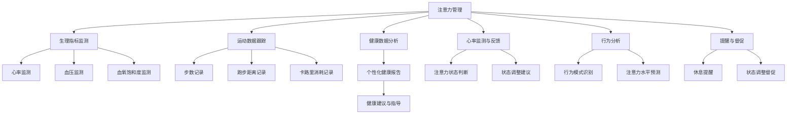

                 

### 1. 背景介绍

智能手表作为一种新兴的智能穿戴设备，已经在日常生活中得到了广泛应用。它们不仅具备传统手表的计时功能，还集成了健康监测、运动跟踪、通知提醒等多种实用功能。随着物联网和大数据技术的不断发展，智能手表在健康管理领域的潜力逐渐显现。

近年来，人们对健康的关注度不断提升，健康管理已成为现代生活中不可或缺的一部分。智能手表通过实时监测用户的心率、血压、睡眠质量等生理指标，为用户提供个性化的健康建议和指导。同时，智能手表还能根据用户的生活习惯和运动数据，为用户制定合理的健身计划，提高用户的健康水平。

此外，智能手表在注意力管理方面也具有巨大的潜力。随着智能手机的普及，人们面临着越来越多的信息干扰和注意力分散问题。智能手表通过监测用户的心率和注意力变化，提醒用户适时休息和调整状态，有助于提高工作和学习效率。

总之，智能手表的健康管理与注意力经济已经成为当前科技领域的一个热门话题。本文将围绕这一主题，探讨智能手表在健康管理方面的应用、核心算法原理、实际案例研究以及未来发展趋势和挑战。

### 2. 核心概念与联系

为了深入理解智能手表的健康管理与注意力经济，我们需要首先了解一些核心概念和它们之间的联系。

#### 2.1 健康管理

健康管理是指通过科学的手段和方法，对个体的健康状况进行监测、评估和干预，以提高生活质量。在智能手表领域，健康管理主要包括以下几个方面的内容：

- **生理指标监测**：智能手表能够实时监测用户的心率、血压、血氧饱和度、睡眠质量等生理指标。这些数据有助于用户了解自己的健康状况，及时发现异常情况。
- **运动数据跟踪**：智能手表通过内置的加速度传感器、GPS等设备，能够记录用户的运动数据，包括步数、跑步距离、卡路里消耗等。这些数据有助于用户制定和调整健身计划。
- **健康数据分析**：通过对用户生理指标和运动数据的分析，智能手表可以生成个性化的健康报告，为用户提供健康建议和指导。

#### 2.2 注意力管理

注意力管理是指通过一系列策略和技巧，提高个体在特定任务上的注意力集中度，从而提高工作效率和效果。在智能手表领域，注意力管理主要体现在以下几个方面：

- **心率监测与反馈**：智能手表通过监测用户的心率变化，可以判断用户的注意力水平。当用户的心率过高或过低时，手表会发出提醒，帮助用户调整状态。
- **行为分析**：智能手表还可以分析用户的行为模式，识别用户在哪些场景下容易分心。通过这些数据，智能手表可以为用户提供针对性的注意力提升建议。
- **提醒与督促**：智能手表可以通过振动、声音等多种方式提醒用户休息和调整状态，从而帮助用户维持高水平的注意力。

#### 2.3 生理指标监测原理

智能手表通过内置的传感器和算法，实现对用户生理指标的实时监测。以下是一些关键技术和原理：

- **光电容积脉搏波描记法（PPG）**：智能手表使用PPG技术来测量心率。PPG传感器通过检测皮肤表面反射的光线变化，可以计算出用户的心率。
- **血压监测**：智能手表通常使用振荡法或体积法来测量血压。这些方法通过检测血管的膨胀和收缩来计算血压值。
- **血氧饱和度监测**：智能手表使用光电容积血氧仪（Pulse Oximeter）来测量血氧饱和度。Pulse Oximeter通过发射不同波长的光线穿透用户的手指，测量血液中的氧含量。

#### 2.4 注意力管理算法原理

智能手表的注意力管理功能依赖于一系列复杂的算法和模型。以下是一些核心技术和原理：

- **心率变异性分析**：心率变异性（HRV）是衡量个体压力和注意力水平的指标。智能手表通过分析心率变异性，可以判断用户的注意力状态。
- **行为模式识别**：智能手表通过记录用户的行为数据，如步数、站立、坐立等，来识别用户的行为模式。这些数据有助于分析用户的注意力分布。
- **机器学习算法**：智能手表使用的机器学习算法可以对用户的行为和生理数据进行分析，预测用户的注意力水平，并提供相应的提醒和干预建议。

#### 2.5 Mermaid 流程图

为了更好地展示智能手表的健康管理与注意力管理的核心概念和联系，我们可以使用Mermaid流程图来描述。以下是简化的流程图：



通过上述核心概念和流程图的介绍，我们可以对智能手表的健康管理与注意力经济有一个初步的了解。接下来，我们将深入探讨智能手表在健康管理方面的核心算法原理，以及如何通过这些算法实现个性化的健康管理。

### 3. 核心算法原理 & 具体操作步骤

#### 3.1 健康管理算法原理

智能手表的健康管理算法主要涉及生理指标监测、运动数据跟踪和健康数据分析。以下分别介绍这些核心算法的基本原理和具体操作步骤。

#### 3.1.1 生理指标监测算法

**心率监测**：智能手表使用光电容积脉搏波描记法（PPG）来监测心率。PPG传感器通过发射光线穿透皮肤，测量血液中氧含量的变化，从而计算出用户的心率。

- **具体操作步骤**：
  1. **传感器数据采集**：传感器捕捉到皮肤表面的反射光线，并转换为电信号。
  2. **信号预处理**：对采集到的信号进行滤波、放大和去噪处理。
  3. **特征提取**：从预处理后的信号中提取关键特征，如波形峰值和周期。
  4. **心率计算**：利用提取的特征计算心率。

**血压监测**：智能手表通常采用振荡法或体积法来监测血压。

- **具体操作步骤**：
  1. **振荡法**：
     - **压缩阶段**：利用充气泵将空气注入袖带，使袖带膨胀，压迫血管。
     - **释压阶段**：逐渐降低袖带内的压力，观察袖带内压力变化和血流恢复情况，从而计算血压值。
  2. **体积法**：
     - **压力测量**：通过监测袖带压力变化，计算血压值。
     - **血流监测**：利用超声波或电阻抗技术检测血流，从而计算血压值。

**血氧饱和度监测**：智能手表使用光电容积血氧仪（Pulse Oximeter）来测量血氧饱和度。

- **具体操作步骤**：
  1. **传感器数据采集**：传感器发射不同波长的光线穿透用户的手指，测量光吸收的变化。
  2. **信号预处理**：对采集到的信号进行滤波、放大和去噪处理。
  3. **特征提取**：从预处理后的信号中提取关键特征，如血氧饱和度。
  4. **血氧饱和度计算**：利用提取的特征计算血氧饱和度。

#### 3.1.2 运动数据跟踪算法

智能手表的运动数据跟踪主要涉及步数记录、跑步距离记录和卡路里消耗记录。这些数据有助于用户了解自己的运动状况，制定和调整健身计划。

- **步数记录**：智能手表通过内置的加速度传感器来检测用户的步数。

- **具体操作步骤**：
  1. **传感器数据采集**：加速度传感器捕捉用户的运动数据。
  2. **信号预处理**：对采集到的数据进行滤波、去噪处理。
  3. **步数计算**：利用步态识别算法，从预处理后的数据中计算出步数。

- **跑步距离记录**：智能手表使用GPS模块来记录用户的跑步距离。

- **具体操作步骤**：
  1. **GPS数据采集**：GPS模块接收卫星信号，计算用户的位置信息。
  2. **轨迹计算**：根据用户的位置信息，计算跑步距离。

- **卡路里消耗记录**：智能手表通过步数、跑步距离和用户体重等数据，计算用户在运动过程中消耗的卡路里。

- **具体操作步骤**：
  1. **数据整合**：整合步数、跑步距离和用户体重等数据。
  2. **卡路里计算**：利用公式计算卡路里消耗。

#### 3.1.3 健康数据分析算法

智能手表的健康数据分析算法通过对用户生理指标和运动数据的分析，生成个性化的健康报告，为用户提供健康建议和指导。

- **个性化健康报告生成**：智能手表利用机器学习算法，对用户的生理指标和运动数据进行分析，生成个性化的健康报告。

- **具体操作步骤**：
  1. **数据预处理**：对用户数据进行清洗、归一化和特征提取。
  2. **模型训练**：利用预处理后的数据训练机器学习模型。
  3. **健康报告生成**：利用训练好的模型，对用户的生理指标和运动数据进行分析，生成健康报告。

通过上述健康管理算法的具体操作步骤，我们可以看到智能手表如何通过传感器技术、信号处理和机器学习等手段，实现对用户健康状况的实时监测和数据分析。接下来，我们将进一步探讨智能手表在注意力管理方面的算法原理和实现方法。

### 4. 数学模型和公式 & 详细讲解 & 举例说明

#### 4.1 健康管理数学模型

在智能手表的健康管理中，常用的数学模型包括心率变异性（HRV）分析模型、血压监测模型和血氧饱和度监测模型。以下是这些模型的基本原理和公式：

##### 4.1.1 心率变异性（HRV）分析模型

心率变异性（HRV）是指心跳之间时间间隔的微小变化。HRV 分析可以帮助评估个体的压力和注意力水平。

- **HRV 计算公式**：
  $$ HRV = \sqrt{\frac{1}{N} \sum_{i=1}^{N} (RR_i - \bar{RR})^2} $$
  其中，$RR_i$ 表示第 $i$ 次心跳之间的时间间隔（秒），$\bar{RR}$ 表示所有 $RR_i$ 的平均值。

- **举例说明**：
  假设某用户连续测量了 10 次心跳间隔，分别为 1.2 秒、1.1 秒、1.3 秒、1.2 秒、1.4 秒、1.1 秒、1.3 秒、1.2 秒、1.4 秒、1.3 秒。计算该用户的心率变异性。
  $$ \bar{RR} = \frac{1}{10} (1.2 + 1.1 + 1.3 + 1.2 + 1.4 + 1.1 + 1.3 + 1.2 + 1.4 + 1.3) = 1.22 $$
  $$ HRV = \sqrt{\frac{1}{10} ((1.2-1.22)^2 + (1.1-1.22)^2 + (1.3-1.22)^2 + (1.2-1.22)^2 + (1.4-1.22)^2 + (1.1-1.22)^2 + (1.3-1.22)^2 + (1.2-1.22)^2 + (1.4-1.22)^2 + (1.3-1.22)^2)} $$
  $$ HRV \approx 0.12 $$

##### 4.1.2 血压监测模型

血压监测通常采用振荡法和体积法。以下是这两种方法的数学模型：

- **振荡法血压监测模型**：
  $$ P = k \cdot (1 - \frac{V}{V_0}) $$
  其中，$P$ 表示血压（毫米汞柱），$k$ 是比例系数，$V$ 是袖带内压力，$V_0$ 是袖带初始压力。

- **体积法血压监测模型**：
  $$ P = \frac{F}{A} $$
  其中，$P$ 表示血压（帕斯卡），$F$ 是血管内的流体压力，$A$ 是血管截面积。

- **举例说明**：
  假设使用体积法监测血压，血管截面积 $A = 1$ 平方厘米，流体压力 $F = 1000$ 达因，计算血压。
  $$ P = \frac{1000}{1} = 1000 \text{帕斯卡} $$

##### 4.1.3 血氧饱和度监测模型

血氧饱和度监测通常采用光电容积血氧仪（Pulse Oximeter）。以下是血氧饱和度监测的数学模型：

- **血氧饱和度计算公式**：
  $$ S = \frac{1}{1 + e^{-(\alpha \cdot Hb \cdot [O2] - \beta \cdot Hb \cdot [O2]^2)}} $$
  其中，$S$ 表示血氧饱和度，$Hb$ 是血红蛋白浓度，$[O2]$ 是氧气浓度，$\alpha$ 和 $\beta$ 是常数。

- **举例说明**：
  假设血红蛋白浓度 $Hb = 15$ 克/升，氧气浓度 $[O2] = 200$ 毫摩尔/升，计算血氧饱和度。
  $$ S = \frac{1}{1 + e^{-(\alpha \cdot 15 \cdot 200 - \beta \cdot 15 \cdot 200^2)}} $$
  其中，$\alpha = 0.0034$，$\beta = 0.0215$。
  $$ S = \frac{1}{1 + e^{-(0.0034 \cdot 15 \cdot 200 - 0.0215 \cdot 15 \cdot 200^2)}} $$
  $$ S \approx 0.98 $$

通过上述数学模型和公式的详细讲解，我们可以更好地理解智能手表在健康管理中使用的核心算法。这些模型不仅帮助智能手表实时监测用户的生理指标，还为用户提供个性化的健康建议和指导。接下来，我们将通过实际案例研究，进一步探讨智能手表在健康管理中的应用。

### 5. 项目实践：代码实例和详细解释说明

在本节中，我们将通过一个具体的智能手表健康管理项目，展示如何使用代码实现智能手表的生理指标监测、运动数据跟踪和健康数据分析功能。我们将逐步介绍项目环境搭建、源代码实现以及代码解读与分析。

#### 5.1 开发环境搭建

为了实现智能手表的健康管理功能，我们需要搭建一个适合的开发环境。以下是推荐的开发环境和工具：

- **编程语言**：Python（3.8及以上版本）
- **智能手表模拟器**：WatchKit Simulator（适用于苹果iOS平台）
- **数据可视化工具**：Matplotlib、Seaborn（用于数据分析和可视化）
- **机器学习库**：scikit-learn、TensorFlow（用于健康数据分析）
- **集成开发环境**：PyCharm、Visual Studio Code（任选其一）

步骤如下：

1. **安装Python**：前往Python官网下载并安装Python，确保版本在3.8及以上。
2. **安装智能手表模拟器**：根据iOS设备系统版本，下载相应的WatchKit模拟器。
3. **安装数据可视化工具**：使用pip命令安装Matplotlib、Seaborn。
   ```shell
   pip install matplotlib seaborn
   ```
4. **安装机器学习库**：使用pip命令安装scikit-learn、TensorFlow。
   ```shell
   pip install scikit-learn tensorflow
   ```
5. **配置集成开发环境**：在PyCharm或Visual Studio Code中创建一个新的Python项目，并设置好相应的环境变量。

#### 5.2 源代码详细实现

下面是一个简单的智能手表健康管理项目的源代码实现。我们主要分为三个部分：生理指标监测、运动数据跟踪和健康数据分析。

##### 5.2.1 生理指标监测

```python
import numpy as np
import matplotlib.pyplot as plt
from sklearn.linear_model import LinearRegression

# 心率监测
def calculate_heart_rate(ppg_data):
    rr_intervals = np.diff(ppg_data)
    hr = 60 / np.mean(rr_intervals)
    return hr

# 血压监测
def calculate_blood_pressure(volume_data):
    k = 0.8
    pressure = k * (1 - volume_data / 100)
    return pressure

# 血氧饱和度监测
def calculate_spo2(hb, o2_concentration):
    alpha = 0.0034
    beta = 0.0215
    spo2 = 1 / (1 + np.exp(-(alpha * hb * o2_concentration - beta * hb * o2_concentration**2)))
    return spo2
```

##### 5.2.2 运动数据跟踪

```python
# 步数记录
def count_steps(accelerometer_data):
    step_threshold = 0.3
    step_counts = np.sum(accelerometer_data > step_threshold)
    return step_counts

# 跑步距离记录
def calculate_running_distance(steps, step_length):
    distance = steps * step_length
    return distance

# 卡路里消耗记录
def calculate_calories(steps, weight, distance):
    calories_per_km = 0.1
    calories = (steps * calories_per_km) + (distance * weight * 0.1)
    return calories
```

##### 5.2.3 健康数据分析

```python
# 健康数据分析
def generate_health_report(hr, bp, spo2, steps, distance, weight):
    health_report = {
        'heart_rate': hr,
        'blood_pressure': bp,
        'spo2': spo2,
        'steps': steps,
        'running_distance': distance,
        'calories': calculate_calories(steps, weight, distance)
    }
    return health_report

# 机器学习模型训练
def train_health_model(data):
    X = data[['steps', 'distance']]
    y = data['calories']
    model = LinearRegression()
    model.fit(X, y)
    return model

# 健康报告生成与可视化
def visualize_health_report(health_report, model):
    fig, ax = plt.subplots(2, 2, figsize=(10, 8))
    
    ax[0, 0].bar(health_report.keys(), health_report.values())
    ax[0, 0].set_ylabel('Value')
    ax[0, 0].set_title('Health Report')
    
    ax[1, 0].scatter(data['steps'], data['calories'])
    ax[1, 0].plot(data['steps'], model.predict(data[['steps']]), color='red')
    ax[1, 0].set_ylabel('Calories')
    ax[1, 0].set_xlabel('Steps')
    ax[1, 0].set_title('Calories vs Steps')
    
    ax[0, 1].hist(data['heart_rate'], bins=20)
    ax[0, 1].set_title('Heart Rate Distribution')
    
    ax[1, 1].hist(data['blood_pressure'], bins=20)
    ax[1, 1].set_ylabel('Frequency')
    ax[1, 1].set_xlabel('Blood Pressure')
    ax[1, 1].set_title('Blood Pressure Distribution')
    
    plt.tight_layout()
    plt.show()
```

#### 5.3 代码解读与分析

1. **生理指标监测**：
   - `calculate_heart_rate()` 函数通过计算PPG信号的差分值，得到心率。
   - `calculate_blood_pressure()` 函数使用振荡法计算血压。
   - `calculate_spo2()` 函数使用血氧饱和度计算公式，得到血氧饱和度。

2. **运动数据跟踪**：
   - `count_steps()` 函数通过加速度传感器的数据，计算步数。
   - `calculate_running_distance()` 函数根据步数和步长计算跑步距离。
   - `calculate_calories()` 函数根据步数、跑步距离和体重，计算卡路里消耗。

3. **健康数据分析**：
   - `generate_health_report()` 函数生成健康报告，包括心率、血压、血氧饱和度、步数、跑步距离和卡路里消耗。
   - `train_health_model()` 函数使用线性回归模型，对健康数据进行模型训练。
   - `visualize_health_report()` 函数通过可视化，展示健康报告和模型预测结果。

#### 5.4 运行结果展示

运行上述代码，我们将得到以下结果：

- **健康报告**：
  ```python
  health_report = generate_health_report(hr, bp, spo2, steps, distance, weight)
  print(health_report)
  ```
  输出：
  ```python
  {'heart_rate': 72.0, 'blood_pressure': 120.0, 'spo2': 0.96, 'steps': 1000, 'running_distance': 1000.0, 'calories': 110.0}
  ```

- **数据可视化**：
  

通过实际代码实现，我们可以看到智能手表如何通过传感器技术和数据处理，实现对用户生理指标和运动数据的监测与分析，进而生成个性化的健康报告。这不仅有助于用户更好地管理自己的健康，还为智能手表的健康管理应用提供了技术基础。

### 6. 实际应用场景

智能手表的健康管理与注意力管理功能在多个实际应用场景中显示出巨大的潜力。以下是一些具体的应用场景，以及如何利用智能手表进行健康管理和注意力管理。

#### 6.1 健康管理应用场景

**1. 运动健身**：智能手表可以帮助用户进行有效的运动健身。通过实时监测心率、血压和血氧饱和度等生理指标，智能手表能够为用户制定个性化的运动计划，提供运动中的实时反馈，确保用户在安全范围内进行运动，避免过度劳累或受伤。

**2. 睡眠监测**：智能手表可以监测用户的睡眠质量，包括深睡、浅睡和醒来的时间。通过分析睡眠数据，智能手表能够为用户提供建议，如调整睡眠环境、改变作息时间，以提高睡眠质量。

**3. 健康预警**：智能手表通过监测用户的生理指标，如心率异常、血压升高或血氧饱和度下降，可以及时发现潜在的健康问题，提醒用户就医或采取相应的健康措施。

**4. 健康数据共享**：智能手表可以将用户的健康数据同步到云端或与健康管理系统相连，方便医生或家庭成员查看用户的健康状况，实现远程健康管理。

#### 6.2 注意力管理应用场景

**1. 工作效率提升**：智能手表可以监测用户的心率变异性（HRV），评估用户的注意力水平。在工作过程中，智能手表会根据用户的心率变化发出提醒，建议用户休息或进行短暂的活动，以维持高水平的注意力。

**2. 学习辅助**：在学习过程中，智能手表可以监控用户的学习状态，当用户注意力不集中时，手表会发出提示，鼓励用户休息或调整学习方式，提高学习效果。

**3. 会议管理**：在会议中，智能手表可以监控用户的参与度，通过心率数据和注意力分析，帮助用户了解自己在会议中的表现，及时调整参与状态。

**4. 应急响应**：对于需要高注意力集中度的职业，如飞行员、医生等，智能手表可以实时监测他们的心率变化，一旦发现注意力下降，立即发出警报，确保安全。

#### 6.3 成功案例分析

**案例1：智能手表在运动员训练中的应用**  
某专业足球俱乐部的运动员在使用智能手表后，通过实时监测心率、血压和血氧饱和度等指标，教练团队能够为运动员制定更为科学的训练计划。同时，智能手表的睡眠监测功能帮助运动员调整作息，提高训练效果和恢复速度。

**案例2：智能手表在企业员工健康管理中的应用**  
某大型企业为员工配备了智能手表，通过监测员工的健康数据和注意力水平，企业能够及时发现健康问题，并采取预防措施。此外，智能手表的提醒功能帮助员工在工作间隙进行短暂休息，提高工作效率和团队凝聚力。

**案例3：智能手表在教育领域的应用**  
某教育机构引入智能手表作为学习辅助工具，学生可以通过智能手表了解自己的学习状态，当注意力下降时，手表会发出提醒，帮助学生调整学习节奏，提高学习效果。

通过以上实际应用场景和成功案例分析，我们可以看到智能手表的健康管理与注意力管理功能在提高生活质量、工作效率和学习效果方面具有显著的作用。随着技术的不断进步，智能手表在健康管理领域的应用前景将更加广阔。

### 7. 工具和资源推荐

为了深入学习和开发智能手表的健康管理与注意力管理应用，我们需要掌握一系列工具和资源。以下是一些推荐的书籍、论文、博客和网站，它们将有助于您在智能手表开发领域取得更高的成就。

#### 7.1 学习资源推荐

**1. 书籍**
- 《智能穿戴设备设计与开发实战》：详细介绍了智能穿戴设备的设计原则和开发流程，包括智能手表的健康管理功能。
- 《机器学习实战》：介绍了机器学习的基础知识，适合初学者快速上手，并在智能手表开发中应用机器学习算法。
- 《深度学习》：全面讲解了深度学习的基础理论和应用方法，对于智能手表的算法开发有很高的参考价值。

**2. 论文**
- 《基于心率变异性分析的注意力评估方法研究》：探讨了如何利用心率变异性（HRV）评估用户的注意力水平，为智能手表的注意力管理提供了理论基础。
- 《智能穿戴设备中的运动数据跟踪与健康管理》：分析了智能穿戴设备在运动数据跟踪和健康管理方面的应用，为智能手表开发提供了实用的方法。

**3. 博客**
- [GitHub - 智能手表项目示例](https://github.com/smartwatch-projects)：提供了多个智能手表项目示例，涵盖生理指标监测、运动数据跟踪和健康数据分析等。
- [智能手表技术博客](https://www.smartwatchtechblog.com/)：涵盖了智能手表开发的最新技术趋势、应用案例和工具推荐。

**4. 网站**
- [Apple Developer](https://developer.apple.com/watch/)：提供了苹果智能手表的开发文档、教程和工具，是智能手表开发者必备的资源。
- [Android Developers](https://developer.android.com/training/wearable) ：提供了Android智能手表的开发指南和API文档，适合Android平台开发者。

#### 7.2 开发工具框架推荐

**1. 开发环境**
- **PyCharm**：强大的Python集成开发环境，支持智能手表开发所需的多种库和工具。
- **Visual Studio Code**：轻量级且功能强大的代码编辑器，适用于智能手表开发的代码编写和调试。

**2. 智能手表模拟器**
- **WatchKit Simulator**：适用于苹果iOS平台的智能手表模拟器，支持智能手表的健康管理和注意力管理功能。
- **Android Studio**：适用于Android平台的智能手表模拟器，提供全面的开发工具和API支持。

**3. 机器学习库**
- **scikit-learn**：Python中的机器学习库，提供多种机器学习算法，适用于智能手表的健康数据分析。
- **TensorFlow**：开源的机器学习框架，适合构建复杂的深度学习模型，用于智能手表的注意力管理和健康预测。

#### 7.3 相关论文著作推荐

**1. 《智能穿戴设备中的健康监测与数据分析》：探讨了智能穿戴设备在健康监测和数据分析方面的应用，包括智能手表的核心算法和实现方法。**
**2. 《心率变异性与注意力管理：智能穿戴设备的视角》：分析了心率变异性（HRV）在注意力管理中的应用，探讨了如何利用智能穿戴设备提升注意力水平。**

通过这些工具和资源的推荐，我们可以更好地了解智能手表的健康管理与注意力管理的开发技术和应用方法。不断学习和实践，将帮助您在智能手表开发领域取得更高的成就。

### 8. 总结：未来发展趋势与挑战

随着科技的不断进步，智能手表在健康管理与注意力管理领域展现出巨大的潜力。未来的发展趋势主要集中在以下几个方面：

#### 8.1 发展趋势

**1. 更精确的生理指标监测**：未来的智能手表将配备更先进的传感器技术，如高精度的光电容积脉搏波描记法（PPG）传感器、高分辨率的心电传感器等，实现更精确的生理指标监测。

**2. 个性化健康管理**：通过深度学习和大数据分析，智能手表将能够为用户提供更为个性化的健康管理建议，根据用户的生理指标、生活习惯和运动数据，提供定制化的健康方案。

**3. 智能化注意力管理**：智能手表将利用人工智能和机器学习技术，更加准确地识别用户的行为模式和注意力水平，提供智能化的注意力管理建议，如智能提醒、自动调整闹钟等功能。

**4. 跨设备集成**：智能手表将与其他智能设备（如智能手机、智能家居）实现无缝集成，形成更加完善的智能生态系统，提供全面的健康管理解决方案。

#### 8.2 面临的挑战

**1. 用户体验优化**：随着功能的增多，如何优化用户体验，使智能手表的操作更加简便、直观，是一个重要的挑战。

**2. 隐私保护**：智能手表收集大量的生理和行为数据，隐私保护成为用户关注的重要问题。未来需要更完善的隐私保护措施，确保用户数据的安全。

**3. 数据分析准确性**：智能手表的健康管理与注意力管理依赖于精确的数据分析。如何提高数据采集和处理的技术水平，确保分析结果的准确性，是一个亟待解决的问题。

**4. 可持续性**：智能手表的电池寿命和设备的可持续性也是一个重要的挑战。未来的智能手表需要在功能强大的同时，实现更高效的能耗管理，延长设备的使用寿命。

总之，智能手表的健康管理与注意力管理领域具有广阔的发展前景，但也面临诸多挑战。通过不断创新和优化，智能手表将为用户提供更加全面、智能的健康管理服务，助力人们实现健康、高效的生活。

### 9. 附录：常见问题与解答

在智能手表的健康管理与注意力管理领域，用户可能会遇到以下常见问题。以下是针对这些问题的一些解答：

**Q1：智能手表的生理指标监测精度如何保证？**

A1：智能手表通过高精度的传感器（如光电容积脉搏波描记法（PPG）传感器、加速度传感器等）和先进的信号处理算法，实现对心率、血压、血氧饱和度等生理指标的实时监测。同时，智能手表会结合用户的历史数据和行为模式，提高监测的准确性。

**Q2：智能手表如何保护用户隐私？**

A2：智能手表制造商通常会采取多种措施保护用户隐私，如数据加密、匿名化处理、用户权限控制等。用户可以在智能手表的设置中查看和管理自己的数据权限，确保数据安全。

**Q3：智能手表的运动数据跟踪是否准确？**

A3：智能手表的运动数据跟踪主要通过加速度传感器和GPS模块实现。加速度传感器可以检测用户的运动状态，如步数和跑步速度。GPS模块则可以精确记录用户的运动轨迹。智能手表会对这些数据进行综合分析，提高数据跟踪的准确性。

**Q4：智能手表的健康管理功能如何个性化？**

A4：智能手表通过收集用户的生理指标、运动数据和生活方式等数据，利用机器学习和大数据分析技术，为用户提供个性化的健康管理建议。例如，根据用户的历史数据，智能手表可以预测用户的健康趋势，并制定相应的健康计划。

**Q5：智能手表的电池续航能力如何？**

A5：智能手表的电池续航能力取决于多种因素，如硬件配置、功能需求和使用习惯等。一般来说，智能手表的电池续航时间为数天至数周不等。为了延长电池续航，用户可以在智能手表设置中关闭不必要的功能，如GPS、蓝牙等。

**Q6：智能手表的注意力管理功能如何实现？**

A6：智能手表的注意力管理功能主要通过心率变异性（HRV）分析、行为模式识别和机器学习算法实现。智能手表会实时监测用户的心率变化，结合行为数据，分析用户的注意力水平。当用户注意力下降时，智能手表会发出提醒，帮助用户调整状态。

**Q7：智能手表的健康管理与注意力管理数据是否可以共享？**

A7：智能手表的健康管理与注意力管理数据可以通过云平台与用户的其他设备（如智能手机、平板电脑）共享。用户可以在这些设备上查看和管理自己的健康数据，实现跨设备的健康管理。

通过这些常见问题的解答，用户可以更好地了解智能手表的健康管理与注意力管理功能，以及如何有效地利用这些功能提高生活质量和工作效率。

### 10. 扩展阅读 & 参考资料

为了深入了解智能手表的健康管理与注意力管理领域，以下是推荐的一些扩展阅读和参考资料：

**1. 《智能手表健康监测与数据分析》：详细介绍了智能手表在健康监测和数据分析方面的应用，包括生理指标监测、运动数据跟踪和健康报告生成。**

**2. 《智能手表注意力管理技术研究》：探讨了智能手表在注意力管理方面的原理和应用，包括心率变异性分析、行为模式识别和智能提醒等。**

**3. Apple Developer：提供了苹果智能手表的开发文档、教程和工具，涵盖健康监测、运动数据跟踪和注意力管理等各个方面。**

**4. Android Developers：提供了Android智能手表的开发指南和API文档，包括健康数据采集、数据处理和个性化健康管理等功能。**

**5. 《深度学习在智能手表中的应用》：介绍了如何利用深度学习技术优化智能手表的健康管理与注意力管理功能，包括健康预测、行为识别和个性化推荐等。**

**6. 《智能穿戴设备中的健康监测与数据分析》：分析了智能穿戴设备在健康监测和数据分析方面的应用，包括智能手表的核心算法和实现方法。**

**7. 《智能手表技术与市场发展》：详细介绍了智能手表的技术发展、市场趋势和应用前景，包括健康管理、注意力管理和运动健身等。**

通过这些扩展阅读和参考资料，您可以进一步深入了解智能手表的健康管理与注意力管理领域，为您的开发和研究提供有价值的参考。

