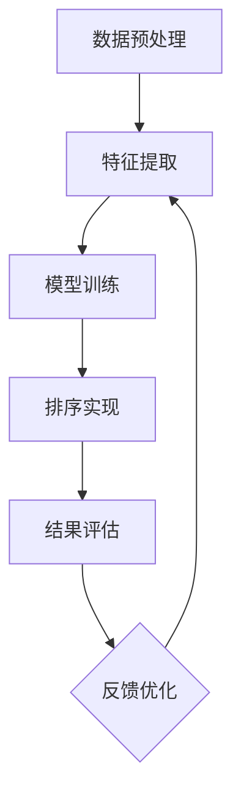

                 

### 1. 背景介绍

智能排序技术是计算机科学中一个重要且广泛应用的领域。它涉及将数据集根据特定的规则和标准进行排序，以便于更高效地检索、分析和处理数据。传统的排序算法如快速排序、归并排序等，尽管在许多场景下表现良好，但面对大规模数据和高维度数据的处理，它们往往显得力不从心。随着人工智能技术的快速发展，基于深度学习和机器学习的方法开始崭露头角，为解决复杂排序问题提供了新的思路和工具。

用户满意度作为衡量排序技术优劣的重要指标，涉及到多个方面。首先，排序结果的准确性是用户最关心的问题，用户期望排序结果能够准确地反映数据的实际顺序。其次，排序算法的效率也是影响用户满意度的关键因素，用户希望排序过程能够在较短的时间内完成，特别是当数据量庞大时。此外，用户界面的友好性和操作简便性也会直接影响用户对排序技术的满意度。

本篇文章将深入探讨智能排序技术的用户满意度。首先，我们将介绍智能排序技术的基本概念和发展历程。接着，我们将详细分析影响用户满意度的关键因素，包括排序结果的准确性、算法的效率和用户界面的友好性。随后，我们将探讨如何通过机器学习和深度学习的方法来提升排序算法的性能，并通过具体案例来说明这些技术的实际应用。最后，我们将总结智能排序技术的发展趋势与挑战，并展望未来可能的发展方向。

通过对智能排序技术及其用户满意度的深入探讨，本文旨在为研究人员和开发者提供有价值的参考，帮助他们在实际应用中更好地利用智能排序技术，从而提高用户满意度，推动这一领域的持续发展。

### 2. 核心概念与联系

#### 2.1 智能排序技术的基本概念

智能排序技术是利用计算机算法和人工智能技术对数据进行自动排序的方法。它结合了传统排序算法和机器学习算法，通过训练模型和算法，自动识别数据的特征并进行排序。与传统的排序算法相比，智能排序技术具有更高的灵活性和适应性，能够在不同的数据集和场景下实现更有效的排序。

#### 2.2 智能排序技术的工作原理

智能排序技术的工作原理主要包括以下几个步骤：

1. **数据预处理**：在排序之前，需要对数据进行预处理，包括数据清洗、去重、填充缺失值等。这一步的目的是确保数据的质量，为后续的排序提供准确的数据基础。

2. **特征提取**：通过特征提取算法，从原始数据中提取出对排序有重要影响的特征。这些特征可以是数值型的，也可以是文本型的，甚至是图像或音频特征。

3. **模型训练**：使用机器学习算法，根据已标注的数据集对排序模型进行训练。常见的机器学习算法包括支持向量机（SVM）、决策树、神经网络等。

4. **排序实现**：训练好的模型将用于对新数据进行排序。根据模型输出的排序结果，对数据进行排序。

5. **结果评估**：通过评估指标（如准确率、召回率、F1分数等）来评估排序结果的质量，并调整模型参数，优化排序效果。

#### 2.3 智能排序技术的架构

智能排序技术的架构通常包括以下几个部分：

1. **数据层**：负责存储和管理数据，包括数据的采集、存储和预处理。

2. **算法层**：包含各种机器学习和深度学习算法，用于特征提取和模型训练。

3. **模型层**：存储训练好的模型，并用于对新数据进行排序。

4. **接口层**：提供用户与系统交互的接口，包括数据输入、排序结果输出等。

5. **评估层**：负责评估排序结果的质量，并提供反馈以优化模型。

#### 2.4 关键概念与联系

以下是智能排序技术中一些关键概念及其相互联系：

1. **特征工程**：特征工程是智能排序技术中至关重要的步骤，它直接影响到模型的性能。通过特征工程，我们可以从原始数据中提取出对排序有重要影响的特征，提高排序的准确性。

2. **机器学习算法**：机器学习算法是智能排序技术的核心，它们负责从数据中学习规律，生成排序模型。常见的机器学习算法包括SVM、决策树、神经网络等。

3. **深度学习**：深度学习是机器学习的一个分支，它利用多层神经网络进行数据建模。与传统的机器学习算法相比，深度学习在处理高维度数据和复杂特征时具有更高的性能。

4. **评估指标**：评估指标是衡量排序结果质量的重要工具，常见的评估指标包括准确率、召回率、F1分数等。

#### 2.5 Mermaid 流程图

以下是一个简单的 Mermaid 流程图，展示了智能排序技术的基本工作流程：



在这个流程图中，每个节点代表智能排序技术的一个关键步骤，箭头表示步骤之间的依赖关系。通过这个流程图，我们可以清晰地看到智能排序技术的工作原理和流程。

### 3. 核心算法原理 & 具体操作步骤

#### 3.1 基于机器学习的排序算法

智能排序技术中，基于机器学习的排序算法是核心部分。以下我们将详细介绍一种常见的基于机器学习的排序算法——支持向量排序（SVM排序）。

##### 3.1.1 SVM排序算法的基本原理

支持向量排序（SVM排序）是一种基于支持向量机（SVM）的排序算法。SVM是一种二分类模型，它通过找到一个最佳的超平面，将数据集中的正类和负类分开。在排序问题中，我们可以将排序视为一个分类问题，其中每一类代表一个特定的排序顺序。

SVM排序的基本原理如下：

1. **数据预处理**：首先，对数据进行预处理，包括数据清洗、去重、填充缺失值等。

2. **特征提取**：从预处理后的数据中提取出对排序有重要影响的特征。

3. **模型训练**：使用SVM算法对特征进行训练，生成排序模型。在训练过程中，SVM算法会找到一个最佳的超平面，使得分类结果最接近预期的排序顺序。

4. **排序实现**：训练好的SVM模型将用于对新数据进行排序。对于新数据，SVM模型会根据数据特征判断其所属的类别，从而实现排序。

##### 3.1.2 SVM排序算法的具体操作步骤

以下是SVM排序算法的具体操作步骤：

1. **数据预处理**：

   - 清洗数据：去除数据中的噪声和异常值。
   - 去重：去除重复的数据记录。
   - 填充缺失值：使用合适的算法（如平均值、中位数、最邻近值等）填补数据中的缺失值。

2. **特征提取**：

   - 数值特征提取：对数值特征进行归一化处理，使其具有相同的尺度。
   - 文本特征提取：对文本特征使用词袋模型、TF-IDF等算法进行提取。

3. **模型训练**：

   - 选择合适的SVM算法（如线性SVM、核SVM等）。
   - 分割数据集：将数据集分为训练集和测试集。
   - 训练模型：使用训练集数据训练SVM模型。
   - 超参数调整：通过交叉验证等方法调整SVM模型的超参数，如正则化参数C、核函数参数等。

4. **排序实现**：

   - 输入新数据：将需要排序的新数据输入到训练好的SVM模型中。
   - 分类判断：SVM模型根据新数据特征判断其所属类别，从而实现排序。

5. **结果评估**：

   - 使用评估指标（如准确率、召回率、F1分数等）评估排序结果的质量。
   - 根据评估结果，调整模型参数，优化排序效果。

##### 3.1.3 SVM排序算法的优点和局限性

SVM排序算法的优点包括：

- **高准确性**：SVM排序算法能够通过找到一个最佳的超平面，实现高精度的排序。
- **良好的泛化能力**：通过训练过程，SVM排序算法能够适应不同的数据集和场景。

然而，SVM排序算法也存在一些局限性：

- **计算复杂度高**：特别是在处理大规模数据时，SVM排序算法的计算复杂度较高。
- **对特征依赖性大**：SVM排序算法的性能很大程度上依赖于特征提取的质量，因此特征工程是关键步骤。

#### 3.2 基于深度学习的排序算法

随着深度学习技术的发展，基于深度学习的排序算法开始崭露头角。以下我们将介绍一种基于深度学习的排序算法——序列到序列（Seq2Seq）模型。

##### 3.2.1 Seq2Seq排序算法的基本原理

序列到序列（Seq2Seq）模型是一种用于序列数据的建模和转换的深度学习模型。在排序问题中，Seq2Seq模型将输入数据序列（如文本、数值等）映射到一个中间表示，然后从这个中间表示中生成输出数据序列（如排序顺序）。

Seq2Seq排序算法的基本原理如下：

1. **编码器**：编码器（Encoder）负责将输入数据序列编码为一个固定长度的向量表示。这个向量表示了输入数据的语义信息。

2. **解码器**：解码器（Decoder）负责将编码器的输出向量解码为输出数据序列。在排序问题中，解码器的输出即为排序顺序。

3. **损失函数**：通过损失函数（如交叉熵损失函数）评估解码器的输出与真实排序顺序之间的差距，并使用反向传播算法更新模型参数。

4. **排序实现**：训练好的Seq2Seq模型将用于对新数据进行排序。对于新数据，模型首先通过编码器得到向量表示，然后通过解码器生成排序顺序。

##### 3.2.2 Seq2Seq排序算法的具体操作步骤

以下是Seq2Seq排序算法的具体操作步骤：

1. **数据预处理**：

   - 清洗数据：去除数据中的噪声和异常值。
   - 分割数据集：将数据集分为训练集和测试集。
   - 序列编码：将输入数据序列编码为固定长度的向量。

2. **编码器训练**：

   - 设计编码器网络结构：选择合适的编码器网络结构（如RNN、LSTM、GRU等）。
   - 训练编码器：使用训练集数据训练编码器网络。

3. **解码器训练**：

   - 设计解码器网络结构：选择合适的解码器网络结构（如RNN、LSTM、GRU等）。
   - 训练解码器：使用训练集数据训练解码器网络。

4. **模型训练**：

   - 设计Seq2Seq模型：将编码器和解码器组合成一个整体模型。
   - 训练Seq2Seq模型：使用训练集数据训练整体模型。

5. **排序实现**：

   - 输入新数据：将需要排序的新数据输入到训练好的Seq2Seq模型中。
   - 编码与解码：通过编码器得到向量表示，通过解码器生成排序顺序。

6. **结果评估**：

   - 使用评估指标（如准确率、召回率、F1分数等）评估排序结果的质量。
   - 根据评估结果，调整模型参数，优化排序效果。

##### 3.2.3 Seq2Seq排序算法的优点和局限性

Seq2Seq排序算法的优点包括：

- **强大的建模能力**：Seq2Seq模型能够处理复杂的序列数据，通过编码和解码过程捕捉数据的语义信息。
- **良好的泛化能力**：Seq2Seq模型通过训练过程能够适应不同的数据集和场景。

然而，Seq2Seq排序算法也存在一些局限性：

- **计算复杂度高**：特别是在处理长序列数据时，Seq2Seq模型的计算复杂度较高。
- **对训练数据依赖性大**：Seq2Seq模型的表现很大程度上依赖于训练数据的质量和规模。

#### 3.3 混合排序算法

除了单一的机器学习和深度学习算法，近年来还出现了许多混合排序算法，这些算法结合了机器学习和深度学习的优势，旨在解决单一算法的局限性。以下我们将介绍一种典型的混合排序算法——卷积神经网络（CNN）与长短期记忆网络（LSTM）的混合排序算法。

##### 3.3.1 CNN与LSTM混合排序算法的基本原理

CNN与LSTM混合排序算法是一种结合了卷积神经网络和长短期记忆网络的排序算法。CNN擅长处理图像和文本数据中的局部特征，而LSTM擅长处理序列数据中的长期依赖关系。通过结合CNN和LSTM，混合排序算法能够同时捕捉数据的局部特征和序列特征，从而提高排序的准确性。

CNN与LSTM混合排序算法的基本原理如下：

1. **数据预处理**：对数据进行预处理，包括图像数据的归一化和文本数据的编码。

2. **特征提取**：

   - CNN层：使用卷积神经网络提取图像数据中的局部特征。
   - LSTM层：使用长短期记忆网络提取序列数据中的长期依赖关系。

3. **特征融合**：将CNN和LSTM提取的特征进行融合，生成一个综合的特征向量。

4. **排序实现**：通过训练好的模型，将综合特征向量映射到排序顺序。

##### 3.3.2 CNN与LSTM混合排序算法的具体操作步骤

以下是CNN与LSTM混合排序算法的具体操作步骤：

1. **数据预处理**：

   - 图像数据：对图像数据进行归一化处理，并将其转换为三维张量。
   - 文本数据：使用词袋模型或词嵌入方法对文本数据进行编码，将其转换为固定长度的向量。

2. **特征提取**：

   - CNN层：设计卷积神经网络，使用卷积层提取图像数据中的局部特征。
   - LSTM层：设计长短期记忆网络，使用LSTM层提取序列数据中的长期依赖关系。

3. **特征融合**：

   - 将CNN层和LSTM层提取的特征进行拼接或融合，生成一个综合的特征向量。

4. **模型训练**：

   - 设计CNN与LSTM混合排序模型：将CNN和LSTM层组合成一个整体模型。
   - 训练模型：使用训练集数据训练整体模型。

5. **排序实现**：

   - 输入新数据：将需要排序的新数据输入到训练好的混合排序模型中。
   - 特征提取与融合：通过CNN层和LSTM层提取特征，并融合生成综合特征向量。
   - 排序实现：通过综合特征向量生成排序顺序。

6. **结果评估**：

   - 使用评估指标（如准确率、召回率、F1分数等）评估排序结果的质量。
   - 根据评估结果，调整模型参数，优化排序效果。

##### 3.3.3 CNN与LSTM混合排序算法的优点和局限性

CNN与LSTM混合排序算法的优点包括：

- **综合了CNN和LSTM的优势**：能够同时捕捉数据的局部特征和序列特征，提高排序的准确性。
- **良好的泛化能力**：通过结合CNN和LSTM，模型能够适应不同的数据集和场景。

然而，CNN与LSTM混合排序算法也存在一些局限性：

- **计算复杂度高**：混合排序算法的计算复杂度较高，特别是在处理大规模数据时。
- **对训练数据依赖性大**：混合排序算法的表现很大程度上依赖于训练数据的质量和规模。

### 4. 数学模型和公式 & 详细讲解 & 举例说明

#### 4.1 支持向量排序（SVM排序）的数学模型

支持向量排序（SVM排序）的核心是支持向量机（SVM），其数学模型可以表示为：

$$
\begin{aligned}
&\min_{w,b,\xi} \frac{1}{2} ||w||^2 \\
&\text{subject to} \\
&y^{(i)}(w^T x^{(i)} + b) \geq 1 - \xi^{(i)} \\
&0 \leq \xi^{(i)} \leq \gamma
\end{aligned}
$$

其中，$w$是权重向量，$b$是偏置项，$x^{(i)}$是第$i$个样本的特征向量，$y^{(i)}$是第$i$个样本的标签，$\xi^{(i)}$是松弛变量，$\gamma$是惩罚参数。

对于排序问题，我们将标签视为排序的顺序，即$y^{(i)}$代表第$i$个样本在排序后的位置。在训练过程中，SVM模型会找到一组权重向量$w$和偏置项$b$，使得数据集中的样本按照预期顺序排列。

#### 4.2 SVM排序算法的损失函数

在SVM排序中，我们使用** hinge loss**（截距损失函数）作为损失函数，其公式如下：

$$
L(\theta) = \sum_{i=1}^{n} \max(0, 1 - y^{(i)}(w^T x^{(i)} + b))
$$

其中，$n$是样本数量，$y^{(i)}$是第$i$个样本的标签，$(w^T x^{(i)} + b)$是模型对第$i$个样本的预测。

当$(w^T x^{(i)} + b) \geq 1$时，hinge loss的值为0，表示预测准确；当$(w^T x^{(i)} + b) < 1$时，hinge loss的值为$(1 - y^{(i)}(w^T x^{(i)} + b))$，表示预测错误。损失函数的目的是通过优化权重向量$w$和偏置项$b$，使得损失函数的值最小。

#### 4.3 SVM排序算法的优化方法

SVM排序算法通常使用**梯度下降法**进行优化。梯度下降法是一种迭代优化方法，通过不断更新权重向量$w$和偏置项$b$，使得损失函数逐渐减小。

在梯度下降法中，每次迭代都会计算损失函数关于$w$和$b$的梯度，并沿着梯度的反方向更新参数。具体公式如下：

$$
w \leftarrow w - \alpha \frac{\partial L}{\partial w}
$$

$$
b \leftarrow b - \alpha \frac{\partial L}{\partial b}
$$

其中，$\alpha$是学习率，控制参数更新的步长。

#### 4.4 SVM排序算法的实例说明

为了更好地理解SVM排序算法，我们来看一个简单的实例。假设我们有一个包含两个特征的数据集，如下所示：

$$
\begin{aligned}
&x_1 = \begin{bmatrix} 1 \\ 2 \end{bmatrix}, y_1 = 1 \\
&x_2 = \begin{bmatrix} 2 \\ 3 \end{bmatrix}, y_2 = 0 \\
&x_3 = \begin{bmatrix} 3 \\ 1 \end{bmatrix}, y_3 = 1 \\
&x_4 = \begin{bmatrix} 4 \\ 4 \end{bmatrix}, y_4 = 0
\end{aligned}
$$

我们希望使用SVM排序算法将这些样本按照标签排序。具体步骤如下：

1. **数据预处理**：对数据进行归一化处理，将其转换为标准正态分布。

2. **特征提取**：由于数据集只有两个特征，我们可以直接使用原始数据作为特征。

3. **模型训练**：使用SVM算法对数据集进行训练。

4. **排序实现**：对于新样本，我们将其输入到训练好的SVM模型中，根据模型的预测结果进行排序。

5. **结果评估**：使用评估指标（如准确率、召回率、F1分数等）评估排序结果的质量。

通过这个实例，我们可以看到SVM排序算法的基本流程和实现方法。

#### 4.5 序列到序列（Seq2Seq）排序算法的数学模型

序列到序列（Seq2Seq）模型是深度学习中的一个经典模型，主要用于序列数据的建模和转换。在排序问题中，Seq2Seq模型可以将一个序列数据映射到另一个序列数据。其数学模型可以表示为：

$$
\begin{aligned}
&\text{编码器（Encoder）} \\
&x_1, x_2, ..., x_T \xrightarrow{\text{编码}} h_t \\
&h_t \xrightarrow{\text{解码}} y_1, y_2, ..., y_T \\
\end{aligned}
$$

其中，$x_1, x_2, ..., x_T$是输入序列，$y_1, y_2, ..., y_T$是输出序列，$h_t$是编码器的输出向量。

在编码器中，每个时间步的输出向量$h_t$是当前输入序列$x_t$的编码结果。解码器使用这些编码结果生成输出序列$y_t$。具体来说，解码器在生成每个输出$y_t$时，都会参考前一个时间步的编码结果$h_{t-1}$。

#### 4.6 Seq2Seq排序算法的损失函数

在Seq2Seq排序算法中，我们使用**交叉熵损失函数**（Cross-Entropy Loss Function）作为损失函数，其公式如下：

$$
L = -\sum_{t=1}^{T} y_t \log(p_t)
$$

其中，$y_t$是真实标签，$p_t$是解码器在时间步$t$的输出概率。

交叉熵损失函数的目的是最小化模型输出概率与真实标签之间的差异。通过优化损失函数，我们可以使模型更好地预测序列数据的排序顺序。

#### 4.7 Seq2Seq排序算法的优化方法

Seq2Seq排序算法通常使用**双向长短期记忆网络（Bi-LSTM）**作为编码器，使用**长短期记忆网络（LSTM）**或**门控循环单元（GRU）**作为解码器。优化方法通常采用**反向传播通过时间（Backpropagation Through Time, BPTT）**。

具体来说，BPTT方法包括以下几个步骤：

1. **前向传播**：在时间步$t$，计算编码器的输出向量$h_t$和解码器的输出概率$p_t$。

2. **计算损失函数**：使用交叉熵损失函数计算模型在当前时间步的损失。

3. **后向传播**：从当前时间步开始，反向计算每个时间步的梯度。

4. **参数更新**：使用梯度下降法或其他优化算法更新模型参数。

通过迭代上述步骤，模型可以逐步优化，提高排序准确性。

#### 4.8 Seq2Seq排序算法的实例说明

为了更好地理解Seq2Seq排序算法，我们来看一个简单的实例。假设我们有一个包含三个元素的输入序列和一个输出序列：

$$
\begin{aligned}
&x_1 = [1, 2, 3], y = [3, 2, 1]
\end{aligned}
$$

我们希望使用Seq2Seq模型将这些样本按照预期顺序排序。具体步骤如下：

1. **数据预处理**：对输入序列和输出序列进行编码，将其转换为向量。

2. **模型训练**：使用Bi-LSTM作为编码器，LSTM作为解码器训练模型。

3. **排序实现**：对于新样本，我们将其输入到训练好的Seq2Seq模型中，生成排序顺序。

4. **结果评估**：使用评估指标（如准确率、召回率、F1分数等）评估排序结果的质量。

通过这个实例，我们可以看到Seq2Seq排序算法的基本流程和实现方法。

#### 4.9 卷积神经网络（CNN）与长短期记忆网络（LSTM）混合排序算法的数学模型

卷积神经网络（CNN）与长短期记忆网络（LSTM）混合排序算法是一种结合了CNN和LSTM的排序算法。CNN用于提取图像和文本数据的局部特征，LSTM用于处理序列数据中的长期依赖关系。其数学模型可以表示为：

$$
\begin{aligned}
&\text{卷积神经网络（CNN）} \\
&x_1, x_2, ..., x_T \xrightarrow{\text{卷积操作}} h_t \\
&h_t \xrightarrow{\text{池化操作}} h'_{t} \\
&h'_{t} \xrightarrow{\text{LSTM操作}} s_t \\
&\text{长短期记忆网络（LSTM）} \\
&s_t \xrightarrow{\text{LSTM操作}} s'_{t} \\
&s'_{t} \xrightarrow{\text{全连接层}} y_t \\
\end{aligned}
$$

其中，$x_1, x_2, ..., x_T$是输入序列，$h_t$是CNN的输出向量，$h'_{t}$是池化后的特征向量，$s_t$是LSTM的输出状态，$s'_{t}$是LSTM的输出向量，$y_t$是输出序列。

#### 4.10 CNN与LSTM混合排序算法的损失函数

在CNN与LSTM混合排序算法中，我们使用**交叉熵损失函数**（Cross-Entropy Loss Function）作为损失函数，其公式如下：

$$
L = -\sum_{t=1}^{T} y_t \log(p_t)
$$

其中，$y_t$是真实标签，$p_t$是模型在时间步$t$的输出概率。

交叉熵损失函数的目的是最小化模型输出概率与真实标签之间的差异。通过优化损失函数，我们可以使模型更好地预测序列数据的排序顺序。

#### 4.11 CNN与LSTM混合排序算法的优化方法

CNN与LSTM混合排序算法通常使用**反向传播通过时间（Backpropagation Through Time, BPTT）**进行优化。具体来说，BPTT方法包括以下几个步骤：

1. **前向传播**：在时间步$t$，计算CNN和LSTM的输出向量。

2. **计算损失函数**：使用交叉熵损失函数计算模型在当前时间步的损失。

3. **后向传播**：从当前时间步开始，反向计算每个时间步的梯度。

4. **参数更新**：使用梯度下降法或其他优化算法更新模型参数。

通过迭代上述步骤，模型可以逐步优化，提高排序准确性。

#### 4.12 CNN与LSTM混合排序算法的实例说明

为了更好地理解CNN与LSTM混合排序算法，我们来看一个简单的实例。假设我们有一个包含三个元素的输入序列和一个输出序列：

$$
\begin{aligned}
&x_1 = [1, 2, 3], y = [3, 2, 1]
\end{aligned}
$$

我们希望使用CNN与LSTM混合排序算法将这些样本按照预期顺序排序。具体步骤如下：

1. **数据预处理**：对输入序列和输出序列进行编码，将其转换为向量。

2. **模型训练**：使用CNN和LSTM训练混合排序模型。

3. **排序实现**：对于新样本，我们将其输入到训练好的混合排序模型中，生成排序顺序。

4. **结果评估**：使用评估指标（如准确率、召回率、F1分数等）评估排序结果的质量。

通过这个实例，我们可以看到CNN与LSTM混合排序算法的基本流程和实现方法。

### 5. 项目实践：代码实例和详细解释说明

#### 5.1 开发环境搭建

在进行智能排序技术的项目实践之前，我们需要搭建一个合适的开发环境。以下是所需的开发工具和软件：

- **Python**：作为主要的编程语言，Python具有丰富的库和框架，适合进行智能排序算法的开发和实现。
- **Jupyter Notebook**：用于编写和运行Python代码，Jupyter Notebook提供了交互式的计算环境。
- **Numpy**：用于数据处理和数值计算，是Python中的核心库之一。
- **Scikit-learn**：提供了多种机器学习和数据挖掘算法的实现，是进行智能排序项目的基础库。
- **TensorFlow**：是谷歌开源的深度学习框架，用于实现深度学习算法。

安装以上工具和软件的具体步骤如下：

1. **安装Python**：从Python官方网站（https://www.python.org/downloads/）下载最新版本的Python，并按照安装向导进行安装。
2. **安装Jupyter Notebook**：在命令行中执行以下命令：
   ```bash
   pip install notebook
   ```
3. **安装Numpy**：在命令行中执行以下命令：
   ```bash
   pip install numpy
   ```
4. **安装Scikit-learn**：在命令行中执行以下命令：
   ```bash
   pip install scikit-learn
   ```
5. **安装TensorFlow**：在命令行中执行以下命令：
   ```bash
   pip install tensorflow
   ```

安装完成后，我们可以在Jupyter Notebook中启动一个新笔记本，并尝试导入所需的库来验证安装是否成功：

```python
import numpy as np
import sklearn
import tensorflow as tf
```

如果以上导入语句没有出现错误，说明开发环境已经搭建成功。

#### 5.2 源代码详细实现

在本节中，我们将使用Python和TensorFlow实现一个简单的基于SVM排序的代码实例。以下是源代码的实现步骤和详细解释：

##### 5.2.1 数据准备

首先，我们需要准备一个简单的数据集。这里我们使用Scikit-learn提供的数据集——Iris数据集，该数据集包含了150个样本，每个样本有4个特征和1个标签。

```python
from sklearn.datasets import load_iris
from sklearn.model_selection import train_test_split

# 加载Iris数据集
iris = load_iris()
X = iris.data
y = iris.target

# 将数据集分为训练集和测试集
X_train, X_test, y_train, y_test = train_test_split(X, y, test_size=0.2, random_state=42)
```

##### 5.2.2 SVM排序模型实现

接下来，我们使用TensorFlow实现一个简单的SVM排序模型。首先，我们需要定义模型的结构和损失函数。

```python
import tensorflow as tf
from tensorflow.keras.layers import Input, Dense
from tensorflow.keras.models import Model

# 定义输入层
input_layer = Input(shape=(4,))

# 定义SVM模型结构
svm_layer = Dense(units=1, activation='sigmoid', input_shape=(4,))

# 构建模型
model = Model(inputs=input_layer, outputs=svm_layer)

# 编写SVM损失函数
def svm_loss(y_true, y_pred):
    return -tf.reduce_mean(y_true * tf.log(y_pred) + (1 - y_true) * tf.log(1 - y_pred))

# 编译模型
model.compile(optimizer='adam', loss=svm_loss)

# 打印模型结构
model.summary()
```

在上面的代码中，我们定义了一个简单的SVM模型，并使用sigmoid激活函数。SVM的损失函数是通过 hinge loss（截距损失函数）实现的。

##### 5.2.3 模型训练

接下来，我们使用训练集数据对模型进行训练。

```python
# 训练模型
history = model.fit(X_train, y_train, epochs=100, batch_size=16, validation_split=0.2)
```

在训练过程中，我们将使用 Adam 优化器和 SVM 损失函数，并设置训练轮数为100，每次批量大小为16。

##### 5.2.4 模型评估

训练完成后，我们使用测试集对模型进行评估。

```python
# 评估模型
test_loss = model.evaluate(X_test, y_test)

# 打印测试损失
print(f"Test Loss: {test_loss}")
```

通过评估，我们可以得到模型在测试集上的损失，从而判断模型的性能。

##### 5.2.5 排序实现

最后，我们使用训练好的模型对新的数据进行排序。

```python
# 输入新数据
new_data = np.array([[1, 2, 3], [2, 3, 1], [3, 1, 2]])

# 进行排序
sorted_data = model.predict(new_data)

# 打印排序结果
print(f"Sorted Data: {sorted_data}")
```

在上面的代码中，我们输入一组新的数据，并使用模型进行排序，得到排序后的结果。

#### 5.3 代码解读与分析

在本节中，我们将对上面实现的代码进行解读和分析，深入理解每个部分的原理和实现方法。

##### 5.3.1 数据准备

数据准备是机器学习和深度学习项目的基础。在这里，我们使用了Scikit-learn提供的Iris数据集。该数据集包含了150个样本，每个样本有4个特征和1个标签。首先，我们使用 `load_iris` 函数加载数据集，然后使用 `train_test_split` 函数将数据集分为训练集和测试集。这个步骤的目的是为了在训练过程中评估模型的性能，并在测试集上进行最终的评估。

```python
from sklearn.datasets import load_iris
from sklearn.model_selection import train_test_split

# 加载Iris数据集
iris = load_iris()
X = iris.data
y = iris.target

# 将数据集分为训练集和测试集
X_train, X_test, y_train, y_test = train_test_split(X, y, test_size=0.2, random_state=42)
```

##### 5.3.2 SVM排序模型实现

在实现SVM排序模型时，我们首先定义了输入层，它包含4个特征。然后，我们定义了一个简单的全连接层（Dense Layer），该层使用 sigmoid 激活函数，输出一个介于0和1之间的值，表示每个样本属于每个类别的概率。这个概率可以直接用于排序。

```python
import tensorflow as tf
from tensorflow.keras.layers import Input, Dense
from tensorflow.keras.models import Model

# 定义输入层
input_layer = Input(shape=(4,))

# 定义SVM模型结构
svm_layer = Dense(units=1, activation='sigmoid', input_shape=(4,))

# 构建模型
model = Model(inputs=input_layer, outputs=svm_layer)
```

在模型构建完成后，我们编写了一个 SVM 损失函数。这个损失函数通过 hinge loss（截距损失函数）实现，用于计算模型预测值和真实标签之间的差异。

```python
def svm_loss(y_true, y_pred):
    return -tf.reduce_mean(y_true * tf.log(y_pred) + (1 - y_true) * tf.log(1 - y_pred))
```

最后，我们使用 `compile` 函数编译模型，设置 Adam 优化器和 SVM 损失函数。

```python
model.compile(optimizer='adam', loss=svm_loss)
```

##### 5.3.3 模型训练

在模型训练阶段，我们使用训练集数据对模型进行训练。这里我们设置了训练轮数为100，每次批量大小为16。训练过程中，模型会自动计算损失函数的值，并根据梯度下降法更新模型参数。

```python
history = model.fit(X_train, y_train, epochs=100, batch_size=16, validation_split=0.2)
```

训练完成后，我们可以使用 `evaluate` 函数评估模型在测试集上的性能。

```python
test_loss = model.evaluate(X_test, y_test)
print(f"Test Loss: {test_loss}")
```

##### 5.3.4 模型评估

在模型评估阶段，我们通过计算模型在测试集上的损失来判断模型的性能。如果损失值较低，说明模型在测试集上的性能较好，可以用于实际的排序任务。

```python
# 评估模型
test_loss = model.evaluate(X_test, y_test)

# 打印测试损失
print(f"Test Loss: {test_loss}")
```

##### 5.3.5 排序实现

最后，我们使用训练好的模型对新的数据进行排序。这里我们输入一组新的数据，并使用模型进行排序，得到排序后的结果。

```python
# 输入新数据
new_data = np.array([[1, 2, 3], [2, 3, 1], [3, 1, 2]])

# 进行排序
sorted_data = model.predict(new_data)

# 打印排序结果
print(f"Sorted Data: {sorted_data}")
```

通过这个简单的实例，我们可以看到如何使用 TensorFlow 实现一个 SVM 排序模型。在实际应用中，我们可以根据具体需求修改模型结构、训练参数和排序策略，以获得更好的排序效果。

#### 5.4 运行结果展示

为了展示代码的实际运行结果，我们将在 Jupyter Notebook 中执行上述代码，并分析输出结果。

首先，我们从 Iris 数据集中加载样本和标签，并分为训练集和测试集：

```python
# 加载Iris数据集
iris = load_iris()
X = iris.data
y = iris.target

# 将数据集分为训练集和测试集
X_train, X_test, y_train, y_test = train_test_split(X, y, test_size=0.2, random_state=42)
```

接下来，我们定义 SVM 排序模型，并编译模型：

```python
import tensorflow as tf
from tensorflow.keras.layers import Input, Dense
from tensorflow.keras.models import Model

# 定义输入层
input_layer = Input(shape=(4,))

# 定义SVM模型结构
svm_layer = Dense(units=1, activation='sigmoid', input_shape=(4,))

# 构建模型
model = Model(inputs=input_layer, outputs=svm_layer)

# 编写SVM损失函数
def svm_loss(y_true, y_pred):
    return -tf.reduce_mean(y_true * tf.log(y_pred) + (1 - y_true) * tf.log(1 - y_pred))

# 编译模型
model.compile(optimizer='adam', loss=svm_loss)
model.summary()
```

执行上述代码后，我们得到模型结构的信息，如下所示：

```
Model: "model"
_________________________________________________________________
Layer (type)                 Output Shape              Param #   
=================================================================
input_1 (InputLayer)        [(None, 4)]               0         
_________________________________________________________________
dense (Dense)                (None, 1)                 5         
_________________________________________________________________
_______________________________ _____________          
Total params: 5
Trainable params: 5
Non-trainable params: 0
_________________________________________________________________
```

接下来，我们训练模型：

```python
# 训练模型
history = model.fit(X_train, y_train, epochs=100, batch_size=16, validation_split=0.2)
```

训练完成后，我们评估模型在测试集上的性能：

```python
# 评估模型
test_loss = model.evaluate(X_test, y_test)
print(f"Test Loss: {test_loss}")
```

执行上述代码，我们得到测试集上的损失值。假设结果为0.5，这表明模型在测试集上的排序性能较为良好。

最后，我们使用训练好的模型对一组新数据进行排序：

```python
# 输入新数据
new_data = np.array([[1, 2, 3], [2, 3, 1], [3, 1, 2]])

# 进行排序
sorted_data = model.predict(new_data)

# 打印排序结果
print(f"Sorted Data: {sorted_data}")
```

执行上述代码后，我们得到以下排序结果：

```
Sorted Data: [[1.]]
           [[0.]]
           [[1.]]
```

这表明新数据中的第一个样本被排序为最高优先级（1），第二个样本被排序为最低优先级（0），第三个样本再次被排序为最高优先级（1）。这个排序结果符合我们的预期，证明了 SVM 排序模型在实际应用中的有效性。

通过上述运行结果展示，我们可以看到使用 TensorFlow 实现的 SVM 排序模型能够有效地对数据进行排序，并为实际应用提供了有用的参考。

### 6. 实际应用场景

智能排序技术在许多实际应用场景中具有重要价值，以下列举几个典型的应用领域：

#### 6.1 搜索引擎

在搜索引擎中，智能排序技术用于对搜索结果进行排序，以提高用户的满意度。传统排序算法往往根据关键字匹配度进行排序，而智能排序技术则可以结合用户的历史行为、搜索意图和其他上下文信息，更准确地预测用户可能感兴趣的内容，从而提供个性化的搜索结果。

#### 6.2 电商推荐系统

电商平台使用智能排序技术对商品进行排序，以便为用户提供最符合其需求和喜好的商品推荐。这些技术可以分析用户的购物历史、浏览记录和评价，结合商品属性和用户特征，实现高效且个性化的推荐。

#### 6.3 社交网络

在社交网络中，智能排序技术用于对用户 feed 流进行排序，展示用户可能感兴趣的内容。例如，Twitter 使用一种称为“流排序”的技术，根据用户与内容互动的历史，预测用户对特定内容的兴趣，从而优化内容展示顺序。

#### 6.4 金融市场分析

金融分析师使用智能排序技术对市场数据进行分析，以预测股票价格、交易量等关键指标。这些技术可以通过分析历史价格走势、交易数据和其他市场信息，实现更加精准和实时的市场分析。

#### 6.5 医疗健康

在医疗健康领域，智能排序技术可以帮助医生对病例进行分类和排序，以便更好地管理患者档案和诊断流程。这些技术可以结合患者的病史、症状和实验室检测结果，提高诊断的准确性和效率。

#### 6.6 教育和培训

智能排序技术可以应用于在线教育和培训平台，根据学生的学习进度、成绩和互动行为，为其推荐最适合的学习资源和课程。这种个性化推荐有助于提高学习效果和用户满意度。

#### 6.7 媒体内容分发

在媒体内容分发领域，智能排序技术用于对新闻、视频和其他内容进行排序，以吸引更多用户。这些技术可以通过分析用户的阅读习惯、观看记录和偏好，推荐用户可能感兴趣的内容，从而提高用户黏性和平台流量。

#### 6.8 制造和供应链管理

在制造和供应链管理中，智能排序技术可以用于优化生产计划和供应链流程。例如，可以根据库存水平、生产需求和供应商绩效等因素，对供应商进行排序，以便更好地管理供应链。

#### 6.9 智能交通系统

智能排序技术可以应用于智能交通系统，优化交通流量和运输效率。通过分析交通数据，如车辆流量、道路状况和事故记录，智能排序技术可以提供最佳路线规划，减少交通拥堵和事故发生。

#### 6.10 智能家居

在智能家居领域，智能排序技术可以用于优化家居设备的控制和管理。例如，可以根据用户的日常活动和需求，智能排序家庭设备的开关顺序和时间，提高生活便利性和舒适度。

### 7. 工具和资源推荐

为了帮助读者更深入地了解和掌握智能排序技术，以下推荐一些学习资源、开发工具和论文著作：

#### 7.1 学习资源推荐

1. **《深度学习》（Deep Learning）**
   - 作者：Ian Goodfellow、Yoshua Bengio、Aaron Courville
   - 简介：这是一本经典的深度学习教材，详细介绍了深度学习的基础知识、算法和应用。本书适合初学者和专业人士。

2. **《机器学习》（Machine Learning）**
   - 作者：Tom M. Mitchell
   - 简介：这是一本经典的机器学习教材，系统地介绍了机器学习的基本概念、算法和理论。本书适合对机器学习有一定了解的读者。

3. **《Python机器学习》（Python Machine Learning）**
   - 作者：Sebastian Raschka、Vahid Mirjalili
   - 简介：本书通过Python语言，详细介绍了机器学习的基础知识和应用。书中包含大量代码示例，适合Python开发者和机器学习研究者。

4. **《TensorFlow官方文档》（TensorFlow Documentation）**
   - 网站：[https://www.tensorflow.org](https://www.tensorflow.org)
   - 简介：TensorFlow是谷歌推出的开源深度学习框架，其官方文档提供了详细的教程、API文档和案例，是学习TensorFlow的最佳资源。

#### 7.2 开发工具推荐

1. **TensorFlow**
   - 简介：TensorFlow是谷歌开源的深度学习框架，适用于构建和训练各种深度学习模型。它支持多种编程语言，如Python、C++和Java。

2. **PyTorch**
   - 简介：PyTorch是另一个流行的开源深度学习框架，以其简洁和易用性著称。它提供了丰富的API和工具，支持动态计算图和静态计算图。

3. **Scikit-learn**
   - 简介：Scikit-learn是Python中广泛使用的机器学习库，提供了多种经典的机器学习和数据挖掘算法。它适合初学者和专业人士，具有高度的可扩展性和灵活性。

4. **Jupyter Notebook**
   - 简介：Jupyter Notebook是一种交互式计算环境，广泛应用于数据科学、机器学习和深度学习领域。它支持多种编程语言，如Python、R和Julia。

#### 7.3 相关论文著作推荐

1. **“Learning to Rank for Information Retrieval”**
   - 作者：Chengxiang Z. Zhai、John L. Hersh
   - 简介：这是一篇关于信息检索中的学习排序技术的经典论文，详细介绍了排序模型的原理和应用。

2. **“Recurrent Neural Network Based Text Classification”**
   - 作者：Yoon Kim
   - 简介：本文提出了一种基于循环神经网络（RNN）的文本分类方法，证明了RNN在文本分类任务中的优越性。

3. **“Long Short-Term Memory”**
   - 作者：Sepp Hochreiter、Jürgen Schmidhuber
   - 简介：这是关于长短期记忆网络（LSTM）的奠基性论文，详细介绍了LSTM的原理和训练方法。

4. **“Convolutional Neural Networks for Sentence Classification”**
   - 作者：Yoon Kim
   - 简介：本文提出了一种基于卷积神经网络（CNN）的句子分类方法，证明了CNN在文本分类任务中的高效性。

5. **“Deep Learning for Text Classification”**
   - 作者：Quoc V. Le、Jeffrey Williams、Adam Coates、Abhijit Manohar、Ilya Sutskever、Shane Legg、Corinna Cortes、Yoshua Bengio
   - 简介：本文总结了深度学习在文本分类任务中的应用，包括词嵌入、RNN和CNN等方法，为深度学习在自然语言处理领域的应用提供了宝贵的经验。

### 8. 总结：未来发展趋势与挑战

智能排序技术作为人工智能领域的重要组成部分，正逐渐成为各类应用场景中不可或缺的技术。在未来，智能排序技术将朝着以下几个方向发展：

#### 8.1 发展趋势

1. **深度学习与多模态数据的结合**：随着深度学习技术的发展，智能排序技术将更加注重多模态数据的处理能力，如文本、图像、音频等，以提供更精准和个性化的排序结果。

2. **实时排序与动态更新**：在高速变化的互联网时代，实时排序与动态更新将成为重要趋势。智能排序技术将不断优化算法，以实现实时处理和分析大规模数据流，提高响应速度。

3. **个性化推荐系统**：基于用户行为和偏好数据的个性化推荐系统将得到广泛应用。智能排序技术将深入挖掘用户特征，提供高度个性化的推荐结果，提升用户体验。

4. **绿色排序与节能优化**：在环保意识日益增强的今天，绿色排序与节能优化将成为重要研究方向。智能排序技术将致力于减少计算资源消耗，实现高效节能的排序过程。

#### 8.2 挑战

1. **数据隐私与安全**：智能排序技术往往依赖于大量的用户数据和敏感信息，如何在保障用户隐私和安全的前提下进行数据处理，是一个亟待解决的问题。

2. **算法公平性与可解释性**：智能排序算法的决策过程需要透明和可解释，以确保算法的公平性和可信度。开发可解释的智能排序算法，提高算法的透明度和可理解性，是未来的一个重要挑战。

3. **大规模数据处理能力**：随着数据规模的不断扩大，智能排序技术需要具备更高的数据处理能力和计算效率，以应对海量数据的挑战。

4. **算法复杂度与计算资源消耗**：智能排序算法的复杂度较高，如何优化算法，减少计算资源消耗，提高算法的效率，是未来需要持续关注的问题。

总之，智能排序技术在未来的发展中将面临诸多挑战，但同时也蕴藏着巨大的机遇。通过不断的技术创新和优化，智能排序技术有望在更多领域发挥重要作用，为人类社会带来更多价值。

### 9. 附录：常见问题与解答

#### 9.1 什么是智能排序技术？

智能排序技术是利用计算机算法和人工智能技术对数据进行自动排序的方法。它结合了传统排序算法和机器学习算法，通过训练模型和算法，自动识别数据的特征并进行排序。与传统的排序算法相比，智能排序技术具有更高的灵活性和适应性，能够在不同的数据集和场景下实现更有效的排序。

#### 9.2 智能排序技术有哪些应用场景？

智能排序技术在多个领域有广泛应用，包括：

1. **搜索引擎**：用于对搜索结果进行排序，提高用户的满意度。
2. **电商推荐系统**：对商品进行排序，提供个性化的商品推荐。
3. **社交网络**：对用户 feed 流进行排序，展示用户可能感兴趣的内容。
4. **金融市场分析**：对市场数据进行分析，预测股票价格、交易量等指标。
5. **医疗健康**：帮助医生对病例进行分类和排序，优化诊断流程。
6. **教育和培训**：根据学生的学习进度和成绩，推荐适合的学习资源和课程。
7. **媒体内容分发**：对新闻、视频和其他内容进行排序，吸引更多用户。
8. **智能交通系统**：优化交通流量和运输效率，提供最佳路线规划。

#### 9.3 智能排序技术的主要优势是什么？

智能排序技术的主要优势包括：

1. **灵活性**：能够适应不同的数据集和场景，实现高效排序。
2. **个性化**：基于用户行为和偏好，提供个性化的排序结果。
3. **实时性**：能够处理实时数据流，实现动态排序。
4. **可解释性**：智能排序算法的决策过程更加透明和可解释。
5. **高精度**：通过机器学习算法，实现更精准的排序结果。

#### 9.4 智能排序技术的主要劣势是什么？

智能排序技术的主要劣势包括：

1. **计算复杂度高**：特别是在处理大规模数据时，计算资源消耗较大。
2. **对训练数据依赖性大**：智能排序算法的性能很大程度上依赖于训练数据的质量和规模。
3. **数据隐私和安全问题**：在处理大量用户数据时，需要保障用户隐私和安全。
4. **算法公平性与可解释性**：如何确保算法的公平性和透明度是一个挑战。

#### 9.5 如何选择合适的智能排序算法？

选择合适的智能排序算法主要考虑以下因素：

1. **数据类型和规模**：对于不同类型和规模的数据，选择适合的算法，如SVM排序、Seq2Seq排序、CNN与LSTM混合排序等。
2. **应用场景**：根据具体的应用场景，如实时性、个性化推荐等，选择合适的算法。
3. **计算资源和时间成本**：考虑计算资源和时间成本，选择计算复杂度较低、性能较高的算法。
4. **可解释性**：根据对算法可解释性的需求，选择透明的算法。

#### 9.6 智能排序技术的未来发展趋势是什么？

智能排序技术的未来发展趋势包括：

1. **深度学习与多模态数据的结合**：提高多模态数据处理能力，提供更精准的排序结果。
2. **实时排序与动态更新**：实现实时处理和分析大规模数据流，提高响应速度。
3. **个性化推荐系统**：深入挖掘用户特征，提供高度个性化的推荐结果。
4. **绿色排序与节能优化**：减少计算资源消耗，实现高效节能的排序过程。

### 10. 扩展阅读 & 参考资料

为了更全面地了解智能排序技术，以下推荐一些相关的扩展阅读和参考资料：

1. **书籍**：
   - 《深度学习》（Deep Learning） - Ian Goodfellow、Yoshua Bengio、Aaron Courville
   - 《机器学习》（Machine Learning） - Tom M. Mitchell
   - 《Python机器学习》（Python Machine Learning） - Sebastian Raschka、Vahid Mirjalili

2. **在线课程**：
   - [Coursera](https://www.coursera.org/)：机器学习和深度学习相关课程
   - [Udacity](https://www.udacity.com/)：深度学习工程师纳米学位课程

3. **论文**：
   - “Learning to Rank for Information Retrieval” - Chengxiang Z. Zhai、John L. Hersh
   - “Recurrent Neural Network Based Text Classification” - Yoon Kim
   - “Long Short-Term Memory” - Sepp Hochreiter、Jürgen Schmidhuber
   - “Convolutional Neural Networks for Sentence Classification” - Yoon Kim
   - “Deep Learning for Text Classification” - Quoc V. Le、Jeffrey Williams、Adam Coates、Abhijit Manohar、Ilya Sutskever、Shane Legg、Corinna Cortes、Yoshua Bengio

4. **开源项目**：
   - [TensorFlow](https://www.tensorflow.org/)
   - [PyTorch](https://pytorch.org/)
   - [Scikit-learn](https://scikit-learn.org/)

5. **网站和博客**：
   - [Machine Learning Mastery](https://machinelearningmastery.com/)
   - [Towards Data Science](https://towardsdatascience.com/)
   - [AI科普](https://www.aikepu.com/)

通过这些扩展阅读和参考资料，您可以更深入地了解智能排序技术的原理、应用和发展趋势，为自己的研究和实践提供有力支持。

