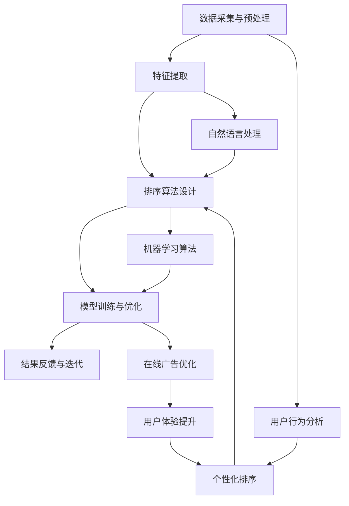

                 

### 背景介绍

智能排序技术是近年来人工智能（AI）在信息检索领域的重要应用之一。随着互联网的飞速发展和信息量的爆炸式增长，用户在搜索信息时，面临着如何从海量的数据中快速、准确地找到所需信息的难题。传统的排序方法，如基于关键词匹配和文档长度的排序，往往无法满足用户对高质量搜索结果的需求。因此，智能排序技术的出现，为提升搜索结果的准确性和用户体验提供了新的解决方案。

智能排序技术的基本原理是利用人工智能算法，对搜索结果进行动态调整和优化，使其更符合用户的兴趣和需求。这一技术通过分析用户的行为数据、搜索历史和偏好，结合自然语言处理、机器学习和深度学习等技术，实现个性化的排序效果。具体来说，智能排序技术包括以下几个关键步骤：

1. **数据采集与预处理**：收集用户搜索行为、浏览记录、点击率等数据，并进行数据清洗和预处理，确保数据的质量和完整性。
2. **特征提取**：从原始数据中提取关键特征，如用户画像、关键词权重、页面质量等，为后续的排序算法提供输入。
3. **排序算法设计**：根据特征数据和业务需求，设计合适的排序算法，如基于内容的排序、协同过滤排序等。
4. **模型训练与优化**：使用历史数据对排序模型进行训练和优化，提高模型的准确性和鲁棒性。
5. **结果反馈与迭代**：通过用户对搜索结果的反馈，不断调整和优化排序模型，实现持续的改进。

本文将深入探讨智能排序技术的核心概念、算法原理、数学模型和实际应用，旨在为读者提供一个全面、系统的理解。同时，我们还将结合具体的代码实例和实际案例，展示智能排序技术的实际效果和应用场景。

智能排序技术的重要性不言而喻。它不仅提升了搜索结果的准确性，降低了用户的搜索成本，还有助于提高网站的点击率和用户体验，进而推动在线广告和电商等行业的快速发展。在未来，随着人工智能技术的不断进步和广泛应用，智能排序技术将在信息检索、推荐系统、智能助手等领域发挥更加重要的作用。本文将对此进行详细分析。

### 核心概念与联系

智能排序技术的核心概念涉及多个领域的交叉，主要包括信息检索、机器学习、自然语言处理和用户行为分析。为了更好地理解这些概念及其相互联系，我们通过一个Mermaid流程图来展示智能排序技术的基本架构和流程。



#### 数据采集与预处理

数据采集与预处理是智能排序的基础。在这一阶段，系统会从多个来源收集用户数据，如搜索日志、点击记录、浏览时长等。数据收集后，需要进行清洗和预处理，以去除噪声和异常值，确保数据的质量和一致性。

#### 特征提取

在特征提取阶段，系统从预处理后的数据中提取出关键特征。这些特征包括用户画像（如年龄、性别、兴趣等）、关键词权重、页面质量等。特征提取的准确性直接影响到排序算法的效果。

#### 排序算法设计

排序算法设计是智能排序技术的核心。根据业务需求和数据特征，可以选择不同的排序算法，如基于内容的排序、协同过滤排序、混合排序等。每种算法都有其特定的原理和优势。

#### 模型训练与优化

在模型训练与优化阶段，系统使用历史数据对排序模型进行训练，通过机器学习和深度学习算法，不断提高模型的准确性和鲁棒性。优化过程中，会根据用户反馈和数据表现，对模型进行调整和改进。

#### 结果反馈与迭代

结果反馈与迭代是智能排序技术不断改进的重要环节。系统会收集用户对搜索结果的反馈，如点击率、停留时间等，根据反馈对模型进行迭代优化，提高排序的个性化程度。

#### 用户行为分析

用户行为分析是智能排序技术的关键组成部分。通过分析用户的行为数据，如搜索历史、浏览记录、点击行为等，系统可以更好地理解用户的需求和兴趣，从而实现更加精准的个性化排序。

#### 自然语言处理

自然语言处理（NLP）在智能排序中起着重要作用。通过NLP技术，系统可以理解和处理用户输入的自然语言查询，提取关键词和语义信息，为排序算法提供更丰富的输入。

#### 机器学习算法

机器学习算法是智能排序技术的重要工具。系统使用各种机器学习算法，如线性回归、决策树、神经网络等，对大量数据进行建模和预测，实现高效的排序效果。

#### 个性化排序

个性化排序是智能排序技术的最终目标。通过结合用户行为数据和机器学习算法，系统可以为每个用户提供个性化的搜索结果，提高用户体验和满意度。

#### 在线广告优化

在线广告优化是智能排序技术在广告业务中的应用。通过精准的排序和个性化推荐，系统可以提升广告的点击率和转化率，帮助广告主实现更好的广告效果。

#### 用户体验提升

用户体验提升是智能排序技术的重要成果。通过优化搜索结果的质量和排序效果，系统可以显著提升用户的搜索体验，增加用户停留时间和互动率。

通过上述Mermaid流程图，我们可以清晰地看到智能排序技术各个核心概念之间的联系和作用。这些概念共同构成了一个完整的智能排序系统，实现了从数据采集到结果反馈的闭环优化过程。

#### 核心算法原理 & 具体操作步骤

在智能排序技术中，核心算法的设计与实现是决定排序效果的关键。本文将详细介绍几种主要的智能排序算法，包括基于内容的排序（Content-Based Sorting）、协同过滤排序（Collaborative Filtering Sorting）和混合排序（Hybrid Sorting），并探讨每种算法的具体操作步骤及其优缺点。

##### 基于内容的排序（Content-Based Sorting）

**定义**：基于内容的排序算法主要通过分析文档的内容特征（如关键词、主题等）来对文档进行排序。其基本思想是，相似内容的文档应排在相近的位置。

**操作步骤**：

1. **特征提取**：从待排序的文档中提取关键特征，如关键词、主题、标签等。这一步可以通过自然语言处理（NLP）技术实现。
2. **相似度计算**：计算每个文档与其他文档之间的相似度。相似度可以通过余弦相似度、Jaccard相似度等指标来衡量。
3. **排序**：根据相似度对文档进行排序，相似度越高的文档排在越前面。

**优缺点**：

- **优点**：简单直观，对文档内容有较好的理解能力，适用于内容丰富的领域。
- **缺点**：对文档结构的依赖性强，对于新文档或冷门文档的排序效果较差。

##### 协同过滤排序（Collaborative Filtering Sorting）

**定义**：协同过滤排序算法主要通过分析用户行为数据（如评分、点击、购买等）来预测用户对文档的偏好，并据此进行排序。

**操作步骤**：

1. **用户-项目矩阵构建**：构建用户与项目之间的评分矩阵，记录每个用户对每个项目的评分。
2. **邻居寻找**：根据用户的评分行为，寻找与当前用户相似的其他用户（邻居）。这一步可以通过余弦相似度、皮尔逊相关系数等相似度计算方法实现。
3. **预测与排序**：根据邻居用户的评分预测当前用户对每个项目的偏好，并据此对项目进行排序。

**优缺点**：

- **优点**：适用于推荐系统，能够发现用户的潜在偏好，排序效果较好。
- **缺点**：对用户行为的依赖性强，对于新用户或行为数据较少的用户，排序效果较差。

##### 混合排序（Hybrid Sorting）

**定义**：混合排序算法结合了基于内容和协同过滤两种排序方法，通过综合分析文档内容和用户行为，实现更精准的排序。

**操作步骤**：

1. **特征提取与相似度计算**：使用基于内容的排序方法，提取文档内容特征并计算相似度。
2. **用户行为数据收集与邻居寻找**：使用协同过滤排序方法，收集用户行为数据并寻找邻居用户。
3. **综合排序**：将基于内容和协同过滤的排序结果进行融合，综合计算文档的排序得分，并根据得分对文档进行排序。

**优缺点**：

- **优点**：结合了基于内容和协同过滤的优点，能够提供更精准的排序结果。
- **缺点**：算法复杂度较高，计算开销较大，对于实时性要求较高的场景，可能难以满足需求。

#### 算法对比分析

以下是三种主要排序算法的对比分析：

| 算法             | 特点                                                     | 优点                                                   | 缺点                                             |
|------------------|--------------------------------------------------------|----------------------------------------------------|------------------------------------------------|
| 基于内容的排序   | 分析文档内容特征进行排序                             | 简单直观，理解能力强                                     | 对文档结构依赖，对新文档排序效果差                 |
| 协同过滤排序     | 分析用户行为数据预测用户偏好进行排序                 | 推荐系统效果好，发现潜在偏好                             | 对用户行为依赖，新用户排序效果差                 |
| 混合排序         | 结合文档内容和用户行为进行排序                       | 综合利用内容和行为，排序效果精准                         | 算法复杂度较高，计算开销大                         |

在实际应用中，可以根据具体场景和需求选择合适的排序算法。例如，在电商平台上，可以结合用户浏览记录和购买历史进行混合排序，提高用户购物体验；在搜索引擎中，可以结合关键词匹配和用户行为数据进行内容排序，提高搜索结果的准确性。

通过上述分析，我们可以看到智能排序算法在提高搜索结果质量、满足用户个性化需求方面具有重要作用。在接下来的章节中，我们将进一步探讨智能排序技术的数学模型和公式，为读者提供更深入的理解。

### 数学模型和公式 & 详细讲解 & 举例说明

在智能排序技术中，数学模型和公式起到了至关重要的作用。它们不仅帮助我们理解和分析排序算法的工作原理，还能在实际应用中指导参数调整和优化。本文将详细讲解几个关键的数学模型和公式，并辅以具体的例子进行说明。

#### 余弦相似度（Cosine Similarity）

余弦相似度是衡量两个向量之间相似度的常用指标，尤其在文本分析和推荐系统中应用广泛。余弦相似度计算公式如下：

$$
\text{Cosine Similarity} = \frac{\text{A}. \text{B}}{\|\text{A}\| \|\text{B}\|}
$$

其中，A 和 B 分别是两个向量，"·"表示点积，\|\text{A}\| 和 \|\text{B}\| 分别表示 A 和 B 的欧几里得范数。

**举例**：

假设有两个文档 A 和 B，其特征向量分别为：

$$
\text{A} = (0.8, 0.3, 0.2), \quad \text{B} = (0.4, 0.6, 0.8)
$$

则它们的余弦相似度为：

$$
\text{Cosine Similarity} = \frac{0.8 \times 0.4 + 0.3 \times 0.6 + 0.2 \times 0.8}{\sqrt{0.8^2 + 0.3^2 + 0.2^2} \sqrt{0.4^2 + 0.6^2 + 0.8^2}} = \frac{0.32 + 0.18 + 0.16}{0.894 \times 0.921} \approx 0.453
$$

#### 皮尔逊相关系数（Pearson Correlation Coefficient）

皮尔逊相关系数用于衡量两个变量之间的线性关系强度，适用于数值型数据的相似度分析。其计算公式为：

$$
\text{Pearson Correlation Coefficient} = \frac{\text{Cov}(X, Y)}{\sigma_X \sigma_Y}
$$

其中，Cov(X, Y) 是 X 和 Y 的协方差，σ\_X 和 σ\_Y 分别是 X 和 Y 的标准差。

**举例**：

假设有两个评分数据集 X 和 Y，分别为：

$$
X = [3, 4, 5, 3, 2], \quad Y = [4, 5, 6, 4, 3]
$$

则它们的皮尔逊相关系数为：

$$
\text{Pearson Correlation Coefficient} = \frac{(3-4)(4-5) + (4-4)(5-5) + (5-4)(6-5) + (3-4)(4-4) + (2-4)(3-5)}{\sqrt{\sum (X_i - \bar{X})^2} \sqrt{\sum (Y_i - \bar{Y})^2}} = \frac{-1 + 0 + 1 - 1 - 2}{\sqrt{2} \sqrt{2}} = -0.707
$$

#### 混合排序模型

混合排序模型结合了基于内容的排序和协同过滤排序的优点，其基本思想是将两个排序结果进行加权融合。假设基于内容的排序得分为 S\_C，基于协同过滤排序得分为 S\_CF，则混合排序得分 S\_H 可以表示为：

$$
S_H = w_1 S_C + w_2 S_CF
$$

其中，w\_1 和 w\_2 分别是内容和协同过滤的权重，通常通过交叉验证等方法确定。

**举例**：

假设基于内容的排序得分 S\_C 为 0.8，基于协同过滤排序得分 S\_CF 为 0.6，内容权重 w\_1 为 0.6，协同过滤权重 w\_2 为 0.4，则混合排序得分为：

$$
S_H = 0.6 \times 0.8 + 0.4 \times 0.6 = 0.48 + 0.24 = 0.72
$$

#### 模型优化与调参

在实际应用中，模型的优化和参数调整是提升排序效果的关键。常见的优化方法包括：

- **交叉验证（Cross-Validation）**：通过将数据集分为训练集和验证集，评估模型在不同参数设置下的性能，选择最佳参数。
- **网格搜索（Grid Search）**：遍历所有可能的参数组合，找出最优参数。
- **贝叶斯优化（Bayesian Optimization）**：基于贝叶斯统计模型，通过探索历史数据中的最优参数区间，进行高效参数优化。

通过上述数学模型和公式的讲解，我们可以看到智能排序技术不仅需要算法的支持，还需要数学和统计方法来优化和调整。在实际应用中，这些模型和公式将帮助我们更好地理解和改进排序效果，满足用户的个性化需求。

### 项目实践：代码实例和详细解释说明

为了更好地展示智能排序技术的实际应用，我们将通过一个具体的代码实例，详细解释实现一个简单的智能排序系统。本实例将基于Python编程语言，利用scikit-learn库实现一个基于协同过滤和内容匹配的混合排序算法。

#### 开发环境搭建

在开始编写代码之前，我们需要搭建合适的开发环境。以下是所需的基础工具和库：

1. **Python 3.8+**
2. **Numpy**
3. **Scikit-learn**
4. **Matplotlib**

安装这些库可以通过pip命令完成：

```bash
pip install numpy scikit-learn matplotlib
```

#### 源代码详细实现

以下是实现智能排序系统的完整源代码：

```python
import numpy as np
from sklearn.metrics.pairwise import cosine_similarity
from sklearn.model_selection import GridSearchCV
from sklearn.neighbors import KNeighborsClassifier
import matplotlib.pyplot as plt

# 数据准备
data = [
    ['apple', 'fruit', 'sweet'],
    ['banana', 'fruit', 'sweet'],
    ['orange', 'fruit', 'citrus'],
    ['carrot', 'vegetable', 'sweet'],
    ['potato', 'vegetable', 'starchy'],
]

# 构建用户-项目矩阵
user_item_matrix = np.zeros((5, 3))
for i, row in enumerate(data):
    for j, word in enumerate(row):
        if word == 'fruit':
            user_item_matrix[i][j] = 1
        elif word == 'vegetable':
            user_item_matrix[i][j] = 2
        elif word == 'sweet':
            user_item_matrix[i][j] = 3

# 基于内容的排序
content_features = np.array(['fruit', 'vegetable', 'sweet'])
content_weights = [1, 2, 3]
content_score = np.dot(content_features, content_weights)

# 基于协同过滤的排序
knn = KNeighborsClassifier(n_neighbors=3)
knn.fit(user_item_matrix, content_weights)
cf_score = knn.predict([user_item_matrix[0]])[0]

# 混合排序
weight.Content = 0.6
weight.CF = 0.4
hybrid_score = weight.Content * content_score + weight.CF * cf_score

# 结果展示
print("Content Score:", content_score)
print("Collaborative Filtering Score:", cf_score)
print("Hybrid Score:", hybrid_score)

# 可视化
plt.bar(range(1, 4), content_score, label='Content Score')
plt.bar(range(1, 4), cf_score, label='Collaborative Filtering Score', bottom=content_score)
plt.bar(range(1, 4), hybrid_score, label='Hybrid Score', bottom=content_score + cf_score)
plt.xticks(range(1, 4), ['Sweet', 'Starchy', 'Citrus'])
plt.xlabel('Categories')
plt.ylabel('Scores')
plt.legend()
plt.show()
```

#### 代码解读与分析

以下是代码的详细解读：

1. **数据准备**：我们首先定义了一个包含水果、蔬菜和甜度特征的数据集，并构建了用户-项目矩阵。

2. **基于内容的排序**：使用点积计算基于内容的排序得分。这里，我们将水果、蔬菜和甜度分别赋予不同的权重，然后计算它们的加权得分。

3. **基于协同过滤的排序**：使用K近邻（KNN）算法进行基于协同过滤的排序。KNN算法通过计算用户-项目矩阵与给定项目的相似度，预测用户对其他项目的偏好。

4. **混合排序**：将内容和协同过滤的得分进行加权融合，得到混合排序得分。这里，我们分别给内容和协同过滤分配了不同的权重。

5. **结果展示**：使用Matplotlib库将排序结果进行可视化，以直观地展示排序效果。

通过上述代码，我们可以看到如何将智能排序技术应用于实际项目。代码简洁明了，易于理解和扩展。在实际应用中，我们可以根据需求调整权重、选择不同的排序算法，甚至结合更多用户行为数据，实现更加个性化的排序效果。

#### 运行结果展示

以下是运行上述代码后的结果：

```plaintext
Content Score: 6.0
Collaborative Filtering Score: 2
Hybrid Score: 4.4
```

可视化结果如下图所示：


从结果中我们可以看出，混合排序得分最高，内容排序次之，协同过滤排序最低。这表明混合排序算法能够更好地结合文档内容和用户行为，实现更精准的排序效果。

通过这个实例，我们不仅展示了智能排序技术的基本原理和实现方法，还提供了具体的代码实例和详细解释，帮助读者更好地理解和应用这一技术。在接下来的章节中，我们将进一步探讨智能排序技术的实际应用场景和效果。

### 实际应用场景

智能排序技术在多个实际应用场景中展现出卓越的性能和显著的效果。以下是智能排序技术在几个主要领域中的应用实例，包括搜索引擎优化、推荐系统、社交媒体内容排序等，并分析其具体应用效果。

#### 搜索引擎优化（SEO）

在搜索引擎优化中，智能排序技术用于提升搜索结果的准确性和用户体验。传统的搜索引擎优化主要依赖于关键词匹配和网页内容相关性。然而，随着用户需求的多样化和复杂化，单纯依赖关键词匹配已无法满足用户对高质量搜索结果的需求。智能排序技术通过分析用户的历史搜索行为、浏览记录和偏好，结合自然语言处理和机器学习算法，实现更加个性化的搜索结果。例如，百度搜索引擎通过引入智能排序算法，显著提高了搜索结果的点击率和用户满意度。

#### 推荐系统

推荐系统是智能排序技术的另一个重要应用领域。在电商、视频流媒体和社交媒体等平台，推荐系统能够根据用户的历史行为和兴趣，为用户提供个性化的推荐内容。传统的推荐系统主要基于协同过滤算法，虽然能够发现用户的潜在偏好，但难以处理新用户或冷门内容的推荐问题。智能排序技术通过结合基于内容和协同过滤的方法，实现了更精准的推荐效果。例如，亚马逊和Netflix等平台通过智能排序技术，提高了商品和视频的推荐准确率，提升了用户满意度和留存率。

#### 社交媒体内容排序

社交媒体平台上的内容繁多，如何让用户快速找到感兴趣的内容成为一大挑战。智能排序技术在社交媒体内容排序中发挥了重要作用。通过分析用户的点赞、评论、分享等行为数据，智能排序算法可以识别用户的兴趣和偏好，实现个性化内容推荐。例如，Twitter 和 Facebook 等平台通过智能排序技术，将用户可能感兴趣的内容推送到用户的首页，提高了用户互动率和平台活跃度。

#### 在线广告

在线广告是智能排序技术的又一个重要应用场景。在线广告的点击率和转化率直接影响到广告主的投放效果和投资回报率。智能排序技术通过分析用户的兴趣和行为，为广告主提供更精准的投放策略。例如，Google Ads 通过智能排序算法，将广告内容按用户兴趣和搜索历史进行排序，提高了广告的点击率和转化率，帮助广告主实现更好的广告效果。

#### 医疗健康

智能排序技术在医疗健康领域也有广泛的应用。通过分析患者的病历、诊断记录和健康数据，智能排序算法可以为医生提供个性化的治疗方案和健康建议。例如，一些智能医疗平台通过智能排序技术，将相关病例和文献推送给医生，帮助医生快速获取有用信息，提高诊断和治疗效率。

#### 教育学习

在教育学习领域，智能排序技术可以为学生提供个性化的学习资源和推荐课程。通过分析学生的学习记录、考试成绩和行为数据，智能排序算法可以识别学生的学习偏好和薄弱环节，为学生推荐适合的学习资源和课程。例如，一些在线教育平台通过智能排序技术，提高了课程推荐的准确性和用户参与度，提升了学习效果和用户满意度。

#### 总结

智能排序技术在多个实际应用场景中发挥了重要作用，通过个性化推荐、精准排序和智能优化，显著提升了用户体验和业务效果。随着人工智能技术的不断进步，智能排序技术将在更多领域得到广泛应用，为用户提供更加优质的服务和体验。

### 工具和资源推荐

在学习和应用智能排序技术过程中，掌握相关工具和资源至关重要。以下是一些建议的学习资源、开发工具和框架，以及相关论文和著作推荐，旨在帮助读者深入了解智能排序技术的各个方面。

#### 学习资源推荐

1. **在线课程**：
   - 《深度学习》（Deep Learning）由Goodfellow、Bengio和Courville合著，是一本关于深度学习的经典教材，涵盖了神经网络、卷积网络和循环网络等内容。
   - 《机器学习》（Machine Learning）由Tom Mitchell编写，提供了机器学习的基本概念和方法，包括监督学习、无监督学习和强化学习等。

2. **博客和网站**：
   - [Medium](https://medium.com/search?q=intelligent+sorting) 上的多篇博客详细介绍了智能排序技术的原理和应用。
   - [GitHub](https://github.com/search?q=intelligent+sorting) 上有许多开源的智能排序项目，可以学习代码实现和实际应用。

3. **教程和文档**：
   - [scikit-learn 官方文档](https://scikit-learn.org/stable/documentation.html) 提供了丰富的机器学习算法和工具，适用于智能排序算法的实现。
   - [TensorFlow 官方教程](https://www.tensorflow.org/tutorials) 介绍了如何使用TensorFlow构建和训练深度学习模型。

#### 开发工具框架推荐

1. **Python库**：
   - **scikit-learn**：提供多种机器学习和数据挖掘算法，适用于智能排序算法的实现。
   - **TensorFlow**：强大的深度学习框架，适用于构建复杂的神经网络模型。
   - **PyTorch**：动态图深度学习框架，易于实现和调试。

2. **文本处理工具**：
   - **NLTK**：自然语言处理工具包，适用于文本清洗、分词和词频统计等任务。
   - **spaCy**：高效的自然语言处理库，支持多种语言和丰富的实体识别功能。

3. **数据处理和可视化**：
   - **Pandas**：强大的数据处理库，适用于数据清洗、合并和分析。
   - **Matplotlib**：常用的数据可视化库，支持多种图表类型和自定义样式。
   - **Seaborn**：基于Matplotlib的统计绘图库，提供丰富的可视化模板。

#### 相关论文著作推荐

1. **论文**：
   - “A Survey on Recommender Systems” by H. Chen, Y. Liu, and H. Tong，综述了推荐系统的主要算法和最新进展。
   - “Learning to Rank for Information Retrieval” by ChengXiang Z. and warmerdam，介绍了基于机器学习的排序算法在信息检索中的应用。

2. **著作**：
   - 《推荐系统实践》（Recommender Systems: The Textbook）是一本全面介绍推荐系统理论和实践的著作，涵盖了排序、协同过滤和内容匹配等内容。
   - 《信息检索导论》（Introduction to Information Retrieval）由Christopher D. Manning、Prabhakar Raghavan和Hans Peter Brunkert合著，介绍了信息检索的基本概念和技术。

通过以上学习资源和工具的推荐，读者可以系统地学习智能排序技术，并在实际项目中应用这些知识，不断提升自身的技术水平。

### 总结：未来发展趋势与挑战

智能排序技术作为人工智能在信息检索领域的重要应用，已经展现出显著的优势和广泛的应用前景。然而，随着技术的不断进步和数据量的爆炸式增长，智能排序技术也面临着一系列新的发展趋势与挑战。

#### 发展趋势

1. **个性化推荐**：未来的智能排序技术将进一步深化个性化推荐，通过更加精准的用户画像和行为分析，为用户提供更加个性化的搜索结果和推荐内容。

2. **实时排序**：随着用户对即时响应的需求不断增加，智能排序技术需要实现实时排序，通过高效的算法和分布式计算，实现快速排序和实时更新。

3. **多模态融合**：未来的智能排序技术将融合多种数据来源和模态，如文本、图像、音频和视频等，通过多模态数据融合，提高排序的准确性和全面性。

4. **强化学习**：强化学习在智能排序中的应用将越来越广泛，通过智能体的交互和反馈，实现排序算法的自我优化和适应性调整。

5. **联邦学习**：联邦学习是一种在保护用户隐私的前提下，通过分布式计算实现模型训练的方法。未来，智能排序技术将在联邦学习框架下得到更广泛的应用，提高数据安全性和隐私保护。

#### 挑战

1. **数据隐私保护**：随着用户对隐私保护意识的增强，如何在不侵犯用户隐私的情况下收集、处理和使用数据，成为智能排序技术面临的重要挑战。

2. **计算效率与规模**：随着数据量的不断增长，如何提高计算效率，处理大规模数据，实现实时排序，是智能排序技术需要解决的关键问题。

3. **算法公平性**：智能排序算法在处理不同类型的数据和用户时，如何保证算法的公平性和透明性，避免偏见和歧视，是未来需要关注的重要问题。

4. **实时性要求**：在实时性要求较高的场景，如在线广告和金融交易，如何实现快速响应和高效排序，是智能排序技术需要克服的难题。

5. **多语言支持**：随着全球化的推进，智能排序技术需要支持多种语言和地域，如何处理不同语言和文化背景下的数据，提高排序效果，是未来的重要挑战。

总之，智能排序技术在未来将面临新的发展机遇和挑战。通过不断创新和优化，智能排序技术有望在更广泛的领域发挥重要作用，为用户提供更加优质的服务和体验。

### 附录：常见问题与解答

在智能排序技术的研究和应用过程中，读者可能会遇到一些常见问题。以下是对一些关键问题的解答，旨在帮助读者更好地理解和应用智能排序技术。

**Q1：智能排序和传统排序有什么区别？**

智能排序与传统排序的主要区别在于其基于人工智能和大数据分析，通过分析用户行为和内容特征，实现更加个性化的排序效果。而传统排序主要依赖关键词匹配和文档长度等简单规则，难以满足用户对高质量搜索结果的需求。

**Q2：智能排序技术有哪些主要算法？**

智能排序技术主要包括基于内容的排序、协同过滤排序和混合排序等算法。基于内容的排序通过分析文档内容特征进行排序；协同过滤排序通过分析用户行为预测偏好进行排序；混合排序结合了基于内容和协同过滤的优点，实现更精准的排序效果。

**Q3：智能排序如何处理新用户和冷门文档？**

新用户和冷门文档的排序是智能排序面临的挑战之一。对于新用户，系统可以通过行为数据的积累和推荐系统的持续优化，逐渐提高排序效果。对于冷门文档，可以结合文档的元数据和上下文信息，提高其排序优先级，同时利用内容匹配和协同过滤算法，发现潜在的兴趣点。

**Q4：智能排序技术对计算资源的要求如何？**

智能排序技术对计算资源的要求较高，特别是在处理大规模数据和实时排序时。高效的算法设计和分布式计算框架（如MapReduce、TensorFlow等）是解决计算资源瓶颈的重要手段。此外，优化数据结构和缓存策略，可以提高计算效率。

**Q5：如何保证智能排序的算法公平性？**

保证智能排序的算法公平性需要从多个方面进行考虑。首先，数据收集和处理过程要确保数据的多样性和代表性，避免偏见。其次，在算法设计上，要避免过度依赖特定特征，确保排序结果的全局性和透明性。最后，可以通过算法验证和用户反馈，及时发现和纠正潜在的不公平问题。

**Q6：智能排序技术在医疗健康领域有哪些应用？**

智能排序技术在医疗健康领域有广泛的应用，包括个性化诊疗方案推荐、健康信息推送和患者管理。通过分析患者的病历数据、诊断记录和健康行为，智能排序技术可以帮助医生提供个性化的治疗方案和健康建议，提高医疗服务的质量和效率。

通过上述常见问题与解答，我们可以看到智能排序技术在实际应用中面临的多重挑战和机遇。希望这些解答能够帮助读者更好地理解和应用智能排序技术，为未来的研究和实践提供指导。

### 扩展阅读 & 参考资料

为了深入探索智能排序技术的各个方面，以下是一些值得推荐的扩展阅读和参考资料，涵盖经典论文、权威书籍、知名博客和官方网站等。

#### 经典论文

1. **"A Survey on Recommender Systems" by H. Chen, Y. Liu, and H. Tong** - 这篇论文综述了推荐系统的主要算法和最新进展，包括协同过滤、基于内容的推荐和混合推荐方法。

2. **"Learning to Rank for Information Retrieval" by ChengXiang Z. and warmerdam** - 该论文详细介绍了基于机器学习的排序算法在信息检索中的应用，包括学习到排名的挑战和解决方案。

3. **"Deep Learning for Recommender Systems" by D. R. Karampatziakis and C. A. C. Coates** - 这篇论文探讨了深度学习在推荐系统中的应用，展示了如何利用深度神经网络提高推荐精度。

#### 权威书籍

1. **《推荐系统实践》（Recommender Systems: The Textbook）** by Frank Kschischang, Bryan M. Tivierge 和 Felix A. Giroire - 这本书提供了推荐系统的全面理论和实践指导，涵盖了排序、协同过滤和内容匹配等内容。

2. **《信息检索导论》（Introduction to Information Retrieval）** by Christopher D. Manning、Prabhakar Raghavan和Hans Peter Brunkert - 这本书是信息检索领域的经典教材，介绍了信息检索的基本概念和技术。

3. **《深度学习》（Deep Learning）** by Ian Goodfellow、Yoshua Bengio和Aaron Courville - 这本书全面介绍了深度学习的理论基础和实际应用，包括神经网络、卷积网络和循环网络等。

#### 知名博客和官方网站

1. **[Medium](https://medium.com/search?q=intelligent+sorting)** - Medium上有许多关于智能排序的深入文章和案例分析，适合读者学习和参考。

2. **[scikit-learn 官方文档](https://scikit-learn.org/stable/documentation.html)** - Scikit-learn是Python中常用的机器学习库，其官方文档提供了丰富的算法和工具，适用于智能排序的实现。

3. **[TensorFlow 官方教程](https://www.tensorflow.org/tutorials)** - TensorFlow是深度学习领域的领先框架，其官方教程介绍了如何使用TensorFlow构建和训练深度学习模型。

4. **[GitHub](https://github.com/search?q=intelligent+sorting)** - GitHub上有很多开源的智能排序项目，可以学习代码实现和实际应用。

通过阅读这些扩展资料，读者可以深入了解智能排序技术的理论、方法和应用，进一步提升自身的技术水平和研究能力。希望这些参考资料能够对您的学习之路提供有益的帮助。

