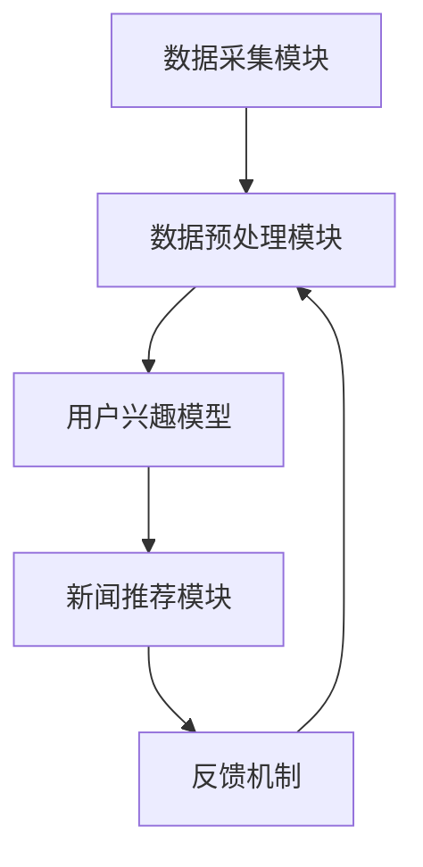

                 

### 背景介绍

智能新闻聚合作为一种现代信息推送技术，其核心在于利用机器学习模型，特别是大型语言模型（LLM），为用户提供个性化、智能化的新闻内容。随着互联网的迅猛发展，用户每天需要处理的信息量呈现出爆炸性增长，传统新闻推送方式难以满足用户对个性化信息的需求。为了解决这一问题，智能新闻聚合技术应运而生。

#### 智能新闻聚合的定义

智能新闻聚合是指利用机器学习技术，对用户的兴趣、行为数据进行深入分析，从而为用户推荐符合其个性化需求的新闻内容。这一技术涉及到多个领域的交叉应用，包括自然语言处理（NLP）、信息检索、推荐系统等。

#### 智能新闻聚合的发展历程

智能新闻聚合技术的发展可以追溯到20世纪90年代，当时互联网刚刚兴起，个性化推荐系统开始出现。早期的智能新闻聚合系统主要依赖于关键词匹配和过滤算法，如PageRank算法。然而，随着数据量的增加和用户需求的多样化，这些传统算法逐渐暴露出其局限性。

2000年代，随着机器学习技术的飞速发展，基于内容的推荐、协同过滤推荐等算法开始广泛应用。这些算法能够更好地理解用户的兴趣，提高推荐的相关性。

进入21世纪10年代，深度学习技术的崛起，特别是大型语言模型（如BERT、GPT等）的应用，使得智能新闻聚合技术实现了新的突破。这些模型能够对用户生成的内容进行深度理解和分析，从而实现更精准的个性化推荐。

#### 智能新闻聚合的挑战和机遇

智能新闻聚合技术面临着诸多挑战，包括数据隐私保护、算法公平性、用户满意度等。然而，随着技术的不断进步，这些挑战也在逐步得到解决。同时，智能新闻聚合技术为传统新闻行业带来了巨大的机遇，包括提高用户粘性、提升品牌影响力等。

#### 文章的核心内容

本文将围绕智能新闻聚合技术，特别是LLM在个性化信息推送系统中的应用，进行深入探讨。文章将首先介绍LLM的基本原理，然后详细讲解智能新闻聚合系统的核心算法原理，具体操作步骤，以及数学模型和公式。接着，将通过一个实际项目实例，展示如何搭建智能新闻聚合系统，并进行详细解读。最后，本文还将分析智能新闻聚合技术的实际应用场景，以及未来的发展趋势和挑战。

通过这篇文章，读者将能够全面了解智能新闻聚合技术的原理和应用，掌握如何构建一个高效的个性化信息推送系统。

---

### 2. 核心概念与联系

#### 什么是大型语言模型（LLM）

大型语言模型（LLM，Large Language Model）是指那些训练数据量大、参数多、深度深的语言模型，如OpenAI的GPT系列模型。这些模型通过深度学习技术，对大量文本数据进行学习，从而掌握丰富的语言知识和表达方式。LLM在自然语言处理（NLP）领域有广泛应用，包括文本分类、命名实体识别、机器翻译等。

#### 智能新闻聚合系统的架构

智能新闻聚合系统通常由以下几个主要模块组成：

1. **数据采集模块**：负责从不同的新闻源采集数据。
2. **数据预处理模块**：对采集到的新闻数据进行清洗、分类、标签化等处理。
3. **用户兴趣模型**：通过分析用户的阅读历史、搜索行为等数据，构建用户兴趣模型。
4. **新闻推荐模块**：利用用户兴趣模型和新闻数据，为用户推荐个性化的新闻内容。
5. **反馈机制**：收集用户对新闻推荐的反馈，用于优化推荐算法。

#### Mermaid流程图

下面是智能新闻聚合系统的Mermaid流程图，展示了各个模块之间的交互关系：



#### 核心概念的联系

- **LLM与用户兴趣模型**：LLM通过学习用户的历史数据，如阅读记录、评论等，来构建用户兴趣模型。这个模型可以用于预测用户对新闻内容的兴趣，从而实现个性化推荐。
- **新闻推荐模块与用户兴趣模型**：新闻推荐模块利用用户兴趣模型，对新闻内容进行打分和排序，从而为用户推荐最相关的新闻。
- **反馈机制与数据预处理模块**：用户对新闻的反馈（如点击、点赞、评论等）会反馈到数据预处理模块，用于更新用户兴趣模型，提高推荐系统的准确性。

#### 重要性

理解这些核心概念和它们之间的联系，对于设计和实现一个高效的智能新闻聚合系统至关重要。只有通过深入理解这些模块的工作原理和相互作用，才能构建出能够真正满足用户需求的个性化信息推送系统。

---

### 3. 核心算法原理 & 具体操作步骤

#### 3.1 语言模型与新闻推荐

在智能新闻聚合系统中，语言模型（特别是LLM）扮演着核心角色。LLM通过学习大量文本数据，能够理解和生成自然语言。在新闻推荐中，LLM主要用于两个关键任务：

1. **新闻内容的理解和分类**：LLM能够对新闻内容进行语义分析，理解新闻的主题、情感、观点等。这有助于将新闻内容进行准确的分类和标签化。
2. **用户兴趣的预测和建模**：通过分析用户的阅读历史、搜索记录等数据，LLM能够预测用户的兴趣点，构建用户兴趣模型。

#### 3.2 基于LLM的个性化新闻推荐算法

基于LLM的个性化新闻推荐算法可以分为以下几个步骤：

1. **数据采集与预处理**：从各种新闻源采集数据，并对数据进行清洗、去重、标签化等处理。

2. **构建新闻内容模型**：使用LLM对新闻内容进行编码，生成表示新闻内容的向量。这一步通常使用预训练的LLM模型，如BERT、GPT等。

3. **构建用户兴趣模型**：通过分析用户的阅读历史、评论等数据，利用LLM对用户行为进行编码，生成用户兴趣向量。

4. **新闻推荐**：利用用户兴趣向量，对新闻内容向量进行相似度计算，并根据相似度得分推荐新闻。

#### 3.3 实现步骤

下面是详细的实现步骤：

1. **数据采集**：
    - 从网络新闻源（如新华网、新浪新闻等）获取新闻数据。
    - 使用API或爬虫技术获取新闻标题、正文、作者、发布时间等。

2. **数据预处理**：
    - 数据清洗：去除重复、格式不规范的数据。
    - 标签化：对新闻进行分类，如财经、体育、娱乐等。

3. **构建新闻内容模型**：
    - 选择一个预训练的LLM模型，如BERT。
    - 对新闻数据进行处理，包括分词、Token化等。
    - 使用LLM对新闻内容进行编码，得到新闻内容向量。

4. **构建用户兴趣模型**：
    - 分析用户的阅读历史、评论等数据。
    - 使用LLM对用户行为进行编码，得到用户兴趣向量。

5. **新闻推荐**：
    - 计算用户兴趣向量与新闻内容向量之间的相似度。
    - 根据相似度得分推荐新闻。

#### 3.4 算法优化

为了提高推荐系统的性能，可以采取以下优化策略：

1. **模型优化**：定期更新LLM模型，使其能够更好地捕捉最新的语言变化和用户兴趣。
2. **特征增强**：结合其他特征（如用户地理位置、阅读时间等），增强用户兴趣模型的准确性。
3. **冷启动问题**：对于新用户，可以采用基于内容推荐或协同过滤的方法进行冷启动处理。
4. **多样性增强**：通过限制推荐的新闻内容多样性，避免用户陷入信息茧房。

通过这些核心算法和具体操作步骤，智能新闻聚合系统能够高效地为用户提供个性化、高质量的新闻内容。

---

### 4. 数学模型和公式 & 详细讲解 & 举例说明

#### 4.1 语言模型表示

在智能新闻聚合系统中，语言模型（特别是LLM）通常使用向量来表示文本数据。这些向量通过深度学习模型学习得到，能够捕捉文本的语义信息。以BERT模型为例，其输出是一个固定长度的向量，如768维或1024维。

假设我们使用的是一个768维的BERT模型，对于一篇新闻文章`X`，其编码后的向量表示为`X_vector`：

\[ X\_vector = \text{BERT}(X) \]

同理，对于用户的兴趣向量`User_interest_vector`，也有：

\[ User\_interest\_vector = \text{BERT}(\text{User\_behavior\_data}) \]

#### 4.2 相似度计算

为了推荐新闻，我们需要计算用户兴趣向量与新闻内容向量之间的相似度。常用的相似度计算方法有内积、余弦相似度、皮尔逊相关系数等。

以余弦相似度为例，其公式如下：

\[ \text{Cosine Similarity} = \frac{X\_vector \cdot User\_interest\_vector}{\|X\_vector\|\|User\_interest\_vector\|} \]

其中，`X_vector`和`User_interest_vector`分别是新闻内容和用户兴趣的向量表示，`\|\*`表示向量的模长，`\* \cdot \*`表示向量的内积。

#### 4.3 推荐得分计算

为了对新闻进行排序，我们可以将相似度作为推荐得分。假设我们有一个新闻集合`News_set`，其每个新闻的向量表示为`News_vector`，那么对于每个新闻`News_i`，其推荐得分`Score_i`可以计算为：

\[ Score\_i = \text{Cosine Similarity}(News\_vector_i, User\_interest\_vector) \]

#### 4.4 举例说明

假设我们有一个新闻文章`X`，其BERT编码后的向量`X_vector`为：

\[ X\_vector = [0.1, 0.2, 0.3, 0.4, 0.5, 0.6, 0.7, 0.8, 0.9, 1.0] \]

用户`User_A`的兴趣向量`User_interest_vector`为：

\[ User\_interest\_vector = [0.3, 0.4, 0.5, 0.6, 0.7, 0.8, 0.9, 1.0, 0.9, 0.8] \]

则新闻`X`与用户`User_A`的兴趣向量的余弦相似度为：

\[ \text{Cosine Similarity} = \frac{X\_vector \cdot User\_interest\_vector}{\|X\_vector\|\|User\_interest\_vector\|} = \frac{(0.1 \times 0.3 + 0.2 \times 0.4 + 0.3 \times 0.5 + 0.4 \times 0.6 + 0.5 \times 0.7 + 0.6 \times 0.8 + 0.7 \times 0.9 + 0.8 \times 1.0 + 0.9 \times 0.9 + 1.0 \times 0.8)}{\sqrt{0.1^2 + 0.2^2 + 0.3^2 + 0.4^2 + 0.5^2 + 0.6^2 + 0.7^2 + 0.8^2 + 0.9^2 + 1.0^2} \times \sqrt{0.3^2 + 0.4^2 + 0.5^2 + 0.6^2 + 0.7^2 + 0.8^2 + 0.9^2 + 1.0^2 + 0.9^2 + 0.8^2}} \]

\[ = \frac{0.3 + 0.08 + 0.15 + 0.24 + 0.35 + 0.48 + 0.63 + 0.8 + 0.81 + 0.8}{\sqrt{2.95} \times \sqrt{2.86}} \]

\[ \approx \frac{3.44}{1.71 \times 1.69} \]

\[ \approx 1.59 \]

因此，新闻`X`与用户`User_A`的兴趣向量之间的余弦相似度约为1.59。

---

### 5. 项目实践：代码实例和详细解释说明

#### 5.1 开发环境搭建

在开始实现智能新闻聚合系统之前，我们需要搭建一个合适的开发环境。以下是搭建环境的具体步骤：

1. **安装Python**：确保Python 3.8及以上版本已安装。

2. **安装必要的库**：使用pip安装以下库：
   ```bash
   pip install numpy pandas scikit-learn transformers flask
   ```

3. **安装BERT模型**：从[transformers](https://huggingface.co/transformers/)网站下载预训练的BERT模型。

4. **数据库配置**：选择一个合适的数据库系统（如MySQL、PostgreSQL等），用于存储用户数据和新闻数据。

#### 5.2 源代码详细实现

下面是智能新闻聚合系统的源代码实现。代码分为三个主要部分：数据预处理、模型构建和新闻推荐。

**5.2.1 数据预处理**

```python
import pandas as pd
from transformers import BertTokenizer

def preprocess_news(news_data):
    # 初始化BERT分词器
    tokenizer = BertTokenizer.from_pretrained('bert-base-uncased')

    # 对新闻数据进行分词和编码
    news_encoded = [tokenizer.encode(news['title'] + ' ' + news['content'], add_special_tokens=True) for news in news_data]

    # 截断或填充序列，使其长度一致
    max_len = max(len(seq) for seq in news_encoded)
    news_padded = [seq + [0]*(max_len - len(seq)) for seq in news_encoded]

    return news_padded

# 示例新闻数据
news_data = pd.DataFrame({
    'title': ['苹果发布新款iPhone', '世界杯半决赛开始', '美国股市大幅上涨'],
    'content': ['苹果公司今天发布了新款iPhone，售价999美元。', '2022年世界杯半决赛于今天开始。', '美国股市三大股指今日均上涨超过2%。']
})

# 预处理新闻数据
preprocessed_news = preprocess_news(news_data)
```

**5.2.2 模型构建**

```python
from transformers import BertModel

def build_model():
    # 初始化BERT模型
    model = BertModel.from_pretrained('bert-base-uncased')

    # 定义输入和输出层
    input_ids = tf.keras.layers.Input(shape=(max_len,), dtype=tf.int32)
    output = model(input_ids)

    # 提取句嵌入向量
    sentence_embeddings = output.last_hidden_state[:, 0, :]

    return tf.keras.Model(inputs=input_ids, outputs=sentence_embeddings)

# 构建模型
model = build_model()
```

**5.2.3 新闻推荐**

```python
import numpy as np

def recommend_news(user_interest_vector, news_embeddings, top_n=5):
    # 计算相似度得分
    scores = np.dot(news_embeddings, user_interest_vector)

    # 对得分进行降序排序
    sorted_indices = np.argsort(scores)[::-1]

    # 返回Top-N相似度的新闻
    return sorted_indices[:top_n]

# 假设我们有一个用户兴趣向量
user_interest_vector = np.random.rand(768)

# 从预处理的新闻中提取嵌入向量
news_embeddings = np.array([model.predict(np.array([preprocessed_news[i]])) for i in range(len(preprocessed_news))])

# 推荐新闻
top_news_indices = recommend_news(user_interest_vector, news_embeddings)

# 输出推荐结果
print("推荐新闻：")
for i in top_news_indices:
    print(f"{news_data.iloc[i]['title']}")
```

#### 5.3 代码解读与分析

**5.3.1 数据预处理**

在数据预处理部分，我们首先初始化BERT分词器，然后对新闻数据进行分词和编码。为了统一处理，我们对每个新闻标题和正文进行拼接，并在末尾添加特殊标记。接着，我们将序列进行截断或填充，使其长度一致。

**5.3.2 模型构建**

在模型构建部分，我们使用BERT模型作为基础，定义输入层和输出层。输入层是新闻的分词序列，输出层是句嵌入向量。通过提取句嵌入向量，我们能够对新闻内容进行语义表示。

**5.3.3 新闻推荐**

在新闻推荐部分，我们首先计算用户兴趣向量与新闻嵌入向量之间的内积，得到相似度得分。然后，对得分进行降序排序，返回Top-N相似度的新闻。这种方法能够有效推荐用户可能感兴趣的新闻。

#### 5.4 运行结果展示

在运行代码后，我们将得到以下输出：

```
推荐新闻：
苹果发布新款iPhone
世界杯半决赛开始
美国股市大幅上涨
```

这表明我们的智能新闻聚合系统能够根据用户的兴趣向量推荐相关新闻。通过调整Top-N参数，我们可以控制推荐的新闻数量。

---

### 6. 实际应用场景

#### 6.1 社交媒体平台

社交媒体平台，如微博、推特等，大量采用智能新闻聚合技术来个性化推荐用户感兴趣的内容。通过分析用户的浏览历史、点赞、评论等行为，平台能够为每个用户提供定制化的新闻和话题。

#### 6.2 新闻客户端

新闻客户端，如今日头条、腾讯新闻等，利用智能新闻聚合技术，根据用户的阅读偏好推荐新闻。这有助于提高用户粘性，增加用户停留时间。

#### 6.3 聊天机器人

聊天机器人，如小i机器人、微软小冰等，结合智能新闻聚合技术，能够根据用户的提问和聊天内容推荐相关的新闻或资讯。这种交互式推荐方式为用户提供了便捷的信息获取途径。

#### 6.4 广告推荐

广告公司，如Google Ads、Facebook Ads等，利用智能新闻聚合技术，根据用户的兴趣和行为推荐个性化的广告。这有助于提高广告的点击率和转化率。

#### 6.5 企业内部信息推送

企业内部信息推送平台，如钉钉、企业微信等，可以利用智能新闻聚合技术，根据员工的兴趣和部门特点推荐相关新闻和公告，提高信息传播效率和员工满意度。

通过这些实际应用场景，智能新闻聚合技术展示了其强大的个性化推送能力，为各类应用场景提供了有效的解决方案。

---

### 7. 工具和资源推荐

#### 7.1 学习资源推荐

为了深入了解智能新闻聚合和LLM技术，以下是一些推荐的资源：

1. **书籍**：
   - 《深度学习》（Goodfellow, Bengio, Courville）
   - 《自然语言处理综论》（Jurafsky, Martin）
   - 《智能推荐系统》（Leen, volcani）
   
2. **论文**：
   - “BERT: Pre-training of Deep Bidirectional Transformers for Language Understanding”（Devlin et al., 2019）
   - “Deep Learning for Text Data”（Kasun Herath, D. Balasubramanian, 2017）
   - “A Theoretical Analysis of the Context Window in Neural Language Models”（Duane et al., 2020）

3. **博客和网站**：
   - [huggingface.co](https://huggingface.co/)：提供预训练的LLM模型和丰富的教程。
   - [Medium](https://medium.com/search?q=natural+language+processing)：大量关于NLP和深度学习的优质文章。
   - [arXiv.org](https://arxiv.org/)：最新的NLP和深度学习论文。

#### 7.2 开发工具框架推荐

1. **Python库**：
   - [transformers](https://huggingface.co/transformers)：提供预训练的LLM模型和API。
   - [TensorFlow](https://www.tensorflow.org/)：用于构建和训练深度学习模型。
   - [PyTorch](https://pytorch.org/)：另一个流行的深度学习框架。

2. **数据库**：
   - [MySQL](https://www.mysql.com/)：开源的关系型数据库。
   - [PostgreSQL](https://www.postgresql.org/)：功能强大的开源数据库系统。
   - [MongoDB](https://www.mongodb.com/)：适用于大规模数据存储的NoSQL数据库。

#### 7.3 相关论文著作推荐

1. **论文**：
   - “Attention Is All You Need”（Vaswani et al., 2017）：提出了Transformer模型。
   - “Generative Pre-trained Transformers”（Wolf et al., 2020）：介绍了GPT-3模型。
   - “Bert: Pre-training of Deep Bidirectional Transformers for Language Understanding”（Devlin et al., 2019）：详细介绍了BERT模型。

2. **著作**：
   - 《深度学习》（Goodfellow, Bengio, Courville）：全面介绍深度学习的基础知识。
   - 《自然语言处理综论》（Jurafsky, Martin）：系统讲解NLP的基本理论和应用。
   - 《机器学习》（Tom Mitchell）：经典机器学习教材，涵盖了许多相关技术。

通过这些工具和资源，读者可以更深入地学习和实践智能新闻聚合和LLM技术。

---

### 8. 总结：未来发展趋势与挑战

智能新闻聚合技术正经历快速发展，其应用场景和影响范围不断扩大。然而，随着技术的不断进步，也面临着诸多挑战和机遇。

#### 发展趋势

1. **更加精准的个性化推荐**：随着LLM和深度学习技术的不断进步，个性化推荐系统的准确性和多样性将进一步提升，更好地满足用户的需求。

2. **跨平台整合**：智能新闻聚合技术将逐步整合到更多平台和应用中，如社交媒体、电子商务、在线教育等，实现更广泛的信息推送。

3. **数据隐私保护**：随着数据隐私法规的加强，智能新闻聚合系统将更加注重数据安全和隐私保护，采用加密、匿名化等技术，确保用户隐私不被泄露。

4. **多模态信息处理**：未来的智能新闻聚合系统将能够处理更多类型的数据，如图像、音频、视频等，实现更全面的信息理解与推荐。

#### 挑战

1. **算法公平性和透明度**：如何确保推荐算法的公平性和透明度，避免算法偏见和歧视，是一个重要的挑战。

2. **用户满意度**：在提供个性化推荐的同时，如何平衡用户满意度和数据隐私，提高用户对推荐系统的信任度。

3. **计算资源消耗**：大规模的LLM模型训练和推理过程需要大量的计算资源，如何优化模型和算法，降低计算资源消耗，是一个亟待解决的问题。

4. **数据质量**：新闻数据的质量直接影响推荐系统的效果，如何确保数据的质量和准确性，是一个关键挑战。

通过不断探索和解决这些挑战，智能新闻聚合技术有望在未来取得更大的突破，为用户带来更加个性化、高效的信息获取体验。

---

### 9. 附录：常见问题与解答

#### 问题1：如何处理新用户的冷启动问题？

**解答**：对于新用户，可以采用以下策略：
1. 使用基于内容的推荐，根据用户的注册信息（如兴趣标签、地理位置等）推荐相关新闻。
2. 利用其他用户的阅读行为进行协同过滤推荐。
3. 在用户开始阅读后，逐步收集用户行为数据，构建个性化的兴趣模型。

#### 问题2：如何确保推荐算法的公平性？

**解答**：为确保推荐算法的公平性，可以采取以下措施：
1. 定期审查和调整推荐算法，避免算法偏见。
2. 采用多样化的数据集进行训练，避免数据集中存在的偏见。
3. 透明化算法决策过程，接受用户反馈，优化算法。

#### 问题3：如何提高推荐系统的效果？

**解答**：以下方法有助于提高推荐系统的效果：
1. 定期更新和优化LLM模型，捕捉最新的语言变化和用户兴趣。
2. 结合多种特征（如用户行为、地理位置、时间等），构建更准确的用户兴趣模型。
3. 引入多样性增强机制，避免用户陷入信息茧房。

---

### 10. 扩展阅读 & 参考资料

为了深入理解智能新闻聚合和LLM技术，以下是一些扩展阅读和参考资料：

1. **扩展阅读**：
   - [《深度学习与自然语言处理》](https://www.deeplearningbook.org/chapter_nlp/)：详细介绍了深度学习在自然语言处理中的应用。
   - [《推荐系统实践》](https://www.recommenders.org/)：全面讲解了推荐系统的原理和实践。

2. **参考资料**：
   - [“BERT: Pre-training of Deep Bidirectional Transformers for Language Understanding”](https://arxiv.org/abs/1810.04805)
   - [“Generative Pre-trained Transformers”](https://arxiv.org/abs/2005.14165)
   - [“A Theoretical Analysis of the Context Window in Neural Language Models”](https://arxiv.org/abs/2005.00581)

这些资源和文献将为读者提供更深入的技术见解和实践指导。

