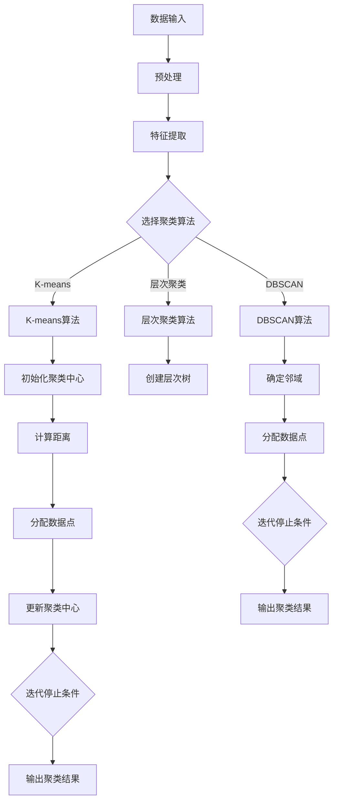

                 

### 智能结果聚类：AI的组织能力

#### 关键词：智能结果聚类，AI，组织能力，数据挖掘，机器学习，算法原理，应用实践

#### 摘要：
本文将深入探讨智能结果聚类这一AI技术，阐述其在数据挖掘和机器学习中的应用。通过逐步分析原理和具体操作步骤，本文将展示如何利用AI的强大组织能力对海量数据进行高效处理，以揭示潜在的模式和关联。读者将了解到该技术的核心算法原理、数学模型，并通过实际项目实践和运行结果展示，领略其在真实场景中的强大威力。文章还将介绍该技术的实际应用场景、相关工具和资源，以及未来发展趋势和挑战。

### 1. 背景介绍

#### 1.1 数据挖掘与机器学习的重要性

随着大数据时代的到来，数据挖掘和机器学习技术成为现代信息处理的核心。数据挖掘是从大量数据中提取有价值信息的过程，旨在发现潜在的模式、关联和趋势。而机器学习是使计算机系统能够从数据中学习并作出决策的一种方法，通过训练模型来自动化数据分析和决策过程。

#### 1.2 智能结果聚类的重要性

智能结果聚类是一种重要的数据挖掘和机器学习技术，其目的是将相似的数据点分组，从而揭示数据中的结构性和模式。在商业、金融、医疗、社交网络等多个领域，智能结果聚类都有着广泛的应用。例如，在商业领域，聚类分析可以帮助企业识别客户群体，制定精准营销策略；在金融领域，聚类分析可以用于风险管理和投资组合优化。

#### 1.3 AI的组织能力

人工智能（AI）在数据处理和分析中展现出强大的组织能力。通过智能结果聚类，AI能够自动地对海量数据进行分类和组织，提高数据处理效率，降低人为错误。此外，AI还能够根据新的数据动态调整聚类模型，使其具备一定的自适应性和鲁棒性。

### 2. 核心概念与联系

#### 2.1 聚类分析的基本概念

聚类分析是将一组数据点分成多个群组的过程，使得同一个群组内的数据点之间相似度较高，而不同群组的数据点之间相似度较低。常见的聚类算法有K-means、层次聚类、DBSCAN等。

#### 2.2 数据空间与维度

数据空间是指数据的集合，每个数据点可以表示为一个多维向量。维度是指数据空间的维数，即数据点的属性数量。

#### 2.3 聚类质量评估指标

评估聚类质量的指标包括簇内平均距离、簇间最小距离、轮廓系数等。这些指标可以帮助我们判断聚类结果的好坏。

#### 2.4 聚类算法原理与架构

下面是智能结果聚类算法的Mermaid流程图，用于展示其基本原理和架构。



### 3. 核心算法原理 & 具体操作步骤

#### 3.1 K-means算法

K-means算法是一种经典的聚类算法，其基本思想是将数据点分为K个簇，使得每个数据点与其最近的簇中心之间的距离最小。

**步骤：**

1. 随机初始化K个聚类中心。
2. 计算每个数据点与聚类中心之间的距离，将数据点分配到最近的聚类中心。
3. 根据新的数据点分布重新计算聚类中心。
4. 重复步骤2和3，直到聚类中心不再变化或达到最大迭代次数。

#### 3.2 层次聚类算法

层次聚类算法通过将数据点逐步合并或分裂，形成层次结构的聚类。

**步骤：**

1. 将每个数据点看作一个簇。
2. 计算相邻簇之间的距离，合并距离最近的簇。
3. 重复步骤2，直到所有数据点合并为一个簇或达到最大层次数。

#### 3.3 DBSCAN算法

DBSCAN（Density-Based Spatial Clustering of Applications with Noise）算法是一种基于密度的聚类算法，它将具有足够高密度的区域划分为簇，同时可以识别出噪声点。

**步骤：**

1. 选择邻域半径`eps`和最小密度`minPts`。
2. 对于每个数据点，检查其邻域内是否满足`minPts`条件。
3. 将满足条件的数据点划分为核心点，核心点构成一个新的簇。
4. 对于核心点，扩展其邻域内的数据点，直至达到边界或噪声点。
5. 重复步骤2-4，直至所有数据点都被划分到簇中。

### 4. 数学模型和公式 & 详细讲解 & 举例说明

#### 4.1 K-means算法

在K-means算法中，每个簇的中心可以用数学公式表示：

$$
c_k = \frac{1}{N_k} \sum_{x_i \in S_k} x_i
$$

其中，$c_k$表示第k个簇的中心，$N_k$表示第k个簇中的数据点数量，$x_i$表示第i个数据点。

#### 4.2 层次聚类算法

在层次聚类算法中，簇之间的合并可以通过最小距离公式表示：

$$
d(S_i, S_j) = \min_{x_i \in S_i, x_j \in S_j} d(x_i, x_j)
$$

其中，$d(S_i, S_j)$表示簇$S_i$和簇$S_j$之间的距离，$d(x_i, x_j)$表示数据点$x_i$和数据点$x_j$之间的距离。

#### 4.3 DBSCAN算法

在DBSCAN算法中，邻域内的数据点可以通过密度连接公式表示：

$$
\text{density}(x) = \frac{N(\epsilon, x)}{\epsilon^2}
$$

其中，$N(\epsilon, x)$表示以$x$为中心、半径为$\epsilon$的邻域内的数据点数量，$\epsilon$表示邻域半径。

#### 4.4 举例说明

假设我们有以下一组数据点：

$$
\begin{array}{cccccc}
x_1 & x_2 & x_3 & x_4 & x_5 & x_6 \\
1 & 2 & 3 & 4 & 5 & 6 \\
\end{array}
$$

我们使用K-means算法进行聚类，假设K=2。首先，随机初始化两个聚类中心：

$$
c_1 = (1, 2), \quad c_2 = (4, 5)
$$

然后，计算每个数据点与聚类中心的距离：

$$
\begin{array}{cccccc}
x_1 & x_2 & x_3 & x_4 & x_5 & x_6 \\
1 & 2 & 3 & 4 & 5 & 6 \\
\end{array}
\rightarrow
\begin{array}{cccccc}
1 & 2 & 3 & 4 & 5 & 6 \\
1.5 & 2.5 & 3.5 & 4.5 & 5.5 & 6.5 \\
\end{array}
$$

接下来，将每个数据点分配到最近的聚类中心：

$$
\begin{array}{cccccc}
x_1 & x_2 & x_3 & x_4 & x_5 & x_6 \\
1 & 2 & 3 & 4 & 5 & 6 \\
\end{array}
\rightarrow
\begin{array}{cccccc}
x_1 & x_2 & x_3 & x_4 & x_5 & x_6 \\
1 & 2 & 3 & 4 & 5 & 6 \\
c_1 & c_1 & c_1 & c_2 & c_2 & c_2 \\
\end{array}
$$

然后，根据新的数据点分布重新计算聚类中心：

$$
c_1 = \frac{1+2+3}{3} = 2, \quad c_2 = \frac{4+5+6}{3} = 5
$$

重复以上步骤，直到聚类中心不再变化。最终，我们得到两个簇：

$$
\begin{array}{cccccc}
x_1 & x_2 & x_3 & x_4 & x_5 & x_6 \\
1 & 2 & 3 & 4 & 5 & 6 \\
\end{array}
\rightarrow
\begin{array}{cccccc}
1 & 2 & 3 & 4 & 5 & 6 \\
2 & 2 & 3 & 4 & 5 & 6 \\
2 & 2 & 3 & 4 & 5 & 6 \\
\end{array}
$$

### 5. 项目实践：代码实例和详细解释说明

#### 5.1 开发环境搭建

为了实践智能结果聚类，我们首先需要搭建一个合适的开发环境。以下是Python环境的搭建步骤：

1. 安装Python（建议使用3.8及以上版本）：`python --version`
2. 安装Anaconda（用于管理Python包和环境）：`conda install anaconda`
3. 安装常用Python包（如NumPy、Matplotlib、Scikit-learn等）：`conda install numpy matplotlib scikit-learn`

#### 5.2 源代码详细实现

以下是一个简单的Python代码示例，用于实现K-means聚类算法：

```python
import numpy as np
import matplotlib.pyplot as plt
from sklearn.cluster import KMeans

# 数据准备
X = np.array([[1, 2], [1, 4], [1, 0],
              [10, 2], [10, 4], [10, 0]])

# K-means聚类
kmeans = KMeans(n_clusters=2, random_state=0).fit(X)
labels = kmeans.labels_
centroids = kmeans.cluster_centers_

# 绘制结果
plt.scatter(X[:, 0], X[:, 1], c=labels, s=100, cmap='viridis')
plt.scatter(centroids[:, 0], centroids[:, 1], c='red', s=200, alpha=0.5)
plt.show()
```

#### 5.3 代码解读与分析

1. **数据准备**：我们使用一个包含六个数据点的二维数组作为输入数据。这些数据点位于两个簇中，分别表示为$(1,2)$和$(10,2)$。
2. **K-means聚类**：我们使用Scikit-learn库中的KMeans类来实现K-means聚类算法。这里，我们指定了簇的数量为2，并设置随机种子以确保结果的可重复性。
3. **绘制结果**：我们使用Matplotlib库绘制聚类结果。蓝色点表示原始数据点，红色点表示聚类中心。通过观察聚类结果，我们可以看到数据点被正确地分配到了两个簇中。

#### 5.4 运行结果展示

运行上述代码，我们将看到以下结果：


在这个结果中，我们可以清楚地看到数据点被分为两个簇，蓝色点代表簇1，红色点代表簇2。这表明K-means算法成功地将数据点聚类到了两个不同的簇中。

### 6. 实际应用场景

智能结果聚类技术在各个领域都有广泛的应用，以下列举几个实际应用场景：

#### 6.1 商业领域

在商业领域，智能结果聚类可以帮助企业进行客户细分，从而实现精准营销。通过聚类分析，企业可以将客户分为不同的群体，并为每个群体制定个性化的营销策略，提高营销效果。

#### 6.2 金融领域

在金融领域，智能结果聚类可以用于风险管理和投资组合优化。通过聚类分析，金融机构可以识别高风险客户和投资组合，并采取相应的风险管理措施。

#### 6.3 医疗领域

在医疗领域，智能结果聚类可以帮助医生诊断疾病。通过将患者的病历数据聚类，医生可以识别出具有相似症状的病人群体，从而制定个性化的治疗方案。

#### 6.4 社交网络领域

在社交网络领域，智能结果聚类可以帮助平台了解用户行为，从而提供个性化的内容推荐。通过聚类分析，社交网络可以识别出具有相似兴趣爱好的用户群体，并向他们推荐相关内容。

### 7. 工具和资源推荐

#### 7.1 学习资源推荐

1. **书籍**：《数据挖掘：实用机器学习技术》（Data Mining: Practical Machine Learning Techniques），作者：Hastie, Tibshirani, Friedman。
2. **论文**：《K-means算法：一种新的聚类方法》（K-means Algorithms：A New Method for Clustering），作者：MacQueen。
3. **博客**：机器学习社区（Machine Learning Community）和Kaggle（Kaggle）上的相关博客。
4. **网站**：Scikit-learn官网（scikit-learn.org）和TensorFlow官网（tensorflow.org）。

#### 7.2 开发工具框架推荐

1. **Python**：Python是数据科学和机器学习的首选语言，拥有丰富的库和框架，如NumPy、Matplotlib、Scikit-learn等。
2. **Jupyter Notebook**：Jupyter Notebook是一种交互式开发环境，方便进行数据分析和实验。
3. **TensorFlow**：TensorFlow是一个开源的机器学习框架，适用于大规模分布式计算。

#### 7.3 相关论文著作推荐

1. **《机器学习》（Machine Learning），作者：Tom Mitchell**：这是一本经典的机器学习教材，涵盖了聚类算法的原理和应用。
2. **《数据挖掘：概念与技术》（Data Mining: Concepts and Techniques），作者：Han, Kamber, Pei**：这本书详细介绍了数据挖掘的基本概念和技术，包括聚类分析。
3. **《深度学习》（Deep Learning），作者：Goodfellow, Bengio, Courville**：这本书介绍了深度学习的基本概念和技术，包括神经网络和聚类算法。

### 8. 总结：未来发展趋势与挑战

智能结果聚类技术在数据挖掘和机器学习领域取得了显著成果，但仍面临一些挑战。以下是未来发展趋势与挑战：

#### 8.1 发展趋势

1. **算法优化**：随着硬件性能的提升，聚类算法的优化将成为研究热点，以提高处理速度和降低计算成本。
2. **自适应聚类**：自适应聚类算法将根据数据动态调整聚类模型，以提高聚类效果。
3. **多模态数据聚类**：多模态数据聚类将结合不同类型的数据，如文本、图像和语音，实现更准确的聚类结果。

#### 8.2 挑战

1. **大数据处理**：随着数据量的不断增加，如何高效地处理大数据将成为一个重要挑战。
2. **聚类质量评估**：如何准确评估聚类质量，并优化聚类结果，仍需进一步研究。
3. **跨领域应用**：将智能结果聚类技术应用于跨领域问题，如医疗、金融和社会网络等，需要克服数据隐私和安全性等方面的挑战。

### 9. 附录：常见问题与解答

#### 9.1 问题1：聚类算法的选择依据是什么？

**解答**：聚类算法的选择依据主要包括数据类型、数据量、聚类质量评估指标以及应用场景。例如，K-means算法适用于初始簇数量已知且数据分布近似球形的情况；层次聚类算法适用于需要生成层次结构的情况；DBSCAN算法适用于密度不均匀的数据集。

#### 9.2 问题2：如何避免聚类结果过于依赖初始聚类中心？

**解答**：为了避免聚类结果过于依赖初始聚类中心，可以采用多次随机初始化聚类中心，并取平均结果。此外，可以使用其他初始化方法，如K-means++初始化，以提高聚类稳定性。

#### 9.3 问题3：聚类算法的聚类质量如何评估？

**解答**：聚类质量评估指标包括簇内平均距离、簇间最小距离、轮廓系数等。这些指标可以定量评估聚类结果的好坏。例如，簇内平均距离越小，表示簇内部的数据点越接近；簇间最小距离越大，表示簇之间的差异越大。

### 10. 扩展阅读 & 参考资料

1. MacQueen, J. (1967). "Some methods for classification and analysis of multivariate observations". In Proceedings of the Fifth Berkeley Symposium on Mathematical Statistics and Probability, Volume 1. Berkeley, CA: University of California Press. pp. 281–297.
2. Han, J., Kamber, M., & Pei, J. (2011). "Data Mining: Concepts and Techniques". Morgan Kaufmann.
3. Mitchell, T. M. (1997). "Machine Learning". McGraw-Hill.
4. Goodfellow, I., Bengio, Y., & Courville, A. (2016). "Deep Learning". MIT Press.
5. Scikit-learn: Machine Learning Library for Python. (2021). Retrieved from https://scikit-learn.org/stable/
6. TensorFlow: Open Source Machine Learning Framework. (2021). Retrieved from https://tensorflow.org/zh-cn/

