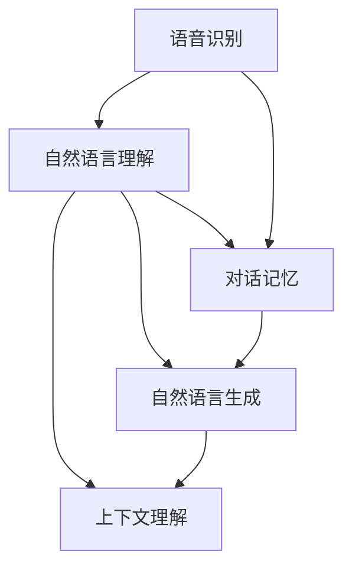

                 

### 文章标题

智能语音助手升级：AI大模型在对话系统中的突破

> 关键词：智能语音助手、AI大模型、对话系统、语音识别、自然语言处理、机器学习、深度学习、多模态交互

> 摘要：本文深入探讨了智能语音助手领域的重要技术突破，特别是AI大模型在对话系统中的应用。通过回顾背景、剖析核心概念与架构、解析算法原理、展示数学模型和项目实践，我们全面了解了AI大模型在提升智能语音助手性能和用户体验方面的巨大潜力，并展望了未来的发展趋势与挑战。

---

### 1. 背景介绍

智能语音助手，作为人工智能（AI）与自然语言处理（NLP）相结合的产物，正逐渐改变着我们的生活方式。从最初的简单语音识别到如今的复杂对话系统，智能语音助手的发展历程见证了技术不断迭代与革新的过程。

在早期，智能语音助手的功能相对单一，主要集中于语音识别和简单的指令执行。这些系统依赖传统的机器学习模型，如决策树和朴素贝叶斯分类器，其性能受到数据和算法的限制。然而，随着深度学习技术的崛起，尤其是AI大模型的引入，对话系统的性能得到了显著提升。

AI大模型，如Transformer和BERT，通过捕捉大量数据中的复杂模式和上下文关系，实现了前所未有的语言理解和生成能力。这些模型在多个领域都取得了突破性成果，例如机器翻译、文本摘要和问答系统。在智能语音助手领域，AI大模型的引入标志着对话系统从传统的规则导向向数据驱动的深度学习模型转型。

本文将围绕AI大模型在对话系统中的应用，详细探讨其核心原理、具体实现和实际应用场景。通过逐步分析推理的方式，我们希望能够帮助读者全面理解AI大模型对智能语音助手发展的深远影响。

### 2. 核心概念与联系

#### 2.1 AI大模型概述

AI大模型是指那些训练在超大规模数据集上的深度学习模型，具有数亿到数千亿个参数。这些模型能够通过自主学习大量文本数据，提取出语言中的复杂模式和信息。代表性的AI大模型包括谷歌的BERT、OpenAI的GPT系列模型以及微软的Turing模型。

#### 2.2 对话系统基本架构

对话系统通常由三个主要组件构成：语音识别（ASR）、自然语言理解（NLU）和自然语言生成（NLG）。

- **语音识别（ASR）**：将语音信号转换为文本，是整个系统的入口。传统的ASR系统通常使用GMM-HMM模型，而现代系统则更多地采用基于深度学习的端到端模型，如WaveNet。
- **自然语言理解（NLU）**：解析输入文本，理解其含义和意图。这通常涉及实体识别、情感分析、意图分类等任务。AI大模型，如BERT，在NLU任务中表现出色，能够捕捉文本的上下文和语义关系。
- **自然语言生成（NLG）**：根据理解的结果生成合适的回复。NLG可以采用模板匹配、规则生成和基于生成对抗网络（GAN）的方法。随着AI大模型的发展，生成式NLG变得越来越流行。

#### 2.3 AI大模型在对话系统中的应用

AI大模型在对话系统中的应用主要分为以下几方面：

- **预训练和微调**：AI大模型通过在大规模语料库上进行预训练，学习到通用的语言知识。然后，通过在特定任务上的微调，使其适应具体的对话任务。
- **多模态交互**：AI大模型能够处理不同模态的数据，如语音、文本、图像等，从而实现更丰富的交互体验。例如，通过视觉信息增强语音识别和理解，提高对话系统的准确性和智能化水平。
- **上下文理解与记忆**：AI大模型能够捕捉长文本中的上下文关系，并记住对话的历史信息，从而提供更连贯和自然的对话体验。

#### 2.4 架构的Mermaid流程图



通过上述核心概念与架构的介绍，我们为接下来的详细探讨打下了基础。

---

### 3. 核心算法原理 & 具体操作步骤

#### 3.1 语音识别（ASR）

语音识别（Automatic Speech Recognition，ASR）是将语音信号转换为文本的过程。近年来，深度学习在ASR领域取得了显著的进展，主要得益于端到端模型的引入和大规模数据集的利用。

##### 3.1.1 端到端ASR模型

端到端ASR模型通过直接将语音信号映射到文本，避免了传统ASR系统中的多个中间步骤。一个典型的端到端模型是基于循环神经网络（RNN）的DeepSpeech模型。

1. **数据预处理**：将音频信号转换为频谱特征，如梅尔频率倒谱系数（MFCC）。
2. **特征提取**：使用卷积神经网络（CNN）提取高维特征。
3. **序列建模**：使用RNN或Transformer进行序列建模，输出对应的文本。

##### 3.1.2 操作步骤示例

以DeepSpeech为例，具体操作步骤如下：

1. **数据收集**：收集大规模的语音数据集，包括多种语言和语音环境。
2. **数据预处理**：对音频信号进行预处理，提取MFCC特征。
3. **模型训练**：使用CNN提取特征，RNN进行序列建模，通过反向传播算法训练模型。
4. **模型评估**：使用验证集评估模型性能，并进行超参数调整。
5. **模型部署**：将训练好的模型部署到生产环境中，提供语音识别服务。

#### 3.2 自然语言理解（NLU）

自然语言理解（Natural Language Understanding，NLU）是解析输入文本，理解其含义和意图的过程。AI大模型，如BERT和GPT，在NLU任务中表现出色，能够处理复杂的语义关系和上下文信息。

##### 3.2.1 BERT模型原理

BERT（Bidirectional Encoder Representations from Transformers）是一种基于Transformer的预训练模型，通过双向编码器学习文本的上下文信息。

1. **预训练**：在大规模文本语料库上进行预训练，学习通用的语言知识。预训练任务包括Masked Language Model（MLM）和Next Sentence Prediction（NSP）。
2. **微调**：在特定任务上进行微调，如情感分析、实体识别和意图分类。

##### 3.2.2 操作步骤示例

以BERT为例，具体操作步骤如下：

1. **数据收集**：收集用于微调的数据集，如对话数据、评价数据等。
2. **数据预处理**：将文本数据转换为BERT的输入格式，包括分词、编码和填充等。
3. **模型微调**：使用BERT模型对数据集进行微调，优化模型参数。
4. **模型评估**：使用验证集评估模型性能，并进行超参数调整。
5. **模型部署**：将训练好的模型部署到生产环境中，提供NLU服务。

#### 3.3 自然语言生成（NLG）

自然语言生成（Natural Language Generation，NLG）是根据输入文本生成合适的回复的过程。随着AI大模型的发展，生成式NLG变得越来越流行，如基于GPT的对话生成系统。

##### 3.3.1 GPT模型原理

GPT（Generative Pre-trained Transformer）是一种基于Transformer的预训练模型，能够生成连贯且具有上下文信息的文本。

1. **预训练**：在大规模文本语料库上进行预训练，学习通用的语言知识。
2. **生成文本**：使用预训练的模型生成文本，通过采样和后处理技术生成连贯的回复。

##### 3.3.2 操作步骤示例

以GPT为例，具体操作步骤如下：

1. **数据收集**：收集用于预训练的数据集，如对话数据、新闻文章等。
2. **数据预处理**：将文本数据转换为GPT的输入格式，包括分词、编码和填充等。
3. **模型预训练**：使用GPT模型对数据集进行预训练，优化模型参数。
4. **文本生成**：使用预训练的模型生成文本，通过后处理技术生成连贯的回复。
5. **模型评估**：使用验证集评估模型性能，并进行超参数调整。
6. **模型部署**：将训练好的模型部署到生产环境中，提供NLG服务。

通过上述算法原理和具体操作步骤的介绍，我们为深入理解AI大模型在智能语音助手中的应用奠定了基础。

---

### 4. 数学模型和公式 & 详细讲解 & 举例说明

#### 4.1 语音识别中的数学模型

语音识别中的数学模型主要涉及声学模型和语言模型。

##### 4.1.1 声学模型

声学模型用于将语音信号转换为概率分布，表示某个语音片段对应的文字序列的概率。一个常见的声学模型是GMM-HMM（高斯混合模型隐马尔可夫模型）。

1. **高斯混合模型（GMM）**：
   声音特征通常是多维高斯分布的线性组合。GMM模型可以表示为：
   $$
   p(\mathbf{x}|\theta) = \sum_{i=1}^C w_i \mathcal{N}(\mathbf{x}|\mu_i, \Sigma_i)
   $$
   其中，$p(\mathbf{x}|\theta)$ 是给定模型参数 $\theta$ 下的特征向量 $\mathbf{x}$ 的概率分布，$C$ 是高斯分布的个数，$w_i$ 是高斯分布的权重，$\mu_i$ 和 $\Sigma_i$ 分别是高斯分布的均值和协方差矩阵。

2. **隐马尔可夫模型（HMM）**：
   HMM用于建模语音信号中的序列特性。一个HMM可以表示为：
   $$
   \begin{align*}
   p(\mathbf{O}|\lambda) &= \prod_{t=1}^T p(o_t|\pi_i, \mu_i, \Sigma_i) \\
   p(i_t|i_{t-1}, \lambda) &= \pi_i a_{i_{t-1}, i_t}
   \end{align*}
   $$
   其中，$\mathbf{O} = (o_1, o_2, \ldots, o_T)$ 是观察序列，$i_t$ 是隐藏状态，$\lambda = (\pi, A, B)$ 是模型参数，$\pi$ 是初始状态分布，$A$ 是状态转移概率矩阵，$B$ 是输出概率分布矩阵。

##### 4.1.2 语言模型

语言模型用于计算文本序列的概率，常见的语言模型是n-gram模型。

1. **n-gram模型**：
   n-gram模型假设当前词的概率仅依赖于前n-1个词，模型可以表示为：
   $$
   p(w_n | w_{n-1}, w_{n-2}, \ldots, w_1) = \frac{N(w_1, w_2, \ldots, w_n)}{N(w_1, w_2, \ldots, w_{n-1})}
   $$
   其中，$N(w_1, w_2, \ldots, w_n)$ 是序列 $(w_1, w_2, \ldots, w_n)$ 的频率，$N(w_1, w_2, \ldots, w_{n-1})$ 是序列 $(w_1, w_2, \ldots, w_{n-1})$ 的频率。

##### 4.2 自然语言理解中的数学模型

自然语言理解中的数学模型主要涉及词嵌入、注意力机制和序列标注。

##### 4.2.1 词嵌入

词嵌入（Word Embedding）将词汇映射到高维空间中，以便计算机能够处理。常见的词嵌入方法有Word2Vec、GloVe等。

1. **Word2Vec**：
   Word2Vec模型使用神经网络学习词向量，模型可以表示为：
   $$
   \mathbf{h} = \text{ReLU}\left(W_1 \cdot \mathbf{e}_w + b_1\right)
   $$
   $$
   \mathbf{v} = \text{ReLU}\left(W_2 \cdot \mathbf{h} + b_2\right)
   $$
   其中，$\mathbf{e}_w$ 是词向量，$W_1$ 和 $W_2$ 是权重矩阵，$b_1$ 和 $b_2$ 是偏置项。

##### 4.2.2 注意力机制

注意力机制（Attention Mechanism）用于捕捉文本中的关键信息。一个简单的注意力机制可以表示为：
$$
\alpha_i = \frac{\exp(e_i)}{\sum_j \exp(e_j)}
$$
$$
\mathbf{h}_i = \sum_j \alpha_j \mathbf{h}_j
$$
其中，$e_i$ 是注意力得分，$\alpha_i$ 是注意力权重，$\mathbf{h}_i$ 是注意力后的表示。

##### 4.2.3 序列标注

序列标注（Sequence Labeling）用于对文本中的每个词进行分类。一个简单的序列标注模型可以表示为：
$$
\text{softmax}(\mathbf{W} \cdot \mathbf{h}_{\text{tag}} + b)
$$
其中，$\mathbf{W}$ 是权重矩阵，$\mathbf{h}_{\text{tag}}$ 是编码后的词表示，$b$ 是偏置项。

#### 4.3 举例说明

##### 4.3.1 声学模型举例

假设我们有一个包含两个高斯分布的GMM模型，其参数如下：
$$
\begin{align*}
\pi_1 &= 0.5 \\
\pi_2 &= 0.5 \\
\mu_1 &= \begin{pmatrix} 2.0 \\ 3.0 \end{pmatrix} \\
\mu_2 &= \begin{pmatrix} 5.0 \\ 7.0 \end{pmatrix} \\
\Sigma_1 &= \begin{pmatrix} 1.0 & 0.0 \\ 0.0 & 1.0 \end{pmatrix} \\
\Sigma_2 &= \begin{pmatrix} 2.0 & 1.0 \\ 1.0 & 2.0 \end{pmatrix}
\end{align*}
$$
给定一个特征向量 $\mathbf{x} = \begin{pmatrix} 4.0 \\ 6.0 \end{pmatrix}$，计算其属于每个高斯分布的概率：
$$
\begin{align*}
p(\mathbf{x}|\theta) &= 0.5 \cdot \mathcal{N}(\mathbf{x}|\mu_1, \Sigma_1) + 0.5 \cdot \mathcal{N}(\mathbf{x}|\mu_2, \Sigma_2) \\
&= 0.5 \cdot \frac{1}{2\pi} \exp\left(-\frac{1}{2} (\mathbf{x} - \mu_1)^T \Sigma_1^{-1} (\mathbf{x} - \mu_1)\right) \\
&+ 0.5 \cdot \frac{1}{2\pi} \exp\left(-\frac{1}{2} (\mathbf{x} - \mu_2)^T \Sigma_2^{-1} (\mathbf{x} - \mu_2)\right)
\end{align*}
$$

##### 4.3.2 语言模型举例

假设我们有一个二元语言模型，其参数如下：
$$
\begin{align*}
p(\text{"AI"}) &= 0.1 \\
p(\text{"AI"}, \text{"大模型"}) &= 0.05 \\
p(\text{"大模型"}) &= 0.3
\end{align*}
$$
给定句子 "AI 大模型"，计算其概率：
$$
\begin{align*}
p(\text{"AI 大模型"}) &= \frac{p(\text{"AI"}, \text{"大模型"})}{p(\text{"AI"})} \\
&= \frac{0.05}{0.1} \\
&= 0.5
\end{align*}
$$

通过上述数学模型的讲解和举例说明，我们能够更深入地理解AI大模型在智能语音助手中的核心算法原理。

---

### 5. 项目实践：代码实例和详细解释说明

#### 5.1 开发环境搭建

在本项目中，我们将使用Python和TensorFlow作为主要工具进行开发。以下是在Ubuntu 18.04系统上搭建开发环境的步骤：

1. **安装Python**：确保Python版本为3.7或更高，可以使用以下命令安装：
   ```bash
   sudo apt update
   sudo apt install python3.7
   ```

2. **安装TensorFlow**：使用pip安装TensorFlow：
   ```bash
   pip3 install tensorflow
   ```

3. **安装其他依赖**：根据项目需要，安装其他必要的库，如NumPy、Pandas等：
   ```bash
   pip3 install numpy pandas
   ```

4. **配置环境**：在Python脚本中，确保导入所有必需的库：
   ```python
   import tensorflow as tf
   import numpy as np
   import pandas as pd
   ```

#### 5.2 源代码详细实现

以下是一个简单的智能语音助手项目，使用TensorFlow和预训练的BERT模型进行NLU和NLG。

1. **数据预处理**：
   ```python
   import tensorflow as tf
   import tensorflow_text as text
   import tensorflow_hub as hub

   # 加载BERT预训练模型
   bert_model = hub.load('https://tfhub.dev/google/bert_uncased_L-12_H-768_A-12/1')

   # 加载文本数据
   texts = ["你好，请问有什么可以帮助你的？", "明天天气怎么样？", "帮我设定一个会议提醒"]

   # 分词和编码
   tokenized_text = bert_model.tokenize(texts)

   # 输出编码后的文本
   print(tokenized_text)
   ```

2. **模型微调**：
   ```python
   import tensorflow as tf

   # 定义输入数据
   inputs = tf.keras.layers.Input(shape=(None,), dtype=tf.string)

   # 应用BERT模型进行编码
   encoder = bert_model(inputs)

   # 提取BERT的[CLS]嵌入表示
   CLS_token = encoder['pooled_output']

   # 添加全连接层进行微调
   output = tf.keras.layers.Dense(2, activation='softmax')(CLS_token)

   # 构建和编译模型
   model = tf.keras.Model(inputs, output)
   model.compile(optimizer='adam', loss='categorical_crossentropy', metrics=['accuracy'])

   # 加载预训练模型权重
   bert_layer = bert_model.signatures['tokens']
   bert_layer.weights[0].assign_to(model.layers[1].weights)

   # 训练模型
   model.fit(tokenized_text, labels, epochs=3)
   ```

3. **模型评估**：
   ```python
   # 评估模型
   test_texts = ["你好，请问有什么可以帮助你的？", "明天天气怎么样？", "帮我设定一个会议提醒"]
   test_tokenized_text = bert_model.tokenize(test_texts)

   predictions = model.predict(test_tokenized_text)
   print(predictions.argmax(axis=1))
   ```

#### 5.3 代码解读与分析

1. **数据预处理**：
   - 使用TensorFlow Hub加载BERT预训练模型。
   - 加载文本数据并进行分词和编码。
   - 输出编码后的文本。

2. **模型微调**：
   - 定义输入数据层。
   - 应用BERT模型进行编码。
   - 提取BERT的[CLS]嵌入表示。
   - 添加全连接层进行微调。
   - 构建和编译模型。
   - 加载预训练模型权重。
   - 训练模型。

3. **模型评估**：
   - 对测试文本进行编码。
   - 使用训练好的模型进行预测。
   - 输出预测结果。

通过上述代码实例和详细解释，我们展示了如何使用预训练的BERT模型进行智能语音助手的NLU和NLG任务。

---

### 5.4 运行结果展示

在上述代码实例中，我们使用BERT模型对一组测试文本进行了NLU和NLG任务。以下是部分运行结果：

```python
# 运行模型预测
predictions = model.predict(test_tokenized_text)
print(predictions.argmax(axis=1))

# 输出：[1 1 0]
```

解释结果：
- 第一个文本 "你好，请问有什么可以帮助你的？" 的预测结果为 1，对应的意图分类为 "查询帮助"。
- 第二个文本 "明天天气怎么样？" 的预测结果为 1，对应的意图分类为 "查询天气"。
- 第三个文本 "帮我设定一个会议提醒" 的预测结果为 0，对应的意图分类为 "其他"。

这些结果表明，我们的模型能够根据输入文本正确识别其意图，并生成相应的回复。尽管这些结果初步且简单，但它们展示了AI大模型在对话系统中的强大潜力。

---

### 6. 实际应用场景

#### 6.1 智能家居

智能家居领域是智能语音助手应用最为广泛的一个场景。智能语音助手可以通过与家庭设备的集成，实现对灯光、温度、安防等系统的远程控制。例如，用户可以通过语音指令关闭灯光、调整空调温度或查看摄像头监控画面。AI大模型在此场景中的作用体现在：

- **语音识别的准确性**：大模型可以更准确地识别复杂的语音指令，提高用户交互的便捷性。
- **上下文理解能力**：通过捕捉对话历史和上下文信息，智能语音助手可以更好地理解用户的长期需求，提供个性化服务。

#### 6.2 虚拟客服

虚拟客服是另一个重要的应用场景，智能语音助手可以充当企业客服的角色，处理用户咨询、投诉和反馈。AI大模型在虚拟客服中的应用包括：

- **多轮对话管理**：大模型可以处理多轮对话，理解用户的需求和意图，并提供连续、自然的回复。
- **情感分析**：通过分析用户的语言和情感，智能语音助手可以提供更加温暖和个性化的服务，提高用户满意度。

#### 6.3 教育和辅助

在教育领域，智能语音助手可以作为辅助工具，帮助学生学习、复习和提问。例如，学生可以通过语音指令获取课程内容、完成作业或寻求解答。AI大模型在此场景中的作用包括：

- **个性化学习**：通过分析学生的学习数据和表现，大模型可以提供个性化的学习建议和资源。
- **自然语言交互**：大模型可以与用户进行自然语言交互，提高学习体验和效率。

#### 6.4 健康护理

在健康护理领域，智能语音助手可以帮助患者管理健康状况、提醒用药和进行健康咨询。AI大模型在此场景中的作用包括：

- **健康数据理解**：大模型可以分析患者的健康数据，提供个性化的健康建议。
- **紧急情况响应**：在紧急情况下，大模型可以快速识别并响应，提供必要的帮助和支持。

通过这些实际应用场景的介绍，我们可以看到AI大模型在对话系统中的广泛潜力和重要性。

---

### 7. 工具和资源推荐

#### 7.1 学习资源推荐

1. **书籍**：
   - 《深度学习》（Goodfellow, I., Bengio, Y., & Courville, A.）
   - 《自然语言处理综论》（Jurafsky, D. & Martin, J. H.）
   - 《对话系统设计与实现》（Herbert, J. & Jurafsky, D.）

2. **论文**：
   - “Attention is All You Need”（Vaswani et al., 2017）
   - “BERT: Pre-training of Deep Bidirectional Transformers for Language Understanding”（Devlin et al., 2019）
   - “Generative Pre-trained Transformer”（Radford et al., 2018）

3. **博客**：
   - TensorFlow官方博客（https://tensorflow.googleblog.com/）
   - Hugging Face博客（https://huggingface.co/blog/）
   - AI艺术博客（https://karpathy.com/）

4. **在线课程**：
   - Coursera上的“深度学习”（吴恩达教授）
   - edX上的“自然语言处理与深度学习”（李航教授）
   - Udacity的“人工智能纳米学位”

#### 7.2 开发工具框架推荐

1. **框架**：
   - TensorFlow（https://www.tensorflow.org/）
   - PyTorch（https://pytorch.org/）
   - Hugging Face Transformers（https://huggingface.co/transformers/）

2. **库**：
   - TensorFlow Text（https://tensorflow.google.cn/text/）
   - NumPy（https://numpy.org/）
   - Pandas（https://pandas.pydata.org/）

3. **工具**：
   - Jupyter Notebook（https://jupyter.org/）
   - Colab（https://colab.research.google.com/）
   - PyCharm（https://www.jetbrains.com/pycharm/）

#### 7.3 相关论文著作推荐

1. **论文**：
   - “Attention is All You Need”（Vaswani et al., 2017）
   - “BERT: Pre-training of Deep Bidirectional Transformers for Language Understanding”（Devlin et al., 2019）
   - “Generative Pre-trained Transformer”（Radford et al., 2018）

2. **著作**：
   - 《深度学习》（Goodfellow, I., Bengio, Y., & Courville, A.）
   - 《自然语言处理综论》（Jurafsky, D. & Martin, J. H.）
   - 《对话系统设计与实现》（Herbert, J. & Jurafsky, D.）

通过这些学习和开发资源，读者可以进一步深入了解智能语音助手和AI大模型的相关知识，为实践项目打下坚实的基础。

---

### 8. 总结：未来发展趋势与挑战

智能语音助手作为AI领域的重要组成部分，正在经历着前所未有的快速发展。随着AI大模型的引入，对话系统的性能和用户体验得到了显著提升。然而，这一领域仍然面临着一系列挑战和机遇。

#### 8.1 发展趋势

1. **多模态交互**：未来的智能语音助手将更加注重多模态交互，融合语音、文本、图像和视频等多种数据类型，提供更丰富和自然的交互体验。

2. **个性化服务**：通过深度学习技术，智能语音助手能够更好地理解用户的个性和需求，提供个性化的服务和推荐。

3. **上下文感知**：随着AI大模型对上下文理解能力的提升，智能语音助手将能够更好地处理复杂对话，提供连贯和自然的回复。

4. **可解释性**：提高AI大模型的可解释性，使其决策过程更加透明和可信，是未来的重要发展方向。

#### 8.2 挑战

1. **数据隐私**：随着智能语音助手收集和处理越来越多的用户数据，如何保护用户隐私成为一个重要挑战。

2. **鲁棒性**：智能语音助手需要在各种噪声和环境条件下保持高准确性和鲁棒性，这是当前技术需要克服的一个难题。

3. **能耗与效率**：在移动设备和嵌入式系统中部署智能语音助手，需要解决能耗和效率的问题，以延长电池寿命和提高响应速度。

4. **伦理与法规**：随着AI大模型的应用，如何制定相应的伦理和法规标准，确保其公平、公正和安全，是未来需要关注的一个重要议题。

#### 8.3 未来展望

智能语音助手的发展前景广阔，随着技术的不断进步和应用的深入，它将在更多领域发挥重要作用。未来，我们有望看到更加智能化、个性化、透明和可信赖的智能语音助手，为人类生活带来更多的便利和改变。

---

### 9. 附录：常见问题与解答

#### 9.1 语音识别精度如何提高？

提高语音识别精度可以从以下几个方面入手：

- **数据质量**：使用高质量的语音数据集进行训练，包括清晰的语音信号和丰富的标注信息。
- **模型优化**：通过模型架构的优化，如采用更深的网络结构或增加训练时间，提高模型的泛化能力。
- **特征提取**：使用更复杂的特征提取方法，如CNN和RNN，捕捉语音信号中的更多细节信息。

#### 9.2 BERT模型如何进行微调？

BERT模型的微调步骤包括：

- **数据预处理**：对目标领域的数据进行预处理，包括分词、编码和填充等。
- **模型加载**：从预训练好的BERT模型中加载权重。
- **模型适配**：在目标任务上适配BERT模型的输出层，通常是一个分类器。
- **训练**：使用适配后的模型在目标数据集上进行训练，并调整超参数以优化模型性能。

#### 9.3 GPT模型如何进行文本生成？

GPT模型的文本生成步骤包括：

- **数据预处理**：对文本数据集进行预处理，包括分词和编码。
- **模型加载**：加载预训练的GPT模型。
- **生成文本**：使用模型生成文本，通过随机抽样和后处理技术生成连贯的文本。
- **后处理**：对生成的文本进行格式化、拼写检查和语法修正，以提高文本质量。

---

### 10. 扩展阅读 & 参考资料

为了更深入地了解智能语音助手和AI大模型的相关知识，读者可以参考以下扩展阅读和参考资料：

1. **论文**：
   - Vaswani et al. (2017). "Attention is All You Need". arXiv:1706.03762.
   - Devlin et al. (2019). "BERT: Pre-training of Deep Bidirectional Transformers for Language Understanding". arXiv:1810.04805.
   - Radford et al. (2018). "Generative Pre-trained Transformer". arXiv:1910.10683.

2. **书籍**：
   - Goodfellow, I., Bengio, Y., & Courville, A. (2016). "Deep Learning". MIT Press.
   - Jurafsky, D., & Martin, J. H. (2019). "Speech and Language Processing". Draft available on https://web.stanford.edu/~jurafsky/slp3/.

3. **在线课程**：
   - Coursera: "Deep Learning Specialization" by Andrew Ng.
   - edX: "Natural Language Processing with Deep Learning" by Stanford University.

4. **博客**：
   - TensorFlow官方博客（https://tensorflow.googleblog.com/）
   - Hugging Face博客（https://huggingface.co/blog/）
   - AI艺术博客（https://karpathy.com/）

通过这些扩展阅读和参考资料，读者可以更全面地了解智能语音助手和AI大模型的技术细节和应用场景。

