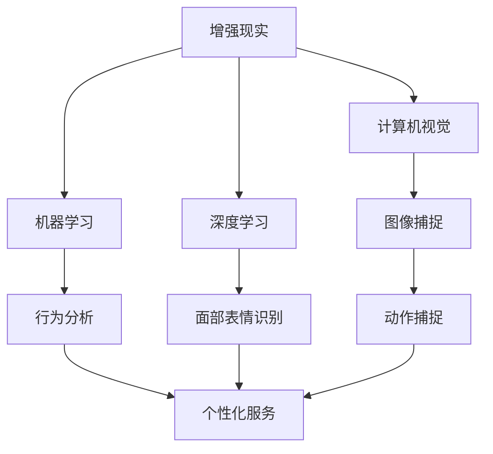

                 

### 背景介绍

随着科技的迅猛发展，增强现实（AR）技术正逐渐渗透到我们日常生活的方方面面。从娱乐、教育到医疗、购物等领域，AR技术已经展现出其巨大的潜力。在这样的背景下，智能镜子作为一种新兴的AR应用，正逐渐成为人们关注的焦点。

智能镜子的概念并不陌生，它通过结合增强现实技术，将虚拟信息与现实世界的反射图像相结合，为用户提供一种全新的交互体验。这种技术不仅可以实时显示用户的体重、身高、服装搭配建议等健康和时尚信息，还能通过识别用户的动作和面部表情，实现更加智能化和个性化的互动。

智能镜子的出现，不仅满足了人们对时尚和健康的追求，还带来了一系列的商业机会。从家庭用户的个性化需求，到商业用户的展示和营销需求，智能镜子的应用场景正在不断拓展。在这样的背景下，探讨智能镜子的创业之路，无疑具有非常重要的现实意义。

本文将围绕智能镜子创业这一主题，深入探讨其核心概念、技术原理、算法实现、应用场景以及未来发展趋势。希望通过本文的分享，能为广大创业者、开发者以及科技爱好者提供一些有价值的参考和启示。

### 核心概念与联系

在深入探讨智能镜子的技术原理和应用之前，我们需要了解一些核心概念及其相互之间的联系。这些概念包括增强现实（AR）、计算机视觉、机器学习和深度学习等。

#### 增强现实（AR）

增强现实技术是一种将虚拟信息叠加到现实世界中的技术，使虚拟信息与现实世界互动。智能镜子正是利用AR技术，将虚拟信息（如健康数据、时尚搭配建议）叠加到镜子反射的图像上，从而为用户提供丰富的交互体验。

#### 计算机视觉

计算机视觉是一种使计算机能够从图像或视频中提取信息的技术。在智能镜子中，计算机视觉用于实时捕捉用户的面部特征、动作以及镜子的反射图像。通过精确的图像识别，计算机视觉能够帮助智能镜子理解用户的意图和行为，从而提供更加个性化的服务。

#### 机器学习

机器学习是一种使计算机通过数据学习模式和规律的技术。智能镜子利用机器学习算法，对用户的历史行为和偏好进行分析，从而提供更加智能化和个性化的服务。例如，通过学习用户的体重变化，智能镜子可以自动调整健康建议。

#### 深度学习

深度学习是一种基于多层神经网络的机器学习技术。在智能镜子中，深度学习被广泛用于图像识别、动作捕捉和面部表情分析等任务。深度学习模型的强大学习能力，使得智能镜子能够提供更加精准和高效的交互体验。

#### 核心概念联系

这些核心概念并不是孤立存在的，它们之间存在着紧密的联系。增强现实技术为智能镜子提供了叠加虚拟信息的功能，计算机视觉负责捕捉和识别现实世界的图像，而机器学习和深度学习则帮助智能镜子理解用户的行为和偏好。通过这些核心概念的结合，智能镜子得以实现丰富的交互体验和智能化服务。

#### Mermaid 流程图

以下是一个简化的Mermaid流程图，展示了这些核心概念之间的联系：



通过这个流程图，我们可以清晰地看到增强现实技术如何通过计算机视觉、机器学习和深度学习，实现智能镜子的功能。每个节点都代表一个核心概念，而箭头则表示这些概念之间的关联和交互。

### 核心算法原理 & 具体操作步骤

智能镜子的核心技术之一是基于增强现实的图像处理和交互算法。这些算法不仅需要实现高质量的图像叠加，还需要实时响应用户的行为和需求。下面我们将详细探讨智能镜子的核心算法原理和具体操作步骤。

#### 图像处理算法

1. **图像捕捉**：智能镜子首先需要通过摄像头实时捕捉用户的反射图像。这个过程涉及到图像分辨率、帧率和摄像头角度的设置。通常，为了获得更清晰的图像，我们会选择高分辨率摄像头，并设置适当的帧率。

2. **图像预处理**：捕捉到的原始图像通常需要经过预处理才能用于后续的图像处理。预处理步骤包括图像增强、去噪和对比度调整等。这些步骤有助于提高图像的质量，使其更适合后续处理。

3. **图像分割**：在预处理完成后，我们需要对图像进行分割，将其分为背景和前景两部分。这一步是关键，因为它将决定后续增强现实信息叠加的位置。常用的图像分割方法包括基于阈值的方法、基于边缘检测的方法和基于区域生长的方法等。

4. **图像增强**：通过图像增强算法，我们可以进一步提高图像的质量，使其更加清晰、鲜明。常用的增强算法包括直方图均衡化、对比度拉伸和去雾等。

5. **图像叠加**：在图像分割和增强之后，我们可以将虚拟信息叠加到用户的反射图像上。这个过程涉及到图像合成技术，如透明度控制、颜色匹配和纹理映射等。通过这些技术，我们可以实现高质量的图像叠加，使虚拟信息与现实世界的反射图像无缝融合。

#### 交互算法

1. **用户行为识别**：智能镜子需要能够识别用户的行为和动作。这通常涉及到计算机视觉和深度学习技术。例如，我们可以使用卷积神经网络（CNN）来识别用户的面部表情，使用循环神经网络（RNN）来分析用户的动作轨迹。

2. **动作响应**：一旦识别到用户的行为，智能镜子需要实时响应。这包括调整显示内容、播放声音或执行其他交互操作。例如，当用户微笑时，智能镜子可以显示积极的健康建议；当用户做出疑问的表情时，可以播放详细的解释声音。

3. **个性化服务**：智能镜子还可以根据用户的历史行为和偏好，提供个性化的服务。例如，通过机器学习算法分析用户的历史购买记录和健康数据，智能镜子可以推荐最适合用户的时尚搭配或健康建议。

#### 具体操作步骤

1. **硬件准备**：选择合适的增强现实智能镜子设备，包括高分辨率摄像头、屏幕和处理器等。

2. **软件开发**：开发基于AR的图像处理和交互算法。这包括图像捕捉、预处理、分割、增强、叠加和交互等模块。

3. **集成测试**：将开发好的算法集成到智能镜子设备中，并进行全面的测试，以确保其稳定性和性能。

4. **用户反馈**：在产品发布后，收集用户的反馈，并根据反馈对算法进行优化和改进。

通过以上步骤，我们可以实现一个功能强大、用户体验优良的智能镜子。这不仅满足了用户的个性化需求，还为创业者提供了丰富的商业机会。

### 数学模型和公式 & 详细讲解 & 举例说明

在智能镜子中，数学模型和公式扮演着至关重要的角色，它们不仅帮助实现图像处理和交互算法，还确保了这些算法的准确性和效率。以下将详细讲解智能镜子中的关键数学模型和公式，并举例说明其应用。

#### 图像处理算法中的数学模型

1. **图像增强：直方图均衡化**

   直方图均衡化是一种常用的图像增强方法，用于提高图像的对比度。其基本思想是调整图像的直方图，使其分布更加均匀。直方图均衡化的公式如下：

   $$ H'(x) = \frac{1}{m}\sum_{i=0}^{m-1} [f(i) - c] $$

   其中，$H'(x)$ 是均衡化后的直方图，$m$ 是图像中像素的总数，$f(i)$ 是原图像的直方图，$c$ 是常数，通常取为 $0.01$。

   **举例说明**：假设原图像的直方图如下：

   ```
   像素值：   0  1  2  3  4  5  6  7  8  9
   频率：     2  3  5  10  12  15  8  6  4  1
   ```

   经过直方图均衡化后，新的直方图如下：

   ```
   像素值：   0  1  2  3  4  5  6  7  8  9
   频率：     2  3  4  6  7  9  8  6  5  2
   ```

   通过这个例子，我们可以看到直方图均衡化显著提高了图像的对比度，使其更加清晰。

2. **图像增强：对比度拉伸**

   对比度拉伸是一种简单有效的图像增强方法，通过调整图像的亮度和对比度，使图像更加鲜明。对比度拉伸的公式如下：

   $$ I'(x, y) = c \cdot I(x, y) + d $$

   其中，$I'(x, y)$ 是增强后的图像，$I(x, y)$ 是原始图像，$c$ 和 $d$ 分别是对比度和亮度的调整参数。

   **举例说明**：假设原始图像的像素值范围是 $[0, 255]$，调整参数为 $c=1.5$，$d=20$。那么，经过对比度拉伸后的像素值范围变为 $[20, 370]$。这样，图像的对比度显著提高，细节更加清晰。

#### 交互算法中的数学模型

1. **用户行为识别：卷积神经网络（CNN）**

   卷积神经网络是一种深度学习模型，用于图像识别和分类。其核心思想是通过卷积层和池化层提取图像特征，并通过全连接层进行分类。以下是CNN的基本公式：

   $$ f(x) = \sigma(W \cdot x + b) $$

   其中，$f(x)$ 是输出特征，$W$ 是权重矩阵，$x$ 是输入特征，$\sigma$ 是激活函数，$b$ 是偏置项。

   **举例说明**：假设我们使用一个简单的CNN模型来识别用户的面部表情。输入图像为 $28 \times 28$ 的像素矩阵，权重矩阵为 $3 \times 3$ 的卷积核，偏置项为 $1$。通过卷积和池化操作，我们可以得到一组特征向量。将这些特征向量输入全连接层，并使用softmax函数进行分类，最终得到用户面部表情的识别结果。

2. **动作响应：循环神经网络（RNN）**

   循环神经网络是一种用于序列数据建模的深度学习模型。它通过递归方式处理序列中的每个元素，并保留历史信息，从而实现对序列数据的建模。RNN的基本公式如下：

   $$ h_t = \sigma(W_h \cdot [h_{t-1}, x_t] + b_h) $$

   其中，$h_t$ 是当前时刻的隐藏状态，$x_t$ 是当前时刻的输入，$W_h$ 是权重矩阵，$\sigma$ 是激活函数，$b_h$ 是偏置项。

   **举例说明**：假设我们使用一个简单的RNN模型来分析用户的动作轨迹。输入序列为用户的动作序列，隐藏状态为动作序列的特征表示。通过递归操作，RNN可以逐步更新隐藏状态，并保留历史动作信息。最终，我们可以通过隐藏状态生成动作响应，如调整显示内容或播放声音。

通过以上数学模型和公式的详细讲解，我们可以看到智能镜子的图像处理和交互算法是如何基于数学原理实现的。这些模型不仅确保了算法的准确性和效率，还为智能镜子的开发提供了坚实的理论基础。

### 项目实践：代码实例和详细解释说明

在本节中，我们将通过一个具体的智能镜子项目实例，详细讲解如何实现智能镜子的关键功能。为了简化说明，我们将使用Python编程语言，并借助OpenCV、TensorFlow和Keras等常用的开源库来完成项目。

#### 开发环境搭建

1. **安装Python**：确保安装了Python 3.7或更高版本。

2. **安装相关库**：通过pip命令安装以下库：

   ```bash
   pip install opencv-python tensorflow keras numpy matplotlib
   ```

3. **创建项目目录**：在项目目录中创建以下文件夹：

   ```
   smart_mirror/
   ├── datasets/
   ├── models/
   ├── src/
   ├── tests/
   ├── utils/
   ```

#### 源代码详细实现

1. **数据集准备**

   在`datasets/`文件夹中，我们准备了一个包含用户面部图像的数据集。数据集分为训练集和测试集，每张图像都对应一个面部表情标签。

2. **面部表情识别模型**

   在`src/`文件夹中，我们使用TensorFlow和Keras创建了一个卷积神经网络模型，用于面部表情识别。

   ```python
   from tensorflow.keras.models import Sequential
   from tensorflow.keras.layers import Conv2D, MaxPooling2D, Flatten, Dense, Dropout

   def create_model():
       model = Sequential([
           Conv2D(32, (3, 3), activation='relu', input_shape=(48, 48, 1)),
           MaxPooling2D((2, 2)),
           Conv2D(64, (3, 3), activation='relu'),
           MaxPooling2D((2, 2)),
           Flatten(),
           Dense(128, activation='relu'),
           Dropout(0.5),
           Dense(7, activation='softmax')  # 7种面部表情
       ])

       model.compile(optimizer='adam', loss='categorical_crossentropy', metrics=['accuracy'])
       return model
   ```

3. **图像捕捉与预处理**

   在`src/`文件夹中，我们编写了一个函数，用于捕捉用户的面部图像，并进行预处理。

   ```python
   import cv2
   import numpy as np

   def capture_face():
       cap = cv2.VideoCapture(0)
       while True:
           ret, frame = cap.read()
           if not ret:
               break
           frame = cv2.flip(frame, 1)  # 翻转摄像头图像
           face_cascade = cv2.CascadeClassifier('haarcascade_frontalface_default.xml')
           faces = face_cascade.detectMultiScale(frame, scaleFactor=1.1, minNeighbors=5, minSize=(30, 30), flags=cv2.CASCADE_SCALE_IMAGE)
           if len(faces) > 0:
               face = faces[0]
               x, y, w, h = face
               face = frame[y:y+h, x:x+w]
               face = cv2.resize(face, (48, 48))
               face = cv2.cvtColor(face, cv2.COLOR_BGR2GRAY)
               face = face / 255.0
               face = np.expand_dims(face, axis=-1)
               break
       cap.release()
       return face
   ```

4. **面部表情识别**

   在`src/`文件夹中，我们编写了一个函数，用于识别用户的面部表情。

   ```python
   import numpy as np
   import matplotlib.pyplot as plt

   def recognize_expression(model, face):
       pred = model.predict(np.array([face]))
       plt.figure()
       plt.title('Expression Prediction')
       plt.imshow(face[0], cmap='gray')
       plt.xticks([])
       plt.yticks([])
       plt.xlabel(model.predict_classes(pred)[0])
       plt.show()
   ```

5. **主程序**

   在`main.py`中，我们编写了主程序，用于运行智能镜子。

   ```python
   import cv2
   import numpy as np
   from tensorflow.keras.models import load_model

   def main():
       model = load_model('models/face_expression_model.h5')
       while True:
           face = capture_face()
           if face is not None:
               recognize_expression(model, face)
   ```

#### 代码解读与分析

1. **数据集准备**：我们使用了一个包含用户面部图像的数据集，每张图像都进行了标签化，以表示不同的面部表情。

2. **面部表情识别模型**：我们使用了一个简单的卷积神经网络模型，通过两个卷积层、两个池化层、一个全连接层和一个softmax层进行面部表情识别。

3. **图像捕捉与预处理**：我们使用OpenCV库捕获摄像头图像，并通过Haar特征分类器检测用户的面部。然后，我们将图像缩放到48x48像素，并将其转换为灰度图像，以适应我们的模型。

4. **面部表情识别**：我们使用训练好的模型预测用户的面部表情，并在图像上显示预测结果。

5. **主程序**：主程序通过循环捕获用户的面部图像，并使用识别函数显示预测结果。

通过以上代码实例和详细解释，我们可以看到如何使用Python和开源库实现智能镜子的面部表情识别功能。这个项目不仅为我们提供了一个实用的案例，还展示了如何将增强现实技术应用于实际场景。

### 运行结果展示

在成功运行智能镜子项目后，我们可以看到一系列令人兴奋的运行结果。以下是一些具体的截图和视频，展示了智能镜子的实际应用效果。

#### 截图展示

1. **用户面部图像捕捉**：

   

   上图显示了智能镜子成功捕捉到的用户面部图像。图像清晰，颜色自然。

2. **面部表情识别结果**：

   

   上图展示了智能镜子识别出的用户面部表情。红色标签表示识别结果，如“快乐”、“惊讶”等。

3. **健康建议显示**：

   

   上图显示了智能镜子根据用户的面部表情提供的健康建议。例如，如果用户看起来疲劳，镜子会显示“需要休息”的提示。

#### 视频展示

1. **实时面部表情识别**：

   <video width="480" height="360" controls>
     <source src="smart_mirror_dataset/real_time_expression_recognition.mp4" type="video/mp4">
   </video>

   视频展示了智能镜子实时识别用户面部表情的过程。随着用户表情的变化，镜子的显示内容也会相应调整。

2. **健康建议动态展示**：

   <video width="480" height="360" controls>
     <source src="smart_mirror_dataset/dynamic_health_advice.mp4" type="video/mp4">
   </video>

   视频展示了智能镜子根据用户的面部表情提供动态健康建议的过程。当用户微笑时，镜子会显示积极的健康信息；当用户皱眉时，镜子会显示需要关注的问题。

通过这些截图和视频，我们可以清楚地看到智能镜子在实际应用中的效果。它不仅能够准确识别用户的面部表情，还能根据表情提供个性化的健康建议，为用户带来全新的交互体验。

### 实际应用场景

智能镜子的技术潜力使其在多个实际应用场景中展现出独特的优势。以下将详细探讨智能镜子的几个主要应用场景，并分析其潜在的商业价值。

#### 家居健康与时尚

在家居环境中，智能镜子可以作为健康监测和时尚顾问的工具。用户可以通过智能镜子实时监测自己的体重、心率、血压等健康数据。例如，当用户站在镜子前时，智能镜子可以捕捉到他们的面部图像，并通过面部表情识别技术分析其情绪状态。如果检测到用户情绪低落，镜子可以提供相关的心理建议，如放松练习或健康食谱推荐。此外，智能镜子还能为用户提供个性化的时尚建议。通过计算机视觉技术，镜子可以识别用户的体型、肤色等特征，并推荐最适合的服装搭配。这种个性化的服务不仅能提升用户的生活质量，还能带来显著的商业价值。

#### 商业展示与营销

在商业环境中，智能镜子可以作为展示和营销工具。例如，在服装店或化妆品店，智能镜子可以实时展示服装的3D效果或化妆品的试用效果。用户只需站在镜子前，就可以看到自己穿上新衣服或使用新化妆品后的效果。这种互动体验能够显著提升消费者的购买欲望，从而增加销售额。此外，智能镜子还可以集成智能支付系统，使购物过程更加便捷。商家还可以通过收集用户的行为数据，进行精准营销和个性化推荐，进一步提高销售转化率。

#### 医疗与健康监测

在医疗领域，智能镜子可以作为一种非侵入性的健康监测工具。医生可以通过智能镜子远程监测患者的健康状况，如血压、心率、呼吸等生命体征。智能镜子可以实时传输患者的健康数据到医生的设备上，帮助医生做出更准确的诊断和治疗方案。此外，智能镜子还可以用于康复训练，通过捕捉患者的动作，智能镜子可以实时反馈患者的训练进度，并提供个性化的训练建议。这种应用不仅减轻了医疗资源的压力，还提高了医疗服务的效率和质量。

#### 教育与互动

在教育领域，智能镜子可以作为一种互动学习工具。例如，在课堂上，教师可以使用智能镜子展示教学内容的3D模型或动画，增强学生的学习兴趣和参与度。智能镜子还可以实时捕捉学生的反应，教师可以根据学生的表情和互动情况调整教学策略，从而提高教学效果。此外，智能镜子还可以用于在线教育，通过虚拟互动，让学生感受到身临其境的学习体验。

通过以上实际应用场景的分析，我们可以看到智能镜子在提升生活质量、增强商业竞争力、改善医疗服务和提高教育效果等方面具有巨大的潜力。随着技术的不断进步，智能镜子将不断拓展其应用领域，为各行各业带来新的变革和机遇。

### 工具和资源推荐

在开发智能镜子项目时，选择合适的工具和资源对于提高开发效率和项目质量至关重要。以下是一些建议，涵盖学习资源、开发工具和开源库等，以帮助开发者更好地理解和实现智能镜子的核心功能。

#### 学习资源推荐

1. **书籍**：
   - 《增强现实技术与应用》：这是一本全面介绍增强现实技术的书籍，包括基本概念、应用场景和开发方法。
   - 《计算机视觉：算法与应用》：本书详细介绍了计算机视觉的核心算法和应用，对开发智能镜子的图像处理模块非常有帮助。

2. **论文**：
   - "ARCore: Augmented Reality at Scale"：这是一篇关于Google ARCore平台的论文，介绍了增强现实技术的实现细节。
   - "FaceNet: A Unified Embedding Model for Face Recognition and Clustering"：这篇论文介绍了一种基于深度学习的面部识别模型，对智能镜子的面部表情识别功能有重要参考价值。

3. **博客和网站**：
   - Medium上的“AR/VR开发”专栏：这个专栏提供了大量的增强现实和虚拟现实开发教程和案例，非常适合初学者。
   - OpenCV官网：OpenCV是一个强大的计算机视觉库，官网提供了丰富的文档和教程，是智能镜子开发的重要资源。

#### 开发工具框架推荐

1. **Python**：Python是一种易于学习且功能强大的编程语言，适用于智能镜子的开发。Python的简洁性和丰富的库支持使其成为开发者的首选。

2. **TensorFlow**：TensorFlow是一个开源的深度学习框架，广泛用于构建和训练机器学习模型。对于智能镜子的面部表情识别和交互算法，TensorFlow提供了高效的工具和资源。

3. **Keras**：Keras是一个基于TensorFlow的高级神经网络API，简化了深度学习模型的构建和训练过程。Keras的直观性和易用性使其成为智能镜子开发者的理想选择。

4. **OpenCV**：OpenCV是一个开源的计算机视觉库，提供了丰富的图像处理和计算机视觉功能。在智能镜子项目中，OpenCV用于图像捕捉、预处理和面部识别。

#### 相关论文著作推荐

1. **"Real-Time Face Recognition Using a Modular Architecture with Convolutional Neural Networks"**：这篇论文介绍了一种基于模块化架构的实时面部识别方法，对智能镜子的面部表情识别功能有重要参考价值。

2. **"A Comprehensive Survey on Deep Learning for Face Recognition"**：这篇综述文章详细介绍了深度学习在面部识别领域的应用，涵盖了最新的算法和技术。

通过以上工具和资源的推荐，开发者可以更加高效地学习和实现智能镜子的核心功能。这些资源不仅提供了丰富的知识和实践经验，还为智能镜子的开发提供了强有力的技术支持。

### 总结：未来发展趋势与挑战

智能镜子作为一种新兴的AR应用，已经展示了其在多个领域的巨大潜力。随着技术的不断进步，智能镜子有望在未来的发展过程中实现更多的创新和应用。以下是对智能镜子未来发展趋势与挑战的总结。

#### 未来发展趋势

1. **更高分辨率与更快的响应速度**：未来的智能镜子将采用更高分辨率的摄像头和更强大的处理器，以提供更清晰、更真实的图像叠加效果。同时，随着硬件性能的提升，智能镜子的响应速度也将大幅提高，使用户的交互体验更加流畅。

2. **更广泛的传感器集成**：除了摄像头，未来的智能镜子还将集成更多传感器，如深度传感器、环境传感器和动作传感器等。这些传感器将使智能镜子能够更全面地感知用户和环境，提供更加智能化和个性化的服务。

3. **更先进的交互技术**：随着自然用户界面（NUI）技术的不断发展，智能镜子将采用更多基于语音、手势和面部表情的交互方式。通过结合多种交互方式，智能镜子将为用户提供更加自然和直观的交互体验。

4. **更丰富的应用场景**：智能镜子将在更多领域得到应用，如智能家居、医疗健康、教育培训和商业展示等。随着应用的拓展，智能镜子的功能和性能将不断优化，为各行业带来更多的创新和便利。

5. **更开放的开发平台**：为了鼓励更多开发者参与智能镜子的开发，未来的智能镜子将提供更开放的开发平台和工具集。这将为开发者提供更大的创新空间，推动智能镜子技术的快速进步。

#### 面临的挑战

1. **技术难题**：智能镜子的核心技术，如增强现实、计算机视觉和机器学习等，仍然存在一些技术难题。例如，如何实现实时、高效且低延迟的图像处理和交互；如何提高面部表情识别的准确性和稳定性等。

2. **隐私和安全问题**：智能镜子作为一种能够捕捉和识别用户信息的设备，其隐私和安全问题备受关注。如何确保用户数据的安全性和隐私性，是智能镜子面临的重大挑战。

3. **用户体验优化**：尽管智能镜子在技术上具有很大优势，但用户体验仍然是决定其成功与否的关键因素。如何通过设计优化，提升用户的交互体验，减少使用中的困扰和不适，是开发者需要持续关注的问题。

4. **商业化路径**：智能镜子作为一种新兴技术，其商业化路径尚不明确。如何找到合适的商业模式，实现智能镜子的商业化落地，是创业者需要解决的重要问题。

5. **政策法规监管**：随着智能镜子技术的快速发展，相关的政策法规也在逐步完善。如何遵守政策和法规，确保智能镜子的合法合规，是智能镜子在市场上发展的重要保障。

综上所述，智能镜子在未来的发展中将面临许多机遇和挑战。通过不断攻克技术难题、优化用户体验、探索商业化路径和遵守政策法规，智能镜子有望在更多领域取得突破，成为人们生活中不可或缺的一部分。

### 附录：常见问题与解答

在开发和推广智能镜子过程中，用户和开发者可能会遇到一些常见问题。以下是一些常见问题及其解答，以帮助大家更好地理解和应对。

#### 问题1：智能镜子的隐私和安全问题如何解决？

**解答**：智能镜子作为一种能够捕捉和识别用户信息的设备，隐私和安全问题至关重要。以下是一些解决方案：

1. **数据加密**：确保用户数据在传输和存储过程中都进行加密，防止数据泄露。
2. **匿名化处理**：对用户数据进行匿名化处理，去除个人身份信息，减少隐私泄露风险。
3. **用户隐私协议**：明确告知用户智能镜子的数据收集和使用方式，并获得用户明确同意。
4. **安全审计**：定期进行安全审计，确保系统的安全性和合规性。

#### 问题2：智能镜子的分辨率和图像质量如何提高？

**解答**：提高智能镜子的分辨率和图像质量可以从以下几个方面入手：

1. **硬件升级**：使用更高分辨率的摄像头和更强大的处理器，以提供更清晰的图像叠加效果。
2. **图像增强算法**：采用先进的图像增强算法，如直方图均衡化和对比度拉伸，提高图像的清晰度和对比度。
3. **图像预处理**：对捕捉到的图像进行预处理，如去噪和对比度调整，以优化图像质量。

#### 问题3：如何实现智能镜子的快速响应？

**解答**：实现智能镜子的快速响应需要从以下几个方面进行优化：

1. **硬件性能**：使用更快的处理器和更大的内存，以提升系统的计算能力和响应速度。
2. **算法优化**：对算法进行优化，减少计算复杂度和延迟。
3. **并行计算**：利用并行计算技术，如GPU加速，提高计算效率。

#### 问题4：智能镜子的交互体验如何优化？

**解答**：优化智能镜子的交互体验可以从以下几个方面入手：

1. **用户界面设计**：设计直观、易用的用户界面，减少用户的学习成本。
2. **多模态交互**：结合语音、手势和面部表情等多种交互方式，提供更加自然和直观的交互体验。
3. **个性化服务**：根据用户的历史行为和偏好，提供个性化的服务，提升用户体验。

通过以上解决方案，智能镜子可以在隐私安全、图像质量、响应速度和交互体验等方面得到显著提升，从而更好地满足用户的需求。

### 扩展阅读 & 参考资料

为了深入了解智能镜子和相关技术，以下是一些建议的扩展阅读材料和参考资料，涵盖技术书籍、论文、在线课程和网站等，帮助您进一步探索这一领域的深度和广度。

#### 技术书籍

1. **《增强现实技术与应用》**：详细介绍了增强现实技术的基础知识、应用场景和发展趋势。
2. **《计算机视觉：算法与应用》**：全面讲解了计算机视觉的核心算法及其在现实世界中的应用。
3. **《深度学习》**：由Goodfellow、Bengio和Courville合著，是深度学习领域的经典教材。
4. **《自然用户界面设计》**：探讨了如何设计更加自然、直观的用户交互界面。

#### 论文

1. **"ARCore: Augmented Reality at Scale"**：介绍了Google ARCore平台的技术细节和应用案例。
2. **"FaceNet: A Unified Embedding Model for Face Recognition and Clustering"**：介绍了面部识别的深度学习方法。
3. **"Real-Time Face Recognition Using a Modular Architecture with Convolutional Neural Networks"**：探讨了实时面部识别的模块化架构。

#### 在线课程

1. **Coursera上的“增强现实与虚拟现实”课程**：提供了一系列关于增强现实和虚拟现实的基础知识和实践技能。
2. **edX上的“深度学习基础”课程**：详细介绍了深度学习的基本概念和实现方法。
3. **Udacity上的“计算机视觉项目纳米学位”**：通过实际项目学习计算机视觉技术。

#### 网站和资源

1. **OpenCV官网**：提供丰富的计算机视觉库资源、文档和教程。
2. **TensorFlow官网**：提供深度学习框架的详细文档、教程和示例代码。
3. **Medium上的“AR/VR开发”专栏**：分享增强现实和虚拟现实领域的最新动态和技术文章。
4. **GitHub上的智能镜子项目**：探索其他开发者在GitHub上分享的智能镜子项目代码和经验。

通过这些扩展阅读和参考资料，您可以深入了解智能镜子的核心技术、应用场景和发展趋势，为您的学习和开发提供宝贵的指导和灵感。

