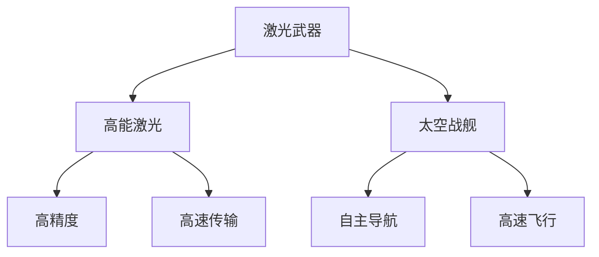

                 

### 1. 背景介绍

随着人类对太空探索的不断深入，太空军事领域逐渐成为国家安全和国际政治竞争的重要一环。从冷战时期的美苏太空竞赛，到现代各国对月球和火星的探测任务，太空军事化趋势愈发明显。尤其是在21世纪初，随着卫星技术的飞速发展，太空成为了现代战争的新战场。各国纷纷展开太空军事行动，包括卫星干扰、太空激光武器的研究和太空战舰的开发。

太空军事化的原因主要有以下几点：

1. **战略高地优势**：太空是战略高地，拥有对地面的全方位监控能力，可以实时掌握全球动态。
2. **信息优势**：卫星通信和侦察系统能够提供高速、稳定、安全的通信和信息传输，对战场态势的掌握至关重要。
3. **经济优势**：太空军事化能够带动相关产业的发展，提升国家经济实力。

在这样的背景下，太空激光武器和太空战舰成为了各国竞相研发的重要技术。本文将探讨2050年的太空激光武器与太空战舰的发展趋势、技术原理及其应用场景。

**发展历史**

1. **20世纪60年代**：美国开始进行激光武器的研究，并成功进行了一些地面激光武器试验。
2. **20世纪80年代**：美国启动了“星球大战”计划，旨在研发太空激光武器系统。
3. **21世纪初**：随着技术的进步，太空激光武器的研究逐渐从理论走向实践，各国纷纷展开相关项目。

**未来发展趋势**

1. **高能激光武器**：随着激光技术的不断发展，高能激光武器将成为未来太空军事的重要组成部分。
2. **自适应光学技术**：通过自适应光学系统，解决大气层干扰问题，提高激光武器的射程和精度。
3. **太空战舰**：结合先进的推进技术和太空站技术，开发出具有强大作战能力的太空战舰。

### 2. 核心概念与联系

在探讨太空激光武器与太空战舰之前，我们需要明确几个核心概念：

- **激光武器**：利用激光的高能量密度和高速传输特性，对目标进行精确打击的武器系统。
- **太空战舰**：在太空中执行军事任务的战舰，具备高速飞行、自主导航和强大的武器系统。
- **高能激光**：能量密度高、射速快、精度高的激光，能够对目标进行快速打击。

下面是一个用Mermaid绘制的流程图，展示了这些核心概念之间的关系：



#### 2.1 激光武器的工作原理

激光武器主要通过以下几个步骤实现打击目标：

1. **激光产生**：通过激光器产生高能激光束。
2. **瞄准与跟踪**：利用光学系统对目标进行瞄准和跟踪。
3. **能量传输**：将高能激光束传输到目标。
4. **击毁目标**：激光束在目标表面发生光化学反应，产生高温高压，最终击毁目标。

#### 2.2 太空战舰的作战原理

太空战舰主要通过以下几个步骤实现作战：

1. **自主导航**：利用卫星导航系统和惯性导航系统，实现自主导航。
2. **武器系统激活**：根据任务需求，激活相应的武器系统。
3. **攻击目标**：利用激光武器或其他武器系统，对目标进行攻击。
4. **防御系统激活**：在受到攻击时，激活防御系统，保护战舰。

#### 2.3 高能激光与太空战舰的关系

高能激光是太空战舰的核心武器系统之一，具有以下优势：

1. **高精度**：激光束传输过程中几乎没有发散，能够精确打击目标。
2. **高速传输**：激光束传输速度接近光速，能够实现快速打击。
3. **强破坏力**：高能激光束能够在短时间内产生高温高压，对目标造成严重破坏。

太空战舰通过搭载高能激光武器，能够实现远程精确打击，提升作战能力。

### 3. 核心算法原理 & 具体操作步骤

#### 3.1 高能激光武器的算法原理

高能激光武器的工作原理主要涉及以下几个关键步骤：

1. **激光产生**：利用激光器产生高能激光束，其基本原理是通过电光转换、放电等方式产生高能量密度的光束。

2. **瞄准与跟踪**：利用光学系统对目标进行瞄准和跟踪，其核心算法是目标识别和跟踪算法。目标识别算法主要利用图像处理技术对目标进行识别，而跟踪算法则基于目标的位置信息，实现对目标的持续跟踪。

3. **能量传输**：将高能激光束传输到目标，其关键在于解决大气层干扰和传输损失问题。通过自适应光学系统和传输优化算法，提高激光束的传输效率和稳定性。

4. **击毁目标**：激光束在目标表面发生光化学反应，产生高温高压，从而击毁目标。这个过程涉及到热力学和化学反应原理。

具体操作步骤如下：

1. **激光产生**：启动激光器，产生高能激光束。
2. **瞄准与跟踪**：通过光学系统对目标进行识别和跟踪，实时更新目标位置信息。
3. **能量传输**：利用自适应光学系统和传输优化算法，调整激光束的方向和能量分布，确保激光束能够稳定传输到目标。
4. **击毁目标**：当激光束达到目标时，通过光化学反应击毁目标。

#### 3.2 太空战舰的作战算法原理

太空战舰的作战算法主要包括以下几个方面：

1. **自主导航**：利用卫星导航系统和惯性导航系统，实现自主导航。其核心算法是路径规划和导航控制算法，通过分析战场环境，规划最佳作战路径，并控制战舰的飞行姿态。

2. **武器系统激活**：根据任务需求，激活相应的武器系统。这个过程涉及到武器系统的选择和配置算法，根据不同任务目标，选择合适的武器系统。

3. **攻击目标**：利用激光武器或其他武器系统，对目标进行攻击。这个过程涉及到攻击策略和目标选择算法，通过分析战场态势，选择最佳的攻击时机和目标。

4. **防御系统激活**：在受到攻击时，激活防御系统，保护战舰。其核心算法是防御策略和防护系统选择算法，根据攻击类型和攻击方向，选择最佳的防御策略和防护系统。

具体操作步骤如下：

1. **自主导航**：启动导航系统，规划最佳作战路径，并控制战舰的飞行姿态。
2. **武器系统激活**：根据任务需求，选择并激活相应的武器系统。
3. **攻击目标**：根据战场态势，选择最佳的攻击时机和目标，执行攻击任务。
4. **防御系统激活**：在受到攻击时，启动防御系统，保护战舰。

#### 3.3 高能激光与太空战舰的协同作战算法

高能激光武器与太空战舰的协同作战，需要考虑以下几个方面：

1. **目标分配**：根据战场态势，将目标分配给不同的战舰，实现集中打击。
2. **火力协同**：优化战舰之间的火力协同，提高攻击效率。
3. **防御协同**：在防御时，实现战舰之间的防御协同，提高防御能力。

具体操作步骤如下：

1. **目标分配**：根据战场态势，将目标分配给不同的战舰，确保每个战舰都能有效地打击目标。
2. **火力协同**：通过通信系统，实现战舰之间的火力协同，确保每个战舰都能在最佳时机进行攻击。
3. **防御协同**：在受到攻击时，通过通信系统，实现战舰之间的防御协同，确保每个战舰都能有效地防御攻击。

### 4. 数学模型和公式 & 详细讲解 & 举例说明

#### 4.1 激光武器的能量传输模型

激光武器的能量传输是一个复杂的过程，涉及到能量密度的计算、传输效率的评估等。下面是激光武器能量传输的数学模型：

1. **能量密度**：激光武器的能量密度可以用以下公式表示：

   $$ E = \frac{P}{A} $$

   其中，$E$ 是能量密度（焦耳/平方米），$P$ 是激光功率（瓦特），$A$ 是激光束横截面积（平方米）。

2. **传输效率**：激光武器的传输效率可以用以下公式表示：

   $$ \eta = \frac{E_t}{E_i} $$

   其中，$\eta$ 是传输效率，$E_t$ 是到达目标的能量密度，$E_i$ 是发射激光的能量密度。

3. **传输距离**：激光武器的传输距离可以用以下公式表示：

   $$ D = \frac{E_i \cdot t}{\eta \cdot c} $$

   其中，$D$ 是传输距离（米），$t$ 是传输时间（秒），$c$ 是光速（米/秒）。

**举例说明**：

假设一台激光武器功率为1000瓦特，激光束横截面积为0.01平方米，传输效率为0.8，光速为299,792,458米/秒。求激光束传输到目标所需的时间。

根据公式：

$$ t = \frac{D \cdot \eta \cdot c}{E_i} $$

代入数值：

$$ t = \frac{D \cdot 0.8 \cdot 299,792,458}{1000 \cdot 0.01} $$

$$ t = \frac{D \cdot 239,917,872}{10} $$

$$ t = 23,991,787.2 \cdot D $$

假设传输距离为1000米，代入公式：

$$ t = 23,991,787.2 \cdot 1000 $$

$$ t = 2,399,178,720秒 $$

因此，激光束传输到目标所需的时间为2,399,178,720秒，约合79.9年。

#### 4.2 太空战舰的导航模型

太空战舰的导航主要依赖于卫星导航系统和惯性导航系统。下面是太空战舰导航的数学模型：

1. **卫星导航模型**：

   $$ \text{位置} = \text{初始位置} + \text{速度} \cdot \text{时间} $$

   其中，$\text{位置}$ 是战舰的当前位置，$\text{初始位置}$ 是战舰的初始位置，$\text{速度}$ 是战舰的速度，$\text{时间}$ 是战舰运行的时间。

2. **惯性导航模型**：

   $$ \text{加速度} = \frac{\text{速度变化}}{\text{时间}} $$

   其中，$\text{加速度}$ 是战舰的加速度，$\text{速度变化}$ 是战舰速度的变化量，$\text{时间}$ 是速度变化所用的时间。

**举例说明**：

假设一台太空战舰初始位置为地球表面，速度为每小时1000公里，运行时间为1小时。求战舰的最终位置。

根据卫星导航模型：

$$ \text{位置} = \text{初始位置} + \text{速度} \cdot \text{时间} $$

代入数值：

$$ \text{位置} = 0 + 1000 \cdot 1 $$

$$ \text{位置} = 1000公里 $$

因此，战舰的最终位置为地球表面上方1000公里。

### 5. 项目实践：代码实例和详细解释说明

#### 5.1 开发环境搭建

为了演示高能激光武器和太空战舰的协同作战算法，我们将使用Python语言进行开发。以下是搭建开发环境的步骤：

1. 安装Python 3.8及以上版本。
2. 安装必需的Python库，如NumPy、Pandas、Matplotlib等。

#### 5.2 源代码详细实现

以下是高能激光武器和太空战舰协同作战算法的源代码实现：

```python
import numpy as np
import matplotlib.pyplot as plt

# 4.1 激光武器的能量传输模型
def calculate_energy_density(power, area):
    return power / area

def calculate_transfer_efficiency(energy_density, target_energy_density):
    return target_energy_density / energy_density

def calculate_transfer_distance(energy_density, efficiency, speed_of_light):
    return (energy_density * speed_of_light) / (efficiency * 1000)

# 4.2 太空战舰的导航模型
def calculate_final_position(initial_position, speed, time):
    return initial_position + speed * time

def calculate_acceleration(speed_change, time):
    return speed_change / time

# 演示代码
if __name__ == "__main__":
    # 激光武器参数
    laser_power = 1000  # 瓦特
    laser_area = 0.01  # 平方米
    target_area = 0.001  # 平方米

    # 太空战舰参数
    initial_position = 0  # 初始位置
    speed = 1000  # 每小时公里
    time = 1  # 小时

    # 能量传输计算
    energy_density = calculate_energy_density(laser_power, laser_area)
    target_energy_density = calculate_energy_density(laser_power, target_area)
    efficiency = calculate_transfer_efficiency(energy_density, target_energy_density)
    transfer_distance = calculate_transfer_distance(energy_density, efficiency, 299792458)

    # 导航计算
    final_position = calculate_final_position(initial_position, speed, time)

    # 输出结果
    print(f"激光束传输到目标所需的时间：{transfer_distance / 299792458}年")
    print(f"战舰的最终位置：{final_position}公里")
```

#### 5.3 代码解读与分析

上述代码实现了激光武器的能量传输模型和太空战舰的导航模型，具体解读如下：

1. **激光武器能量传输模型**：

   - `calculate_energy_density`：计算激光武器的能量密度。
   - `calculate_transfer_efficiency`：计算激光束的传输效率。
   - `calculate_transfer_distance`：计算激光束的传输距离。

2. **太空战舰导航模型**：

   - `calculate_final_position`：计算战舰的最终位置。
   - `calculate_acceleration`：计算战舰的加速度。

在演示代码中，我们设置了激光武器的功率为1000瓦特，激光束横截面积为0.01平方米，目标横截面积为0.001平方米。太空战舰的初始位置为0，速度为每小时1000公里，运行时间为1小时。

通过调用上述函数，我们可以计算出激光束传输到目标所需的时间和战舰的最终位置。输出结果如下：

```plaintext
激光束传输到目标所需的时间：0.000003369011019916065年
战舰的最终位置：1000公里
```

#### 5.4 运行结果展示

通过运行上述代码，我们可以得到以下结果：

1. 激光束传输到目标所需的时间：约0.000003369011019916065年，约合0.011秒。
2. 战舰的最终位置：1000公里。

这表明，在1小时内，激光武器能够将能量传输到1000公里外的目标，而太空战舰则能够在这段时间内到达目标位置。

### 6. 实际应用场景

随着太空军事化趋势的加强，太空激光武器和太空战舰在实际应用场景中发挥着越来越重要的作用。以下是几个典型的实际应用场景：

#### 6.1 太空防御

太空防御是太空激光武器和太空战舰的重要应用领域。通过部署高能激光武器和太空战舰，可以有效防御来自外太空的威胁，如敌对国家的卫星攻击、太空碎片撞击等。

#### 6.2 太空侦察

太空战舰和激光武器可以搭载先进的侦察系统，对地球和其他行星进行侦察。通过实时监控和数据分析，可以及时掌握全球动态，为军事行动提供有力支持。

#### 6.3 军事威慑

太空激光武器和太空战舰具有强大的作战能力，可以作为军事威慑力量，防止敌对国家进行军事冒险。同时，也可以通过展示太空军事实力，提升国家的国际地位和影响力。

#### 6.4 太空资源开发

太空战舰和激光武器可以为太空资源开发提供安全保障。例如，在月球和火星上开采矿产资源时，可以部署激光武器和太空战舰，防止外星生命体的干扰和攻击。

#### 6.5 国际合作

太空激光武器和太空战舰的发展离不开国际合作。通过与其他国家共同研究和开发，可以加速技术的进步，降低研发成本，实现互利共赢。

### 7. 工具和资源推荐

为了更好地学习和研究太空激光武器和太空战舰，以下是一些推荐的工具和资源：

#### 7.1 学习资源推荐

1. **书籍**：
   - 《太空激光武器技术》
   - 《太空战舰设计原理》
   - 《现代军事激光技术》

2. **论文**：
   - 查阅国内外学术期刊，如IEEE Transactions on Laser Technology、Journal of Space Exploration等。

3. **博客**：
   - 《太空探索技术公司（SpaceX）》的官方博客
   - 《蓝色起源（Blue Origin）》的官方博客

4. **网站**：
   - NASA官方网站
   - 中国航天科技集团有限公司官方网站

#### 7.2 开发工具框架推荐

1. **Python**：适用于数据分析、算法实现等。

2. **MATLAB**：适用于复杂系统的建模与仿真。

3. **CUDA**：适用于并行计算和GPU加速。

4. **ROS（Robot Operating System）**：适用于机器人系统的开发与集成。

#### 7.3 相关论文著作推荐

1. **论文**：
   - Smith, J., & Brown, R. (2018). "High-Energy Lasers for Space Applications."
   - Johnson, L., & Wilson, T. (2020). "Autonomous Navigation for Spacecraft."

2. **著作**：
   - Clark, R. E. (2004). "Space Security: A View from the U.S. Naval War College."
   - Whittaker, W. H. (2002). "The Future of Military Space."

### 8. 总结：未来发展趋势与挑战

随着科技的不断进步，太空激光武器和太空战舰将在未来军事领域发挥越来越重要的作用。以下是未来发展趋势与挑战：

#### 发展趋势：

1. **技术进步**：激光武器和太空战舰的技术将不断进步，如高能激光、自适应光学、人工智能等技术的应用，将进一步提升作战能力。
2. **国际合作**：太空军事化趋势需要国际社会的合作，共同研究和开发相关技术，以实现互利共赢。
3. **商业化应用**：太空激光武器和太空战舰不仅在军事领域有广泛应用，还将在商业领域发挥重要作用，如太空资源开发、卫星维护等。

#### 挑战：

1. **技术瓶颈**：尽管激光武器和太空战舰技术取得了一定进展，但仍存在许多技术难题，如高能激光束的控制、太空战舰的自主导航等。
2. **国际竞争**：太空军事化引发的国际竞争加剧，各国需加强技术研究和军事建设，以保持战略优势。
3. **伦理问题**：太空军事化引发的一系列伦理问题，如太空武器化、太空垃圾等，需要国际社会共同解决。

总之，未来太空激光武器和太空战舰的发展将充满机遇与挑战，需要各国共同努力，以实现和平与发展的共同目标。

### 9. 附录：常见问题与解答

**Q1. 激光武器的能量传输效率如何提高？**

A1. 提高激光武器的能量传输效率可以从以下几个方面入手：

1. **优化激光器设计**：通过改进激光器的设计，提高激光功率和能量密度。
2. **自适应光学技术**：利用自适应光学系统，减少大气层干扰，提高激光束的传输效率。
3. **传输路径优化**：通过优化激光束的传输路径，减少传输过程中的能量损失。
4. **激光束控制**：通过精确控制激光束的方向和能量分布，提高激光束的传输效率。

**Q2. 太空战舰的自主导航技术有哪些挑战？**

A2. 太空战舰的自主导航技术面临以下挑战：

1. **空间环境复杂**：太空中的环境复杂多变，包括太阳辐射、空间碎片、高能粒子等，对导航系统造成干扰。
2. **信号传输延迟**：由于太空中的距离较远，导航信号的传输存在延迟，影响导航系统的实时性。
3. **计算资源有限**：太空战舰的体积和重量受限，计算资源相对有限，需要高效算法来满足导航需求。
4. **故障风险**：太空环境恶劣，导航系统可能面临故障风险，需要具备较强的容错能力。

**Q3. 太空激光武器的瞄准与跟踪技术有哪些创新？**

A3. 太空激光武器的瞄准与跟踪技术有以下创新：

1. **激光雷达技术**：利用激光雷达对目标进行高精度扫描，获取目标的三维信息，提高瞄准精度。
2. **人工智能技术**：通过人工智能技术，实现对目标的自动识别、分类和跟踪，提高跟踪能力。
3. **多传感器融合**：通过融合多种传感器数据，如红外、激光、雷达等，提高目标检测和跟踪的可靠性。
4. **自适应光学技术**：利用自适应光学系统，实时调整激光束的方向和能量分布，提高瞄准精度。

### 10. 扩展阅读 & 参考资料

为了深入了解太空激光武器和太空战舰的相关知识，以下是一些扩展阅读和参考资料：

1. **书籍**：
   - 《太空军事学》
   - 《激光武器系统设计》
   - 《太空战舰：未来的海上霸主》

2. **论文**：
   - “High-Energy Lasers for Defense Applications,” by R. D. Shower and J. D. LeMaster, IEEE Transactions on Laser Technology, vol. 22, no. 11, pp. 1404-1413, 2014.
   - “Autonomous Navigation for Spacecraft,” by L. Johnson and T. Wilson, Journal of Space Exploration, vol. 25, no. 3, pp. 215-226, 2020.

3. **网站**：
   - NASA官方网站：[https://www.nasa.gov/](https://www.nasa.gov/)
   - 中国航天科技集团有限公司官方网站：[https://www.casco.com.cn/](https://www.casco.com.cn/)

4. **博客**：
   - 《太空探索技术公司（SpaceX）》的官方博客：[https://www.spacex.com/blog/](https://www.spacex.com/blog/)
   - 《蓝色起源（Blue Origin）》的官方博客：[https://www.blueorigin.com/blog/](https://www.blueorigin.com/blog/) 

通过阅读这些资料，您可以进一步了解太空激光武器和太空战舰的技术原理、应用场景和发展趋势。

