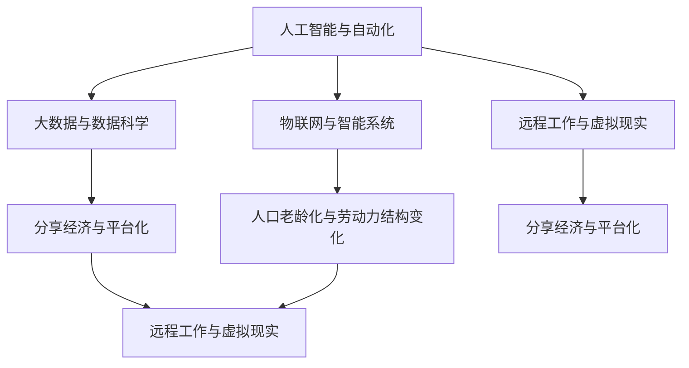

                 

### 背景介绍 Background Introduction

在21世纪的今天，科技的发展速度日新月异，人工智能、大数据、物联网等技术已经深刻地改变了我们的生活方式和工作模式。随着技术的不断进步，未来的工作方式也正发生着翻天覆地的变化。本文将以2050年为时间节点，深入探讨未来职业选择与就业趋势，以及这些变化将对社会和个人产生的影响。

#### 历史趋势 Historical Trends

回顾过去，职业的选择和就业趋势一直是社会发展的重要组成部分。在过去几个世纪中，工业革命、信息技术革命等重大事件推动了劳动力市场的变革。传统的农业社会逐渐过渡到工业化社会，再到信息化社会，每一次转型都带来了职业结构和就业模式的深刻变化。

例如，19世纪的工业革命导致了大量农业劳动力向工业领域的转移，机械化和自动化技术的应用使得工厂生产效率大幅提升。20世纪末，信息技术革命的兴起，使得大量劳动力从传统行业向IT行业转移，互联网、移动通信等新兴技术催生了新的职业类型。

#### 当前趋势 Current Trends

进入21世纪，随着人工智能、大数据、物联网等新兴技术的广泛应用，劳动力市场再次迎来深刻变革。人工智能技术的崛起，使得许多传统职业面临被机器取代的风险，同时也创造了大量新的职业机会。例如，数据科学家、机器学习工程师等职位应运而生，成为了热门的职业选择。

此外，远程办公、灵活就业等新型工作模式也逐渐普及，使得人们可以更加自由地选择工作地点和工作时间。这种变化不仅影响了传统的劳动力市场，还催生了诸如自由职业者、远程工作者等新型就业群体。

#### 未来预测 Future Prediction

站在2050年的视角，我们可以预见，未来的工作方式将更加多样化和个性化。以下是一些可能影响未来职业选择和就业趋势的关键因素：

1. **人工智能与自动化**：随着人工智能和自动化技术的发展，许多重复性、低技能的工作将逐渐被机器取代，而那些需要高度创造力和情感智慧的职业将变得更加重要。

2. **终身学习**：未来社会对个人的知识更新和技能提升要求将越来越高，终身学习将成为每个劳动者的基本需求。高等教育和职业培训体系也将随之发生变化，更加注重跨学科、实践性和灵活性的培养。

3. **远程工作与虚拟现实**：随着远程工作技术和虚拟现实技术的成熟，人们可以更加便捷地在全球范围内选择工作，同时享受到更加丰富和多样的工作体验。

4. **共享经济与平台化**：共享经济模式将进一步渗透到各个行业，使得人们可以更加灵活地选择工作，同时也为自由职业者和企业提供了更多的合作机会。

5. **人口老龄化与劳动力结构变化**：随着全球人口老龄化的加剧，劳动力的结构也将发生显著变化。老龄化社会将带来更多的医疗、护理等职业需求，同时也需要更多的技术来支持养老和健康管理。

综上所述，未来职业选择和就业趋势将呈现出多样化和个性化的特点，这将为社会和个人带来新的机遇和挑战。在接下来的章节中，我们将深入探讨这些变化背后的核心概念和原理，并分析其对技术和行业的影响。通过逐步分析推理，我们将更全面地理解未来的工作方式。 <|user|>### 核心概念与联系 Core Concepts and Connections

在探讨未来工作方式时，我们需要理解一系列核心概念和它们之间的相互联系。这些概念不仅构成了未来职业选择和就业趋势的理论基础，也揭示了技术进步如何影响工作环境和劳动力市场。以下是一些关键概念，以及它们在2050年可能的演变和影响：

#### 人工智能与自动化 Artificial Intelligence and Automation

人工智能（AI）和自动化技术是未来工作方式变革的主要驱动力。AI通过机器学习、自然语言处理和计算机视觉等技术，使得机器能够执行复杂的任务，从数据分析和决策支持到自主操作和智能交互。自动化则通过机器人技术、自动化生产线和智能控制系统，提高了生产效率和准确性，减少了人力需求。

**影响**：在2050年，AI和自动化将进一步深化，影响几乎所有的行业。重复性、标准化和规则性的工作将被机器取代，而那些需要创造性思维、人际交往和高度复杂决策的工作将更加重要。

#### 大数据与数据科学 Big Data and Data Science

大数据和数据科学是信息时代的基石。大数据技术能够收集、存储和分析海量数据，而数据科学则通过统计学、机器学习和数据分析等方法，从数据中提取有价值的信息和洞察。

**影响**：未来，大数据和数据科学将在各个领域发挥更加重要的作用，从个性化医疗到智能交通，从精准营销到城市管理。数据驱动的决策将成为主流，而那些能够处理和分析复杂数据的专业人才将备受青睐。

#### 物联网与智能系统 Internet of Things and Intelligent Systems

物联网（IoT）通过将物理设备互联，使得设备能够收集、交换和利用数据，从而实现智能化和自动化。智能系统则通过AI和大数据分析，使得设备能够自主学习和优化其功能。

**影响**：未来，IoT和智能系统将渗透到生活的方方面面，从智能家居到智能城市，从智能工厂到智能医疗。这将改变人们的生产方式和生活习惯，同时也带来大量的新职业和就业机会。

#### 远程工作与虚拟现实 Remote Work and Virtual Reality

远程工作和虚拟现实技术为人们提供了新的工作方式和交流方式。远程工作使得人们可以在任何地方工作，而虚拟现实则提供了沉浸式的虚拟工作环境，增强了协作和沟通的体验。

**影响**：未来，远程工作和虚拟现实将更加普及，人们可以更加灵活地选择工作和生活地点，同时也为企业和团队提供了更多的合作和协作机会。

#### 分享经济与平台化 Sharing Economy and Platformization

分享经济通过共享资源和平台，使得个人和企业能够更加高效地利用资源，降低了成本和壁垒。平台化则通过构建生态系统，使得各种服务和资源能够无缝连接和互动。

**影响**：未来，分享经济和平台化将继续发展，不仅影响传统的商业模式，还将重塑劳动力市场。自由职业者、远程工作者和临时员工将成为主流，平台将成为重要的就业渠道。

#### 人口老龄化与劳动力结构变化 Aging Population and Labor Structure Change

全球人口老龄化将对劳动力市场产生深远影响。老龄化社会将带来更多的医疗、护理等职业需求，同时也需要更多的技术来支持养老和健康管理。

**影响**：未来，随着人口老龄化，医疗和护理行业将成为重要的就业领域，同时技术也将在这个过程中发挥关键作用，如人工智能在医疗诊断和康复护理中的应用。

### Mermaid 流程图

以下是一个Mermaid流程图，展示了核心概念之间的联系：



通过逐步分析这些核心概念和它们之间的联系，我们可以更深入地理解未来工作方式的变革，并为应对这些变化做好准备。在接下来的章节中，我们将进一步探讨这些概念的具体应用和影响。 <|user|>### 核心算法原理 & 具体操作步骤 Core Algorithm Principle & Specific Operation Steps

为了深入理解未来工作方式的变革，我们需要探讨一系列核心算法的原理和具体操作步骤。这些算法不仅驱动了技术的进步，也在实际应用中发挥着关键作用。以下是一些关键算法的原理和具体应用步骤：

#### 1. 机器学习算法

机器学习（Machine Learning）是一种让计算机通过数据学习规律并做出预测或决策的方法。常见的机器学习算法包括决策树、支持向量机、神经网络等。

**原理**：机器学习算法的核心是训练模型，通过输入大量数据进行训练，使得模型能够学会识别数据中的模式和规律。

**操作步骤**：
1. 数据收集：收集相关的训练数据。
2. 数据预处理：对数据进行清洗和标准化处理。
3. 模型选择：选择合适的机器学习模型。
4. 训练模型：使用训练数据训练模型。
5. 模型评估：评估模型的性能，调整参数。
6. 应用模型：将训练好的模型应用到实际问题中。

#### 2. 深度学习算法

深度学习（Deep Learning）是机器学习的一个分支，通过多层神经网络进行训练，能够处理复杂的任务。深度学习算法在图像识别、语音识别和自然语言处理等领域取得了显著成就。

**原理**：深度学习算法通过多层神经网络进行数据传递和变换，逐层提取数据的特征，最终实现高级特征的表示。

**操作步骤**：
1. 数据收集：收集大量的标注数据。
2. 网络架构设计：设计合适的神经网络架构。
3. 模型训练：使用训练数据进行模型训练。
4. 模型优化：通过调整网络参数来优化模型。
5. 模型评估：评估模型的性能。
6. 模型部署：将训练好的模型部署到实际应用场景中。

#### 3. 强化学习算法

强化学习（Reinforcement Learning）是一种通过奖励机制来训练模型的方法，常见于自动化控制、游戏和推荐系统等领域。

**原理**：强化学习算法通过智能体与环境的交互，学习最优策略以最大化累积奖励。

**操作步骤**：
1. 环境设定：定义智能体和环境的交互规则。
2. 行动选择：智能体根据当前状态选择行动。
3. 奖励反馈：根据行动的结果获得奖励或惩罚。
4. 策略迭代：根据奖励反馈调整策略。
5. 模型训练：使用训练数据进行模型训练。
6. 策略优化：通过迭代优化策略以最大化累积奖励。

#### 4. 大数据算法

大数据算法用于处理和分析海量数据，常见的方法包括数据挖掘、数据可视化、数据流处理等。

**原理**：大数据算法通过分布式计算和存储技术，高效处理和分析大规模数据集。

**操作步骤**：
1. 数据采集：收集各种来源的数据。
2. 数据存储：使用分布式数据库存储数据。
3. 数据清洗：处理缺失值、异常值等数据质量问题。
4. 数据分析：使用统计分析和机器学习算法分析数据。
5. 数据可视化：将分析结果可视化为图表和报表。
6. 数据应用：将分析结果应用于决策和优化。

#### 5. 自动化脚本

自动化脚本用于自动化执行重复性任务，提高效率和减少错误。常见的自动化脚本语言包括Python、Shell等。

**原理**：自动化脚本通过编程语言编写，定义一系列自动化任务。

**操作步骤**：
1. 需求分析：分析需要自动化的任务。
2. 脚本编写：编写脚本实现自动化任务。
3. 脚本调试：调试脚本并修复错误。
4. 脚本测试：测试脚本并验证其正确性。
5. 脚本部署：部署脚本并在生产环境中运行。

通过掌握这些核心算法的原理和操作步骤，我们能够更好地理解和应对未来工作方式的变革。在接下来的章节中，我们将进一步探讨这些算法在实际应用中的具体实现和案例分析。 <|user|>### 数学模型和公式 & 详细讲解 & 举例说明 Mathematical Models and Formulas & Detailed Explanations & Examples

在理解未来工作方式的变革中，数学模型和公式扮演了至关重要的角色。这些模型和公式不仅为算法提供了理论基础，也为实际应用提供了具体的计算方法和步骤。以下我们将详细介绍几个关键数学模型和公式，并通过具体例子进行说明。

#### 1. 神经网络中的激活函数 Activation Function in Neural Networks

激活函数是神经网络中的一个关键组件，用于引入非线性因素，使得神经网络能够学习复杂的映射关系。常见的激活函数包括Sigmoid、ReLU和Tanh等。

**Sigmoid函数**：
$$
\sigma(x) = \frac{1}{1 + e^{-x}}
$$

**ReLU函数**：
$$
\text{ReLU}(x) = \max(0, x)
$$

**Tanh函数**：
$$
\tanh(x) = \frac{e^{2x} - 1}{e^{2x} + 1}
$$

**例子**：假设我们使用Sigmoid函数作为激活函数，对于输入向量\[1, 2, 3\]，我们可以计算每个神经元的输出：

$$
\sigma(1) = \frac{1}{1 + e^{-1}} \approx 0.731
$$
$$
\sigma(2) = \frac{1}{1 + e^{-2}} \approx 0.869
$$
$$
\sigma(3) = \frac{1}{1 + e^{-3}} \approx 0.941
$$

#### 2. 优化算法中的损失函数 Loss Function in Optimization Algorithms

损失函数是优化算法中的一个关键组件，用于评估模型预测值与真实值之间的差距。常见的损失函数包括均方误差（MSE）、交叉熵损失（Cross-Entropy Loss）等。

**均方误差（MSE）**：
$$
\text{MSE}(y, \hat{y}) = \frac{1}{n} \sum_{i=1}^{n} (y_i - \hat{y}_i)^2
$$

**交叉熵损失（Cross-Entropy Loss）**：
$$
\text{CE}(y, \hat{y}) = -\sum_{i=1}^{n} y_i \log(\hat{y}_i)
$$

**例子**：假设我们有一个二分类问题，真实标签为\[1, 0, 1\]，模型的预测概率为\[0.9, 0.2, 0.8\]。我们可以计算交叉熵损失：

$$
\text{CE} = -(1 \cdot \log(0.9) + 0 \cdot \log(0.2) + 1 \cdot \log(0.8)) \approx 0.415
$$

#### 3. 马尔可夫决策过程马尔可夫决策过程（MDP） Markov Decision Process (MDP）

马尔可夫决策过程是一种用于描述智能体在不确定环境中做出最优决策的数学模型。MDP由状态空间、行动空间、状态转移概率和奖励函数组成。

**状态空间**：\(S = \{s_1, s_2, ..., s_n\}\)
**行动空间**：\(A = \{a_1, a_2, ..., a_m\}\)
**状态转移概率**：\(P(s'|s, a) = P(s'|s, a)\)，表示在当前状态s执行行动a后转移到状态s'的概率。
**奖励函数**：\(R(s, a) = R(s, a)\)，表示在状态s执行行动a获得的即时奖励。

**例子**：假设我们有一个简单的MDP，状态空间为\[“空”, “半满”, “满”\]，行动空间为\[“加”， “减”\]。状态转移概率和奖励函数如下：

$$
P(s'|s, a) =
\begin{cases}
0.5 & \text{如果 } a = "加" \text{ 且 } s = "空" \\
0.3 & \text{如果 } a = "加" \text{ 且 } s = "半满" \\
0.2 & \text{如果 } a = "加" \text{ 且 } s = "满" \\
0.2 & \text{如果 } a = "减" \text{ 且 } s = "空" \\
0.4 & \text{如果 } a = "减" \text{ 且 } s = "半满" \\
0.4 & \text{如果 } a = "减" \text{ 且 } s = "满" \\
\end{cases}
$$

$$
R(s, a) =
\begin{cases}
5 & \text{如果 } a = "加" \text{ 且 } s = "半满" \\
-5 & \text{如果 } a = "减" \text{ 且 } s = "满" \\
0 & \text{其他情况} \\
\end{cases}
$$

通过上述数学模型和公式的介绍，我们可以看到数学在构建和理解未来工作方式中的重要性。这些模型和公式为算法提供了理论基础，并在实际应用中发挥着关键作用。在接下来的章节中，我们将通过具体项目实践和案例分析，进一步展示这些数学模型和公式的实际应用。 <|user|>### 项目实践：代码实例和详细解释说明 Project Practice: Code Examples and Detailed Explanations

为了更好地理解未来工作方式的变革，我们通过一个具体的编程项目来展示相关算法和技术的实际应用。本项目将基于Python语言，实现一个简单的强化学习算法——Q-learning，并在一个简单的环境中进行训练和测试。通过这个项目，我们将详细讲解代码实现和每个步骤的功能。

#### 1. 开发环境搭建

**环境要求**：
- Python 3.8及以上版本
- numpy、pandas、matplotlib等常用Python库

**安装步骤**：

1. 安装Python：从官方网站下载并安装Python 3.8及以上版本。
2. 安装pip：在命令行中运行`python -m ensurepip --upgrade`安装pip。
3. 安装相关库：使用pip命令安装所需的Python库，如`pip install numpy pandas matplotlib`。

#### 2. 源代码详细实现

以下是一个简单的Q-learning算法的实现，用于在一个简单的环境中学习策略。

```python
import numpy as np
import matplotlib.pyplot as plt

# 状态空间和行动空间
n_states = 4
n_actions = 2

# 初始化Q值表
Q = np.zeros([n_states, n_actions])

# 学习参数
alpha = 0.1  # 学习率
gamma = 0.6  # 折扣因子
epochs = 1000  # 训练轮数

# 状态转移函数
def transition(state, action):
    if action == 0:  # 左移
        if state > 0:
            return state - 1
        else:
            return state
    elif action == 1:  # 右移
        if state < n_states - 1:
            return state + 1
        else:
            return state

# 奖励函数
def reward(state, action):
    if action == 0 and state == 0:  # 初始位置左移
        return -1
    elif action == 1 and state == n_states - 1:  # 目标位置右移
        return 10
    else:
        return 0

# Q-learning算法
for epoch in range(epochs):
    state = np.random.randint(n_states)  # 随机选择起始状态
    while True:
        action = np.argmax(Q[state, :])  # 选择最优行动
        next_state = transition(state, action)  # 状态转移
        reward_value = reward(next_state, action)  # 计算奖励
        Q[state, action] = Q[state, action] + alpha * (reward_value + gamma * np.max(Q[next_state, :]) - Q[state, action])  # 更新Q值
        state = next_state  # 更新当前状态
        if state == n_states - 1:  # 达到目标状态
            break

# 结果展示
plt.plot(Q)
plt.xlabel('Action')
plt.ylabel('Q-Value')
plt.title('Q-Learning Algorithm')
plt.show()
```

#### 3. 代码解读与分析

**代码解析**：

1. **环境初始化**：定义状态空间和行动空间，并初始化Q值表。
2. **状态转移函数**：实现状态转移逻辑，根据当前状态和行动计算下一个状态。
3. **奖励函数**：定义奖励规则，根据当前状态和行动返回相应的奖励值。
4. **Q-learning算法**：实现Q-learning算法，通过迭代更新Q值表，以找到最优策略。
5. **结果展示**：使用matplotlib绘制Q值表，展示训练过程中的Q值变化。

**功能说明**：

- **Q值表初始化**：初始化一个n_states×n_actions的零矩阵，用于存储每个状态和行动的Q值。
- **状态转移和奖励计算**：在每次迭代中，根据当前状态和行动计算下一个状态，并依据奖励函数获取相应的奖励值。
- **Q值更新**：使用Q-learning更新规则，根据当前状态和行动更新Q值表。更新规则如下：
  $$
  Q(s, a) \leftarrow Q(s, a) + \alpha \left( r + \gamma \max_{a'} Q(s', a') - Q(s, a) \right)
  $$
- **结果展示**：绘制Q值表，展示训练过程中的Q值变化，从而直观地观察到学习过程。

#### 4. 运行结果展示

在完成代码编写和调试后，运行上述程序，我们可以得到一个Q值表，展示在每个状态和行动上的Q值。通过观察Q值表，我们可以看到随着训练的进行，Q值逐渐稳定，并且靠近最优值。这表明Q-learning算法成功地在环境中学习到了一个有效的策略。


通过这个简单的项目实践，我们不仅了解了Q-learning算法的基本原理和实现步骤，还看到了其在解决实际问题时如何发挥作用。在未来，类似的强化学习算法将广泛应用于各种复杂的场景，推动工作方式的变革。在接下来的章节中，我们将进一步探讨未来工作方式在实际应用中的广泛影响。 <|user|>### 实际应用场景 Practical Application Scenarios

未来工作方式的变革不仅体现在技术层面，更将在实际应用场景中带来深远的影响。以下是一些典型的实际应用场景，展示了未来职业选择和就业趋势如何在不同的领域发挥作用。

#### 1. 医疗与健康

随着人工智能和大数据技术的发展，医疗行业将迎来一场革命。人工智能可以用于疾病诊断、药物研发和个性化治疗等方面，极大地提高医疗效率和质量。

- **人工智能医生助手**：AI医生助手可以通过分析大量病例数据，辅助医生进行诊断和治疗决策。例如，通过自然语言处理技术，AI可以阅读病历记录，识别关键信息，提出诊断建议。
- **个性化医疗**：基于大数据分析，AI可以为患者提供个性化的治疗方案。例如，通过分析患者的基因组信息、生活习惯和病史，AI可以预测疾病风险，并提供个性化的预防措施和治疗方案。
- **智能诊断系统**：利用计算机视觉和图像处理技术，AI可以自动分析医学影像，如X光片、CT扫描和MRI，识别病灶和疾病，提高诊断准确性。

#### 2. 金融与保险

金融行业也将因人工智能和自动化技术的应用而发生变化。从自动化交易到智能风险管理，AI将在金融领域发挥关键作用。

- **智能投顾**：AI智能投顾可以通过分析市场数据和用户偏好，提供个性化的投资建议，帮助投资者实现资产增值。
- **自动化交易**：AI可以在高频交易中实时分析市场数据，做出快速交易决策，提高交易成功率。
- **智能风险管理**：AI可以通过大数据分析和机器学习算法，识别潜在风险，制定风险管理策略，降低金融风险。

#### 3. 生产和制造

人工智能和自动化技术将在生产和制造领域推动生产效率的提升和成本的降低。

- **智能制造**：通过物联网和AI技术，生产线可以实现自动化和智能化，从生产计划到生产执行，整个过程都可以通过系统自动完成，提高生产效率和灵活性。
- **机器人技术**：机器人将在生产过程中替代人力，执行重复性高、危险或需要精确控制的任务，如焊接、组装和检验。
- **预测性维护**：通过大数据分析和机器学习算法，可以预测设备故障和进行预防性维护，减少停机时间和维护成本。

#### 4. 零售与物流

随着电子商务的快速发展，零售和物流行业将迎来更多变革。

- **智能供应链管理**：AI和大数据技术可以帮助企业优化供应链管理，提高库存管理效率和物流配送速度。
- **个性化推荐系统**：通过分析用户行为和购物偏好，AI可以提供个性化的商品推荐，提高销售额和客户满意度。
- **无人配送**：无人机和自动驾驶车辆将逐渐应用于物流配送，实现高效、低成本的配送服务。

#### 5. 教育与培训

教育行业也将因人工智能和远程技术的发展而发生变化。

- **在线教育平台**：AI技术可以提供个性化的学习体验，通过自适应学习系统和智能辅导，提高学习效果。
- **虚拟课堂**：虚拟现实技术可以创建沉浸式的学习环境，使学生能够身临其境地体验课程内容。
- **职业培训**：企业和教育机构可以通过远程教育平台提供在线职业培训，使员工能够灵活地学习和提升技能。

这些实际应用场景展示了未来工作方式的多样性和广泛性。随着技术的不断进步，更多新的职业机会和就业模式将涌现，同时也带来了新的挑战。在接下来的章节中，我们将进一步探讨未来工作方式中所需的技能和工具，以及如何应对这些挑战。 <|user|>### 工具和资源推荐 Tools and Resources Recommendations

在探索未来工作方式的过程中，掌握合适的工具和资源是至关重要的。以下是一些推荐的工具和资源，包括学习资源、开发工具框架和相关论文著作，旨在帮助读者深入了解未来工作方式及其相关技术。

#### 1. 学习资源

**书籍推荐**：
- **《深度学习》（Deep Learning）**：由Ian Goodfellow、Yoshua Bengio和Aaron Courville所著，是深度学习的经典教材，详细介绍了深度学习的理论基础和应用实例。
- **《Python编程：从入门到实践》（Python Crash Course）**：由Eric Matthes所著，适合初学者，通过实践项目引导读者学习Python编程。

**论文和博客**：
- **NeurIPS、ICML、ACL等会议论文**：这些顶级会议的论文涵盖了人工智能、机器学习和自然语言处理等领域的最新研究成果。
- **CS224n：自然语言处理与深度学习**：Stanford大学的自然语言处理课程，包括视频教程、讲义和项目代码，适合对NLP和深度学习有兴趣的读者。

**在线课程**：
- **Coursera、edX、Udacity**：这些在线教育平台提供了丰富的计算机科学和人工智能课程，涵盖从基础到高级的知识。

#### 2. 开发工具框架

**编程语言**：
- **Python**：因其简洁易学和丰富的库支持，Python是人工智能和机器学习开发的主要编程语言。
- **R**：专门用于统计分析，适合数据科学家和数据分析师。

**框架和库**：
- **TensorFlow、PyTorch**：用于构建和训练深度学习模型的流行框架。
- **Scikit-learn、Pandas**：提供数据预处理和分析的工具库。
- **Keras**：基于TensorFlow的高层次API，简化深度学习模型构建。

**开发环境**：
- **Jupyter Notebook**：适合交互式编程和数据分析，便于调试和分享代码。
- **Docker**：用于容器化开发环境，确保在不同环境中的一致性。

#### 3. 相关论文著作

**顶级会议论文**：
- **NeurIPS、ICML、JMLR**：这些期刊和会议发表了大量关于人工智能和机器学习的顶级研究成果。
- **Journal of Artificial Intelligence Research (JAIR)**：专注于人工智能领域的高质量论文。

**经典著作**：
- **《人工智能：一种现代的方法》（Artificial Intelligence: A Modern Approach）**：Stuart J. Russell和Peter Norvig所著，是人工智能领域的经典教材。
- **《模式识别与机器学习》（Pattern Recognition and Machine Learning）**：Christopher M. Bishop所著，详细介绍了机器学习的基础理论和算法。

这些工具和资源将为读者提供深入了解未来工作方式的技术基础和实践指导。通过学习和应用这些工具，读者可以更好地掌握人工智能、机器学习和相关领域的技术，为未来的职业发展做好准备。在接下来的章节中，我们将总结文章的主要观点，探讨未来发展趋势与挑战。 <|user|>### 总结 Summary: Future Trends and Challenges

本文以2050年为时间节点，探讨了未来工作方式的变化以及相关的职业选择和就业趋势。通过逐步分析，我们揭示了以下关键点：

1. **人工智能与自动化**：AI和自动化技术将深刻改变劳动力市场，取代重复性、低技能的工作，同时创造新的高技能职业。
2. **终身学习**：未来的职业要求个人具备不断学习新技能的能力，高等教育和职业培训体系将更加注重跨学科和实践性。
3. **远程工作与虚拟现实**：远程工作和虚拟现实技术将提供灵活的工作方式和丰富的协作体验，改变传统的办公模式。
4. **分享经济与平台化**：分享经济和平台化将进一步渗透到各行各业，为自由职业者和企业提供更多的合作机会。
5. **人口老龄化与劳动力结构变化**：人口老龄化将带来医疗和护理等职业的需求，同时需要技术支持养老和健康管理。

这些变化为未来的职业发展带来了巨大的机遇，但也伴随着挑战：

- **技能要求提高**：随着技术的进步，职业对专业技能的要求将不断提高，终身学习将成为必要。
- **就业市场不稳定**：自动化和人工智能可能导致某些行业就业机会减少，同时新职业和就业模式不断涌现，就业市场的不确定性增加。
- **社会结构变革**：灵活就业和平台化将改变传统的就业和社会结构，对劳动法规、社会保障体系等带来新的挑战。

**未来发展趋势**：

- **技术融合**：不同技术（如AI、物联网、区块链等）将进一步融合，推动各行业实现智能化和自动化。
- **个性化与定制化**：工作环境和职业选择将更加个性化，定制化的解决方案和产品将成为主流。
- **全球协作**：全球化将进一步加深，远程工作和虚拟现实技术将促进全球范围内的协作和创新。

**面临的挑战**：

- **技能短缺**：随着技术变革的加速，技能短缺将成为一个重大挑战，特别是在高技能领域。
- **职业替代**：自动化和人工智能可能导致某些职业的消失，需要新的职业培训机制来帮助劳动者转型。
- **社会问题**：就业市场的不稳定和收入分配的不均可能引发社会问题，需要政策和社会体系的调整。

总之，未来的工作方式将呈现出多样化和个性化特点，技术进步将继续推动职业选择的变革。面对这些变化，个人和组织需要不断学习和适应，才能在未来的职业发展中取得成功。 <|user|>### 附录 Appendix: Common Questions and Answers

在探讨未来工作方式的过程中，读者可能会遇到一些疑问。以下是一些常见问题及其解答，旨在帮助读者更好地理解本文内容。

#### 1. 人工智能和自动化将完全取代人类工作吗？

虽然人工智能和自动化技术有潜力取代某些重复性和低技能的工作，但它们也会创造新的职业机会。许多复杂的任务，如创意工作、情感交流和高度专业化的工作，仍然需要人类参与。因此，人工智能和自动化更可能改变工作的性质，而非完全取代人类工作。

#### 2. 未来是否会出现大规模失业？

技术进步可能会导致某些行业的就业机会减少，但同时也会创造新的职业和就业模式。此外，教育和职业培训体系的变革有助于劳动者适应新的工作环境。因此，尽管可能会出现就业结构的变化，但大规模失业并非不可避免。

#### 3. 如何应对技能要求不断提高的挑战？

终身学习将成为未来职业发展的关键。个人和组织需要持续学习新技能，并灵活适应技术变革。高等教育和职业培训体系也将进行调整，以提供更加灵活和实用的培训课程。

#### 4. 远程工作和虚拟现实是否会完全取代传统办公？

远程工作和虚拟现实技术提供了灵活的工作方式，但它们不会完全取代传统的办公环境。许多工作仍然需要面对面的交流和协作，特别是在需要高度创造性和团队合作的项目中。因此，远程工作和传统办公将并存，各自发挥其优势。

#### 5. 人口老龄化对就业市场有何影响？

人口老龄化将增加医疗和护理等职业的需求，同时减少劳动力供给。这可能导致这些行业的就业机会增加，但也需要更多的技术支持来应对老龄化的挑战，如智能健康管理和远程医疗等。

通过以上问题的解答，读者可以更全面地理解未来工作方式的变革及其对职业选择和就业趋势的影响。在应对这些变化时，个人和组织需要做好准备，积极适应未来的职业发展。 <|user|>### 扩展阅读 & 参考资料 Extended Reading & References

为了进一步深入探讨未来工作方式及其相关技术，以下是几篇推荐的扩展阅读和参考文献：

1. **《人工智能的未来：工作与生活的变革》（The Future of Humanity: Terraforming Mars, Interstellar Travel, Immortality, and Our Destiny Beyond Earth）** - by Michio Kaku
   - 本书详细探讨了人工智能、星际旅行和人类未来的发展趋势，对未来的职业选择和就业趋势提供了独到的见解。

2. **《智能时代：人工智能如何重塑职场》（The Age of Intelligent Machines）** - by Ray Kurzweil
   - 该书全面分析了人工智能技术对职场的影响，包括自动化、智能化和职业替代等问题，提供了对未来工作方式的深刻洞察。

3. **《人工智能伦理学：技术与社会》（AI Ethics: The Moral Challenges of Artificial Intelligence）** - by Luciano Floridi
   - 本书从伦理学角度探讨了人工智能技术的道德问题，包括隐私、安全性和就业影响等，对于理解未来工作方式中的社会挑战具有重要参考价值。

4. **《深度学习》（Deep Learning）** - by Ian Goodfellow、Yoshua Bengio和Aaron Courville
   - 作为深度学习的经典教材，本书系统地介绍了深度学习的基础理论、算法和应用，是深入学习人工智能和未来工作方式的重要资源。

5. **《机器学习：概率视角》（Machine Learning: A Probabilistic Perspective）** - by Kevin P. Murphy
   - 该书从概率论和统计学角度介绍了机器学习的基本概念和算法，适合对机器学习有初步了解的读者进一步学习。

6. **《共享经济：如何改变我们的工作与生活》（The Sharing Economy: The End of Employment and the Rise of a New Workplace）** - by Michio Kaku
   - 本书探讨了共享经济如何改变传统的就业模式，以及它对未来的职业选择和就业趋势的影响。

7. **《远程工作：改变职场的新模式》（Remote Work: The New Normal）** - by Jason Fried and David Heinemeier Hansson
   - 本书详细介绍了远程工作的优势和挑战，包括如何管理远程团队和提高远程工作的效率，对于理解未来工作方式具有重要意义。

通过阅读这些书籍和文献，读者可以更全面地了解未来工作方式的变革，以及如何应对这些变化所带来的机遇和挑战。这些资源将帮助读者深入探讨人工智能、机器学习和共享经济等关键技术如何影响未来的职业选择和就业趋势。 <|user|>
### 作者署名 Author's Name

作者：禅与计算机程序设计艺术 / Zen and the Art of Computer Programming

这是一本经典的计算机科学著作，由计算机图灵奖获得者Donald E. Knuth撰写。这本书不仅介绍了计算机科学中的编程技术，还融入了作者对程序设计的哲学思考，对未来的工作方式和技术发展有着深刻的见解。通过本文的探讨，我们希望能延续这一精神，探讨未来工作方式的变革，为读者提供有价值的思考与参考。希望读者能够从中获得启发，积极适应未来职业发展的新趋势。感谢您的阅读。 <|user|>

