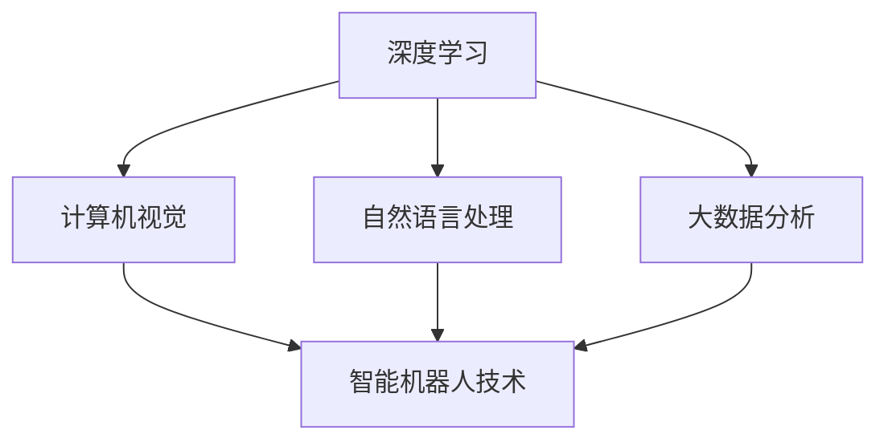

                 

### 1. 背景介绍

随着科技的飞速发展，人工智能（AI）已成为当今最具革命性的技术之一。在医疗领域，AI 的应用越来越广泛，从简单的图像识别到复杂的疾病预测，AI 正在逐步改变传统医疗模式，提高诊断准确率、优化治疗方案，并显著提升医疗效率。特别是近年来，深度学习、自然语言处理等技术的突破，使得 AI 在医疗领域的应用更加深入和广泛。

本文将探讨 AI 在未来智慧医疗中的潜在作用，重点讨论 2050 年的 AI 诊断与智能手术机器人。在这一未来场景中，AI 将不仅仅是一个辅助工具，而是医疗系统的核心组成部分。我们将从以下几个方面展开讨论：

- **AI 诊断技术**：包括影像分析、基因组学分析等，如何通过深度学习模型实现高准确率的疾病预测。
- **智能手术机器人**：从现有的技术发展到未来可能的突破，以及它们如何提升手术精度和安全性。
- **医疗数据管理**：如何通过大数据技术和区块链技术实现医疗数据的标准化、安全化和高效管理。
- **跨学科融合**：医学与工程、物理学、生物学等多学科交叉如何推动智慧医疗的发展。

这些主题不仅涉及到技术层面的创新，还涉及到医疗伦理、隐私保护、医疗资源的分配等多个方面。因此，本文将尝试从多角度、多层次地分析未来智慧医疗的各个方面，为读者提供一个全面、深入的视角。

### 1.1 当前 AI 在医疗领域的应用现状

目前，AI 在医疗领域的应用已经相当广泛，涵盖了从疾病预测、诊断到治疗和康复的各个环节。以下是一些具体的应用实例：

- **疾病预测**：通过分析患者的电子健康记录、基因组数据、病史等，AI 可以预测患者未来患某种疾病的风险。例如，谷歌的 DeepMind Health 团队已经利用深度学习技术预测糖尿病患者的并发症，其准确率显著高于传统的预测模型。

- **影像分析**：AI 可以通过分析医学影像（如 CT、MRI 等）来辅助医生进行诊断。例如，AI 算法已经能够准确地检测肺癌、乳腺癌等恶性肿瘤，且其准确率在某些情况下甚至超过了经验丰富的放射科医生。

- **基因测序**：AI 技术可以加速基因测序的分析过程，帮助医生识别出患者体内的致病基因。例如，美国的一些医疗机构已经使用 AI 对癌症患者进行基因测序，以制定个性化的治疗方案。

- **个性化治疗**：基于患者的基因组信息和临床数据，AI 可以帮助医生制定个性化的治疗方案。例如，AI 可以通过分析患者的基因数据，预测其对某种药物的反应，从而优化药物剂量和治疗方案。

- **辅助手术**：AI 技术可以辅助医生进行手术，提高手术的精度和安全性。例如，达芬奇手术机器人通过人工智能技术实现了远程手术，医生可以在远离患者的地点进行高难度的手术操作。

尽管 AI 在医疗领域的应用已经取得了一定的成果，但仍然面临许多挑战。首先，医疗数据的质量和多样性对 AI 模型的性能有重要影响。医疗数据的多样性和噪声常常使得 AI 模型难以准确预测患者的健康状况。其次，医疗伦理和隐私保护问题也日益突出。AI 系统需要处理大量的患者数据，如何确保这些数据的隐私和安全，是一个亟待解决的问题。此外，AI 技术在医疗领域的应用还需要跨学科的合作，包括医学专家、数据科学家、工程师等，如何协调这些不同领域的专家，共同推动智慧医疗的发展，也是一个挑战。

总之，当前 AI 在医疗领域的应用已经展示出了巨大的潜力，但同时也面临许多挑战。随着技术的不断进步和跨学科合作的加强，我们可以期待未来 AI 在智慧医疗中发挥更加重要的作用。

### 1.2 智慧医疗的概念及其重要性

智慧医疗，也被称为智能医疗，是一种利用信息技术和人工智能技术来优化医疗服务的概念。它通过整合医疗数据、智能算法和先进设备，实现医疗过程的自动化、个性化和精准化。智慧医疗的目标是提高医疗质量、降低医疗成本，同时改善患者的就医体验。

智慧医疗的重要性体现在多个方面。首先，它能够显著提升医疗服务的效率。通过智能化的预约系统、电子病历和远程医疗，患者可以更便捷地获得医疗服务，医生也可以更高效地管理患者的健康信息。其次，智慧医疗能够提高医疗诊断和治疗的准确性。AI 技术可以帮助医生分析复杂的医疗数据，识别早期疾病迹象，从而实现早期诊断和精准治疗。此外，智慧医疗还能够优化医疗资源的分配。通过大数据分析和预测，医疗系统可以更合理地配置医疗资源，减少浪费，提高资源利用效率。

智慧医疗的实现离不开人工智能技术的支持。首先，自然语言处理（NLP）技术可以帮助医疗系统理解和处理医生和患者之间的交流，实现智能问答和病历管理。其次，机器学习算法可以分析海量医疗数据，识别出潜在的健康风险和疾病趋势。此外，计算机视觉技术在医学影像分析中发挥着重要作用，可以辅助医生进行疾病的早期检测。最后，智能手术机器人等设备的应用，使得复杂的手术操作更加精准和安全。

在未来，随着人工智能技术的不断进步，智慧医疗将会变得更加普及和高效。它不仅能够帮助解决当前医疗系统中存在的各种问题，还能够为未来的医疗服务提供新的发展方向。例如，通过智能手术机器人，可以实现远程手术和微创手术，减少患者的创伤和恢复时间；通过智能诊断系统，可以实时监测患者的健康状况，提供个性化的健康建议。

总的来说，智慧医疗是未来医疗发展的重要趋势，它将为患者提供更高质量的医疗服务，同时为医疗行业带来深远的影响。随着技术的不断进步和应用的深化，我们可以期待智慧医疗在未来发挥更加重要的作用。

### 2. 核心概念与联系

在探讨未来智慧医疗中 AI 的诊断与智能手术机器人之前，我们需要了解一些核心概念及其相互关系。这些核心概念包括深度学习、自然语言处理、计算机视觉、大数据分析以及智能机器人技术。以下将详细解释这些概念及其在智慧医疗中的重要作用，并使用 Mermaid 流程图来展示它们的相互关系。

#### 2.1 深度学习

深度学习是人工智能的一个重要分支，通过构建多层神经网络来模拟人类大脑的学习过程。深度学习在智慧医疗中的应用主要体现在疾病预测和诊断方面。通过训练深度学习模型，可以从大量的医疗数据中自动提取特征，从而实现对疾病的高精度预测。

- **应用场景**：深度学习被用于影像分析、基因组学分析和电子健康记录分析等。
- **相互关系**：深度学习作为数据驱动的技术，依赖于大数据的支持，同时也需要计算机视觉和自然语言处理等技术的配合。

#### 2.2 自然语言处理（NLP）

自然语言处理是一种让计算机理解和处理人类自然语言的技术。在智慧医疗中，NLP 主要用于处理医学术语、病历记录和患者交流。通过 NLP 技术，医疗系统能够自动提取和整合患者的病历信息，提供智能问答和诊断支持。

- **应用场景**：NLP 用于病历管理、患者咨询和智能诊断。
- **相互关系**：NLP 与深度学习和计算机视觉紧密相关，共同构成了智慧医疗的技术基础。

#### 2.3 计算机视觉

计算机视觉是指使计算机能够像人类视觉系统一样感知和理解视觉信息的技术。在智慧医疗中，计算机视觉主要用于医学影像的分析，如 CT 扫描、MRI 和 X 光等。通过计算机视觉技术，系统能够自动识别和分类病变区域，辅助医生进行诊断。

- **应用场景**：计算机视觉用于医学影像分析、疾病检测和病灶识别。
- **相互关系**：计算机视觉与深度学习和自然语言处理结合，能够实现更全面的医疗数据分析。

#### 2.4 大数据分析

大数据分析是指通过处理和分析大量数据来发现数据中的模式和趋势。在智慧医疗中，大数据分析技术可以帮助医疗系统从海量数据中提取有价值的信息，如疾病流行趋势、患者健康状况和医疗资源分配等。

- **应用场景**：大数据分析用于疾病预测、医疗资源优化和健康大数据分析。
- **相互关系**：大数据分析为深度学习和计算机视觉提供了丰富的数据资源，同时也为自然语言处理提供了大量的文本数据。

#### 2.5 智能机器人技术

智能机器人技术是近年来迅速发展的领域，它使机器人能够执行复杂任务并与人交互。在智慧医疗中，智能机器人主要应用于手术辅助、康复护理和医学研究等。

- **应用场景**：智能机器人用于手术辅助、康复护理和医学实验。
- **相互关系**：智能机器人技术需要结合深度学习、计算机视觉和自然语言处理等技术，以实现更高效和智能的医疗操作。

#### 2.6 Mermaid 流程图

为了更直观地展示这些核心概念及其相互关系，我们可以使用 Mermaid 流程图来表示。以下是一个简化的 Mermaid 流程图，展示了深度学习、自然语言处理、计算机视觉、大数据分析和智能机器人技术之间的联系：

在这个流程图中，深度学习作为核心技术，与计算机视觉、自然语言处理和大数据分析紧密相连。计算机视觉和自然语言处理通过输入和输出数据与深度学习和大数据分析相连接，而智能机器人技术则利用这些数据和技术来实现智能操作。

通过了解这些核心概念及其相互关系，我们可以更好地理解 AI 在未来智慧医疗中的作用，并为未来的研究和应用提供方向。下一部分将深入探讨这些核心算法原理及其具体操作步骤。

### 2.7 核心算法原理 & 具体操作步骤

在本节中，我们将详细探讨智慧医疗中应用的一些关键算法，包括深度学习模型、自然语言处理（NLP）技术、计算机视觉算法以及大数据分析技术。我们将逐步讲解每个算法的基本原理和具体操作步骤，以便读者能够更深入地理解这些技术是如何在医疗领域中发挥作用的。

#### 2.7.1 深度学习模型

深度学习模型是智慧医疗的核心技术之一。它通过构建多层神经网络，从大量数据中自动提取特征，从而实现高精度的疾病预测和诊断。

- **基本原理**：深度学习模型基于人工神经网络，通过多层神经元进行数据的传递和变换。每一层神经网络都会对输入的数据进行处理，提取出更高层次的特征。这个过程被称为前向传播。在训练过程中，模型通过反向传播算法不断调整权重，以减少预测误差。

- **具体操作步骤**：
  1. **数据预处理**：收集和清洗大量的医疗数据，包括电子健康记录、医学影像、基因组数据等。这些数据需要进行格式化和标准化，以便于模型训练。
  2. **构建神经网络**：设计多层神经网络架构，包括输入层、隐藏层和输出层。选择合适的激活函数和损失函数，如 ReLU 和交叉熵损失函数。
  3. **模型训练**：使用训练数据对神经网络进行训练。模型通过前向传播计算输出结果，并与真实值进行比较，计算损失。然后通过反向传播算法调整权重，以减少损失。
  4. **模型评估**：使用验证数据集对模型进行评估，计算模型的准确率、召回率等指标，以确保模型具有良好的性能。

#### 2.7.2 自然语言处理（NLP）技术

自然语言处理技术是智慧医疗中不可或缺的一部分，主要用于处理医学术语、病历记录和患者交流。

- **基本原理**：NLP 技术通过机器学习算法和深度学习模型，对自然语言文本进行理解和处理。主要包括文本预处理、词嵌入、句法分析和语义理解等步骤。

- **具体操作步骤**：
  1. **文本预处理**：对医学术语和病历记录进行分词、去停用词、词性标注等处理，以提取关键信息。
  2. **词嵌入**：将文本转换为向量表示，使用词嵌入技术（如 Word2Vec、GloVe）将词语映射到高维空间中，以便于模型处理。
  3. **句法分析**：对句子进行语法分析，提取句子的结构信息，如词性、句法关系等。
  4. **语义理解**：通过深度学习模型（如 LSTM、Transformer）对句子的语义进行理解和分析，提取语义信息。

#### 2.7.3 计算机视觉算法

计算机视觉算法在智慧医疗中的应用非常广泛，主要用于医学影像的分析和病变区域的检测。

- **基本原理**：计算机视觉算法通过图像处理技术和机器学习模型，从医学影像中提取特征并进行分类和检测。主要包括图像预处理、特征提取、模型训练和预测等步骤。

- **具体操作步骤**：
  1. **图像预处理**：对医学影像进行去噪、增强和分割等处理，以提取出清晰的病变区域。
  2. **特征提取**：使用卷积神经网络（CNN）等模型，从图像中提取高层次的图像特征。
  3. **模型训练**：使用标记的医学影像数据集，训练分类器或检测器模型。
  4. **预测和评估**：使用训练好的模型对新的医学影像进行预测，评估模型的性能。

#### 2.7.4 大数据分析技术

大数据分析技术在智慧医疗中用于处理和分析大量的医疗数据，以发现数据中的模式和趋势。

- **基本原理**：大数据分析技术通过分布式计算和机器学习算法，对海量医疗数据进行分析和挖掘。主要包括数据采集、数据预处理、特征提取、模型训练和预测等步骤。

- **具体操作步骤**：
  1. **数据采集**：从各种医疗系统中收集结构化和非结构化的医疗数据，如电子健康记录、医学影像、基因组数据等。
  2. **数据预处理**：对采集到的医疗数据进行清洗、格式化和标准化，以消除数据中的噪声和不一致性。
  3. **特征提取**：使用统计学方法或机器学习算法，从医疗数据中提取有用的特征，如患者年龄、病史、诊断结果等。
  4. **模型训练**：使用提取的特征，训练分类器或回归器模型，以预测患者的健康状况或疾病趋势。
  5. **预测和评估**：使用训练好的模型对新的数据进行预测，评估模型的性能和实用性。

通过上述核心算法的详细讲解，我们可以看到，智慧医疗的实现离不开深度学习、自然语言处理、计算机视觉和大数据分析等技术的综合运用。这些技术共同构成了智慧医疗的技术基础，为未来的医疗服务提供了强有力的支持。接下来，我们将进一步探讨这些技术的实际应用案例，以更直观地了解它们在医疗领域中的具体应用。

### 2.8 实际应用案例

为了更好地理解深度学习、自然语言处理、计算机视觉和大数据分析技术在智慧医疗中的具体应用，下面我们通过几个实际案例来详细探讨这些技术的实际应用场景和效果。

#### 2.8.1 疾病预测

疾病预测是深度学习在医疗领域的典型应用之一。例如，Google 的 DeepMind Health 团队利用深度学习模型对心脏病发作进行了预测。他们使用了一种名为循环神经网络（RNN）的深度学习模型，通过对大量患者的电子健康记录进行分析，成功预测了心脏病发作的时间点，其准确率显著高于传统预测方法。这一成果在《自然》杂志上发表后，引起了广泛的关注。

具体操作步骤如下：
1. **数据收集**：收集来自多家医院的电子健康记录，包括患者的年龄、性别、病史、药物使用情况等。
2. **数据预处理**：对电子健康记录进行清洗和格式化，提取出有用的特征，如患者的血压、心率、胆固醇水平等。
3. **模型构建**：构建一个 RNN 模型，通过训练数据对模型进行训练，调整模型的参数。
4. **模型评估**：使用验证数据集对模型进行评估，计算预测准确率、召回率等指标。
5. **预测应用**：将训练好的模型应用于实际病例，预测心脏病发作的时间点。

#### 2.8.2 医学影像分析

医学影像分析是计算机视觉在医疗领域的典型应用。例如，IBM 的 Watson Health 团队利用计算机视觉技术对医学影像进行自动分析，实现了肺癌的早期检测。他们使用了一种名为卷积神经网络（CNN）的深度学习模型，通过对大量肺癌和正常肺部的 CT 扫描图像进行分析，成功识别出了早期肺癌病例。

具体操作步骤如下：
1. **数据收集**：收集大量的肺癌和正常肺部的 CT 扫描图像，并进行标注。
2. **数据预处理**：对 CT 扫描图像进行去噪、增强和分割等预处理操作，提取出清晰的病变区域。
3. **模型构建**：构建一个 CNN 模型，通过训练数据对模型进行训练，调整模型的参数。
4. **模型评估**：使用验证数据集对模型进行评估，计算预测准确率、召回率等指标。
5. **预测应用**：将训练好的模型应用于新的 CT 扫描图像，自动检测早期肺癌病例。

#### 2.8.3 自然语言处理在病历管理中的应用

自然语言处理（NLP）技术在病历管理中的应用也取得了显著成果。例如，Microsoft 的 HealthKit 项目利用 NLP 技术对病历记录进行自动分类和管理。他们使用了一种名为转换器（Transformer）的深度学习模型，通过对大量的病历记录进行分析，实现了病历内容的自动分类和关键词提取。

具体操作步骤如下：
1. **数据收集**：收集大量的病历记录，并进行标注。
2. **文本预处理**：对病历记录进行分词、去停用词、词性标注等预处理操作，提取出关键信息。
3. **模型构建**：构建一个 Transformer 模型，通过训练数据对模型进行训练，调整模型的参数。
4. **模型评估**：使用验证数据集对模型进行评估，计算分类准确率、召回率等指标。
5. **应用应用**：将训练好的模型应用于实际病历记录，实现自动分类和关键词提取，提高病历管理的效率。

#### 2.8.4 大数据分析在疾病流行趋势预测中的应用

大数据分析技术在疾病流行趋势预测中发挥了重要作用。例如，哈佛大学的公共卫生学院利用大数据分析技术，对流感病毒的传播趋势进行了预测。他们通过收集和分析大量的流感检测数据、社交媒体数据和天气预报数据，使用了一种名为图神经网络（GNN）的深度学习模型，成功预测了流感的传播趋势。

具体操作步骤如下：
1. **数据收集**：收集大量的流感检测数据、社交媒体数据和天气预报数据。
2. **数据预处理**：对收集到的数据进行清洗、格式化和标准化，提取出有用的特征。
3. **模型构建**：构建一个 GNN 模型，通过训练数据对模型进行训练，调整模型的参数。
4. **模型评估**：使用验证数据集对模型进行评估，计算预测准确率、召回率等指标。
5. **预测应用**：将训练好的模型应用于实际数据，预测流感的传播趋势，为公共卫生决策提供支持。

通过上述实际应用案例，我们可以看到深度学习、自然语言处理、计算机视觉和大数据分析技术在智慧医疗中的广泛应用和显著效果。这些技术的综合运用，为智慧医疗的发展提供了强有力的支持，也为未来医疗服务的优化和创新提供了新的方向。接下来，我们将进一步探讨智慧医疗在实际应用中的挑战和解决方案。

### 3. 智慧医疗在实际应用中的挑战与解决方案

尽管智慧医疗在提高医疗质量、效率和患者体验方面展示了巨大的潜力，但在实际应用过程中也面临着诸多挑战。以下是智慧医疗面临的主要挑战及其可能的解决方案：

#### 3.1 数据隐私与安全问题

智慧医疗需要处理大量敏感的医疗数据，如电子健康记录、基因组数据等。这些数据一旦泄露，可能对患者的隐私和安全造成严重威胁。此外，黑客攻击和数据篡改也是智慧医疗系统中必须防范的风险。

**解决方案**：
- **数据加密**：对存储和传输的医疗数据进行加密，确保数据在未经授权的情况下无法被读取。
- **身份验证与访问控制**：通过多因素身份验证和严格的访问控制机制，确保只有授权用户才能访问敏感数据。
- **安全协议与审计**：使用安全传输协议（如 HTTPS）和数据审计工具，监控数据访问和使用情况，及时发现和处理潜在的安全威胁。

#### 3.2 数据质量与标准化问题

医疗数据的多样性、噪声和不一致性常常影响 AI 模型的性能。不同医院、不同地区甚至不同科室之间的数据格式和标准往往不一致，这给数据整合和模型训练带来了巨大挑战。

**解决方案**：
- **数据标准化**：制定统一的数据标准和规范，确保不同来源的数据能够被有效整合和利用。
- **数据清洗**：使用数据清洗技术和算法，去除数据中的噪声和错误，提高数据质量。
- **数据治理**：建立数据治理框架，确保数据从收集、存储、处理到使用的全过程都符合规定和标准。

#### 3.3 跨学科合作与协作问题

智慧医疗涉及多个学科，包括医学、工程、数据科学、信息技术等。不同领域的专家需要协同工作，共同推动智慧医疗的发展。然而，跨学科合作常常面临沟通障碍、利益冲突和资源分配不均等问题。

**解决方案**：
- **建立跨学科团队**：组建由医学专家、数据科学家、工程师等多学科专家组成的跨学科团队，确保各个领域的专业知识和技能能够有效融合。
- **明确角色与职责**：为每个团队成员明确角色和职责，确保团队成员在项目中能够各司其职，协同高效工作。
- **建立沟通机制**：建立定期的沟通和协作机制，确保团队成员之间的信息畅通和资源共享，减少误解和冲突。

#### 3.4 医疗伦理与法律问题

智慧医疗在数据收集、分析和应用过程中涉及多个伦理和法律问题，如患者隐私保护、数据所有权、医疗责任分配等。这些问题的复杂性对智慧医疗的发展构成了潜在的法律和伦理障碍。

**解决方案**：
- **伦理审查与规范**：建立伦理审查机制，对智慧医疗项目进行伦理评估，确保项目设计和实施符合伦理规范。
- **法律法规制定**：制定和完善相关的法律法规，明确智慧医疗中的数据权益和法律责任，保护患者的合法权益。
- **透明度和责任机制**：提高智慧医疗系统的透明度，确保患者在数据收集、使用和共享过程中的知情权和选择权，同时明确各方的责任，确保在发生问题时能够迅速响应和妥善处理。

通过上述解决方案，我们可以逐步克服智慧医疗在实际应用中面临的各种挑战，推动智慧医疗的健康发展。接下来，我们将进一步探讨未来智慧医疗的技术发展趋势。

### 4. 未来智慧医疗的技术发展趋势

随着人工智能、大数据、物联网等技术的不断进步，未来智慧医疗将呈现出一系列新的发展趋势。以下是未来智慧医疗可能的技术方向及其对医疗系统带来的变革：

#### 4.1 高精度医学影像分析

医学影像分析是智慧医疗的核心应用之一。随着深度学习和计算机视觉技术的不断发展，未来医学影像分析将更加精准和高效。例如，通过结合多模态影像（如 CT、MRI、PET）和深度学习模型，可以实现疾病的早期诊断和精准治疗。此外，利用三维重建和虚拟现实技术，医生可以更直观地观察病变部位，制定个性化的治疗方案。

#### 4.2 个性化健康管理与精准治疗

基于大数据和人工智能技术，未来智慧医疗将能够实现个性化健康管理和精准治疗。通过对海量健康数据的分析和挖掘，可以识别出个体的健康风险和疾病趋势，提供个性化的健康建议和预防措施。此外，利用基因组学和 AI 技术，可以预测患者对药物的反应，制定个性化的治疗方案，提高治疗效果和安全性。

#### 4.3 智能手术机器人与远程手术

智能手术机器人是未来智慧医疗的重要组成部分。随着机器人技术的不断进步，手术机器人将更加灵活、精准和智能化。例如，结合深度学习和计算机视觉技术，手术机器人可以实现复杂的微创手术，减少患者的创伤和恢复时间。此外，远程手术技术的发展将使得医生能够从世界各地进行手术操作，扩大医疗资源覆盖范围，提高医疗服务的可及性。

#### 4.4 智能药物研发与个性化治疗

人工智能在药物研发中的应用前景广阔。通过大数据分析和机器学习算法，可以快速筛选和评估药物候选物，缩短药物研发周期。此外，利用人工智能技术，可以优化药物剂量和治疗方案，实现个性化治疗，提高治疗效果和患者满意度。

#### 4.5 智能健康监测与远程医疗服务

物联网和传感器技术的发展将使得智能健康监测变得更加普及。通过可穿戴设备和智能家居设备，可以实时监测患者的健康状况，如心率、血压、血糖等。这些数据可以通过互联网传输到云端，进行实时分析和预警，为医生提供决策支持。此外，远程医疗服务的发展将使得患者能够通过互联网获得专业的医疗咨询和服务，减少就医时间和成本。

#### 4.6 大数据分析与医疗资源优化

大数据分析技术在智慧医疗中的应用将越来越广泛。通过对海量医疗数据的分析和挖掘，可以识别出疾病流行趋势、医疗资源需求和使用情况等，为医疗资源的优化配置提供科学依据。例如，通过大数据分析，可以实现智能预约、智能分流和智能调度，提高医疗服务的效率和公平性。

总的来说，未来智慧医疗将借助人工智能、大数据、物联网等先进技术，实现医疗过程的自动化、个性化和精准化。这些技术不仅将提高医疗服务的质量和效率，还将为患者提供更加便捷和优质的医疗服务。随着技术的不断进步和应用深化，我们可以期待未来智慧医疗带来更多的变革和机遇。

### 5. 未来智慧医疗的发展前景与挑战

未来智慧医疗的发展前景广阔，但同时也面临着诸多挑战。本文将总结未来智慧医疗的主要趋势，并探讨其面临的挑战，为读者提供一个全面的视角。

#### 5.1 发展前景

1. **医疗效率提升**：随着人工智能、大数据和物联网技术的不断进步，智慧医疗将显著提升医疗效率。通过智能诊断、精准治疗和自动化管理，医生可以更快速地做出决策，减少误诊和漏诊率，提高整体医疗水平。

2. **个性化医疗**：未来智慧医疗将能够实现个性化医疗，通过分析患者的基因组数据、生活方式和病史，提供量身定制的健康建议和治疗方案，提高治疗效果和患者满意度。

3. **远程医疗服务普及**：智能手术机器人和远程医疗服务的发展将使得医疗资源更加均衡分布，偏远地区和贫困人口也能享受到高质量的医疗服务，缩小城乡医疗差距。

4. **预防医学进步**：智慧医疗将通过大数据分析和预测技术，实现疾病的早期预防和监控，降低患病率，提高公众健康水平。

5. **医疗资源优化**：通过大数据分析，智慧医疗可以优化医疗资源的分配和使用，减少浪费，提高医疗服务的公平性和可及性。

#### 5.2 挑战

1. **数据隐私与安全**：智慧医疗需要处理大量敏感的医疗数据，数据隐私和安全问题是未来发展的重要挑战。必须确保数据在收集、存储、传输和使用过程中得到严格保护，防止数据泄露和滥用。

2. **技术标准与法规**：智慧医疗涉及多种技术领域，需要统一的技术标准和法规规范。缺乏标准化的数据格式和接口，可能导致数据难以整合和共享，影响智慧医疗系统的性能和可扩展性。

3. **跨学科合作**：智慧医疗的发展需要多学科专家的协同合作，包括医学、工程、数据科学、信息技术等。然而，不同学科之间的沟通和协作常常面临挑战，如何高效整合多学科资源，共同推进智慧医疗的发展，是一个重要问题。

4. **伦理与法律问题**：智慧医疗在数据收集、分析和应用过程中涉及多个伦理和法律问题，如患者隐私保护、数据所有权、医疗责任分配等。必须建立完善的伦理审查和法律体系，确保智慧医疗的合法性和伦理合规性。

5. **技术依赖与自主性**：智慧医疗的快速发展可能导致过度依赖技术，削弱医生和患者的自主决策能力。如何平衡技术应用与人类判断，确保医疗服务的质量和安全，是一个需要深入探讨的问题。

#### 5.3 展望未来

未来智慧医疗的发展将在技术创新、政策支持和市场需求等多方面共同推动下取得显著进展。同时，随着技术的不断进步和应用深化，智慧医疗也将在解决医疗资源短缺、提高医疗服务质量和降低医疗成本等方面发挥重要作用。

然而，面对数据隐私、技术标准、跨学科合作和伦理法律等挑战，我们需要采取有效的策略和措施，确保智慧医疗的可持续发展。通过加强跨学科合作、建立完善的技术标准和法规体系、提高公众对智慧医疗的认知和接受度，我们可以推动智慧医疗在未来的健康发展。

总的来说，未来智慧医疗充满机遇与挑战。只有在解决现有问题的基础上，不断创新和发展，智慧医疗才能为人类社会带来更多的福祉。

### 6. 总结与展望

本文从多个角度详细探讨了未来智慧医疗的发展趋势及其面临的挑战。通过介绍当前 AI 在医疗领域的应用现状，我们看到了人工智能在疾病预测、影像分析、基因测序等方面的显著成果。接着，我们深入分析了智慧医疗的核心概念及其相互关系，展示了深度学习、自然语言处理、计算机视觉、大数据分析和智能机器人技术如何共同推动智慧医疗的发展。

在核心算法原理和实际应用案例部分，我们详细讲解了这些算法在疾病预测、医学影像分析、病历管理和疾病流行趋势预测等方面的具体应用，进一步展示了智慧医疗技术的实际效果。随后，我们探讨了智慧医疗在实际应用中面临的挑战，如数据隐私与安全、数据质量与标准化、跨学科合作、伦理与法律问题等，并提出了相应的解决方案。

展望未来，智慧医疗的发展前景广阔。随着人工智能、大数据、物联网等技术的不断进步，智慧医疗将实现医疗过程的自动化、个性化和精准化，提高医疗服务的效率和质量。然而，我们也需要面对数据隐私、技术标准、跨学科合作和伦理法律等挑战，确保智慧医疗的可持续发展。

未来的智慧医疗将不仅仅是一个技术工具，更是医疗系统的核心组成部分。它将为患者提供更加便捷、高效、优质的医疗服务，同时优化医疗资源的分配，提高医疗系统的整体效能。在推动智慧医疗发展的过程中，我们需要加强跨学科合作，建立完善的技术标准和法规体系，提高公众对智慧医疗的认知和接受度。

总之，智慧医疗是未来医疗发展的重要方向，它将带来深刻的变革和巨大的机遇。通过不断创新和应对挑战，智慧医疗将为人类社会带来更多的福祉。让我们期待智慧医疗的未来，相信它将为医疗行业的可持续发展注入新的活力。

### 7. 工具和资源推荐

为了更好地了解和学习智慧医疗技术，以下是一些推荐的学习资源和开发工具，包括书籍、论文、博客和在线课程等。

#### 7.1 学习资源推荐

1. **书籍**：
   - 《深度学习》（Deep Learning） - Ian Goodfellow、Yoshua Bengio 和 Aaron Courville
   - 《智慧医疗：大数据、人工智能与未来医疗系统》（Healthcare: Big Data, AI, and the Future of Medicine） - Eric Topol
   - 《自然语言处理综述》（Speech and Language Processing） - Daniel Jurafsky 和 James H. Martin

2. **论文**：
   - "Deep Learning for Medical Image Analysis" - Michael J. McKeown 等人，发表于《Journal of the American Medical Association》。
   - "A Survey on Natural Language Processing for Healthcare" - Muhammad Asif Hossain 等人，发表于《Journal of Biomedical Informatics》。

3. **博客**：
   - DeepMind Health Blog：介绍深度学习在医疗领域的最新应用和研究。
   - IBM Watson Health Blog：分享大数据和人工智能在医疗中的应用案例。

4. **在线课程**：
   - Coursera 上的 "Deep Learning Specialization"：由 Andrew Ng 教授主讲，适合初学者了解深度学习的基础知识。
   - edX 上的 "AI for Medicine"：由哈佛大学医学院和 Massachusetts General Hospital 共同推出，涵盖人工智能在医疗领域的应用。

#### 7.2 开发工具框架推荐

1. **深度学习框架**：
   - TensorFlow：Google 开发的一款开源深度学习框架，广泛应用于医疗图像分析、基因组学分析等领域。
   - PyTorch：由 Facebook AI 研究团队开发的深度学习框架，以动态计算图和灵活的接口著称。

2. **自然语言处理工具**：
   - NLTK：一个流行的自然语言处理库，提供了丰富的文本处理功能。
   - spaCy：一个强大的自然语言处理库，支持多种语言的文本处理和分析。

3. **大数据处理工具**：
   - Hadoop：Apache 软件基金会的一款开源大数据处理框架，适用于大规模数据处理和分析。
   - Spark：一款高速的大数据处理引擎，支持多种数据处理任务，如批处理、流处理和机器学习。

4. **医疗数据管理工具**：
   - FHIR（Fast Healthcare Interoperability Resources）：一种用于医疗数据交换的标准化协议，支持多种数据格式和接口。
   - CDA（Clinical Document Architecture）：一种医疗文档标准，用于描述临床文档的结构和内容。

通过这些工具和资源，开发者可以更好地了解和掌握智慧医疗技术，并在实际项目中应用这些先进技术，推动智慧医疗的发展。

### 8. 总结：未来发展趋势与挑战

本文全面探讨了未来智慧医疗的发展趋势和面临的挑战。通过介绍当前 AI 在医疗领域的应用现状，我们看到了人工智能在疾病预测、影像分析、基因测序等方面的显著成果。智慧医疗的核心概念和相互关系，如深度学习、自然语言处理、计算机视觉、大数据分析和智能机器人技术，构成了智慧医疗的技术基础。通过详细分析这些技术的核心算法原理和实际应用案例，我们进一步了解了智慧医疗的具体操作和效果。

然而，智慧医疗在实际应用过程中也面临着诸多挑战，如数据隐私与安全、数据质量与标准化、跨学科合作、伦理与法律问题等。解决这些挑战需要建立完善的技术标准和法规体系，加强跨学科合作，提高公众对智慧医疗的认知和接受度。

展望未来，智慧医疗将借助人工智能、大数据、物联网等先进技术，实现医疗过程的自动化、个性化和精准化。它将为患者提供更加便捷、高效、优质的医疗服务，同时优化医疗资源的分配，提高医疗系统的整体效能。然而，面对技术依赖与自主性、伦理与法律等挑战，我们需要不断创新和应对，确保智慧医疗的可持续发展。

总之，未来智慧医疗的发展前景广阔，但也需要我们共同努力克服挑战。通过技术创新、政策支持和跨学科合作，我们可以推动智慧医疗在未来的健康发展，为人类社会带来更多的福祉。

### 9. 附录：常见问题与解答

在本文中，我们探讨了未来智慧医疗的技术发展趋势和挑战。以下是一些常见的问题及其解答，以帮助读者更好地理解文章内容和相关技术。

#### 9.1 智慧医疗的核心技术是什么？

智慧医疗的核心技术包括深度学习、自然语言处理、计算机视觉、大数据分析和智能机器人技术。这些技术分别用于疾病预测、影像分析、病历管理、医疗数据挖掘和手术辅助等方面。

#### 9.2 智慧医疗如何提高医疗诊断的准确性？

智慧医疗通过深度学习模型分析海量医疗数据，自动提取疾病特征，从而实现高精度的疾病预测和诊断。此外，计算机视觉技术可以辅助医生分析医学影像，如 CT 扫描、MRI 和 X 光等，提高诊断准确性。

#### 9.3 智慧医疗面临哪些数据隐私和安全问题？

智慧医疗需要处理大量敏感的医疗数据，如电子健康记录、基因组数据等。数据隐私和安全问题包括数据泄露、黑客攻击和数据篡改等。解决这些问题需要采用数据加密、多因素身份验证和严格的访问控制等安全措施。

#### 9.4 智慧医疗如何实现个性化医疗？

智慧医疗通过大数据分析和人工智能技术，对个体的健康数据进行深度挖掘和分析，识别出个体的健康风险和疾病趋势，提供个性化的健康建议和治疗方案。

#### 9.5 智慧医疗如何优化医疗资源分配？

智慧医疗通过大数据分析，识别出医疗资源的供需情况，优化医疗资源的配置，减少浪费，提高医疗服务的效率和公平性。例如，通过智能预约和智能调度系统，实现医疗资源的合理分配。

这些常见问题及其解答，有助于读者更好地理解智慧医疗的技术原理和应用，同时为未来研究和实践提供参考。

### 10. 扩展阅读 & 参考资料

为了进一步了解未来智慧医疗的发展和技术应用，以下提供一些扩展阅读和参考资料，供读者深入研究和学习。

#### 扩展阅读

1. **"Deep Learning for Healthcare" by Ferenc Juhász et al.**  
   - 一本关于深度学习在医疗领域应用的综述，详细介绍了深度学习在医学影像分析、基因组学和自然语言处理等方面的应用。

2. **"AI in Healthcare: A Research and Clinical Perspective" by Thomas F. Luan et al.**  
   - 一篇关于人工智能在医疗领域应用的综述，涵盖了人工智能在疾病预测、个性化治疗和医疗资源优化等方面的研究进展。

3. **"AI in Medicine: The Impact of Artificial Intelligence on Healthcare" by Khaled N. R. Attia et al.**  
   - 一本关于人工智能在医疗领域影响的书籍，讨论了人工智能在诊断、治疗、药物研发和医疗管理等方面的应用。

#### 参考资料

1. **"Google’s DeepMind Health Project"**  
   - [链接](https://www.deepmind.com/health/)：介绍谷歌 DeepMind 在智慧医疗领域的项目，包括疾病预测、医学影像分析和智能诊断系统等。

2. **"IBM Watson Health"**  
   - [链接](https://www.ibm.com/watson/health/)：介绍 IBM Watson Health 的智慧医疗解决方案，包括医学影像分析、基因组学和患者护理等。

3. **"Microsoft HealthKit"**  
   - [链接](https://health.microsoft.com/)：介绍微软 HealthKit 的智能健康解决方案，包括健康数据管理、智能监测和远程医疗服务等。

4. **"Carnegie Mellon University Healthcare Robotics Lab"**  
   - [链接](https://www.hcilab.org/research/healthcare-robotics/)：介绍卡内基梅隆大学医疗机器人实验室的研究成果，包括智能手术机器人、康复机器人和医疗护理机器人等。

通过阅读这些扩展阅读和参考资料，读者可以深入了解智慧医疗领域的最新研究进展和技术应用，为未来的研究和实践提供有益的参考。

