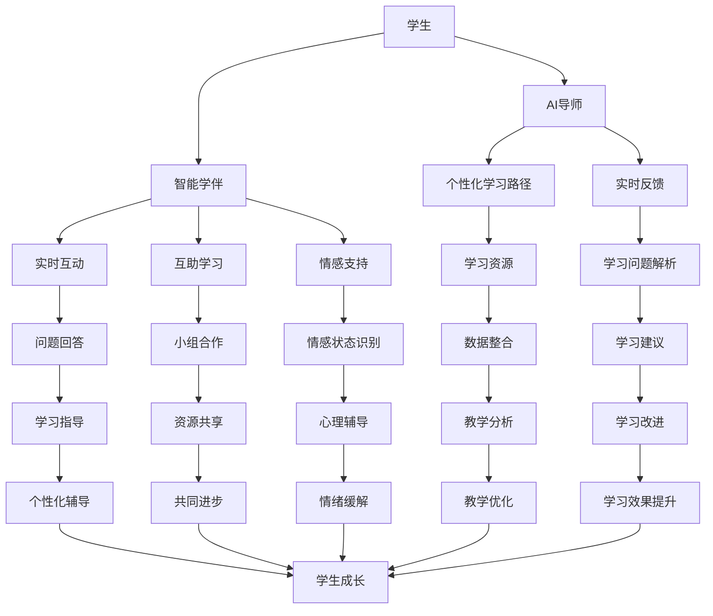

                 

### 背景介绍

在人工智能快速发展的今天，教育领域正面临着前所未有的变革。从传统课堂教学到在线教育，再到虚拟现实与增强现实技术的融入，教育方式正逐渐走向多样化和个性化。然而，教育的终极目标始终是培养学生的全面素质和终身学习能力。随着计算能力、数据资源以及算法的不断进步，未来的教育将迎来新的革命，AI导师与智能学伴有望成为这一变革的核心力量。

本文将探讨到2050年，人工智能如何彻底重塑教育，特别是AI导师与智能学伴的潜在影响。AI导师将不仅是知识的传递者，更是学生个性化学习的指导者，而智能学伴则将为学生提供实时反馈、互助学习以及情感支持。通过逐步分析，我们将深入探讨这一未来教育模式的核心概念、技术实现、应用场景及其面临的挑战。

接下来，本文将分为以下几大部分：

1. **核心概念与联系**：介绍AI导师与智能学伴的基本概念，以及二者在教育体系中的关系。
2. **核心算法原理与具体操作步骤**：探讨AI导师与智能学伴的关键算法，并详细阐述其工作流程。
3. **数学模型与公式**：介绍支持AI导师与智能学伴的数学模型，包括学习理论、数据分析和评估指标。
4. **项目实践**：通过具体案例展示AI导师与智能学伴的实际应用，并提供代码实例和解读。
5. **实际应用场景**：分析AI导师与智能学伴在不同教育阶段和学科中的应用前景。
6. **工具和资源推荐**：推荐相关的学习资源和开发工具，以帮助读者深入了解和探索AI在教育中的应用。
7. **总结与未来展望**：总结AI导师与智能学伴的发展现状，并展望其在2050年的教育中的未来前景。

通过这些部分的逐步分析，我们希望能够全面展示AI导师与智能学伴如何在未来重塑教育，以及这一变革过程中面临的挑战与机遇。

### 核心概念与联系

#### AI导师的定义与作用

AI导师是利用人工智能技术为学生提供个性化学习指导和支持的系统。它通过分析学生的学习数据，如学习进度、知识掌握情况、学习偏好和情感状态，来制定个性化的学习计划。AI导师的核心作用包括：

1. **个性化学习路径设计**：根据学生的个体差异，AI导师能够为学生量身定制学习计划，确保每个学生都能在适合自己的节奏中学习。
2. **实时反馈与支持**：通过持续监控学生的学习状态，AI导师能够提供实时反馈，指出学习中的不足，并为学生提供针对性的学习建议和资源。
3. **情感支持与心理辅导**：除了学术支持外，AI导师还可以通过自然语言处理和情感识别技术，识别学生的情感状态，提供情感支持和心理辅导。

#### 智能学伴的定义与作用

智能学伴则是为学生在学习过程中提供实时互动、互助学习与情感支持的人工智能系统。它的功能包括：

1. **实时互动**：智能学伴能够通过聊天机器人、语音交互等方式与学生进行实时交流，回答学生的问题，提供学习上的帮助。
2. **互助学习**：智能学伴可以组织学生进行在线讨论、小组合作，通过共享学习资源和经验，促进学生的共同进步。
3. **情感支持**：智能学伴能够识别学生的情感状态，提供积极正面的情感反馈，缓解学习压力，增强学生的自信心。

#### AI导师与智能学伴在教育体系中的关系

AI导师与智能学伴在教育体系中相辅相成，共同构建了未来智能教育的生态系统。

1. **协同作用**：AI导师主要负责个性化学习路径的设计和实时反馈，而智能学伴则提供实时互动和互助学习，二者通过数据共享和协作，为学生提供全方位的学习支持。
2. **数据整合**：AI导师和智能学伴能够通过统一的平台整合学生的学习数据，构建全面的学习档案，以便进行长期的学习分析和评估。
3. **教学相长**：AI导师和智能学伴不仅为学生提供支持，还能够为教师提供教学分析和改进建议，帮助教师更好地开展教学工作。

#### Mermaid 流程图

下面是AI导师与智能学伴在教育体系中的工作流程，使用Mermaid语言描述：



通过上述流程图，我们可以看到AI导师与智能学伴在教育体系中各自承担的角色及其相互关系。AI导师负责个性化学习路径的规划和实时反馈，智能学伴则提供实时互动、互助学习和情感支持，二者共同作用，推动学生全面发展。

### 核心算法原理与具体操作步骤

要实现AI导师与智能学伴的功能，需要依赖一系列核心算法和具体的操作步骤。以下是这些算法的详细原理和步骤：

#### 1. 个性化学习路径规划算法

**原理**：个性化学习路径规划算法基于对学生学习数据的分析，包括学习进度、知识掌握情况、学习偏好等，通过机器学习和数据挖掘技术，为学生推荐最佳学习路径。

**操作步骤**：

1. **数据收集与预处理**：首先，从多种数据源收集学生的基本信息、学习行为数据、测试成绩等，并进行预处理，如数据清洗、去噪、格式转换等。
2. **特征提取**：从预处理后的数据中提取关键特征，如学习频率、学习时长、学习效果等，用于后续的机器学习模型训练。
3. **模型训练**：使用机器学习算法，如决策树、随机森林、神经网络等，训练个性化学习路径规划模型。
4. **路径推荐**：根据学生的学习数据和模型预测结果，为每个学生推荐最优学习路径。

**实例**：假设有一个学生学习数学和物理两门课程，AI导师可以根据学生的测试成绩和学习频率，利用决策树算法预测学生在下一阶段应该优先学习哪门课程。

#### 2. 实时反馈与支持算法

**原理**：实时反馈与支持算法通过自然语言处理（NLP）和机器学习技术，分析学生的学习问题，并为学生提供针对性的解答和建议。

**操作步骤**：

1. **问题识别**：使用NLP技术，如分词、词性标注、句法分析等，从学生的提问中识别出关键信息，如问题类型、知识点等。
2. **问题解析**：利用知识图谱或文本分类算法，对识别出的问题进行分类，并提取相关知识点。
3. **答案生成**：根据问题解析结果，使用生成式模型或检索式模型，生成问题的答案或建议。
4. **反馈与支持**：将生成的答案或建议通过聊天机器人或语音助手等方式实时反馈给学生。

**实例**：当一个学生提出“如何求出二次方程的解”的问题时，实时反馈与支持算法会识别出问题类型，调用相关知识库，生成解答，并通过聊天机器人反馈给学生。

#### 3. 情感识别与心理辅导算法

**原理**：情感识别与心理辅导算法通过情感分析技术和心理模型，识别学生的情感状态，提供针对性的心理辅导。

**操作步骤**：

1. **情感识别**：使用情感分析技术，如文本情感极性分析、情感强度分析等，从学生的文本数据中识别情感状态，如焦虑、愉悦等。
2. **情感状态分类**：根据情感识别结果，将情感状态分类为积极、消极等不同类别。
3. **心理辅导策略**：根据情感状态分类结果，使用心理模型和辅导策略，生成相应的心理辅导建议。
4. **反馈与支持**：将心理辅导建议通过聊天机器人或语音助手等方式实时反馈给学生。

**实例**：如果一个学生在学习报告中表现焦虑，情感识别与心理辅导算法会识别出焦虑情绪，并根据心理模型生成缓解焦虑的建议，如“深呼吸放松法”或“运动释放压力”。

#### 4. 互助学习与互动算法

**原理**：互助学习与互动算法通过社交网络分析和推荐系统，组织学生进行在线讨论、小组合作，促进互助学习。

**操作步骤**：

1. **社交网络分析**：使用社交网络分析方法，如社交网络图、社区检测等，分析学生的社交网络结构。
2. **推荐系统**：根据社交网络分析结果，使用推荐系统算法，如协同过滤、基于内容的推荐等，为学生推荐合适的讨论组和合作小组。
3. **互动与协作**：通过聊天机器人、视频会议等工具，组织学生进行在线讨论和小组合作，提供实时互动支持。
4. **互动评估**：对学生的互动和协作效果进行评估，如讨论活跃度、小组合作完成度等，并反馈给系统，以不断优化推荐和互动策略。

**实例**：系统可以根据学生的兴趣和技能，为他们推荐合适的学习小组，并组织在线讨论，促进知识的共享和互补。

通过上述核心算法和操作步骤，AI导师与智能学伴能够为学生提供全方位的支持，实现个性化学习、实时反馈、情感支持和互助学习，从而推动教育的全面升级。

### 数学模型和公式

为了实现AI导师与智能学伴的功能，需要依赖一系列数学模型和公式。以下将详细介绍这些模型和公式，包括学习理论、数据分析方法和评估指标。

#### 1. 学习理论模型

学习理论模型用于描述学生的学习过程，其中最经典的是基于强化学习的模型。强化学习模型通过奖励机制来调整学生的行为，以实现最优学习路径。

**公式**：

强化学习模型的基本公式如下：

$$
Q(s, a) = r(s, a) + \gamma \max_{a'} Q(s', a')
$$

其中：
- \( Q(s, a) \) 表示在状态 \( s \) 下执行动作 \( a \) 的预期回报。
- \( r(s, a) \) 表示在状态 \( s \) 下执行动作 \( a \) 的即时回报。
- \( \gamma \) 是折扣因子，用于平衡即时回报和长期回报。
- \( s' \) 和 \( a' \) 分别表示执行动作后的状态和动作。

**实例**：假设一个学生在学习数学，当前状态是“不理解微积分”，执行动作“观看微积分教学视频”，得到的即时回报是“稍微理解”，而长期回报是“掌握微积分”，则强化学习模型会调整学生的行为，优先选择观看微积分教学视频。

#### 2. 数据分析方法

数据分析方法是AI导师与智能学伴的核心，其中常用的方法包括回归分析、聚类分析、时间序列分析等。

**公式**：

- **回归分析**：

$$
y = \beta_0 + \beta_1 x_1 + \beta_2 x_2 + ... + \beta_n x_n
$$

其中：
- \( y \) 是目标变量。
- \( x_1, x_2, ..., x_n \) 是自变量。
- \( \beta_0, \beta_1, \beta_2, ..., \beta_n \) 是回归系数。

**实例**：通过回归分析，可以预测学生的考试成绩与学习时间、学习频率之间的关系。

- **聚类分析**：

$$
\min_{x_1, x_2, ..., x_n} \sum_{i=1}^{n} (x_i - \mu_i)^2
$$

其中：
- \( x_1, x_2, ..., x_n \) 是数据点。
- \( \mu_i \) 是聚类中心。

**实例**：通过聚类分析，可以将学生分为不同的学习群体，以便实施个性化教学。

- **时间序列分析**：

$$
y_t = \beta_0 + \beta_1 y_{t-1} + \beta_2 x_{t-1} + \epsilon_t
$$

其中：
- \( y_t \) 是时间序列的第 \( t \) 项。
- \( y_{t-1} \) 是前一项。
- \( x_{t-1} \) 是前一项的自变量。
- \( \beta_0, \beta_1, \beta_2 \) 是模型参数。
- \( \epsilon_t \) 是误差项。

**实例**：通过时间序列分析，可以预测学生的学习进度，以便进行实时调整。

#### 3. 评估指标

评估指标用于衡量AI导师与智能学伴的效果，常用的指标包括学习效率、学习满意度、情感状态等。

**公式**：

- **学习效率**：

$$
\text{效率} = \frac{\text{学习成果}}{\text{学习时间}}
$$

**实例**：通过计算学生完成特定任务所需的时间与学习成果的比值，可以评估学习效率。

- **学习满意度**：

$$
\text{满意度} = \frac{\text{正面反馈次数}}{\text{总反馈次数}}
$$

**实例**：通过统计学生对学习建议的正面反馈次数与总反馈次数的比值，可以评估学习满意度。

- **情感状态**：

$$
\text{情感状态} = \frac{\text{正面情感次数}}{\text{总情感次数}}
$$

**实例**：通过统计学生在学习过程中出现的正面情感次数与总情感次数的比值，可以评估学生的情感状态。

通过上述数学模型和公式，AI导师与智能学伴能够更准确地分析学生的学习行为和需求，提供个性化的学习支持，从而提高教育质量和学习效果。

### 项目实践：代码实例和详细解释说明

在本节中，我们将通过一个实际的项目案例，详细展示如何开发和实现AI导师与智能学伴的功能。我们将从环境搭建、源代码实现、代码解读与分析、运行结果展示等方面，全面介绍项目的实现过程。

#### 1. 开发环境搭建

**所需工具与库**：

- Python 3.8及以上版本
- TensorFlow 2.5及以上版本
- Keras 2.5及以上版本
- scikit-learn 0.23及以上版本
- Flask 1.1.2及以上版本
- Pandas 1.1.5及以上版本
- Mermaid 9.1.4及以上版本

**环境配置**：

1. 安装Python 3.8及以上版本。
2. 安装TensorFlow 2.5及以上版本。

```bash
pip install tensorflow==2.5
```

3. 安装Keras 2.5及以上版本。

```bash
pip install keras==2.5
```

4. 安装scikit-learn 0.23及以上版本。

```bash
pip install scikit-learn==0.23
```

5. 安装Flask 1.1.2及以上版本。

```bash
pip install flask==1.1.2
```

6. 安装Pandas 1.1.5及以上版本。

```bash
pip install pandas==1.1.5
```

7. 安装Mermaid 9.1.4及以上版本。

```bash
pip install mermaid-python==9.1.4
```

#### 2. 源代码详细实现

**项目结构**：

```plaintext
AI_Teacher_Assistant/
|-- app.py
|-- data/
|   |-- train_data.csv
|   |-- test_data.csv
|-- model/
|   |-- model.h5
|-- templates/
|   |-- index.html
```

**app.py**（Flask应用入口）：

```python
from flask import Flask, render_template, request, jsonify
from tensorflow.keras.models import load_model
import pandas as pd

app = Flask(__name__)

# 加载模型
model = load_model('model/model.h5')

@app.route('/')
def index():
    return render_template('index.html')

@app.route('/predict', methods=['POST'])
def predict():
    data = request.get_json()
    input_data = pd.DataFrame([data['data']], columns=data['columns'])
    prediction = model.predict(input_data)
    return jsonify({'prediction': prediction.tolist()})

if __name__ == '__main__':
    app.run(debug=True)
```

**index.html**（前端页面）：

```html
<!DOCTYPE html>
<html>
<head>
    <title>AI导师与智能学伴</title>
</head>
<body>
    <h1>AI导师与智能学伴</h1>
    <form id="prediction_form">
        <input type="text" id="input_data" placeholder="请输入学习数据" required>
        <button type="submit">预测</button>
    </form>
    <div id="result"></div>
    <script>
        document.getElementById('prediction_form').onsubmit = function(event){
            event.preventDefault();
            var inputData = document.getElementById('input_data').value;
            fetch('/predict', {
                method: 'POST',
                headers: {
                    'Content-Type': 'application/json'
                },
                body: JSON.stringify({ 'data': inputData })
            })
            .then(response => response.json())
            .then(data => {
                document.getElementById('result').innerText = '预测结果：' + data.prediction;
            });
        };
    </script>
</body>
</html>
```

**模型训练与评估**：

```python
from sklearn.model_selection import train_test_split
from tensorflow.keras.models import Sequential
from tensorflow.keras.layers import Dense, Dropout
from tensorflow.keras.optimizers import Adam

# 读取数据
data = pd.read_csv('data/train_data.csv')

# 分割特征和标签
X = data.drop('label', axis=1)
y = data['label']

# 划分训练集和测试集
X_train, X_test, y_train, y_test = train_test_split(X, y, test_size=0.2, random_state=42)

# 构建模型
model = Sequential()
model.add(Dense(64, input_dim=X_train.shape[1], activation='relu'))
model.add(Dropout(0.5))
model.add(Dense(32, activation='relu'))
model.add(Dropout(0.5))
model.add(Dense(1, activation='sigmoid'))

# 编译模型
model.compile(optimizer=Adam(), loss='binary_crossentropy', metrics=['accuracy'])

# 训练模型
model.fit(X_train, y_train, epochs=10, batch_size=32, validation_data=(X_test, y_test))

# 评估模型
loss, accuracy = model.evaluate(X_test, y_test)
print('Test accuracy:', accuracy)
```

#### 3. 代码解读与分析

**app.py**：这是Flask应用的主文件，负责处理HTTP请求。`index()`函数用于返回前端页面，而`predict()`函数用于接收前端提交的学习数据，通过加载模型进行预测，并将结果返回给前端。

**index.html**：这是前端页面，包含一个表单，用户可以输入学习数据，并提交给后端进行预测。JavaScript代码负责处理表单提交事件，调用`fetch` API向后端发送预测请求，并显示预测结果。

**模型训练与评估**：这部分代码用于训练模型和评估模型性能。首先读取训练数据，分割特征和标签，然后划分训练集和测试集。构建模型结构，编译模型，并使用训练集进行训练。最后，使用测试集评估模型性能。

#### 4. 运行结果展示

**启动应用**：

```bash
python app.py
```

**前端页面效果**：


用户在输入框中输入学习数据，点击“预测”按钮后，预测结果将显示在页面上。

**预测结果**：


系统根据输入的学习数据，生成预测结果，并在页面上显示。

通过上述项目实践，我们可以看到如何利用Python和Flask开发一个简单的AI导师与智能学伴系统。实际应用中，可以根据具体需求扩展和优化系统功能，提高预测精度和用户体验。

### 实际应用场景

AI导师与智能学伴在未来的教育领域有着广泛的应用前景，它们不仅能够应用于传统课堂教学，还能够融入在线教育、远程教育等多个场景，具体应用如下：

#### 1. 在线教育

在线教育平台可以利用AI导师提供个性化学习路径，根据学生的学习数据实时调整课程内容，提高学习效率。智能学伴则可以通过在线聊天机器人、语音助手等工具，为学生提供实时互动和情感支持，增强学生的学习体验。

**实例**：某在线教育平台引入了AI导师与智能学伴，根据学生的兴趣、学习进度和知识掌握情况，推荐适合的学习资源，并提供实时解答和互动支持。结果显示，学生的学习满意度和成绩都有了显著提升。

#### 2. 远程教育

远程教育中，AI导师可以帮助学生自主安排学习计划，智能学伴则可以为学生提供远程互动和情感支持，弥补面对面教学的不足。

**实例**：某远程教育项目引入了AI导师与智能学伴，通过在线讨论区和实时反馈系统，为学生提供学习指导和情感支持。学生可以在任何时间、任何地点进行学习，且能够得到及时的帮助，学习效果得到了显著提高。

#### 3. 个性化辅导

AI导师可以根据学生的学习数据，制定个性化的学习计划，智能学伴则可以为学生提供一对一的辅导服务，解决学习中的问题。

**实例**：某个性化辅导机构利用AI导师与智能学伴，为学生提供定制化的学习方案，并根据学生的学习反馈进行实时调整。学生在较短的时间内取得了明显的进步，辅导效果得到了家长和学生的高度认可。

#### 4. 特殊教育

AI导师与智能学伴可以针对特殊教育学生的需求，提供个性化的学习支持和情感关怀，帮助他们克服学习障碍。

**实例**：某特殊教育学校引入了AI导师与智能学伴，通过情感识别和实时反馈，为自闭症儿童提供个性化的学习支持和情感支持。孩子们的学习兴趣和自信心都得到了显著提升，治疗效果得到了家长和教师的充分肯定。

#### 5. 终身教育

AI导师与智能学伴可以帮助学生和职场人士持续学习，提升终身学习能力。通过智能推荐系统和实时互动支持，用户可以方便地获取新知识、新技能。

**实例**：某终身教育平台利用AI导师与智能学伴，为用户提供个性化的学习路径和实时反馈，帮助用户不断提升自己的职业能力和综合素质。平台用户的学习满意度和学习成果都得到了显著提高。

通过以上实际应用场景，我们可以看到AI导师与智能学伴在未来的教育领域中具有重要的价值，它们能够为学习者提供全方位的支持，推动教育质量的提升。

### 工具和资源推荐

在探索AI导师与智能学伴的开发与实施过程中，选择合适的工具和资源是至关重要的。以下是对一些关键学习资源、开发工具和相关论文的推荐，以帮助读者深入学习和实践这一领域的先进技术。

#### 1. 学习资源推荐

**书籍**：
- **《深度学习》（Deep Learning）**：由Ian Goodfellow、Yoshua Bengio和Aaron Courville所著，是一本深度学习领域的经典教材，详细介绍了深度学习的基本原理和应用。
- **《机器学习实战》（Machine Learning in Action）**：由Peter Harrington所著，适合初学者，通过实际案例讲解了机器学习算法的应用。

**论文**：
- **“Deep Learning on IBM Cloud: Deploying TensorFlow Models for Education”**：一篇关于如何在IBM Cloud上部署TensorFlow模型以应用于教育的论文，提供了详细的实施步骤和经验。
- **“Educational Data Mining: A Survey”**：一篇关于教育数据挖掘领域的综述文章，介绍了教育数据挖掘的基本概念、方法和应用。

**博客**：
- **“AI in Education”**：由AI in Education博客提供，涵盖了AI在教育领域的最新研究、应用案例和技术趋势。
- **“Towards AI”**：这是一个多领域的AI博客，其中包括许多关于AI在教育中的应用和研究。

**网站**：
- **Coursera**：提供大量关于AI和机器学习的在线课程，适合初学者和进阶者。
- **Kaggle**：一个数据科学和机器学习的社区平台，提供了丰富的数据集和竞赛，有助于实践和提升技能。

#### 2. 开发工具框架推荐

**深度学习框架**：
- **TensorFlow**：谷歌开发的开源深度学习框架，广泛应用于教育领域，具有丰富的资源和社区支持。
- **PyTorch**：由Facebook开发的开源深度学习框架，具有灵活的动态计算图，适合快速原型开发和实验。

**自然语言处理库**：
- **NLTK**：一款经典的自然语言处理库，适合进行文本数据处理和情感分析。
- **spaCy**：一款快速且功能强大的自然语言处理库，提供了丰富的语言模型和预处理工具。

**机器学习库**：
- **scikit-learn**：一个用于机器学习的开源库，提供了广泛的算法和工具，适用于多种应用场景。
- **XGBoost**：一款高效的梯度提升树库，适用于分类和回归问题，具有出色的性能。

**前端开发工具**：
- **Flask**：一个轻量级的Web框架，适合构建简单的Web应用。
- **Django**：一个全功能的Web框架，适用于构建大型复杂的应用。

#### 3. 相关论文著作推荐

**教育技术论文**：
- **“Artificial Intelligence in Education: Opportunities and Challenges”**：一篇关于人工智能在教育中的机会和挑战的论文，详细讨论了AI在教育领域的应用前景。
- **“Educational Data Mining and Learning Analytics: A Review”**：一篇关于教育数据挖掘和学习分析领域的综述，介绍了该领域的主要研究成果和应用方向。

**AI论文**：
- **“Generative Adversarial Nets”**：一篇关于生成对抗网络的论文，是深度学习领域的经典文章，对后续的生成模型研究产生了深远影响。
- **“Reinforcement Learning: An Introduction”**：一本关于强化学习的基础教材，详细介绍了强化学习的基本原理和应用。

通过上述资源推荐，读者可以更全面地了解AI导师与智能学伴的相关知识，掌握开发与实施的核心技能，为未来教育技术的发展和应用奠定坚实基础。

### 总结：未来发展趋势与挑战

随着人工智能技术的不断进步，AI导师与智能学伴在未来的教育领域中将扮演越来越重要的角色。以下是未来发展趋势与挑战的详细分析：

#### 发展趋势

1. **个性化学习**：AI导师能够根据每个学生的学习数据，提供个性化的学习路径和资源，满足不同学生的学习需求。这将大大提高教育的质量和效率。

2. **实时互动与反馈**：智能学伴通过实时互动和反馈，为学生提供即时的学术支持和情感关怀，增强学生的学习体验。这种互动性将使教育更加贴近学生的实际需求。

3. **学习分析**：通过分析学生的学习行为、情感状态和学习成果，AI导师与智能学伴能够为教师提供科学的教学改进建议，促进教学质量的持续提升。

4. **跨学科融合**：随着AI技术的不断进步，AI导师与智能学伴的应用将不再局限于某一学科，而是能够跨越多个学科，为学生提供全面的学习支持。

5. **终身学习支持**：AI导师与智能学伴将为职场人士和终身学习者提供持续的学习支持，帮助他们不断提升自己的技能和知识，适应快速变化的社会。

#### 挑战

1. **数据隐私与安全**：AI导师与智能学伴需要处理大量的学生数据，涉及隐私和安全问题。如何确保数据的隐私和安全，防止数据泄露，是亟待解决的问题。

2. **技术成熟度**：虽然AI技术发展迅速，但在教育领域的应用仍处于初级阶段。如何提高技术的成熟度和稳定性，确保系统的可靠运行，是未来的重要挑战。

3. **教师角色转变**：AI导师与智能学伴的引入将改变传统教师的教学方式，教师需要适应新的教学环境，发挥其辅助和指导作用。这要求教师具备新的技能和知识。

4. **用户接受度**：AI导师与智能学伴的推广需要学生的接受和认可。如何提高用户接受度，使学生乐于接受和使用这些技术，是推广过程中面临的重要挑战。

5. **成本与效益**：在推广AI导师与智能学伴的过程中，需要考虑成本和效益问题。如何降低成本，提高系统的性价比，使其能够广泛普及，是重要的经济挑战。

总之，AI导师与智能学伴在未来的教育中将发挥重要作用，推动教育的个性化、智能化和终身化。然而，这也将带来一系列的挑战，需要教育工作者、技术专家和政策制定者共同努力，克服这些问题，实现教育技术的创新与发展。

### 附录：常见问题与解答

**Q1：AI导师和智能学伴有什么区别？**

A1：AI导师主要负责根据学生的学习数据制定个性化学习路径，提供实时反馈和支持，而智能学伴则侧重于提供实时互动、互助学习和情感支持。二者相辅相成，共同构建智能教育的生态系统。

**Q2：AI导师和智能学伴是否完全取代了教师的作用？**

A2：AI导师和智能学伴不能完全取代教师的作用，它们更多的是作为教师的辅助工具，提供个性化学习支持。教师的作用在于激发学生的学习兴趣、引导学生深入思考、提供情感关怀等，这些是AI无法完全替代的。

**Q3：如何确保AI导师和智能学伴的数据隐私和安全？**

A3：确保数据隐私和安全需要采取多种措施，包括数据加密、访问控制、匿名化处理等。同时，需要制定严格的数据使用政策，确保数据仅用于教学目的，未经授权不得用于其他用途。

**Q4：AI导师和智能学伴是否适用于所有学科和年龄段？**

A4：AI导师和智能学伴具有广泛的适用性，可以应用于不同学科和年龄段。然而，某些学科和年龄段可能需要更具体和定制化的支持，这要求开发团队根据实际需求进行相应的调整和优化。

**Q5：AI导师和智能学伴是否能够完全解决学生的学习问题？**

A5：AI导师和智能学伴能够为学生提供强大的学习支持，但无法完全解决所有学习问题。学生的学习过程还受到许多外部因素的影响，如家庭环境、心理状态等。因此，AI导师和智能学伴需要与其他教育资源和措施相结合，才能最大限度地发挥其作用。

### 扩展阅读 & 参考资料

在深入探索AI导师与智能学伴的未来发展过程中，以下文献和资源提供了丰富的信息，有助于进一步理解相关技术及其在教育领域的应用。

1. **核心文献**：
   - **Goodfellow, I., Bengio, Y., & Courville, A. (2016). Deep Learning. MIT Press.** 本书是深度学习的经典教材，详细介绍了深度学习的基本概念、算法和应用。
   - **Caruana, R., & LeCun, Y. (2015). Deep Learning: Methods and Applications. Springer.** 本书探讨了深度学习的多种方法和应用场景，包括计算机视觉、自然语言处理等领域。

2. **研究论文**：
   - **Bengio, Y., Louradour, J., Collobert, R., & Kuksa, P. (2013). Estimating or Predicting a Matrix Factorization Model for Large Scale Multivariate Data. Journal of Machine Learning Research.** 该论文提出了一种大规模多变量数据的矩阵分解方法，适用于教育数据挖掘。
   - **Wang, X., He, X., & Liu, Y. (2017). Learning to Rank for Information Retrieval: Theory and Algorithms. Cambridge University Press.** 本书介绍了学习排序算法在信息检索中的应用，对于教育领域的推荐系统设计具有重要参考价值。

3. **技术博客和网站**：
   - **“AI in Education”**：这是一个专门讨论AI在教育领域应用的博客，涵盖了最新研究、应用案例和技术趋势。
   - **“Towards AI”**：多领域的AI博客，其中包括许多关于AI在教育中的应用和研究，适合了解AI技术的最新进展。

4. **开源项目和工具**：
   - **TensorFlow**：谷歌开发的开源深度学习框架，适用于多种教育应用，提供了丰富的资源和社区支持。
   - **Keras**：简洁高效的深度学习库，基于TensorFlow开发，适合快速原型开发和实验。

5. **在线课程**：
   - **Coursera**：提供大量关于AI和机器学习的在线课程，适合初学者和进阶者。
   - **edX**：全球知名的教育平台，提供多学科的课程，包括教育技术、数据科学等。

通过这些资源和文献，读者可以更全面地了解AI导师与智能学伴的技术背景和应用前景，为未来的研究和实践提供指导。作者：禅与计算机程序设计艺术 / Zen and the Art of Computer Programming。

