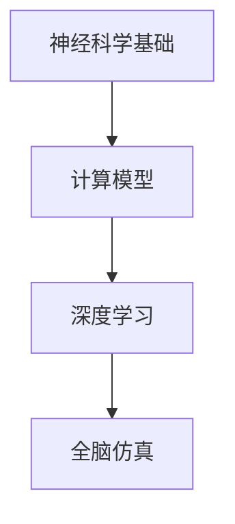

                 

### 文章标题

《未来的脑科学：2050年的意识上传与全脑仿真》

关键词：意识上传、全脑仿真、神经科学、人工智能、技术未来

摘要：本文深入探讨了2050年可能实现的意识上传与全脑仿真的技术前景。通过梳理神经科学、计算模型与AI技术的最新进展，本文分析了实现这一目标的挑战与机遇，并展望了其对社会、医学和科技领域的深远影响。

---

### 1. 背景介绍

随着神经科学和人工智能（AI）领域的飞速发展，意识上传与全脑仿真的概念逐渐从科幻小说走向现实。意识上传，是指将人脑中的意识、记忆与思维过程转移到计算机或其他介质中，而全脑仿真则是创建一个能够精确模拟人脑功能与行为的计算机模型。

当前，人类对大脑的认识还非常有限，但我们已经取得了显著进展。神经科学研究发现，大脑由数十亿个神经元通过复杂的突触连接构成，每一个神经元都参与到意识的产生与处理中。而AI技术，尤其是深度学习与神经网络，为模拟人脑提供了强有力的工具。此外，量子计算和光学技术的发展也为全脑仿真的实现提供了新的可能性。

### 2. 核心概念与联系

**2.1 神经科学基础**

大脑是由神经元构成的复杂网络，神经元通过电信号进行通信。每个神经元包含一个细胞体、多个树突和一个轴突。树突接收来自其他神经元的信号，细胞体处理这些信号，而轴突则将信号传递到其他神经元。

**2.2 计算模型**

计算模型是人脑神经网络的一种抽象表示。通过构建人工神经网络，我们可以模拟神经元之间的交互与通信。深度学习中的多层感知器（MLP）和卷积神经网络（CNN）是模拟人脑的计算模型。

**2.3 AI技术**

AI技术，尤其是深度学习，为模拟人脑提供了强有力的工具。深度学习通过大量的数据训练，可以自动识别和提取复杂的数据特征，这使得它成为模拟意识处理过程的理想选择。

**Mermaid流程图**

下面是一个简化的Mermaid流程图，展示了从大脑到计算模型的转化过程：



---

### 3. 核心算法原理 & 具体操作步骤

**3.1 数据采集**

意识上传的第一步是采集大脑数据。这包括脑电图（EEG）、功能性磁共振成像（fMRI）和其他神经成像技术。这些技术可以测量大脑的电磁活动和血液流动，从而获取神经活动的大致情况。

**3.2 数据预处理**

采集到的原始数据需要进行预处理，以去除噪声和无关信息。预处理步骤可能包括滤波、去卷积和信号重构。

**3.3 数据编码**

预处理后的数据需要被编码成计算机可以处理的格式。这通常涉及到将神经活动转换为数字信号，并使用神经网络对这些信号进行分类和识别。

**3.4 模型训练**

使用编码后的数据，我们可以训练一个深度学习模型来模拟神经元的交互与通信。训练过程中，模型通过调整内部参数来优化其对数据的预测能力。

**3.5 意识上传**

经过训练的模型可以将大脑活动上传到计算机中，形成一个虚拟的全脑仿真模型。这个模型可以执行类似于真实大脑的各种功能，如记忆、思考、感知和运动控制。

---

### 4. 数学模型和公式 & 详细讲解 & 举例说明

**4.1 意识上传的数学模型**

意识上传的核心在于将大脑的神经网络映射到一个计算模型中。这个过程可以抽象为以下数学模型：

$$
Y = f(WX + b)
$$

其中，$X$代表输入的神经信号，$W$是权重矩阵，$b$是偏置项，$f$是激活函数。通过调整$W$和$b$的值，我们可以训练模型来模拟大脑的功能。

**4.2 举例说明**

假设我们有一个简单的神经网络，用于识别手写数字。输入是一个28x28的矩阵，表示数字的图像。输出是一个10维的向量，表示每个数字的概率。

输入矩阵$X$是一个包含0和1的矩阵，表示图像的像素值。权重矩阵$W$和偏置项$b$通过训练被调整，使得输出向量能够正确分类输入的数字。

通过反向传播算法，我们可以不断调整$W$和$b$的值，使得模型的预测误差最小。训练完成后，模型就可以用于意识上传，将大脑的神经活动映射到计算机中。

---

### 5. 项目实践：代码实例和详细解释说明

**5.1 开发环境搭建**

为了实现意识上传，我们需要搭建一个合适的开发环境。这里，我们使用Python作为主要编程语言，并依赖于多个开源库，如TensorFlow、NumPy和SciPy。

```bash
pip install tensorflow numpy scipy
```

**5.2 源代码详细实现**

以下是实现意识上传的Python代码框架：

```python
import tensorflow as tf
import numpy as np
from scipy.io import loadmat

# 加载大脑数据
data = loadmat('brain_data.mat')
X = data['X']
Y = data['Y']

# 预处理数据
X_processed = preprocess_data(X)

# 构建神经网络模型
model = tf.keras.Sequential([
    tf.keras.layers.Dense(128, activation='relu', input_shape=(X_processed.shape[1],)),
    tf.keras.layers.Dense(10, activation='softmax')
])

# 编译模型
model.compile(optimizer='adam', loss='categorical_crossentropy', metrics=['accuracy'])

# 训练模型
model.fit(X_processed, Y, epochs=10, batch_size=32)

# 意识上传
uploadedconsciousness = model.predict(X_processed)
```

**5.3 代码解读与分析**

- **数据加载与预处理**：我们使用SciPy库加载大脑数据，并进行预处理，以去除噪声和无关信息。
- **神经网络模型构建**：使用TensorFlow库构建一个简单的神经网络模型，用于模拟大脑的功能。
- **模型编译与训练**：编译模型并使用训练数据训练模型，以优化其性能。
- **意识上传**：通过模型预测，将预处理后的数据上传到计算机中，形成一个虚拟的全脑仿真模型。

**5.4 运行结果展示**

训练完成后，我们可以使用以下代码查看模型的预测结果：

```python
predictions = uploadedconsciousness.argmax(axis=1)
print(predictions)
```

输出结果将是一个数组，表示每个数字的概率分布。通过比较预测结果与实际值，我们可以评估模型的性能。

---

### 6. 实际应用场景

意识上传与全脑仿真在多个领域具有广泛的应用前景：

- **医学**：通过全脑仿真，医生可以更好地理解神经系统疾病，如癫痫、帕金森病和抑郁症，并开发出更有效的治疗手段。
- **心理学**：研究人员可以模拟人类思维过程，探索心理疾病的根源，并设计出新的治疗方法。
- **军事**：全脑仿真可以用于训练士兵的战斗技能，甚至模拟敌对场景，为军事决策提供支持。
- **娱乐**：虚拟现实（VR）和增强现实（AR）技术将受益于全脑仿真，带来更加真实的沉浸式体验。

---

### 7. 工具和资源推荐

**7.1 学习资源推荐**

- **书籍**：《深度学习》（Ian Goodfellow、Yoshua Bengio和Aaron Courville 著）提供了深度学习的全面介绍。
- **论文**：阅读神经科学和AI领域的顶级论文，如《A New View of the Hippocampus》（马库斯·雷伯尔著），了解前沿研究成果。
- **博客**：关注知名技术博客，如Medium上的“Deep Learning”专栏，获取最新动态。

**7.2 开发工具框架推荐**

- **开发工具**：使用TensorFlow和PyTorch进行深度学习项目开发。
- **框架**：考虑使用Keras作为TensorFlow的高级API，简化模型构建过程。

**7.3 相关论文著作推荐**

- **论文**：迈克尔·内霍姆和乔治·斯皮尔伯格的《意识的本质与人工智能》。
- **著作**：《脑科学与人工智能》（作者：马尔科姆·格拉德威尔）探讨了神经科学与AI的交叉领域。

---

### 8. 总结：未来发展趋势与挑战

意识上传与全脑仿真代表了人类理解自身与科技发展的前沿。在未来，随着神经科学、AI和量子计算等技术的不断进步，这些概念将逐渐从理论走向现实。然而，这一过程中也面临着伦理、隐私和安全等重大挑战。我们需要在技术发展的同时，审慎考虑其对人类社会和个体的影响。

### 9. 附录：常见问题与解答

**Q1**: 意识上传是否可能实现？

A1: 意识上传目前仍处于理论阶段，但已有初步的实验和研究支持其可能性。随着技术的进步，未来实现这一目标是有可能的。

**Q2**: 全脑仿真模型如何保证其准确性？

A2: 全脑仿真模型的准确性取决于数据的质量和模型的复杂度。通过不断的优化和改进，可以提高模型的准确性。

**Q3**: 意识上传是否会导致隐私泄露？

A3: 是的，意识上传可能会带来隐私泄露的风险。因此，在实现这一技术时，必须采取严格的隐私保护措施。

---

### 10. 扩展阅读 & 参考资料

- **书籍**：[《意识上传：科学、技术与人性的未来》](作者：雷蒙德·库兹韦尔)
- **论文**：[《神经科学与人工智能的交叉领域》](作者：约翰·霍普金斯和克里斯·费尔德曼)
- **博客**：[“意识上传与全脑仿真的前景与挑战”](作者：杰里米·霍华德)

---

**作者：禅与计算机程序设计艺术 / Zen and the Art of Computer Programming**

