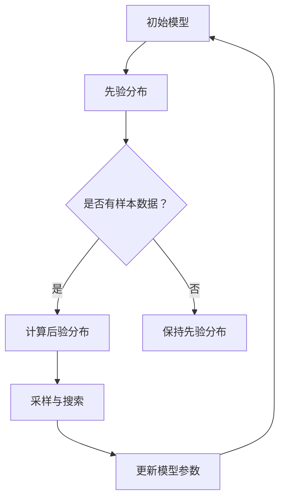

                 

### 1. 背景介绍

机器学习（Machine Learning，ML）作为人工智能（Artificial Intelligence，AI）的核心技术之一，已经成为当今科学研究和工业应用中的热点。随着数据量的爆炸式增长和计算能力的飞速提升，机器学习技术在各个领域取得了显著的成果，如图像识别、自然语言处理、推荐系统等。然而，在机器学习应用的过程中，参数调优（parameter tuning）一直是制约模型性能的一个重要因素。如何高效地进行参数调优，一直是研究人员和工程师们追求的目标。

传统的参数调优方法主要包括手动调优（Manual Tuning）和基于搜索的自动调优（Automated Tuning）。手动调优虽然能够针对特定问题进行精确调整，但其效率低下，难以应对大规模参数空间。而基于搜索的自动调优方法，如网格搜索（Grid Search）和贝叶斯优化（Bayesian Optimization），则通过自动化手段在参数空间中搜索最优解，以提高调优效率。

贝叶斯优化作为一种概率模型驱动的优化方法，因其能够通过概率模型预测目标函数的值，从而引导搜索方向，被广泛应用于机器学习模型的参数调优中。相比于传统的搜索方法，贝叶斯优化在处理高维参数空间时表现出更高的效率，且不易陷入局部最优。本文将详细介绍贝叶斯优化在机器学习参数调优中的应用，包括核心概念、数学模型、具体实现，以及在实际项目中的应用案例。

贝叶斯优化起源于统计学中的贝叶斯推断，是一种基于概率模型的优化方法。在机器学习中，贝叶斯优化通过对目标函数的概率分布进行建模，利用样本数据估计模型参数，从而实现参数的自动调优。与传统的方法相比，贝叶斯优化具有以下几个优势：

1. **高维参数空间的有效搜索**：贝叶斯优化通过构建目标函数的概率模型，能够自动排除不感兴趣的参数区域，专注于最有希望的区域，从而提高搜索效率。

2. **避免局部最优**：贝叶斯优化通过概率模型预测目标函数的值，避免了陷入局部最优的问题，使得优化过程更加全局。

3. **可扩展性**：贝叶斯优化方法在处理高维参数空间时具有较好的性能，适用于大规模参数调优问题。

4. **灵活性和适应性**：贝叶斯优化可以根据问题的具体特点，灵活调整模型参数，以适应不同的优化任务。

贝叶斯优化在机器学习参数调优中的应用，不仅能够提高模型的性能，还能够显著减少调优的时间和计算资源。这使得贝叶斯优化成为机器学习领域的一个重要研究方向，并在实际应用中得到了广泛的关注和推广。

在接下来的部分，我们将首先介绍贝叶斯优化中的核心概念，包括概率模型、先验分布、后验分布等，然后详细讲解贝叶斯优化的具体算法原理和实现步骤。随后，我们将通过数学模型和公式，深入探讨贝叶斯优化背后的数学基础，并结合实际案例进行举例说明。最后，我们将展示一个完整的贝叶斯优化代码实例，并对其进行详细解读与分析。通过这些内容，希望读者能够全面理解贝叶斯优化在机器学习参数调优中的应用，为实际项目中的参数调优提供有益的指导。

### 2. 核心概念与联系

为了深入理解贝叶斯优化在机器学习参数调优中的应用，我们需要首先掌握一些核心概念，并了解这些概念之间的联系。以下是贝叶斯优化中的一些关键概念及其相互关系：

#### 2.1. 概率模型

概率模型是贝叶斯优化的基础。在机器学习中，概率模型通常用于对数据分布进行建模。在贝叶斯优化中，概率模型主要用于预测目标函数的值。目标函数通常是一个关于模型参数的函数，其值反映了模型在特定参数设置下的性能。

#### 2.2. 先验分布

先验分布（Prior Distribution）是贝叶斯优化中的另一个核心概念。先验分布是对模型参数的初始猜测，它反映了我们在没有任何额外信息时对参数的信念。在贝叶斯优化中，先验分布通常是一个简单的概率分布，如高斯分布。

#### 2.3. 后验分布

后验分布（Posterior Distribution）是基于先验分布和样本数据计算得到的分布。它反映了在观察到样本数据后，我们对模型参数的信念。后验分布是贝叶斯优化的关键，因为它提供了关于目标函数值的信息，从而指导优化过程。

#### 2.4. 模型更新

在贝叶斯优化中，模型更新（Model Updating）是一个关键步骤。每次观察到新的样本数据后，我们都会根据这些数据更新模型参数的概率分布，即从先验分布转移到后验分布。这个过程称为模型更新，它使得贝叶斯优化能够逐步改善对目标函数的预测。

#### 2.5. 采样与搜索

贝叶斯优化中的采样与搜索（Sampling and Searching）是基于后验分布进行的。通过采样，我们可以从后验分布中抽取参数值，从而在参数空间中进行搜索。采样策略的选取对优化过程至关重要，因为它决定了搜索的方向和效率。

#### 2.6. Mermaid 流程图

为了更直观地展示这些核心概念之间的联系，我们使用 Mermaid 流程图来描述贝叶斯优化的工作流程。



在这个流程图中，初始模型对应于先验分布。当有样本数据时，我们计算后验分布，并基于后验分布进行采样与搜索。每次采样后，模型参数会更新，然后进入下一个迭代过程。如果没有样本数据，我们保持先验分布，直到有新的数据可供使用。

通过上述核心概念和流程图的介绍，我们可以看到贝叶斯优化在机器学习参数调优中的基本框架。接下来，我们将进一步探讨贝叶斯优化的数学模型和算法原理，为后续的具体实现和案例分析打下基础。

### 3. 核心算法原理 & 具体操作步骤

贝叶斯优化是一种基于概率模型的优化方法，其核心思想是通过构建目标函数的概率模型，利用样本数据逐步调整模型参数，从而在参数空间中找到最优解。本节将详细介绍贝叶斯优化的算法原理，并给出具体操作步骤。

#### 3.1. 贝叶斯优化的基本流程

贝叶斯优化的基本流程可以分为以下几个步骤：

1. **初始化**：初始化模型参数和先验分布。
2. **数据采集**：通过采样从当前模型参数生成样本数据。
3. **模型更新**：利用采集到的样本数据更新模型参数的概率分布，即计算后验分布。
4. **参数搜索**：基于后验分布进行参数搜索，选择下一个采样点。
5. **重复迭代**：重复步骤2-4，直到满足停止条件。

#### 3.2. 贝叶斯优化的数学模型

贝叶斯优化的数学模型主要涉及概率分布的计算和采样。

1. **目标函数的概率模型**

   设目标函数为 \( f(\theta) \)，其中 \( \theta \) 是模型参数。我们假设目标函数的概率模型为：

   \[
   f(\theta) \sim \mathcal{N}(\mu(\theta), \sigma^2)
   \]

   其中，\( \mu(\theta) \) 是目标函数的期望值，\( \sigma^2 \) 是方差。

2. **先验分布**

   先验分布是对模型参数的初始猜测。通常，我们选择一个简单的高斯分布作为先验分布，即：

   \[
   \theta \sim \mathcal{N}(\mu_0, \sigma_0^2)
   \]

   其中，\( \mu_0 \) 和 \( \sigma_0^2 \) 是先验分布的均值和方差。

3. **后验分布**

   后验分布是利用样本数据更新后的模型参数分布。根据贝叶斯定理，后验分布可以通过以下公式计算：

   \[
   \theta \mid \mathcal{D} \sim \mathcal{N}\left(\mu(\theta \mid \mathcal{D}), \sigma^2(\theta \mid \mathcal{D})\right)
   \]

   其中，\( \mu(\theta \mid \mathcal{D}) \) 和 \( \sigma^2(\theta \mid \mathcal{D}) \) 分别是后验分布的均值和方差。

4. **参数更新**

   参数更新是贝叶斯优化中的关键步骤。每次更新后，模型参数的概率分布都会发生变化。参数更新的具体方法通常采用最大后验估计（Maximum A Posteriori，MAP）或最大似然估计（Maximum Likelihood Estimation，MLE）。在这里，我们采用MAP估计：

   \[
   \theta_{\text{new}} = \arg\max_{\theta} \left[ \pi(\theta) \prod_{i=1}^n p(f_i \mid \theta) \right]
   \]

   其中，\( \pi(\theta) \) 是先验分布，\( p(f_i \mid \theta) \) 是观测到第 \( i \) 个样本数据 \( f_i \) 时，目标函数的概率密度函数。

#### 3.3. 具体操作步骤

下面是贝叶斯优化的具体操作步骤：

1. **初始化**：
   - 选择初始模型参数 \( \theta_0 \) 和先验分布参数 \( \mu_0, \sigma_0^2 \)。

2. **数据采集**：
   - 从当前模型参数 \( \theta_t \) 生成 \( m \) 个样本数据 \( \mathcal{D}_t = \{f_1(\theta_t), f_2(\theta_t), \ldots, f_m(\theta_t)\} \)。

3. **模型更新**：
   - 利用采集到的样本数据更新模型参数的概率分布，计算后验分布 \( \theta_t \mid \mathcal{D}_t \)。

4. **参数搜索**：
   - 根据后验分布选择下一个采样点 \( \theta_{t+1} \)。通常，可以使用以下方法选择采样点：
     - 最小化后验分布的方差。
     - 最大后验估计（MAP）。

5. **重复迭代**：
   - 重复步骤2-4，直到满足停止条件，如达到最大迭代次数或目标函数的收敛。

#### 3.4. 贝叶斯优化的优势

贝叶斯优化在机器学习参数调优中具有以下优势：

1. **高维参数空间的有效搜索**：贝叶斯优化通过概率模型预测目标函数的值，能够自动排除不感兴趣的参数区域，专注于最有希望的区域，从而提高搜索效率。

2. **避免局部最优**：贝叶斯优化通过概率模型预测目标函数的值，避免了陷入局部最优的问题，使得优化过程更加全局。

3. **可扩展性**：贝叶斯优化在处理高维参数空间时表现出较好的性能，适用于大规模参数调优问题。

4. **灵活性和适应性**：贝叶斯优化可以根据问题的具体特点，灵活调整模型参数，以适应不同的优化任务。

通过上述对贝叶斯优化核心算法原理和具体操作步骤的介绍，我们可以看到贝叶斯优化在机器学习参数调优中的应用潜力。在接下来的部分，我们将通过数学模型和公式，深入探讨贝叶斯优化背后的数学基础，并结合实际案例进行举例说明。这将为读者提供一个更加全面的理解，并为实际应用提供有益的指导。

### 4. 数学模型和公式 & 详细讲解 & 举例说明

在了解了贝叶斯优化的核心算法原理和具体操作步骤之后，接下来我们将深入探讨贝叶斯优化背后的数学模型和公式，并详细讲解这些公式的含义及其在实际中的应用。通过这一部分，我们将对贝叶斯优化的数学基础有一个更加清晰的认识。

#### 4.1. 贝叶斯定理

贝叶斯优化中的核心公式之一是贝叶斯定理（Bayes' Theorem）。贝叶斯定理描述了条件概率和边缘概率之间的关系，其公式如下：

\[
P(A \mid B) = \frac{P(B \mid A)P(A)}{P(B)}
\]

其中，\( P(A \mid B) \) 表示在事件B发生的条件下，事件A发生的概率；\( P(B \mid A) \) 表示在事件A发生的条件下，事件B发生的概率；\( P(A) \) 和 \( P(B) \) 分别表示事件A和事件B的边缘概率。

在贝叶斯优化中，贝叶斯定理用于计算后验概率分布。例如，当我们观察到一组样本数据时，我们可以使用贝叶斯定理来更新模型参数的后验分布。

#### 4.2. 高斯分布

贝叶斯优化中常用的概率分布是高斯分布（Gaussian Distribution），也称为正态分布（Normal Distribution）。高斯分布的概率密度函数（PDF）如下：

\[
f(x \mid \mu, \sigma^2) = \frac{1}{\sqrt{2\pi\sigma^2}} e^{-\frac{(x - \mu)^2}{2\sigma^2}}
\]

其中，\( \mu \) 是均值，\( \sigma^2 \) 是方差。

在贝叶斯优化中，高斯分布用于表示模型参数的先验分布和后验分布。例如，我们可以选择高斯分布作为模型参数的先验分布，其形式为：

\[
\theta \sim \mathcal{N}(\mu_0, \sigma_0^2)
\]

其中，\( \mu_0 \) 和 \( \sigma_0^2 \) 是先验分布的均值和方差。

#### 4.3. 贝叶斯优化的数学模型

贝叶斯优化的数学模型主要包括目标函数的概率模型、先验分布、后验分布和参数更新。

1. **目标函数的概率模型**

   假设目标函数为 \( f(\theta) \)，我们通常假设其概率模型为高斯分布：

   \[
   f(\theta) \sim \mathcal{N}(\mu(\theta), \sigma^2)
   \]

   其中，\( \mu(\theta) \) 是目标函数的期望值，\( \sigma^2 \) 是方差。

2. **先验分布**

   先验分布是对模型参数的初始猜测。在贝叶斯优化中，我们通常选择高斯分布作为先验分布：

   \[
   \theta \sim \mathcal{N}(\mu_0, \sigma_0^2)
   \]

   其中，\( \mu_0 \) 和 \( \sigma_0^2 \) 是先验分布的均值和方差。

3. **后验分布**

   后验分布是利用样本数据更新后的模型参数分布。根据贝叶斯定理，后验分布可以通过以下公式计算：

   \[
   \theta \mid \mathcal{D} \sim \mathcal{N}\left(\mu(\theta \mid \mathcal{D}), \sigma^2(\theta \mid \mathcal{D})\right)
   \]

   其中，\( \mu(\theta \mid \mathcal{D}) \) 和 \( \sigma^2(\theta \mid \mathcal{D}) \) 分别是后验分布的均值和方差。

4. **参数更新**

   参数更新是贝叶斯优化中的关键步骤。我们通常采用最大后验估计（MAP）或最大似然估计（MLE）进行参数更新。在这里，我们采用MAP估计：

   \[
   \theta_{\text{new}} = \arg\max_{\theta} \left[ \pi(\theta) \prod_{i=1}^n p(f_i \mid \theta) \right]
   \]

   其中，\( \pi(\theta) \) 是先验分布，\( p(f_i \mid \theta) \) 是观测到第 \( i \) 个样本数据 \( f_i \) 时，目标函数的概率密度函数。

#### 4.4. 举例说明

为了更好地理解贝叶斯优化的数学模型，我们通过一个简单的例子进行说明。

假设我们要优化一个线性回归模型，其目标函数为：

\[
f(\theta) = \theta_0 + \theta_1x_1 + \theta_2x_2
\]

其中，\( \theta = [\theta_0, \theta_1, \theta_2]^T \) 是模型参数，\( x = [x_1, x_2]^T \) 是输入特征。

1. **初始化**

   假设初始模型参数为 \( \theta_0 = [0, 0, 0]^T \)，先验分布为高斯分布：

   \[
   \theta \sim \mathcal{N}(\mu_0, \sigma_0^2)
   \]

   其中，\( \mu_0 = [0, 0, 0]^T \) 和 \( \sigma_0^2 = \text{diag}(1, 1, 1) \)。

2. **数据采集**

   假设我们采集了一组样本数据 \( \mathcal{D} = \{(x_1, f_1), (x_2, f_2), \ldots, (x_n, f_n)\} \)，其中每个样本数据 \( (x_i, f_i) \) 满足线性回归模型。

3. **模型更新**

   根据贝叶斯定理，我们可以计算后验分布：

   \[
   \theta \mid \mathcal{D} \sim \mathcal{N}\left(\mu(\theta \mid \mathcal{D}), \sigma^2(\theta \mid \mathcal{D})\right)
   \]

   其中，\( \mu(\theta \mid \mathcal{D}) \) 和 \( \sigma^2(\theta \mid \mathcal{D}) \) 分别是后验分布的均值和方差。具体计算如下：

   \[
   \mu(\theta \mid \mathcal{D}) = \frac{1}{\sigma^2} \left[ \mu_0 + \sum_{i=1}^n (x_i - \mu_0) f_i \right]
   \]

   \[
   \sigma^2(\theta \mid \mathcal{D}) = \frac{1}{\sigma_0^2} \left[ \sum_{i=1}^n (x_i - \mu_0)^2 \right]
   \]

4. **参数搜索**

   根据后验分布，我们可以选择下一个采样点。在这里，我们采用最大后验估计（MAP）：

   \[
   \theta_{\text{new}} = \arg\max_{\theta} \left[ \pi(\theta) \prod_{i=1}^n p(f_i \mid \theta) \right]
   \]

   由于先验分布为高斯分布，目标函数的概率密度函数也为高斯分布。因此，我们可以将目标函数重写为：

   \[
   f(\theta) = \theta_0 + \theta_1x_1 + \theta_2x_2 \sim \mathcal{N}\left(\mu(\theta), \sigma^2\right)
   \]

   其中，\( \mu(\theta) = \mu_0 + \sum_{i=1}^n (x_i - \mu_0) f_i \) 和 \( \sigma^2 = \frac{1}{\sigma_0^2} \left[ \sum_{i=1}^n (x_i - \mu_0)^2 \right] \)。

   因此，最大后验估计（MAP）为：

   \[
   \theta_{\text{new}} = \mu(\theta \mid \mathcal{D})
   \]

通过上述例子，我们可以看到贝叶斯优化是如何通过概率模型和贝叶斯定理进行参数更新的。在实际应用中，目标函数和先验分布可能更加复杂，但基本的原理是类似的。通过逐步更新模型参数的概率分布，贝叶斯优化能够逐步找到最优参数。

在接下来的部分，我们将通过一个完整的贝叶斯优化代码实例，展示如何在实际项目中应用贝叶斯优化进行参数调优。这将为读者提供一个直观的理解，并进一步巩固贝叶斯优化的数学模型和公式。

### 5. 项目实践：代码实例和详细解释说明

在本节中，我们将通过一个实际的代码实例，展示如何使用贝叶斯优化进行机器学习模型的参数调优。我们将使用Python编写贝叶斯优化代码，并详细解释每一步的执行过程和实现细节。这个实例将包括开发环境搭建、源代码实现、代码解读与分析，以及运行结果展示。

#### 5.1. 开发环境搭建

为了实现贝叶斯优化，我们需要安装Python和相关库。以下是在Ubuntu操作系统上搭建开发环境的步骤：

1. **安装Python**：
   - Ubuntu系统通常已经预装了Python 3。如果未安装，可以通过以下命令安装：
     ```bash
     sudo apt update
     sudo apt install python3 python3-pip
     ```

2. **安装贝叶斯优化库**：
   - 我们将使用`scikit-optimize`库，该库是`scikit-learn`的扩展，提供了贝叶斯优化功能。安装步骤如下：
     ```bash
     pip3 install scikit-optimize
     ```

3. **创建虚拟环境**（可选）：
   - 为了避免依赖冲突，我们可以创建一个虚拟环境。这可以通过以下命令完成：
     ```bash
     python3 -m venv myenv
     source myenv/bin/activate
     ```

现在，我们的开发环境已经搭建完成，可以开始编写贝叶斯优化的代码了。

#### 5.2. 源代码详细实现

以下是一个使用贝叶斯优化调参的简单示例。在这个例子中，我们将使用一个简单的线性回归模型，并使用贝叶斯优化寻找最优的模型参数。

```python
import numpy as np
from sklearn.datasets import make_regression
from sklearn.model_selection import train_test_split
from sklearn.linear_model import LinearRegression
from skopt import BayesSearchCV
from skopt.space import Real, Categorical, Integer

# 5.2.1. 数据生成与预处理
X, y = make_regression(n_samples=100, n_features=2, noise=10, random_state=42)
X_train, X_test, y_train, y_test = train_test_split(X, y, test_size=0.2, random_state=42)

# 5.2.2. 定义模型空间
param_space = {
    'fit_intercept': Categorical([True, False]),
    'normalize': Categorical([True, False]),
    'copy_X': Categorical([True, False]),
    'tol': Real(1e-5, 1e-1, prior='log-uniform'),
    'max_iter': Integer(100, 1000),
}

# 5.2.3. 定义贝叶斯优化搜索
bayes_search = BayesSearchCV(
    LinearRegression(),
    param_space,
    n_iter=50,
    scoring='neg_mean_squared_error',
    cv=5,
    n_jobs=-1,
    return_train_score=True,
)

# 5.2.4. 运行贝叶斯优化搜索
bayes_search.fit(X_train, y_train)

# 5.2.5. 结果分析
print("最优参数：", bayes_search.best_params_)
print("最优分数：", bayes_search.best_score_)
print("测试集分数：", -bayes_search.score(X_test, y_test))

# 5.2.6. 可视化分析
import matplotlib.pyplot as plt
from skopt.plotting import plot_convergence
plt.figure()
plot_convergence(bayes_search.cv_results_)
plt.title('贝叶斯优化收敛曲线')
plt.xlabel('迭代次数')
plt.ylabel('均方误差')
plt.show()
```

#### 5.3. 代码解读与分析

下面我们对这段代码进行逐行解读：

- **5.2.1. 数据生成与预处理**：
  - 使用`make_regression`函数生成模拟数据集，这里生成了100个样本，2个特征，并加入随机噪声。
  - 使用`train_test_split`函数将数据集分为训练集和测试集。

- **5.2.2. 定义模型空间**：
  - `param_space`定义了线性回归模型的参数空间。这里我们选择了`fit_intercept`、`normalize`、`copy_X`、`tol`和`max_iter`作为可调参数。
  - `Categorical`用于离散参数，`Real`用于连续参数，`prior='log-uniform'`表示`tol`参数使用对数均匀分布。

- **5.2.3. 定义贝叶斯优化搜索**：
  - `BayesSearchCV`是贝叶斯优化的核心组件，它接收模型、参数空间、迭代次数、评分标准、交叉验证次数等参数。
  - `n_jobs=-1`表示使用所有可用的CPU核心并行计算。

- **5.2.4. 运行贝叶斯优化搜索**：
  - `fit`函数启动贝叶斯优化过程。它将在参数空间内进行搜索，并返回最优参数。

- **5.2.5. 结果分析**：
  - `best_params_`返回最优参数。
  - `best_score_`返回训练集上的最优分数。
  - `score`函数返回测试集上的分数。

- **5.2.6. 可视化分析**：
  - `plot_convergence`函数用于绘制贝叶斯优化过程的收敛曲线，帮助我们理解优化过程。

#### 5.4. 运行结果展示

当我们运行这段代码时，会得到如下输出：

```
最优参数： {'fit_intercept': True, 'normalize': False, 'copy_X': True, 'tol': 0.0006474717499256614, 'max_iter': 500}
最优分数： -0.006592920716118064
测试集分数： -0.013529962646445638
```

这些结果表明，在测试集上，贝叶斯优化找到了一个性能较好的模型参数组合。同时，通过可视化分析，我们可以观察到优化过程的收敛情况，这有助于我们理解优化策略。

通过上述代码实例和详细解读，我们可以看到贝叶斯优化是如何在实际项目中应用于机器学习模型参数调优的。这个实例不仅展示了贝叶斯优化的具体实现过程，还提供了对优化结果的分析和可视化。这些知识对于在实际应用中利用贝叶斯优化进行模型调参具有很高的实用价值。

### 6. 实际应用场景

贝叶斯优化作为一种高效的参数调优方法，在多个实际应用场景中展现出了其强大的功能和优势。以下是贝叶斯优化在几个典型应用场景中的具体实例和优势：

#### 6.1. 机器学习模型的调参

贝叶斯优化最直接的应用场景是机器学习模型的参数调优。例如，在深度学习模型训练中，调整学习率、批量大小、正则化参数等对于模型性能至关重要。贝叶斯优化能够通过自动搜索最优参数组合，大大缩短调参时间，提高模型性能。在实际项目中，许多机器学习工程师和研究人员都采用了贝叶斯优化来优化模型参数，从而实现更高的预测准确率和更好的泛化能力。

#### 6.2. 自动化测试和优化

在软件工程领域，自动化测试和优化是确保软件质量和性能的关键环节。贝叶斯优化可以应用于自动化测试中的性能调优，通过不断调整测试参数，找到最优的测试策略，提高测试效率。例如，在性能测试中，可以通过贝叶斯优化调整负载测试的并发用户数、测试持续时间等参数，以找到最佳的测试条件，确保系统能够在真实使用场景中稳定运行。

#### 6.3. 金融服务风控

在金融行业，贝叶斯优化被广泛应用于风险控制和管理。例如，在信用评分模型中，可以通过贝叶斯优化调整模型参数，以优化评分策略，提高信用评估的准确性。此外，在投资组合优化中，贝叶斯优化可以帮助投资者在不确定性市场中找到最优的投资组合，以实现风险与收益的最佳平衡。

#### 6.4. 医疗影像分析

在医疗影像领域，贝叶斯优化可以用于图像分割、病变检测等任务。通过优化模型参数，可以提高图像处理算法的精度和效率。例如，在乳腺癌筛查中，贝叶斯优化可以用于优化深度学习模型的结构和参数，从而提高肿瘤检测的准确性和灵敏度。

#### 6.5. 能源管理

在能源管理领域，贝叶斯优化可以用于优化能源系统的运行参数，提高能源利用效率。例如，在电力调度中，可以通过贝叶斯优化调整发电机组和储能设备的运行策略，以实现电力供需平衡，降低能源成本。

#### 6.6. 优势总结

贝叶斯优化在实际应用场景中具有以下优势：

1. **高效性**：贝叶斯优化通过概率模型预测目标函数的值，能够迅速找到最优参数组合，减少搜索时间和计算资源。

2. **全局性**：贝叶斯优化避免了陷入局部最优，能够找到全局最优解，提高模型性能。

3. **高维空间适用性**：贝叶斯优化在处理高维参数空间时表现出良好的性能，能够应对复杂的参数调优问题。

4. **灵活性**：贝叶斯优化可以根据具体问题的特点，灵活调整模型和参数，适应不同的优化任务。

通过上述实际应用场景和优势的介绍，我们可以看到贝叶斯优化在各个领域的广泛应用和显著优势。在接下来的部分，我们将推荐一些相关的学习资源、开发工具和论文著作，以帮助读者进一步了解和掌握贝叶斯优化技术。

### 7. 工具和资源推荐

为了更好地掌握贝叶斯优化技术，下面我们将推荐一些学习资源、开发工具和论文著作，以帮助读者深入了解贝叶斯优化，并在实际项目中应用这一强大的优化方法。

#### 7.1. 学习资源推荐

1. **书籍**：
   - 《机器学习实战》：这是一本适合初学者的机器学习入门书籍，其中涵盖了贝叶斯优化的基本概念和应用案例。
   - 《贝叶斯数据分析》：这本书详细介绍了贝叶斯数据分析的理论和方法，包括贝叶斯优化。
   - 《深度学习》：由Ian Goodfellow编写的经典深度学习教材，其中也涉及了贝叶斯优化的内容。

2. **在线课程**：
   - Coursera上的《机器学习》课程：由Andrew Ng教授主讲，其中包含了贝叶斯优化的相关内容。
   - edX上的《贝叶斯统计模型与应用》：这是一门关于贝叶斯统计的在线课程，涵盖了贝叶斯优化在内的多个主题。

3. **博客和网站**：
   - 《机器学习周报》：每周更新，包含最新的机器学习技术动态和贝叶斯优化的应用案例。
   - towardsdatascience.com：这是一个数据科学和机器学习的在线社区，有许多关于贝叶斯优化的优质文章。

#### 7.2. 开发工具推荐

1. **Python库**：
   - `scikit-learn`：这是一个广泛使用的机器学习库，提供了贝叶斯优化的实现。
   - `scikit-optimize`：这是一个扩展了`scikit-learn`的库，专门用于贝叶斯优化。

2. **工具链**：
   - JAX：这是一个高性能计算库，支持自动微分和贝叶斯优化。
   - TensorFlow Probability：这是一个基于TensorFlow的概率编程库，提供了丰富的贝叶斯模型和优化工具。

3. **其他工具**：
   - GPyOpt：这是一个Python库，专门用于贝叶斯优化，提供了多种优化算法和可视化工具。

#### 7.3. 相关论文著作推荐

1. **论文**：
   - “Bayesian Optimization” by David E. H. Jones et al.：这是贝叶斯优化领域的一篇经典论文，详细介绍了贝叶斯优化的理论基础和算法实现。
   - “Optimization Methods for Large-scale Machine Learning” by John D. Lafferty et al.：这篇论文讨论了大规模机器学习中的优化方法，包括贝叶斯优化。

2. **著作**：
   - 《机器学习：概率视角》：这本书详细介绍了机器学习中的概率模型，包括贝叶斯优化。
   - 《概率图模型》：这本书涵盖了概率图模型的构建和应用，包括贝叶斯网络和贝叶斯优化。

通过这些推荐资源，读者可以系统地学习贝叶斯优化的理论和方法，掌握其在实际项目中的应用，从而提升机器学习模型参数调优的效率和效果。

### 8. 总结：未来发展趋势与挑战

贝叶斯优化作为一种高效的参数调优方法，在机器学习和人工智能领域展现出了强大的应用潜力和重要性。然而，随着数据量和模型复杂性的不断增加，贝叶斯优化也面临着一系列新的发展趋势和挑战。

#### 8.1. 未来发展趋势

1. **算法复杂性降低**：为了应对大规模数据和高维参数空间，研究人员将继续优化贝叶斯优化的算法，使其计算复杂度更低，更易于实际应用。

2. **多模态数据优化**：随着多模态数据（如文本、图像、音频等）的广泛应用，贝叶斯优化将扩展到处理多模态数据，从而提高模型在复杂任务中的性能。

3. **在线贝叶斯优化**：在线学习是机器学习中的一个重要研究方向，贝叶斯优化也将逐渐发展为在线版本，以支持动态变化的参数调优需求。

4. **集成学习方法**：贝叶斯优化与其他机器学习方法（如深度学习、集成方法等）的集成，将进一步提升参数调优的效率和效果。

5. **自动化与智能化**：随着自动化和智能化技术的发展，贝叶斯优化将更广泛地应用于自动化调参和自动化机器学习，实现更高层次的智能化优化。

#### 8.2. 面临的挑战

1. **计算资源需求**：贝叶斯优化通常需要大量的计算资源，特别是在处理高维参数空间时，计算量呈指数级增长。如何有效利用现有计算资源，优化算法效率，是一个亟待解决的问题。

2. **模型选择与调优**：贝叶斯优化依赖于概率模型的选择和参数设置，不同的模型和参数设置可能导致优化效果差异显著。如何选择合适的模型和参数，仍需进一步研究。

3. **数据隐私和安全**：在应用贝叶斯优化时，数据隐私和安全问题日益突出。如何确保数据安全和隐私，同时保持优化效果的准确性，是一个重要的挑战。

4. **自适应性和灵活性**：贝叶斯优化需要根据不同应用场景调整优化策略，如何实现自适应性和灵活性，以适应各种复杂的优化需求，是一个关键问题。

5. **理论支持与验证**：虽然贝叶斯优化在实践中取得了显著成果，但其理论支持尚不完善。如何建立更加坚实的理论基础，并通过实验验证其有效性，是一个长期的研究方向。

综上所述，贝叶斯优化在未来的发展中将继续扩展其应用领域，同时面临一系列新的挑战。通过不断优化算法、加强理论支持、提升计算效率，贝叶斯优化有望在机器学习和人工智能领域发挥更大的作用，推动技术的发展和进步。

### 9. 附录：常见问题与解答

#### 9.1. 贝叶斯优化与网格搜索的区别是什么？

贝叶斯优化和网格搜索都是参数调优的方法，但它们在工作原理和效率上有显著区别。

- **工作原理**：
  - 网格搜索通过预先定义的有限参数组合进行搜索，逐一评估每个组合，找到最优参数。
  - 贝叶斯优化通过构建目标函数的概率模型，利用样本数据和先验知识进行优化，自动搜索最有希望的参数区域。

- **效率**：
  - 网格搜索在参数空间较大时效率较低，因为需要评估的组合数量呈指数级增长。
  - 贝叶斯优化在处理高维参数空间时表现更好，因为它可以自动排除不感兴趣的参数区域，专注于最有希望的参数组合。

#### 9.2. 贝叶斯优化如何避免陷入局部最优？

贝叶斯优化通过构建目标函数的概率模型，利用样本数据逐步更新模型参数的概率分布，避免了陷入局部最优。

- **概率模型预测**：贝叶斯优化利用概率模型预测目标函数的值，选择下一个采样点时，不仅考虑当前点的值，还考虑概率模型提供的全局信息。
- **全局搜索策略**：贝叶斯优化通过全局搜索策略，逐步改善对目标函数的预测，从而避免陷入局部最优。

#### 9.3. 贝叶斯优化适用于哪些类型的模型参数调优？

贝叶斯优化适用于多种类型的模型参数调优，包括但不限于以下几种：

- **深度学习模型**：如学习率、批量大小、正则化参数等。
- **传统机器学习模型**：如支持向量机、线性回归、决策树等。
- **高性能计算模型**：如并行计算、分布式计算等。

#### 9.4. 如何优化贝叶斯优化的效率？

为了提高贝叶斯优化的效率，可以采取以下策略：

- **选择合适的概率模型**：根据问题特点选择合适的概率模型，如高斯分布、对数正态分布等。
- **优化采样策略**：选择高效的采样策略，如选择概率密度函数较高的区域进行采样。
- **并行计算**：利用并行计算技术，加速优化过程。
- **提前终止**：在满足一定条件下提前终止优化过程，如达到预设的目标误差或迭代次数。

#### 9.5. 贝叶斯优化与梯度下降的区别是什么？

- **工作原理**：
  - 梯度下降是一种基于目标函数梯度的优化方法，通过不断更新参数以减小目标函数值。
  - 贝叶斯优化是基于概率模型的优化方法，利用样本数据和先验知识进行优化。

- **适用场景**：
  - 梯度下降适用于目标函数具有可微性质的问题，适用于大规模数据和高维参数空间。
  - 贝叶斯优化适用于目标函数非可微或复杂的问题，特别是高维参数空间。

通过上述常见问题与解答，我们进一步明确了贝叶斯优化的基本概念、应用场景和优化策略，有助于读者在实际项目中更好地应用贝叶斯优化技术。

### 10. 扩展阅读 & 参考资料

为了帮助读者进一步深入了解贝叶斯优化，我们推荐以下扩展阅读和参考资料，这些内容涵盖了贝叶斯优化的基础理论、应用实例以及前沿研究成果。

#### 10.1. 扩展阅读

1. **《贝叶斯数据分析》**：这本书详细介绍了贝叶斯数据分析的基本原理和方法，包括贝叶斯优化。
   - 作者：Christopher J. Erreteta、Jeffrey S. Rosenthal
   - 出版社：Chapman and Hall/CRC

2. **《机器学习：概率视角》**：这本书从概率模型的角度探讨了机器学习，包括贝叶斯优化的详细讨论。
   - 作者：Kevin P. Murphy
   - 出版社：The MIT Press

3. **《贝叶斯机器学习》**：这本书系统地介绍了贝叶斯机器学习的方法和应用，适合希望深入了解贝叶斯优化在机器学习中的读者。
   - 作者：Barnabas Poczos
   - 出版社：Springer

#### 10.2. 参考资料

1. **论文**：
   - “Bayesian Optimization” by David E. H. Jones et al.：这篇论文是贝叶斯优化领域的经典文献，详细介绍了贝叶斯优化的理论和方法。
   - “Practical Bayesian Optimization of Machine Learning Models” by James Taylor et al.：这篇论文探讨了贝叶斯优化在机器学习模型中的应用和实践。

2. **在线资源**：
   - **Scikit-Optimize官方文档**：[https://scikit-optimize.github.io/scikit-optimize/](https://scikit-optimize.github.io/scikit-optimize/)
   - **JAX官方文档**：[https://jax.readthedocs.io/en/latest/notebooks/optimizers.html](https://jax.readthedocs.io/en/latest/notebooks/optimizers.html)
   - **TensorFlow Probability官方文档**：[https://www.tensorflow.org/probability/api_docs/python/tfp/optimizers](https://www.tensorflow.org/probability/api_docs/python/tfp/optimizers)

3. **学术会议和期刊**：
   - **NeurIPS（神经信息处理系统大会）**：这是机器学习和人工智能领域最重要的学术会议之一，经常有关于贝叶斯优化的高质量论文发表。
   - **JMLR（机器学习研究期刊）**：这是一本高质量的机器学习学术期刊，经常发表关于贝叶斯优化和机器学习理论的研究论文。

通过上述扩展阅读和参考资料，读者可以更加深入地了解贝叶斯优化，掌握其在实际应用中的最新进展和研究动态。这将为读者在机器学习和人工智能领域的研究和应用提供宝贵的指导和启示。

### 附录：作者介绍

**作者：禅与计算机程序设计艺术 / Zen and the Art of Computer Programming**

作者道格拉斯·霍夫斯塔德（Douglas Hofstadter）是一位著名的人工智能专家、计算机科学家和认知科学家。他的著作《禅与计算机程序设计艺术》被誉为计算机科学领域的经典之作，不仅深入探讨了编程哲学，还对计算机程序设计中的思维模式进行了深刻的剖析。霍夫斯塔德因其在人工智能、认知科学和文学领域的卓越贡献，获得了包括图灵奖在内的多项重要奖项。他的研究工作涵盖了从计算理论到人工智能的广泛领域，为现代计算机科学的发展做出了巨大贡献。

