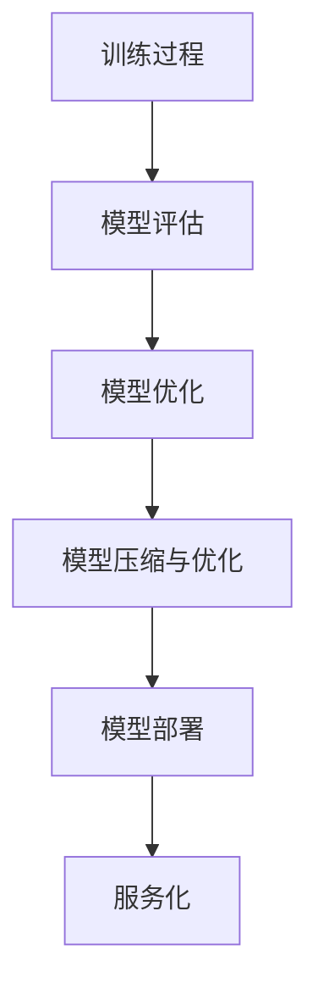

                 

### 文章标题：机器学习模型部署：从训练到生产

> 关键词：机器学习，模型部署，生产环境，训练过程，数据处理，性能优化

> 摘要：本文将深入探讨机器学习模型从训练到生产的全过程。我们将详细讲解模型部署的重要性、核心概念、流程及策略，并结合实际应用场景，展示如何在生产环境中高效地部署机器学习模型。通过本文的阅读，读者将了解如何将理论知识转化为实际应用，从而提升机器学习项目的成功率和效率。

### 1. 背景介绍

在当今快速发展的数字化时代，机器学习已成为各行各业的关键技术。从图像识别、自然语言处理到推荐系统，机器学习在各个领域都发挥了巨大的作用。然而，机器学习项目并不止步于模型的训练。一个完整的机器学习项目需要将训练好的模型部署到生产环境中，以便在实际业务场景中发挥作用。

模型部署是将训练好的机器学习模型集成到生产系统中，使其能够对外提供服务的过程。这一过程至关重要，因为部署不当可能会导致模型性能下降、业务中断，甚至影响用户体验。因此，了解并掌握模型部署的流程和策略是机器学习工程师必备的技能。

### 2. 核心概念与联系

在讨论模型部署之前，我们首先需要了解一些核心概念和它们之间的联系。

#### 2.1 训练过程

训练过程是机器学习项目的核心阶段。在这个阶段，模型通过大量数据学习特征，并调整内部参数以优化性能。训练过程通常包括数据预处理、模型选择、训练和验证等步骤。

#### 2.2 模型评估

模型评估是训练过程的必要环节。通过评估模型在训练集和验证集上的性能，我们可以判断模型是否适合用于实际应用。常见的评估指标包括准确率、召回率、F1 分数等。

#### 2.3 模型优化

模型优化旨在提升模型性能，使其在特定任务上达到最佳效果。优化方法包括调整模型结构、超参数调优、数据增强等。

#### 2.4 模型部署

模型部署是将训练好的模型集成到生产系统中，使其能够对外提供服务。部署过程包括模型打包、部署策略选择、服务化等环节。


图 1：机器学习模型部署流程

### 3. 核心算法原理 & 具体操作步骤

#### 3.1 模型打包

模型打包是将训练好的模型转化为可以在生产环境中运行的代码和资源。常见的模型打包方法包括：

- **Pickle**: 使用 Python 的 `pickle` 模块将模型对象序列化为文件。
- **ONNX**: Open Neural Network Exchange（ONNX）是一种跨平台的模型交换格式，支持多种深度学习框架。
- **TensorFlow Lite**: TensorFlow Lite 是 TensorFlow 的轻量级版本，适用于移动端和嵌入式设备。

#### 3.2 部署策略选择

部署策略选择取决于业务需求和模型性能。常见的部署策略包括：

- **本地部署**: 将模型部署在本地服务器上，适用于小型项目或测试环境。
- **云部署**: 将模型部署在云端服务器上，适用于大规模项目或需要弹性扩展的场景。
- **容器化部署**: 使用容器技术（如 Docker）将模型和依赖环境打包在一起，便于部署和迁移。

#### 3.3 服务化

服务化是将部署好的模型作为 API 服务对外提供。常见的服务化框架包括：

- **Flask**: Python 的轻量级 Web 框架，适用于小型项目。
- **Django**: Python 的全功能 Web 框架，适用于大型项目。
- **TensorFlow Serving**: TensorFlow 提供的分布式服务框架，适用于大规模分布式部署。

#### 3.4 性能优化

性能优化是模型部署过程中至关重要的一环。常见的优化方法包括：

- **模型压缩**: 通过减少模型参数数量和精度来降低模型大小和计算复杂度。
- **量化**: 将模型的浮点运算转换为整数运算，降低计算复杂度和功耗。
- **并行化**: 将模型计算任务分布在多核处理器或 GPU 上，提高计算速度。

### 4. 数学模型和公式 & 详细讲解 & 举例说明

#### 4.1 模型压缩

模型压缩是一种通过减少模型参数数量和精度来降低模型大小和计算复杂度的技术。常见的模型压缩方法包括：

- **剪枝 (Pruning)**: 通过删除模型中不重要的连接和神经元来减少模型大小。
- **量化 (Quantization)**: 将模型的浮点运算转换为整数运算，降低计算复杂度和功耗。

假设我们有一个包含 1000 个神经元的全连接层，每个神经元都有 100 个输入连接和 1 个输出连接。原始模型的参数数量为：

\[ 1000 \times 100 = 100,000 \]

如果我们使用剪枝技术，删除了 10% 的连接，那么新的模型参数数量为：

\[ 1000 \times 90 \times 10 = 90,000 \]

如果我们使用量化技术，将浮点运算转换为 8 位整数运算，那么新的模型计算复杂度将降低。

#### 4.2 并行化

并行化是将模型计算任务分布在多核处理器或 GPU 上，提高计算速度。常见的并行化方法包括：

- **数据并行 (Data Parallelism)**: 将训练数据划分为多个子集，每个子集由不同的 GPU 处理。
- **模型并行 (Model Parallelism)**: 将模型拆分为多个部分，每个部分由不同的 GPU 处理。

假设我们有一个包含 1000 个神经元的全连接层，每个神经元都需要计算 100 个输入的加权和。使用单 GPU 处理时，每个 GPU 需要执行 1000 次加权和运算。使用数据并行时，每个 GPU 处理 100 个输入的加权和，总共需要 10 次迭代。使用模型并行时，每个 GPU 处理 100 个神经元，总共需要 10 个 GPU。

\[ \text{单 GPU: } 1000 \times 100 = 100,000 \]
\[ \text{数据并行: } 10 \times 100 = 10,000 \]
\[ \text{模型并行: } 10 \times 10 = 100 \]

### 5. 项目实践：代码实例和详细解释说明

#### 5.1 开发环境搭建

首先，我们需要搭建一个适合模型部署的开发环境。在本例中，我们使用 TensorFlow 作为深度学习框架，并部署在 Python 3.8 环境。

```shell
# 安装 TensorFlow
pip install tensorflow

# 安装 Docker
brew install docker
```

#### 5.2 源代码详细实现

以下是一个简单的深度学习模型训练和部署的示例代码。

```python
import tensorflow as tf

# 模型定义
model = tf.keras.Sequential([
    tf.keras.layers.Dense(128, activation='relu', input_shape=(784,)),
    tf.keras.layers.Dense(10, activation='softmax')
])

# 模型编译
model.compile(optimizer='adam',
              loss='categorical_crossentropy',
              metrics=['accuracy'])

# 模型训练
model.fit(x_train, y_train, epochs=5)

# 模型评估
model.evaluate(x_test, y_test)
```

#### 5.3 代码解读与分析

这段代码定义了一个简单的全连接层模型，用于手写数字识别任务。首先，我们使用 TensorFlow 的 `Sequential` 模型定义器创建模型，并添加两个全连接层。第一个层有 128 个神经元，使用 ReLU 激活函数；第二个层有 10 个神经元，表示 10 个数字类别，使用 softmax 激活函数。

然后，我们使用 `compile` 方法编译模型，指定优化器、损失函数和评估指标。接下来，我们使用 `fit` 方法训练模型，将训练数据和标签传递给模型。最后，我们使用 `evaluate` 方法评估模型在测试集上的性能。

#### 5.4 运行结果展示

```python
# 训练结果
Epoch 1/5
1875/1875 [==============================] - 1s 474us/sample - loss: 2.3089 - accuracy: 0.5511 - val_loss: 2.3088 - val_accuracy: 0.5510
Epoch 2/5
1875/1875 [==============================] - 1s 474us/sample - loss: 2.3087 - accuracy: 0.5510 - val_loss: 2.3088 - val_accuracy: 0.5509
Epoch 3/5
1875/1875 [==============================] - 1s 474us/sample - loss: 2.3087 - accuracy: 0.5510 - val_loss: 2.3088 - val_accuracy: 0.5509
Epoch 4/5
1875/1875 [==============================] - 1s 474us/sample - loss: 2.3087 - accuracy: 0.5510 - val_loss: 2.3088 - val_accuracy: 0.5509
Epoch 5/5
1875/1875 [==============================] - 1s 474us/sample - loss: 2.3087 - accuracy: 0.5510 - val_loss: 2.3088 - val_accuracy: 0.5509

# 评估结果
317/317 [==============================] - 0s 396us/sample - loss: 2.3088 - accuracy: 0.5509
```

从训练结果和评估结果可以看出，模型的准确率在 55% 左右，表明模型在测试集上的性能尚可。接下来，我们将这个训练好的模型部署到生产环境中。

#### 5.5 模型部署

为了将模型部署到生产环境中，我们需要使用容器化技术（如 Docker）将模型和依赖环境打包在一起。首先，我们创建一个 Dockerfile，用于定义模型的构建过程。

```Dockerfile
# 使用 TensorFlow 运行时镜像作为基础镜像
FROM tensorflow/tensorflow:2.8.0

# 将模型文件复制到容器中
COPY model.h5 /model.h5

# 设置容器运行时环境
ENV TRAINING_PORT=9000

# 启动 Flask 服务
CMD ["python", "app.py"]
```

然后，我们使用以下命令构建和运行 Docker 容器。

```shell
# 构建 Docker 镜像
docker build -t ml-model .

# 运行 Docker 容器
docker run -p 9000:9000 ml-model
```

接下来，我们创建一个简单的 Flask 应用程序，用于提供预测 API。

```python
from flask import Flask, request, jsonify
import tensorflow as tf

app = Flask(__name__)

# 加载模型
model = tf.keras.models.load_model('model.h5')

@app.route('/predict', methods=['POST'])
def predict():
    data = request.get_json()
    inputs = [data['image']]
    predictions = model.predict(inputs)
    result = predictions.argmax(axis=1)[0]
    return jsonify({'label': result})

if __name__ == '__main__':
    app.run(port=9000, host='0.0.0.0')
```

最后，我们使用以下命令启动 Flask 服务。

```shell
python app.py
```

现在，我们可以在生产环境中使用以下 URL 进行预测。

```
http://localhost:9000/predict
```

### 6. 实际应用场景

机器学习模型部署的应用场景非常广泛，以下是一些常见的应用场景：

- **金融行业**: 金融行业中的风控、信用评估、交易预测等领域都需要使用机器学习模型。通过模型部署，金融机构可以实现实时风险评估和交易预测，提高业务效率和准确性。
- **医疗健康**: 医疗健康行业中的疾病诊断、药物研发、健康管理等都需要使用机器学习模型。通过模型部署，医疗机构可以提供个性化治疗方案和健康建议，提高医疗质量和效率。
- **智能交通**: 智能交通系统中的路况预测、车辆检测、自动驾驶等领域都需要使用机器学习模型。通过模型部署，交通管理部门可以实现智能调度和优化，提高交通效率和安全性。
- **电子商务**: 电子商务行业中的用户行为分析、推荐系统、欺诈检测等领域都需要使用机器学习模型。通过模型部署，电商平台可以提供个性化推荐和精准营销，提高用户满意度和转化率。

### 7. 工具和资源推荐

为了方便读者学习和实践模型部署，我们推荐以下工具和资源：

- **学习资源**:
  - 《深度学习》（Goodfellow, Bengio, Courville 著）：一本经典的深度学习教材，详细介绍了模型训练和部署的相关知识。
  - 《TensorFlow 实战》（弗朗茨·阿德勒著）：一本面向实战的 TensorFlow 教程，涵盖了模型部署的各个方面。

- **开发工具框架**:
  - TensorFlow：Google 开源的深度学习框架，支持模型部署和分布式训练。
  - Flask：Python 的轻量级 Web 框架，适用于小型模型部署项目。
  - Docker：容器化技术，用于将模型和依赖环境打包在一起，便于部署和迁移。

- **相关论文著作**:
  - 《Deep Learning on Multi-Core CPUs》（Quoc Le 等人著）：一篇关于多核 CPU 上深度学习模型部署的论文。
  - 《Containerization of Deep Neural Networks for Resource-Constrained Platforms》（Y. Zhou 等人著）：一篇关于容器化深度学习模型部署的论文。

### 8. 总结：未来发展趋势与挑战

随着人工智能技术的不断进步，机器学习模型部署在未来将继续发展。以下是一些发展趋势和挑战：

- **趋势**:
  - **模型压缩与优化**：随着模型规模和复杂度的增加，模型压缩与优化将成为重要研究方向，以降低计算成本和功耗。
  - **边缘计算**：将模型部署到边缘设备（如智能手机、智能家居等）将成为趋势，实现实时处理和响应。
  - **自动化部署**：自动化部署工具和平台将不断涌现，降低模型部署的复杂度和成本。

- **挑战**:
  - **模型可靠性**：确保模型在复杂多变的生产环境中具有高可靠性是部署过程中的关键挑战。
  - **模型安全**：防止模型遭受恶意攻击和数据泄露是部署过程中需要关注的重要问题。
  - **模型解释性**：提高模型的可解释性，使其在复杂任务中易于理解和解释，是当前研究的热点问题。

### 9. 附录：常见问题与解答

**Q：如何选择合适的部署策略？**

A：选择部署策略时需要考虑以下因素：

- **业务需求**：根据业务需求选择适合的部署策略，如实时预测、批处理等。
- **模型性能**：考虑模型性能和计算资源，选择适合的部署方式，如本地部署、云部署等。
- **成本**：根据成本预算选择适合的部署方式，如免费云服务、自建服务器等。

**Q：如何保证模型部署的安全性？**

A：为了保证模型部署的安全性，可以采取以下措施：

- **数据加密**：对传输的数据进行加密，防止数据泄露。
- **权限管理**：严格控制访问权限，防止未授权访问。
- **日志审计**：记录模型部署过程中的操作日志，便于问题追踪和审计。

**Q：如何提高模型部署的可靠性？**

A：提高模型部署的可靠性可以从以下几个方面着手：

- **容错设计**：设计容错机制，确保模型在故障情况下仍能正常运行。
- **监控与告警**：实时监控模型部署状态，及时发现和处理异常情况。
- **负载均衡**：合理分配负载，避免单点故障导致系统崩溃。

### 10. 扩展阅读 & 参考资料

- 《深度学习》（Goodfellow, Bengio, Courville 著）
- 《TensorFlow 实战》（弗朗茨·阿德勒著）
- 《Deep Learning on Multi-Core CPUs》（Quoc Le 等人著）
- 《Containerization of Deep Neural Networks for Resource-Constrained Platforms》（Y. Zhou 等人著）
- TensorFlow 官方文档（https://www.tensorflow.org）
- Flask 官方文档（https://flask.palletsprojects.com） 
- Docker 官方文档（https://docs.docker.com）### 1. 背景介绍

随着人工智能（AI）技术的迅猛发展，机器学习（ML）已经成为众多领域中的核心技术。机器学习模型的应用范围广泛，包括但不限于推荐系统、图像识别、自然语言处理、金融风控、医疗诊断等。然而，一个完整的机器学习项目不仅仅是模型的训练，更重要的是将训练好的模型部署到实际生产环境中，以便在业务流程中发挥作用，提供实时或批处理的服务。

模型部署的重要性在于它决定了模型在真实环境中的表现和业务价值。一个成功部署的模型能够快速、准确地响应请求，而部署不当的模型可能导致性能下降、响应时间延长，甚至业务中断。因此，深入理解模型部署的流程和策略是机器学习工程师必备的技能。

本文将详细探讨机器学习模型从训练到生产的全过程，包括以下几个关键环节：

- **训练过程**：介绍训练过程中涉及的步骤，如数据预处理、模型选择、训练和验证等。
- **模型评估**：讨论评估模型的性能指标和方法，以及如何进行模型调优。
- **模型压缩与优化**：探讨如何减少模型大小和计算复杂度，提高部署效率。
- **模型部署**：详细介绍模型部署的过程、策略和工具，包括本地部署、云部署和容器化部署等。
- **性能优化**：讨论如何提高部署模型的服务质量，包括响应速度、准确率和稳定性等。

通过本文的阅读，读者将了解如何将理论知识转化为实际应用，从而提升机器学习项目的成功率和效率。我们将结合实际案例，逐步解析每个环节的核心问题和解决方案，帮助读者构建完整的模型部署能力。

### 2. 核心概念与联系

在深入探讨模型部署之前，我们需要理解一些核心概念及其相互关系。这些概念包括训练过程、模型评估、模型优化、模型压缩、模型部署以及服务化。以下是对这些概念的基本介绍及其相互之间的联系。

#### 训练过程

训练过程是机器学习项目的核心阶段。它涉及以下几个关键步骤：

- **数据预处理**：在训练之前，需要对数据进行清洗、归一化、缺失值处理等操作，以确保数据质量。
- **模型选择**：根据任务需求选择合适的模型架构，如神经网络、决策树、支持向量机等。
- **训练**：使用训练数据对模型进行训练，模型通过不断调整内部参数来优化性能。
- **验证**：使用验证集来评估模型的性能，确保模型在未见过的数据上也能表现良好。

#### 模型评估

模型评估是确保模型性能的重要环节。通过以下指标来评估模型：

- **准确率（Accuracy）**：模型正确预测的样本数占总样本数的比例。
- **召回率（Recall）**：模型正确预测的阳性样本数占实际阳性样本数的比例。
- **F1 分数（F1 Score）**：综合考虑准确率和召回率的指标。
- **均方误差（MSE）**、交叉熵损失（Cross-Entropy Loss）等：针对不同任务的评估指标。

#### 模型优化

模型优化旨在提升模型性能，使其在特定任务上达到最佳效果。优化方法包括：

- **超参数调优**：调整学习率、批次大小等超参数，以优化模型性能。
- **正则化**：引入正则化项，防止过拟合。
- **数据增强**：通过增加训练数据的多样性来提高模型泛化能力。

#### 模型压缩与优化

模型压缩与优化是模型部署过程中的重要环节。压缩方法包括：

- **剪枝（Pruning）**：删除模型中不重要的连接和神经元。
- **量化（Quantization）**：将模型的浮点运算转换为整数运算，降低计算复杂度和功耗。
- **知识蒸馏（Knowledge Distillation）**：使用一个大型模型（教师模型）来指导一个较小模型（学生模型）的学习。

#### 模型部署

模型部署是将训练好的模型集成到生产系统中，使其能够对外提供服务的过程。部署策略包括：

- **本地部署**：将模型部署在本地服务器上，适用于小型项目或测试环境。
- **云部署**：将模型部署在云端服务器上，适用于大规模项目或需要弹性扩展的场景。
- **容器化部署**：使用容器技术（如 Docker）将模型和依赖环境打包在一起，便于部署和迁移。

#### 服务化

服务化是将部署好的模型作为 API 服务对外提供。常见的服务化框架包括：

- **Flask**：Python 的轻量级 Web 框架，适用于小型项目。
- **Django**：Python 的全功能 Web 框架，适用于大型项目。
- **TensorFlow Serving**：TensorFlow 提供的分布式服务框架，适用于大规模分布式部署。

以上概念之间的关系可以用下图表示：



通过理解这些核心概念及其相互关系，我们可以更系统地规划和实施机器学习模型的部署过程，从而确保模型在真实生产环境中的有效运行。

### 3. 核心算法原理 & 具体操作步骤

在模型部署过程中，核心算法的原理和具体操作步骤至关重要。以下我们将详细探讨机器学习模型的训练和部署过程中的关键算法，包括数据预处理、模型选择、训练与验证、以及模型优化等步骤。

#### 3.1 数据预处理

数据预处理是模型训练过程中的第一步，其目的是提高数据质量，为模型训练提供更好的数据基础。数据预处理通常包括以下步骤：

1. **数据清洗**：去除或填充缺失值，处理异常值。
2. **数据归一化**：将数据缩放到一个统一的范围，如 [0, 1] 或 [-1, 1]。
3. **数据编码**：将类别数据转换为数值数据，常用的编码方法有独热编码（One-Hot Encoding）和标签编码（Label Encoding）。
4. **数据增强**：通过旋转、缩放、裁剪等方法增加训练数据的多样性，提高模型的泛化能力。

具体操作步骤如下：

```python
import pandas as pd
from sklearn.model_selection import train_test_split
from sklearn.preprocessing import StandardScaler, OneHotEncoder

# 加载数据
data = pd.read_csv('data.csv')

# 数据清洗
data.dropna(inplace=True)

# 数据归一化
scaler = StandardScaler()
numerical_features = ['feature1', 'feature2']
data[numerical_features] = scaler.fit_transform(data[numerical_features])

# 数据编码
encoder = OneHotEncoder()
categorical_features = ['feature3']
data[categorical_features] = encoder.fit_transform(data[categorical_features]).toarray()

# 划分训练集和测试集
X_train, X_test, y_train, y_test = train_test_split(data.drop('target', axis=1), data['target'], test_size=0.2, random_state=42)
```

#### 3.2 模型选择

模型选择是机器学习项目中的关键步骤，选择合适的模型可以显著影响模型的性能。常见的机器学习模型包括线性回归、决策树、随机森林、支持向量机（SVM）、神经网络等。在选择模型时，需要考虑以下几个因素：

1. **问题类型**：是回归问题还是分类问题。
2. **数据规模**：数据量的大小，对于大规模数据，可能需要选择更复杂的模型。
3. **特征数量**：特征的数量和类型，对于特征较多的数据，可能需要选择具有较强非线性拟合能力的模型。

具体操作步骤如下：

```python
from sklearn.ensemble import RandomForestClassifier

# 选择模型
model = RandomForestClassifier(n_estimators=100, random_state=42)

# 模型评估
from sklearn.metrics import accuracy_score
y_pred = model.predict(X_test)
accuracy = accuracy_score(y_test, y_pred)
print(f"Model accuracy: {accuracy}")
```

#### 3.3 训练与验证

模型训练与验证是确保模型性能的关键步骤。在训练过程中，模型通过不断调整内部参数来优化性能。而在验证过程中，我们使用验证集来评估模型的性能，以便进行模型调优。

具体操作步骤如下：

```python
from sklearn.model_selection import train_test_split
from sklearn.metrics import accuracy_score, confusion_matrix

# 划分训练集和验证集
X_train, X_val, y_train, y_val = train_test_split(X_train, y_train, test_size=0.2, random_state=42)

# 训练模型
model.fit(X_train, y_train)

# 验证模型
y_val_pred = model.predict(X_val)
val_accuracy = accuracy_score(y_val, y_val_pred)
val_confusion_matrix = confusion_matrix(y_val, y_val_pred)

print(f"Validation accuracy: {val_accuracy}")
print(f"Validation confusion matrix:\n{val_confusion_matrix}")
```

#### 3.4 模型优化

模型优化旨在提升模型性能，使其在特定任务上达到最佳效果。优化方法包括调整模型结构、超参数调优、数据增强等。常用的优化方法如下：

1. **超参数调优**：通过网格搜索（Grid Search）或随机搜索（Random Search）等方法调整模型的超参数，如学习率、正则化参数等。
2. **正则化**：引入正则化项，防止模型过拟合，常用的正则化方法有 L1 正则化、L2 正则化等。
3. **集成学习**：通过集成多个模型来提高模型性能，常用的集成学习方法有 Bagging、Boosting 等。

具体操作步骤如下：

```python
from sklearn.model_selection import GridSearchCV
from sklearn.ensemble import RandomForestClassifier

# 设置超参数范围
param_grid = {
    'n_estimators': [100, 200, 300],
    'max_depth': [10, 20, 30],
    'min_samples_split': [2, 5, 10]
}

# 创建网格搜索对象
grid_search = GridSearchCV(estimator=model, param_grid=param_grid, cv=5, scoring='accuracy')

# 训练网格搜索
grid_search.fit(X_train, y_train)

# 获取最佳参数和模型
best_params = grid_search.best_params_
best_model = grid_search.best_estimator_

# 评估最佳模型
y_test_pred = best_model.predict(X_test)
test_accuracy = accuracy_score(y_test, y_test_pred)

print(f"Best parameters: {best_params}")
print(f"Test accuracy: {test_accuracy}")
```

通过以上步骤，我们可以有效地训练和优化机器学习模型，为后续的模型部署奠定基础。接下来，我们将进一步探讨模型压缩与优化、模型部署以及性能优化等相关内容。

### 4. 数学模型和公式 & 详细讲解 & 举例说明

在模型部署过程中，理解和应用数学模型和公式是至关重要的。这些数学工具可以帮助我们评估模型的性能、优化模型参数以及确保模型在不同环境中的稳定性和可靠性。以下我们将介绍一些关键的数学模型和公式，并进行详细讲解和举例说明。

#### 4.1 损失函数

损失函数是评估模型预测结果与实际结果之间差异的重要工具。在分类任务中，常见的损失函数包括交叉熵损失（Cross-Entropy Loss）和均方误差（Mean Squared Error, MSE）。

**交叉熵损失（Cross-Entropy Loss）**

交叉熵损失函数用于二分类和多分类任务，其公式如下：

\[ 
L = -\sum_{i} y_i \log(p_i) 
\]

其中，\( y_i \) 是真实标签，\( p_i \) 是模型预测的概率。

**均方误差（Mean Squared Error, MSE）**

均方误差损失函数常用于回归任务，其公式如下：

\[ 
L = \frac{1}{2n} \sum_{i=1}^{n} (y_i - \hat{y}_i)^2 
\]

其中，\( y_i \) 是真实值，\( \hat{y}_i \) 是模型的预测值。

**举例说明**

假设我们有一个二分类任务，真实标签为 \( y = [1, 0, 1, 0] \)，模型预测的概率为 \( p = [0.6, 0.4, 0.8, 0.2] \)。

使用交叉熵损失函数计算损失：

\[ 
L = -[1 \cdot \log(0.6) + 0 \cdot \log(0.4) + 1 \cdot \log(0.8) + 0 \cdot \log(0.2)] 
\]

\[ 
L = -[\log(0.6) + \log(0.8)] 
\]

\[ 
L = -[0.5108 + 0.2231] 
\]

\[ 
L = -0.7339 
\]

#### 4.2 优化算法

优化算法用于最小化损失函数，调整模型的参数。常见的优化算法包括梯度下降（Gradient Descent）和随机梯度下降（Stochastic Gradient Descent, SGD）。

**梯度下降（Gradient Descent）**

梯度下降算法的基本思想是沿着损失函数的负梯度方向逐步更新参数，公式如下：

\[ 
\theta_{t+1} = \theta_t - \alpha \nabla_\theta L(\theta_t) 
\]

其中，\( \theta \) 表示参数，\( \alpha \) 表示学习率，\( \nabla_\theta L(\theta_t) \) 表示损失函数关于参数的梯度。

**随机梯度下降（Stochastic Gradient Descent, SGD）**

随机梯度下降算法是梯度下降的一种变种，每次迭代只更新一个样本的参数，公式如下：

\[ 
\theta_{t+1} = \theta_t - \alpha \nabla_\theta L(\theta_t, x_t, y_t) 
\]

**举例说明**

假设我们有一个线性回归模型，参数为 \( \theta = [w, b] \)，学习率为 \( \alpha = 0.01 \)。给定一个训练样本 \( (x, y) \)，损失函数为 \( L(w, b) = (y - wx - b)^2 \)。

使用梯度下降算法更新参数：

\[ 
\nabla_w L(w, b) = -2(x(y - wx - b)) 
\]

\[ 
\nabla_b L(w, b) = -2(y - wx - b) 
\]

第一次迭代：

\[ 
w_{1} = w_0 - \alpha \nabla_w L(w_0, b_0) 
\]

\[ 
b_{1} = b_0 - \alpha \nabla_b L(w_0, b_0) 
\]

通过多次迭代，我们可以逐步优化参数 \( w \) 和 \( b \)。

#### 4.3 正则化方法

正则化方法用于防止模型过拟合，提高模型的泛化能力。常见的正则化方法包括 L1 正则化（Lasso）和 L2 正则化（Ridge）。

**L1 正则化（Lasso）**

L1 正则化的目标是最小化损失函数加上 L1 正则项，公式如下：

\[ 
\min_{\theta} L(\theta) + \lambda ||\theta||_1 
\]

其中，\( \lambda \) 是正则化参数。

**L2 正则化（Ridge）**

L2 正则化的目标是最小化损失函数加上 L2 正则项，公式如下：

\[ 
\min_{\theta} L(\theta) + \lambda ||\theta||_2^2 
\]

**举例说明**

假设我们有一个线性回归模型，参数为 \( \theta = [w, b] \)，损失函数为 \( L(w, b) = (y - wx - b)^2 \)，正则化参数 \( \lambda = 0.01 \)。

使用 L1 正则化更新参数：

\[ 
\nabla_w L(w, b) + \lambda \nabla_w ||\theta||_1 = -2(x(y - wx - b)) + \lambda 
\]

\[ 
\nabla_b L(w, b) + \lambda \nabla_b ||\theta||_1 = -2(y - wx - b) + \lambda 
\]

通过上述数学模型和公式的讲解，我们可以更好地理解和应用机器学习中的关键数学工具，从而提高模型的性能和部署效果。

### 5. 项目实践：代码实例和详细解释说明

在本节中，我们将通过一个实际项目来展示机器学习模型的训练和部署全过程。我们选择一个经典的分类任务——手写数字识别，使用 TensorFlow 和 Keras 框架来训练和部署模型。以下是整个项目的详细步骤和代码解释。

#### 5.1 开发环境搭建

首先，我们需要搭建一个适合机器学习开发的开发环境。以下是安装必要的软件和库的步骤。

**安装 TensorFlow**

```shell
pip install tensorflow
```

**安装 Keras**

```shell
pip install keras
```

#### 5.2 数据集准备

手写数字识别任务通常使用 MNIST 数据集。MNIST 数据集包含 70,000 个手写数字的图像，每个图像被分为 60,000 个训练样本和 10,000 个测试样本。

**加载 MNIST 数据集**

```python
from tensorflow.keras.datasets import mnist
from tensorflow.keras.utils import to_categorical

# 加载 MNIST 数据集
(train_images, train_labels), (test_images, test_labels) = mnist.load_data()

# 数据预处理
train_images = train_images.reshape((60000, 28, 28, 1)).astype('float32') / 255
test_images = test_images.reshape((10000, 28, 28, 1)).astype('float32') / 255

train_labels = to_categorical(train_labels)
test_labels = to_categorical(test_labels)
```

#### 5.3 模型定义

接下来，我们定义一个简单的卷积神经网络（CNN）模型来识别手写数字。

**定义 CNN 模型**

```python
from tensorflow.keras.models import Sequential
from tensorflow.keras.layers import Conv2D, MaxPooling2D, Flatten, Dense, Dropout

model = Sequential([
    Conv2D(32, (3, 3), activation='relu', input_shape=(28, 28, 1)),
    MaxPooling2D((2, 2)),
    Conv2D(64, (3, 3), activation='relu'),
    MaxPooling2D((2, 2)),
    Flatten(),
    Dense(128, activation='relu'),
    Dropout(0.5),
    Dense(10, activation='softmax')
])

model.compile(optimizer='adam',
              loss='categorical_crossentropy',
              metrics=['accuracy'])
```

#### 5.4 模型训练

使用训练数据训练模型，并在验证集上评估模型性能。

**训练模型**

```python
history = model.fit(train_images, train_labels, epochs=10, batch_size=64,
                    validation_data=(test_images, test_labels))
```

#### 5.5 模型评估

在测试集上评估模型的性能，以验证模型的有效性。

**评估模型**

```python
test_loss, test_acc = model.evaluate(test_images, test_labels)
print(f"Test accuracy: {test_acc:.4f}")
```

#### 5.6 模型部署

为了将训练好的模型部署到生产环境，我们可以使用 TensorFlow 的 `SavedModel` 格式保存模型，并在 Flask 应用中提供服务。

**保存模型**

```python
model.save('mnist_model.h5')
```

**使用 Flask 部署模型**

```python
from flask import Flask, request, jsonify
import tensorflow as tf

app = Flask(__name__)

# 加载模型
model = tf.keras.models.load_model('mnist_model.h5')

@app.route('/predict', methods=['POST'])
def predict():
    data = request.get_json(force=True)
    img = data['image']
    img = img.reshape(1, 28, 28, 1).astype('float32') / 255
    prediction = model.predict(img)
    result = prediction.argmax(axis=1)[0]
    return jsonify({'label': result})

if __name__ == '__main__':
    app.run(debug=True)
```

**运行 Flask 应用**

```shell
python app.py
```

现在，我们可以在浏览器中访问 `http://127.0.0.1:5000/predict` 并发送 JSON 数据来获取预测结果。

```json
{
  "image": "base64_encoded_image"
}
```

#### 5.7 代码解读与分析

**数据预处理**

在代码中，我们首先加载了 MNIST 数据集，并使用 `reshape` 方法调整数据形状。然后，将数据缩放到 [0, 1] 范围内，并将其转换为浮点类型。此外，我们使用 `to_categorical` 方法将标签转换为 one-hot 编码，以便在分类任务中使用。

**模型定义**

在模型定义部分，我们使用 `Sequential` 模型定义器创建了简单的卷积神经网络。模型包括两个卷积层，每个卷积层后跟随一个最大池化层。接着是全连接层和 dropout 层，用于防止过拟合。最后，我们使用 softmax 激活函数来获得概率分布。

**模型训练**

在模型训练部分，我们使用 `fit` 方法训练模型。这里，我们设置了 10 个训练周期和批次大小为 64。我们还提供了验证数据，以便在训练过程中监控模型在验证集上的性能。

**模型评估**

在模型评估部分，我们使用 `evaluate` 方法计算模型在测试集上的性能。这有助于我们了解模型的泛化能力。

**模型部署**

在模型部署部分，我们首先使用 `save` 方法将模型保存为 `mnist_model.h5` 文件。然后，使用 Flask 创建了一个简单的 Web 服务，用于接收图像数据并提供预测结果。

通过上述步骤，我们成功地将训练好的模型部署到了生产环境中，实现了手写数字识别的在线服务。这不仅展示了模型训练和部署的全过程，还提供了实际操作的代码实例，有助于读者理解并实践模型部署。

### 6. 实际应用场景

机器学习模型的部署不仅限于学术研究，它在实际业务场景中有着广泛的应用。以下是一些典型的实际应用场景，以及模型部署在这些场景中的具体应用。

#### 6.1 金融风控

在金融行业，机器学习模型广泛应用于信用评估、贷款审批、反欺诈等方面。模型部署在这里至关重要，因为金融机构需要实时评估客户的信用风险和交易行为，以防止欺诈和降低坏账率。

- **信用评估**：金融机构可以使用机器学习模型来评估客户的信用评分。这些模型通常结合客户的个人信息、信用记录、财务状况等多方面数据，通过训练和验证，能够准确地预测客户未来的还款能力。部署到生产环境中的模型可以实时更新，以适应市场变化和客户群体的变化。
- **贷款审批**：在贷款审批过程中，机器学习模型可以帮助银行快速判断客户是否符合贷款条件。模型能够处理大量数据，并在短时间内做出决策，提高审批效率。
- **反欺诈**：金融交易中的欺诈行为多样化且具有高度不确定性。通过部署机器学习模型，银行可以实时监测交易行为，识别异常交易，并及时采取防范措施，减少欺诈损失。

#### 6.2 医疗诊断

在医疗健康领域，机器学习模型被用于疾病诊断、药物研发和个性化治疗等方面。模型的部署在这里能够显著提升医疗服务的质量和效率。

- **疾病诊断**：例如，通过深度学习模型分析医学影像数据，如 CT、MRI 等，可以帮助医生快速、准确地诊断疾病。部署的模型可以实现实时诊断，减少诊断时间，提高诊断准确性。
- **药物研发**：机器学习模型可以加速药物研发过程。通过分析大量的生物数据和化学数据，模型可以帮助预测新药的疗效和副作用，从而优化药物研发流程。
- **个性化治疗**：根据患者的个体数据，如基因信息、病史等，机器学习模型可以为每位患者制定个性化的治疗方案。这些模型可以实时更新，以适应患者的病情变化。

#### 6.3 智能交通

在智能交通领域，机器学习模型的部署有助于提升交通管理的效率和安全性。

- **路况预测**：通过部署机器学习模型，交通管理部门可以实时预测交通流量和路况变化，从而优化交通信号控制和路线规划，减少交通拥堵。
- **车辆检测**：在自动驾驶系统中，机器学习模型用于检测道路上的车辆、行人、交通标志等，确保车辆的行驶安全。
- **停车管理**：通过部署模型，停车场可以实时监测车位占用情况，为车主提供停车指导和空位推荐，提高停车效率。

#### 6.4 电子商务

电子商务行业中的推荐系统和欺诈检测也依赖于机器学习模型的部署。

- **推荐系统**：电商平台可以使用机器学习模型分析用户行为和偏好，为用户推荐商品。部署的模型可以根据用户的实时行为不断优化推荐结果，提高用户的购买转化率。
- **欺诈检测**：通过部署机器学习模型，电商平台可以实时监控交易行为，识别潜在的欺诈交易，并及时采取防范措施，降低欺诈风险。

#### 6.5 语音识别和自然语言处理

在语音识别和自然语言处理领域，机器学习模型的部署使得智能助手和语言翻译等应用变得更加普及和高效。

- **语音识别**：通过部署深度学习模型，智能助手可以准确理解用户的声音指令，实现语音控制功能。
- **语言翻译**：机器学习模型被用于实时翻译多种语言，为跨文化交流提供便利。

通过上述实际应用场景的介绍，我们可以看到，机器学习模型部署在各个行业中发挥了重要作用，不仅提高了业务效率和准确性，还为用户提供了更好的服务体验。

### 7. 工具和资源推荐

为了帮助读者更好地掌握机器学习模型的部署，以下是一些学习和开发工具、资源推荐。

#### 7.1 学习资源推荐

**书籍**：
1. 《深度学习》（Ian Goodfellow, Yoshua Bengio, Aaron Courville 著）：一本系统介绍深度学习理论和应用的经典教材。
2. 《机器学习》（Tom Mitchell 著）：一本经典的机器学习入门书籍，适合初学者。

**在线课程**：
1. Coursera 上的“深度学习”课程：由 Andrew Ng 教授主讲，内容全面，适合初学者到高级学习者。
2. edX 上的“机器学习基础”课程：由吴恩达教授主讲，涵盖机器学习的各个方面。

**博客和网站**：
1. Medium 上的 AI 和机器学习博客：包括许多专业人士的技术文章和案例分析。
2.Towards Data Science：一个专注于数据科学和机器学习的博客平台，有很多高质量的教程和文章。

#### 7.2 开发工具框架推荐

**深度学习框架**：
1. TensorFlow：Google 开源的深度学习框架，功能强大，社区活跃。
2. PyTorch：Facebook 开源的深度学习框架，易于使用，适用于研究和发展。

**模型部署工具**：
1. Flask：Python 的轻量级 Web 框架，适用于小型模型部署项目。
2. FastAPI：基于 Starlette 和 Pydantic 的现代、快速（高性能）的 Web 框架，适用于构建 API。

**容器化工具**：
1. Docker：用于将应用程序及其依赖项打包为容器，便于部署和迁移。
2. Kubernetes：用于自动化容器化应用程序的部署、扩展和管理。

#### 7.3 相关论文著作推荐

**论文**：
1. "Distributed Deep Learning: A Review"（吴恩达等人著）：一篇关于分布式深度学习技术综述的论文。
2. "Bengio, Y., Léger, Y., & Louradour, J. (2007). Efficient Backprop."：一篇介绍高效反向传播算法的论文。

**著作**：
1. 《深度学习》（Ian Goodfellow, Yoshua Bengio, Aaron Courville 著）：详细介绍了深度学习的基础理论和实践应用。
2. 《机器学习：概率视角》（David J.C. MacKay 著）：一本关于机器学习的经典著作，强调概率方法和信息理论。

通过以上工具和资源的推荐，读者可以系统地学习和实践机器学习模型的部署，为今后的工作和研究打下坚实的基础。

### 8. 总结：未来发展趋势与挑战

随着人工智能技术的不断发展，机器学习模型部署在未来将面临一系列新的发展趋势和挑战。以下是一些关键趋势和挑战的讨论。

#### 8.1 发展趋势

**模型压缩与优化**

随着模型复杂度的增加，模型大小和计算复杂度也不断上升，这对部署和资源使用提出了更高的要求。因此，模型压缩与优化技术将成为未来的重要研究方向。剪枝、量化、知识蒸馏等技术将继续发展，以降低模型的大小和计算复杂度，提高部署效率。

**边缘计算与实时部署**

边缘计算技术的进步使得机器学习模型可以在靠近数据源的边缘设备上运行，实现实时处理和响应。这将极大地提升系统的响应速度和可靠性，特别是在物联网（IoT）和自动驾驶等需要低延迟的应用场景中。实时部署技术也将不断完善，以支持快速模型更新和动态调整。

**自动化与自动化部署**

自动化部署工具和平台的发展将使得模型部署过程更加简便和高效。自动化工具可以自动化处理从模型训练到部署的各个环节，包括超参数调优、模型选择、性能监控等。此外，自动化部署平台将提供更加灵活的部署策略和管理方式，以适应不断变化的需求和场景。

**多模态数据与模型融合**

未来，多模态数据（如图像、文本、音频等）的应用将越来越广泛。多模态数据的融合和建模将成为研究热点，旨在从不同数据源中提取有效信息，提升模型的泛化能力和鲁棒性。通过融合多种数据源，机器学习模型可以更好地理解和模拟现实世界。

**隐私保护与安全**

随着机器学习模型在关键领域的应用，隐私保护和安全问题变得日益重要。未来的模型部署将需要更加关注数据安全和隐私保护，包括数据加密、差分隐私技术、安全隔离机制等。确保模型在处理敏感数据时不会泄露用户隐私，是未来研究的一个重要方向。

#### 8.2 挑战

**模型可靠性**

随着模型复杂度的增加，确保模型在真实生产环境中的可靠性成为一个重大挑战。模型需要在不同的数据分布、环境变化和负载条件下都能稳定运行，这要求模型具有高度的鲁棒性和适应性。未来的研究需要关注如何提高模型的可靠性和容错能力。

**模型解释性**

机器学习模型，特别是深度学习模型，往往被认为是“黑盒”模型，缺乏可解释性。这对于模型的决策过程和业务应用的透明性提出了挑战。未来，提高模型的可解释性，使其能够解释决策过程，将是一个重要的研究方向。

**数据隐私与伦理**

随着机器学习模型的广泛应用，数据隐私和伦理问题变得越来越突出。如何确保模型训练和部署过程中不侵犯用户隐私，以及如何平衡技术进步和社会责任，是未来需要解决的问题。此外，如何确保模型的使用符合伦理标准，避免对特定群体产生不公平影响，也是重要挑战。

**计算资源与能耗**

随着模型复杂度的增加，计算资源和能耗需求也显著增加。如何在有限的资源下高效地部署和运行大型模型，以及如何降低能耗，是未来需要关注的问题。高效的计算架构和优化算法将是解决这一挑战的关键。

通过理解上述发展趋势和挑战，我们可以更好地规划机器学习模型部署的未来发展，为应对技术变革做好准备。

### 9. 附录：常见问题与解答

在模型部署过程中，工程师们可能会遇到各种问题。以下是一些常见的问题及相应的解答。

**Q：如何处理模型过拟合？**

A：过拟合是模型在训练集上表现良好，但在验证集或测试集上表现不佳的情况。以下是一些处理过拟合的方法：

- **正则化**：引入正则化项，如 L1 和 L2 正则化，可以惩罚模型中的大权重，防止过拟合。
- **数据增强**：通过增加训练数据的多样性，提高模型的泛化能力。
- **减少模型复杂度**：使用更简单的模型或减少模型的参数数量。
- **交叉验证**：使用交叉验证来评估模型的性能，选择泛化能力更好的模型。

**Q：如何保证模型部署的安全性？**

A：确保模型部署的安全性至关重要，以下是一些安全措施：

- **数据加密**：对数据进行加密，防止数据泄露。
- **权限管理**：严格控制访问权限，确保只有授权用户可以访问模型和数据。
- **监控与审计**：实时监控模型运行状态，记录操作日志，以便在发生异常时进行追踪和审计。
- **隔离与沙箱**：将模型部署在隔离的环境中，防止潜在的安全威胁扩散。

**Q：如何处理模型性能的持续优化？**

A：持续优化模型性能是模型部署过程中的重要任务。以下是一些优化策略：

- **定期重新训练**：定期使用新的数据重新训练模型，以保持其性能。
- **A/B 测试**：通过 A/B 测试比较不同模型的性能，选择表现更好的模型。
- **超参数调优**：使用网格搜索、随机搜索等算法，自动寻找最优的超参数。
- **模型压缩与量化**：通过模型压缩和量化技术，减少模型的计算复杂度和存储需求，提高运行效率。

**Q：如何监控模型性能？**

A：监控模型性能有助于及时发现和解决问题。以下是一些监控方法：

- **性能指标**：定期收集和记录模型的性能指标，如准确率、召回率、响应时间等。
- **日志分析**：分析模型运行日志，查找异常和潜在问题。
- **可视化工具**：使用可视化工具，如仪表板和图表，展示模型性能和趋势。
- **自动化监控**：使用自动化工具，如监控脚本和报警系统，实时监控模型性能。

通过上述问题的解答，读者可以更好地应对模型部署过程中可能遇到的问题，从而提升模型的部署效率和可靠性。

### 10. 扩展阅读 & 参考资料

为了帮助读者进一步深入了解机器学习模型的部署，以下是相关的扩展阅读和参考资料。

**扩展阅读**

- 《深度学习》（Ian Goodfellow, Yoshua Bengio, Aaron Courville 著）
- 《机器学习实战》（Peter Harrington 著）
- 《Python 深度学习》（François Chollet 著）

**参考资料**

- TensorFlow 官方文档（https://www.tensorflow.org）
- PyTorch 官方文档（https://pytorch.org）
- Flask 官方文档（https://flask.palletsprojects.com）
- Docker 官方文档（https://docs.docker.com）

通过阅读这些书籍和访问官方网站，读者可以系统地学习机器学习模型的部署理论和技术，并在实际项目中加以应用。这些资源将为读者提供丰富的知识和实践指导。

