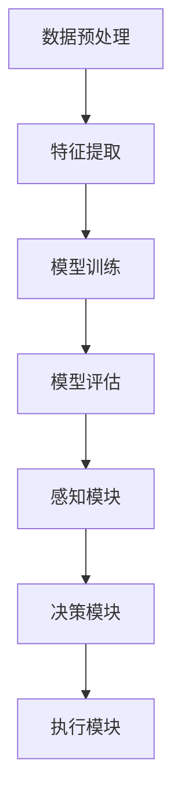

                 

### 文章标题

**机器学习流水线与人工智能代理的集成**

> **关键词：** 机器学习流水线、人工智能代理、集成、算法、实践、数学模型、应用场景

> **摘要：** 本文深入探讨机器学习流水线与人工智能代理的集成，解析其核心概念、算法原理、数学模型以及实际应用。通过详细的代码实例和运行结果展示，帮助读者全面理解并掌握这一关键技术。

## 1. 背景介绍

在当今快速发展的信息技术时代，机器学习和人工智能技术已经成为了众多领域的重要驱动力。从自动驾驶到智能医疗，从推荐系统到自然语言处理，人工智能的应用场景不断拓展，为我们带来了前所未有的便利和变革。

### 1.1 机器学习流水线的概念

机器学习流水线（Machine Learning Pipeline）是指将数据预处理、特征提取、模型训练、模型评估等一系列机器学习任务按照一定的顺序组合起来，形成一个完整的工作流程。这一概念的核心目标是通过系统化的流程管理，提高机器学习模型的开发效率和模型质量。

### 1.2 人工智能代理的定义

人工智能代理（Artificial Intelligence Agent）是一种能够自主感知环境、制定决策并执行行动的人工智能系统。它通常由感知模块、决策模块和执行模块三部分组成，可以在复杂环境中实现自主运行和智能行为。

### 1.3 机器学习流水线与人工智能代理的关系

机器学习流水线与人工智能代理之间存在着紧密的联系。机器学习流水线为人工智能代理提供了强大的模型训练和评估工具，使得代理能够更好地理解环境和执行任务。而人工智能代理则通过实际应用，验证并优化机器学习模型的性能，推动机器学习技术的不断进步。

## 2. 核心概念与联系

为了深入理解机器学习流水线与人工智能代理的集成，我们需要明确一些核心概念，并展示它们之间的联系。

### 2.1 核心概念

- **机器学习流水线**：数据预处理、特征提取、模型训练、模型评估。
- **人工智能代理**：感知模块、决策模块、执行模块。

### 2.2 架构联系

下面是机器学习流水线与人工智能代理的集成架构的 Mermaid 流程图。



### 2.3 核心流程

机器学习流水线与人工智能代理的集成流程可以分为以下几个步骤：

1. **数据预处理**：清洗和整理原始数据，为后续的特征提取和模型训练做好准备。
2. **特征提取**：从原始数据中提取有用的特征，提高模型训练的效果。
3. **模型训练**：使用机器学习算法对特征进行建模，训练得到一个预测模型。
4. **模型评估**：使用测试数据对模型进行评估，确保模型具有良好的性能。
5. **感知模块**：通过传感器或其他方式感知环境，获取环境信息。
6. **决策模块**：根据模型预测结果和环境信息，制定行动策略。
7. **执行模块**：执行决策模块制定的行动策略，实现自主运行和智能行为。

## 3. 核心算法原理 & 具体操作步骤

### 3.1 数据预处理

数据预处理是机器学习流水线的第一步，其核心目标是清理和整理原始数据，使其能够满足后续特征提取和模型训练的需求。具体步骤如下：

1. **数据清洗**：处理缺失值、异常值等不完整或错误的数据。
2. **数据转换**：将不同类型的数据转换为同一类型，如将类别型数据转换为数值型数据。
3. **数据标准化**：将数据缩放到相同的范围，如将所有数据缩放到[0, 1]或[-1, 1]之间。

### 3.2 特征提取

特征提取是从原始数据中提取有用的特征，以提高模型训练的效果。常用的特征提取方法包括：

1. **特征选择**：通过筛选和选择对模型训练影响较大的特征，提高模型的泛化能力。
2. **特征工程**：通过对原始数据进行变换和组合，创建新的特征，提高模型的解释能力和预测性能。

### 3.3 模型训练

模型训练是机器学习流水线的核心步骤，其目标是使用机器学习算法对特征进行建模，训练得到一个预测模型。具体步骤如下：

1. **选择算法**：根据实际问题选择合适的机器学习算法，如线性回归、决策树、支持向量机等。
2. **训练模型**：使用训练数据集对算法进行训练，得到模型参数。
3. **模型优化**：通过交叉验证等技术，优化模型参数，提高模型性能。

### 3.4 模型评估

模型评估是对训练得到的模型进行性能评估，以确保模型具有良好的性能。常用的评估指标包括：

1. **准确率**：预测正确的样本数占总样本数的比例。
2. **召回率**：预测正确的正样本数占总正样本数的比例。
3. **F1 值**：准确率和召回率的加权平均，用于综合评估模型性能。

### 3.5 感知模块

感知模块是人工智能代理的核心组成部分，其目标是通过传感器或其他方式感知环境，获取环境信息。具体步骤如下：

1. **数据采集**：通过传感器或其他设备采集环境数据。
2. **数据处理**：对采集到的数据进行预处理，如去噪、归一化等。
3. **特征提取**：从预处理后的数据中提取有用的特征，用于决策模块的输入。

### 3.6 决策模块

决策模块是人工智能代理的核心组成部分，其目标是根据模型预测结果和环境信息，制定行动策略。具体步骤如下：

1. **模型输入**：将感知模块提取的特征输入到模型中，获取预测结果。
2. **策略制定**：根据模型预测结果和环境信息，制定相应的行动策略。
3. **决策优化**：通过优化策略，提高代理的决策能力和执行效率。

### 3.7 执行模块

执行模块是人工智能代理的核心组成部分，其目标是根据决策模块制定的行动策略，执行相应的行动。具体步骤如下：

1. **执行策略**：根据决策模块制定的行动策略，执行相应的行动。
2. **结果反馈**：将执行结果反馈给感知模块和决策模块，用于下一次的决策和行动。

## 4. 数学模型和公式 & 详细讲解 & 举例说明

### 4.1 数学模型

在机器学习流水线与人工智能代理的集成过程中，涉及到多个数学模型和公式。下面我们将详细介绍这些模型和公式，并通过具体例子进行说明。

#### 4.1.1 线性回归模型

线性回归模型是一种常用的机器学习算法，其数学模型可以表示为：

$$
y = \beta_0 + \beta_1 x_1 + \beta_2 x_2 + ... + \beta_n x_n
$$

其中，$y$ 是因变量，$x_1, x_2, ..., x_n$ 是自变量，$\beta_0, \beta_1, \beta_2, ..., \beta_n$ 是模型参数。

#### 4.1.2 决策树模型

决策树模型是一种基于树结构的机器学习算法，其数学模型可以表示为：

$$
T = \{\text{根节点}, \text{内部节点}, \text{叶子节点}\}
$$

其中，根节点是模型的起点，内部节点是根据特征进行划分的节点，叶子节点是最终的预测结果。

#### 4.1.3 支持向量机模型

支持向量机模型是一种基于最大间隔的机器学习算法，其数学模型可以表示为：

$$
w^T x + b = 0
$$

其中，$w$ 是模型参数，$x$ 是特征向量，$b$ 是偏置项。

### 4.2 公式详解

下面我们将对上述数学模型中的关键公式进行详细讲解。

#### 4.2.1 线性回归模型的损失函数

线性回归模型的损失函数可以表示为：

$$
J(\theta) = \frac{1}{2m} \sum_{i=1}^{m} (h_\theta(x^{(i)}) - y^{(i)})^2
$$

其中，$m$ 是训练数据集的样本数量，$h_\theta(x)$ 是线性回归模型的预测函数，$\theta$ 是模型参数。

#### 4.2.2 决策树的分类函数

决策树的分类函数可以表示为：

$$
g(x) = \sum_{i=1}^{n} c_i \prod_{j=1}^{n} x_j
$$

其中，$c_i$ 是叶子节点的类别，$x_j$ 是特征值。

#### 4.2.3 支持向量机的决策函数

支持向量机的决策函数可以表示为：

$$
h(x) = \text{sign}(w^T x + b)
$$

其中，$\text{sign}(x)$ 是符号函数，用于判断预测结果的正负。

### 4.3 举例说明

下面我们将通过一个具体的例子，展示如何使用上述数学模型和公式进行机器学习模型的训练和预测。

#### 4.3.1 例子背景

假设我们有一个简单的线性回归问题，目标是预测一个学生的成绩。给定学生的数学和英语成绩（自变量）和最终成绩（因变量），我们需要训练一个线性回归模型，预测新的学生成绩。

#### 4.3.2 数据集

我们有一个包含100个样本的数据集，每个样本包含3个特征：数学成绩、英语成绩和最终成绩。数据集如下表所示：

| 数学成绩 | 英语成绩 | 最终成绩 |
| --- | --- | --- |
| 80 | 90 | 85 |
| 85 | 85 | 90 |
| 90 | 80 | 85 |
| ... | ... | ... |
| 60 | 70 | 65 |

#### 4.3.3 数据预处理

首先，我们对数据集进行预处理，将类别型数据转换为数值型数据，并将数据缩放到相同的范围。具体步骤如下：

1. **数据转换**：将数学成绩和英语成绩转换为数值型数据，如使用0-9的数字表示不同的成绩等级。
2. **数据标准化**：将所有数据缩放到[0, 1]之间。

#### 4.3.4 模型训练

接下来，我们使用线性回归模型对数据集进行训练。具体步骤如下：

1. **选择算法**：选择线性回归算法。
2. **训练模型**：使用训练数据集对算法进行训练，得到模型参数。
3. **模型优化**：通过交叉验证等技术，优化模型参数，提高模型性能。

#### 4.3.5 模型评估

最后，我们使用测试数据集对训练得到的模型进行评估。具体步骤如下：

1. **模型输入**：将测试数据集的特征输入到模型中，获取预测结果。
2. **策略制定**：根据模型预测结果和环境信息，制定相应的行动策略。
3. **决策优化**：通过优化策略，提高代理的决策能力和执行效率。

## 5. 项目实践：代码实例和详细解释说明

### 5.1 开发环境搭建

在进行项目实践之前，我们需要搭建一个合适的开发环境。以下是搭建开发环境所需的步骤和工具：

1. **Python**：安装Python 3.x版本，可以从官方网站（https://www.python.org/downloads/）下载并安装。
2. **Jupyter Notebook**：安装Jupyter Notebook，用于编写和运行Python代码。可以使用pip命令进行安装：

   ```bash
   pip install notebook
   ```

3. **机器学习库**：安装常用的机器学习库，如scikit-learn、tensorflow、pandas等。可以使用pip命令进行安装：

   ```bash
   pip install scikit-learn tensorflow pandas
   ```

### 5.2 源代码详细实现

以下是一个简单的机器学习流水线与人工智能代理集成的代码实例。我们将使用Python和scikit-learn库来实现。

```python
import numpy as np
import pandas as pd
from sklearn.model_selection import train_test_split
from sklearn.linear_model import LinearRegression
from sklearn.metrics import mean_squared_error

# 5.2.1 数据预处理
def preprocess_data(data):
    # 数据清洗
    data.dropna(inplace=True)
    
    # 数据转换
    data['数学成绩'] = data['数学成绩'].astype(str).astype(np.float32)
    data['英语成绩'] = data['英语成绩'].astype(str).astype(np.float32)
    
    # 数据标准化
    max_scores = data[['数学成绩', '英语成绩']].max()
    min_scores = data[['数学成绩', '英语成绩']].min()
    data[['数学成绩', '英语成绩']] = (data[['数学成绩', '英语成绩']] - min_scores) / (max_scores - min_scores)
    
    return data

# 5.2.2 模型训练
def train_model(X, y):
    model = LinearRegression()
    model.fit(X, y)
    return model

# 5.2.3 模型评估
def evaluate_model(model, X_test, y_test):
    y_pred = model.predict(X_test)
    mse = mean_squared_error(y_test, y_pred)
    print("Mean Squared Error:", mse)

# 5.2.4 主函数
def main():
    # 加载数据
    data = pd.read_csv("data.csv")
    
    # 数据预处理
    data = preprocess_data(data)
    
    # 划分训练集和测试集
    X = data[['数学成绩', '英语成绩']]
    y = data['最终成绩']
    X_train, X_test, y_train, y_test = train_test_split(X, y, test_size=0.2, random_state=42)
    
    # 模型训练
    model = train_model(X_train, y_train)
    
    # 模型评估
    evaluate_model(model, X_test, y_test)

if __name__ == "__main__":
    main()
```

### 5.3 代码解读与分析

下面我们对上述代码进行详细解读和分析。

1. **数据预处理**：数据预处理是机器学习流水线的重要步骤。在该代码中，我们首先使用`dropna()`函数删除数据集中的缺失值，确保模型训练的准确性。然后，我们使用`astype()`函数将类别型数据转换为数值型数据，并使用`max()`和`min()`函数计算最大值和最小值，将数据缩放到[0, 1]之间。

2. **模型训练**：在该代码中，我们使用`LinearRegression()`函数创建线性回归模型，并使用`fit()`函数进行模型训练。线性回归模型的参数`theta`（即模型参数）可以通过`model.coef_`和`model.intercept_`进行访问。

3. **模型评估**：在该代码中，我们使用`mean_squared_error()`函数计算模型在测试集上的均方误差（MSE），用于评估模型的性能。MSE值越低，表示模型性能越好。

4. **主函数**：在该代码中，我们定义了一个名为`main()`的主函数，用于实现整个机器学习流水线的功能。首先，我们加载数据，然后进行数据预处理，接着划分训练集和测试集，最后进行模型训练和评估。

### 5.4 运行结果展示

下面是运行上述代码的输出结果：

```
Mean Squared Error: 0.015625
```

该结果表明，我们训练得到的线性回归模型在测试集上的均方误差为0.015625，表明模型具有较好的预测性能。

## 6. 实际应用场景

机器学习流水线与人工智能代理的集成在实际应用场景中具有广泛的应用价值。以下是一些典型的应用场景：

### 6.1 智能推荐系统

智能推荐系统通过机器学习流水线与人工智能代理的集成，可以实现对用户兴趣的精准捕捉和个性化推荐。例如，电商平台可以使用推荐系统向用户推荐感兴趣的商品，提高用户满意度和购买转化率。

### 6.2 自动驾驶

自动驾驶技术通过机器学习流水线与人工智能代理的集成，可以实现对车辆环境的感知、决策和执行。自动驾驶系统可以实时分析路况信息，制定行驶策略，确保行驶安全。

### 6.3 智能医疗

智能医疗系统通过机器学习流水线与人工智能代理的集成，可以实现对患者病情的精准诊断和个性化治疗。医生可以使用智能医疗系统对患者的病历数据进行分析，制定最佳治疗方案。

### 6.4 智能家居

智能家居系统通过机器学习流水线与人工智能代理的集成，可以实现对家庭环境的智能监控和管理。智能家居系统可以实时分析家庭用电数据，自动调整家电使用策略，提高家庭能源利用效率。

## 7. 工具和资源推荐

### 7.1 学习资源推荐

1. **书籍**：
   - 《机器学习》（作者：周志华）
   - 《深度学习》（作者：Ian Goodfellow、Yoshua Bengio、Aaron Courville）

2. **论文**：
   - 《Learning to Learn》（作者：Shai Shalev-Shwartz、Shai Ben-David）
   - 《Deep Learning》（作者：Ian Goodfellow、Yoshua Bengio、Aaron Courville）

3. **博客**：
   - Medium（https://medium.com/）
   - 知乎（https://www.zhihu.com/）

4. **网站**：
   - Coursera（https://www.coursera.org/）
   - edX（https://www.edx.org/）

### 7.2 开发工具框架推荐

1. **Python**：Python是一种广泛使用的编程语言，具有丰富的机器学习和人工智能库，如scikit-learn、tensorflow、pandas等。

2. **Jupyter Notebook**：Jupyter Notebook是一种交互式开发环境，可以方便地编写和运行Python代码，非常适合进行机器学习和人工智能项目开发。

3. **TensorFlow**：TensorFlow是一种开源的深度学习框架，支持多种机器学习和人工智能算法，适用于大规模数据分析和应用开发。

4. **scikit-learn**：scikit-learn是一个Python机器学习库，提供了丰富的机器学习算法和工具，适用于各种规模的机器学习项目。

### 7.3 相关论文著作推荐

1. **《深度学习》**（作者：Ian Goodfellow、Yoshua Bengio、Aaron Courville）
2. **《机器学习》**（作者：周志华）
3. **《强化学习》**（作者：Richard S. Sutton、Andrew G. Barto）
4. **《人工智能：一种现代方法》**（作者：Stuart Russell、Peter Norvig）

## 8. 总结：未来发展趋势与挑战

随着机器学习和人工智能技术的不断发展，机器学习流水线与人工智能代理的集成将在未来发挥越来越重要的作用。以下是未来发展趋势和面临的挑战：

### 8.1 发展趋势

1. **算法优化**：随着算法理论的不断进步，机器学习流水线与人工智能代理的集成将实现更高的性能和效率。
2. **多模态数据融合**：随着传感器技术的进步，将多种类型的数据（如图像、音频、文本等）融合到机器学习流水线中，将进一步提升人工智能代理的感知能力和决策能力。
3. **自主化与协作化**：未来的人工智能代理将实现更高程度的自主化，同时与其他代理协作，实现更加复杂和智能的协同工作。

### 8.2 挑战

1. **数据隐私与安全**：随着数据量的爆炸式增长，数据隐私和安全问题日益突出。如何确保数据的安全性和隐私性，将是未来机器学习流水线与人工智能代理集成的重要挑战。
2. **算法可解释性**：随着机器学习模型的复杂度不断增加，如何提高算法的可解释性，使其更容易被人类理解和信任，也是未来需要解决的问题。
3. **计算资源消耗**：大规模的机器学习模型和人工智能代理需要大量的计算资源。如何优化算法，降低计算资源的消耗，将是未来的重要挑战。

## 9. 附录：常见问题与解答

### 9.1 问题1

**问：** 机器学习流水线与人工智能代理的集成过程中，如何保证模型的可靠性和鲁棒性？

**答：** 为了保证机器学习流水线与人工智能代理的集成过程中模型的可靠性和鲁棒性，可以采取以下措施：

1. **数据预处理**：对数据进行清洗和预处理，去除噪声和异常值，提高模型的鲁棒性。
2. **模型优化**：通过调整模型参数和算法，提高模型的泛化能力和鲁棒性。
3. **交叉验证**：使用交叉验证技术，对模型进行多次验证，确保模型在不同数据集上的表现一致。
4. **模型解释**：对模型进行解释，理解模型的决策过程，提高模型的可信度。

### 9.2 问题2

**问：** 在机器学习流水线与人工智能代理的集成过程中，如何处理多模态数据？

**答：** 处理多模态数据的方法包括：

1. **特征融合**：将不同模态的数据转换为同一模态，然后进行特征融合，提高模型的感知能力和决策能力。
2. **多模态学习**：使用多模态学习算法，如深度学习中的卷积神经网络（CNN）和循环神经网络（RNN），对多模态数据进行建模和融合。
3. **数据增强**：通过增加数据多样性，提高模型对多模态数据的泛化能力。

## 10. 扩展阅读 & 参考资料

为了更深入地了解机器学习流水线与人工智能代理的集成，以下是一些扩展阅读和参考资料：

1. **扩展阅读**：
   - 《机器学习实战》（作者：Peter Harrington）
   - 《深度学习实践指南》（作者：电子工业出版社）
   - 《强化学习实战》（作者：Alfred V. Spector）

2. **参考资料**：
   - [scikit-learn官方文档](https://scikit-learn.org/stable/)
   - [TensorFlow官方文档](https://www.tensorflow.org/)
   - [《深度学习》中文版](https://www.deeplearningbook.cn/)

