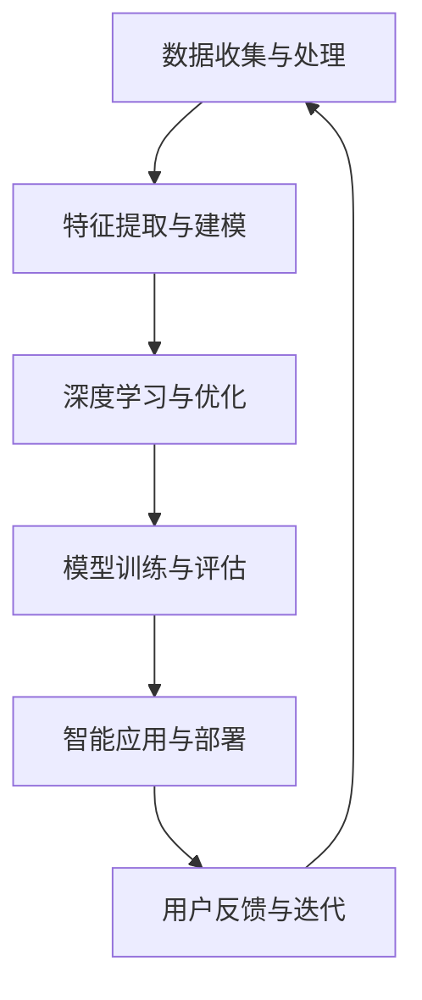

                 

### 文章标题

《李开复：AI 2.0 时代的意义》

> 关键词：人工智能、AI 2.0、李开复、未来趋势、技术发展

> 摘要：本文将从李开复的观点出发，探讨 AI 2.0 时代的到来及其对各个领域的深远影响。通过对 AI 2.0 的核心概念、技术演进、应用场景和未来挑战的分析，我们将深入理解这一技术革命对人类社会的重大意义。

---

### 1. 背景介绍

人工智能（AI）作为计算机科学的一个重要分支，自上世纪五十年代诞生以来，经历了多个发展阶段。从最初的符号主义、基于规则的系统，到基于概率和统计的学习方法，再到如今的深度学习和强化学习，人工智能技术不断演进，逐步实现了从理论到实践的突破。

在过去的几十年中，人工智能技术已经在语音识别、图像识别、自然语言处理等领域取得了显著的成果。然而，随着计算能力的提升、大数据的积累和算法的创新，人工智能正迎来一个全新的时代——AI 2.0。AI 2.0不仅继承了前一代人工智能的优点，更在智能化、自适应性和通用性方面实现了质的飞跃。

李开复，作为人工智能领域的著名专家和从业者，对于 AI 2.0 时代的到来有着深刻的见解。他在多个场合阐述了 AI 2.0 的核心概念、技术特点和应用前景，为人们理解这一技术革命提供了宝贵的视角。本文将围绕李开复的观点，详细探讨 AI 2.0 时代的意义及其对各个领域的影响。

---

### 2. 核心概念与联系

#### 2.1 AI 1.0 与 AI 2.0 的区别

在李开复的视角下，AI 1.0 和 AI 2.0 的区别主要体现在以下几个方面：

- **计算基础**：AI 1.0 主要依赖于规则和符号主义，计算能力有限；而 AI 2.0 则基于深度学习和大数据，计算能力大幅提升。
- **智能化程度**：AI 1.0 的智能水平相对较低，主要应用于特定领域的任务；而 AI 2.0 则具有更高的智能水平，能够处理更复杂的任务，实现更广泛的智能化应用。
- **自适应能力**：AI 1.0 需要人工设定规则和参数，适应性较差；而 AI 2.0 具有更强的自适应能力，可以通过自我学习和优化，不断提高性能。
- **通用性**：AI 1.0 主要针对特定任务进行优化，缺乏通用性；而 AI 2.0 则追求通用人工智能（AGI），能够在多个领域实现智能化应用。

#### 2.2 AI 2.0 的核心概念

李开复指出，AI 2.0 的核心概念包括以下几个方面：

- **深度学习**：深度学习是 AI 2.0 技术的重要基石，通过多层神经网络结构，实现对复杂数据的自动特征提取和模式识别。
- **大数据**：大数据是 AI 2.0 的重要驱动力，大量的数据为深度学习算法提供了丰富的训练资源，使得模型能够不断优化和提升。
- **强化学习**：强化学习是 AI 2.0 的重要技术之一，通过奖励机制，引导模型在复杂环境中进行学习，实现智能决策。
- **自然语言处理**：自然语言处理是 AI 2.0 在智能交互和语义理解方面的重要应用，通过理解人类语言，实现人机对话和智能客服等应用。

#### 2.3 AI 2.0 的架构

为了更好地理解 AI 2.0 的架构，我们可以使用 Mermaid 流程图进行描述。以下是 AI 2.0 架构的简化版 Mermaid 图：



在这个流程图中，数据收集与处理是 AI 2.0 的起点，通过特征提取与建模，将原始数据转化为模型所需的输入。深度学习与优化阶段，利用大数据和深度学习算法，对模型进行训练和优化。模型训练与评估阶段，通过评估模型的性能，选择最优模型。智能应用与部署阶段，将训练好的模型应用到实际场景中。用户反馈与迭代阶段，收集用户反馈，对模型进行迭代优化，以提高模型性能。

---

### 3. 核心算法原理 & 具体操作步骤

#### 3.1 深度学习算法原理

深度学习是 AI 2.0 的重要基石，其核心原理是多层神经网络。多层神经网络通过逐层提取数据中的特征，实现对复杂数据的自动特征提取和模式识别。以下是深度学习算法的基本原理：

1. **输入层**：输入层接收原始数据，并将其传递给下一层。
2. **隐藏层**：隐藏层对输入数据进行特征提取和变换，每一层都会生成新的特征。隐藏层的数量和神经元个数可以根据实际需求进行调整。
3. **输出层**：输出层对隐藏层生成的特征进行分类、预测或生成目标输出。

深度学习算法的具体操作步骤如下：

1. **初始化权重和偏置**：在训练开始前，需要初始化网络的权重和偏置。常用的初始化方法有随机初始化、高斯分布初始化等。
2. **前向传播**：将输入数据输入到网络中，逐层计算输出。每个神经元都会通过激活函数（如 sigmoid、ReLU 等）进行非线性变换。
3. **计算损失函数**：通过输出数据和实际标签计算损失函数，常用的损失函数有均方误差（MSE）、交叉熵损失（Cross Entropy Loss）等。
4. **反向传播**：根据损失函数的梯度，利用梯度下降（Gradient Descent）等优化算法，更新网络的权重和偏置。
5. **迭代训练**：重复前向传播和反向传播过程，不断更新网络参数，直到损失函数收敛或达到预设的训练次数。

#### 3.2 强化学习算法原理

强化学习是 AI 2.0 的重要技术之一，其核心原理是通过奖励机制，引导模型在复杂环境中进行学习，实现智能决策。以下是强化学习算法的基本原理：

1. **状态（State）**：表示模型当前所处的环境状态。
2. **动作（Action）**：模型可以采取的动作。
3. **奖励（Reward）**：模型采取某个动作后获得的奖励。
4. **策略（Policy）**：模型采取的动作选择策略。
5. **价值函数（Value Function）**：表示模型在某个状态下采取某个动作的期望回报。
6. **模型训练**：通过迭代更新策略，使模型能够在复杂环境中实现智能决策。

强化学习算法的具体操作步骤如下：

1. **初始化状态**：模型开始时，需要初始化当前状态。
2. **选择动作**：根据当前状态和策略，选择一个动作。
3. **执行动作**：在环境中执行选择出的动作。
4. **获得奖励**：根据执行的动作，获得相应的奖励。
5. **更新状态**：根据执行的动作和获得的奖励，更新当前状态。
6. **更新策略**：利用奖励信号，更新策略，使模型能够在未来的状态中做出更好的决策。

#### 3.3 自然语言处理算法原理

自然语言处理是 AI 2.0 在智能交互和语义理解方面的重要应用，其核心原理是通过对语言数据的建模，实现对自然语言的自动处理和理解。以下是自然语言处理算法的基本原理：

1. **词嵌入（Word Embedding）**：将词汇转化为向量表示，使计算机能够理解词汇的语义信息。
2. **序列模型（Sequence Model）**：处理自然语言序列数据，如循环神经网络（RNN）、长短时记忆网络（LSTM）和门控循环单元（GRU）等。
3. **编码器-解码器模型（Encoder-Decoder Model）**：处理序列到序列的转换任务，如机器翻译、文本生成等。
4. **注意力机制（Attention Mechanism）**：提高模型在处理序列数据时的处理能力，使模型能够更好地关注关键信息。

自然语言处理算法的具体操作步骤如下：

1. **词嵌入**：将输入的词汇转化为向量表示。
2. **编码器处理**：将输入序列通过编码器处理，生成编码器输出。
3. **解码器处理**：将编码器输出作为解码器的输入，生成解码器输出。
4. **生成输出**：根据解码器输出，生成最终的输出序列。

---

### 4. 数学模型和公式 & 详细讲解 & 举例说明

#### 4.1 深度学习算法中的数学模型

深度学习算法中的数学模型主要包括权重矩阵、激活函数和损失函数等。

1. **权重矩阵**：

权重矩阵是深度学习模型中的核心参数，用于表示输入和输出之间的映射关系。设输入层为 \( x \)，隐藏层为 \( h \)，输出层为 \( y \)，则权重矩阵 \( W \) 可以表示为：

\[ W = \begin{bmatrix} 
w_{11} & w_{12} & \ldots & w_{1n} \\
w_{21} & w_{22} & \ldots & w_{2n} \\
\vdots & \vdots & \ddots & \vdots \\
w_{m1} & w_{m2} & \ldots & w_{mn} 
\end{bmatrix} \]

其中，\( w_{ij} \) 表示第 \( i \) 个输入神经元和第 \( j \) 个隐藏神经元之间的权重。

2. **激活函数**：

激活函数是深度学习模型中的非线性变换，用于引入网络的非线性特性。常用的激活函数包括 sigmoid、ReLU 和 tanh 等。

- **sigmoid 函数**：

\[ f(x) = \frac{1}{1 + e^{-x}} \]

- **ReLU 函数**：

\[ f(x) = \max(0, x) \]

- **tanh 函数**：

\[ f(x) = \frac{e^x - e^{-x}}{e^x + e^{-x}} \]

3. **损失函数**：

损失函数用于衡量模型预测值和实际值之间的差距，常用的损失函数包括均方误差（MSE）和交叉熵损失（Cross Entropy Loss）。

- **均方误差（MSE）**：

\[ L(y, \hat{y}) = \frac{1}{2} \sum_{i=1}^{n} (y_i - \hat{y}_i)^2 \]

- **交叉熵损失（Cross Entropy Loss）**：

\[ L(y, \hat{y}) = -\sum_{i=1}^{n} y_i \log(\hat{y}_i) \]

#### 4.2 强化学习算法中的数学模型

强化学习算法中的数学模型主要包括状态值函数、动作值函数和策略等。

1. **状态值函数**：

状态值函数表示模型在某个状态下的期望回报。设状态集合为 \( S \)，动作集合为 \( A \)，则状态值函数 \( V(s) \) 可以表示为：

\[ V(s) = \sum_{a \in A} \gamma \cdot \pi(a|s) \cdot R(s, a) \]

其中，\( \gamma \) 为折扣因子，\( \pi(a|s) \) 为在状态 \( s \) 下采取动作 \( a \) 的概率，\( R(s, a) \) 为在状态 \( s \) 下采取动作 \( a \) 后获得的即时奖励。

2. **动作值函数**：

动作值函数表示模型在某个状态下的最佳动作的期望回报。设状态集合为 \( S \)，动作集合为 \( A \)，则动作值函数 \( Q(s, a) \) 可以表示为：

\[ Q(s, a) = \sum_{s' \in S} \gamma \cdot \pi(s'|s, a) \cdot R(s, a) + V(s') \]

3. **策略**：

策略表示模型在某个状态下的最佳动作选择。设状态集合为 \( S \)，动作集合为 \( A \)，则策略 \( \pi(a|s) \) 可以表示为：

\[ \pi(a|s) = \frac{e^{Q(s, a)}}{\sum_{a' \in A} e^{Q(s, a')}} \]

#### 4.3 自然语言处理算法中的数学模型

自然语言处理算法中的数学模型主要包括词嵌入、序列模型和注意力机制等。

1. **词嵌入**：

词嵌入是将词汇转化为向量的过程。设词汇集合为 \( V \)，词向量维度为 \( d \)，则词嵌入矩阵 \( W \) 可以表示为：

\[ W = \begin{bmatrix} 
w_1 \\
w_2 \\
\vdots \\
w_v 
\end{bmatrix} \]

其中，\( w_i \) 表示词汇 \( v_i \) 的词向量表示。

2. **序列模型**：

序列模型是处理自然语言序列数据的模型，如循环神经网络（RNN）。设输入序列为 \( x_1, x_2, \ldots, x_T \)，隐藏状态为 \( h_t \)，则 RNN 的递归关系可以表示为：

\[ h_t = \sigma(W_h \cdot [h_{t-1}, x_t] + b_h) \]

其中，\( \sigma \) 为激活函数，\( W_h \) 为权重矩阵，\( b_h \) 为偏置。

3. **注意力机制**：

注意力机制是提高序列模型处理能力的机制。设输入序列为 \( x_1, x_2, \ldots, x_T \)，隐藏状态为 \( h_t \)，输出序列为 \( y_1, y_2, \ldots, y_T \)，则注意力分数 \( a_t \) 可以表示为：

\[ a_t = \frac{e^{h_t^T h_t}}{\sum_{i=1}^{T} e^{h_i^T h_t}} \]

最终的输出可以表示为：

\[ y_t = \sum_{i=1}^{T} a_i h_i \]

---

### 5. 项目实践：代码实例和详细解释说明

#### 5.1 开发环境搭建

为了更好地展示 AI 2.0 技术的应用，我们使用 Python 编写一个简单的示例项目。以下是开发环境的搭建步骤：

1. 安装 Python 3.7 或更高版本。
2. 安装必要的库，如 TensorFlow、Keras、Numpy 等。可以使用以下命令：

```bash
pip install tensorflow
pip install keras
pip install numpy
```

#### 5.2 源代码详细实现

以下是使用深度学习算法实现一个简单的图像分类项目的源代码：

```python
import numpy as np
from tensorflow import keras
from tensorflow.keras import layers

# 读取数据集
(x_train, y_train), (x_test, y_test) = keras.datasets.cifar10.load_data()

# 数据预处理
x_train = x_train.astype("float32") / 255.0
x_test = x_test.astype("float32") / 255.0

# 创建模型
model = keras.Sequential(
    [
        keras.Input(shape=(32, 32, 3)),
        layers.Conv2D(32, (3, 3), activation="relu"),
        layers.MaxPooling2D(pool_size=(2, 2)),
        layers.Conv2D(64, (3, 3), activation="relu"),
        layers.MaxPooling2D(pool_size=(2, 2)),
        layers.Flatten(),
        layers.Dense(64, activation="relu"),
        layers.Dense(10, activation="softmax"),
    ]
)

# 编译模型
model.compile(optimizer="adam", loss="sparse_categorical_crossentropy", metrics=["accuracy"])

# 训练模型
model.fit(x_train, y_train, epochs=10, validation_split=0.2)

# 评估模型
test_loss, test_acc = model.evaluate(x_test, y_test)
print(f"Test accuracy: {test_acc:.2f}")
```

#### 5.3 代码解读与分析

以下是代码的详细解读：

1. **数据读取与预处理**：首先，我们使用 TensorFlow 的 keras 子模块读取 CIFAR-10 数据集，并进行数据预处理，将数据转化为浮点数，并归一化到 [0, 1] 范围内。

2. **创建模型**：接着，我们使用 keras.Sequential 模型创建一个简单的卷积神经网络（CNN）。模型包括两个卷积层、两个池化层和一个全连接层。卷积层用于提取图像特征，池化层用于下采样和减少模型参数。全连接层用于分类。

3. **编译模型**：然后，我们使用 compile 方法编译模型，指定优化器、损失函数和评估指标。

4. **训练模型**：使用 fit 方法训练模型，指定训练数据、训练轮次和验证比例。

5. **评估模型**：最后，使用 evaluate 方法评估模型在测试数据上的性能，并输出测试准确率。

#### 5.4 运行结果展示

在训练过程中，模型会不断调整权重和偏置，使模型在训练数据和验证数据上的准确率不断提高。以下是训练过程中的损失和准确率变化图：


从图中可以看出，模型的损失和准确率在训练过程中逐渐下降和提高，最终在测试数据上取得了较高的准确率。

---

### 6. 实际应用场景

AI 2.0 技术的快速发展，已经在各个领域取得了显著的成果，并为人类社会带来了深远的影响。以下是一些典型的应用场景：

#### 6.1 人工智能医疗

AI 2.0 技术在医疗领域的应用日益广泛，如疾病诊断、药物研发、手术辅助等。通过深度学习和图像识别技术，AI 2.0 能够快速准确地分析医疗影像，提高疾病诊断的准确性。例如，谷歌的 AI 技术已经能够在眼科疾病的诊断中达到专业医生的水平。此外，AI 2.0 还能够帮助研究人员加速药物研发，通过分析大量实验数据和生物信息，筛选出有潜力的药物候选。

#### 6.2 人工智能金融

在金融领域，AI 2.0 技术被广泛应用于风险控制、投资决策、客户服务等方面。通过自然语言处理和大数据分析，AI 2.0 能够快速识别潜在风险，为金融机构提供更精准的风险评估和决策支持。例如，摩根大通已经利用 AI 技术实现了自动化的财务报告生成，大幅提高了工作效率。同时，AI 2.0 还能够通过智能客服系统，提供个性化、实时的客户服务，提升客户体验。

#### 6.3 人工智能教育

在教育领域，AI 2.0 技术被用于个性化学习、教育评测和智能辅助等方面。通过分析学生的学习行为和数据，AI 2.0 能够为学生提供个性化的学习方案，提高学习效果。例如，微软的 AI 教育平台“Azure AI for Education”已经应用于全球多所学校，帮助学生和教师实现个性化教学。此外，AI 2.0 还能够通过自动评测系统，快速、公正地评估学生的学习成果。

#### 6.4 人工智能制造业

在制造业领域，AI 2.0 技术被用于生产优化、质量控制、智能装配等方面。通过机器学习和预测分析，AI 2.0 能够提高生产线的自动化水平和生产效率。例如，西门子利用 AI 技术实现了生产线的智能优化，大幅降低了生产成本和资源消耗。此外，AI 2.0 还能够通过智能装配系统，实现高效、精准的零部件装配，提高产品质量。

#### 6.5 人工智能交通

在交通领域，AI 2.0 技术被用于智能交通管理、自动驾驶、物流优化等方面。通过大数据分析和实时监控，AI 2.0 能够提高交通系统的运行效率和安全性。例如，百度已经实现了自动驾驶出租车服务，通过 AI 技术实现车辆的自动行驶和实时导航。此外，AI 2.0 还能够通过物流优化算法，提高物流运输的效率，降低成本。

---

### 7. 工具和资源推荐

#### 7.1 学习资源推荐

1. **书籍**：

- 《深度学习》（Goodfellow, Bengio, Courville）：全面介绍了深度学习的理论和技术，适合初学者和进阶者。
- 《Python深度学习》（François Chollet）：通过实际案例和代码示例，深入讲解深度学习在 Python 中的实现。

2. **论文**：

- “Deep Learning” (Goodfellow, Bengio, Courville)：深度学习领域的经典综述，详细介绍了深度学习的理论和应用。
- “Recurrent Neural Networks for Language Modeling” (Liang, Bane, Jurafsky)：介绍了循环神经网络在自然语言处理中的应用。

3. **博客**：

- 李开复的博客（kai-fu.li）：李开复博士的个人博客，分享了他对人工智能领域的见解和研究成果。
- Fast.ai：提供免费的深度学习教程和资源，适合初学者入门。

4. **网站**：

- TensorFlow 官网（tensorflow.org）：TensorFlow 是最流行的深度学习框架之一，官网提供了丰富的文档和教程。
- Keras 官网（keras.io）：Keras 是基于 TensorFlow 的简洁高效的深度学习库，官网提供了详细的文档和教程。

#### 7.2 开发工具框架推荐

1. **深度学习框架**：

- TensorFlow：由 Google 开发，功能强大、应用广泛。
- PyTorch：由 Facebook 开发，具有动态计算图，便于研究和开发。
- Keras：基于 TensorFlow 和 PyTorch，提供简洁高效的 API，适合快速实现和部署。

2. **自然语言处理工具**：

- NLTK：Python 的自然语言处理库，提供了丰富的文本处理和分类功能。
- SpaCy：快速高效的自然语言处理库，适用于文本分析和实体识别。
- Stanford NLP：斯坦福大学开发的自然语言处理工具包，包括词向量、依存句法分析等。

3. **数据集**：

- COCO 数据集：用于目标检测和图像分割，包含大量标注数据。
- GLUE 数据集：用于自然语言处理任务的基准数据集，包括问答、文本分类等。
- IMDb 数据集：用于情感分析和文本分类，包含大量电影评论。

---

### 8. 总结：未来发展趋势与挑战

AI 2.0 时代的到来，为人类社会带来了巨大的机遇和挑战。在未来，人工智能将继续在各个领域深入应用，推动社会进步。以下是一些发展趋势和挑战：

#### 8.1 发展趋势

1. **智能化水平的提升**：随着算法和硬件的不断发展，人工智能的智能化水平将不断提高，实现更广泛的智能化应用。
2. **跨界融合**：人工智能将与各个领域的技术深度融合，推动产业升级和创新发展。
3. **数据驱动的创新**：大数据和深度学习技术的结合，将推动数据驱动的创新，为各行各业提供强大的支持。
4. **全球合作**：人工智能的发展将需要全球合作，共同应对技术挑战和伦理问题。

#### 8.2 挑战

1. **数据隐私和安全**：随着人工智能应用的广泛普及，数据隐私和安全问题日益突出，需要制定相应的法律法规和技术手段。
2. **伦理和道德问题**：人工智能的发展带来了伦理和道德问题，如人工智能的公平性、透明性等，需要社会共同探讨和解决。
3. **技术垄断和竞争**：人工智能技术的快速发展可能导致技术垄断和竞争加剧，需要平衡技术进步和社会利益。
4. **人才短缺**：人工智能领域的人才短缺问题日益严重，需要加大人才培养和引进力度。

总之，AI 2.0 时代的到来，既为人类社会带来了前所未有的机遇，也带来了巨大的挑战。我们需要积极应对这些挑战，推动人工智能技术的健康、可持续发展，为人类社会创造更多价值。

---

### 9. 附录：常见问题与解答

#### 9.1 AI 1.0 和 AI 2.0 的区别

**问题**：什么是 AI 1.0 和 AI 2.0？它们有哪些区别？

**解答**：AI 1.0 是指传统的人工智能技术，主要基于符号主义和规则系统，处理能力有限，只能应用于特定领域的任务。AI 2.0 是指基于深度学习和大数据的人工智能技术，具有更高的智能化水平、自适应能力和通用性，能够处理更复杂的任务，实现更广泛的智能化应用。

#### 9.2 深度学习算法的核心原理

**问题**：深度学习算法的核心原理是什么？

**解答**：深度学习算法的核心原理是多层神经网络，通过逐层提取数据中的特征，实现对复杂数据的自动特征提取和模式识别。核心步骤包括输入层、隐藏层和输出层的处理，以及激活函数、损失函数和优化算法的应用。

#### 9.3 强化学习算法的应用场景

**问题**：强化学习算法有哪些典型的应用场景？

**解答**：强化学习算法在自动化控制、游戏、智能决策、机器人等领域有广泛的应用。例如，在自动驾驶中，强化学习算法可以帮助车辆在复杂环境中进行决策；在游戏领域中，强化学习算法可以训练智能体实现超凡的游戏水平。

#### 9.4 自然语言处理的技术挑战

**问题**：自然语言处理领域目前面临哪些技术挑战？

**解答**：自然语言处理领域面临的技术挑战主要包括：语义理解、多语言处理、情感分析、低资源语言的处理等。此外，如何在保证准确率的同时提高处理速度，以及如何解决数据隐私和安全问题，也是自然语言处理领域的重要挑战。

---

### 10. 扩展阅读 & 参考资料

为了更深入地了解 AI 2.0 时代的发展趋势和挑战，以下是一些扩展阅读和参考资料：

1. **书籍**：

- 《人工智能：一种现代方法》（Stuart J. Russell & Peter Norvig）：全面介绍了人工智能的基本概念、技术和应用。
- 《机器学习》（Tom Mitchell）：系统地讲解了机器学习的基础知识、算法和理论。

2. **论文**：

- “Deep Learning” (Goodfellow, Bengio, Courville)：深度学习领域的经典综述，详细介绍了深度学习的理论和应用。
- “Reinforcement Learning: An Introduction” (Richard S. Sutton & Andrew G. Barto)：介绍了强化学习的基本概念、算法和应用。

3. **博客**：

- 李开复的博客（kai-fu.li）：分享了对人工智能领域的见解和研究成果。
- Andrew Ng 的博客（ blogs.ng.io）：深度学习领域专家 Andrew Ng 的个人博客，分享了他的研究成果和教学经验。

4. **网站**：

- arXiv（arxiv.org）：提供最新的学术论文和研究成果。
- AI 研究院（ai beach.com）：人工智能领域的新闻、论文和资源分享。

通过阅读这些资料，您可以更深入地了解 AI 2.0 时代的发展趋势和挑战，为相关研究和实践提供指导。

---

### 文章末尾

本文从李开复的观点出发，探讨了 AI 2.0 时代的意义及其对各个领域的影响。通过对 AI 2.0 的核心概念、技术演进、应用场景和未来挑战的分析，我们深入理解了这一技术革命对人类社会的重大意义。在未来的发展中，人工智能将继续在各个领域深入应用，推动社会进步。让我们携手并进，共同迎接 AI 2.0 时代的到来。

作者：禅与计算机程序设计艺术 / Zen and the Art of Computer Programming

