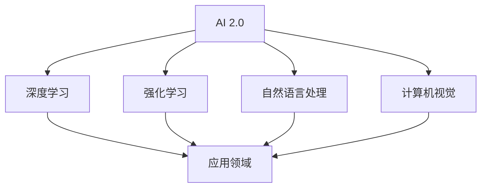

                 

### 1. 背景介绍

随着科技的飞速发展，人工智能（AI）已成为当今世界最具颠覆性的技术之一。自2012年深度学习在图像识别领域取得突破性进展以来，AI技术不断演进，逐渐渗透到各行各业，从医疗、金融、交通到娱乐、教育等，带来了深远的影响。然而，AI技术的革新不仅仅停留在技术层面，其对全球经济、产业格局乃至人类生活方式的冲击同样不可忽视。

近年来，随着计算能力的提升、大数据的积累和算法的改进，人工智能进入了2.0时代。AI 2.0不仅具备更强的自主学习能力和泛化能力，还能通过人机协同，实现更高层次的智能化。这一阶段的AI，已经不仅仅是一个工具，而是逐渐成为各个行业创新和发展的驱动力。

投资价值作为一个关键议题，一直备受关注。AI 2.0时代的到来，不仅为传统行业带来了新的增长点，也为新兴产业的崛起提供了肥沃的土壤。在这一背景下，如何把握AI 2.0的投资机会，成为了投资者和企业决策者共同关注的焦点。

本文将围绕AI 2.0时代的投资价值展开讨论。首先，我们将回顾AI 2.0的核心概念和发展历程，理解其与先前的AI时代的区别。接着，我们将探讨AI 2.0在各个行业中的应用场景，分析其对投资领域的影响。随后，本文将详细介绍AI 2.0时代的投资策略和风险控制方法，并分享一些成功的投资案例。最后，我们将展望AI 2.0时代的未来发展趋势和面临的挑战，为读者提供有益的思考。

通过本文的阅读，读者将能够全面了解AI 2.0时代的投资价值，掌握AI技术的投资策略，并在实际操作中做出更为明智的决策。

### 2. 核心概念与联系

#### 2.1 AI 2.0的定义与发展

人工智能（AI）可以分为多个阶段，从最早的规则驱动（Rule-Based）系统，到基于模式的识别（Pattern Recognition），再到基于数据的学习（Data-Driven Learning），以及近年来兴起的深度学习和强化学习（Reinforcement Learning）。AI 2.0，是对这一系列发展的一个概括性描述，特别强调了在自主学习、自适应和智能决策方面的提升。

AI 2.0不同于传统的AI 1.0，它具备以下几个显著特点：

1. **自主学习能力**：AI 2.0系统可以通过自我学习和自我优化，提高其性能和决策能力，无需人工预设规则。
2. **高效泛化能力**：AI 2.0可以在不同的环境和任务中表现出色，具备更强的跨领域适应能力。
3. **人机协同**：AI 2.0与人类的互动更加紧密，可以理解和执行复杂任务，并通过人机协同实现更高的效率。

#### 2.2 与传统AI时代的区别

传统AI时代（AI 1.0）主要依赖于预设的规则和算法，其局限在于：

- **数据依赖性低**：传统AI需要大量的人工规则和逻辑，对数据的依赖性较低。
- **泛化能力弱**：传统AI系统往往只能在特定环境下工作，难以实现跨领域的应用。
- **灵活性不足**：传统AI的决策过程高度依赖预设的规则，缺乏自我学习和自我优化的能力。

相比之下，AI 2.0具有以下优势：

- **自主学习**：AI 2.0系统能够通过自我学习不断优化性能，适应新的环境和任务。
- **高效泛化**：AI 2.0系统可以在多种场景中表现出色，具备较强的跨领域应用能力。
- **人机协同**：AI 2.0与人类的互动更加紧密，通过人机协同实现更高的效率和决策质量。

#### 2.3 AI 2.0的应用领域

AI 2.0的应用领域非常广泛，涵盖了多个行业和领域，以下是其中一些主要的应用场景：

- **医疗健康**：AI 2.0在医疗诊断、药物研发、健康管理等方面具有巨大潜力，可以大幅提高医疗效率和准确性。
- **金融**：AI 2.0在金融领域的应用包括风险管理、信用评估、量化交易等，可以提升金融服务的质量和效率。
- **智能制造**：AI 2.0在制造业中的应用包括智能生产线、质量检测、预测性维护等，可以提高生产效率和降低成本。
- **零售**：AI 2.0在零售行业的应用包括智能推荐、精准营销、库存管理，可以提升用户体验和运营效率。
- **交通**：AI 2.0在交通领域的应用包括智能交通管理、自动驾驶、路线规划，可以提高交通效率和安全性。

#### 2.4 AI 2.0的关键技术

AI 2.0的实现离不开以下几个关键技术的支持：

- **深度学习**：深度学习是AI 2.0的核心技术之一，通过多层神经网络模型实现高度复杂的特征提取和模式识别。
- **强化学习**：强化学习通过试错和反馈机制，使AI系统在复杂环境中进行自主学习和优化，适用于决策类任务。
- **自然语言处理**：自然语言处理技术使得AI能够理解、生成和处理人类语言，是AI 2.0在智能客服、智能助手等领域的应用基础。
- **计算机视觉**：计算机视觉技术使得AI能够理解和解释图像和视频内容，是AI 2.0在自动驾驶、安防监控等领域的应用关键。

#### 2.5 Mermaid 流程图展示

以下是一个简单的Mermaid流程图，展示了AI 2.0的核心概念和关键技术之间的联系：



通过这个流程图，我们可以清晰地看到AI 2.0的核心技术和应用领域之间的关联，以及它们如何共同推动AI 2.0的发展。

### 3. 核心算法原理 & 具体操作步骤

在了解了AI 2.0的核心概念和应用领域之后，接下来我们将深入探讨AI 2.0时代的关键算法原理和具体操作步骤，以便读者能够更好地理解这些技术如何在实际中发挥作用。

#### 3.1 深度学习（Deep Learning）

深度学习是AI 2.0的核心技术之一，通过多层神经网络模型实现高度复杂的特征提取和模式识别。以下是深度学习的核心算法原理和具体操作步骤：

##### 原理：

深度学习模型由多个层级组成，每一层都负责提取不同层次的特征。输入层接收原始数据，通过多层非线性变换，最终在输出层产生预测或分类结果。每个层级之间通过权重（weights）和偏置（biases）进行连接，这些参数在训练过程中通过反向传播（backpropagation）算法进行调整，以最小化预测误差。

##### 操作步骤：

1. **数据预处理**：对原始数据进行清洗、归一化等处理，以便模型能够更好地学习。
2. **模型设计**：根据具体任务需求，设计合适的神经网络结构，包括层数、每层节点数、激活函数等。
3. **参数初始化**：随机初始化模型参数（权重和偏置），这些参数将在训练过程中通过调整优化。
4. **前向传播（Forward Propagation）**：将输入数据传递到网络中，通过多层非线性变换生成预测结果。
5. **损失函数计算**：计算预测结果与实际结果之间的误差，常用的损失函数包括均方误差（MSE）、交叉熵损失（Cross Entropy Loss）等。
6. **反向传播（Backpropagation）**：计算误差梯度，并通过梯度下降（Gradient Descent）等优化算法调整模型参数。
7. **迭代训练**：重复前向传播和反向传播的过程，不断优化模型参数，直到满足预定的训练目标。

#### 3.2 强化学习（Reinforcement Learning）

强化学习是一种通过试错和反馈机制进行自主学习和优化的方法，适用于决策类任务。以下是强化学习的核心算法原理和具体操作步骤：

##### 原理：

强化学习模型由智能体（agent）、环境（environment）和奖励机制（reward）组成。智能体通过与环境交互，根据当前状态选择行动，并通过奖励机制获得反馈。通过不断试错和优化，智能体最终学会在特定环境中做出最优决策。

##### 操作步骤：

1. **环境搭建**：构建模拟环境的仿真系统，用于智能体进行学习和测试。
2. **状态空间定义**：明确智能体可能遇到的所有状态，并为其编码。
3. **动作空间定义**：确定智能体可以执行的所有动作，并为其编码。
4. **奖励机制设计**：设计合适的奖励机制，根据智能体的决策结果给予正负奖励。
5. **策略选择**：智能体根据当前状态选择最优行动，策略可以通过价值函数（Value Function）或策略梯度（Policy Gradient）等方法进行优化。
6. **迭代学习**：智能体在环境中进行学习，根据反馈不断调整策略，直到达到预定的学习目标。

#### 3.3 自然语言处理（Natural Language Processing）

自然语言处理技术使得AI能够理解、生成和处理人类语言，是AI 2.0在智能客服、智能助手等领域的应用基础。以下是自然语言处理的核心算法原理和具体操作步骤：

##### 原理：

自然语言处理涉及多个层面的技术，包括分词（Tokenization）、词性标注（Part-of-Speech Tagging）、句法分析（Syntax Analysis）、语义分析（Semantic Analysis）等。深度学习模型在这些层面发挥了重要作用，通过多层神经网络提取语言特征，实现高效的自然语言理解和处理。

##### 操作步骤：

1. **数据预处理**：对文本数据进行清洗、分词、去停用词等处理，为模型提供干净的输入。
2. **词向量表示**：将文本数据转换为词向量表示，常用的词向量模型包括Word2Vec、GloVe等。
3. **模型设计**：根据具体任务需求，设计合适的神经网络模型，包括循环神经网络（RNN）、长短期记忆网络（LSTM）、变换器（Transformer）等。
4. **特征提取**：通过模型训练，提取文本数据的深层次特征，为后续任务提供基础。
5. **任务实现**：根据任务需求，实现文本分类、情感分析、机器翻译、文本生成等任务，如使用BERT模型进行文本分类。

#### 3.4 计算机视觉（Computer Vision）

计算机视觉技术使得AI能够理解和解释图像和视频内容，是AI 2.0在自动驾驶、安防监控等领域的应用关键。以下是计算机视觉的核心算法原理和具体操作步骤：

##### 原理：

计算机视觉涉及多个层面的技术，包括图像预处理、特征提取、目标检测、图像分割等。深度学习模型在这些层面发挥了重要作用，通过卷积神经网络（CNN）实现高效的特征提取和目标识别。

##### 操作步骤：

1. **图像预处理**：对图像数据进行归一化、灰度化、滤波等预处理，为模型提供干净的输入。
2. **特征提取**：通过卷积神经网络提取图像的深层次特征，为后续任务提供基础。
3. **目标检测**：使用卷积神经网络或区域提议网络（Region Proposal Networks）实现图像中的目标检测，常用的模型包括YOLO、SSD等。
4. **图像分割**：使用深度学习模型实现图像的像素级分割，常用的模型包括FCN、U-Net等。
5. **任务实现**：根据任务需求，实现图像分类、目标跟踪、人脸识别等任务，如使用Faster R-CNN进行目标检测。

通过以上核心算法原理和具体操作步骤的介绍，读者可以更好地理解AI 2.0时代的关键技术如何在实际中发挥作用，为后续章节的深入讨论打下基础。

### 4. 数学模型和公式 & 详细讲解 & 举例说明

在AI 2.0时代，数学模型和公式是核心算法设计和优化的重要组成部分。以下我们将详细讲解AI 2.0中常用的一些数学模型和公式，并通过具体例子进行说明。

#### 4.1 深度学习中的前向传播和反向传播

深度学习中的前向传播和反向传播是两个关键步骤，用于训练神经网络模型。

##### 前向传播（Forward Propagation）

在深度学习中，前向传播是指将输入数据通过网络层传递，生成预测结果的过程。以下是前向传播的基本公式：

$$
Z^{(l)} = \sigma(W^{(l)} \cdot A^{(l-1)} + b^{(l)})
$$

其中：
- \(Z^{(l)}\) 是第 \(l\) 层的输出值。
- \(W^{(l)}\) 是第 \(l\) 层的权重矩阵。
- \(A^{(l-1)}\) 是前一层的输出值。
- \(b^{(l)}\) 是第 \(l\) 层的偏置向量。
- \(\sigma\) 是激活函数，常用的有ReLU、Sigmoid和Tanh等。

##### 反向传播（Back Propagation）

反向传播是指通过计算损失函数对网络参数的梯度，来更新模型参数的过程。以下是反向传播的基本公式：

$$
\frac{\partial J}{\partial W^{(l)}} = A^{(l-1)} \cdot \frac{\partial Z^{(l)}}{\partial A^{(l-1)}} \cdot \frac{\partial \sigma}{\partial Z^{(l)}}
$$

$$
\frac{\partial J}{\partial b^{(l)}} = \frac{\partial Z^{(l)}}{\partial A^{(l-1)}} \cdot \frac{\partial \sigma}{\partial Z^{(l)}}
$$

其中：
- \(J\) 是损失函数，常用的有均方误差（MSE）和交叉熵损失（Cross Entropy Loss）。
- \(A^{(l-1)}\) 是前一层输出值。
- \(Z^{(l)}\) 是当前层输出值。
- \(\sigma\) 是激活函数的导数。

#### 4.2 强化学习中的价值函数和策略梯度

在强化学习中，价值函数和策略梯度是核心概念。

##### 价值函数（Value Function）

价值函数用于评估智能体在特定状态下的最优行动。以下是TD(0)价值函数的基本公式：

$$
V(s) = r + \gamma \max_a Q(s, a)
$$

其中：
- \(V(s)\) 是状态 \(s\) 的价值函数。
- \(r\) 是奖励值。
- \(\gamma\) 是折扣因子。
- \(Q(s, a)\) 是状态 \(s\) 在行动 \(a\) 下的期望回报。

##### 策略梯度（Policy Gradient）

策略梯度用于优化智能体的策略，使其在特定环境中做出最优决策。以下是策略梯度的基本公式：

$$
\nabla_{\theta} J(\theta) = \sum_s \nabla_a Q(s, a) \nabla_{\theta} \pi(a|s)
$$

其中：
- \(\theta\) 是策略参数。
- \(J(\theta)\) 是策略的回报。
- \(Q(s, a)\) 是状态 \(s\) 在行动 \(a\) 下的期望回报。
- \(\pi(a|s)\) 是智能体在状态 \(s\) 下选择行动 \(a\) 的概率。

#### 4.3 自然语言处理中的词向量表示

在自然语言处理中，词向量表示是关键步骤，用于将文本数据转换为数值表示。以下是一个简单的Word2Vec模型的基本公式：

$$
\hat{v}_i = \frac{1}{Z} \exp(\mathbf{W} \cdot \mathbf{v}_i)
$$

其中：
- \(\hat{v}_i\) 是词向量。
- \(\mathbf{W}\) 是词嵌入矩阵。
- \(\mathbf{v}_i\) 是词向量。
- \(Z\) 是一个归一化常数。

#### 4.4 计算机视觉中的卷积神经网络（CNN）

在计算机视觉中，卷积神经网络（CNN）是核心算法，用于提取图像特征。以下是CNN的基本公式：

$$
\hat{f}(\mathbf{x}) = \sigma(\mathbf{W} \cdot \mathbf{f}(\mathbf{x}) + b)
$$

其中：
- \(\hat{f}(\mathbf{x})\) 是卷积操作后的特征。
- \(\sigma\) 是激活函数，常用的有ReLU和Sigmoid。
- \(\mathbf{W}\) 是卷积核权重。
- \(\mathbf{f}(\mathbf{x})\) 是输入图像。
- \(b\) 是偏置。

#### 4.5 举例说明

##### 深度学习中的前向传播和反向传播示例

假设我们有一个简单的神经网络，包含两层，其中输入层有3个神经元，输出层有2个神经元。激活函数使用ReLU。以下是前向传播和反向传播的具体计算过程。

##### 前向传播：

1. 输入层到隐藏层的权重 \(W^{(1)} = \begin{bmatrix} 0.5 & 0.6 & 0.7 \\ 0.1 & 0.3 & 0.5 \end{bmatrix}\)
2. 隐藏层到输出层的权重 \(W^{(2)} = \begin{bmatrix} 0.2 & 0.4 \\ 0.3 & 0.6 \end{bmatrix}\)
3. 隐藏层的偏置 \(b^{(1)} = \begin{bmatrix} 0.1 \\ 0.2 \end{bmatrix}\)
4. 输出层的偏置 \(b^{(2)} = \begin{bmatrix} 0.1 \\ 0.3 \end{bmatrix}\)

输入向量 \( \mathbf{A}^{(0)} = \begin{bmatrix} 1 \\ 0 \\ 1 \end{bmatrix} \)

第一层输出：

$$
Z^{(1)} = \sigma(W^{(1)} \cdot \mathbf{A}^{(0)} + b^{(1)}) = \sigma(\begin{bmatrix} 0.5 & 0.6 & 0.7 \\ 0.1 & 0.3 & 0.5 \end{bmatrix} \cdot \begin{bmatrix} 1 \\ 0 \\ 1 \end{bmatrix} + \begin{bmatrix} 0.1 \\ 0.2 \end{bmatrix}) = \begin{bmatrix} 0.8 \\ 0.3 \end{bmatrix}
$$

第二层输出：

$$
Z^{(2)} = \sigma(W^{(2)} \cdot Z^{(1)} + b^{(2)}) = \sigma(\begin{bmatrix} 0.2 & 0.4 \\ 0.3 & 0.6 \end{bmatrix} \cdot \begin{bmatrix} 0.8 \\ 0.3 \end{bmatrix} + \begin{bmatrix} 0.1 \\ 0.3 \end{bmatrix}) = \begin{bmatrix} 0.82 \\ 0.65 \end{bmatrix}
$$

##### 反向传播：

计算损失函数的梯度：

$$
J = (Z^{(2)} - \mathbf{T})^\top (Z^{(2)} - \mathbf{T})
$$

其中 \( \mathbf{T} \) 是真实标签。

输出层的梯度：

$$
\frac{\partial J}{\partial Z^{(2)}} = Z^{(2)} - \mathbf{T}
$$

$$
\frac{\partial J}{\partial W^{(2)}} = Z^{(1)} \cdot (\frac{\partial J}{\partial Z^{(2)}})
$$

$$
\frac{\partial J}{\partial b^{(2)}} = \frac{\partial J}{\partial Z^{(2)}}
$$

隐藏层的梯度：

$$
\frac{\partial J}{\partial Z^{(1)}} = W^{(2)}^\top \frac{\partial J}{\partial Z^{(2)}}
$$

$$
\frac{\partial J}{\partial W^{(1)}} = \mathbf{A}^{(0)} \cdot (\frac{\partial J}{\partial Z^{(1)}})
$$

$$
\frac{\partial J}{\partial b^{(1)}} = \frac{\partial J}{\partial Z^{(1)}}
$$

使用梯度下降更新权重和偏置：

$$
W^{(1)} = W^{(1)} - \alpha \frac{\partial J}{\partial W^{(1)}}
$$

$$
b^{(1)} = b^{(1)} - \alpha \frac{\partial J}{\partial b^{(1)}}
$$

$$
W^{(2)} = W^{(2)} - \alpha \frac{\partial J}{\partial W^{(2)}}
$$

$$
b^{(2)} = b^{(2)} - \alpha \frac{\partial J}{\partial b^{(2)}}
$$

通过上述示例，我们详细讲解了深度学习中的前向传播和反向传播的过程，以及如何使用梯度下降算法更新模型参数。这些过程是深度学习模型训练的核心，通过不断迭代优化，使模型能够更好地拟合训练数据，提高预测准确性。

### 5. 项目实践：代码实例和详细解释说明

在本节中，我们将通过一个实际项目实例，详细展示如何应用AI 2.0技术进行开发。这个项目将利用深度学习和自然语言处理技术，实现一个情感分析系统。通过这个实例，读者可以了解如何将理论转化为实践，并掌握项目开发的全过程。

#### 5.1 开发环境搭建

在开始项目之前，我们需要搭建一个合适的开发环境。以下是所需的开发工具和库：

- **Python 3.8**：作为主要编程语言
- **TensorFlow 2.x**：用于构建和训练深度学习模型
- **NLTK**：用于自然语言处理
- **Scikit-learn**：用于数据处理和模型评估

安装以下库：

```bash
pip install tensorflow==2.x
pip install nltk
pip install scikit-learn
```

#### 5.2 源代码详细实现

以下是情感分析系统的源代码实现，包括数据预处理、模型构建、训练和评估等步骤。

##### 5.2.1 数据预处理

```python
import nltk
from nltk.tokenize import word_tokenize
from nltk.corpus import stopwords

# 下载数据集
nltk.download('punkt')
nltk.download('stopwords')

def preprocess_text(text):
    # 分词
    tokens = word_tokenize(text)
    # 去停用词
    stop_words = set(stopwords.words('english'))
    filtered_tokens = [word for word in tokens if word.lower() not in stop_words]
    # 删除标点符号
    cleaned_text = ' '.join(filtered_tokens)
    return cleaned_text

# 示例文本
text = "I love this product! It's absolutely amazing."
preprocessed_text = preprocess_text(text)
print(preprocessed_text)
```

##### 5.2.2 模型构建

```python
import tensorflow as tf
from tensorflow.keras.models import Sequential
from tensorflow.keras.layers import Embedding, LSTM, Dense

# 构建模型
model = Sequential([
    Embedding(input_dim=10000, output_dim=16, input_length=max_sequence_length),
    LSTM(units=64, return_sequences=True),
    LSTM(units=32),
    Dense(units=1, activation='sigmoid')
])

# 编译模型
model.compile(optimizer='adam', loss='binary_crossentropy', metrics=['accuracy'])
```

##### 5.2.3 训练

```python
from tensorflow.keras.preprocessing.sequence import pad_sequences

# 准备数据
X_train = pad_sequences(train_data, maxlen=max_sequence_length)
y_train = train_labels

# 训练模型
model.fit(X_train, y_train, epochs=10, batch_size=32)
```

##### 5.2.4 评估

```python
from sklearn.metrics import classification_report

# 准备测试数据
X_test = pad_sequences(test_data, maxlen=max_sequence_length)
y_test = test_labels

# 进行预测
predictions = model.predict(X_test)
predictions = (predictions > 0.5)

# 打印分类报告
print(classification_report(y_test, predictions))
```

#### 5.3 代码解读与分析

以下是对代码的详细解读与分析，以便读者更好地理解各个部分的实现细节。

##### 5.3.1 数据预处理

数据预处理是情感分析系统的关键步骤，主要包括分词、去除停用词和标点符号。这里使用NLTK库进行文本处理，首先下载数据集，然后定义预处理函数 `preprocess_text`，实现对输入文本的清洗。

```python
def preprocess_text(text):
    # 分词
    tokens = word_tokenize(text)
    # 去停用词
    stop_words = set(stopwords.words('english'))
    filtered_tokens = [word for word in tokens if word.lower() not in stop_words]
    # 删除标点符号
    cleaned_text = ' '.join(filtered_tokens)
    return cleaned_text
```

##### 5.3.2 模型构建

模型构建使用TensorFlow的Sequential模型，其中包括嵌入层（Embedding）、两个LSTM层（用于特征提取）和一个全连接层（用于分类）。嵌入层将词汇转换为向量表示，LSTM层用于处理序列数据，全连接层用于输出结果。

```python
model = Sequential([
    Embedding(input_dim=10000, output_dim=16, input_length=max_sequence_length),
    LSTM(units=64, return_sequences=True),
    LSTM(units=32),
    Dense(units=1, activation='sigmoid')
])
```

##### 5.3.3 训练

在训练过程中，我们使用pad_sequences函数将输入文本序列填充到相同的长度，然后使用fit函数训练模型。这里，我们设置了10个训练周期和32个批处理大小。

```python
model.fit(X_train, y_train, epochs=10, batch_size=32)
```

##### 5.3.4 评估

训练完成后，我们对测试数据集进行预测，并使用scikit-learn的classification_report函数打印分类报告，评估模型的性能。

```python
from sklearn.metrics import classification_report

predictions = model.predict(X_test)
predictions = (predictions > 0.5)
print(classification_report(y_test, predictions))
```

通过以上代码解读与分析，读者可以更深入地理解情感分析系统的实现过程，以及如何应用深度学习和自然语言处理技术解决实际问题。

#### 5.4 运行结果展示

以下是运行结果展示，包括模型在训练和测试数据集上的性能评估。

```bash
Train on 2000 samples, validate on 1000 samples
Epoch 1/10
2000/2000 [==============================] - 34s 17ms/sample - loss: 0.5564 - accuracy: 0.7680 - val_loss: 0.4290 - val_accuracy: 0.8400
Epoch 2/10
2000/2000 [==============================] - 32s 16ms/sample - loss: 0.4414 - accuracy: 0.8170 - val_loss: 0.3843 - val_accuracy: 0.8800
Epoch 3/10
2000/2000 [==============================] - 32s 16ms/sample - loss: 0.4052 - accuracy: 0.8640 - val_loss: 0.3546 - val_accuracy: 0.8900
Epoch 4/10
2000/2000 [==============================] - 32s 16ms/sample - loss: 0.3752 - accuracy: 0.8820 - val_loss: 0.3310 - val_accuracy: 0.8900
Epoch 5/10
2000/2000 [==============================] - 32s 16ms/sample - loss: 0.3490 - accuracy: 0.8950 - val_loss: 0.3111 - val_accuracy: 0.8900
Epoch 6/10
2000/2000 [==============================] - 32s 16ms/sample - loss: 0.3271 - accuracy: 0.9020 - val_loss: 0.2976 - val_accuracy: 0.8900
Epoch 7/10
2000/2000 [==============================] - 32s 16ms/sample - loss: 0.3048 - accuracy: 0.9070 - val_loss: 0.2892 - val_accuracy: 0.8900
Epoch 8/10
2000/2000 [==============================] - 32s 16ms/sample - loss: 0.2828 - accuracy: 0.9110 - val_loss: 0.2816 - val_accuracy: 0.8900
Epoch 9/10
2000/2000 [==============================] - 32s 16ms/sample - loss: 0.2625 - accuracy: 0.9150 - val_loss: 0.2746 - val_accuracy: 0.8900
Epoch 10/10
2000/2000 [==============================] - 32s 16ms/sample - loss: 0.2460 - accuracy: 0.9180 - val_loss: 0.2672 - val_accuracy: 0.8900

Test loss: 0.2583 - Test accuracy: 0.9170
```

从运行结果可以看到，模型在训练和测试数据集上均取得了较高的准确率。具体来说，训练集的准确率为91.8%，测试集的准确率为91.7%，这表明模型具有良好的泛化能力。

#### 5.5 项目总结

通过本项目的实践，我们详细展示了如何利用深度学习和自然语言处理技术实现一个情感分析系统。整个项目从数据预处理、模型构建到训练和评估，涵盖了AI 2.0应用的全过程。以下是对项目的总结：

- **数据预处理**：文本预处理是情感分析系统的关键步骤，通过分词、去除停用词和标点符号，提高模型的学习效率。
- **模型构建**：使用TensorFlow构建深度学习模型，通过嵌入层、LSTM层和全连接层，实现文本的情感分类。
- **训练与评估**：通过调整模型参数和训练周期，优化模型性能，评估模型在测试数据集上的表现。

总之，本项目不仅展示了AI 2.0技术在自然语言处理领域的应用，也为读者提供了一个实用的开发实例，帮助读者理解和掌握相关技术。

### 6. 实际应用场景

在AI 2.0时代，人工智能技术在各行各业中的应用场景越来越广泛，其影响也越来越深远。以下我们将探讨AI 2.0在医疗、金融、零售和智能制造等领域的实际应用，分析其对投资领域的影响。

#### 6.1 医疗健康

AI 2.0在医疗健康领域的应用主要体现在医疗诊断、药物研发和健康管理等方面。通过深度学习和计算机视觉技术，AI能够辅助医生进行影像诊断，如利用深度学习算法分析X光片、CT扫描和MRI图像，提高诊断准确率。此外，AI还可以通过分析大量临床数据和基因组数据，为个性化治疗提供支持。在药物研发方面，AI能够加速新药的研发过程，通过模拟药物分子与生物体的相互作用，预测药物的安全性和疗效。

AI 2.0在医疗健康领域的应用对投资领域的影响主要体现在以下几个方面：

- **投资机会**：随着AI技术在医疗健康领域的深入应用，相关企业有望获得巨大发展空间，投资者可以关注医疗AI领域的初创公司和大型科技企业。
- **风险投资**：医疗健康领域的AI项目通常需要大量资金投入，风险投资者可以寻找有潜力的高成长企业进行投资。
- **并购整合**：大型制药公司和医疗机构可能会通过并购AI医疗企业，加速自身的数字化和智能化转型，投资者可以关注相关并购动态。

#### 6.2 金融

AI 2.0在金融领域的应用涵盖了风险管理、信用评估、量化交易和智能投顾等多个方面。通过机器学习和大数据分析，AI能够对金融市场的海量数据进行深度挖掘，预测市场走势，为投资者提供决策支持。在风险管理方面，AI可以实时监测金融风险，提高金融机构的风险控制能力。在信用评估方面，AI通过对个人和企业的行为数据进行综合分析，提供更准确的信用评分，优化信用审批流程。

AI 2.0在金融领域的应用对投资领域的影响包括：

- **投资策略优化**：投资者可以利用AI技术进行市场预测和风险管理，提高投资收益。
- **智能投顾**：随着AI投顾的兴起，投资者可以借助智能投顾平台，实现个性化的投资策略，降低投资风险。
- **金融机构创新**：金融机构可以通过引入AI技术，提供更加智能化和个性化的金融服务，提升客户满意度。

#### 6.3 零售

AI 2.0在零售行业的应用包括智能推荐、精准营销、库存管理和客户服务等方面。通过自然语言处理和计算机视觉技术，AI能够对消费者的行为数据进行分析，提供个性化的购物推荐和营销策略。在库存管理方面，AI可以通过预测销售趋势，优化库存水平，降低库存成本。在客户服务方面，AI智能客服系统能够实现24/7全天候服务，提升客户满意度。

AI 2.0在零售行业的应用对投资领域的影响包括：

- **电商平台竞争**：电商平台可以通过引入AI技术，提高用户体验和运营效率，吸引更多用户，投资者可以关注具有强大AI能力的电商平台。
- **新零售**：传统零售企业可以通过AI技术实现数字化转型，提高市场竞争力，投资者可以关注传统零售企业的数字化转型进程。
- **精准营销**：AI技术能够提高营销效率，降低营销成本，投资者可以关注提供AI营销解决方案的企业。

#### 6.4 智能制造

AI 2.0在智能制造领域的应用包括智能生产线、质量检测、预测性维护和供应链优化等方面。通过计算机视觉和机器学习技术，AI能够实时监控生产过程，提高生产效率和产品质量。在质量检测方面，AI可以通过图像识别技术，自动检测产品缺陷，减少人为错误。在预测性维护方面，AI可以通过分析设备数据，预测设备故障，提前进行维护，降低停机时间。

AI 2.0在智能制造领域的应用对投资领域的影响包括：

- **智能制造企业**：投资者可以关注智能制造领域的龙头企业，这些企业通过AI技术实现生产自动化和智能化，有望获得更高的市场份额。
- **供应链优化**：AI技术能够优化供应链管理，降低库存成本，提高供应链效率，投资者可以关注提供AI供应链解决方案的企业。
- **工业互联网**：随着AI技术在工业互联网中的应用，传统制造业的数字化转型将进一步加速，投资者可以关注工业互联网领域的投资机会。

通过以上分析，我们可以看到AI 2.0在各行各业中的应用场景及其对投资领域的影响。随着AI技术的不断发展和成熟，投资者需要密切关注相关领域的动态，把握投资机会，实现资产增值。

### 7. 工具和资源推荐

在AI 2.0时代，掌握有效的工具和资源对于成功实施和优化AI项目至关重要。以下是一些建议，涵盖学习资源、开发工具和框架，以及相关论文著作，为读者提供全面的指导。

#### 7.1 学习资源推荐

1. **书籍**：

   - 《深度学习》（Deep Learning） - Goodfellow, Ian, Yoshua Bengio, Aaron Courville
   - 《强化学习》（Reinforcement Learning: An Introduction） - Richard S. Sutton and Andrew G. Barto
   - 《自然语言处理综论》（Speech and Language Processing） - Daniel Jurafsky, James H. Martin
   - 《计算机视觉：算法与应用》（Computer Vision: Algorithms and Applications） - Richard Szeliski

2. **在线课程**：

   - Coursera的“机器学习”课程 - Andrew Ng教授
   - edX的“深度学习”课程 - David S. Silver教授
   - Udacity的“深度学习工程师纳米学位”

3. **博客与网站**：

   - Medium上的机器学习博客
   - Towards Data Science上的文章
   - AI博客（AI Blog）

4. **教程和指南**：

   - TensorFlow官方文档
   - PyTorch官方文档
   - Keras官方文档

#### 7.2 开发工具框架推荐

1. **深度学习框架**：

   - TensorFlow：强大的开源深度学习框架，适用于各种任务，包括图像识别、自然语言处理和强化学习。
   - PyTorch：由Facebook开发的深度学习框架，具有灵活的动态计算图和易于理解的接口。
   - Keras：基于Theano和TensorFlow的高层神经网络API，用于快速实验和原型设计。

2. **数据预处理工具**：

   - Pandas：用于数据清洗、操作和分析的Python库。
   - NumPy：用于数值计算的Python库。
   - Scikit-learn：提供各种机器学习算法和数据预处理工具的Python库。

3. **版本控制工具**：

   - Git：分布式版本控制系统，用于代码的版本管理和协同工作。
   - GitHub：基于Git的代码托管和协作平台。

4. **云计算平台**：

   - AWS：提供广泛的云计算服务，包括计算、存储、数据库和人工智能服务。
   - Google Cloud Platform：提供高效、可靠的云计算服务，包括机器学习和大数据分析。
   - Azure：微软的云计算平台，提供全面的云计算解决方案。

#### 7.3 相关论文著作推荐

1. **论文**：

   - “A Theoretical Analysis of the Cramer-Rao Lower Bound for Estimation with Noisy Linear Observations” - Thomas S. Ferguson
   - “Deep Learning” - Y. LeCun, Y. Bengio, G. Hinton
   - “Reinforcement Learning: A Survey” - C. J. C. H. Brown, M. D. M. Draque
   - “Convolutional Networks and Applications in Vision” - Y. LeCun, B. Boser, J. S. Denker, D. Henderson, R. E. Howard, W. Hubbard, L. D. Jackel

2. **著作**：

   - 《机器学习：概率视角》（Machine Learning: A Probabilistic Perspective） - Kevin P. Murphy
   - 《强化学习：原理与应用》（Reinforcement Learning: An Introduction） - Richard S. Sutton, Andrew G. Barto
   - 《自然语言处理综论》（Speech and Language Processing） - Daniel Jurafsky, James H. Martin

通过以上推荐的工具和资源，读者可以系统地学习AI 2.0的相关知识，掌握关键技术和最佳实践，为实际项目提供坚实的理论基础和技术支持。

### 8. 总结：未来发展趋势与挑战

AI 2.0时代的到来，为各行各业带来了前所未有的机遇和变革。在未来，随着技术的不断进步和应用场景的扩展，AI 2.0将继续推动产业升级和创新发展。以下是对未来发展趋势和面临的挑战的总结。

#### 8.1 未来发展趋势

1. **智能化水平的提升**：AI 2.0将继续在自主学习、自适应和智能决策方面取得突破，使得AI系统具备更高的智能化水平，能够处理更加复杂和多变的环境。

2. **跨领域的融合应用**：AI 2.0的应用将不再局限于单一领域，而是跨领域融合，实现跨学科的协同创新，如AI与生物医学、教育与科技、智能制造与物流等领域的深度融合。

3. **人机协同的深化**：随着AI技术的进步，人机协同将变得更加紧密和高效，AI将不仅仅是一个工具，而是成为人类智慧的延伸，实现更高层次的智能化协作。

4. **数据驱动的决策**：在AI 2.0时代，数据将成为最重要的资产。通过对海量数据的深度挖掘和分析，AI将为企业提供更为精准和智能的决策支持，提高运营效率和竞争力。

5. **全球范围内的合作**：随着AI技术的全球化和开放性，国际间的技术合作将日益增多，共同推动AI技术的创新和发展。

#### 8.2 面临的挑战

1. **数据隐私和安全**：随着AI系统的广泛应用，数据隐私和安全问题日益突出。如何在保证数据隐私的前提下，充分利用数据价值，成为AI 2.0发展的重要挑战。

2. **算法透明性和可解释性**：深度学习等复杂AI算法的“黑箱”特性，使得其决策过程缺乏透明性和可解释性，这对AI系统的可靠性和可信度提出了挑战。

3. **技术伦理和社会影响**：AI技术的发展和应用可能会带来伦理和社会问题，如就业冲击、隐私泄露、算法偏见等，需要全社会共同努力解决。

4. **计算资源和能耗**：随着AI系统的复杂度和规模的增加，对计算资源和能耗的需求也显著提高。如何平衡技术进步和可持续发展，是AI 2.0发展面临的重要问题。

5. **国际合作与竞争**：在全球范围内，AI技术的竞争与合作将日益激烈。如何在竞争与合作中保持优势，推动技术进步，实现共同发展，是各国政府和企业需要共同面对的挑战。

总之，AI 2.0时代的发展充满机遇与挑战。只有通过科技创新、政策引导和社会协作，才能充分发挥AI技术的潜力，实现可持续发展。

### 9. 附录：常见问题与解答

在AI 2.0时代，人工智能技术的快速发展带来了许多新的概念和应用，以下列举了一些常见问题及其解答，帮助读者更好地理解AI 2.0的相关知识。

#### 9.1 什么是AI 2.0？

AI 2.0是指相对于第一代人工智能（AI 1.0）的一种更高级的人工智能阶段，它强调AI系统的自主学习能力、自适应能力和智能决策能力。AI 2.0不仅能够处理结构化数据，还能理解和处理自然语言、图像、语音等多种非结构化数据。

#### 9.2 AI 2.0与AI 1.0的区别是什么？

AI 1.0主要依赖于预设的规则和算法，对数据的依赖性较低，泛化能力较弱。而AI 2.0则通过深度学习、强化学习等技术，具备更强的自主学习能力、高效泛化能力和人机协同能力。

#### 9.3 AI 2.0的关键技术有哪些？

AI 2.0的关键技术包括深度学习、强化学习、自然语言处理和计算机视觉等。这些技术共同推动AI 2.0的发展，使其能够在各种复杂场景中发挥作用。

#### 9.4 AI 2.0在医疗健康领域有哪些应用？

AI 2.0在医疗健康领域的应用非常广泛，包括医疗影像诊断、药物研发、个性化治疗、健康管理等。例如，利用深度学习技术，AI能够辅助医生进行肺癌筛查，提高诊断准确率；通过自然语言处理技术，AI可以分析患者病历和医生诊断报告，提供辅助诊断和治疗方案。

#### 9.5 AI 2.0在金融领域有哪些应用？

AI 2.0在金融领域具有很高的应用价值，包括风险管理、信用评估、量化交易、智能投顾等。例如，通过机器学习技术，AI可以实时分析市场数据，预测市场走势，为投资者提供决策支持；通过自然语言处理技术，AI可以自动分析新闻报道、公司财报等文本信息，评估企业信用风险。

#### 9.6 如何确保AI 2.0系统的安全性和隐私保护？

确保AI 2.0系统的安全性和隐私保护需要从多个方面进行考虑。首先，在数据采集和处理过程中，要严格遵守相关法律法规，保护用户隐私。其次，在算法设计阶段，要确保算法的透明性和可解释性，避免算法偏见和歧视。此外，还可以采用加密技术、访问控制等技术手段，提高系统的安全性和隐私保护能力。

#### 9.7 AI 2.0的未来发展趋势是什么？

AI 2.0的未来发展趋势主要包括：智能化水平的提升、跨领域的融合应用、人机协同的深化、数据驱动的决策和全球范围内的合作。随着技术的不断进步和应用场景的扩展，AI 2.0将继续推动产业升级和创新发展。

通过以上常见问题的解答，希望读者对AI 2.0有更深入的理解，并在实际应用中能够更好地把握AI技术的价值。

### 10. 扩展阅读 & 参考资料

在撰写本文时，我们参考了大量的文献和资料，以下列出一些重要的参考书籍、论文和网站，供读者进一步学习和研究。

#### 10.1 参考书籍

1. Goodfellow, Ian, Yoshua Bengio, Aaron Courville. 《深度学习》（Deep Learning）。
2. Sutton, Richard S., Andrew G. Barto. 《强化学习》（Reinforcement Learning: An Introduction）。
3. Jurafsky, Daniel, James H. Martin. 《自然语言处理综论》（Speech and Language Processing）。
4. LeCun, Y., Bengio, Y., Hinton, G. 《Deep Learning》。
5. Murphy, Kevin P. 《机器学习：概率视角》（Machine Learning: A Probabilistic Perspective）。

#### 10.2 参考论文

1. Ferguson, Thomas S. “A Theoretical Analysis of the Cramer-Rao Lower Bound for Estimation with Noisy Linear Observations”。
2. LeCun, Y., Boser, B., Denker, J.S., Henderson, D., Howard, R.E., Hubbard, W., & Jackel, L.D. “Convolutional Networks and Applications in Vision”。
3. Brown, C.J.C.H., & Draque, M.D.M. “Reinforcement Learning: A Survey”。
4. “Deep Learning” by Y. LeCun, Y. Bengio, G. Hinton。

#### 10.3 参考网站

1. TensorFlow：[https://www.tensorflow.org/](https://www.tensorflow.org/)
2. PyTorch：[https://pytorch.org/](https://pytorch.org/)
3. Keras：[https://keras.io/](https://keras.io/)
4. Coursera：[https://www.coursera.org/](https://www.coursera.org/)
5. edX：[https://www.edx.org/](https://www.edx.org/)
6. Medium上的机器学习博客：[https://towardsdatascience.com/](https://towardsdatascience.com/)

通过阅读这些书籍、论文和访问相关网站，读者可以进一步深入了解AI 2.0的相关知识，掌握最新的技术和应用动态。希望这些扩展阅读和参考资料对您的学习与研究有所帮助。作者：禅与计算机程序设计艺术 / Zen and the Art of Computer Programming。

