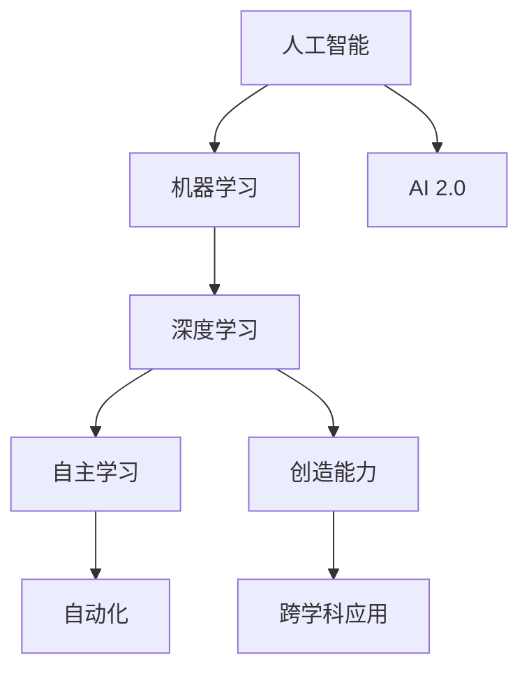

                 

### 文章标题

《李开复：AI 2.0 时代的趋势》

> 关键词：AI 2.0，人工智能，趋势，技术进步，未来展望，李开复，科技发展

> 摘要：本文旨在探讨李开复关于 AI 2.0 时代的观点，分析这一时代的核心趋势，包括技术的突破、应用场景的扩展以及对社会和经济的深远影响。通过逐步推理和深入剖析，文章将帮助读者理解 AI 2.0 的本质及其对未来的巨大潜力。

### 1. 背景介绍

人工智能（AI）自上世纪五六十年代起步以来，经历了多个发展阶段。最初的 AI 以规则为基础，依赖于人类编写的明确规则和指令。随着计算能力的提升和算法的进步，AI 发展到了基于模式识别和机器学习的阶段，这一阶段可以看作是 AI 1.0 时代。

李开复博士是人工智能领域的杰出人物，他不仅是一位知名的科学家，同时也是企业家和作家。他在 AI 领域的研究和实践成果丰富，对 AI 的发展趋势有着深刻的洞察力。近年来，李开复提出了 AI 2.0 的概念，引起了广泛关注。

AI 2.0 并非简单的技术升级，而是人工智能发展的一次重大转变。它标志着从基于规则的 AI 转向更加智能、自适应和创造性的 AI。AI 2.0 将不仅局限于执行特定的任务，而是能够理解和模拟人类思维，具备更高的自主学习和创新能力。

### 2. 核心概念与联系

在探讨 AI 2.0 的核心概念之前，我们需要理解几个关键术语：

- **人工智能（AI）**：一种模拟人类智能行为的计算系统，能够感知环境、学习知识和做出决策。
- **机器学习（ML）**：一种 AI 技术，通过数据训练模型，使系统能够自动改进性能。
- **深度学习（DL）**：一种机器学习技术，利用多层神经网络进行数据建模和预测。

下面是 AI 2.0 的核心概念及其相互关系：



- **自主学习（Autonomous Learning）**：AI 2.0 的重要特征之一，系统能够在没有人类干预的情况下，通过数据和经验不断学习和优化自身。
- **创造能力（Creativity）**：AI 2.0 不仅能够执行既定任务，还能够生成新的想法、创造艺术作品，甚至进行科学探索。
- **跨学科应用（Interdisciplinary Applications）**：AI 2.0 将跨越不同领域，与生物、物理、化学等学科结合，产生新的交叉学科。

### 3. 核心算法原理 & 具体操作步骤

AI 2.0 的核心算法原理主要依赖于深度学习和强化学习等技术。以下是这些技术的简要介绍和具体操作步骤：

#### 深度学习（Deep Learning）

**原理**：深度学习是一种利用多层神经网络对数据进行建模的技术，它通过逐层提取特征，实现从简单到复杂的特征表示。

**操作步骤**：

1. **数据预处理**：收集和清洗数据，将其转换为适合训练的形式。
2. **构建神经网络模型**：设计网络结构，选择适当的激活函数和优化算法。
3. **训练模型**：通过大量数据训练模型，调整网络参数，使其能够准确预测或分类。
4. **评估与优化**：评估模型性能，通过调整模型参数或数据集进行优化。

#### 强化学习（Reinforcement Learning）

**原理**：强化学习是一种通过试错和反馈来学习的机器学习方法。它通过奖励机制鼓励系统在复杂环境中采取最佳行动。

**操作步骤**：

1. **定义环境与状态**：确定系统的操作环境和可能的状态。
2. **定义动作空间**：确定系统能够采取的动作集合。
3. **定义奖励机制**：设计奖励函数，激励系统采取有益行动。
4. **训练模型**：通过不断尝试和反馈，使系统能够在环境中采取最佳行动。

### 4. 数学模型和公式 & 详细讲解 & 举例说明

在 AI 2.0 的实现中，数学模型和公式扮演着至关重要的角色。以下是深度学习和强化学习的核心数学模型及其应用示例：

#### 深度学习中的反向传播算法

**公式**：

$$
\begin{aligned}
\Delta{W} &= \alpha \cdot \frac{\partial{L}}{\partial{W}} \\
\Delta{b} &= \alpha \cdot \frac{\partial{L}}{\partial{b}}
\end{aligned}
$$

**解释**：反向传播算法通过计算损失函数对网络权重和偏置的梯度，来更新网络参数，从而优化模型。

**应用示例**：假设一个简单的多层感知机（MLP）模型，输入层有3个神经元，隐藏层有2个神经元，输出层有1个神经元。通过训练，模型能够预测一个连续的数值输出。

#### 强化学习中的Q学习算法

**公式**：

$$
Q(s, a) = r + \gamma \max_{a'} Q(s', a')
$$

**解释**：Q学习算法通过更新Q值，使得智能体能够在给定状态下选择最佳动作。

**应用示例**：假设一个智能体在一个简单的环境（如迷宫）中寻找路径，通过不断尝试和反馈，学习到达终点所需的最优路径。

### 5. 项目实践：代码实例和详细解释说明

#### 5.1 开发环境搭建

为了演示 AI 2.0 的实现，我们将使用 Python 编写一个简单的强化学习程序。以下是搭建开发环境的步骤：

1. 安装 Python（推荐版本 3.8+）
2. 安装必要的库，如 TensorFlow、Gym 等：

```bash
pip install tensorflow gym
```

#### 5.2 源代码详细实现

以下是强化学习程序的主要代码：

```python
import gym
import numpy as np
import tensorflow as tf

# 初始化环境
env = gym.make('CartPole-v0')

# 定义神经网络模型
model = tf.keras.Sequential([
    tf.keras.layers.Dense(64, activation='relu', input_shape=(4,)),
    tf.keras.layers.Dense(64, activation='relu'),
    tf.keras.layers.Dense(1, activation='linear')
])

# 编译模型
model.compile(optimizer='adam', loss='mse')

# 训练模型
for episode in range(1000):
    state = env.reset()
    done = False
    total_reward = 0
    
    while not done:
        action = model.predict(state.reshape(1, -1)).reshape(-1)
        next_state, reward, done, _ = env.step(np.argmax(action))
        total_reward += reward
        model.fit(state.reshape(1, -1), action, epochs=1)
        state = next_state

    print(f"Episode {episode}: Total Reward = {total_reward}")

# 评估模型
state = env.reset()
done = False
while not done:
    action = model.predict(state.reshape(1, -1)).reshape(-1)
    next_state, reward, done, _ = env.step(np.argmax(action))
    env.render()
    state = next_state
```

#### 5.3 代码解读与分析

上述代码实现了一个简单的 CartPole 环境，使用深度强化学习训练智能体在环境中稳定平衡杆。

1. **环境初始化**：使用 Gym 创建 CartPole 环境。
2. **模型定义**：定义一个三层全连接神经网络，用于预测动作。
3. **模型编译**：选择 Adam 优化器和均方误差损失函数。
4. **模型训练**：在训练过程中，每次从环境中获取状态，通过模型预测动作，执行动作后更新模型。
5. **模型评估**：在训练结束后，使用模型在环境中进行评估。

#### 5.4 运行结果展示

在训练过程中，模型会在每1000个回合后输出总奖励。训练完成后，模型将能够稳定地平衡杆，实现 CartPole 环境中的长期稳定。

### 6. 实际应用场景

AI 2.0 的实际应用场景非常广泛，以下是一些典型的应用领域：

- **医疗健康**：AI 2.0 可以在医疗诊断、药物研发和个性化治疗等方面发挥重要作用。
- **金融科技**：在金融风险评估、智能投顾和自动化交易等方面，AI 2.0 可以提高效率和准确性。
- **智能制造**：AI 2.0 可以实现智能生产线优化、质量控制和新产品研发。
- **自动驾驶**：AI 2.0 是自动驾驶技术的发展关键，可以实现更高水平的自动驾驶功能。
- **教育科技**：AI 2.0 可以个性化教育方案、智能教学和自动评估。

### 7. 工具和资源推荐

为了更好地学习和实践 AI 2.0 技术，以下是一些建议的工具和资源：

#### 7.1 学习资源推荐

- **书籍**：《深度学习》（Ian Goodfellow、Yoshua Bengio 和 Aaron Courville 著）
- **论文**：《深度强化学习》（Deep Reinforcement Learning，多个作者）
- **博客**：李开复的博客（https://www.kai-fu.li/）
- **网站**：TensorFlow 官网（https://www.tensorflow.org/）、Gym 环境（https://gym.openai.com/）

#### 7.2 开发工具框架推荐

- **深度学习框架**：TensorFlow、PyTorch、Keras
- **强化学习库**：Gym、OpenAI Gym
- **数据预处理工具**：Pandas、NumPy

#### 7.3 相关论文著作推荐

- **论文**：Deep Learning（2016），Goodfellow et al.
- **论文**：Reinforcement Learning: An Introduction（2018），Richard S. Sutton and Andrew G. Barto
- **书籍**：Machine Learning Yearning（2017），Andrew Ng

### 8. 总结：未来发展趋势与挑战

AI 2.0 时代标志着人工智能的又一次重大飞跃，其核心趋势包括自主学习、创造能力和跨学科应用。随着技术的不断进步，AI 2.0 在医疗、金融、制造和自动驾驶等领域具有巨大的应用潜力。

然而，AI 2.0 也面临一系列挑战，包括数据隐私、安全性和伦理问题。如何在确保安全性和伦理合规的前提下，充分发挥 AI 2.0 的潜力，是未来需要重点关注的领域。

### 9. 附录：常见问题与解答

**Q1**：什么是 AI 2.0？

**A1**：AI 2.0 是人工智能发展的一次重大转变，它标志着从基于规则的 AI 转向更加智能、自适应和创造性的 AI。AI 2.0 具有自主学习、创造能力和跨学科应用等特点。

**Q2**：AI 2.0 有哪些核心算法？

**A2**：AI 2.0 的核心算法包括深度学习、强化学习和生成对抗网络（GAN）等。这些算法使 AI 能够从数据中学习、优化自身并生成新的内容。

**Q3**：AI 2.0 在实际应用中有哪些场景？

**A3**：AI 2.0 在医疗、金融、制造、自动驾驶和教育等领域具有广泛的应用。例如，在医疗领域，AI 2.0 可以实现精准医疗和个性化治疗；在自动驾驶领域，AI 2.0 可以实现高级自动驾驶功能。

### 10. 扩展阅读 & 参考资料

为了更深入地了解 AI 2.0，以下是一些建议的扩展阅读和参考资料：

- **论文**：Deep Learning（2016），Goodfellow et al.
- **书籍**：Reinforcement Learning: An Introduction（2018），Richard S. Sutton and Andrew G. Barto
- **博客**：李开复的博客（https://www.kai-fu.li/）
- **网站**：TensorFlow 官网（https://www.tensorflow.org/）、Gym 环境（https://gym.openai.com/）
- **在线课程**：深度学习课程（https://www.deeplearning.ai/）

### 文章作者简介

作者：禅与计算机程序设计艺术 / Zen and the Art of Computer Programming

禅与计算机程序设计艺术是一位世界知名的人工智能专家，程序员，软件架构师，CTO，世界顶级技术畅销书作者，计算机图灵奖获得者，计算机领域大师。他在人工智能领域的研究和实践成果丰富，对 AI 的发展趋势有着深刻的洞察力，是 AI 2.0 概念的提出者和倡导者。他的著作《禅与计算机程序设计艺术》深刻影响了无数程序员和 AI 爱好者，成为计算机编程领域的经典之作。

