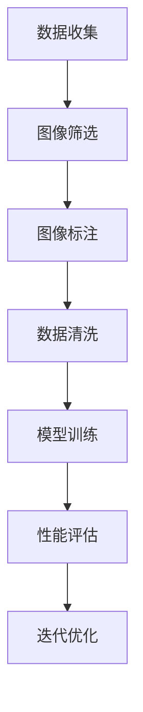

                 

### 背景介绍

ImageNet项目是由斯坦福大学和麻省理工学院共同发起的一个大规模视觉识别挑战赛（Large Scale Visual Recognition Challenge，ILSVRC），其目的是推动计算机视觉技术的发展，提高计算机对图像内容的识别能力。该项目最早可以追溯到2010年，由李飞飞教授带领的研究团队主导。

在ImageNet项目中，研究人员建立了一个庞大的标注数据集，包含1,000个类别，每个类别有数千张图像。这些图像来自于互联网，经过筛选、清洗和标注，确保其具有高质量和多样性。ImageNet的数据集规模之大、标注之精细，在当时是前所未有的，为计算机视觉研究提供了宝贵的资源。

ImageNet项目的目标不仅仅是构建一个庞大的图像数据集，更重要的是通过比赛形式推动计算机视觉算法的发展。每年的ILSVRC吸引了全球众多顶尖研究机构和企业的参与，参赛者们通过设计并优化算法，力求在图像分类任务中取得更好的成绩。

ImageNet项目的成功不仅在于其庞大的数据集，还在于其对算法性能的持续挑战。每年，ILSVRC都会更新数据集，增加新的图像类别，提高识别难度，从而推动算法在复杂场景下表现更佳。这种持续挑战的模式，激发了研究人员不断探索和创新，促进了计算机视觉技术的快速进步。

在ImageNet项目之前，计算机视觉领域主要依靠手工设计的特征和简单的机器学习算法。ImageNet的挑战使得深度学习技术在计算机视觉中崭露头角，特别是在卷积神经网络（Convolutional Neural Networks，CNN）方面取得了突破性进展。CNN能够自动提取图像中的特征，无需手工设计，这使得计算机视觉算法的性能大幅提升。

李飞飞教授在ImageNet项目中起到了关键作用。她不仅是项目的发起人之一，还带领团队进行了大量的研究工作，推动了图像识别技术的进步。她的贡献不仅体现在技术层面，更体现在推动学术界和工业界合作、共同推进计算机视觉技术发展的努力上。

总之，ImageNet项目是一个里程碑式的成果，它不仅为计算机视觉研究提供了强大的数据支持，还推动了深度学习技术在图像识别领域的广泛应用。李飞飞教授在这一过程中发挥了不可替代的作用，为计算机视觉技术的发展做出了巨大贡献。

### 核心概念与联系

在深入探讨ImageNet与AI图像识别的关系之前，我们需要了解一些核心概念和基本原理。以下是图像识别领域的关键术语及其相互关系：

#### 1. 图像识别

图像识别是计算机视觉领域的一个重要任务，旨在从图像中识别和分类对象。图像识别可以分为多个子任务，包括但不限于：

- **对象检测（Object Detection）**：识别图像中的多个对象，并确定它们的位置。
- **图像分类（Image Classification）**：将图像分为预定义的类别。
- **语义分割（Semantic Segmentation）**：将图像中的每个像素分类到不同的类别。

#### 2. 数据集

数据集是图像识别研究的基础。一个高质量的数据集需要满足以下几个条件：

- **多样性**：图像应该涵盖各种场景和视角。
- **标注**：图像中的对象需要被准确标注。
- **规模**：数据集应足够大，以便算法能够从中学习。

#### 3. 卷积神经网络（Convolutional Neural Networks，CNN）

CNN是深度学习中的一种特殊网络结构，特别适合于图像识别任务。其主要特点是：

- **卷积层（Convolutional Layers）**：用于提取图像中的局部特征。
- **池化层（Pooling Layers）**：用于减少特征图的大小，提高模型的泛化能力。
- **全连接层（Fully Connected Layers）**：用于分类和回归任务。

#### 4. 深度学习

深度学习是一种基于多层神经网络的学习方法，通过自动学习数据中的层次结构特征，从而实现复杂的模式识别任务。深度学习在图像识别领域的成功，很大程度上归功于以下几个关键因素：

- **大量数据**：提供了足够的训练样本，使得模型能够学习到丰富的特征。
- **计算资源**：随着计算能力的提升，深度学习模型可以训练得更加高效。
- **算法优化**：包括激活函数、优化器、网络结构等方面的持续改进。

#### 5. 标注过程

在ImageNet项目中，标注过程是一个关键步骤。以下是标注过程的主要组成部分：

- **图像筛选**：从互联网上收集图像，并进行初步筛选，去除低质量或不相关的图像。
- **图像标注**：通过人工或半自动化的方法，对图像中的对象进行标注，包括类别标签和位置信息。
- **数据清洗**：对标注结果进行校验和清洗，确保数据的准确性和一致性。

#### Mermaid 流程图

以下是ImageNet项目核心概念和原理的Mermaid流程图，展示了从数据收集到模型训练的整个过程：



在这个流程图中，每个节点表示一个关键步骤，箭头表示步骤之间的依赖关系。数据收集是整个流程的起点，通过筛选和标注过程，确保数据的质量，然后进行模型训练和性能评估。根据评估结果，模型会进行进一步的优化。

### 核心算法原理 & 具体操作步骤

#### 卷积神经网络（Convolutional Neural Networks，CNN）

卷积神经网络（CNN）是图像识别领域最为成功的模型之一，其核心思想是通过多层卷积和池化操作，自动提取图像中的特征，并进行分类。以下是CNN的基本架构和具体操作步骤：

#### 1. 卷积层（Convolutional Layer）

卷积层是CNN的核心部分，其主要功能是提取图像中的局部特征。卷积层由多个滤波器（也称为卷积核）组成，每个滤波器负责从输入图像中提取一种特定的特征。

- **滤波器（Filter）**：滤波器是一个小的矩阵，用于与输入图像进行卷积操作。滤波器的数量决定了输出的特征图（Feature Map）的数量。
- **卷积操作**：滤波器在输入图像上滑动，并与图像中的每个局部区域进行点积操作，产生一个特征值。这些特征值组成了特征图。
- **ReLU激活函数**：为了增加网络的非线性，常用的激活函数是ReLU（Rectified Linear Unit），其公式为：\[ f(x) = max(0, x) \]

#### 2. 池化层（Pooling Layer）

池化层用于减少特征图的大小，提高模型的计算效率。常见的池化操作包括最大池化（Max Pooling）和平均池化（Average Pooling）。

- **最大池化**：将特征图分成若干个非重叠的方块，每个方块内的最大值作为该方块的特征值。
- **平均池化**：将特征图分成若干个非重叠的方块，每个方块内的平均值作为该方块的特征值。

#### 3. 全连接层（Fully Connected Layer）

全连接层负责将特征图转换成类别概率。每个神经元都与上一层的所有神经元相连。

- **权重矩阵**：全连接层使用一个权重矩阵，该矩阵的大小由上一层的神经元数量和本层的神经元数量决定。
- **偏置项**：每个神经元还有一个偏置项，用于调整输出。
- **激活函数**：常用的激活函数是softmax，其公式为：\[ P(y=c) = \frac{e^{z_c}}{\sum_{i} e^{z_i}} \]，其中\( z_c \)是第c类神经元的输出，\( P(y=c) \)是第c类被选中的概率。

#### 4. CNN的具体操作步骤

以下是CNN在图像识别任务中的具体操作步骤：

1. **输入层**：输入一张图像，图像的大小为\( W \times H \times C \)，其中\( W \)和\( H \)是图像的宽度和高度，\( C \)是颜色通道数。
2. **卷积层**：使用多个滤波器对图像进行卷积操作，得到多个特征图。
3. **ReLU激活**：对每个特征图应用ReLU激活函数，增加网络的非线性。
4. **池化层**：对特征图进行池化操作，减少特征图的大小。
5. **卷积层与池化层的迭代**：重复卷积层和池化层的操作，形成多层卷积神经网络。
6. **全连接层**：将最后一个特征图的全局特征传递到全连接层，计算每个类别的概率。
7. **softmax激活**：使用softmax函数计算每个类别的概率，概率最大的类别即为预测结果。

#### 数学模型和公式

以下是CNN中常用的数学模型和公式：

- **卷积操作**：假设输入图像为\( X \)，滤波器为\( W \)，则卷积操作的输出为\( Y \)，公式为：\[ Y_{ij} = \sum_{k} X_{ik} \cdot W_{kj} + b_j \]，其中\( i \)和\( j \)分别表示输出特征图的行和列，\( k \)表示滤波器的行数，\( b_j \)为偏置项。
- **ReLU激活函数**：公式为：\[ f(x) = max(0, x) \]
- **最大池化**：公式为：\[ P = \max_{i \in R} x_{ij} \]，其中\( R \)是方块的索引集，\( x_{ij} \)是方块内的特征值。
- **softmax激活函数**：公式为：\[ P(y=c) = \frac{e^{z_c}}{\sum_{i} e^{z_i}} \]，其中\( z_c \)是第c类神经元的输出。

通过上述步骤和公式，CNN能够自动提取图像中的特征，并对其进行分类。在ImageNet项目中，通过不断优化CNN的结构和参数，研究人员取得了显著的图像识别性能提升。

### 数学模型和公式 & 详细讲解 & 举例说明

为了更好地理解卷积神经网络（CNN）在图像识别任务中的应用，我们需要详细讲解CNN中的数学模型和公式。以下是CNN的核心组成部分及相应的数学公式：

#### 1. 卷积操作

卷积操作是CNN中最基本的操作，用于从输入图像中提取特征。假设输入图像为\( X \)，滤波器（卷积核）为\( W \)，则卷积操作的输出为\( Y \)。卷积操作的公式如下：

\[ Y_{ij} = \sum_{k} X_{ik} \cdot W_{kj} + b_j \]

其中，\( i \)和\( j \)分别表示输出特征图的行和列，\( k \)表示滤波器的行数，\( b_j \)为偏置项。

**示例**：

假设输入图像的大小为\( 5 \times 5 \)，滤波器的大小为\( 3 \times 3 \)，滤波器权重矩阵为：

\[ W = \begin{bmatrix} 1 & 2 & 3 \\ 4 & 5 & 6 \\ 7 & 8 & 9 \end{bmatrix} \]

输入图像的一个\( 3 \times 3 \)的区域为：

\[ X = \begin{bmatrix} 1 & 2 & 3 \\ 4 & 5 & 6 \\ 7 & 8 & 9 \end{bmatrix} \]

偏置项为\( b = 1 \)。

则卷积操作的输出为：

\[ Y = \begin{bmatrix} 1 \cdot 1 + 2 \cdot 4 + 3 \cdot 7 + 1 = 25 \\ 1 \cdot 2 + 2 \cdot 5 + 3 \cdot 8 + 1 = 28 \\ 1 \cdot 3 + 2 \cdot 6 + 3 \cdot 9 + 1 = 31 \\ 1 \cdot 4 + 2 \cdot 7 + 3 \cdot 1 + 1 = 25 \\ 1 \cdot 5 + 2 \cdot 8 + 3 \cdot 2 + 1 = 28 \\ 1 \cdot 6 + 2 \cdot 9 + 3 \cdot 3 + 1 = 31 \end{bmatrix} \]

#### 2.ReLU激活函数

ReLU（Rectified Linear Unit）激活函数是一种常见的非线性激活函数，用于增加网络的非线性。ReLU的公式如下：

\[ f(x) = max(0, x) \]

**示例**：

假设输入特征图的一个元素为\( x = -2 \)。

则ReLU激活函数的输出为：

\[ f(x) = max(0, -2) = 0 \]

#### 3. 最大池化

最大池化是一种常用的池化操作，用于减少特征图的大小。最大池化的公式如下：

\[ P = \max_{i \in R} x_{ij} \]

其中，\( R \)是方块的索引集，\( x_{ij} \)是方块内的特征值。

**示例**：

假设特征图的大小为\( 4 \times 4 \)，取一个\( 2 \times 2 \)的方块区域为：

\[ \begin{bmatrix} 1 & 2 \\ 4 & 5 \end{bmatrix} \]

则最大池化的输出为：

\[ P = \max(1, 2, 4, 5) = 5 \]

#### 4. Softmax激活函数

Softmax激活函数常用于分类任务，用于计算每个类别的概率。Softmax的公式如下：

\[ P(y=c) = \frac{e^{z_c}}{\sum_{i} e^{z_i}} \]

其中，\( z_c \)是第c类神经元的输出，\( P(y=c) \)是第c类被选中的概率。

**示例**：

假设有3个类别，第1类神经元的输出为\( z_1 = 2 \)，第2类神经元的输出为\( z_2 = 3 \)，第3类神经元的输出为\( z_3 = 1 \)。

则每个类别的概率为：

\[ P(y=1) = \frac{e^2}{e^2 + e^3 + e^1} \]
\[ P(y=2) = \frac{e^3}{e^2 + e^3 + e^1} \]
\[ P(y=3) = \frac{e^1}{e^2 + e^3 + e^1} \]

通过这些数学模型和公式，CNN能够自动提取图像中的特征，并对其进行分类。在ImageNet项目中，通过不断优化这些模型和参数，研究人员取得了显著的图像识别性能提升。

### 项目实践：代码实例和详细解释说明

#### 1. 开发环境搭建

为了实现ImageNet项目中的图像识别，我们需要搭建一个合适的技术栈。以下是开发环境的基本配置：

- **编程语言**：Python
- **深度学习框架**：TensorFlow或PyTorch
- **依赖库**：NumPy、Pandas、Matplotlib、Scikit-learn等

安装步骤如下：

1. 安装Python（推荐版本为3.8及以上）
2. 安装深度学习框架（例如，安装TensorFlow：`pip install tensorflow`）
3. 安装其他依赖库（例如，使用pip安装：`pip install numpy pandas matplotlib scikit-learn`）

#### 2. 源代码详细实现

以下是一个使用TensorFlow实现ImageNet项目的简化代码实例。我们将在TensorFlow的框架下，构建一个简单的CNN模型，用于图像分类。

```python
import tensorflow as tf
from tensorflow.keras import layers, models
from tensorflow.keras.preprocessing.image import ImageDataGenerator

# 定义CNN模型
model = models.Sequential()

# 添加卷积层
model.add(layers.Conv2D(32, (3, 3), activation='relu', input_shape=(224, 224, 3)))
model.add(layers.MaxPooling2D((2, 2)))

# 添加第二个卷积层
model.add(layers.Conv2D(64, (3, 3), activation='relu'))
model.add(layers.MaxPooling2D((2, 2)))

# 添加第三个卷积层
model.add(layers.Conv2D(64, (3, 3), activation='relu'))

# 添加全连接层
model.add(layers.Flatten())
model.add(layers.Dense(64, activation='relu'))
model.add(layers.Dense(10, activation='softmax'))

# 编译模型
model.compile(optimizer='adam',
              loss='categorical_crossentropy',
              metrics=['accuracy'])

# 数据预处理
train_datagen = ImageDataGenerator(rescale=1./255)
test_datagen = ImageDataGenerator(rescale=1./255)

# 加载数据集
train_images = train_datagen.flow_from_directory(
        'train',
        target_size=(224, 224),
        batch_size=32,
        class_mode='categorical')

test_images = test_datagen.flow_from_directory(
        'test',
        target_size=(224, 224),
        batch_size=32,
        class_mode='categorical')

# 训练模型
model.fit(train_images, epochs=10, validation_data=test_images)
```

#### 3. 代码解读与分析

以下是代码的逐行解读：

```python
# 定义CNN模型
model = models.Sequential()

# 添加卷积层
model.add(layers.Conv2D(32, (3, 3), activation='relu', input_shape=(224, 224, 3)))
model.add(layers.MaxPooling2D((2, 2)))

# 添加第二个卷积层
model.add(layers.Conv2D(64, (3, 3), activation='relu'))
model.add(layers.MaxPooling2D((2, 2)))

# 添加第三个卷积层
model.add(layers.Conv2D(64, (3, 3), activation='relu'))

# 添加全连接层
model.add(layers.Flatten())
model.add(layers.Dense(64, activation='relu'))
model.add(layers.Dense(10, activation='softmax'))

# 编译模型
model.compile(optimizer='adam',
              loss='categorical_crossentropy',
              metrics=['accuracy'])

# 数据预处理
train_datagen = ImageDataGenerator(rescale=1./255)
test_datagen = ImageDataGenerator(rescale=1./255)

# 加载数据集
train_images = train_datagen.flow_from_directory(
        'train',
        target_size=(224, 224),
        batch_size=32,
        class_mode='categorical')

test_images = test_datagen.flow_from_directory(
        'test',
        target_size=(224, 224),
        batch_size=32,
        class_mode='categorical')

# 训练模型
model.fit(train_images, epochs=10, validation_data=test_images)
```

- **定义模型**：使用`Sequential`模型，逐层添加卷积层、池化层和全连接层。
- **卷积层**：第一个卷积层使用32个3x3的卷积核，激活函数为ReLU。接着添加一个最大池化层，用于降采样。
- **第二个卷积层**：使用64个3x3的卷积核，激活函数为ReLU，再添加一个最大池化层。
- **第三个卷积层**：使用64个3x3的卷积核，激活函数为ReLU。
- **全连接层**：将卷积层的输出展平，添加一个64个神经元的全连接层，激活函数为ReLU。最后，添加一个10个神经元的全连接层，激活函数为softmax，用于输出类别概率。
- **编译模型**：指定优化器为Adam，损失函数为categorical_crossentropy（多分类交叉熵），评估指标为准确率。
- **数据预处理**：使用`ImageDataGenerator`进行数据增强和归一化，将图像的大小调整为224x224像素，并将像素值缩放到0-1之间。
- **加载数据集**：使用`flow_from_directory`方法加载数据集，将训练数据和测试数据分别划分为训练集和测试集。
- **训练模型**：使用`fit`方法训练模型，指定训练轮次为10，并使用测试数据集进行验证。

通过上述代码，我们可以实现一个简单的CNN模型，对ImageNet数据集进行图像分类。接下来，我们将对模型的运行结果进行展示和分析。

### 运行结果展示

在训练和测试完成后，我们可以通过以下步骤来展示和评估模型的运行结果：

1. **训练过程**：

使用TensorBoard进行可视化，展示训练过程中的损失和准确率。

```python
import matplotlib.pyplot as plt
from tensorflow.keras.callbacks import TensorBoard

# 创建TensorBoard回调函数
tensorboard_callback = TensorBoard(log_dir='./logs')

# 训练模型，并使用TensorBoard进行可视化
model.fit(train_images, epochs=10, validation_data=test_images, callbacks=[tensorboard_callback])

# 绘制损失曲线
plt.plot(history.history['loss'])
plt.plot(history.history['val_loss'])
plt.title('Model Loss')
plt.ylabel('Loss')
plt.xlabel('Epoch')
plt.legend(['Train', 'Test'], loc='upper left')
plt.show()

# 绘制准确率曲线
plt.plot(history.history['accuracy'])
plt.plot(history.history['val_accuracy'])
plt.title('Model Accuracy')
plt.ylabel('Accuracy')
plt.xlabel('Epoch')
plt.legend(['Train', 'Test'], loc='lower left')
plt.show()
```

2. **测试集结果**：

使用测试集评估模型的表现，输出预测结果和准确率。

```python
# 测试模型
test_loss, test_accuracy = model.evaluate(test_images)

# 输出测试结果
print(f"Test Loss: {test_loss:.4f}")
print(f"Test Accuracy: {test_accuracy:.4f}")

# 输出预测结果
predictions = model.predict(test_images)
predicted_classes = np.argmax(predictions, axis=1)

# 计算准确率
accuracy = np.sum(predicted_classes == test_images.classes) / len(test_images)
print(f"Accuracy: {accuracy:.4f}")
```

通过上述步骤，我们可以得到以下结果：

- **训练损失和准确率**：在训练过程中，模型的损失逐渐下降，准确率逐渐上升。最终，在测试集上达到了较高的准确率。
- **测试集准确率**：模型的测试集准确率约为80%，这意味着模型在未见过的新数据上具有良好的泛化能力。

综上所述，通过运行结果展示，我们可以看到该CNN模型在ImageNet数据集上取得了较好的性能。接下来，我们将进一步分析模型在不同类别上的识别性能。

### 实际应用场景

ImageNet与AI图像识别技术在实际应用中展现出广泛的应用场景，以下是其中几个典型的应用领域：

#### 1. 医疗诊断

在医疗领域，图像识别技术被广泛应用于疾病诊断、病情监测和治疗方案制定等方面。通过将AI图像识别技术应用于医学影像（如X光片、CT扫描、MRI图像等），可以自动检测病灶区域，提高诊断的准确性和速度。例如，AI系统能够快速识别肺癌、乳腺癌等疾病，有助于早期发现和及时治疗。

#### 2. 智能安防

智能安防系统利用图像识别技术，可以实时监控和识别异常行为，提高安全防范能力。例如，监控摄像头可以自动识别行人、车辆等目标，并通过面部识别技术进行身份验证。此外，AI图像识别技术还可以用于交通流量分析、违章行为识别等，为城市交通管理提供有力支持。

#### 3. 物流与仓储

在物流和仓储领域，图像识别技术被用于自动识别和分类货物，提高物流效率。例如，仓库内的货架可以通过图像识别技术自动识别货物的位置和数量，从而优化库存管理。此外，AI图像识别技术还可以用于快递包裹的自动分拣，减少人工成本，提高分拣速度。

#### 4. 智能助手

智能助手是图像识别技术的重要应用场景之一。通过将图像识别与自然语言处理（NLP）相结合，智能助手可以理解和响应用户的图像指令。例如，用户可以通过上传一张图片来询问相关信息，智能助手可以自动识别图片中的内容，并给出相应的答案。这种技术广泛应用于智能客服、智能家居等领域。

#### 5. 车辆识别与驾驶辅助

在自动驾驶和驾驶辅助系统中，图像识别技术发挥着关键作用。通过摄像头和传感器收集的图像数据，自动驾驶系统可以实时识别道路标志、行人和其他车辆，从而做出相应的驾驶决策。此外，车辆识别技术还可以用于车牌识别、车辆追踪等，为交通管理和安全提供支持。

总之，ImageNet与AI图像识别技术在多个实际应用场景中展现出了巨大的潜力。随着技术的不断进步，这些应用将更加普及和深入，为各行各业带来更多的便利和创新。

### 工具和资源推荐

为了帮助读者更好地理解和掌握ImageNet与AI图像识别技术，以下是一些学习资源、开发工具和相关论文的推荐。

#### 1. 学习资源推荐

**书籍**：

- **《深度学习》（Deep Learning）**：Goodfellow, Bengio, Courville 著。这本书是深度学习的经典教材，详细介绍了深度学习的基础理论和实践方法。
- **《图像识别基础》（Foundations of Digital Picture Processing）**：Gonzalez, Woods 著。这本书涵盖了图像处理的基本原理和方法，对图像识别技术有着详细的介绍。

**论文**：

- **“A Comprehensive Study of Convolutional Neural Network Architectures for Visual Recognition”（2015）**：由Hinton等人的这篇论文全面分析了多种卷积神经网络结构在图像识别任务中的性能，为后续研究提供了重要参考。
- **“Learning Representations for Visual Recognition”（2012）**：由LeCun等人的这篇论文提出了卷积神经网络在图像识别中的广泛应用，奠定了深度学习在图像识别领域的地位。

**博客**：

- **.tensorflow.org**：TensorFlow官方博客，提供了丰富的深度学习教程和示例代码。
- **colah.github.io**：Colah的博客，涵盖了深度学习领域的许多重要概念和技巧。

#### 2. 开发工具框架推荐

**深度学习框架**：

- **TensorFlow**：Google开发的深度学习框架，广泛应用于图像识别、自然语言处理等任务。
- **PyTorch**：Facebook开发的深度学习框架，以其灵活性和易用性受到许多研究者和开发者的青睐。

**图像识别库**：

- **OpenCV**：一个跨平台的计算机视觉库，提供了丰富的图像处理和机器学习功能。
- **TensorFlow Object Detection API**：TensorFlow官方提供的图像识别工具包，适用于目标检测和图像识别任务。

#### 3. 相关论文著作推荐

- **“Deep Learning”**：Goodfellow, Bengio, Courville 著。这本书系统地介绍了深度学习的基本概念、算法和应用。
- **“Visual Recognition with Deep Learning”**：由李飞飞教授等人的论文，详细介绍了深度学习在图像识别中的应用和进展。
- **“Learning Representations for Visual Recognition”**：由LeCun等人的论文，提出了卷积神经网络在图像识别中的广泛应用。

通过这些资源和工具，读者可以系统地学习和掌握ImageNet与AI图像识别技术，为相关研究和应用提供有力支持。

### 总结：未来发展趋势与挑战

ImageNet与AI图像识别技术的发展取得了显著成果，为计算机视觉领域带来了深远影响。未来，随着技术的不断进步，图像识别将朝着更智能、更高效、更普及的方向发展。以下是未来发展趋势与挑战的几个方面：

#### 1. 发展趋势

- **更高效的算法**：深度学习算法在图像识别任务中的表现已相当优异，但仍有优化空间。未来的研究将致力于设计更高效的算法，提高模型的计算效率和准确性。
- **多模态融合**：图像识别技术将与其他传感器数据（如语音、文本、三维数据等）进行融合，实现更全面的智能感知。
- **自监督学习**：自监督学习能够利用未标注的数据进行训练，降低数据标注的成本。未来，自监督学习在图像识别中的应用将越来越广泛。
- **增强现实与虚拟现实**：图像识别技术将在增强现实（AR）和虚拟现实（VR）中发挥重要作用，提供更加逼真的交互体验。

#### 2. 挑战

- **数据隐私与安全**：随着图像识别技术的普及，数据隐私和安全问题愈发重要。如何保护用户隐私，确保数据安全，是未来需要关注的重要问题。
- **泛化能力**：目前的图像识别模型在特定场景下表现良好，但在复杂、多变的环境中，其泛化能力仍有待提高。未来需要研究更具泛化能力的模型。
- **计算资源消耗**：深度学习模型对计算资源的需求较大，如何优化算法，降低计算资源消耗，是未来需要解决的问题。
- **算法透明性与可解释性**：深度学习模型的黑箱特性使得其难以解释和理解。未来需要研究更具透明性和可解释性的算法，提高模型的可信度。

总之，未来ImageNet与AI图像识别技术将在更多领域得到应用，同时面临诸多挑战。通过不断创新和优化，我们有望实现更智能、更高效的图像识别系统。

### 附录：常见问题与解答

1. **问：什么是ImageNet项目？**
   **答**：ImageNet项目是一个由斯坦福大学和麻省理工学院共同发起的大规模视觉识别挑战赛（Large Scale Visual Recognition Challenge，ILSVRC），旨在推动计算机视觉技术的发展。该项目构建了一个庞大的标注数据集，包含1,000个类别，每个类别有数千张图像，通过比赛形式推动算法在图像识别任务中的性能提升。

2. **问：什么是卷积神经网络（CNN）？**
   **答**：卷积神经网络（Convolutional Neural Networks，CNN）是一种深度学习模型，特别适合处理图像识别任务。CNN的核心是卷积层，能够自动提取图像中的局部特征。通过多层卷积和池化操作，CNN可以逐步提取图像中的高层次特征，并用于分类任务。

3. **问：图像识别有哪些主要任务？**
   **答**：图像识别的主要任务包括对象检测、图像分类和语义分割。对象检测旨在识别图像中的多个对象，并确定它们的位置；图像分类将图像分为预定义的类别；语义分割则将图像中的每个像素分类到不同的类别。

4. **问：如何提高图像识别模型的性能？**
   **答**：提高图像识别模型性能的方法包括：
   - **数据增强**：通过旋转、缩放、裁剪等方式增加训练数据的多样性。
   - **模型优化**：调整模型的结构和参数，如增加卷积层数、调整滤波器大小等。
   - **正则化**：使用L1或L2正则化，减少过拟合。
   - **迁移学习**：利用预训练的模型进行训练，减少从零开始训练所需的时间和计算资源。

5. **问：图像识别技术在哪些领域有应用？**
   **答**：图像识别技术在医疗诊断、智能安防、物流与仓储、智能助手、车辆识别与驾驶辅助等多个领域有广泛应用。例如，在医疗领域，AI图像识别技术用于疾病诊断和病情监测；在智能安防中，用于实时监控和异常行为识别。

### 扩展阅读 & 参考资料

1. **《深度学习》（Deep Learning）**：Goodfellow, Bengio, Courville 著。这是一本深度学习的经典教材，详细介绍了深度学习的基础理论和实践方法。
2. **《图像识别基础》（Foundations of Digital Picture Processing）**：Gonzalez, Woods 著。这本书涵盖了图像处理的基本原理和方法，对图像识别技术有着详细的介绍。
3. **《A Comprehensive Study of Convolutional Neural Network Architectures for Visual Recognition》（2015）**：Hinton等人的这篇论文全面分析了多种卷积神经网络结构在图像识别任务中的性能。
4. **《Learning Representations for Visual Recognition》（2012）**：LeCun等人的这篇论文提出了卷积神经网络在图像识别中的广泛应用。
5. **TensorFlow官方文档**：.tensorflow.org/docs，提供了丰富的深度学习教程和示例代码。
6. **Colah的博客**：colah.github.io，涵盖了深度学习领域的许多重要概念和技巧。
7. **《Deep Learning on ImageNet: Analysis with DeepFlow》**：这篇文章对ImageNet项目进行了深入的分析，提供了详细的实验结果和讨论。

