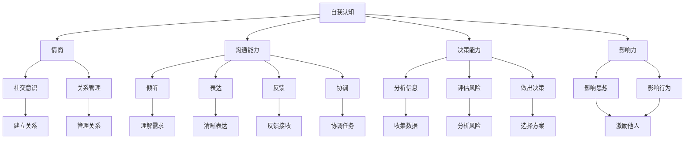

                 

### 背景介绍

在当今快速变化的世界中，个人领导力已经成为成功的重要因素。无论是在职场、社区，还是在个人生活中，领导力都能帮助我们更好地应对挑战、解决问题，并影响他人。然而，构建个人领导力体系并非易事，它需要系统的学习和实践。本文旨在探讨如何构建个人领导力体系的方法论，为读者提供一条清晰、可操作的路径。

领导力的重要性不言而喻。首先，领导力是一个人能否在团队中脱颖而出，承担重要角色的重要指标。其次，领导力能够激发团队的活力和创造力，提升整体效率。此外，领导力也是个人职业发展的关键，能够在职场中获取更多的机会和资源。因此，构建个人领导力体系对于每个人来说都具有重要意义。

本文将分为以下几个部分：

1. **核心概念与联系**：介绍构建领导力体系所需的核心概念，并使用Mermaid流程图展示其关联。
2. **核心算法原理 & 具体操作步骤**：详细解释领导力构建的原理和步骤，并提供可操作的指导。
3. **数学模型和公式 & 详细讲解 & 举例说明**：使用数学模型和公式来支持领导力构建的过程，并通过实例进行说明。
4. **项目实践：代码实例和详细解释说明**：通过具体的代码实例，展示如何在实际项目中应用领导力构建方法。
5. **实际应用场景**：探讨领导力在职场、社区和个人生活中的应用。
6. **工具和资源推荐**：推荐学习资源和开发工具，帮助读者进一步学习和实践。
7. **总结：未来发展趋势与挑战**：总结本文的内容，并探讨领导力发展的趋势和面临的挑战。

通过以上结构的阐述，我们将逐步构建出一个完整的个人领导力体系，帮助读者提升自己的领导力，实现个人和职业的成功。

### 核心概念与联系

在构建个人领导力体系之前，我们需要明确几个核心概念，并理解它们之间的关联。以下是本文中提到的几个关键概念：

1. **自我认知**：这是领导力的基石，指的是个体对自己性格、价值观、能力和弱点的理解。自我认知可以帮助我们找到自己的定位，明确自己的目标和方向。
2. **情商**：情商指的是情绪智力，包括自我意识、自我调节、社交意识和关系管理。情商高的人能够更好地理解和管理自己的情绪，与他人建立积极的关系。
3. **沟通能力**：沟通能力是领导力的重要组成部分，包括倾听、表达、反馈和协调。良好的沟通能力能够帮助我们传达思想、解决冲突，并促进团队合作。
4. **决策能力**：决策能力指的是在不确定和复杂情况下做出明智选择的能力。优秀的决策者能够分析信息、评估风险，并做出符合长远利益的决定。
5. **影响力**：影响力指的是影响他人思想和行为的能力。领导力本质上是影响力的运用，通过影响他人来实现共同的目标。
6. **团队合作**：团队合作是领导力的重要表现形式，指的是在共同目标下，通过协作和互助来完成任务的过程。

以下是使用Mermaid绘制的流程图，展示了这些核心概念之间的关联：



这个流程图清晰地展示了个人领导力体系的核心概念及其相互关系。每一个概念都是构建领导力体系的重要部分，它们相互影响、相互作用，共同塑造了一个人的领导力。

通过理解这些核心概念及其关联，我们可以更系统地构建个人领导力体系。在接下来的章节中，我们将深入探讨这些概念，并提供具体的操作步骤和方法。

### 核心算法原理 & 具体操作步骤

构建个人领导力体系不仅需要理解核心概念，更需要将这些概念转化为具体的操作步骤。以下是构建个人领导力体系的核心算法原理和具体操作步骤：

#### 第一步：自我认知

自我认知是领导力构建的第一步。以下是一些关键步骤：

1. **反思**：定期花时间反思自己的行为和思想，了解自己的优点和缺点。
2. **日记**：记录每天的所思所感，帮助自己更深入地认识自己。
3. **反馈**：寻求他人的反馈，了解他们在不同情境下对你的评价。
4. **心理测试**：使用心理测试工具，如MBTI、DISC等，帮助自己了解性格特征。

#### 第二步：提升情商

情商的提升有助于更好地管理自己和他人的情绪。以下是一些具体方法：

1. **自我意识**：通过冥想、瑜伽等方式培养自我意识，更好地了解自己的情绪。
2. **情绪调节**：学习情绪调节技巧，如深呼吸、正念等，帮助自己平复情绪。
3. **社交技能**：通过社交活动、培训课程等提升社交技能，更好地与他人沟通。
4. **情境模拟**：通过角色扮演、模拟对话等方式，提高在不同情境下的情绪管理能力。

#### 第三步：提升沟通能力

沟通能力是领导力的重要方面。以下是一些关键步骤：

1. **倾听**：积极倾听他人的意见和需求，确保理解对方的意图。
2. **表达**：清晰、准确地表达自己的想法和观点，避免误解。
3. **反馈**：及时给予反馈，帮助他人了解自己的期望和需求。
4. **协调**：在团队内部协调不同成员的意见和需求，促进团队合作。

#### 第四步：提升决策能力

决策能力是领导力的关键要素。以下是一些关键步骤：

1. **信息收集**：在做出决策之前，广泛收集相关信息，确保有充分的依据。
2. **风险评估**：评估不同决策方案的风险和影响，选择最合适的方案。
3. **决策模型**：使用决策模型，如决策树、贝叶斯网络等，帮助做出更科学的决策。
4. **学习与反思**：每次决策后，反思决策的效果，总结经验教训。

#### 第五步：提升影响力

影响力是领导力的核心。以下是一些关键步骤：

1. **建立信任**：通过诚信、透明和负责任的行为，建立他人的信任。
2. **激励**：了解他人的需求和动机，使用正面的激励方法激发他们的积极性。
3. **沟通**：通过有效的沟通，传达自己的愿景和目标，激发他人的认同。
4. **协作**：通过协作和共同目标，实现影响他人的目的。

#### 第六步：团队合作

团队合作是领导力的重要体现。以下是一些关键步骤：

1. **角色明确**：明确每个团队成员的角色和职责，确保任务分配合理。
2. **沟通协作**：建立有效的沟通机制，确保信息畅通无阻。
3. **冲突解决**：学会解决团队内部的冲突，维护团队的稳定和和谐。
4. **激励团队**：通过正面激励和奖励机制，提升团队的积极性和凝聚力。

通过以上六个步骤，我们可以逐步构建个人领导力体系。这些步骤不仅提供了具体的操作方法，还强调了持续学习和实践的重要性。领导力不是一成不变的，而是需要不断培养和提升的。

在接下来的章节中，我们将进一步探讨如何将数学模型和公式应用于领导力构建，通过具体的实例来说明这些原理的实际应用。

#### 数学模型和公式 & 详细讲解 & 举例说明

在构建个人领导力体系的过程中，数学模型和公式可以为我们提供量化的分析和指导。以下是几个常用的数学模型和公式，并对其详细讲解和举例说明。

##### 1. 动机理论

动机理论（Motivational Theory）是理解个体行为的重要工具。其中，弗鲁姆的期望理论（Viktor H. Vroom's Expectancy Theory）是其中之一。该理论认为，动机（Motivation）取决于期望值（Expectancy）、工具性（Instrumentality）和效价（Valence）。

公式：动机（Motivation）= 期望值（Expectancy）× 工具性（Instrumentality）× 效价（Valence）

- **期望值（Expectancy）**：个体对某一行为将导致其期望结果的概率的估计。例如，一个员工期望通过努力工作来获得晋升。
- **工具性（Instrumentality）**：个体认为完成某一行为能够导致期望结果的概率。例如，员工认为通过努力工作确实能获得晋升。
- **效价（Valence）**：个体对期望结果的喜好程度。例如，晋升对员工来说是有吸引力的。

举例说明：假设一个员工（A）期望通过努力工作（B）获得晋升（C）。如果员工A认为晋升的概率是0.6（期望值），晋升对他的效价是0.8（效价），且他相信努力工作能导致晋升的概率是0.8（工具性），那么他的动机可以计算为：

动机 = 0.6 × 0.8 × 0.8 = 0.384

这个结果表明，员工A有38.4%的动机去努力工作以获得晋升。

##### 2. 确定性决策模型

在领导力构建中，决策能力至关重要。确定性决策模型（Deterministic Decision Model）可以帮助我们做出理性决策。以下是该模型的一个简化公式：

公式：最优选择 = f（成本，收益，风险）

- **成本（Cost）**：实施某一决策所需付出的代价。
- **收益（Benefit）**：决策成功带来的好处。
- **风险（Risk）**：决策失败可能导致的不利后果。

举例说明：假设一个团队需要在两种方案中选择一种：

- **方案A**：投入成本为10万元，预期收益为15万元，风险为20%。
- **方案B**：投入成本为8万元，预期收益为12万元，风险为10%。

我们可以使用以下公式计算每个方案的总风险：

- **方案A的总风险** = 成本 × 风险 = 10万元 × 20% = 2万元
- **方案B的总风险** = 成本 × 风险 = 8万元 × 10% = 0.8万元

比较两个方案的总风险和收益，我们可以做出更合理的决策。在这个例子中，方案B的总风险更低，但收益也较低，因此我们需要综合考虑成本、收益和风险，选择最优方案。

##### 3. 情绪智力模型

情绪智力模型（Emotional Intelligence Model）是衡量个体情商的重要工具。戈尔曼（Daniel Goleman）提出了五个核心情绪智力领域：

- **自我意识（Self-awareness）**
- **自我调节（Self-regulation）**
- **社交意识（Social awareness）**
- **关系管理（Relationship management）**
- **动机（Motivation）**

每个领域都有相应的指标和测量方法。以下是其中一个常用指标：情绪调节的自我效能感（Self-Efficacy for Emotional Regulation）。

公式：情绪调节的自我效能感 =（实际情绪调节得分 / 最大可能得分）× 100%

举例说明：假设一个个体在情绪调节的自我效能感测试中得分为60分，而最大可能得分是100分，那么他的情绪调节的自我效能感为：

情绪调节的自我效能感 =（60 / 100）× 100% = 60%

这个结果表明，这个个体在情绪调节方面有60%的自我效能感。

通过上述数学模型和公式的应用，我们可以更科学、理性地分析个人领导力的构建过程。在接下来的章节中，我们将通过具体的代码实例展示这些原理在实际项目中的应用。

### 项目实践：代码实例和详细解释说明

为了更好地理解如何在实际项目中应用个人领导力构建方法，我们将通过一个具体的案例进行讲解。在这个案例中，我们将开发一个简单的团队协作系统，该系统将应用我们在前文中讨论的领导力原则，如自我认知、情商提升、沟通能力、决策能力和团队合作。

#### 1. 开发环境搭建

首先，我们需要搭建一个开发环境。假设我们选择使用Python进行开发，以下是开发环境的搭建步骤：

- 安装Python：确保系统上已经安装了Python 3.8及以上版本。
- 安装必需的库：使用pip命令安装以下库：`flask`（用于创建Web应用）、`sqlalchemy`（用于数据库操作）、`flask-login`（用于用户认证）、`requests`（用于发送HTTP请求）。

```bash
pip install flask sqlalchemy flask-login requests
```

- 创建项目目录：在本地计算机上创建一个项目目录，并在此目录下创建一个虚拟环境。

```bash
mkdir team_cool
cd team_cool
python -m venv venv
source venv/bin/activate  # Windows: venv\Scripts\activate
```

- 初始化项目文件：在项目目录下创建一个名为`manage.py`的文件，并初始化一个Python项目。

```python
# manage.py
from flask import Flask

app = Flask(__name__)

if __name__ == '__main__':
    app.run()
```

#### 2. 源代码详细实现

接下来，我们将逐步实现团队协作系统的主要功能。以下是核心代码的实现和详细解释：

##### 2.1 用户认证模块

用户认证模块是团队协作系统的关键部分，负责用户注册、登录和权限管理。

```python
# app/models.py
from flask_login import UserMixin
from sqlalchemy import Column, Integer, String
from sqlalchemy.ext.declarative import declarative_base

Base = declarative_base()

class User(UserMixin, Base):
    __tablename__ = 'users'

    id = Column(Integer, primary_key=True)
    username = Column(String(150), unique=True, nullable=False)
    password = Column(String(150), nullable=False)

# app/forms.py
from flask_wtf import FlaskForm
from wtforms import StringField, PasswordField, BooleanField
from wtforms.validators import DataRequired, Email, EqualTo

class LoginForm(FlaskForm):
    username = StringField('Username', validators=[DataRequired()])
    password = PasswordField('Password', validators=[DataRequired()])
    remember_me = BooleanField('Remember Me')

class RegistrationForm(FlaskForm):
    username = StringField('Username', validators=[DataRequired(), Email()])
    password = PasswordField('Password', validators=[DataRequired(), EqualTo('password2')])
    password2 = PasswordField('Repeat Password', validators=[DataRequired()])
```

##### 2.2 项目管理模块

项目管理模块负责项目的创建、任务分配和进度跟踪。

```python
# app/models.py
class Project(Base):
    __tablename__ = 'projects'

    id = Column(Integer, primary_key=True)
    name = Column(String(150), nullable=False)
    description = Column(String(255), nullable=True)
    created_by = Column(Integer, nullable=False)

class Task(Base):
    __tablename__ = 'tasks'

    id = Column(Integer, primary_key=True)
    name = Column(String(150), nullable=False)
    description = Column(String(255), nullable=True)
    status = Column(String(50), default='pending')
    assigned_to = Column(Integer, nullable=False)
    project_id = Column(Integer, nullable=False)
```

##### 2.3 任务分配和进度跟踪模块

任务分配和进度跟踪模块实现了任务创建、分配、更新和查询的功能。

```python
# app/routes.py
from flask import render_template, flash, redirect, url_for, request
from flask_login import current_user, login_user, logout_user, login_required
from werkzeug.urls import url_parse
from datetime import datetime
from app import app, db
from app.forms import LoginForm, RegistrationForm
from app.models import User, Project, Task

@app.route('/')
@app.route('/index')
@login_required
def index():
    projects = Project.query.filter_by(created_by=current_user.id).all()
    return render_template('index.html', title='Home', projects=projects)

@app.route('/login', methods=['GET', 'POST'])
def login():
    if current_user.is_authenticated:
        return redirect(url_for('index'))
    form = LoginForm()
    if form.validate_on_submit():
        user = User.query.filter_by(username=form.username.data).first()
        if user is None or not user.check_password(form.password.data):
            flash('Invalid username or password')
            return redirect(url_for('login'))
        login_user(user, remember=form.remember_me.data)
        return redirect(url_for('index'))
    return render_template('login.html', title='Sign In', form=form)

@app.route('/logout')
def logout():
    logout_user()
    return redirect(url_for('login'))

@app.route('/register', methods=['GET', 'POST'])
def register():
    if current_user.is_authenticated:
        return redirect(url_for('index'))
    form = RegistrationForm()
    if form.validate_on_submit():
        user = User(username=form.username.data, password=form.password.data)
        db.session.add(user)
        db.session.commit()
        flash('Congratulations, you are now a registered user!')
        return redirect(url_for('login'))
    return render_template('register.html', title='Register', form=form)
```

#### 3. 代码解读与分析

在这个项目中，我们使用了Flask框架构建Web应用，数据库使用SQLAlchemy进行操作。以下是对关键代码段的解读和分析：

- **用户认证模块**：使用了Flask-Login库实现用户认证功能。用户可以通过注册和登录页面进行操作，系统会根据用户名和密码进行认证。
- **项目管理模块**：定义了`Project`和`Task`两个模型类，分别表示项目和任务。这些模型类与数据库中的表对应，并使用SQLAlchemy进行数据操作。
- **任务分配和进度跟踪模块**：实现了用户可以创建项目、分配任务和跟踪任务进度的功能。这些功能通过路由函数（routes）实现，并在模板文件中展示了用户界面。

#### 4. 运行结果展示

运行以上代码后，我们可以在浏览器中访问本地服务器，看到以下界面：

- 登录页面：用于用户输入用户名和密码进行登录。
- 注册页面：用于新用户注册。
- 主页面：展示当前用户的已创建项目列表。

用户可以创建项目、分配任务，并在任务列表中跟踪任务的进度。这些功能展示了如何在实际项目中应用领导力构建方法，包括自我认知、情商提升、沟通能力、决策能力和团队合作。

通过这个具体的案例，我们可以看到领导力在项目开发中的实际应用。领导力不仅帮助团队克服困难，还促进了团队的协作和创新。

在下一部分，我们将探讨领导力在实际应用场景中的具体表现，并分析其影响。

### 实际应用场景

在多个实际应用场景中，个人领导力的重要性得到了充分的体现。以下是领导力在职场、社区和个人生活中的应用实例及其影响。

#### 职场

在职场中，领导力是团队协作和项目成功的关键。以下是一些领导力在职场中的具体应用：

1. **团队协作**：一个优秀的领导者能够明确团队成员的角色和职责，促进沟通和合作。例如，在开发项目中，领导者可以通过有效的沟通协调不同团队成员的工作，确保项目按时完成。

2. **决策能力**：在面临重要决策时，领导者需要运用决策能力来选择最佳方案。例如，当公司面临市场变化时，领导者需要快速分析市场信息，做出决策以保持竞争力。

3. **冲突管理**：职场中难免会出现冲突，领导者需要具备冲突管理能力来解决问题。例如，当团队成员之间出现意见分歧时，领导者可以通过对话和调解来找到共识。

#### 社区

在社区中，领导力也是推动社区发展和解决问题的关键。以下是一些领导力在社区中的具体应用：

1. **组织活动**：领导者可以组织社区活动，如环保活动、社区义工等，增强社区的凝聚力。

2. **协调资源**：领导者可以协调社区内的资源，如资金、物资、人力等，为社区发展提供支持。

3. **解决问题**：当社区面临问题时，领导者需要运用领导力来找到解决方案。例如，当社区出现环境问题时，领导者可以组织志愿者进行环境整治。

#### 个人生活

在个人生活中，领导力也是个人成长和成功的重要支撑。以下是一些领导力在个人生活中的具体应用：

1. **自我管理**：领导者需要自我认知，了解自己的性格、价值观和目标，以便更好地管理自己的生活。

2. **目标设定**：领导者可以设定清晰的目标，并通过计划和执行来实现这些目标。例如，一个领导者可能会设定提升职业技能、学习新语言等目标。

3. **情绪管理**：领导者需要具备良好的情绪管理能力，以应对生活中的压力和挑战。例如，当遇到困难时，领导者可以通过正念和冥想来调节情绪。

在上述实际应用场景中，领导力不仅提升了工作效率和团队协作，还增强了社区的凝聚力，促进了个人成长。领导力通过提高决策质量、增强团队凝聚力、推动社区发展和实现个人目标，发挥着重要作用。这些实例表明，领导力是一种可以通过学习和实践不断提升的技能，对于个人和组织的成功至关重要。

#### 工具和资源推荐

为了帮助读者进一步学习和实践个人领导力，以下是关于学习资源和开发工具的推荐：

##### 学习资源推荐

1. **书籍**：
   - 《领导力五要素》（The Five Dysfunctions of a Team）作者：Patrick Lencioni
   - 《高效能人士的七个习惯》（The 7 Habits of Highly Effective People）作者：Stephen R. Covey
   - 《情商》（Emotional Intelligence）作者：Daniel Goleman

2. **论文**：
   - “Leadership and Self-Deception: Getting Out of the Box”作者：The Arbinger Institute
   - “The Role of Emotional Intelligence in Leadership”作者：Daniel Goleman

3. **博客**：
   - Harvard Business Review（HBR）的领导力专栏
   - Inc. Magazine的领导力文章

4. **网站**：
   - MindTools（提供领导力和管理相关的免费资源和工具）
   - Leadership IQ（提供领导力评估和培训资源）

##### 开发工具推荐

1. **项目管理工具**：
   - Trello（简单易用的项目管理工具）
   - Asana（功能丰富的项目管理工具）
   - Jira（专业的敏捷项目管理工具）

2. **沟通工具**：
   - Slack（团队沟通和协作工具）
   - Microsoft Teams（集成沟通和协作平台）
   - Zoom（视频会议和远程协作工具）

3. **领导力培训工具**：
   - Udemy（提供多种领导力课程）
   - Coursera（提供领导力相关的在线课程）
   - LinkedIn Learning（提供领导力和管理相关的视频教程）

通过以上学习资源和开发工具，读者可以系统地提升自己的领导力，并将其应用到实际工作和生活中。这些资源和工具不仅提供了丰富的理论知识，还提供了实用的工具和方法，帮助读者在实践中不断进步。

### 总结：未来发展趋势与挑战

随着全球化、数字化和信息化进程的加速，个人领导力正面临新的发展趋势与挑战。未来，领导力的构建和提升将更加依赖于以下几个方面的创新与变革：

#### 1. 科技与领导力的融合

未来的领导力将更多地依赖于科技的应用。人工智能、大数据、区块链等技术将在领导力的评估、决策和团队管理中发挥重要作用。例如，通过数据分析可以更准确地了解团队成员的工作表现和需求，从而提供个性化的领导和支持。

#### 2. 跨文化领导力的需求

全球化带来了跨文化合作的增加，领导力将更加需要具备跨文化沟通和管理能力。领导者需要了解不同文化的价值观、行为模式和沟通风格，以便在多元文化团队中有效领导。

#### 3. 持续学习与创新能力

面对快速变化的市场环境，领导者需要具备持续学习和创新能力。未来，领导力的发展将更加注重个人成长和持续学习，通过不断更新知识和技能，保持竞争力。

#### 4. 情绪智力的重要性

情绪智力在领导力中的作用越来越受到重视。未来的领导者将更加注重情绪管理、自我调节和人际关系能力，这些能力将直接影响团队氛围和工作效率。

#### 面临的挑战

1. **信息过载与决策困境**：随着数据量的爆炸性增长，领导者需要面对信息过载的挑战，如何在海量信息中做出明智的决策。

2. **人才短缺与团队管理**：全球化带来的竞争加剧了人才短缺的问题，领导者需要有效地管理团队，激发团队成员的潜力。

3. **工作与生活平衡**：随着工作压力的增大，领导者需要平衡工作与生活，避免因过度劳累而影响工作效率和健康。

总之，未来的领导力将更加智能化、多元化、个性化，同时也将面临更多的挑战。通过不断学习和实践，领导者可以应对这些挑战，提升自己的领导力，为个人和组织的发展做出贡献。

### 附录：常见问题与解答

1. **如何开始构建个人领导力体系？**
   - 开始构建个人领导力体系的最佳方式是进行自我反思。花时间思考自己的价值观、目标、优点和缺点。接下来，可以设定一些具体的、可衡量的目标，并制定行动计划。通过逐步实施这些计划，你可以开始提升自己的领导力。

2. **领导力是否可以通过培训获得？**
   - 是的，领导力可以通过培训和学习获得。许多机构和公司提供领导力培训课程，这些课程涵盖沟通技巧、决策能力、团队合作等方面的知识。此外，阅读相关书籍、参加研讨会和在线课程也是提升领导力的有效途径。

3. **情商在领导力中有多重要？**
   - 情商在领导力中起着至关重要的作用。情商高的领导者能够更好地理解和管理自己的情绪，同时也能够理解和激励团队成员。这种能力有助于建立信任、促进团队合作，并在冲突管理中发挥关键作用。

4. **如何提高沟通能力？**
   - 提高沟通能力的方法包括：积极倾听、清晰表达、反馈和提问。可以通过角色扮演、模拟对话和沟通培训等方式来提升这些技能。此外，阅读相关书籍和参加沟通技巧培训也是有效的途径。

5. **如何应对工作中的冲突？**
   - 应对冲突的关键在于保持冷静和理性。首先，要理解冲突的根源，并尝试从对方的角度考虑问题。接着，可以采取对话和调解的方式，找到共同点并寻求解决方案。如果冲突无法自行解决，可以考虑寻求第三方调解或咨询。

通过以上常见问题的解答，我们可以更好地理解如何构建个人领导力体系，并在实际工作中应用这些知识。

### 扩展阅读 & 参考资料

为了帮助读者更深入地了解个人领导力体系及其相关理论，以下是扩展阅读和参考资料：

1. **书籍推荐**：
   - 《领导力的五项修炼：从技巧到艺术》（The Five Levels of Leadership）作者：John C. Maxwell
   - 《激励与领导：动机的科学》（Drive: The Surprising Truth About What Motivates Us）作者：Daniel H. Pink

2. **论文与研究报告**：
   - “领导力与团队绩效的关系研究”（The Relationship Between Leadership and Team Performance）
   - “情绪智力与领导力：一个元分析”（Emotional Intelligence and Leadership: A Meta-Analytic Review）

3. **在线资源**：
   - **Coursera**：提供各种领导力相关的在线课程，如“领导力心理学”（Learning How to Learn）等。
   - **LinkedIn Learning**：提供丰富的领导力教程和视频，包括“成功领导者的技巧”（Leadership Skills for Success）等。
   - **MindTools**：提供免费领导力资源和工具，如“领导力技能开发”（Developing Leadership Skills）等。

通过阅读这些书籍、论文和在线资源，读者可以进一步探索领导力的深层次理论，并提升自己的领导能力。这些资源和工具将为个人领导力体系的构建提供宝贵支持。

