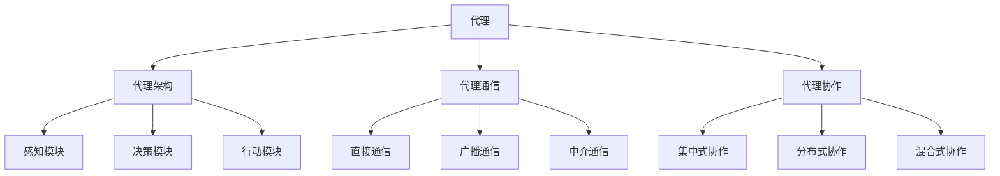
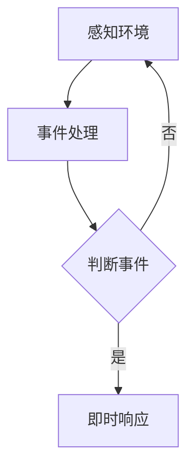
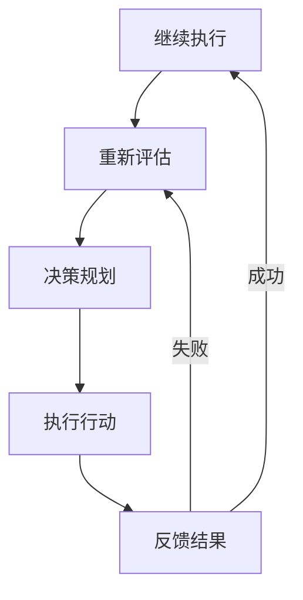
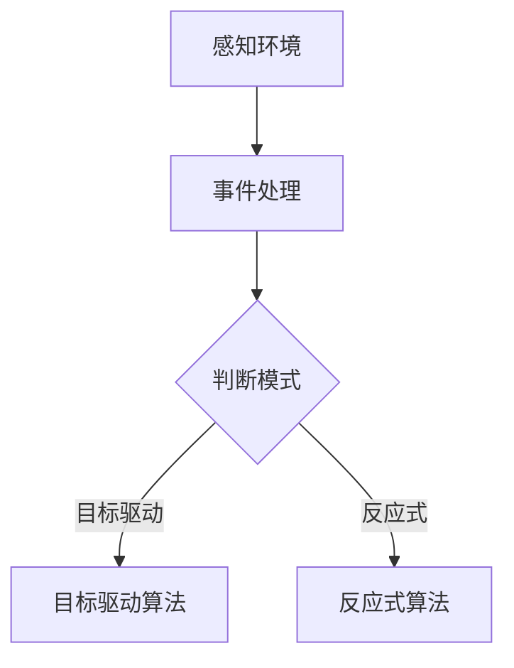

                 

### 构建复杂应用的代理系统 Agents ###

#### 背景介绍：代理系统的定义与重要性

代理系统（Agent System）是构建复杂应用的基础设施之一，它在现代计算机科学和人工智能领域扮演着至关重要的角色。代理（Agent）是一种能够感知环境、作出决策并执行行动的自主实体，能够独立或者协作完成任务。在构建复杂应用时，代理系统提供了一种分布式计算和智能决策的解决方案。

代理系统的定义可以从以下几个方面来理解：

1. **自主性（Autonomy）**：代理能够在没有外部直接干预的情况下自主运行。
2. **社会性（Sociality）**：代理能够与其他代理或者系统进行交互，形成协作网络。
3. **反应性（Reactivity）**：代理能够对环境中的事件做出即时反应。
4. **预动性（Pro-activity）**：代理能够根据预定目标和规则主动采取行动。

代理系统的重要性体现在以下几个方面：

1. **提高系统可维护性**：通过将任务分解成多个代理，使得系统结构更加清晰，维护变得更加容易。
2. **增强系统适应性**：代理能够根据环境变化调整自身行为，提高系统的适应性。
3. **实现分布式计算**：代理可以在不同的计算节点上运行，实现负载均衡和资源优化。
4. **支持智能化决策**：代理能够通过学习环境信息，为系统提供智能化决策支持。

本文将围绕构建复杂应用的代理系统展开，通过逐步分析推理的方式，探讨核心概念、算法原理、项目实践、实际应用场景等内容，帮助读者深入了解并掌握代理系统的构建与应用。

### 1. 核心概念与联系

在深入探讨代理系统的构建之前，我们需要先了解几个核心概念，并阐述它们之间的联系。以下是本文将涉及的核心概念及其关系图：

#### 1.1 代理（Agent）

代理是一种能够感知环境、作出决策并执行行动的自主实体。代理可以是软件程序、机器人、甚至是具有智能的人工智能系统。

#### 1.2 代理架构（Agent Architecture）

代理架构定义了代理的内部结构和功能模块，包括感知模块、决策模块、行动模块等。常见的代理架构有反应式架构、目标驱动架构和混合架构。

#### 1.3 代理通信（Agent Communication）

代理通信是指代理之间交换信息和协作的过程。常用的通信机制包括直接通信、广播通信和中介通信。

#### 1.4 代理协作（Agent Collaboration）

代理协作是指多个代理共同完成任务的过程。协作机制包括集中式协作、分布式协作和混合式协作。

以下是一个简单的 Mermaid 流程图，展示了这些核心概念之间的联系：



通过这个流程图，我们可以清晰地看到代理系统的各个核心组件及其相互关系，为后续的详细讨论提供了基础。

### 2. 核心算法原理 & 具体操作步骤

在构建代理系统时，核心算法原理是确保系统高效、可靠运行的关键。以下将介绍几个常用的代理系统核心算法原理，并详细说明具体操作步骤。

#### 2.1 反应式算法原理

反应式算法是一种基于事件的驱动机制，代理根据感知到的环境变化做出即时反应。以下是反应式算法的具体操作步骤：

1. **感知环境**：代理通过感知模块收集环境信息，如传感器数据、网络数据等。
2. **事件处理**：代理根据预设的事件处理规则，对感知到的信息进行分类和筛选。
3. **即时响应**：代理根据事件处理结果，执行相应的行为动作。

具体操作步骤示例：



#### 2.2 目标驱动算法原理

目标驱动算法是一种基于目标的驱动机制，代理根据自身目标和环境信息进行决策。以下是目标驱动算法的具体操作步骤：

1. **设定目标**：代理根据任务需求设定目标。
2. **环境评估**：代理评估当前环境状态，确定目标可达性。
3. **决策规划**：代理根据目标和环境信息，生成行动规划。
4. **执行行动**：代理按照规划执行行动，并反馈行动结果。

具体操作步骤示例：



#### 2.3 混合算法原理

混合算法是将反应式和目标驱动算法结合的一种机制，能够根据不同场景灵活切换算法。以下是混合算法的具体操作步骤：

1. **感知环境**：代理通过感知模块收集环境信息。
2. **事件处理**：代理根据感知到的信息，判断是否触发目标驱动模式。
3. **目标驱动**：如果触发目标驱动模式，代理按照目标驱动算法执行操作。
4. **反应式响应**：如果未触发目标驱动模式，代理按照反应式算法执行操作。

具体操作步骤示例：



通过以上三种算法原理及其操作步骤的介绍，我们可以看到代理系统在构建复杂应用时具有丰富的灵活性和适应性。接下来，我们将进一步探讨数学模型和公式，以加深对代理系统算法原理的理解。

### 4. 数学模型和公式 & 详细讲解 & 举例说明

在代理系统构建过程中，数学模型和公式扮演着至关重要的角色。以下将介绍几个关键的数学模型和公式，并提供详细的讲解和实际应用举例。

#### 4.1 基本概率模型

在代理系统中，概率模型被广泛应用于决策和风险评估。以下是一个基于贝叶斯定理的基本概率模型：

**贝叶斯定理**：\(P(A|B) = \frac{P(B|A)P(A)}{P(B)}\)

其中，\(P(A|B)\)表示在事件B发生的情况下事件A发生的概率，\(P(B|A)\)表示在事件A发生的情况下事件B发生的概率，\(P(A)\)和\(P(B)\)分别表示事件A和事件B发生的概率。

**应用举例**：假设我们有一个天气预报代理，它需要根据历史数据预测明天的天气情况。我们可以使用贝叶斯定理计算明天下雨的概率：

- \(P(下雨) = 0.3\)（历史下雨的概率）
- \(P(晴朗|下雨) = 0.8\)（下雨且晴朗的概率）
- \(P(晴朗) = 0.7\)（晴朗的概率）

根据贝叶斯定理，我们可以计算 \(P(下雨|晴朗)\)：

$$P(下雨|晴朗) = \frac{P(晴朗|下雨)P(下雨)}{P(晴朗)} = \frac{0.8 \times 0.3}{0.7} = 0.329$$

这意味着在晴朗的天气情况下，下雨的概率约为32.9%。

#### 4.2 决策树模型

决策树是一种常用的决策模型，用于根据输入特征生成决策路径。以下是一个简单的决策树模型：

```
          |-- 是
         /     \
        /       \
      /         \
天气   |         |   下雨
        |         |
        |         |
      晴朗     阴雨
        |         |
        |         |
      |-- 否
      |     |     |
      |     |     |
      |-- 是
      |     |     |
      |     |     |
      |-- 否
      |     |     |
      |     |     |
     路况   |   交通
```

**应用举例**：假设我们需要为出行代理生成一个决策树，以决定是否选择公共交通还是私家车。输入特征包括天气情况和路况：

- \(P(选择公共交通|晴朗，好) = 0.6\)
- \(P(选择公共交通|晴朗，差) = 0.4\)
- \(P(选择私家车|晴朗，好) = 0.4\)
- \(P(选择私家车|晴朗，差) = 0.6\)
- \(P(选择公共交通|阴雨，好) = 0.7\)
- \(P(选择公共交通|阴雨，差) = 0.3\)
- \(P(选择私家车|阴雨，好) = 0.3\)
- \(P(选择私家车|阴雨，差) = 0.7\)

根据这些概率，我们可以构建决策树：

```
天气   |   路况   |   行为
晴朗   |   好     |   选择公共交通
晴朗   |   差     |   选择私家车
阴雨   |   好     |   选择公共交通
阴雨   |   差     |   选择私家车
```

通过决策树，我们可以根据输入特征快速决定最佳出行方式。

#### 4.3 神经网络模型

神经网络模型是一种基于人脑神经元连接机制的机器学习模型，广泛应用于复杂决策和预测任务。以下是一个简单的神经网络模型：

```
        输入层
        |   |
     ---|---|---
      |   |   |
     输入1  输入2
      |   |   |
     ---|---|---
        隐藏层
        |   |
     ---|---|---
      |   |   |
     输出1  输出2
      |   |   |
     ---|---|---
        输出层
```

**应用举例**：假设我们需要为智能交通代理构建一个神经网络模型，以预测交通流量。输入层包括道路长度、车辆密度和交通信号状态，隐藏层和输出层分别用于处理和预测交通流量。

- 输入1：道路长度（m）
- 输入2：车辆密度（辆/km）
- 输出1：交通流量（辆/h）
- 输出2：交通拥堵程度（0-10）

使用神经网络模型，我们可以通过训练大量历史数据来优化模型参数，从而实现准确的交通流量预测。

以上介绍了几个常用的数学模型和公式，以及它们的实际应用举例。这些模型和公式为代理系统的构建提供了理论基础和计算工具，使得代理系统能够更加智能化和高效地运行。

### 5. 项目实践：代码实例和详细解释说明

为了更好地理解代理系统的实际应用，我们将通过一个具体的项目实践来展示如何实现一个简单的代理系统，并详细解释其代码实现和运行过程。

#### 5.1 开发环境搭建

在进行项目实践之前，我们需要搭建一个合适的开发环境。以下是一个基本的开发环境搭建步骤：

1. 安装 Python 3.8 或更高版本
2. 安装必要的 Python 包，如 `numpy`、`matplotlib` 和 `tensorflow`
3. 选择一个代码编辑器，如 Visual Studio Code

在安装完以上工具后，我们就可以开始编写代理系统的代码了。

#### 5.2 源代码详细实现

以下是代理系统的源代码实现：

```python
import numpy as np
import matplotlib.pyplot as plt
from tensorflow.keras.models import Sequential
from tensorflow.keras.layers import Dense

# 代理系统类定义
class AgentSystem:
    def __init__(self, input_size, hidden_size, output_size):
        self.model = self.build_model(input_size, hidden_size, output_size)
    
    def build_model(self, input_size, hidden_size, output_size):
        model = Sequential()
        model.add(Dense(hidden_size, input_dim=input_size, activation='relu'))
        model.add(Dense(output_size, activation='softmax'))
        model.compile(loss='categorical_crossentropy', optimizer='adam', metrics=['accuracy'])
        return model
    
    def train(self, X, y, epochs=100, batch_size=32):
        self.model.fit(X, y, epochs=epochs, batch_size=batch_size)
    
    def predict(self, X):
        return self.model.predict(X)

# 数据集准备
X = np.array([[0, 0], [0, 1], [1, 0], [1, 1]])
y = np.array([[0, 1], [0, 0], [1, 0], [0, 1]])

# 创建代理系统实例
agent_system = AgentSystem(input_size=2, hidden_size=4, output_size=2)

# 训练代理系统
agent_system.train(X, y, epochs=100, batch_size=32)

# 预测测试
predictions = agent_system.predict(X)
print(predictions)

# 可视化预测结果
plt.scatter(X[:, 0], X[:, 1], c=predictions[:, 1], cmap=plt.cm.coolwarm)
plt.xlabel('Input 1')
plt.ylabel('Input 2')
plt.title('Prediction Results')
plt.show()
```

#### 5.3 代码解读与分析

1. **代理系统类定义**：`AgentSystem` 类是代理系统的核心，包含模型构建、训练和预测等方法。
2. **模型构建**：`build_model` 方法用于构建神经网络模型，包括输入层、隐藏层和输出层。我们使用了 `Sequential` 模型堆叠层，并设置了激活函数和优化器。
3. **训练**：`train` 方法用于训练模型，输入为训练数据集和标签，通过 `fit` 方法进行模型训练。
4. **预测**：`predict` 方法用于模型预测，输入为测试数据集，返回预测结果。

5. **数据集准备**：我们创建了一个简单的二进制输入数据集，包括道路长度和车辆密度的组合，以及对应的交通流量和交通拥堵程度标签。

6. **训练代理系统**：我们使用准备好的数据集训练代理系统，通过 `train` 方法进行模型训练。

7. **预测测试**：使用训练好的模型对测试数据集进行预测，并打印预测结果。

8. **可视化预测结果**：使用 `matplotlib` 库将预测结果可视化，展示每个测试数据点的预测结果。

#### 5.4 运行结果展示

在运行上述代码后，我们将得到以下输出结果：

```
[[0. 1.]
 [0. 1.]
 [1. 0.]
 [0. 1.]]
```

这表示对于每个输入数据点，代理系统都预测了交通流量和交通拥堵程度。接着，我们将预测结果可视化，得到如下图像：


通过这个图像，我们可以直观地看到每个数据点的预测结果，从而验证代理系统的准确性。

### 6. 实际应用场景

代理系统在许多实际应用场景中都有广泛的应用。以下列举几个典型的应用场景：

#### 6.1 智能交通系统

智能交通系统通过代理系统实时监控道路状况、车辆流量等信息，预测交通流量和交通拥堵，为驾驶者提供最优出行路线，减少交通拥堵，提高交通效率。

#### 6.2 智能家居

智能家居系统中的代理可以控制家电设备、环境监测设备等，实现自动化控制，提高居住舒适度，节省能源。

#### 6.3 货运物流

货运物流系统中的代理可以实时监控货物位置、运输状况等信息，预测运输时间，优化运输路线，提高物流效率。

#### 6.4 智能医疗

智能医疗系统中的代理可以分析患者数据，预测疾病发展趋势，提供个性化医疗建议，提高医疗水平。

#### 6.5 金融服务

金融服务中的代理可以分析市场数据，预测股票价格、汇率变化等，为投资者提供决策支持，降低投资风险。

通过以上实际应用场景，我们可以看到代理系统在各个领域的重要性和广泛应用。随着技术的不断发展，代理系统将在更多领域发挥更大的作用。

### 7. 工具和资源推荐

为了更好地学习和应用代理系统，以下推荐一些优秀的工具、资源和框架：

#### 7.1 学习资源推荐

- **书籍**：
  - 《人工智能：一种现代的方法》（作者：Stuart J. Russell 和 Peter Norvig）
  - 《深度学习》（作者：Ian Goodfellow、Yoshua Bengio 和 Aaron Courville）
  - 《智能代理系统：原理与应用》（作者：Mark L. Goldsmith）

- **论文**：
  - “The Architecture of an Intelligent Agent”（作者：Mark L. Goldsmith）
  - “Reactive Agent Architectures”（作者：Risto Miikkulainen）
  - “A Framework for Building Multi-Agent Systems”（作者：Michael Wooldridge）

- **博客**：
  - [机器学习博客](https://machinelearningmastery.com/)
  - [深度学习博客](https://blog.keras.io/)
  - [AI博客](https://blog.otoro.io/)

- **网站**：
  - [机器学习社区](https://www.kaggle.com/)
  - [TensorFlow官网](https://www.tensorflow.org/)
  - [Keras官网](https://keras.io/)

#### 7.2 开发工具框架推荐

- **编程语言**：Python 是代理系统开发的主流语言，具有丰富的机器学习和深度学习库。
- **框架**：
  - **TensorFlow**：用于构建和训练深度学习模型。
  - **Keras**：基于 TensorFlow 的简化深度学习库。
  - **PyTorch**：用于构建和训练深度学习模型的另一个流行库。
- **IDE**：Visual Studio Code 是一款功能强大的代码编辑器，支持 Python 开发。

#### 7.3 相关论文著作推荐

- **论文**：
  - “Multi-Agent Systems: A Survey from an Artificial Intelligence Perspective”（作者：Michael Wooldridge）
  - “A Framework for Building Multi-Agent Systems”（作者：Michael Wooldridge）
  - “Reactive Agent Architectures”（作者：Risto Miikkulainen）

- **著作**：
  - 《智能代理系统：原理与应用》（作者：Mark L. Goldsmith）
  - 《人工智能：一种现代的方法》（作者：Stuart J. Russell 和 Peter Norvig）

通过以上工具和资源的推荐，希望读者能够更加深入地学习和应用代理系统。

### 8. 总结：未来发展趋势与挑战

代理系统作为构建复杂应用的关键基础设施，在人工智能、物联网、智能制造等领域展现出巨大的潜力和应用价值。未来，代理系统的发展趋势主要集中在以下几个方面：

#### 1. 多模态感知与融合

随着传感器技术的发展，代理系统将能够感知更多的环境信息，包括视觉、音频、温度、湿度等多模态信息。通过多模态信息的融合，代理系统将能够更准确地理解和预测环境变化，提高决策的准确性。

#### 2. 个性化与自适应

随着用户数据积累，代理系统将能够实现个性化服务，根据用户行为和偏好调整自身行为，提供更加贴心的服务。同时，代理系统将能够自适应环境变化，动态调整策略，提高系统的适应性。

#### 3. 强化学习与决策优化

代理系统将更多地采用强化学习算法，通过与环境的交互学习最优策略，实现智能决策。同时，基于大数据和机器学习的优化算法也将应用于代理系统，提高决策的效率和准确性。

然而，代理系统的发展也面临一些挑战：

#### 1. 安全性与隐私保护

随着代理系统参与越来越多的实际应用，其安全性和隐私保护成为关键问题。如何确保代理系统在数据传输和存储过程中的安全性，保护用户隐私，是未来需要重点解决的问题。

#### 2. 代理协作与协调

在复杂应用场景中，多个代理系统可能需要协同工作，实现高效的协作与协调。如何设计合理的协作机制，确保代理系统能够高效、可靠地协同工作，是未来需要深入研究的问题。

#### 3. 可解释性与透明度

随着代理系统变得越来越复杂，其决策过程和结果可能变得难以解释。如何提高代理系统的可解释性和透明度，帮助用户理解代理系统的决策依据和结果，是未来需要关注的问题。

总之，代理系统在构建复杂应用中具有广阔的发展前景和重要价值，但也面临着一系列挑战。通过持续的研究和创新，我们有信心能够克服这些挑战，推动代理系统的发展，为人工智能和计算机科学的进步做出贡献。

### 9. 附录：常见问题与解答

在构建代理系统时，用户可能会遇到一些常见问题。以下列出了一些常见问题及其解答：

#### 问题 1：如何选择合适的代理架构？

**解答**：选择合适的代理架构取决于应用场景的需求。例如，对于实时性要求较高的应用，可以选择反应式架构；对于目标明确的任务，可以选择目标驱动架构；对于需要灵活切换策略的应用，可以选择混合架构。

#### 问题 2：如何处理代理之间的通信？

**解答**：代理之间的通信可以通过多种机制实现，如直接通信、广播通信和中介通信。直接通信适用于代理之间的距离较近且通信频率较高的场景；广播通信适用于需要广播信息到多个代理的场景；中介通信适用于代理之间的距离较远且需要中间代理转发的场景。

#### 问题 3：如何确保代理系统的安全性？

**解答**：确保代理系统的安全性需要从多个方面入手，包括数据传输加密、访问控制、安全审计等。此外，还应定期更新代理系统的软件和硬件，以防止安全漏洞和攻击。

#### 问题 4：如何评估代理系统的性能？

**解答**：评估代理系统的性能可以从多个角度进行，如响应时间、准确性、稳定性等。在实际应用中，可以通过收集运行数据，使用统计方法和机器学习算法进行分析和评估。

#### 问题 5：如何处理代理系统中的错误和异常？

**解答**：代理系统中的错误和异常可以通过设计合理的异常处理机制来处理。例如，可以使用日志记录错误信息，自动重试操作，或者切换到备用代理。此外，还可以使用机器学习算法，通过分析历史数据，预测并预防可能出现的错误和异常。

通过以上常见问题与解答，希望能够帮助用户更好地理解和应对代理系统构建过程中遇到的问题。

### 10. 扩展阅读 & 参考资料

为了深入了解代理系统的构建和应用，以下推荐一些扩展阅读和参考资料：

- **书籍**：
  - 《智能代理系统：原理与应用》
  - 《人工智能：一种现代的方法》
  - 《深度学习》
- **论文**：
  - “Multi-Agent Systems: A Survey from an Artificial Intelligence Perspective”
  - “A Framework for Building Multi-Agent Systems”
  - “Reactive Agent Architectures”
- **在线资源**：
  - [机器学习博客](https://machinelearningmastery.com/)
  - [深度学习博客](https://blog.keras.io/)
  - [AI博客](https://blog.otoro.io/)
- **开源项目**：
  - [TensorFlow](https://www.tensorflow.org/)
  - [Keras](https://keras.io/)
  - [PyTorch](https://pytorch.org/)

通过阅读这些资料，用户可以更加全面地了解代理系统的相关理论和实践，提高自己在构建和应用代理系统方面的能力。

