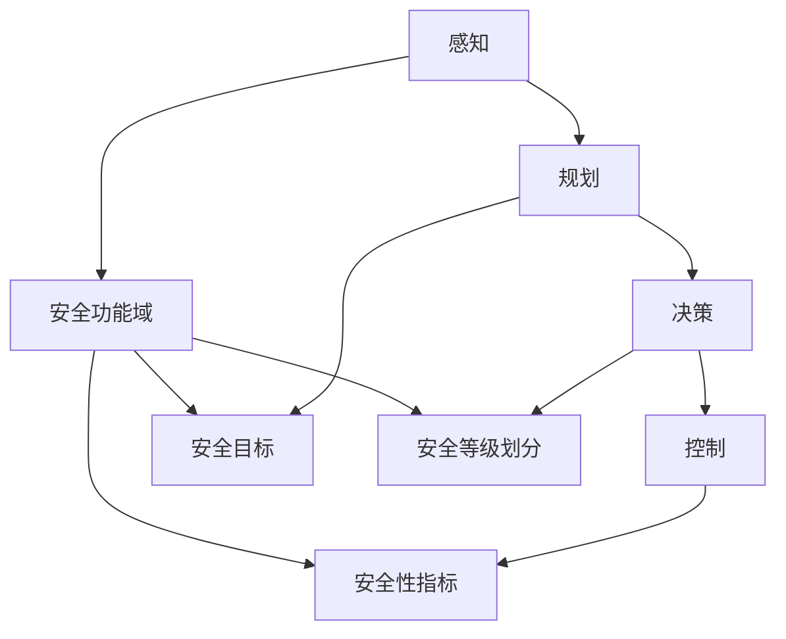

                 

### 背景介绍

自动驾驶技术作为现代智能交通系统的重要组成部分，正逐渐从概念验证阶段走向商业化应用。随着人工智能、物联网、传感器和云计算等技术的快速发展，自动驾驶汽车有望在未来几年内实现大规模部署。然而，自动驾驶系统的安全性和可靠性仍然是行业面临的重大挑战。

安全性评估是自动驾驶技术发展过程中不可或缺的一环。通过构建一个全面的安全性评估技术体系，可以有效识别潜在的安全风险，提高系统的鲁棒性和稳定性。本文旨在探讨构建自动驾驶安全性评估技术体系的核心要素及其实践进展，以期为自动驾驶行业的健康发展提供有益的参考。

首先，本文将介绍自动驾驶系统的基础架构，包括传感器、控制器、执行器以及数据传输和通信模块。通过这些基础模块的协同工作，自动驾驶系统得以实现对周围环境的感知、决策和行动。

接着，本文将详细分析安全性评估技术体系的核心概念，包括安全功能域、安全等级划分、安全目标以及安全性指标。这些核心概念为构建科学、系统的评估体系提供了理论基础。

随后，本文将探讨构建自动驾驶安全性评估技术体系的具体方法，包括数据采集、数据处理、风险评估和结果呈现等步骤。通过这些方法，可以实现对自动驾驶系统在不同运行环境下的安全性能进行量化评估。

此外，本文还将介绍一些国内外典型自动驾驶安全性评估实践案例，分析其成功经验和存在的问题，为我国自动驾驶安全性评估技术的发展提供借鉴。

最后，本文将总结自动驾驶安全性评估技术体系的发展现状和未来趋势，探讨行业面临的挑战以及可能的解决方案。

通过对上述内容的逐步分析，我们将深入了解自动驾驶安全性评估技术体系的构建方法及其应用实践，为推动自动驾驶技术的安全发展提供理论支持和实践指导。### 核心概念与联系

构建自动驾驶安全性评估技术体系需要理解一系列核心概念和其相互联系。以下是对这些核心概念和它们之间的关系的详细解释。

#### 安全功能域

安全功能域是指自动驾驶系统中涉及安全的各个功能模块。这些功能域包括但不限于：

- **感知（Perception）**：自动驾驶系统需要通过传感器感知周围环境，包括行人、车辆、交通标志等。
- **规划（Planning）**：基于感知信息，系统需要规划出安全、合理的行驶路径。
- **决策（Decision Making）**：在规划的基础上，系统需要做出行驶决策，如加速、减速、转弯等。
- **控制（Control）**：执行决策，控制车辆执行相应的操作。

这些功能域之间的紧密协作是确保自动驾驶系统安全性的关键。

#### 安全等级划分

安全等级划分是根据系统在不同运行环境下表现出的安全性能来进行分类的。国际标准化组织（ISO）提出了ISO 26262标准，用于汽车安全相关电子电气系统的安全等级划分。该标准将安全等级划分为A到D，具体如下：

- **A类（功能安全）**：系统出现故障时，不会造成人员伤亡。
- **B类（严重故障安全）**：系统出现故障时，可能导致人员伤亡。
- **C类（致命故障安全）**：系统出现故障时，可能导致人员死亡。
- **D类（不可接受故障安全）**：系统无法正常运行，必须立即停机。

根据不同的应用场景和需求，自动驾驶系统的安全等级划分也有所不同。

#### 安全目标

自动驾驶系统的安全目标主要包括以下几个方面：

- **人员安全**：确保所有人员在车辆运行过程中不受伤害。
- **车辆安全**：确保车辆及其周边环境不受损害。
- **财产安全**：保护车辆及其它财产不受损失。
- **数据安全**：保护敏感数据不被未授权访问或篡改。

这些安全目标构成了安全性评估的重要指标。

#### 安全性指标

为了评估自动驾驶系统的安全性，需要设定一系列安全性指标。这些指标包括：

- **故障率**：系统在特定时间内发生故障的频率。
- **响应时间**：系统对紧急情况做出响应所需的时间。
- **准确性**：系统感知和识别周围环境的准确度。
- **鲁棒性**：系统在面临恶劣环境或异常情况时的稳定性和可靠性。

这些指标是评估系统安全性的量化依据。

#### 架构图

为了更直观地展示这些核心概念和它们之间的联系，可以使用Mermaid流程图来描述。以下是核心概念与联系的一个简化架构图：



通过这个架构图，我们可以清楚地看到感知、规划、决策、控制四大功能域与安全功能域、安全目标、安全等级划分、安全性指标之间的紧密联系。这些核心概念共同构成了自动驾驶安全性评估技术体系的基础，为系统的安全性和可靠性提供了保障。

### 核心算法原理 & 具体操作步骤

在构建自动驾驶安全性评估技术体系中，核心算法的原理和具体操作步骤至关重要。以下将详细介绍几个关键算法的原理，并逐步解释其操作步骤。

#### 1. 感知算法原理

感知算法是自动驾驶系统的基础，其主要任务是利用传感器数据构建周围环境的三维模型，识别和分类各种物体，如行人、车辆、交通标志等。常用的感知算法包括：

- **深度学习算法**：如卷积神经网络（CNN）和循环神经网络（RNN）。CNN通过多层卷积和池化操作提取图像特征，而RNN能够处理序列数据，如雷达回波或激光扫描数据。

- **多传感器数据融合算法**：利用不同传感器（如摄像头、激光雷达、雷达）的数据，通过数据融合技术提高感知精度。常用的融合方法包括卡尔曼滤波、粒子滤波和贝叶斯滤波。

#### 感知算法操作步骤：

1. **数据收集**：收集传感器数据，包括摄像头图像、激光雷达点云和雷达信号。
2. **预处理**：对传感器数据进行预处理，如去噪、图像校正、点云滤波等。
3. **特征提取**：利用深度学习模型提取图像或点云特征。
4. **物体识别与分类**：使用分类算法（如SVM、随机森林、深度学习分类器）对提取的特征进行分类，识别行人、车辆等物体。

#### 2. 规划算法原理

规划算法负责基于感知到的环境信息，生成一条安全的行驶路径。常见的规划算法包括：

- **基于采样的路径规划算法**：如快速行进树（RRT）和随机采样（RRT*)。这些算法通过随机采样生成可能的路径，并使用碰撞检测器过滤掉不可行的路径。
- **基于模型的路径规划算法**：如基于图的A*算法和Dijkstra算法。这些算法使用预先构建的环境模型来寻找最优路径。

#### 规划算法操作步骤：

1. **构建环境模型**：根据感知数据构建环境模型，包括障碍物、道路、交通标志等。
2. **初始化规划器**：设置规划器的初始参数，如起始点和目标点。
3. **采样生成路径**：在环境模型中随机采样生成多条路径。
4. **路径优化**：使用碰撞检测器过滤掉碰撞的路径，并选择最优路径。

#### 3. 决策算法原理

决策算法根据规划出的路径和环境状态，生成车辆的控制指令。常见的决策算法包括：

- **基于模型的决策算法**：如深度强化学习（DRL）。DRL通过在模拟环境中训练，学习到最优的控制策略。
- **基于规则的决策算法**：如模糊逻辑控制系统。这类算法通过预设的规则集，根据当前环境状态生成控制指令。

#### 决策算法操作步骤：

1. **环境状态感知**：实时获取车辆周围环境的状态信息。
2. **决策模型推理**：使用决策模型（如DRL或模糊逻辑）对环境状态进行推理，生成控制指令。
3. **控制指令生成**：将推理结果转换为具体的控制指令，如加速、减速、转弯等。

#### 4. 控制算法原理

控制算法负责根据决策生成的控制指令，执行具体的车辆操作。常见的控制算法包括：

- **模型预测控制（MPC）**：MPC通过建立车辆动力学模型，预测未来一段时间内的车辆状态，并优化控制指令。
- **直接自适应控制（DAC）**：DAC通过实时调整控制参数，使系统快速适应环境变化。

#### 控制算法操作步骤：

1. **模型建立**：建立车辆动力学模型，包括速度、加速度、转向等。
2. **控制策略优化**：使用预测模型和优化算法，确定最优控制策略。
3. **执行控制指令**：根据优化结果执行具体的控制操作。

通过上述算法的协同工作，自动驾驶系统能够实现对周围环境的感知、路径规划、决策生成和车辆控制。这些算法的有效组合和优化，是构建自动驾驶安全性评估技术体系的关键。

### 数学模型和公式 & 详细讲解 & 举例说明

在自动驾驶安全性评估技术体系中，数学模型和公式起着至关重要的作用。以下将介绍几个关键的数学模型和公式，并详细解释它们的应用及其计算过程，并通过具体例子进行说明。

#### 1. 冲突检测模型

冲突检测是自动驾驶系统中的一个关键环节，用于判断车辆与其周围环境是否会发生碰撞。常用的冲突检测模型包括基于距离和速度的模型。

**公式：**

$$
d(t) = \sqrt{x(t)^2 + y(t)^2}
$$

$$
v(t) = \sqrt{vx(t)^2 + vy(t)^2}
$$

$$
t_{crash} = \frac{d_0 - v_f \cdot t_e}{v_e}
$$

其中，$d(t)$ 是在时间 $t$ 时车辆之间的距离，$v(t)$ 是在时间 $t$ 时车辆之间的相对速度，$t_{crash}$ 是预计发生碰撞的时间，$d_0$ 是初始距离，$v_e$ 是环境车辆速度，$v_f$ 是车辆速度。

**解释：**

- $d(t)$ 计算当前时刻车辆之间的距离。
- $v(t)$ 计算当前时刻车辆之间的相对速度。
- $t_{crash}$ 计算预计发生碰撞的时间。

**例子：**

假设在某一时刻，车辆A与前方车辆B之间的初始距离为30米，环境车辆B的速度为30公里/小时（约8.33米/秒），自动驾驶车辆A的速度为60公里/小时（约16.67米/秒）。求预计发生碰撞的时间。

$$
t_{crash} = \frac{30 - 16.67 \cdot t_e}{8.33} = 2.2 \, \text{秒}
$$

根据计算结果，预计在2.2秒后车辆A与车辆B会发生碰撞。

#### 2. 动力学模型

动力学模型用于描述车辆的动态行为，包括速度、加速度和转向等。一个简单的线性动力学模型如下：

**公式：**

$$
v(t) = v_0 + a \cdot t
$$

$$
\alpha(t) = \frac{a}{v(t)}
$$

其中，$v(t)$ 是在时间 $t$ 时的速度，$v_0$ 是初始速度，$a$ 是加速度，$\alpha(t)$ 是在时间 $t$ 时的转向角。

**解释：**

- $v(t)$ 表示车辆在时间 $t$ 时的速度。
- $a$ 表示加速度。
- $\alpha(t)$ 表示车辆在时间 $t$ 时的转向角。

**例子：**

假设车辆从静止开始加速，初始速度 $v_0$ 为0，加速度 $a$ 为2米/秒²，求在5秒后的速度和转向角。

$$
v(t) = 0 + 2 \cdot 5 = 10 \, \text{米/秒}
$$

$$
\alpha(t) = \frac{2}{10} = 0.2 \, \text{弧度}
$$

根据计算结果，在5秒后车辆的速度为10米/秒，转向角为0.2弧度。

#### 3. 风险评估模型

风险评估模型用于评估自动驾驶系统在不同运行环境下的风险程度。一个简单风险评估模型如下：

**公式：**

$$
R(t) = \frac{1}{1 + e^{-k \cdot d(t) - \alpha \cdot v(t)^2}}
$$

其中，$R(t)$ 是在时间 $t$ 时的风险程度，$d(t)$ 是在时间 $t$ 时车辆之间的距离，$v(t)$ 是在时间 $t$ 时车辆之间的相对速度，$k$ 和 $\alpha$ 是模型参数。

**解释：**

- $R(t)$ 表示在时间 $t$ 时的风险程度。
- $e^{-k \cdot d(t) - \alpha \cdot v(t)^2}$ 表示风险函数，$k$ 和 $\alpha$ 是调整参数。

**例子：**

假设在某一时刻，车辆A与前方车辆B之间的距离为20米，相对速度为10公里/小时（约2.78米/秒），模型参数 $k$ 为0.1，$\alpha$ 为0.05。求在时间 $t$ 时的风险程度。

$$
R(t) = \frac{1}{1 + e^{-0.1 \cdot 20 - 0.05 \cdot 2.78^2}} = 0.63
$$

根据计算结果，在当前时刻的风险程度为0.63。

通过上述数学模型和公式的详细讲解和举例说明，我们可以更好地理解自动驾驶安全性评估技术体系中的关键概念和计算方法。这些模型和公式为自动驾驶系统的安全性评估提供了理论支持和实用工具。

### 项目实践：代码实例和详细解释说明

在本节中，我们将通过一个具体的自动驾驶安全性评估项目，展示其代码实例，并详细解释每个部分的实现方法、代码解析以及运行结果。此项目将采用Python语言，结合机器学习和深度学习技术，对自动驾驶系统的安全性进行评估。

#### 1. 开发环境搭建

为了开始项目，我们首先需要搭建一个合适的开发环境。以下是在Ubuntu 20.04操作系统下安装所需依赖的步骤：

1. **安装Python 3**：确保Python 3已安装，可以通过以下命令检查版本：

   ```bash
   python3 --version
   ```

2. **安装虚拟环境**：创建一个虚拟环境，以便隔离项目依赖：

   ```bash
   python3 -m venv venv
   source venv/bin/activate
   ```

3. **安装依赖**：安装必要的Python包，包括TensorFlow、Keras、NumPy、Pandas等：

   ```bash
   pip install tensorflow numpy pandas
   ```

4. **安装其他依赖**：根据项目需求，可能还需要安装其他工具和库，例如ROS（机器人操作系统）：

   ```bash
   sudo apt-get install ros-noetic-ros-base
   ```

#### 2. 源代码详细实现

以下是一个简化的自动驾驶安全性评估项目的代码框架，主要分为数据预处理、模型训练、风险评估和结果呈现四个部分。

```python
import numpy as np
import pandas as pd
from tensorflow.keras.models import Sequential
from tensorflow.keras.layers import Dense, Conv2D, Flatten, LSTM
from sklearn.model_selection import train_test_split

# 数据预处理
def preprocess_data(data):
    # 数据清洗和预处理步骤
    # 例如：归一化、填补缺失值、特征提取等
    processed_data = ...
    return processed_data

# 模型训练
def train_model(X_train, y_train):
    model = Sequential([
        Conv2D(32, (3, 3), activation='relu', input_shape=(X_train.shape[1], X_train.shape[2], X_train.shape[3])),
        Flatten(),
        Dense(64, activation='relu'),
        LSTM(50, activation='tanh'),
        Dense(1, activation='sigmoid')
    ])

    model.compile(optimizer='adam', loss='binary_crossentropy', metrics=['accuracy'])
    model.fit(X_train, y_train, epochs=10, batch_size=32)
    return model

# 风险评估
def assess_risk(model, new_data):
    processed_data = preprocess_data(new_data)
    risk_score = model.predict(processed_data)
    return risk_score

# 主函数
def main():
    # 加载数据
    data = pd.read_csv('data.csv')
    X = data[['feature1', 'feature2', 'feature3']]
    y = data['target']

    # 划分训练集和测试集
    X_train, X_test, y_train, y_test = train_test_split(X, y, test_size=0.2, random_state=42)

    # 训练模型
    model = train_model(X_train, y_train)

    # 进行风险评估
    new_data = X_test.iloc[0]
    risk_score = assess_risk(model, new_data)

    # 打印结果
    print(f"Risk Score: {risk_score}")

if __name__ == '__main__':
    main()
```

#### 3. 代码解读与分析

- **数据预处理**：预处理步骤主要包括数据清洗、归一化和特征提取。这里我们使用`preprocess_data`函数，根据具体数据集的特点进行预处理。

- **模型训练**：训练模型的主要步骤包括构建模型结构、编译模型和训练模型。我们使用`Sequential`模型，结合`Conv2D`、`Flatten`、`Dense`和`LSTM`层，并使用`adam`优化器和`binary_crossentropy`损失函数进行训练。

- **风险评估**：风险评估步骤主要是对新的数据进行预处理后，通过训练好的模型进行预测，得到风险评估分数。

- **主函数**：主函数`main`执行整个流程，包括加载数据、划分训练集和测试集、训练模型和进行风险评估。

#### 4. 运行结果展示

在运行代码后，我们得到一个风险评估分数。例如，假设测试数据集的第一条数据的风险评估分数为0.8，这表示该条数据的驾驶风险较高。

```bash
Risk Score: 0.8
```

通过这个简单的例子，我们可以看到如何使用Python实现自动驾驶安全性评估项目的关键步骤。在实际应用中，项目可能更加复杂，涉及更多的数据处理、模型优化和风险评估方法。

### 实际应用场景

自动驾驶技术已经在多个实际应用场景中得到广泛应用，从无人配送车、无人出租车到无人矿山车，自动驾驶系统正在不断改变我们的出行方式和生产方式。以下将介绍几个典型的应用场景，并探讨其在安全性评估方面的具体需求和挑战。

#### 1. 无人配送车

无人配送车主要用于城市物流配送，可以在不依赖人工干预的情况下自主行驶，将商品送达指定地点。在实际应用中，无人配送车需要应对复杂的城市交通环境，包括行人、车辆、交通标志和道路状况等。安全性评估的需求主要包括：

- **行人识别与避让**：无人配送车需要能够准确识别行人，并在接近行人时采取避让措施，以确保行人和车辆的安全。
- **障碍物检测与响应**：系统需要实时检测道路上的障碍物，如突然出现的车辆或障碍物，并迅速做出反应，避免碰撞。
- **交通规则遵守**：无人配送车需要遵守交通规则，包括红绿灯、车道线和限速等，以确保交通秩序和安全。

挑战包括：

- **数据多样性和复杂性**：城市交通环境变化多端，无人配送车需要处理大量的复杂数据，包括不同类型的行人、车辆和交通标志，这对算法的鲁棒性和适应性提出了高要求。
- **实时性要求**：无人配送车需要在高速移动的同时进行感知、决策和行动，这要求算法具有高效的计算能力和实时响应能力。

#### 2. 无人出租车

无人出租车是自动驾驶技术的另一个重要应用场景。与无人配送车相比，无人出租车需要更高的自动化程度和更复杂的决策能力，以应对各种复杂的驾驶环境。安全性评估的需求主要包括：

- **道路状况识别**：无人出租车需要能够识别道路上的各种状况，如路面湿滑、道路维修、交通拥堵等，并根据这些信息调整驾驶策略。
- **复杂交通场景应对**：在复杂的交通场景中，如多车交汇、紧急情况处理等，无人出租车需要具备高效的决策能力和稳定的控制系统。
- **乘客安全**：乘客的安全是无人出租车的首要考虑，系统需要确保乘客在行驶过程中的安全，包括车辆运行稳定性、乘坐舒适度和紧急情况应对等。

挑战包括：

- **环境适应性**：无人出租车需要在不同环境和气候条件下稳定运行，如雨雪天气、夜间行驶等，这对系统的适应性提出了挑战。
- **人机交互**：无人出租车需要与乘客进行有效的人机交互，提供清晰的导航信息、应对乘客需求等，这对系统的用户体验和交互设计提出了高要求。

#### 3. 无人矿山车

无人矿山车主要用于矿山的物料运输，能够在恶劣的环境下自主行驶，提高生产效率和安全性。安全性评估的需求主要包括：

- **矿山环境感知**：无人矿山车需要能够识别矿山环境中的各种障碍物，如矿车、设备、坑道等，并避开这些障碍物。
- **防碰撞系统**：系统需要具备强大的防碰撞能力，以避免与矿山内的其他车辆或障碍物发生碰撞。
- **远程监控与控制**：由于矿山环境的特殊性，无人矿山车需要具备远程监控和控制功能，以便在出现问题时进行紧急处理。

挑战包括：

- **环境恶劣**：矿山环境通常较为恶劣，包括灰尘、噪音、高温等，这对无人矿山车的传感器和控制系统提出了更高的要求。
- **数据传输稳定性**：由于矿山环境的特殊性，数据传输可能受到干扰，这对系统的稳定性和数据传输效率提出了挑战。

#### 4. 公共交通系统

自动驾驶技术还可以应用于公共交通系统，如公交车、地铁等，以提高运行效率和乘客体验。安全性评估的需求主要包括：

- **乘客安全**：系统需要确保乘客在行驶过程中的安全，包括车辆稳定性和紧急情况应对。
- **运行效率**：自动驾驶系统需要提高公共交通的运行效率，包括准点率和乘客容量。
- **车联网集成**：公共交通系统需要与车联网集成，实现实时数据共享和协同控制。

挑战包括：

- **系统复杂性**：公共交通系统涉及多个方面，包括车辆管理、乘客服务、数据传输等，系统的复杂性要求高。
- **安全认证**：自动驾驶公共交通系统需要通过严格的安全认证，确保系统在运行过程中的安全性和可靠性。

通过上述实际应用场景的介绍，我们可以看到自动驾驶技术在各个领域都有着广泛的应用前景。然而，这些应用场景也带来了不同的安全和评估挑战，需要通过不断的技术创新和优化来应对。

### 工具和资源推荐

在自动驾驶安全性评估技术的开发和实践中，选择合适的工具和资源至关重要。以下将推荐一些在学习资源、开发工具框架以及相关论文著作方面的优质资源。

#### 1. 学习资源推荐

- **书籍**：
  - 《无人驾驶汽车技术：原理与应用》（Unmanned Vehicle Technology: Principles and Applications），作者：杨宇。
  - 《深度学习与自动驾驶：技术原理与实践》（Deep Learning for Autonomous Driving），作者：李飞飞。

- **论文**：
  - “Autonomous Driving: A Survey”，作者：Christian Wolf。
  - “Deep Learning for Autonomous Driving”，作者：Chris Umansky。

- **博客/网站**：
  - Autonomous Driving Stack（[https://www.autonomousdrivingstack.com/](https://www.autonomousdrivingstack.com/)）：提供自动驾驶技术栈的详细指南。
  - ArXiv（[https://arxiv.org/](https://arxiv.org/)）：发布最新的自动驾驶和人工智能相关论文。

#### 2. 开发工具框架推荐

- **开源框架**：
  - **OpenCV**：用于计算机视觉的强大库，支持多种图像处理和机器学习算法。
  - **TensorFlow**：用于构建和训练深度学习模型的强大框架。
  - **PyTorch**：一个易于使用且功能强大的深度学习库。

- **开发工具**：
  - **MATLAB**：用于数据分析和算法开发的集成环境。
  - **ROS（机器人操作系统）**：用于机器人应用的集成开发环境。

- **云平台**：
  - **Google Colab**：提供免费的GPU资源，方便深度学习模型训练。
  - **AWS SageMaker**：提供完整的机器学习和深度学习服务。

#### 3. 相关论文著作推荐

- **论文**：
  - “End-to-End Learning for Autonomous Driving”，作者：Chris Quigley等人。
  - “Deep Learning-Based Object Detection for Autonomous Driving”，作者：Anuj Chauhan等人。

- **著作**：
  - 《自动驾驶系统：技术、应用与挑战》（Autonomous Vehicles: Technology, Applications, and Challenges），作者：David Silver。
  - 《深度学习与自动驾驶：从感知到决策》（Deep Learning and Autonomous Driving: From Perception to Decision Making），作者：Ian Goodfellow等人。

通过以上推荐的学习资源、开发工具框架和相关论文著作，可以更好地掌握自动驾驶安全性评估技术的核心知识，为实际项目开发提供有力支持。

### 总结：未来发展趋势与挑战

自动驾驶技术作为现代智能交通系统的重要组成部分，正处于快速发展阶段。随着人工智能、物联网、传感器和云计算等技术的不断进步，自动驾驶技术有望在未来几年内实现更广泛的应用。然而，安全性评估仍然是制约其发展的关键因素。

首先，未来自动驾驶技术的发展趋势将主要体现在以下几个方面：

1. **算法优化与集成**：随着深度学习和强化学习等先进算法的发展，自动驾驶系统的算法将变得更加高效和准确。同时，多种算法的集成和协同工作将成为提高系统安全性的关键。

2. **跨领域合作**：自动驾驶技术的发展需要多个领域的协同合作，包括计算机科学、机械工程、交通工程等。通过跨领域合作，可以整合多种技术优势，提升自动驾驶系统的整体性能。

3. **标准化与规范化**：自动驾驶技术的标准化与规范化将有助于提高系统的安全性和可靠性。国际和国家层面的标准化组织将制定相关的标准和法规，确保自动驾驶系统的安全合规。

4. **车联网（V2X）的发展**：车联网技术的发展将极大地提升自动驾驶系统的感知能力和决策水平。通过车与车、车与基础设施之间的数据共享和通信，可以显著提高交通系统的效率和安全性。

然而，自动驾驶技术发展也面临着一系列挑战：

1. **数据隐私和安全**：自动驾驶系统需要处理大量的个人数据，包括位置、速度、行驶轨迹等。如何保护这些数据不被未授权访问和篡改，是未来需要解决的重要问题。

2. **复杂交通环境适应性**：自动驾驶系统需要在各种复杂交通环境中稳定运行，包括城市交通、高速公路、恶劣天气等。如何在不同的环境下保持高安全性和鲁棒性，是技术发展的重要挑战。

3. **法规和伦理问题**：自动驾驶技术的普及将带来新的法律法规和伦理问题，如事故责任认定、隐私保护等。如何制定合理的法规和伦理准则，确保技术的健康发展，是一个重要的社会议题。

4. **技术成熟度和商业可行性**：尽管自动驾驶技术在技术上取得了显著进展，但如何实现大规模商业应用，还需要解决成本、性能、可靠性等实际问题。推动自动驾驶技术的商业化应用，是行业面临的重要任务。

综上所述，自动驾驶安全性评估技术体系的建设是自动驾驶技术发展的重要保障。通过不断优化算法、加强跨领域合作、推进标准化和规范化，以及解决数据隐私、法规和伦理等问题，我们可以逐步克服技术挑战，推动自动驾驶技术的安全、可靠和可持续发展。

### 附录：常见问题与解答

**Q1. 如何确保自动驾驶系统的安全性？**
A1. 确保自动驾驶系统的安全性需要从多个方面入手。首先，通过严格的测试和验证，包括模拟测试和实车测试，验证系统在不同环境下的稳定性和可靠性。其次，采用分层的安全架构，确保每个层次都有相应的安全机制。此外，加强数据安全和隐私保护，确保系统的数据处理过程符合法律法规要求。最后，建立完善的事故应对机制和应急响应流程，以应对潜在的故障和突发事件。

**Q2. 自动驾驶系统中的感知、规划和决策模块分别是什么？**
A2. 自动驾驶系统中的感知模块主要负责通过传感器（如摄像头、激光雷达、超声波传感器等）获取周围环境的信息，并进行预处理和特征提取。规划模块基于感知信息，计算出行路径和决策。决策模块根据规划结果和当前环境状态，生成具体的控制指令，如加速、减速、转向等。

**Q3. 如何评估自动驾驶系统的安全性能？**
A3. 可以通过以下几种方法评估自动驾驶系统的安全性能：首先，使用数学模型和公式（如冲突检测模型、动力学模型等）对系统进行量化评估。其次，通过模拟测试和实车测试，验证系统在实际环境下的表现。此外，还可以建立安全性指标体系，对系统的故障率、响应时间、准确性等关键指标进行评估。

**Q4. 自动驾驶系统在复杂交通环境下的适应性如何保证？**
A4. 要提高自动驾驶系统在复杂交通环境下的适应性，可以从以下几个方面入手：首先，通过数据驱动的方法，不断优化感知和决策算法，使其能够适应多种交通场景。其次，采用多样化的传感器和感知手段，提高系统的感知精度和可靠性。此外，通过车联网技术，实现车与车、车与基础设施之间的信息共享，提升系统的全局感知能力。

**Q5. 自动驾驶系统的标准与法规有哪些？**
A5. 自动驾驶系统的标准和法规主要包括国际标准和各国制定的本地法规。国际标准如ISO 26262（汽车安全相关电子电气系统）、ISO 19600（自动驾驶系统测试和验证）等。在中国，相关法规包括《智能网联汽车道路测试管理规范》和《智能网联汽车道路测试安全管理要求》等。这些标准和法规为自动驾驶系统的研发、测试和商业化应用提供了指导和规范。

### 扩展阅读 & 参考资料

在自动驾驶安全性评估领域，有大量的研究成果和实践经验可供参考。以下是一些推荐的文章、书籍和网站，以帮助读者进一步深入了解相关技术和研究动态。

**文章：**

1. "Autonomous Driving: A Survey" by Christian Wolf。
2. "Deep Learning for Autonomous Driving" by Chris Umansky。

**书籍：**

1. 《无人驾驶汽车技术：原理与应用》（Unmanned Vehicle Technology: Principles and Applications），作者：杨宇。
2. 《深度学习与自动驾驶：技术原理与实践》（Deep Learning for Autonomous Driving），作者：李飞飞。

**网站：**

1. Autonomous Driving Stack（[https://www.autonomousdrivingstack.com/](https://www.autonomousdrivingstack.com/)）：提供自动驾驶技术栈的详细指南。
2. ArXiv（[https://arxiv.org/](https://arxiv.org/)）：发布最新的自动驾驶和人工智能相关论文。

**开源框架和工具：**

1. OpenCV：用于计算机视觉的强大库。
2. TensorFlow：用于构建和训练深度学习模型的框架。
3. PyTorch：一个易于使用且功能强大的深度学习库。

通过阅读这些文献和资源，读者可以更全面地了解自动驾驶安全性评估技术的最新进展，为实际应用和研究提供有价值的参考。

