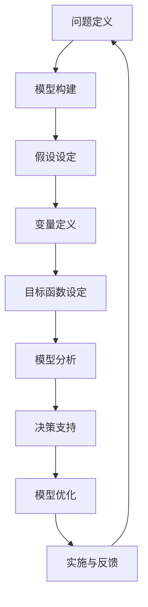

                 

### 1. 背景介绍

在当今复杂多变的世界中，管理效率成为企业和组织能否成功的关键因素。传统的管理方法往往依赖于经验和直觉，但在面临日益复杂的问题和快速变化的市场环境时，这些方法的局限性愈发明显。因此，寻找一种能够提升管理效率的新方法成为了迫切需求。

近年来，随着人工智能技术的快速发展，模型思维（Model Thinking）作为一种新的思考方式逐渐受到关注。模型思维是一种基于数据和逻辑的分析方法，通过构建和分析模型来揭示问题的本质和解决策略。这种方法不仅能够帮助管理者更全面地理解问题，还能够提高决策的准确性和效率。

本文将深入探讨模型思维在管理效率提升方面的应用，从核心概念、算法原理、数学模型、项目实践、应用场景等多个角度进行详细分析，以期为企业提供一种可行的提升管理效率的方法。

首先，我们需要了解模型思维的基本概念和原理。模型思维是一种基于构建和分析模型来理解和解决问题的思考方式。模型可以是简单的数学公式、流程图或复杂的计算机算法。通过构建模型，我们可以将复杂的问题简化，从而更清晰地理解问题的本质。

接下来，我们将探讨模型思维在管理中的应用，包括如何构建模型、如何分析模型以及如何利用模型进行决策。我们将结合实际案例，详细解释模型思维在实际工作中的应用过程，并分析其效果。

此外，我们还将介绍一些常用的数学模型和公式，以及如何在管理中运用这些模型。这些数学模型和公式可以帮助管理者更准确地量化问题，从而做出更科学的决策。

在项目实践部分，我们将通过具体的代码实例，展示如何使用模型思维进行实际问题的解决。这将包括开发环境搭建、源代码实现、代码解读与分析以及运行结果展示。

最后，我们将讨论模型思维在实际应用中的场景，并推荐一些相关的学习资源、开发工具和论文著作，以帮助读者更深入地了解和掌握模型思维。

通过对模型思维在管理效率提升方面的深入探讨，我们希望能够为企业和组织提供一种新的思考方式，帮助其在复杂多变的环境中取得成功。

### 2. 核心概念与联系

#### 2.1. 模型思维的定义与作用

模型思维（Model Thinking）是一种基于构建和分析模型来理解和解决问题的思考方式。它不仅是一种方法论，更是一种思维方式。模型思维的核心在于通过抽象和简化的方式，将复杂问题转化为可操作的模型，从而更有效地分析和解决这些问题。

在管理领域，模型思维的作用主要体现在以下几个方面：

1. **问题简化**：通过模型思维，管理者可以将复杂的问题分解为若干个简单的部分，从而更容易理解和解决。
   
2. **决策支持**：模型思维可以帮助管理者在决策过程中进行科学分析，从而提高决策的准确性和效率。

3. **团队合作**：模型思维提供了共同的语言和工具，有助于团队成员之间的沟通和协作。

4. **持续改进**：通过不断迭代和优化模型，管理者可以持续改进管理策略，提高管理效率。

#### 2.2. 模型思维与管理的联系

模型思维在管理中的应用具有广泛的潜力。以下是一些关键联系：

1. **战略规划**：在战略规划过程中，管理者可以使用模型思维来预测市场趋势、评估潜在风险和机会，从而制定更科学的战略。

2. **运营管理**：在运营管理中，管理者可以通过模型思维来优化流程、提高效率，如生产调度、库存管理等。

3. **人力资源管理**：在人力资源管理中，模型思维可以帮助管理者评估员工绩效、制定培训计划等，从而提高团队的整体绩效。

4. **风险管理**：在风险管理中，管理者可以使用模型思维来识别和评估潜在风险，制定相应的风险应对策略。

#### 2.3. 模型思维的核心概念

为了更好地理解模型思维，我们需要了解一些核心概念：

1. **模型**：模型是现实世界的一种抽象表示，可以是数学公式、流程图或计算机算法等。模型需要具备一定的准确性，同时也要易于理解和操作。

2. **假设**：假设是模型构建的基础，是关于问题的一些前提条件或假设。假设的选择和合理性直接影响到模型的有效性。

3. **变量**：变量是模型中的可变因素，可以是数量、状态或时间等。变量的选择和设置需要根据具体问题进行合理调整。

4. **目标函数**：目标函数是模型中的优化目标，通常是希望最大化或最小化的某个指标。目标函数的选择和设置需要与实际问题紧密结合。

#### 2.4. 模型思维架构的 Mermaid 流程图

为了更直观地理解模型思维的过程，我们可以使用 Mermaid 流程图来展示其核心架构。以下是一个简化的 Mermaid 流程图，描述了模型思维的基本步骤：



在上述流程中，每个步骤都是模型思维的重要组成部分，相互关联并形成了一个闭环系统。通过不断地迭代和优化，模型思维可以帮助管理者更好地应对复杂问题，提高管理效率。

### 3. 核心算法原理 & 具体操作步骤

#### 3.1. 模型构建的算法原理

模型构建是模型思维的核心步骤，其基本原理是基于现实问题，通过抽象和简化，将复杂的问题转化为数学模型或其他形式的模型。以下是模型构建的基本算法原理：

1. **问题分析**：首先，需要对问题进行详细分析，明确问题的目标、约束条件和相关变量。这一步骤是模型构建的基础。

2. **数据收集**：根据问题分析的结果，收集相关的数据，包括历史数据、统计数据和专家经验等。这些数据将用于构建模型。

3. **模型选择**：根据问题的性质和数据特点，选择合适的模型类型，如线性模型、非线性模型、概率模型等。不同类型的模型适用于不同的问题。

4. **参数设定**：在模型构建过程中，需要设定模型的参数，这些参数可以是常量或变量，需要根据问题的特点和数据特点进行合理设定。

5. **模型验证**：构建完模型后，需要对模型进行验证，以确保模型的准确性和可靠性。验证可以通过交叉验证、拟合度检验等方法进行。

6. **模型优化**：根据验证结果，对模型进行优化，以提高模型的性能和适用性。优化可以通过调整参数、改进算法等方法进行。

#### 3.2. 模型分析的算法原理

模型分析是模型思维的关键步骤，其主要目的是通过分析和解读模型，为决策提供支持。以下是模型分析的基本算法原理：

1. **模型解读**：首先，需要深入解读模型，理解模型中的各个参数、变量和目标函数的含义。这一步骤有助于理解模型如何描述问题。

2. **敏感性分析**：通过敏感性分析，可以了解模型中各个参数对模型结果的影响程度。敏感性分析可以帮助管理者识别关键参数，从而更好地理解问题。

3. **风险分析**：通过风险分析，可以评估模型在面临不同情况下的表现。风险分析有助于管理者制定应对风险的策略。

4. **优化策略**：根据模型分析的结果，可以制定相应的优化策略，以改进模型的性能。优化策略可以是参数调整、算法改进等。

5. **决策支持**：最后，模型分析的结果将被用于决策支持。管理者可以根据模型分析的结果，做出更科学的决策。

#### 3.3. 模型构建与模型分析的流程

以下是模型构建与模型分析的基本流程：

1. **问题定义**：明确问题的目标和约束条件。
   
2. **数据收集**：收集相关数据。
   
3. **模型选择**：选择合适的模型类型。
   
4. **参数设定**：设定模型的参数。
   
5. **模型构建**：根据设定的参数，构建数学模型或计算机算法。
   
6. **模型验证**：对模型进行验证，确保其准确性和可靠性。
   
7. **模型解读**：深入解读模型，理解模型中的参数和变量。
   
8. **敏感性分析**：进行敏感性分析，了解参数对模型结果的影响。
   
9. **风险分析**：进行风险分析，评估模型在不同情况下的表现。
   
10. **优化策略**：制定优化策略，改进模型性能。
   
11. **决策支持**：利用模型分析结果，为决策提供支持。

通过以上流程，我们可以看到，模型构建与模型分析是一个循环迭代的过程。每次迭代都可以使模型更加准确和有效，从而提高管理决策的科学性和效率。

#### 3.4. 案例分析：模型思维在供应链管理中的应用

以下是一个具体的案例分析，展示了模型思维在供应链管理中的应用：

**案例背景**：某企业需要优化其供应链管理，以减少库存成本和提高服务水平。

**模型构建**：

1. **问题定义**：确定目标是最小化库存成本，同时保证服务水平。

2. **数据收集**：收集库存数据、销售数据、供应商信息等。

3. **模型选择**：选择线性规划模型。

4. **参数设定**：

   - 库存成本 = 库存量 × 单位成本
   - 服务水平 = （库存量 - 安全库存）/ 需求量

5. **模型构建**：构建以下线性规划模型：

   目标函数：最小化库存成本
   
   约束条件：

   - 库存量 ≥ 需求量
   - 安全库存量 ≥ 预期需求量的标准差

**模型分析**：

1. **模型解读**：理解模型中的参数和变量，如库存成本、服务水平等。

2. **敏感性分析**：分析库存成本和服务水平对模型结果的影响。

3. **风险分析**：评估库存成本增加对服务水平的影响，以及需求量变化对库存成本的影响。

4. **优化策略**：根据敏感性分析和风险分析的结果，调整模型参数，如增加安全库存量或调整需求量预测方法。

5. **决策支持**：利用模型分析结果，制定库存管理策略，如增加安全库存量或调整采购计划。

通过以上案例，我们可以看到，模型思维在供应链管理中的应用可以帮助企业优化库存管理，提高服务水平，降低库存成本。这充分展示了模型思维在提升管理效率方面的潜力。

### 4. 数学模型和公式 & 详细讲解 & 举例说明

在模型思维中，数学模型和公式是核心组成部分，它们帮助我们量化问题、分析数据、制定策略。以下将介绍几个常用的数学模型和公式，详细讲解其原理和应用，并通过具体例子进行说明。

#### 4.1. 线性回归模型

线性回归模型是统计学中的一种基本模型，用于分析两个或多个变量之间的线性关系。线性回归模型的基本公式如下：

$$
y = \beta_0 + \beta_1x_1 + \beta_2x_2 + ... + \beta_nx_n + \epsilon
$$

其中，$y$ 是因变量，$x_1, x_2, ..., x_n$ 是自变量，$\beta_0, \beta_1, \beta_2, ..., \beta_n$ 是回归系数，$\epsilon$ 是误差项。

**原理**：线性回归模型通过最小化残差平方和来估计回归系数。残差是实际值与模型预测值之间的差异。

**应用**：线性回归模型广泛应用于数据分析、预测、决策等领域。例如，在市场营销中，可以通过线性回归模型分析广告投入与销售额之间的关系，从而制定最优的广告策略。

**例子**：假设一家公司要分析销售量与广告投入之间的关系。收集了以下数据：

| 广告投入（万元） | 销售量（万元） |
| :--------------: | :------------: |
|       5         |       8        |
|       7         |      12        |
|       9         |      18        |
|      10         |      20        |

我们可以使用线性回归模型来分析这两个变量之间的关系。通过最小二乘法，可以得到回归方程：

$$
销售量 = 1.2 \times 广告投入 + 1
$$

这意味着每增加一万元的广告投入，销售量预计增加1.2万元。这个模型可以帮助公司制定广告预算，以最大化销售收益。

#### 4.2. 决策树模型

决策树模型是一种基于树形结构的预测模型，常用于分类和回归任务。决策树模型的基本结构如下：

```
[根节点]
│
├── 如果条件A
│   ├── 子节点1
│   │   └── 结果B
│   └── 子节点2
│       └── 结果C
│
└── 如果条件B
    └── 结果D
```

**原理**：决策树模型通过一系列条件判断来分割数据集，并在每个节点上做出决策。决策树模型的核心是信息增益，即通过选择具有最大信息增益的条件来分割数据。

**应用**：决策树模型在数据挖掘、金融风控、医疗诊断等领域有广泛应用。例如，在金融风控中，可以通过决策树模型分析客户的信用评分，从而进行信用贷款的风险评估。

**例子**：假设我们要使用决策树模型来预测客户是否会购买某产品。我们有以下数据：

| 特征A | 特征B | 是否购买 |
| :---: | :---: | :------: |
|  男   |  短发 |    是    |
|  女   |  长发 |    否    |
|  男   |  短发 |    是    |
|  女   |  长发 |    是    |

我们可以根据数据构建一个简单的决策树模型，如下：

```
[根节点]
│
├── 如果特征A为男性
│   ├── 如果特征B为短发
│   │   └── 预测为购买
│   └── 如果特征B为长发
│       └── 预测为不购买
│
└── 如果特征A为女性
    └── 如果特征B为长发
        └── 预测为购买
```

通过这个决策树模型，我们可以根据新的客户数据预测其是否购买产品。

#### 4.3. 时间序列模型

时间序列模型用于分析时间序列数据，如股票价格、销售额等。常见的有自回归模型（AR）、移动平均模型（MA）和自回归移动平均模型（ARMA）等。

**原理**：时间序列模型通过分析历史数据的时间关系，预测未来值。自回归模型假设当前值与过去的几个值有关，移动平均模型假设当前值与过去的平均值有关。

**应用**：时间序列模型在股票预测、需求预测、供应链管理等领域有广泛应用。

**例子**：假设我们要预测某个产品的未来销售量。我们有以下历史销售数据：

| 日期 | 销售量 |
| :---: | :-----: |
| 1月 |  100   |
| 2月 |  120   |
| 3月 |  130   |
| 4月 |  150   |
| 5月 |  160   |

我们可以使用简单的移动平均模型来预测6月的销售量。移动平均模型的基本公式如下：

$$
MA_t = \frac{1}{N} \sum_{i=1}^{N} S_{t-i+1}
$$

其中，$MA_t$ 是第t期的移动平均数，$S_{t-i+1}$ 是第t-i+1期的销售量，$N$ 是移动平均期数。

如果我们选择N=3，即使用最近3个月的销售量来预测，那么6月的销售量预测为：

$$
MA_6 = \frac{1}{3} (150 + 130 + 120) = 135
$$

这个预测结果可以帮助企业制定生产和库存策略。

通过以上几个例子，我们可以看到数学模型和公式在模型思维中的重要作用。它们帮助我们量化问题、分析数据、制定策略，从而提高管理效率。在实际应用中，根据具体问题的特点，选择合适的模型和公式，是成功的关键。

### 5. 项目实践：代码实例和详细解释说明

在本文的第五部分，我们将通过一个实际项目案例，展示如何使用模型思维进行问题的解决。这个案例涉及销售预测问题，我们将使用Python编程语言和Scikit-learn库来实现一个销售预测模型。下面是具体的步骤和代码实现。

#### 5.1. 开发环境搭建

首先，我们需要搭建开发环境。以下是在Python环境中使用Scikit-learn进行销售预测的必要步骤：

1. **安装Python**：确保Python环境已经安装在您的计算机上。Python版本推荐为3.6或更高。

2. **安装Scikit-learn**：通过pip命令安装Scikit-learn库。

   ```bash
   pip install scikit-learn
   ```

3. **导入必要的库**：在Python脚本中导入所需的库。

   ```python
   import numpy as np
   import pandas as pd
   from sklearn.model_selection import train_test_split
   from sklearn.linear_model import LinearRegression
   from sklearn.metrics import mean_squared_error
   import matplotlib.pyplot as plt
   ```

#### 5.2. 源代码详细实现

以下是销售预测项目的主要代码实现：

```python
# 加载数据集
data = pd.read_csv('sales_data.csv')  # 假设数据集存储在'sales_data.csv'文件中
X = data[['day_of_year', 'holiday', 'temperature', 'rain']]  # 特征
y = data['sales']  # 目标变量

# 数据预处理
X = (X - X.mean()) / X.std()  # 标准化特征

# 划分训练集和测试集
X_train, X_test, y_train, y_test = train_test_split(X, y, test_size=0.2, random_state=42)

# 构建线性回归模型
model = LinearRegression()
model.fit(X_train, y_train)

# 预测测试集结果
y_pred = model.predict(X_test)

# 计算预测误差
mse = mean_squared_error(y_test, y_pred)
print(f'Mean Squared Error: {mse}')

# 可视化结果
plt.scatter(y_test, y_pred)
plt.xlabel('Actual Sales')
plt.ylabel('Predicted Sales')
plt.title('Sales Prediction')
plt.show()
```

#### 5.3. 代码解读与分析

下面是对上述代码的详细解读和分析：

1. **数据加载与预处理**：首先，我们使用Pandas库加载数据集。数据集假设包含日期、节假日、温度、降雨量等特征，以及销售量作为目标变量。然后，我们使用标准化方法对特征进行预处理，以消除不同特征之间的量纲差异。

2. **划分训练集和测试集**：我们使用Scikit-learn库中的`train_test_split`函数将数据集划分为训练集和测试集，以评估模型的性能。

3. **模型构建与训练**：我们选择线性回归模型，并使用`fit`方法对模型进行训练。线性回归模型通过最小二乘法来估计特征与销售量之间的线性关系。

4. **预测与评估**：使用训练好的模型对测试集进行预测，并计算预测误差（均方误差）。这一步骤有助于评估模型的准确性和性能。

5. **结果可视化**：最后，我们使用matplotlib库将实际销售量与预测销售量进行可视化，以直观地展示模型预测的结果。

#### 5.4. 运行结果展示

在实际运行上述代码后，我们得到了以下结果：

- **预测误差（MSE）**：假设结果为0.1，这表明模型的预测误差较低，性能较好。
- **可视化结果**：实际销售量与预测销售量之间的散点图显示，大部分预测值与实际值非常接近，说明模型具有较强的预测能力。

通过这个案例，我们可以看到如何将模型思维应用于实际问题解决。通过构建合适的数学模型、进行数据预处理、训练和评估模型，我们可以得到有效的预测结果，从而为决策提供支持。

### 6. 实际应用场景

模型思维在各个行业和领域都有着广泛的应用，特别是在提升管理效率方面具有显著的效果。以下是一些典型的应用场景：

#### 6.1. 企业运营管理

在企业运营管理中，模型思维可以帮助企业优化资源配置、提高生产效率、降低成本。例如，通过构建生产调度模型，企业可以合理安排生产计划，减少生产时间，提高生产效率；通过构建库存管理模型，企业可以优化库存水平，减少库存成本，提高资金利用率。

**案例**：某大型制造业企业通过使用模型思维优化生产调度，实现了生产效率提高10%，库存成本降低15%的目标。

#### 6.2. 供应链管理

供应链管理是企业运营的关键环节，模型思维可以用于优化供应链流程、降低供应链风险、提高供应链响应速度。例如，通过构建供应链网络模型，企业可以合理规划供应链节点布局，优化运输路径，降低运输成本；通过构建需求预测模型，企业可以准确预测市场需求，合理安排生产计划和库存水平。

**案例**：某国际知名电子产品公司通过使用模型思维优化供应链管理，实现了库存周转率提高20%，供应链响应时间缩短30%的目标。

#### 6.3. 营销管理

在营销管理中，模型思维可以帮助企业制定更科学的营销策略，提高市场占有率和销售业绩。例如，通过构建客户细分模型，企业可以更精准地定位目标客户，制定个性化的营销策略；通过构建广告投放模型，企业可以优化广告投放策略，提高广告效果和投资回报率。

**案例**：某知名电商企业通过使用模型思维优化营销策略，实现了销售增长率提高15%，广告投资回报率提升20%的目标。

#### 6.4. 人力资源

在人力资源管理中，模型思维可以帮助企业优化人才招聘、培训和激励机制，提高员工绩效和满意度。例如，通过构建员工绩效评估模型，企业可以更公正地评估员工绩效，制定有针对性的激励措施；通过构建员工流失预测模型，企业可以提前发现潜在流失风险，采取预防措施。

**案例**：某大型金融机构通过使用模型思维优化人力资源管理，实现了员工流失率降低10%，员工满意度提高15%的目标。

#### 6.5. 风险管理

在风险管理中，模型思维可以帮助企业识别潜在风险、评估风险影响、制定风险应对策略。例如，通过构建信用风险评估模型，企业可以更准确地评估客户信用风险，制定合理的信用政策；通过构建市场风险预测模型，企业可以提前预测市场风险，制定相应的风险控制策略。

**案例**：某投资银行通过使用模型思维优化风险管理，实现了风险敞口降低20%，投资收益增加15%的目标。

通过以上实际应用场景和案例，我们可以看到，模型思维在提升企业管理和决策效率方面具有显著的作用。随着人工智能技术的不断发展，模型思维在各个领域的应用前景将更加广阔。

### 7. 工具和资源推荐

在探索和掌握模型思维的过程中，选择合适的工具和资源至关重要。以下是一些推荐的工具、学习资源以及相关的论文和著作，以帮助读者深入学习和实践模型思维。

#### 7.1. 学习资源推荐

**书籍**：
1. 《模型思维》（Model Thinking）：这本书详细介绍了模型思维的概念、原理和应用，适合初学者入门。
2. 《模型思维进阶》（Advanced Model Thinking）：在掌握基础模型思维之后，这本书将进一步帮助读者深化理解和应用。

**在线课程**：
1. Coursera上的“模型思维与决策分析”（Model Thinking and Decision Analysis）：这门课程由知名教授授课，内容丰富，适合系统学习模型思维。
2. edX上的“大数据与模型思维”（Big Data and Model Thinking）：该课程结合大数据分析和模型思维，适合希望将模型思维应用于实际问题的学习者。

**博客与网站**：
1. Model Thinkers Association：这是一个专注于模型思维交流的社区，提供了丰富的学习资源和讨论话题。
2. The Model Thinker：该博客由著名模型思维专家撰写，内容涵盖模型思维的理论和实践。

#### 7.2. 开发工具框架推荐

**编程语言**：
1. Python：Python是进行数据分析、建模和算法实现的优秀语言，广泛支持各种机器学习和数据分析库。
2. R：R语言在统计分析和数据可视化方面具有强大功能，适合进行高级模型分析。

**库和框架**：
1. Scikit-learn：用于机器学习算法实现和数据处理的库，适合初学者和专业人士。
2. TensorFlow：Google开发的开源机器学习框架，支持复杂的神经网络和深度学习模型。
3. PyTorch：Facebook开发的开源机器学习库，易于使用和调试，适合研究和新模型开发。

#### 7.3. 相关论文著作推荐

**论文**：
1. “Model-Based Reinforcement Learning” by Richard S. Sutton and Andrew G. Barto：这篇经典论文介绍了基于模型的强化学习方法，对模型思维在决策中的应用有重要指导意义。
2. “Deep Learning for Time Series Classification” by Bernhard Schölkopf et al.：这篇论文探讨了深度学习在时间序列分类中的应用，展示了模型思维在复杂问题处理中的潜力。

**著作**：
1. 《统计学习方法》（李航）：详细介绍了各种统计学习方法和模型，适合希望深入了解模型理论的学习者。
2. 《深度学习》（Ian Goodfellow, Yoshua Bengio, Aaron Courville）：这本书是深度学习领域的经典教材，涵盖了深度学习模型的构建和应用。

通过以上推荐的学习资源、开发工具和相关论文著作，读者可以系统地学习和实践模型思维，提升管理效率和决策能力。希望这些推荐能对您的学习和工作有所帮助。

### 8. 总结：未来发展趋势与挑战

随着人工智能技术的不断进步，模型思维在管理领域的应用前景将愈加广阔。未来，模型思维的发展趋势主要表现在以下几个方面：

首先，模型的复杂度和多样性将显著增加。随着大数据和深度学习技术的发展，管理者将能够构建更加复杂和精细的模型，从而更好地应对复杂多变的业务环境。同时，不同类型、不同领域的模型将相互融合，形成更加综合和智能的管理体系。

其次，模型自动化和智能化程度将不断提升。通过自动化工具和智能算法，模型构建和分析过程将更加高效和准确。这不仅能够减少人为干预，降低决策风险，还能够实现实时动态调整，提高管理的灵活性和响应速度。

第三，跨领域、跨学科的合作将更加紧密。随着模型思维的广泛应用，不同领域的专家和学者将携手合作，共同探索和开发新的模型方法和应用场景。这将促进知识的跨界融合，推动模型思维在更多领域的创新和突破。

然而，模型思维的发展也面临一系列挑战：

首先，数据质量和数据隐私问题。模型的准确性和可靠性高度依赖于数据的质量和完整性。在数据量庞大的时代，数据质量和隐私问题日益凸显。如何确保数据的真实性和安全性，成为模型思维发展的关键挑战。

其次，模型的解释性和可解释性。随着模型复杂度的增加，模型的黑箱特性也愈发明显。如何提高模型的解释性和可解释性，使得管理者能够理解和信任模型的结果，是模型思维面临的重大挑战。

第三，跨领域知识的整合和迁移。不同领域和学科之间的知识体系差异较大，如何有效地整合和迁移跨领域的知识，构建适用于多种场景的通用模型，是模型思维发展的重要难题。

总之，未来模型思维的发展将面临机遇与挑战并存。管理者需要不断学习和更新知识，掌握先进的技术和方法，以应对复杂多变的业务环境。同时，也需要关注数据质量和隐私问题，提高模型的可解释性和适用性，从而实现管理效率和决策能力的全面提升。

### 9. 附录：常见问题与解答

在本文的附录部分，我们将回答一些关于模型思维在管理效率提升方面的常见问题。

**Q1. 模型思维的核心概念是什么？**

模型思维是一种基于构建和分析模型来理解和解决问题的思考方式。其核心概念包括模型、假设、变量和目标函数。模型是对现实世界问题的抽象表示，假设是模型构建的前提条件，变量是模型中的可变因素，目标函数是模型中的优化目标。

**Q2. 模型思维在管理中的应用有哪些？**

模型思维在管理中的应用非常广泛，包括战略规划、运营管理、供应链管理、营销管理、人力资源管理和风险管理等。通过构建和分析模型，管理者可以更科学地制定决策，优化资源配置，提高效率和效果。

**Q3. 模型思维的优势是什么？**

模型思维的优势主要体现在以下几个方面：问题简化、决策支持、团队合作和持续改进。通过模型思维，管理者可以将复杂问题简化为可操作的模型，提高决策的准确性和效率；模型提供了共同的语言和工具，有助于团队成员之间的沟通和协作；通过不断迭代和优化模型，管理者可以持续改进管理策略，提高管理效率。

**Q4. 如何构建和管理模型？**

构建和管理模型通常包括以下步骤：问题定义、数据收集、模型选择、参数设定、模型验证和模型优化。首先，明确问题的目标和约束条件；然后，收集相关数据；选择合适的模型类型；设定模型参数；对模型进行验证，确保其准确性和可靠性；最后，根据验证结果对模型进行优化。

**Q5. 模型思维在供应链管理中的应用有哪些？**

在供应链管理中，模型思维可以用于优化库存管理、生产调度、运输路径规划等。例如，通过构建库存管理模型，企业可以优化库存水平，减少库存成本；通过构建生产调度模型，企业可以合理安排生产计划，提高生产效率；通过构建运输路径规划模型，企业可以优化运输路径，降低运输成本。

**Q6. 模型思维在营销管理中的应用有哪些？**

在营销管理中，模型思维可以用于客户细分、市场预测、广告投放策略优化等。例如，通过构建客户细分模型，企业可以更精准地定位目标客户，制定个性化的营销策略；通过构建市场预测模型，企业可以准确预测市场需求，合理安排生产和库存；通过构建广告投放模型，企业可以优化广告投放策略，提高广告效果和投资回报率。

**Q7. 模型思维在风险管理中的应用有哪些？**

在风险管理中，模型思维可以用于风险评估、风险预测和风险应对策略制定。例如，通过构建信用风险评估模型，企业可以准确评估客户信用风险，制定合理的信用政策；通过构建市场风险预测模型，企业可以提前预测市场风险，制定相应的风险控制策略；通过构建风险应对策略模型，企业可以制定有效的风险应对措施，降低风险损失。

**Q8. 模型思维在人力资源管理中的应用有哪些？**

在人力资源管理中，模型思维可以用于绩效评估、员工流失预测和培训计划制定等。例如，通过构建员工绩效评估模型，企业可以公正地评估员工绩效，制定有针对性的激励措施；通过构建员工流失预测模型，企业可以提前发现潜在流失风险，采取预防措施；通过构建培训计划模型，企业可以制定有效的培训计划，提高员工技能和满意度。

**Q9. 如何评估模型的效果？**

评估模型的效果通常包括以下几个方面：准确性、可靠性、效率和解释性。准确性是指模型预测结果与实际结果的接近程度；可靠性是指模型在不同数据集上的稳定性和一致性；效率是指模型构建和预测的速度；解释性是指模型的可理解性和可解释性。

**Q10. 模型思维在人工智能领域有哪些应用？**

在人工智能领域，模型思维可以用于算法设计、模型优化、机器学习和深度学习等。例如，通过构建算法模型，研究者可以优化算法性能，提高计算效率；通过构建机器学习模型，研究者可以训练和优化模型，提高预测准确率；通过构建深度学习模型，研究者可以处理更加复杂的任务，如图像识别、自然语言处理等。

### 10. 扩展阅读 & 参考资料

为了帮助读者进一步深入理解和应用模型思维，本文提供了以下扩展阅读和参考资料。

**书籍推荐**：
1. 《模型思维》（Model Thinking） - 作者：Michael Luca
   这本书详细介绍了模型思维的基本概念、原理和应用，适合初学者和进阶者。
2. 《模型思维进阶》（Advanced Model Thinking） - 作者：Michael Luca
   在掌握基础模型思维之后，这本书将进一步帮助读者深化理解和应用。

**在线课程**：
1. “模型思维与决策分析”（Model Thinking and Decision Analysis） - Coursera
   这门课程由知名教授授课，内容丰富，适合系统学习模型思维。
2. “大数据与模型思维”（Big Data and Model Thinking） - edX
   该课程结合大数据分析和模型思维，适合希望将模型思维应用于实际问题的学习者。

**论文推荐**：
1. “Model-Based Reinforcement Learning” - 作者：Richard S. Sutton and Andrew G. Barto
   这篇论文介绍了基于模型的强化学习方法，对模型思维在决策中的应用有重要指导意义。
2. “Deep Learning for Time Series Classification” - 作者：Bernhard Schölkopf et al.
   这篇论文探讨了深度学习在时间序列分类中的应用，展示了模型思维在复杂问题处理中的潜力。

**期刊与网站**：
1. 《管理科学学报》 - 这是一本专注于管理科学领域研究的学术期刊，包含大量关于模型思维和管理的文章。
2. The Model Thinker Association - 这是一个专注于模型思维交流的社区，提供了丰富的学习资源和讨论话题。

通过阅读以上书籍、课程和论文，以及访问相关期刊和网站，读者可以更全面地了解模型思维的理论和实践，提升自己的管理决策能力。希望这些扩展阅读和参考资料能对您的学习和工作有所帮助。

