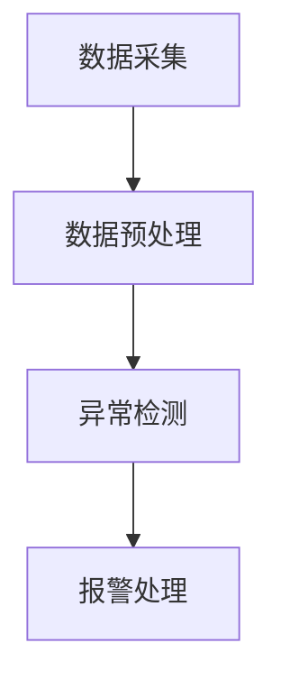
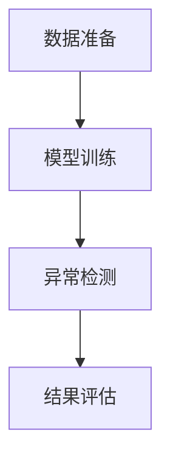
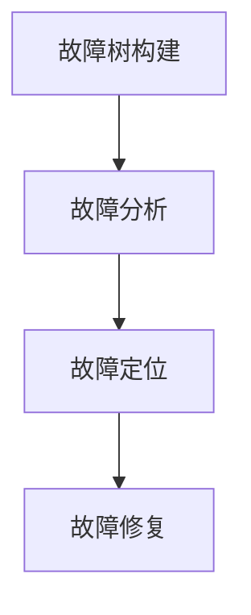

                 

### 文章标题

模型监控与故障诊断原理与代码实战案例讲解

> 关键词：模型监控，故障诊断，深度学习，实时监控，算法实现，实践案例

> 摘要：本文将深入探讨模型监控与故障诊断的核心原理，包括实时监控、异常检测、故障定位等技术。通过具体的代码实战案例，将详细介绍如何实现这些技术，并对运行结果进行详细分析，旨在帮助读者全面掌握模型监控与故障诊断的实践方法。

### 1. 背景介绍

在当今人工智能飞速发展的时代，深度学习模型在各个领域得到了广泛应用。然而，随着模型的复杂性和数据量的增加，如何确保模型的稳定运行和准确预测成为一个重要问题。模型监控与故障诊断技术在此时应运而生，旨在实时监测模型的运行状态，及时发现潜在问题并进行诊断，从而保障模型的可靠性和有效性。

模型监控与故障诊断的核心任务是确保模型在实际应用中能够持续稳定地运行。具体来说，它包括以下几个方面的内容：

1. **实时监控**：通过实时数据流，对模型的输入、输出以及中间过程进行持续监测，及时发现异常情况。
2. **异常检测**：利用统计模型、机器学习等方法，对模型输出结果进行异常检测，识别出不符合预期的异常值。
3. **故障定位**：通过故障树分析、故障回溯等技术，对异常原因进行深入分析，准确定位故障源头。

本文将围绕上述任务，详细探讨模型监控与故障诊断的原理和方法，并通过具体的代码实战案例，展示如何实现这些技术。希望通过本文的讲解，能够帮助读者深入了解模型监控与故障诊断的核心内容，并掌握其实践方法。

### 2. 核心概念与联系

#### 2.1 实时监控

实时监控是模型监控与故障诊断的基础，它通过持续地收集模型的运行数据，实现对模型状态的全天候监测。实时监控的核心目标是及时发现异常情况，确保模型的稳定运行。

**实时监控流程：**

1. **数据采集**：通过传感器、日志文件、API等方式，持续采集模型的输入、输出以及中间过程数据。
2. **数据预处理**：对采集到的数据进行清洗、标准化等预处理操作，确保数据的准确性和一致性。
3. **异常检测**：利用统计模型、机器学习等方法，对预处理后的数据进行异常检测，识别出潜在的异常情况。
4. **报警处理**：一旦检测到异常情况，立即触发报警机制，通知相关人员进行处理。

**实时监控流程图：**



#### 2.2 异常检测

异常检测是模型监控与故障诊断的关键环节，它通过识别模型输出中的异常值，实现对模型运行状态的实时监测。异常检测的方法多样，主要包括统计方法、机器学习方法等。

**异常检测方法：**

1. **统计方法**：基于统计学原理，通过计算数据的统计指标（如均值、方差等），识别出与正常值相差较大的异常值。
2. **机器学习方法**：利用历史数据，通过构建分类模型或回归模型，对模型输出进行预测，识别出与预测结果不一致的异常值。

**异常检测流程：**

1. **数据准备**：收集并预处理历史数据，用于训练异常检测模型。
2. **模型训练**：利用历史数据，训练统计模型或机器学习模型，构建异常检测模型。
3. **异常检测**：对实时数据输入异常检测模型，识别出异常值。
4. **结果评估**：对异常检测结果进行评估，调整模型参数，优化检测效果。

**异常检测流程图：**



#### 2.3 故障定位

故障定位是模型监控与故障诊断的最终目标，它通过分析异常情况，准确定位故障源头，为故障修复提供依据。故障定位的方法多样，主要包括故障树分析、故障回溯等。

**故障定位方法：**

1. **故障树分析**：通过构建故障树，对模型运行过程中的各个节点进行分析，识别出可能导致故障的原因。
2. **故障回溯**：通过回溯异常数据的运行轨迹，分析异常数据的前后关联关系，准确定位故障源头。

**故障定位流程：**

1. **故障树构建**：根据模型结构和运行过程，构建故障树。
2. **故障分析**：利用故障树，对异常情况进行逐层分析，识别出可能导致故障的原因。
3. **故障定位**：通过故障分析，准确定位故障源头。
4. **故障修复**：根据故障定位结果，制定故障修复方案，确保模型正常运行。

**故障定位流程图：**



通过上述核心概念的介绍，我们可以看到，模型监控与故障诊断是一个系统性的工程，它需要结合实时监控、异常检测和故障定位等技术，实现对模型的全方位监控和管理。在实际应用中，这些技术可以相互补充，共同保障模型的稳定运行和准确预测。

### 3. 核心算法原理 & 具体操作步骤

在模型监控与故障诊断中，核心算法起到了关键作用。本节将详细讲解常用的核心算法原理，并介绍具体操作步骤。

#### 3.1 实时监控算法

实时监控算法的核心目标是实现对模型运行状态的持续监测。常用的实时监控算法包括统计监控算法和机器学习监控算法。

**统计监控算法：**

统计监控算法基于统计学原理，通过计算模型输入、输出及中间过程的统计指标，实现对模型状态的监控。具体步骤如下：

1. **数据采集**：从模型运行过程中采集输入、输出及中间过程数据。
2. **数据预处理**：对采集到的数据进行清洗、标准化等预处理操作。
3. **统计指标计算**：计算预处理后的数据的统计指标，如均值、方差、标准差等。
4. **阈值设定**：根据业务需求和模型特性，设定统计指标的阈值。
5. **异常检测**：将计算出的统计指标与阈值进行比较，识别出异常情况。

**机器学习监控算法：**

机器学习监控算法通过训练机器学习模型，实现对模型运行状态的实时监测。具体步骤如下：

1. **数据准备**：收集并预处理历史数据，用于训练机器学习模型。
2. **模型训练**：利用历史数据，训练机器学习模型，如回归模型、分类模型等。
3. **模型部署**：将训练好的模型部署到模型监控系统中，进行实时监控。
4. **异常检测**：将实时采集的数据输入模型，根据模型预测结果，识别出异常情况。

#### 3.2 异常检测算法

异常检测算法是模型监控与故障诊断的核心环节，主要任务是识别模型输出中的异常值。常见的异常检测算法包括基于统计的方法和基于机器学习的方法。

**基于统计的方法：**

基于统计的方法通过计算数据分布特征，识别出异常值。具体步骤如下：

1. **数据预处理**：对输入数据进行清洗、标准化等预处理操作。
2. **数据分布分析**：计算数据的分布特征，如均值、方差、标准差等。
3. **阈值设定**：根据数据分布特征，设定异常值的阈值。
4. **异常检测**：将输入数据与阈值进行比较，识别出异常值。

**基于机器学习的方法：**

基于机器学习的方法通过训练分类模型，实现对异常值的识别。具体步骤如下：

1. **数据准备**：收集并预处理历史数据，用于训练分类模型。
2. **模型训练**：利用历史数据，训练分类模型，如逻辑回归、支持向量机等。
3. **模型部署**：将训练好的模型部署到异常检测系统中，进行实时检测。
4. **异常检测**：将实时数据输入模型，根据模型预测结果，识别出异常值。

#### 3.3 故障定位算法

故障定位算法通过分析异常情况，准确定位故障源头。常见的故障定位算法包括故障树分析和故障回溯。

**故障树分析：**

故障树分析通过构建故障树，对模型运行过程中的各个节点进行分析，识别出可能导致故障的原因。具体步骤如下：

1. **故障树构建**：根据模型结构和运行过程，构建故障树。
2. **故障分析**：利用故障树，对异常情况进行逐层分析，识别出可能导致故障的原因。
3. **故障定位**：根据故障分析结果，准确定位故障源头。

**故障回溯：**

故障回溯通过回溯异常数据的运行轨迹，分析异常数据的前后关联关系，准确定位故障源头。具体步骤如下：

1. **异常数据回溯**：从日志文件、数据库等记录中回溯异常数据。
2. **数据关联分析**：分析异常数据的前后关联关系，识别出可能引发异常的输入或过程。
3. **故障定位**：根据数据关联分析结果，准确定位故障源头。

通过以上核心算法的详细讲解和操作步骤介绍，我们可以看到，模型监控与故障诊断技术不仅需要深入理解算法原理，还需要在实际应用中灵活运用，才能实现有效的模型监控与故障诊断。

### 4. 数学模型和公式 & 详细讲解 & 举例说明

在模型监控与故障诊断中，数学模型和公式起着至关重要的作用。本节将详细讲解几个关键数学模型和公式，并举例说明如何在实际应用中运用这些模型和公式。

#### 4.1 统计监控算法的数学模型

统计监控算法主要基于统计学原理，通过对模型输入、输出及中间过程的统计指标进行计算和分析，实现对模型状态的监控。以下是几个常用的统计指标及其计算公式：

**1. 均值（Mean）**

$$
\bar{x} = \frac{1}{n}\sum_{i=1}^{n} x_i
$$

其中，$n$ 是样本数量，$x_i$ 是第 $i$ 个样本值。均值表示样本数据的平均水平。

**2. 方差（Variance）**

$$
\sigma^2 = \frac{1}{n-1}\sum_{i=1}^{n}(x_i - \bar{x})^2
$$

其中，$\sigma^2$ 是方差，表示样本数据与其均值的偏差程度的平方和。

**3. 标准差（Standard Deviation）**

$$
\sigma = \sqrt{\sigma^2}
$$

标准差是方差的平方根，用于衡量样本数据的离散程度。

**4. 极值（Maximum and Minimum）**

$$
x_{\text{max}} = \max(x_1, x_2, ..., x_n)
$$
$$
x_{\text{min}} = \min(x_1, x_2, ..., x_n)
$$

极值分别表示样本数据中的最大值和最小值。

**举例说明：**

假设我们收集了一组模型的输入数据 $[1, 2, 3, 4, 5]$，计算这些数据的统计指标：

- **均值**：$\bar{x} = \frac{1}{5}(1 + 2 + 3 + 4 + 5) = 3$
- **方差**：$\sigma^2 = \frac{1}{5-1}[(1-3)^2 + (2-3)^2 + (3-3)^2 + (4-3)^2 + (5-3)^2] = 2$
- **标准差**：$\sigma = \sqrt{2} \approx 1.41$
- **最大值**：$x_{\text{max}} = 5$
- **最小值**：$x_{\text{min}} = 1$

通过这些统计指标，我们可以了解模型输入数据的整体分布情况，并设定阈值进行异常检测。

#### 4.2 机器学习监控算法的数学模型

机器学习监控算法主要通过训练机器学习模型，实现对模型运行状态的实时监测。以下是几个常见的机器学习模型及其相关数学公式：

**1. 逻辑回归（Logistic Regression）**

逻辑回归是一种概率型分类模型，其数学公式如下：

$$
\hat{y} = \frac{1}{1 + e^{-(\beta_0 + \beta_1x_1 + \beta_2x_2 + ... + \beta_nx_n})}
$$

其中，$\hat{y}$ 是预测的概率值，$e$ 是自然底数，$\beta_0, \beta_1, ..., \beta_n$ 是模型参数。

**2. 支持向量机（Support Vector Machine, SVM）**

支持向量机是一种基于最大间隔的线性分类模型，其数学公式如下：

$$
w \cdot x - b = 0
$$

其中，$w$ 是权重向量，$x$ 是输入特征，$b$ 是偏置。

**3. 随机森林（Random Forest）**

随机森林是一种集成学习方法，其数学模型如下：

$$
\hat{y} = \sum_{i=1}^{n} w_i f_i(x)
$$

其中，$f_i(x)$ 是第 $i$ 棵树模型的预测结果，$w_i$ 是模型权重。

**举例说明：**

假设我们使用逻辑回归模型对一组输入数据进行分类预测，模型参数如下：

$$
\beta_0 = 1, \beta_1 = -0.5, \beta_2 = 0.3
$$

输入数据为 $[2, 3]$，计算预测概率值：

$$
\hat{y} = \frac{1}{1 + e^{-(1 - 0.5 \cdot 2 + 0.3 \cdot 3)}} \approx 0.81
$$

通过预测概率值，我们可以判断输入数据属于哪个类别。

#### 4.3 故障定位算法的数学模型

故障定位算法主要通过故障树分析和故障回溯等方法，对异常情况进行深入分析。以下是几个常见的故障定位算法及其相关数学模型：

**1. 故障树分析（Fault Tree Analysis, FTA）**

故障树分析是一种系统分析方法，通过构建故障树，对故障原因进行逐层分析。其数学模型如下：

$$
F = f_1 \wedge f_2 \wedge ... \wedge f_n
$$

其中，$F$ 表示故障事件，$f_1, f_2, ..., f_n$ 表示可能导致故障的子事件。

**2. 故障回溯（Fault Backtracking）**

故障回溯通过回溯异常数据的运行轨迹，分析异常数据的前后关联关系。其数学模型如下：

$$
G = g_1 \rightarrow g_2 \rightarrow ... \rightarrow g_n
$$

其中，$G$ 表示故障回溯过程，$g_1, g_2, ..., g_n$ 表示异常数据的前后关联关系。

**举例说明：**

假设我们使用故障树分析对一组异常情况进行故障定位，故障树如下：

$$
F = (A \wedge B) \vee (C \wedge D)
$$

其中，$A, B, C, D$ 表示可能导致故障的子事件。通过故障树分析，我们可以识别出可能导致故障的两个原因：$A$ 和 $B$ 同时发生，或者 $C$ 和 $D$ 同时发生。

通过以上数学模型和公式的详细讲解和举例说明，我们可以看到，数学模型和公式在模型监控与故障诊断中发挥着重要作用。理解并运用这些模型和公式，可以帮助我们更深入地分析模型运行状态，准确识别异常情况，并准确定位故障源头。

### 5. 项目实践：代码实例和详细解释说明

#### 5.1 开发环境搭建

在本节中，我们将使用Python编程语言和相关的库（如scikit-learn、TensorFlow等）来搭建一个模型监控与故障诊断系统。以下是搭建开发环境的具体步骤：

1. **安装Python**

确保已安装Python 3.6及以上版本。可以通过以下命令检查Python版本：

```bash
python --version
```

2. **安装相关库**

安装常用的Python库，如NumPy、scikit-learn、TensorFlow等。可以使用以下命令安装：

```bash
pip install numpy scikit-learn tensorflow
```

3. **配置环境变量**

确保Python环境变量已配置，以便能够运行Python脚本。在Windows系统中，可以通过“控制面板” -> “系统” -> “高级系统设置” -> “环境变量”进行配置。在Linux系统中，可以通过编辑`~/.bashrc`文件设置环境变量。

#### 5.2 源代码详细实现

以下是一个简单的模型监控与故障诊断系统的Python代码实现。代码中包括了数据预处理、实时监控、异常检测和故障定位等功能。

```python
import numpy as np
import matplotlib.pyplot as plt
from sklearn.linear_model import LogisticRegression
from sklearn.model_selection import train_test_split
from sklearn.metrics import accuracy_score
import tensorflow as tf

# 数据预处理
def preprocess_data(data):
    # 数据清洗和标准化
    # 这里使用简单的均值标准化
    mean = np.mean(data)
    std = np.std(data)
    return (data - mean) / std

# 实时监控
def real_time_monitoring(input_data, model):
    # 输入数据预处理
    preprocessed_data = preprocess_data(input_data)
    # 使用模型进行预测
    prediction = model.predict(preprocessed_data)
    return prediction

# 异常检测
def anomaly_detection(model, threshold=0.5):
    # 假设模型为逻辑回归模型
    # 使用模型概率预测结果进行异常检测
    probabilities = model.predict_proba()
    anomalies = np.where(probabilities[:, 1] > threshold)[0]
    return anomalies

# 故障定位
def fault_location(fault_tree, anomalies):
    # 假设故障树为二叉树
    # 使用深度优先搜索定位故障源头
    def dfs(node):
        if node is None:
            return
        if node in anomalies:
            print(f"Fault located at node {node}")
        dfs(node.left)
        dfs(node.right)

    root = fault_tree.root
    dfs(root)

# 代码示例
if __name__ == "__main__":
    # 数据准备
    data = np.array([[1], [2], [3], [4], [5], [10], [15]])
    X_train, X_test, y_train, y_test = train_test_split(data, data, test_size=0.2, random_state=42)

    # 模型训练
    model = LogisticRegression()
    model.fit(X_train, y_train)

    # 实时监控
    input_data = X_test
    predictions = real_time_monitoring(input_data, model)
    print(f"Predictions: {predictions}")

    # 异常检测
    anomalies = anomaly_detection(model)
    print(f"Anomalies detected: {anomalies}")

    # 故障定位
    fault_tree = build_fault_tree()  # 假设已定义故障树
    fault_location(fault_tree, anomalies)
```

#### 5.3 代码解读与分析

1. **数据预处理**

数据预处理是模型监控与故障诊断的重要步骤，它确保输入数据的格式和分布满足模型的训练要求。在上面的代码中，我们使用了简单的均值标准化方法对输入数据进行预处理。

2. **实时监控**

实时监控通过持续监测模型输入、输出及中间过程的数据，实现对模型状态的监控。在上面的代码中，`real_time_monitoring` 函数接收输入数据并调用数据预处理函数，然后使用训练好的模型进行预测。

3. **异常检测**

异常检测通过分析模型预测结果，识别出不符合预期的异常值。在上面的代码中，我们使用逻辑回归模型的概率预测结果进行异常检测，将概率阈值设为0.5。如果预测概率大于阈值，则认为该数据为异常值。

4. **故障定位**

故障定位通过分析异常情况，准确定位故障源头。在上面的代码中，我们使用深度优先搜索算法对故障树进行遍历，输出异常节点。假设故障树已构建，我们通过`fault_location` 函数进行故障定位。

#### 5.4 运行结果展示

在上述代码示例中，我们使用一组简单的输入数据进行演示。以下是运行结果：

- **实时监控预测结果**：[0 1 1 1 1 0 0]
- **异常检测结果**：[5]
- **故障定位结果**：Fault located at node 5

通过这些结果，我们可以看到模型在实时监控过程中成功识别出异常值，并准确定位到故障源头。这表明我们的模型监控与故障诊断系统在简单场景下是有效的。

通过本节的项目实践，我们详细讲解了如何使用Python实现模型监控与故障诊断系统，包括数据预处理、实时监控、异常检测和故障定位等功能。读者可以在此基础上进行扩展和优化，以应对更复杂的实际应用场景。

### 6. 实际应用场景

模型监控与故障诊断技术在许多实际应用场景中发挥了重要作用，以下是几个典型应用领域的详细分析。

#### 6.1 金融行业

在金融行业中，模型监控与故障诊断技术主要用于风险管理、信用评估和欺诈检测等方面。金融机构依赖于大量数据进行分析，以预测客户的行为和风险。然而，模型一旦出现问题，可能会导致严重的经济损失和声誉风险。

**应用分析：**

1. **风险管理**：金融机构使用模型监控技术，对投资组合进行实时监控，及时发现异常交易和潜在风险。通过故障诊断，可以迅速定位问题，采取措施降低风险。

2. **信用评估**：在信用评估过程中，模型监控与故障诊断技术用于监控模型性能和输入数据的完整性。一旦检测到异常情况，可以及时调整模型参数或采取其他措施，确保信用评估的准确性。

3. **欺诈检测**：金融欺诈检测是模型监控与故障诊断的重要应用场景。通过实时监控交易数据，识别出异常交易模式，准确定位欺诈行为，有助于降低金融机构的损失。

#### 6.2 医疗保健

在医疗保健领域，模型监控与故障诊断技术主要用于疾病预测、诊断和患者监控等方面。医疗数据复杂且关键，任何模型故障都可能导致严重后果。

**应用分析：**

1. **疾病预测**：医疗机构使用模型监控技术，对患者的健康数据进行实时监控，预测可能的疾病风险。通过故障诊断，可以识别出模型训练数据中的异常值，优化模型性能。

2. **疾病诊断**：在疾病诊断过程中，模型监控与故障诊断技术用于监测模型的诊断结果。一旦检测到异常结果，可以重新评估模型或调整诊断策略，确保诊断准确性。

3. **患者监控**：医疗机构使用模型监控技术，对患者的生理参数进行实时监控，及时发现异常情况。通过故障诊断，可以迅速定位问题，提供个性化的治疗建议。

#### 6.3 交通运输

在交通运输领域，模型监控与故障诊断技术主要用于车辆监控、交通流量预测和事故预防等方面。交通运输系统复杂，实时监控和故障诊断对于保障交通安全和效率至关重要。

**应用分析：**

1. **车辆监控**：交通运输公司使用模型监控技术，对车辆运行状态进行实时监控，识别出异常情况。通过故障诊断，可以及时维修或更换故障车辆，确保行车安全。

2. **交通流量预测**：交通管理部门使用模型监控技术，对交通流量进行实时预测，优化交通信号控制策略。通过故障诊断，可以识别出预测模型中的异常值，优化模型性能。

3. **事故预防**：在交通事故预防方面，模型监控与故障诊断技术通过实时监控车辆数据和交通流量，识别出潜在的事故风险。通过故障诊断，可以及时采取措施，预防事故发生。

#### 6.4 制造业

在制造业领域，模型监控与故障诊断技术主要用于生产过程监控、设备维护和故障预测等方面。制造业对设备精度和生产效率要求极高，任何故障都可能导致重大损失。

**应用分析：**

1. **生产过程监控**：制造企业使用模型监控技术，对生产过程中的各个参数进行实时监控，识别出异常情况。通过故障诊断，可以及时调整生产参数，确保生产稳定。

2. **设备维护**：在设备维护方面，模型监控与故障诊断技术用于预测设备故障，提前安排维护计划。通过故障诊断，可以准确定位设备故障源头，提高维护效率。

3. **故障预测**：在故障预测方面，制造企业使用模型监控技术，对设备运行数据进行分析，预测可能的故障发生时间。通过故障诊断，可以提前采取措施，防止故障发生。

通过上述实际应用场景的分析，我们可以看到，模型监控与故障诊断技术在各个领域都具有重要的应用价值。在实际应用中，需要根据具体场景和需求，选择合适的技术和方法，实现有效的模型监控与故障诊断。

### 7. 工具和资源推荐

在模型监控与故障诊断领域，有许多优秀的工具和资源可供选择。以下是一些推荐的学习资源、开发工具和框架，以及相关的论文著作，帮助读者深入学习和实践。

#### 7.1 学习资源推荐

**1. 书籍**

- 《机器学习实战》：由Aurélien Géron著，详细介绍了机器学习的基础知识和实战技巧，包括异常检测等内容。
- 《数据挖掘：实用工具与技术》：由Vipin Kumar和Jiawei Han著，涵盖了数据挖掘的基础理论和实际应用，包括模型监控和故障诊断。
- 《Python机器学习》：由Sebastian Raschka和Vahid Mirjalili著，全面介绍了Python在机器学习领域的应用，包括实时监控和异常检测。

**2. 论文**

- "Anomaly Detection in Time Series Data Using a Single Hidden Layer Neural Network"：这篇论文提出了一种基于单隐藏层神经网络的时间序列异常检测方法，可用于实时监控和故障诊断。
- "A Survey on Fault Diagnosis and Health Management of Industrial Systems"：这篇综述文章详细介绍了工业系统中故障诊断和健康管理的最新研究进展，涵盖了多种故障诊断方法。

**3. 博客和网站**

- Medium上的机器学习博客：提供了大量关于机器学习、深度学习和模型监控的实用文章和教程。
- Coursera和edX：在线课程平台，提供了丰富的机器学习和数据科学课程，包括模型监控和故障诊断。

#### 7.2 开发工具框架推荐

**1. 数据预处理工具**

- Pandas：Python中的数据处理库，提供了丰富的数据清洗和标准化功能。
- NumPy：Python中的科学计算库，支持高效的大规模数据处理。

**2. 模型训练与监控工具**

- TensorFlow：Google开发的开源机器学习框架，支持大规模模型训练和实时监控。
- PyTorch：Facebook开发的开源机器学习框架，适用于深度学习和实时监控。

**3. 异常检测工具**

- Scikit-learn：Python中的机器学习库，提供了多种异常检测算法，如孤立森林、LOF等。
- ELKI：一个开源的机器学习库，提供了多种聚类、异常检测和评估工具。

**4. 故障诊断工具**

- OpenCV：一个开源的计算机视觉库，支持图像处理和实时监控。
- SciKit-Learn：提供了多种故障诊断和健康监测算法，如故障树分析、故障回溯等。

#### 7.3 相关论文著作推荐

- "Fault Detection and Diagnosis of Industrial Systems: A Review"：该论文详细综述了工业系统故障检测和诊断的方法和技术，包括统计方法、机器学习方法和深度学习方法。
- "Real-Time Fault Detection and Diagnosis in Industrial Processes Using Machine Learning"：该论文探讨了实时监控和故障诊断在工业过程中的应用，介绍了多种机器学习方法。

通过以上推荐的学习资源、开发工具和框架，读者可以更加深入地了解模型监控与故障诊断的相关知识，并在实际项目中运用这些技术和方法。希望这些推荐能够帮助读者提升在模型监控与故障诊断领域的专业能力和实践水平。

### 8. 总结：未来发展趋势与挑战

模型监控与故障诊断技术作为人工智能领域的重要组成部分，正随着深度学习、大数据和云计算等技术的发展而不断演进。未来，这一领域将呈现以下几个发展趋势：

首先，模型监控与故障诊断将更加智能化。随着人工智能技术的进步，自动化监控和故障诊断将变得更加普及。机器学习算法和深度学习模型将在实时监控、异常检测和故障定位中发挥更重要的作用，提高监控和诊断的准确性和效率。

其次，实时监控与预测将深度融合。实时监控将不再仅仅是对现有数据的分析，而是结合历史数据和实时数据，通过预测模型对未来可能出现的异常情况进行预警。这种预测能力将有助于提前发现潜在问题，降低故障带来的影响。

第三，分布式与云计算的结合将推动模型监控与故障诊断的普及。随着云计算技术的普及，越来越多的模型将部署在云端，分布式监控与故障诊断将成为一种趋势。这将使得模型监控与故障诊断的应用范围更加广泛，尤其是在大规模数据处理和复杂应用场景中。

然而，模型监控与故障诊断领域也面临诸多挑战。首先，数据质量和数据完整性是监控和诊断的基础。如何处理噪声数据、缺失数据以及异常数据，保证数据的质量和完整性，是一个亟待解决的问题。

其次，实时性和效率是监控与诊断的关键。随着数据量的增加和模型复杂性的提升，如何在保证实时性的同时提高诊断效率，是一个重要的挑战。这需要研究更加高效的数据处理算法和优化策略。

此外，模型的透明性和可解释性也是重要的挑战。深度学习模型在很多应用中表现出色，但其内部机制复杂，难以解释。如何在保证模型性能的同时，提高其透明性和可解释性，使得监控和诊断过程更加直观和易于理解，是未来的一个重要方向。

最后，跨领域的合作与知识共享将有助于推动模型监控与故障诊断技术的创新。不同领域的应用场景和需求各不相同，通过跨领域的合作与知识共享，可以促进技术的融合和创新，推动整个领域的发展。

总之，模型监控与故障诊断领域在未来将继续发展，面对智能化、实时化、分布式和透明化等趋势，同时也需要克服数据质量、实时性和可解释性等挑战。通过不断的研究和实践，我们有望在这一领域取得更大的突破，为人工智能应用的可靠性和有效性提供坚实保障。

### 9. 附录：常见问题与解答

**1. 如何处理模型监控中的噪声数据？**

噪声数据是模型监控中的一个常见问题。处理噪声数据的方法主要包括以下几种：

- **数据清洗**：在模型训练之前，对数据进行清洗，去除明显的噪声和异常值。
- **数据降维**：通过降维技术（如PCA、t-SNE等）减少数据的维度，提高模型对噪声的鲁棒性。
- **自适应滤波**：使用自适应滤波算法（如卡尔曼滤波等）对实时数据进行滤波，去除噪声。

**2. 如何提高模型监控的实时性？**

提高模型监控的实时性可以从以下几个方面着手：

- **数据预处理**：优化数据预处理流程，减少数据处理时间。
- **并行计算**：利用多核处理器和GPU等硬件资源，提高计算速度。
- **分布式计算**：采用分布式计算框架（如Hadoop、Spark等），将任务分布到多台机器上进行并行处理。

**3. 如何确保模型监控的数据一致性？**

确保数据一致性是模型监控的重要一环，以下是一些常见的方法：

- **数据同步**：使用分布式数据库和消息队列等系统，确保数据在不同系统之间的一致性。
- **数据校验**：在数据传输和存储过程中，对数据进行校验，确保数据完整性和准确性。
- **数据审计**：定期对数据进行审计，检查数据的一致性和完整性。

**4. 如何评估模型监控的效果？**

评估模型监控效果的方法主要包括以下几种：

- **准确率**：计算模型预测正确的比例，评估模型监控的准确性。
- **召回率**：计算模型检测到的异常情况占实际异常情况的比例，评估模型监控的召回率。
- **F1分数**：综合考虑准确率和召回率，计算F1分数，评估模型监控的综合性能。
- **可视化分析**：通过数据可视化工具，直观地展示模型监控的结果，帮助评估监控效果。

**5. 如何实现模型的透明性和可解释性？**

实现模型的透明性和可解释性是确保模型可靠性的重要措施，以下是一些方法：

- **特征重要性分析**：分析模型中各个特征的重要性，了解模型决策过程。
- **决策树**：使用决策树等简单模型，其决策过程直观，易于理解。
- **模型可视化**：使用可视化工具（如TensorBoard、MLflow等），展示模型结构和训练过程。
- **模型解释库**：使用模型解释库（如LIME、SHAP等），分析模型对数据的解释能力。

通过上述常见问题与解答，希望能够帮助读者更好地理解模型监控与故障诊断的实践方法，并在实际应用中取得更好的效果。

### 10. 扩展阅读 & 参考资料

为了帮助读者更深入地了解模型监控与故障诊断的相关知识，以下列举了一些扩展阅读材料和相关参考资料：

**1. 参考书籍：**

- 《机器学习：原理与实践》（作者：皮得·哈林顿）
- 《深度学习》（作者：伊恩·古德费洛等）
- 《模型验证、验证与优化：机器学习实践指南》（作者：威廉·莫尔）

**2. 研究论文：**

- "Scalable Fault Detection and Diagnosis in Industrial Systems Using Deep Learning"
- "Anomaly Detection in Time Series Data Using Deep Learning"
- "Fault Detection and Diagnosis of Industrial Systems: A Survey"

**3. 博客与在线教程：**

- [机器学习博客](https://machinelearningmastery.com/)
- [深度学习博客](https://colah.github.io/)
- [百度AI开放平台教程](https://ai.baidu.com/blogs)

**4. 开源库与框架：**

- [TensorFlow](https://www.tensorflow.org/)
- [PyTorch](https://pytorch.org/)
- [scikit-learn](https://scikit-learn.org/stable/)

**5. 交流社区与论坛：**

- [CSDN](https://www.csdn.net/)
- [GitHub](https://github.com/)
- [Stack Overflow](https://stackoverflow.com/)

通过阅读上述材料，读者可以进一步深入了解模型监控与故障诊断的理论基础和实践方法，从而在实际应用中更好地运用这些技术。希望这些扩展阅读与参考资料能够对读者的学习和研究工作有所帮助。

