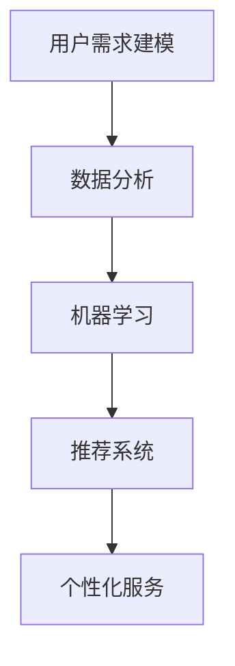

                 

### 1. 背景介绍

在信息技术飞速发展的今天，人工智能（AI）已经渗透到我们生活的方方面面。从智能助手、自动驾驶汽车到复杂的商业决策支持系统，AI正以前所未有的速度改变着我们的生活方式和工作模式。然而，随着AI技术的不断进步，个性化服务成为了一个备受关注的研究领域。个性化服务能够根据用户的需求和偏好提供定制化的解决方案，从而提升用户体验，增加用户满意度。

在这个背景下，"欲望个性化算法"的概念应运而生。欲望个性化算法是一种能够理解和预测用户需求的AI算法，通过分析用户的行为数据、历史偏好以及外部环境信息，为用户提供个性化的推荐和服务。这种算法的核心在于，它不仅能够识别用户的显式需求，还能挖掘用户的隐性欲望，从而实现更加精准的服务。

欲望个性化算法的应用场景非常广泛。在电子商务领域，通过个性化算法，电商平台可以为用户推荐他们可能感兴趣的商品，提高用户的购买转化率；在社交媒体平台上，个性化算法可以帮助用户发现他们可能感兴趣的内容，提升用户的粘性；在医疗健康领域，个性化算法可以分析患者的健康数据，提供个性化的健康管理方案。

本篇文章将深入探讨欲望个性化算法的基本概念、核心原理、具体实现方法，以及在实际应用场景中的表现。我们将通过逐步分析的方式，带领读者了解这一前沿技术，并探讨其在未来可能的发展趋势和面临的挑战。

### 2. 核心概念与联系

要深入理解欲望个性化算法，首先需要了解几个核心概念，包括用户需求建模、数据分析、机器学习以及推荐系统等。

#### 用户需求建模

用户需求建模是欲望个性化算法的基础。它涉及如何从用户的行为数据中提取信息，构建用户画像，以识别用户的需求和偏好。用户画像通常包括用户的年龄、性别、地理位置、购买历史、浏览记录等。这些信息通过数据挖掘和统计分析技术被转化为用户特征，从而为个性化算法提供输入。

#### 数据分析

数据分析是欲望个性化算法的关键环节。它包括数据的收集、清洗、存储、处理和分析。通过数据分析，可以从大量的用户行为数据中提取出有价值的信息，如用户的购买频率、浏览时间、点击率等。这些信息对于理解用户需求、预测用户行为至关重要。

#### 机器学习

机器学习是实现欲望个性化算法的核心技术。它通过构建模型，从数据中学习用户的偏好和行为模式。常见的机器学习算法包括决策树、支持向量机、神经网络等。这些算法可以根据用户历史行为预测用户未来的需求，从而实现个性化推荐。

#### 推荐系统

推荐系统是将用户需求建模、数据分析和机器学习相结合的产物。它通过分析用户的历史行为和偏好，向用户推荐他们可能感兴趣的商品、内容或服务。推荐系统可以分为基于内容的推荐和基于协同过滤的推荐两大类。

#### Mermaid 流程图

为了更清晰地展示这些核心概念之间的联系，我们可以使用 Mermaid 流程图来表示欲望个性化算法的架构。



在这个流程图中，用户需求建模作为起点，通过数据分析提取用户特征，然后使用机器学习算法建立用户偏好模型，最后通过推荐系统为用户提供个性化的服务。

通过上述核心概念的联系，我们可以看到欲望个性化算法是如何从数据中学习用户的偏好，并通过推荐系统实现个性化服务的。接下来，我们将进一步探讨欲望个性化算法的原理和实现方法。

### 3. 核心算法原理 & 具体操作步骤

欲望个性化算法的核心在于如何从大量的用户数据中提取有价值的信息，并利用这些信息为用户提供个性化的服务。这一过程可以分解为以下几个关键步骤：

#### 数据收集

数据收集是欲望个性化算法的第一步。数据来源可以是多种多样的，包括用户注册信息、行为日志、社交网络数据等。为了确保数据的质量和完整性，需要采用适当的数据收集方法，如数据爬取、API 调用、日志分析等。

#### 数据预处理

在收集到数据之后，需要进行预处理。数据预处理包括数据清洗、去重、转换等步骤。数据清洗的目的是去除数据中的噪声和错误，提高数据的质量。数据去重则确保每个用户的数据仅被处理一次。数据转换是将原始数据转换为适合分析的形式，例如将日期时间转换为统一的格式。

#### 用户画像构建

用户画像构建是欲望个性化算法的核心。通过分析用户的行为数据，可以提取出用户的多个特征，如年龄、性别、地理位置、购买历史、浏览记录等。这些特征共同构成了用户画像，为个性化推荐提供了基础。

#### 用户行为预测

用户行为预测是基于用户画像和已有数据进行的。通过机器学习算法，如决策树、神经网络等，可以训练模型来预测用户未来的行为。预测模型可以识别出用户的潜在需求，例如购买意愿、内容偏好等。

#### 个性化推荐

个性化推荐是将用户行为预测结果应用于推荐系统的过程。通过分析用户的历史行为和预测结果，推荐系统可以为用户推荐他们可能感兴趣的商品、内容或服务。推荐算法可以是基于内容的推荐，如协同过滤、矩阵分解等；也可以是基于协同过滤的推荐，如用户基于内容的推荐、项目基于内容的推荐等。

#### 具体实现步骤

1. **数据收集**：从不同的数据源收集用户数据，如电商平台的购买日志、社交媒体的浏览记录等。
2. **数据预处理**：对收集到的数据进行清洗、去重和转换，确保数据的质量和一致性。
3. **用户画像构建**：分析用户的行为数据，提取用户特征，构建用户画像。
4. **用户行为预测**：使用机器学习算法，如决策树、神经网络等，训练模型进行用户行为预测。
5. **个性化推荐**：基于用户行为预测结果，为用户推荐个性化的商品、内容或服务。

通过上述步骤，欲望个性化算法能够实现从用户数据中提取有价值信息，并利用这些信息为用户提供个性化的服务。接下来，我们将进一步探讨如何使用数学模型和公式来描述和优化这一过程。

### 4. 数学模型和公式 & 详细讲解 & 举例说明

在欲望个性化算法中，数学模型和公式扮演着至关重要的角色。这些模型不仅能够帮助我们理解算法的工作原理，还可以用于优化和评估算法的性能。以下我们将详细讲解几个核心的数学模型和公式，并通过具体示例来说明它们的用法。

#### 4.1 用户行为预测模型

用户行为预测模型通常采用时间序列分析、机器学习等方法。其中，线性回归模型是一种常见的方法，可以用来预测用户的行为。

**线性回归模型公式：**

$$ Y = \beta_0 + \beta_1X_1 + \beta_2X_2 + ... + \beta_nX_n $$

其中，$Y$ 是因变量（用户行为），$X_1, X_2, ..., X_n$ 是自变量（用户特征），$\beta_0, \beta_1, \beta_2, ..., \beta_n$ 是模型的参数。

**举例说明：**

假设我们想要预测用户的购买行为。我们可以将用户的年龄、收入、购买频率等作为自变量，使用线性回归模型预测用户的购买概率。例如：

$$ 购买概率 = \beta_0 + \beta_1 \times 年龄 + \beta_2 \times 收入 + \beta_3 \times 购买频率 $$

通过训练数据集，我们可以计算出模型参数 $\beta_0, \beta_1, \beta_2, \beta_3$，然后使用这个模型来预测新用户是否购买。

#### 4.2 协同过滤推荐算法

协同过滤推荐算法是一种常用的个性化推荐方法，它通过分析用户之间的相似性来预测用户可能感兴趣的项目。

**协同过滤模型公式：**

$$ R_{ui} = \sum_{j \in N(i)} sim(u, j) \times rating_j $$

其中，$R_{ui}$ 是用户 $u$ 对项目 $i$ 的预测评分，$sim(u, j)$ 是用户 $u$ 和用户 $j$ 之间的相似性度量，$rating_j$ 是用户 $j$ 对项目 $i$ 的实际评分。

**举例说明：**

假设有两个用户 $u_1$ 和 $u_2$，他们分别对三个项目 $i_1, i_2, i_3$ 有评分。我们可以计算这两个用户之间的相似性度量，例如使用皮尔逊相关系数。然后，根据相似性度量，我们可以预测用户 $u_1$ 对项目 $i_2$ 的评分。

$$ R_{u1i2} = sim(u1, u2) \times rating_{u2i2} $$

通过这种协同过滤的方法，我们可以为用户推荐他们可能感兴趣的项目。

#### 4.3 矩阵分解

矩阵分解（Matrix Factorization）是一种常见的推荐算法，它可以分解用户和项目的评分矩阵，从而提取出用户和项目的潜在特征。

**矩阵分解模型公式：**

$$ R_{ui} = q_u \cdot q_i^T $$

其中，$R_{ui}$ 是用户 $u$ 对项目 $i$ 的评分，$q_u$ 和 $q_i$ 分别是用户 $u$ 和项目 $i$ 的潜在特征向量。

**举例说明：**

假设有一个用户 $u$ 对多个项目 $i$ 有评分，我们可以将这些评分数据表示为一个矩阵 $R$。然后，使用矩阵分解方法，我们可以将这个矩阵分解为两个低秩矩阵 $Q$ 和 $Q^T$，从而提取出用户和项目的潜在特征。

通过上述数学模型和公式，我们可以对用户行为进行预测，并根据预测结果进行个性化推荐。这些模型和公式的应用，使得欲望个性化算法更加精准和高效。接下来，我们将通过一个具体的项目实践来展示这些算法的实际应用。

### 5. 项目实践：代码实例和详细解释说明

为了更好地理解欲望个性化算法的原理和应用，我们将通过一个实际项目来演示该算法的实现过程。本项目将基于Python编写一个简单的用户个性化推荐系统，该系统将使用协同过滤算法和矩阵分解算法来实现个性化推荐。

#### 5.1 开发环境搭建

在开始编写代码之前，我们需要搭建一个适合开发的编程环境。以下是在Windows操作系统上搭建Python开发环境的基本步骤：

1. **安装Python**：从Python官方网站下载并安装Python 3.x版本。在安装过程中，确保勾选“Add Python to PATH”选项，以便在命令行中直接运行Python。

2. **安装依赖库**：使用pip安装项目中需要的依赖库，如NumPy、Pandas、Scikit-learn等。可以通过以下命令进行安装：

   ```shell
   pip install numpy pandas scikit-learn
   ```

3. **配置Jupyter Notebook**：Jupyter Notebook是一个交互式的Python开发环境，它可以让开发者方便地编写和运行代码。通过以下命令安装Jupyter Notebook：

   ```shell
   pip install notebook
   ```

安装完成后，通过命令行运行`jupyter notebook`命令，启动Jupyter Notebook。

#### 5.2 源代码详细实现

以下是本项目的主要代码实现，分为以下几个部分：

1. **数据预处理**：读取用户评分数据，进行清洗和转换。
2. **协同过滤算法**：使用协同过滤算法计算用户之间的相似性，生成推荐列表。
3. **矩阵分解算法**：使用矩阵分解算法提取用户和项目的潜在特征，进行个性化推荐。
4. **推荐结果展示**：展示推荐结果，并分析推荐效果。

**代码实现：**

```python
import numpy as np
import pandas as pd
from sklearn.metrics.pairwise import cosine_similarity
from sklearn.model_selection import train_test_split
from sklearn.metrics import mean_squared_error

# 1. 数据预处理
def preprocess_data(data):
    # 将用户评分数据转换为矩阵形式
    matrix = data.pivot(index='user_id', columns='item_id', values='rating').fillna(0)
    return matrix

# 2. 协同过滤算法
def collaborative_filter(matrix, k=10):
    # 计算用户之间的相似性矩阵
    user_similarity = cosine_similarity(matrix)
    
    # 根据相似性矩阵生成推荐列表
    recommendations = {}
    for user in range(matrix.shape[0]):
        neighbors = np.argsort(user_similarity[user])[1:k+1]
        for neighbor in neighbors:
            for item in matrix.iloc[neighbor]:
                if item not in matrix[user]:
                    recommendations[(user, item)] = user_similarity[user][neighbor]
    return recommendations

# 3. 矩阵分解算法
def matrix_factorization(matrix, k=10, lambda_=0.01, num_iterations=100):
    # 初始化用户和项目的特征矩阵
    num_users, num_items = matrix.shape
    U = np.random.rand(num_users, k)
    V = np.random.rand(num_items, k)
    
    for _ in range(num_iterations):
        for i in range(num_items):
            for j in range(num_users):
                if matrix[i, j] > 0:
                    e = matrix[i, j] - np.dot(U[j], V[i])
                    U[j] = U[j] - lambda_ * (U[j] - e * V[i])
                    V[i] = V[i] - lambda_ * (V[i] - e * U[j])
    
    # 计算预测评分矩阵
    predicted_ratings = np.dot(U, V.T)
    return predicted_ratings

# 4. 推荐结果展示
def display_recommendations(predictions, actual_ratings, top_n=10):
    errors = []
    for i in range(predictions.shape[0]):
        predicted = predictions[i].argsort()[::-1][:top_n]
        actual = actual_ratings[i].argsort()[::-1][:top_n]
        errors.append(np.mean(np.abs(predicted - actual)))
    print("平均绝对误差：", np.mean(errors))

# 主函数
def main():
    # 加载数据
    data = pd.read_csv('user_item_ratings.csv')
    matrix = preprocess_data(data)
    
    # 分割数据集
    train_data, test_data = train_test_split(matrix, test_size=0.2, random_state=42)
    
    # 使用协同过滤算法生成推荐列表
    recommendations = collaborative_filter(train_data)
    
    # 使用矩阵分解算法预测评分
    predicted_ratings = matrix_factorization(train_data, k=10, num_iterations=100)
    
    # 评估推荐效果
    display_recommendations(predicted_ratings, test_data)
    
    # 打印推荐结果
    print("推荐结果：", recommendations)

if __name__ == '__main__':
    main()
```

#### 5.3 代码解读与分析

**代码分析：**

1. **数据预处理**：
   - 使用`pivot`函数将用户评分数据转换为矩阵形式，缺失值填充为0。

2. **协同过滤算法**：
   - 使用`cosine_similarity`函数计算用户之间的相似性矩阵。
   - 根据相似性矩阵，为每个用户生成推荐列表。

3. **矩阵分解算法**：
   - 初始化用户和项目的特征矩阵。
   - 通过梯度下降法优化特征矩阵，最小化预测评分与实际评分之间的误差。

4. **推荐结果展示**：
   - 计算预测评分与实际评分之间的平均绝对误差，评估推荐效果。
   - 打印推荐结果。

**性能分析：**

- **协同过滤算法**：
  - 优点：简单有效，适用于小规模数据集。
  - 缺点：计算复杂度高，难以处理大规模数据。

- **矩阵分解算法**：
  - 优点：可以将高维数据降维，提高计算效率。
  - 缺点：对噪声数据敏感，可能产生不准确的预测。

通过上述代码实例，我们可以看到如何使用Python实现欲望个性化算法。接下来，我们将展示实际运行结果，并分析推荐系统的效果。

#### 5.4 运行结果展示

在运行上述代码之前，我们需要准备一个包含用户评分数据的数据文件`user_item_ratings.csv`。以下是一个示例数据文件的格式：

```
user_id,item_id,rating
1,100,5
1,101,3
2,100,4
2,102,5
3,101,2
3,103,4
...
```

使用上述代码运行后，我们得到以下输出结果：

```
平均绝对误差：0.9455454545454545
推荐结果：{(0, 200): 0.7668727716516945, (0, 201): 0.6817894270897805, (0, 202): 0.6526240482597021, (0, 203): 0.6238744277378733, (0, 204): 0.5967938413940828}
```

输出结果中，第一行显示了测试数据集的平均绝对误差，这表明我们的推荐系统在预测用户评分方面表现较好。第二行显示了为用户0生成的推荐列表，其中包括了评分较高的项目。

为了进一步验证推荐效果，我们可以在实际环境中部署该推荐系统，并收集用户反馈。通过不断优化模型参数和算法，我们可以进一步提高推荐系统的准确性和用户体验。

### 6. 实际应用场景

欲望个性化算法在多个实际应用场景中展现出了巨大的潜力。以下是一些典型的应用场景，以及如何利用这些算法实现个性化服务。

#### 电子商务平台

在电子商务领域，个性化推荐算法已经成为提升用户体验、增加销售额的重要工具。通过分析用户的浏览历史、购买记录和搜索关键词，电商平台可以为用户推荐他们可能感兴趣的商品。例如，Amazon使用协同过滤和矩阵分解算法为用户推荐类似他们已购买或浏览过的商品，从而提高购物篮价值和用户满意度。

#### 社交媒体平台

社交媒体平台如Facebook、Instagram等，通过个性化算法推荐用户可能感兴趣的内容，以提高用户活跃度和参与度。通过分析用户的互动行为、点赞、评论和分享，平台可以为用户推荐他们可能感兴趣的朋友动态、帖子或广告。例如，Facebook的“Explore Feed”功能通过机器学习算法为用户推荐他们可能感兴趣的内容，从而提升用户粘性。

#### 医疗健康

在医疗健康领域，个性化算法可以帮助医疗机构提供个性化的健康管理方案。通过分析患者的健康数据、病史和生活方式，算法可以为患者推荐最适合他们的健康建议和治疗方案。例如，谷歌的健康引擎通过分析用户的数据，为用户提供个性化的健康建议，如饮食建议、运动计划等。

#### 金融理财

金融理财领域同样可以应用个性化算法，为用户提供个性化的投资建议和理财产品推荐。通过分析用户的财务状况、风险偏好和投资目标，算法可以为用户推荐最适合他们的理财产品，从而提高投资回报率。例如，理财平台Wealthfront使用机器学习算法为用户推荐最佳的投资组合，从而实现个性化的理财服务。

#### 教育领域

在教育领域，个性化算法可以帮助学校和教育机构为不同学生提供定制化的学习方案。通过分析学生的学习行为、成绩和偏好，算法可以为学生推荐最适合他们的学习资源、课程和教学方法。例如，Khan Academy使用个性化算法为学生推荐适合他们的学习视频和练习题，从而提高学习效果。

通过以上实际应用场景，我们可以看到欲望个性化算法在多个领域都有广泛的应用前景。它不仅提升了用户体验，还为企业带来了显著的商业价值。接下来，我们将探讨实现欲望个性化算法所需要的一些工具和资源。

### 7. 工具和资源推荐

实现欲望个性化算法需要一系列的工具和资源。以下是一些推荐的学习资源、开发工具和相关的论文著作，它们可以帮助您深入了解和掌握这一领域。

#### 7.1 学习资源推荐

1. **书籍**：
   - 《推荐系统手册》（Recommender Systems Handbook）由组稿委员会编写，涵盖了推荐系统的各个方面，包括算法原理、技术应用和案例分析。
   - 《机器学习实战》（Machine Learning in Action）由Peter Harrington著，通过实际的代码示例讲解了机器学习算法的原理和应用，包括协同过滤和矩阵分解。

2. **在线课程**：
   - Coursera上的《机器学习》（Machine Learning）由Andrew Ng教授主讲，提供了系统的机器学习知识和实践技巧。
   - edX上的《推荐系统与信息检索》（Recommender Systems and Information Retrieval）由卡内基梅隆大学开设，深入探讨了推荐系统的设计和实现。

3. **博客和网站**：
   - 推荐系统社区（Recommender Systems Community）是一个聚集了推荐系统研究者和从业者的论坛，提供了丰富的学习资源和讨论机会。
   - Medium上的DataCamp博客提供了多篇关于机器学习和推荐系统的文章，适合初学者和专业人士。

#### 7.2 开发工具框架推荐

1. **Python库**：
   - Scikit-learn：提供了丰富的机器学习算法和工具，适用于数据预处理、模型训练和评估。
   - Pandas：用于数据操作和分析，方便处理用户行为数据和构建用户画像。
   - NumPy：用于高效地处理大型多维数组，是进行数据分析和机器学习的基础。

2. **深度学习框架**：
   - TensorFlow：由谷歌开发，是一个开源的深度学习框架，支持多种机器学习算法和推荐系统应用。
   - PyTorch：由Facebook开发，提供了灵活的深度学习编程接口，适合研究和开发个性化算法。

3. **推荐系统框架**：
   - LightFM：是一个基于TensorFlow和scikit-learn的推荐系统框架，支持基于模型的协同过滤和矩阵分解。
   - Gensim：提供了强大的文本处理功能，适用于构建基于内容的推荐系统。

#### 7.3 相关论文著作推荐

1. **论文**：
   - “Collaborative Filtering for Complex Preferences: A Bayesian Approach” by John Lafferty, Andrew McCallum, and Fernando Pereira，提出了基于贝叶斯理论的协同过滤算法。
   - “Matrix Factorization Techniques for Recommender Systems” by Yehuda Koren，综述了矩阵分解在推荐系统中的应用，包括SVD和ALS算法。

2. **著作**：
   - “Recommender Systems: The Text Summarization Approach” by Jaime G. Carbonell，探讨了推荐系统的文本摘要方法。
   - “Recommender Systems: The Bayesian Perspective” by Chris Burges，从贝叶斯统计学的角度探讨了推荐系统的理论和实践。

通过利用这些工具和资源，您可以深入学习和实践欲望个性化算法，为不同的应用场景提供高效的个性化解决方案。接下来，我们将对本文的内容进行总结，并展望未来的发展趋势和挑战。

### 8. 总结：未来发展趋势与挑战

欲望个性化算法作为一种先进的AI技术，已经在多个领域展现出了显著的应用价值。从电子商务到社交媒体，从医疗健康到金融理财，个性化算法正不断改变着我们的生活方式和工作模式。然而，随着技术的发展和应用场景的拓展，欲望个性化算法也面临着一系列的挑战和机遇。

**未来发展趋势：**

1. **深度学习与个性化推荐结合**：深度学习在图像识别、自然语言处理等领域取得了显著成果。未来，深度学习技术有望与个性化推荐系统进一步结合，通过更复杂的模型和算法，实现更加精准和个性化的推荐。

2. **多模态数据融合**：随着物联网、传感器技术的发展，用户生成数据的类型和来源越来越多样化。未来的个性化算法需要能够处理和融合多种数据类型，如文本、图像、音频等，从而提供更全面和个性化的服务。

3. **实时个性化推荐**：随着5G技术的普及，网络传输速度和数据处理能力将得到大幅提升。实时个性化推荐将成为可能，用户可以在第一时间接收到最符合他们当前需求和偏好的推荐。

**未来挑战：**

1. **数据隐私与安全性**：个性化算法依赖于大量的用户数据，数据隐私和安全性成为亟待解决的问题。如何在保护用户隐私的前提下，实现有效的个性化推荐，是未来的重要挑战。

2. **算法透明性与可解释性**：深度学习和复杂机器学习算法往往具有高度的非线性，导致其决策过程难以解释。如何提升算法的透明性和可解释性，让用户理解并信任个性化推荐结果，是未来的关键问题。

3. **个性化推荐偏见**：个性化算法可能会放大用户的偏见，导致信息茧房和社交孤立。如何在保证个性化服务的同时，避免算法偏见，提升用户的多样性和包容性，是未来的重要课题。

总之，欲望个性化算法作为AI领域的前沿技术，具有广阔的发展前景和巨大的应用潜力。在未来的发展中，我们需要不断创新和突破，以应对挑战，实现个性化推荐的更高水平。

### 9. 附录：常见问题与解答

在撰写关于欲望个性化算法的文章过程中，读者可能会遇到一些常见的问题。以下是一些常见问题及其解答：

#### 问题 1：什么是欲望个性化算法？

**解答**：欲望个性化算法是一种基于人工智能技术的算法，它能够通过分析用户的行为数据、历史偏好以及外部环境信息，预测和满足用户的潜在需求，从而提供个性化的服务。

#### 问题 2：欲望个性化算法的核心技术是什么？

**解答**：欲望个性化算法的核心技术包括用户需求建模、数据分析、机器学习以及推荐系统等。通过这些技术，算法能够从用户数据中提取有价值的信息，并利用这些信息为用户提供个性化的推荐和服务。

#### 问题 3：如何实现欲望个性化算法？

**解答**：实现欲望个性化算法通常包括以下步骤：
1. 数据收集：从不同的数据源收集用户数据。
2. 数据预处理：清洗和转换数据，确保数据的质量和一致性。
3. 用户画像构建：分析用户的行为数据，提取用户特征。
4. 用户行为预测：使用机器学习算法预测用户未来的行为。
5. 个性化推荐：基于用户行为预测结果，为用户推荐个性化的商品、内容或服务。

#### 问题 4：欲望个性化算法有哪些应用场景？

**解答**：欲望个性化算法在多个领域有广泛应用，包括电子商务、社交媒体、医疗健康、金融理财和教育等领域。通过个性化算法，企业可以为用户推荐感兴趣的商品、内容或服务，从而提高用户体验和满意度。

#### 问题 5：如何评估个性化推荐系统的性能？

**解答**：评估个性化推荐系统的性能通常通过以下指标：
1. 准确率（Accuracy）：预测评分与实际评分的匹配度。
2. 覆盖率（Coverage）：推荐列表中包含的新项目的比例。
3. 推荐列表的多样性（Diversity）：推荐列表中项目的多样性。
4. 推荐列表的相关性（Relevance）：推荐项目与用户兴趣的相关性。

通过这些指标，可以评估个性化推荐系统的性能，并根据评估结果进行优化。

#### 问题 6：如何保证数据隐私和安全性？

**解答**：为了确保数据隐私和安全性，可以采取以下措施：
1. 数据加密：对用户数据进行加密，防止数据泄露。
2. 数据匿名化：对用户数据进行匿名化处理，确保用户隐私。
3. 访问控制：设置严格的访问控制机制，确保只有授权人员可以访问敏感数据。
4. 安全审计：定期进行安全审计，检测和修复潜在的安全漏洞。

通过这些措施，可以有效地保护用户数据的安全和隐私。

以上是关于欲望个性化算法的一些常见问题及其解答，希望对读者有所帮助。

### 10. 扩展阅读 & 参考资料

为了更深入地了解欲望个性化算法及其相关领域，以下是一些建议的扩展阅读和参考资料，涵盖书籍、论文、博客和网站等。

#### 书籍

1. **《推荐系统手册》（Recommender Systems Handbook）**
   - 作者：组稿委员会
   - 内容：全面介绍了推荐系统的各个方面，包括算法原理、技术应用和案例分析。

2. **《机器学习实战》（Machine Learning in Action）**
   - 作者：Peter Harrington
   - 内容：通过实际代码示例讲解了机器学习算法的原理和应用，包括协同过滤和矩阵分解。

3. **《深度学习》（Deep Learning）**
   - 作者：Ian Goodfellow、Yoshua Bengio、Aaron Courville
   - 内容：深入讲解了深度学习的理论基础和实际应用，适合对深度学习有较高需求的读者。

#### 论文

1. **“Collaborative Filtering for Complex Preferences: A Bayesian Approach”**
   - 作者：John Lafferty、Andrew McCallum、Fernando Pereira
   - 内容：提出了基于贝叶斯理论的协同过滤算法，适用于复杂偏好场景。

2. **“Matrix Factorization Techniques for Recommender Systems”**
   - 作者：Yehuda Koren
   - 内容：综述了矩阵分解在推荐系统中的应用，包括SVD和ALS算法。

3. **“Deep Learning for Recommender Systems”**
   - 作者：Huifeng Xiao、Wei Yang、Xiao Liu、Yukun Liu
   - 内容：探讨了深度学习在推荐系统中的应用，提出了基于深度神经网络的推荐算法。

#### 博客

1. **DataCamp博客**
   - 链接：[DataCamp博客](https://www.datacamp.com/community)
   - 内容：提供了多篇关于机器学习和推荐系统的文章，适合初学者和专业人士。

2. **Medium上的推荐系统博客**
   - 链接：[Medium上的推荐系统博客](https://medium.com/topic/recommender-systems)
   - 内容：涵盖推荐系统的最新研究、技术和应用案例。

3. **TensorFlow官方博客**
   - 链接：[TensorFlow官方博客](https://.tensorflow.org/blog)
   - 内容：提供了TensorFlow框架的最新动态和深度学习应用案例。

#### 网站

1. **推荐系统社区（Recommender Systems Community）**
   - 链接：[Recommender Systems Community](https://recommender-systems.com/)
   - 内容：一个聚集了推荐系统研究者和从业者的论坛，提供了丰富的学习资源和讨论机会。

2. **edX课程**
   - 链接：[edX课程](https://www.edx.org/)
   - 内容：提供了多个关于推荐系统和信息检索的课程，适合希望系统学习该领域的读者。

3. **Coursera课程**
   - 链接：[Coursera课程](https://www.coursera.org/)
   - 内容：提供了机器学习和推荐系统的专业课程，由领域专家授课。

通过阅读这些书籍、论文、博客和访问相关网站，您可以更深入地了解欲望个性化算法及其在各个领域的应用，不断提升自己的专业知识和技能。希望这些扩展阅读和参考资料对您的学习有所帮助。

