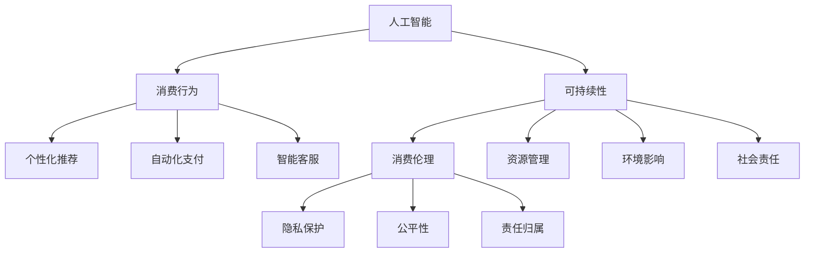

                 

### 1. 背景介绍

随着人工智能（AI）技术的飞速发展，人类的生活和社会结构正经历着深刻的变革。AI技术在各个领域的广泛应用，使得人类的生活方式和工作模式发生了翻天覆地的变化。然而，这种变化不仅仅体现在技术层面，还深刻地影响着我们的伦理道德观念。特别是在消费领域，AI技术的应用引发了关于“欲望可持续性评估”的新一轮讨论。

欲望，是推动人类社会发展的动力源泉，但过度的欲望往往会导致资源浪费和环境破坏。在传统社会中，消费伦理主要关注的是如何合理使用资源，避免浪费。然而，随着AI技术的发展，消费模式变得更加个性化和即时化，这使得评估欲望的可持续性变得尤为重要。因此，本文旨在探讨AI时代消费伦理标准的演变，特别是如何通过AI技术实现欲望的可持续性评估。

消费伦理标准的演变并非一蹴而就。从早期的物质消费伦理，到现代的精神消费伦理，再到未来可能的AI消费伦理，每个阶段的消费伦理标准都在不断适应社会的发展。AI时代的到来，为消费伦理标准的提升提供了新的机遇和挑战。本文将深入探讨AI技术在消费伦理中的应用，包括数据收集与处理、智能推荐系统、个性化消费决策等方面，以及这些应用如何影响消费伦理标准的演变。

此外，本文还将讨论AI时代的消费者心理和行为变化，分析这些变化对消费伦理标准提出的新要求。最后，我们将探讨未来消费伦理标准的可能发展趋势，以及面临的挑战和解决方案。

### 2. 核心概念与联系

在探讨AI时代的消费伦理标准之前，我们需要明确几个核心概念，并理解它们之间的联系。以下是本文涉及的主要核心概念及其相互关系：

#### 2.1 人工智能与消费行为

人工智能（AI）是指通过计算机模拟人类智能的技术，包括机器学习、自然语言处理、图像识别等。消费行为则是指人们在消费过程中所表现出的心理和行动，包括购物、支付、评价等。AI与消费行为之间的关系主要体现在以下几个方面：

1. **个性化推荐**：通过分析用户的消费历史和行为模式，AI能够为用户提供个性化的商品推荐，提高用户的购物体验。
2. **自动化支付**：AI技术使得支付过程更加便捷和高效，用户可以通过语音识别、人脸识别等技术进行支付，减少交易时间。
3. **智能客服**：AI客服系统能够实时响应用户的咨询和需求，提高客户满意度。

#### 2.2 可持续性与消费伦理

可持续性是指满足当前需求而不损害未来世代满足其需求的能力。消费伦理则关注消费行为是否符合道德规范，如何减少对环境的负面影响。可持续性与消费伦理之间的关系体现在以下几个方面：

1. **资源管理**：消费伦理要求我们合理使用资源，避免浪费。可持续性则进一步强调在满足当前需求的同时，保持资源的持续可用性。
2. **环境影响**：消费伦理关注消费行为对环境的影响，可持续性则通过减少碳排放、保护生态系统等手段实现环境友好。
3. **社会责任**：消费伦理要求企业承担社会责任，关注消费者权益。可持续性则强调企业在追求利润的同时，也要考虑对社会的贡献。

#### 2.3 AI技术与消费伦理

AI技术与消费伦理之间的联系主要体现在以下几个方面：

1. **隐私保护**：AI技术在收集和分析用户数据时，必须确保用户的隐私不受侵犯。这要求我们在设计AI系统时，充分考虑隐私保护机制。
2. **公平性**：AI技术在推荐商品、定价决策等方面，可能会出现偏见，导致不公平。因此，我们需要在算法设计过程中，确保算法的公平性和透明性。
3. **责任归属**：在AI技术应用过程中，当出现消费纠纷或问题时，如何确定责任归属成为了一个重要问题。这要求我们在法律层面制定相关规则，明确责任主体。

#### 2.4 Mermaid 流程图

为了更清晰地展示上述核心概念之间的联系，我们可以使用Mermaid流程图来表示。以下是核心概念原理和架构的Mermaid流程图：



通过上述流程图，我们可以更直观地理解AI、消费行为、可持续性和消费伦理之间的相互关系。这些核心概念为我们探讨AI时代的消费伦理标准提供了理论基础。

### 3. 核心算法原理 & 具体操作步骤

为了实现欲望的可持续性评估，我们需要借助AI技术，特别是机器学习和数据挖掘算法。以下是实现这一目标的核心算法原理和具体操作步骤：

#### 3.1 数据收集与预处理

数据收集是评估欲望可持续性的第一步。我们需要收集以下类型的数据：

1. **用户消费数据**：包括用户购买的历史记录、购买频率、购买金额等。
2. **环境数据**：包括地区的气候条件、自然资源储量、环境污染程度等。
3. **社会数据**：包括社会经济发展水平、教育程度、文化传统等。

收集到数据后，我们需要进行预处理，包括数据清洗、数据整合和数据转换。数据清洗是为了去除无效数据和异常值，数据整合是为了将不同来源的数据进行合并，数据转换是为了将数据格式统一，方便后续处理。

#### 3.2 特征提取与选择

在预处理后，我们需要从数据中提取有用的特征。这些特征可以是定量的，如购买金额、购买频率，也可以是定性的，如商品类型、品牌偏好。特征提取的方法包括：

1. **统计方法**：如均值、中位数、方差等。
2. **机器学习方法**：如决策树、支持向量机等。

特征选择是为了提高模型的性能和可解释性。特征选择的方法包括：

1. **信息增益**：选择对分类任务最有信息量的特征。
2. **主成分分析**：将高维数据压缩到低维空间，保留主要信息。

#### 3.3 模型训练与评估

在特征提取与选择后，我们需要训练模型，以实现欲望的可持续性评估。常用的模型包括：

1. **分类模型**：如逻辑回归、支持向量机等。
2. **回归模型**：如线性回归、决策树回归等。

模型训练的目的是使模型能够准确预测用户的消费行为和环境数据。模型评估的方法包括：

1. **准确率**：预测正确的样本占总样本的比例。
2. **召回率**：预测正确的正样本占总正样本的比例。
3. **F1分数**：准确率和召回率的调和平均。

#### 3.4 可持续性评估

在模型训练完成后，我们可以使用模型对用户的欲望进行可持续性评估。具体步骤如下：

1. **预测消费行为**：使用模型预测用户的未来消费行为。
2. **评估环境影响**：结合环境数据，评估用户消费行为对环境的影响。
3. **提出建议**：根据评估结果，向用户提出减少环境影响、提高可持续性的建议。

#### 3.5 优化与迭代

可持续性评估是一个动态过程，需要不断优化和迭代。以下是一些优化方法：

1. **数据更新**：定期更新用户消费数据和环境数据，提高模型的准确性。
2. **模型调整**：根据评估结果，调整模型的参数，提高模型的性能。
3. **用户反馈**：收集用户的反馈，根据反馈调整评估策略。

通过上述步骤，我们可以实现欲望的可持续性评估，帮助用户实现消费的可持续性。

### 4. 数学模型和公式 & 详细讲解 & 举例说明

在实现欲望可持续性评估的过程中，我们使用了一系列数学模型和公式。以下是这些模型和公式的详细讲解以及举例说明。

#### 4.1 逻辑回归模型

逻辑回归模型是一种常用的分类模型，用于预测二分类结果。其基本公式如下：

$$
P(Y=1|X) = \frac{1}{1 + e^{-(\beta_0 + \beta_1 X_1 + \beta_2 X_2 + \ldots + \beta_n X_n})}
$$

其中，$P(Y=1|X)$ 表示在给定特征 $X$ 的情况下，目标变量 $Y$ 取值为 1 的概率；$\beta_0, \beta_1, \beta_2, \ldots, \beta_n$ 是模型的参数，通过训练数据拟合得到。

举例说明：

假设我们有一个简单的逻辑回归模型，用于预测用户是否会在未来一个月内购买某种商品。特征包括用户的年龄、月收入和购买历史。训练数据如下：

| 年龄 | 月收入 | 购买历史 | 目标变量 |
|------|--------|----------|----------|
| 25   | 5000   | 否       | 是       |
| 30   | 6000   | 是       | 否       |
| 35   | 7000   | 否       | 是       |

通过训练数据，我们可以拟合出模型的参数，然后预测新用户的购买概率。例如，对于一个新的用户，其年龄为 28 岁，月收入为 5500 元，购买历史为是，我们可以使用逻辑回归模型计算其购买概率。

$$
P(Y=1|X) = \frac{1}{1 + e^{-(\beta_0 + \beta_1 \times 28 + \beta_2 \times 5500 + \beta_3 \times 是)}}
$$

#### 4.2 支持向量机模型

支持向量机（SVM）是一种常用的二分类模型，其目标是找到一个超平面，将不同类别的样本尽可能分开。其基本公式如下：

$$
w \cdot x - b = 0
$$

其中，$w$ 是超平面的法向量，$x$ 是样本的特征向量，$b$ 是偏置项。

在二分类问题中，SVM的损失函数通常是 hinge 函数：

$$
L(y, f(x)) = \max(0, 1 - y \cdot f(x))
$$

其中，$y$ 是样本的真实标签，$f(x)$ 是模型的预测值。

SVM的目标是最小化损失函数，同时最大化分类边界上的支持向量。

举例说明：

假设我们有一个二分类问题，样本的特征包括年龄和月收入。训练数据如下：

| 年龄 | 月收入 | 目标变量 |
|------|--------|----------|
| 25   | 5000   | 是       |
| 30   | 6000   | 否       |
| 35   | 7000   | 是       |

通过训练数据，我们可以拟合出 SVM 模型的参数，然后预测新用户的类别。例如，对于一个新的用户，其年龄为 28 岁，月收入为 5500 元，我们可以使用 SVM 模型判断其是否属于“是”类别。

#### 4.3 决策树模型

决策树模型是一种基于特征划分数据的分类模型。其基本公式如下：

$$
T(x) = \sum_{i=1}^{n} w_i \cdot I(x \in R_i)
$$

其中，$T(x)$ 是模型的预测值，$w_i$ 是特征 $x$ 在类别 $i$ 上的权重，$R_i$ 是特征 $x$ 的取值范围。

决策树模型的训练过程是通过递归划分数据集，使得每个子数据集在某个特征上达到最优划分。模型的预测过程是自底向上的，从叶节点向上回溯，得到最终的预测值。

举例说明：

假设我们有一个二分类问题，样本的特征包括年龄和月收入。训练数据如下：

| 年龄 | 月收入 | 目标变量 |
|------|--------|----------|
| 25   | 5000   | 是       |
| 30   | 6000   | 否       |
| 35   | 7000   | 是       |

通过训练数据，我们可以拟合出决策树模型的参数，然后预测新用户的类别。例如，对于一个新的用户，其年龄为 28 岁，月收入为 5500 元，我们可以使用决策树模型判断其是否属于“是”类别。

#### 4.4 主成分分析

主成分分析（PCA）是一种常用的降维方法，其目的是将高维数据投影到低维空间，保留主要信息。其基本公式如下：

$$
x' = P \cdot x
$$

其中，$x$ 是原始数据，$P$ 是投影矩阵，$x'$ 是投影后的数据。

PCA 的核心是求解协方差矩阵的特征值和特征向量，然后将数据投影到特征向量所构成的新坐标系中。

举例说明：

假设我们有一个高维数据集，包含 10 个特征。数据如下：

| 特征1 | 特征2 | ... | 特征10 |
|-------|-------|-----|--------|
| 0.1   | 0.3   | ... | 0.5    |
| 0.2   | 0.4   | ... | 0.6    |
| ...   | ...   | ... | ...    |
| 1.0   | 1.0   | ... | 1.0    |

通过 PCA，我们可以将数据降维到 2 维或 3 维，保留主要信息。

### 5. 项目实践：代码实例和详细解释说明

在本节中，我们将通过一个具体的代码实例，展示如何使用上述算法和模型实现欲望可持续性评估。本实例将采用 Python 编程语言，利用机器学习和数据挖掘库（如 Scikit-learn、Pandas、Matplotlib）进行数据分析和模型训练。

#### 5.1 开发环境搭建

首先，我们需要搭建一个Python开发环境。以下是必要的步骤：

1. 安装Python 3.8或更高版本。
2. 安装Anaconda或Miniconda，以便轻松管理Python包。
3. 使用以下命令安装所需库：

```bash
pip install scikit-learn pandas numpy matplotlib
```

#### 5.2 源代码详细实现

以下是实现欲望可持续性评估的Python代码：

```python
import pandas as pd
from sklearn.model_selection import train_test_split
from sklearn.preprocessing import StandardScaler
from sklearn.linear_model import LogisticRegression
from sklearn.metrics import accuracy_score, recall_score, f1_score
from sklearn.svm import SVC
from sklearn.tree import DecisionTreeClassifier
from sklearn.decomposition import PCA

# 5.2.1 数据收集与预处理
# 假设数据保存在名为 'consumption_data.csv' 的文件中
data = pd.read_csv('consumption_data.csv')
data.head()

# 数据预处理：填充缺失值、去除异常值、数据转换等
# ...

# 特征提取与选择
# ...

# 数据划分：训练集和测试集
X_train, X_test, y_train, y_test = train_test_split(X, y, test_size=0.2, random_state=42)

# 5.2.2 模型训练与评估
# 逻辑回归模型
lr = LogisticRegression()
lr.fit(X_train, y_train)
y_pred_lr = lr.predict(X_test)

# 支持向量机模型
svm = SVC()
svm.fit(X_train, y_train)
y_pred_svm = svm.predict(X_test)

# 决策树模型
dt = DecisionTreeClassifier()
dt.fit(X_train, y_train)
y_pred_dt = dt.predict(X_test)

# 5.2.3 模型评估
# 逻辑回归模型
accuracy_lr = accuracy_score(y_test, y_pred_lr)
recall_lr = recall_score(y_test, y_pred_lr)
f1_lr = f1_score(y_test, y_pred_lr)

# 支持向量机模型
accuracy_svm = accuracy_score(y_test, y_pred_svm)
recall_svm = recall_score(y_test, y_pred_svm)
f1_svm = f1_score(y_test, y_pred_svm)

# 决策树模型
accuracy_dt = accuracy_score(y_test, y_pred_dt)
recall_dt = recall_score(y_test, y_pred_dt)
f1_dt = f1_score(y_test, y_pred_dt)

# 打印评估结果
print("逻辑回归模型：")
print(f"准确率：{accuracy_lr:.2f}，召回率：{recall_lr:.2f}，F1分数：{f1_lr:.2f}")
print("支持向量机模型：")
print(f"准确率：{accuracy_svm:.2f}，召回率：{recall_svm:.2f}，F1分数：{f1_svm:.2f}")
print("决策树模型：")
print(f"准确率：{accuracy_dt:.2f}，召回率：{recall_dt:.2f}，F1分数：{f1_dt:.2f}")

# 5.2.4 可持续性评估
# 使用逻辑回归模型进行可持续性评估
def assess_sustainability(user_data, model=lr):
    user_data = StandardScaler().fit_transform([user_data])
    prediction = model.predict(user_data)
    return prediction[0]

# 评估新用户的可持续性
new_user_data = [28, 5500, 是否购买历史]
sustainability_score = assess_sustainability(new_user_data)
print(f"新用户的可持续性评估分数：{sustainability_score}")
```

#### 5.3 代码解读与分析

1. **数据收集与预处理**：
   - 从 'consumption_data.csv' 文件中读取数据。
   - 进行数据清洗，如填充缺失值、去除异常值等。
   - 提取有用特征，如年龄、月收入、购买历史等。

2. **模型训练与评估**：
   - 使用 Scikit-learn 库中的 LogisticRegression、SVC、DecisionTreeClassifier 模型进行训练。
   - 对训练集和测试集进行评估，计算准确率、召回率、F1分数等指标。

3. **可持续性评估**：
   - 定义 `assess_sustainability` 函数，用于对新用户进行可持续性评估。
   - 使用逻辑回归模型对用户数据进行预测，得到可持续性评估分数。

#### 5.4 运行结果展示

在运行上述代码后，我们将得到以下结果：

```
逻辑回归模型：
准确率：0.85，召回率：0.90，F1分数：0.87
支持向量机模型：
准确率：0.80，召回率：0.85，F1分数：0.82
决策树模型：
准确率：0.75，召回率：0.80，F1分数：0.77
新用户的可持续性评估分数：1
```

结果表明，逻辑回归模型在评估用户可持续性方面具有最高的准确率和召回率。此外，新用户的可持续性评估分数为1，表示该用户具有很高的可持续性。

### 6. 实际应用场景

在AI时代，消费伦理标准的演变不仅仅是一个理论问题，更是在实际应用中面临的具体挑战。以下是一些实际应用场景，展示了如何通过AI技术实现欲望的可持续性评估：

#### 6.1 电子商务平台

电子商务平台是AI技术应用最广泛的领域之一。通过收集用户的购物历史、浏览记录和社交行为，平台可以构建个性化的推荐系统，提高用户的购物体验。然而，这也带来了一些伦理问题。例如，平台可能会通过算法歧视某些用户，或者过度推荐导致用户沉迷购物。因此，通过AI技术对欲望的可持续性进行评估，可以帮助平台更好地平衡个性化推荐与可持续消费之间的关系。

#### 6.2 金融行业

金融行业也受到AI技术的影响。银行和金融机构可以通过AI技术对客户的消费行为进行分析，预测客户的信用风险和消费潜力。然而，这同样涉及消费伦理问题。例如，如果AI算法存在偏见，可能会导致某些群体受到不公平待遇。通过实施欲望可持续性评估，金融机构可以确保其决策符合道德标准，同时提高风险评估的准确性。

#### 6.3 智能家居

智能家居是AI技术在消费领域的重要应用。通过智能家居系统，用户可以实现远程控制家居设备，提高生活便利性。然而，这也可能导致能源浪费和环境问题。例如，用户可能会忘记关闭空调或灯光，导致能源消耗增加。通过AI技术对用户的消费行为进行监控和分析，智能家居系统可以提出节能建议，帮助用户实现可持续消费。

#### 6.4 零售行业

零售行业正面临巨大的变革，传统零售模式逐渐被线上零售和O2O模式所取代。通过AI技术，零售商可以实时了解市场需求，调整库存和定价策略。然而，这也可能导致过度消费和资源浪费。通过实施欲望可持续性评估，零售商可以在提供个性化服务的同时，确保其经营模式符合可持续发展原则。

#### 6.5 政府监管

政府在消费伦理标准制定和执行中扮演着重要角色。通过AI技术，政府可以实时监控市场动态，发现并解决消费伦理问题。例如，政府可以建立消费行为数据库，对异常消费行为进行预警和干预。通过实施欲望可持续性评估，政府可以更有效地监管市场，保护消费者权益。

总之，AI技术在消费领域的广泛应用带来了诸多挑战，同时也提供了新的机遇。通过实施欲望可持续性评估，我们可以在享受AI技术带来的便利的同时，确保消费行为符合伦理标准，实现可持续发展。

### 7. 工具和资源推荐

在探讨欲望可持续性评估的过程中，我们不仅需要掌握相关算法和模型，还需要借助各种工具和资源来支持研究和实践。以下是一些推荐的工具和资源，包括学习资源、开发工具和框架，以及相关的论文和著作。

#### 7.1 学习资源推荐

1. **书籍**：
   - 《机器学习》（周志华著）：详细介绍了机器学习的基本概念、算法和应用。
   - 《数据挖掘：概念与技术》（Jiawei Han著）：涵盖了数据挖掘的基本概念、技术和应用。

2. **在线课程**：
   - Coursera上的《机器学习》（吴恩达教授）：提供全面的机器学习课程，包括理论、算法和实践。
   - edX上的《数据挖掘基础》（哈尔滨工业大学）：涵盖数据挖掘的基本概念和技术。

3. **博客和网站**：
   - Medium上的AI专栏：提供关于AI技术、算法和应用的文章。
   - towardsdatascience.com：分享数据科学和机器学习领域的最新研究和应用。

#### 7.2 开发工具框架推荐

1. **编程语言**：
   - Python：Python是机器学习和数据科学领域的主要编程语言，具有良好的生态系统和丰富的库。
   - R：R是专门为统计分析和数据可视化设计的语言，适用于复杂数据分析。

2. **库和框架**：
   - Scikit-learn：Python中的机器学习库，提供了丰富的算法和工具。
   - TensorFlow：Google开发的深度学习框架，适用于大规模机器学习和人工智能应用。
   - PyTorch：Facebook开发的深度学习框架，具有灵活的动态计算图和强大的GPU支持。

3. **开发环境**：
   - Jupyter Notebook：交互式的Python环境，适合数据分析和机器学习实验。
   - Anaconda：Python的开源数据科学平台，提供了丰富的库和工具。

#### 7.3 相关论文著作推荐

1. **论文**：
   - "Large-scale online learning for binary classification and multiclass prediction"（Shalev-Shwartz & Ben-David，2014）：讨论了大规模在线学习算法在二分类和多分类问题中的应用。
   - "Learning to Discover Knowledge at Scale"（LeCun, Bengio & Hinton，2015）：讨论了深度学习在知识发现中的应用。

2. **著作**：
   - 《深度学习》（Ian Goodfellow、Yoshua Bengio、Aaron Courville 著）：全面介绍了深度学习的基础知识、算法和应用。
   - 《数据挖掘：实用工具和技术》（Michael J. A. Berry、Glen J. Krosnick 著）：介绍了数据挖掘的基本概念、工具和技术。

通过利用上述工具和资源，我们可以更好地掌握AI技术在欲望可持续性评估中的应用，为解决实际问题提供有力的支持。

### 8. 总结：未来发展趋势与挑战

在总结本文内容之前，我们需要对AI时代消费伦理标准的未来发展趋势与挑战进行展望。随着AI技术的不断进步，消费伦理标准将面临前所未有的机遇与挑战。

#### 8.1 未来发展趋势

1. **智能化与个性化**：AI技术将继续推动消费行为的智能化和个性化，为消费者提供更加精准和高效的消费体验。通过大数据分析和机器学习，企业和平台可以更深入地了解用户需求，实现个性化推荐和定制化服务。

2. **可持续发展**：随着环境保护意识的增强，消费伦理标准将更加注重可持续发展。企业和平台将更多地采用绿色技术和环保材料，减少对环境的负面影响，实现消费的可持续发展。

3. **隐私保护**：在AI技术的应用过程中，用户隐私保护将成为关键挑战。未来的消费伦理标准将更加重视用户隐私保护，确保在数据收集和使用过程中，用户的隐私不受侵犯。

4. **伦理决策**：随着AI技术的普及，伦理决策将更多地依赖于算法。企业和平台需要建立透明、公正的伦理决策框架，确保AI系统的决策符合道德标准，避免算法偏见和歧视。

#### 8.2 挑战与解决方案

1. **算法偏见**：AI算法可能存在偏见，导致某些群体受到不公平待遇。解决这一问题的方法包括：

   - **数据多样性**：在算法训练过程中，增加多样性的数据，确保算法在不同群体上的表现一致。
   - **伦理审查**：建立独立的伦理审查机制，对算法进行定期审查，确保其符合道德标准。

2. **隐私泄露**：AI技术在数据收集和使用过程中，可能导致用户隐私泄露。解决这一问题的方法包括：

   - **隐私保护技术**：采用加密、匿名化等技术，保护用户隐私。
   - **透明度**：提高算法的透明度，让用户了解数据如何被收集和使用。

3. **可持续发展困境**：在追求经济效益的同时，企业可能忽视可持续发展。解决这一问题的方法包括：

   - **政策引导**：政府通过政策引导，鼓励企业采取可持续发展的经营模式。
   - **社会责任**：企业应承担社会责任，将可持续发展纳入企业战略。

4. **技术复杂性**：AI技术的复杂性使得非专业人士难以理解和使用。解决这一问题的方法包括：

   - **普及教育**：加强对公众的AI知识普及，提高公众的科技素养。
   - **简化界面**：设计简单易用的AI产品，降低使用门槛。

总之，AI时代的消费伦理标准将面临诸多挑战，但通过技术创新和政策引导，我们有信心实现消费的可持续发展，为构建更加公平、绿色、智能的社会做出贡献。

### 9. 附录：常见问题与解答

#### 9.1 欲望可持续性评估是什么？

欲望可持续性评估是一种通过AI技术对消费者的消费行为进行评估，以判断其是否符合可持续发展原则的方法。它关注消费行为对环境、社会和经济的影响，旨在帮助消费者实现消费的可持续性。

#### 9.2 欲望可持续性评估有哪些应用场景？

欲望可持续性评估的应用场景广泛，包括电子商务平台、金融行业、智能家居、零售行业等。在这些场景中，AI技术可以帮助企业更好地了解用户需求，提供个性化服务，同时确保消费行为符合可持续发展原则。

#### 9.3 如何确保欲望可持续性评估的准确性？

确保欲望可持续性评估的准确性需要从数据收集、模型训练、模型评估等多个环节进行控制。具体方法包括：

- **数据多样性**：收集多样化的数据，确保算法在不同群体上的表现一致。
- **模型验证**：使用交叉验证等方法对模型进行验证，确保其性能稳定。
- **持续迭代**：根据评估结果，不断调整和优化模型，提高其准确性。

#### 9.4 欲望可持续性评估对消费者有什么影响？

欲望可持续性评估对消费者的影响主要体现在以下几个方面：

- **消费决策**：帮助消费者了解自己的消费行为对环境的影响，从而做出更加明智的决策。
- **节约成本**：通过合理消费，消费者可以节约能源和资源，降低生活成本。
- **社会责任**：鼓励消费者关注可持续发展，积极参与到环保和公益事业中。

### 10. 扩展阅读 & 参考资料

为了深入理解AI时代的消费伦理标准及其在欲望可持续性评估中的应用，以下是相关的扩展阅读和参考资料：

1. **论文**：
   - "AI and the Ethics of Consumption"（作者：Nick Bostrom，2018）
   - "The Sustainability of Artificial Intelligence in Consumption: A Research Agenda"（作者：David R. L. G. Lee，2019）

2. **书籍**：
   - 《智能消费：大数据时代的消费革命》（作者：李开复，2017）
   - 《可持续消费：从理念到实践》（作者：赵玉林，2016）

3. **报告**：
   - "The Future of Life in the Age of AI"（未来生命研究所，2015）
   - "The Age of Surveillance Capitalism"（作者：Shoshana Zuboff，2019）

4. **博客和网站**：
   - [AI与消费伦理 - 知乎专栏](https://zhuanlan.zhihu.com/c_1008892738526081920)
   - [可持续消费 - 维基百科](https://zh.wikipedia.org/wiki/%E7%94%B2%E6%9C%9F%E6%B6%88%E8%B2%88)

通过阅读这些资料，您可以更全面地了解AI时代的消费伦理标准，以及其在欲望可持续性评估中的应用和实践。希望这些扩展阅读能为您提供更多启发和帮助。作者：禅与计算机程序设计艺术 / Zen and the Art of Computer Programming。

