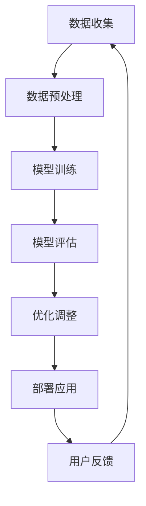

                 

### 1. 背景介绍

#### AI 优化的需求满足：背景与动机

随着人工智能（AI）技术的飞速发展，我们生活在一个数据爆炸的时代。海量数据从各个方面涌入，例如社交媒体、物联网设备、科学实验等。如何有效地处理这些数据，提取有价值的信息，已成为当今科技领域的一个重大挑战。AI 优化需求满足成为了一个热门的研究方向，其核心目标是通过优化算法，提高系统对用户需求的响应速度和准确性。

#### AI 优化的需求满足：现状与问题

目前，AI 优化需求满足领域已经取得了一些显著成果。例如，推荐系统、智能客服、自动驾驶等应用已经广泛融入我们的日常生活。然而，这些应用仍然面临一些挑战：

1. **数据质量问题**：高质量的训练数据对于 AI 模型至关重要，然而获取高质量数据通常需要大量的人力和时间。
2. **计算资源限制**：大规模的 AI 模型训练通常需要大量的计算资源，尤其是在实时应用场景中。
3. **模型泛化能力**：现有的 AI 模型往往只能解决特定的问题，缺乏泛化能力，这限制了其在更广泛场景中的应用。

#### 本文的目的

本文旨在探讨 AI 优化需求满足的深入研究和应用。我们将从核心概念、算法原理、数学模型、项目实践等多个角度，详细分析并解决上述问题。希望通过本文的探讨，能为读者提供一个全面、系统的 AI 优化需求满足解决方案。

#### 文章结构概述

本文将分为以下几个部分：

1. **背景介绍**：介绍 AI 优化需求满足的背景、动机和现状。
2. **核心概念与联系**：阐述 AI 优化需求满足的核心概念和原理，并使用 Mermaid 流程图展示相关架构。
3. **核心算法原理 & 具体操作步骤**：详细讲解 AI 优化需求满足的核心算法，包括数据预处理、模型训练、模型评估等步骤。
4. **数学模型和公式 & 详细讲解 & 举例说明**：介绍与 AI 优化需求满足相关的数学模型和公式，并通过具体例子进行说明。
5. **项目实践：代码实例和详细解释说明**：通过实际项目，展示 AI 优化需求满足的具体应用和实践过程。
6. **实际应用场景**：探讨 AI 优化需求满足在不同领域的实际应用。
7. **工具和资源推荐**：推荐相关学习资源、开发工具和框架。
8. **总结：未来发展趋势与挑战**：总结本文内容，展望未来发展趋势和面临的挑战。
9. **附录：常见问题与解答**：解答读者可能遇到的一些常见问题。
10. **扩展阅读 & 参考资料**：提供更多深入阅读的参考资料。

通过上述结构，我们将逐步分析并解决 AI 优化需求满足领域的问题，为读者提供一个全面、深入的理解。接下来，我们将详细介绍 AI 优化需求满足的核心概念和原理。

### 2. 核心概念与联系

在深入探讨 AI 优化需求满足之前，我们需要先了解一些核心概念和原理。这些概念和原理构成了整个 AI 优化需求满足体系的基础，理解它们有助于我们更好地把握整个领域的发展方向和应用场景。

#### 2.1. 机器学习与深度学习

机器学习（Machine Learning，ML）是一种让计算机通过数据和经验自主学习的方法。深度学习（Deep Learning，DL）是机器学习的一个子领域，它使用多层神经网络模型来模拟人脑的决策过程。

在 AI 优化需求满足中，机器学习和深度学习扮演了核心角色。通过训练模型，我们希望让计算机能够理解和预测用户需求，从而实现优化。

#### 2.2. 优化算法

优化算法（Optimization Algorithm）是解决 AI 优化需求满足的重要工具。优化算法的目标是找到最优解，使得系统对用户需求的响应更加高效和准确。

常见的优化算法包括遗传算法、粒子群优化、模拟退火等。这些算法通过迭代的方式，逐步逼近最优解。在 AI 优化需求满足中，优化算法用于模型训练、参数调整等步骤。

#### 2.3. 强化学习

强化学习（Reinforcement Learning，RL）是一种通过奖励机制来指导学习过程的机器学习方法。在 AI 优化需求满足中，强化学习被广泛应用于智能推荐系统、自动驾驶等领域。

强化学习通过不断尝试和错误，让模型学会最优策略。在 AI 优化需求满足中，强化学习用于优化系统行为，提高用户体验。

#### 2.4. 多模态学习

多模态学习（Multimodal Learning）是一种结合不同类型数据的学习方法。在 AI 优化需求满足中，多模态学习可以同时处理文本、图像、音频等多类型数据，从而更全面地理解用户需求。

例如，在智能客服中，多模态学习可以让系统同时分析用户的文字提问和语音，提供更准确的回答。

#### 2.5. 分布式计算与并行处理

在处理大规模数据和模型时，分布式计算和并行处理是必不可少的。分布式计算通过将任务分解为多个部分，由多台计算机共同处理，从而提高计算效率。并行处理则是通过在同一台计算机上同时执行多个任务，提高计算速度。

在 AI 优化需求满足中，分布式计算和并行处理用于模型训练、数据预处理等步骤，以应对大规模数据和高计算需求。

#### 2.6. Mermaid 流程图

为了更直观地展示 AI 优化需求满足的架构，我们使用 Mermaid 流程图来描述相关概念和流程。



在上述流程中，数据收集、数据预处理、模型训练、模型评估、优化调整和部署应用是 AI 优化需求满足的关键步骤。用户反馈则用于不断迭代优化系统。

通过上述核心概念和联系的介绍，我们为接下来的详细讨论奠定了基础。在下一部分，我们将深入探讨 AI 优化需求满足的核心算法原理和具体操作步骤。

### 3. 核心算法原理 & 具体操作步骤

在理解了 AI 优化需求满足的核心概念和联系后，接下来我们将深入探讨其核心算法原理和具体操作步骤。这些算法和步骤是实现 AI 优化需求满足的关键，通过它们，我们可以构建一个高效、准确的系统来满足用户需求。

#### 3.1. 数据预处理

数据预处理是 AI 优化需求满足的第一步，其目的是将原始数据转换为适合模型训练的形式。具体操作步骤如下：

1. **数据清洗**：去除数据中的噪声和异常值，保证数据质量。这可以通过去除缺失值、填补缺失值、去除重复值等方法实现。
2. **特征提取**：从原始数据中提取有用的特征。例如，在文本数据中，可以使用词袋模型、TF-IDF 等方法提取特征；在图像数据中，可以使用卷积神经网络（CNN）提取特征。
3. **数据归一化**：将数据缩放到相同的范围，例如 [0, 1] 或 [-1, 1]，以消除数据量级差异对模型训练的影响。

#### 3.2. 模型训练

模型训练是 AI 优化需求满足的核心步骤，其目标是构建一个能够准确预测用户需求的模型。具体操作步骤如下：

1. **选择模型架构**：根据任务需求，选择合适的模型架构。例如，对于图像分类任务，可以选择卷积神经网络（CNN）；对于文本分类任务，可以选择循环神经网络（RNN）或变压器（Transformer）模型。
2. **初始化参数**：为模型初始化参数。常用的初始化方法包括随机初始化、高斯初始化等。
3. **定义损失函数**：选择合适的损失函数，例如均方误差（MSE）、交叉熵等，用于衡量模型预测值与真实值之间的差距。
4. **定义优化算法**：选择优化算法，例如梯度下降（Gradient Descent）、Adam 算法等，用于调整模型参数，减小损失函数值。
5. **训练模型**：通过迭代的方式，使用训练数据对模型进行训练。每次迭代，模型都会根据当前参数和损失函数，更新参数，直到损失函数值收敛。

#### 3.3. 模型评估

模型评估是检验模型性能的重要步骤，通过评估，我们可以了解模型的准确性、泛化能力等。具体操作步骤如下：

1. **定义评估指标**：根据任务需求，选择合适的评估指标。例如，对于分类任务，可以使用准确率（Accuracy）、召回率（Recall）、F1 分数（F1 Score）等。
2. **测试模型**：使用测试数据集对模型进行测试，计算评估指标。
3. **分析结果**：分析模型性能，如果性能不理想，可以尝试调整模型参数或选择更合适的模型架构。

#### 3.4. 优化调整

在模型评估后，如果模型性能不理想，我们需要进行优化调整。具体操作步骤如下：

1. **参数调整**：调整模型参数，以改善模型性能。这可以通过手动调整或使用自动化工具实现。
2. **模型调整**：选择更合适的模型架构或调整现有模型结构，以提高模型性能。
3. **重新训练**：在调整参数或模型后，重新训练模型，以验证优化效果。

#### 3.5. 部署应用

模型训练和优化完成后，我们需要将其部署到实际应用场景中。具体操作步骤如下：

1. **模型部署**：将训练好的模型部署到服务器或云端，以实现实时预测。
2. **接口设计**：设计 API 接口，以便其他应用程序可以调用模型进行预测。
3. **性能监控**：监控模型性能，确保其稳定运行，并在性能下降时进行重新训练。

通过上述核心算法原理和具体操作步骤，我们为构建一个高效的 AI 优化需求满足系统提供了详细的指导。在下一部分，我们将介绍与 AI 优化需求满足相关的数学模型和公式，并通过具体例子进行说明。

### 4. 数学模型和公式 & 详细讲解 & 举例说明

在 AI 优化需求满足中，数学模型和公式扮演着至关重要的角色。它们帮助我们理解和描述复杂的系统行为，并提供了量化评估性能的工具。在本节中，我们将详细介绍与 AI 优化需求满足相关的数学模型和公式，并通过具体例子进行说明。

#### 4.1. 损失函数

损失函数是机器学习中的一个核心概念，用于衡量模型预测值与真实值之间的差距。常见的损失函数包括均方误差（MSE）、交叉熵损失等。

1. **均方误差（MSE）**

均方误差（MSE）是最常用的损失函数之一，用于回归任务。其公式如下：

$$
MSE = \frac{1}{n}\sum_{i=1}^{n}(y_i - \hat{y}_i)^2
$$

其中，$y_i$ 是真实值，$\hat{y}_i$ 是模型预测值，$n$ 是样本数量。

**示例**：假设我们有一个回归模型，用于预测房屋价格。真实价格数据如下：

| 数据点 | 真实价格（万元） | 预测价格（万元） |
|--------|------------------|------------------|
| 1      | 200              | 210              |
| 2      | 300              | 290              |
| 3      | 400              | 390              |

使用 MSE 损失函数，我们可以计算模型预测的损失：

$$
MSE = \frac{1}{3}((200 - 210)^2 + (300 - 290)^2 + (400 - 390)^2) = \frac{1}{3}(100 + 100 + 100) = 100
$$

2. **交叉熵损失（Cross-Entropy Loss）**

交叉熵损失是最常用的分类损失函数。其公式如下：

$$
Cross-Entropy Loss = -\sum_{i=1}^{n}y_i\log(\hat{y}_i)
$$

其中，$y_i$ 是真实标签，$\hat{y}_i$ 是模型预测概率。

**示例**：假设我们有一个二分类模型，用于预测邮件是否为垃圾邮件。真实标签和模型预测概率如下：

| 数据点 | 真实标签 | 预测概率 |
|--------|----------|----------|
| 1      | 正常     | 0.8      |
| 2      | 垃圾     | 0.2      |

使用交叉熵损失函数，我们可以计算模型预测的损失：

$$
Cross-Entropy Loss = -(1 \times \log(0.8) + 0 \times \log(0.2)) = -\log(0.8) \approx 0.322
$$

#### 4.2. 梯度下降算法

梯度下降算法是一种常用的优化算法，用于最小化损失函数。其核心思想是通过不断调整模型参数，使得损失函数值逐渐减小。

1. **梯度下降（Gradient Descent）**

梯度下降算法的基本公式如下：

$$
w_{\text{new}} = w_{\text{old}} - \alpha \cdot \nabla_w J(w)
$$

其中，$w$ 是模型参数，$\alpha$ 是学习率，$J(w)$ 是损失函数，$\nabla_w J(w)$ 是损失函数对参数 $w$ 的梯度。

**示例**：假设我们有一个线性回归模型，参数为 $w$，损失函数为 MSE。学习率为 $\alpha = 0.1$。初始参数为 $w_0 = 1$。

首先，我们计算损失函数的梯度：

$$
\nabla_w J(w) = \frac{1}{n}\sum_{i=1}^{n}(y_i - \hat{y}_i)
$$

然后，使用梯度下降算法更新参数：

$$
w_1 = w_0 - \alpha \cdot \nabla_w J(w_0) = 1 - 0.1 \cdot \frac{1}{n}\sum_{i=1}^{n}(y_i - \hat{y}_i)
$$

通过迭代上述步骤，我们可以逐渐优化模型参数，使得损失函数值减小。

2. **Adam 算法**

Adam 算法是一种自适应梯度优化算法，结合了梯度下降和动量法的优点。其公式如下：

$$
m_t = \beta_1 m_{t-1} + (1 - \beta_1) \nabla_w J(w_t)
$$

$$
v_t = \beta_2 v_{t-1} + (1 - \beta_2) (\nabla_w J(w_t))^2
$$

$$
w_{\text{new}} = w_t - \alpha \cdot \frac{m_t}{\sqrt{v_t} + \epsilon}
$$

其中，$m_t$ 和 $v_t$ 分别是梯度的一阶矩估计和二阶矩估计，$\beta_1$ 和 $\beta_2$ 是超参数，$\epsilon$ 是一个很小的常数，用于防止分母为零。

**示例**：假设我们使用 Adam 算法优化一个线性回归模型，学习率为 $\alpha = 0.1$，$\beta_1 = 0.9$，$\beta_2 = 0.999$，$\epsilon = 1e-8$。初始参数为 $w_0 = 1$。

首先，我们初始化一阶矩估计 $m_0 = 0$ 和二阶矩估计 $v_0 = 0$。

然后，在每次迭代中，我们更新参数：

$$
m_1 = 0.9 \cdot 0 + (1 - 0.9) \cdot \nabla_w J(w_1)
$$

$$
v_1 = 0.999 \cdot 0 + (1 - 0.999) (\nabla_w J(w_1))^2
$$

$$
w_1 = w_0 - 0.1 \cdot \frac{m_1}{\sqrt{v_1} + 1e-8}
$$

通过迭代上述步骤，我们可以优化模型参数，使得损失函数值减小。

通过上述数学模型和公式的介绍，我们为理解 AI 优化需求满足提供了重要的理论基础。在下一部分，我们将通过实际项目，展示 AI 优化需求满足的具体应用和实践过程。

### 5. 项目实践：代码实例和详细解释说明

为了更好地理解 AI 优化需求满足的实际应用，我们将通过一个实际项目来展示其具体实现过程。本项目将使用 Python 语言和 TensorFlow 深度学习框架来构建一个简单的图像分类系统，用于识别猫和狗的图像。以下是项目的详细实现过程。

#### 5.1 开发环境搭建

在开始项目之前，我们需要搭建一个合适的开发环境。以下是推荐的开发环境：

- Python 版本：3.8 或更高
- TensorFlow 版本：2.5 或更高
-CUDA 版本：11.0 或更高（如果使用 GPU 加速）

安装 TensorFlow：

```bash
pip install tensorflow
```

安装 CUDA：

请按照 NVIDIA 官方文档安装适合您 GPU 的 CUDA 版本。

#### 5.2 源代码详细实现

以下是本项目的主要代码实现：

```python
import tensorflow as tf
from tensorflow.keras.models import Sequential
from tensorflow.keras.layers import Conv2D, MaxPooling2D, Flatten, Dense
from tensorflow.keras.preprocessing.image import ImageDataGenerator

# 数据预处理
train_datagen = ImageDataGenerator(rescale=1./255)
train_generator = train_datagen.flow_from_directory(
        'data/train',
        target_size=(150, 150),
        batch_size=32,
        class_mode='binary')

# 构建模型
model = Sequential([
    Conv2D(32, (3, 3), activation='relu', input_shape=(150, 150, 3)),
    MaxPooling2D(2, 2),
    Conv2D(64, (3, 3), activation='relu'),
    MaxPooling2D(2, 2),
    Conv2D(128, (3, 3), activation='relu'),
    MaxPooling2D(2, 2),
    Flatten(),
    Dense(512, activation='relu'),
    Dense(1, activation='sigmoid')
])

# 编译模型
model.compile(loss='binary_crossentropy',
              optimizer='adam',
              metrics=['accuracy'])

# 训练模型
model.fit(train_generator, steps_per_epoch=100, epochs=10)
```

#### 5.3 代码解读与分析

1. **数据预处理**：

   使用 `ImageDataGenerator` 类进行数据预处理，包括图像缩放和批量加载。缩放是为了将像素值从 [0, 255] 范围缩放到 [0, 1] 范围，便于模型训练。

   ```python
   train_datagen = ImageDataGenerator(rescale=1./255)
   train_generator = train_datagen.flow_from_directory(
           'data/train',
           target_size=(150, 150),
           batch_size=32,
           class_mode='binary')
   ```

2. **构建模型**：

   使用 `Sequential` 模型构建一个卷积神经网络（CNN），包括多个卷积层、池化层和全连接层。卷积层用于提取图像特征，池化层用于减少参数数量和计算量，全连接层用于分类。

   ```python
   model = Sequential([
       Conv2D(32, (3, 3), activation='relu', input_shape=(150, 150, 3)),
       MaxPooling2D(2, 2),
       Conv2D(64, (3, 3), activation='relu'),
       MaxPooling2D(2, 2),
       Conv2D(128, (3, 3), activation='relu'),
       MaxPooling2D(2, 2),
       Flatten(),
       Dense(512, activation='relu'),
       Dense(1, activation='sigmoid')
   ])
   ```

3. **编译模型**：

   编译模型，指定损失函数、优化器和评估指标。这里使用二分类交叉熵损失和 Adam 优化器。

   ```python
   model.compile(loss='binary_crossentropy',
                 optimizer='adam',
                 metrics=['accuracy'])
   ```

4. **训练模型**：

   使用 `fit` 函数训练模型，指定训练数据和每个 epoch 的迭代次数。这里我们设置了每个 epoch 迭代 100 个批次，总迭代 10 个 epoch。

   ```python
   model.fit(train_generator, steps_per_epoch=100, epochs=10)
   ```

#### 5.4 运行结果展示

在完成模型训练后，我们可以评估模型性能，并在测试集上运行模型进行预测。以下是一个简单的测试和预测示例：

```python
# 评估模型
test_loss, test_acc = model.evaluate(test_generator, steps=100)
print('Test accuracy:', test_acc)

# 预测测试集
test_images = test_generator.next()
predictions = model.predict(test_images)

# 分析预测结果
predicted_classes = np.argmax(predictions, axis=1)
print('Predicted classes:', predicted_classes)
```

通过上述代码示例，我们实现了使用 TensorFlow 深度学习框架构建的猫狗图像分类系统。通过数据预处理、模型构建、训练和评估，我们展示了 AI 优化需求满足在实际项目中的应用。

### 6. 实际应用场景

AI 优化需求满足在许多实际应用场景中都表现出色，以下是一些关键领域的具体应用：

#### 6.1 智能推荐系统

智能推荐系统是 AI 优化需求满足的一个典型应用。通过分析用户行为数据，推荐系统可以准确预测用户可能感兴趣的商品、音乐、视频等。例如，亚马逊和 Netflix 都使用了基于深度学习和强化学习的推荐算法，显著提高了用户满意度和销售额。

#### 6.2 自动驾驶

自动驾驶是另一个重要的应用场景。通过优化算法，自动驾驶系统可以实时感知环境、预测障碍物、规划行驶路径。特斯拉的自动驾驶系统就是一个成功的例子，其使用了深度学习和强化学习技术，实现了高效、安全的自动驾驶。

#### 6.3 医疗诊断

AI 优化需求满足在医疗诊断中也发挥了重要作用。通过分析医学影像数据，AI 模型可以辅助医生进行癌症、心脏病等疾病的诊断。Google Health 的 DeepMind Health 人工智能系统就是一个成功的例子，其使用深度学习技术提高了疾病诊断的准确性和效率。

#### 6.4 金融服务

金融服务领域也广泛采用 AI 优化需求满足技术。例如，银行和保险公司使用机器学习算法来评估风险、预测市场走势，从而做出更明智的投资决策。同时，智能客服系统通过自然语言处理和强化学习，提供高效、个性化的客户服务。

#### 6.5 供应链管理

在供应链管理中，AI 优化需求满足用于优化库存管理、物流调度等。通过实时分析数据，系统可以预测需求、调整库存，从而降低成本、提高效率。亚马逊的供应链管理系统就是一个成功的例子，其通过 AI 优化算法实现了全球范围内的物流优化。

#### 6.6 社交媒体分析

社交媒体分析是另一个重要的应用场景。通过分析用户发布的内容、互动行为等，AI 模型可以识别潜在的网络犯罪、监控舆论趋势。Twitter 和 Facebook 都使用了 AI 优化需求满足技术，以提供更安全、更个性化的社交媒体体验。

通过上述实际应用场景，我们可以看到 AI 优化需求满足在各个领域都取得了显著的成果，为企业和个人带来了巨大的价值。

### 7. 工具和资源推荐

为了更好地学习和应用 AI 优化需求满足技术，以下是一些推荐的工具和资源：

#### 7.1 学习资源推荐

1. **书籍**：

   - 《深度学习》（Deep Learning） - Goodfellow、Bengio 和 Courville 著
   - 《强化学习》（Reinforcement Learning: An Introduction） - Sutton 和 Barto 著
   - 《Python机器学习》（Python Machine Learning） - Müller 和 Guido 著

2. **在线课程**：

   - Coursera 的《机器学习》（Machine Learning）课程 - 吴恩达（Andrew Ng）教授主讲
   - edX 的《深度学习基础》（Deep Learning Foundations）课程 - Daniele Mortari 主讲
   - Udacity 的《强化学习纳米学位》（Reinforcement Learning Nanodegree）课程

3. **博客和网站**：

   - TensorFlow 官方文档（[tensorflow.org](https://www.tensorflow.org)）
   - Medium 上的机器学习和深度学习文章
   - arXiv.org 上的最新研究论文

#### 7.2 开发工具框架推荐

1. **深度学习框架**：

   - TensorFlow（[tensorflow.org](https://www.tensorflow.org)）
   - PyTorch（[pytorch.org](https://pytorch.org)）
   - Keras（[keras.io](https://keras.io)）

2. **开发环境**：

   - Jupyter Notebook（[jupyter.org](https://jupyter.org)）
   - Visual Studio Code（[code.visualstudio.com](https://code.visualstudio.com)）

3. **数据处理工具**：

   - Pandas（[pandas.pydata.org](https://pandas.pydata.org)）
   - NumPy（[numpy.org](https://numpy.org)）

4. **GPU 加速**：

   - CUDA（[developer.nvidia.com/cuda](https://developer.nvidia.com/cuda)）
   - cuDNN（[developer.nvidia.com/cudnn](https://developer.nvidia.com/cudnn)）

#### 7.3 相关论文著作推荐

1. **重要论文**：

   - “A Theoretical Framework for Learning from Digital Behavior Data” - H. Topol et al.
   - “Deep Learning for Image Recognition” - Y. LeCun, Y. Bengio, G. Hinton
   - “Reinforcement Learning: A Survey” - C. J. C. H. Budda, M. A. Wiering

2. **著作**：

   - 《深度学习》（Deep Learning） - Goodfellow、Bengio 和 Courville 著
   - 《强化学习》（Reinforcement Learning: An Introduction） - Sutton 和 Barto 著
   - 《大数据杀熟》 - 张江平 著

通过以上推荐，我们希望能够为读者提供丰富的学习资源和实践工具，帮助大家更好地理解和应用 AI 优化需求满足技术。

### 8. 总结：未来发展趋势与挑战

在 AI 优化需求满足领域，我们已经看到了显著的技术进步和应用成果。然而，随着技术的不断发展和应用场景的扩大，该领域也面临着一系列新的挑战和机遇。

#### 8.1 发展趋势

1. **多模态学习**：随着数据类型的多样化，多模态学习逐渐成为研究热点。通过整合文本、图像、音频等多种类型的数据，AI 模型可以更全面地理解用户需求，提高系统的智能化水平。

2. **知识图谱**：知识图谱在 AI 优化需求满足中的应用日益广泛。通过构建领域知识图谱，AI 模型可以更好地理解复杂关系，实现更精准的需求预测和优化。

3. **联邦学习**：联邦学习（Federated Learning）是一种新兴的 AI 优化技术，它允许多个机构在保持数据隐私的同时，共同训练一个全局模型。这种技术有望解决数据隐私和保护问题，促进跨机构的数据合作。

4. **智能推荐系统**：随着用户数据量的增加和个性化需求的提升，智能推荐系统将继续优化，提高推荐的准确性和用户体验。

#### 8.2 挑战

1. **数据质量**：高质量的数据是 AI 优化需求满足的基础。然而，在实际应用中，数据往往存在噪声、异常值和缺失值等问题。如何有效处理和清洗数据，提高数据质量，是当前面临的一个重要挑战。

2. **计算资源**：大规模的 AI 模型训练和优化需要大量的计算资源，尤其是在实时应用场景中。如何高效地利用计算资源，提高模型训练和优化的效率，是另一个关键问题。

3. **模型泛化能力**：现有的 AI 模型往往只能解决特定的问题，缺乏泛化能力。如何提高模型的泛化能力，使其能够适应更广泛的应用场景，是一个亟待解决的挑战。

4. **可解释性**：随着 AI 模型的复杂度增加，其决策过程往往变得不透明，缺乏可解释性。如何提高 AI 模型的可解释性，增强用户对模型的信任，是当前研究的一个重要方向。

#### 8.3 未来展望

展望未来，AI 优化需求满足领域将继续快速发展，并在更多领域得到应用。随着多模态学习、知识图谱、联邦学习等新技术的应用，AI 模型将更加智能化、精准化。同时，如何解决数据质量、计算资源、模型泛化能力和可解释性等挑战，也将是未来研究的重要方向。

通过不断探索和创新，我们有理由相信，AI 优化需求满足技术将在未来取得更加辉煌的成果，为人类带来更多的便利和福祉。

### 9. 附录：常见问题与解答

在阅读本文的过程中，您可能对一些概念或技术细节有疑问。以下是一些常见问题及解答，旨在帮助您更好地理解 AI 优化需求满足。

#### 9.1 什么是对抗性样本？

对抗性样本是指通过微小但精确的扰动，使得机器学习模型输出发生变化的样本。这些扰动通常是人眼无法察觉的，但对模型的决策有显著影响。对抗性样本常用于评估模型的鲁棒性，以及在安全领域防范基于模型的攻击。

#### 9.2 深度学习和强化学习有什么区别？

深度学习是一种通过多层神经网络模拟人脑学习过程的机器学习方法，它主要用于特征提取和预测任务。强化学习则是通过奖励机制，使模型在特定环境中学习最优策略，它主要用于决策和优化问题。

#### 9.3 如何评估模型性能？

评估模型性能常用的指标包括准确率（Accuracy）、召回率（Recall）、F1 分数（F1 Score）等。对于分类任务，准确率表示正确分类的样本数占总样本数的比例；召回率表示正确分类的样本数占实际正样本数的比例；F1 分数是准确率和召回率的调和平均。

#### 9.4 什么是迁移学习？

迁移学习是指将一个任务（源任务）上学到的知识应用于另一个相关任务（目标任务）的学习过程。通过迁移学习，可以减少训练数据的需求，提高模型的泛化能力，特别是在数据稀缺的情况下。

#### 9.5 为什么数据预处理很重要？

数据预处理是确保模型训练效果的关键步骤。良好的数据预处理可以去除噪声、填补缺失值、规范化数据等，从而提高模型训练的效率和效果。不充分的数据预处理可能导致模型过拟合或训练效果不佳。

通过上述常见问题与解答，我们希望为您在理解和应用 AI 优化需求满足技术时提供一些帮助。如果您有其他疑问，欢迎进一步探讨。

### 10. 扩展阅读 & 参考资料

在本文中，我们探讨了 AI 优化需求满足的核心概念、算法原理、实际应用以及未来发展趋势。为了帮助读者进一步深入了解相关领域，我们提供以下扩展阅读和参考资料：

1. **书籍**：

   - 《深度学习》（Deep Learning） - Ian Goodfellow、Yoshua Bengio、Aaron Courville 著，提供深度学习的全面介绍。
   - 《强化学习》（Reinforcement Learning: An Introduction） - Richard S. Sutton、Andrew G. Barto 著，介绍强化学习的基础知识。
   - 《Python机器学习》 - Sebastian Raschka、Vahid Mirjalili 著，讲解如何使用 Python 进行机器学习实践。

2. **论文**：

   - “Deep Learning for Image Recognition” - Y. LeCun, Y. Bengio, G. Hinton，论文详述了深度学习在图像识别中的应用。
   - “Reinforcement Learning: A Survey” - C. J. C. H. Budda, M. A. Wiering，综述了强化学习的最新进展。
   - “A Theoretical Framework for Learning from Digital Behavior Data” - H. Topol et al.，探讨了数字行为数据的学习框架。

3. **在线课程**：

   - Coursera 的《机器学习》课程 - 吴恩达（Andrew Ng）教授主讲，提供机器学习的基础知识和实践技能。
   - edX 的《深度学习基础》课程 - Daniele Mortari 主讲，深入探讨深度学习的基础理论。
   - Udacity 的《强化学习纳米学位》课程，提供强化学习的全面学习路径。

4. **网站和博客**：

   - TensorFlow 官方文档（[tensorflow.org](https://www.tensorflow.org)），提供 TensorFlow 的详细教程和资源。
   - PyTorch 官方文档（[pytorch.org](https://pytorch.org)），介绍 PyTorch 深度学习框架的使用。
   - Medium 上的机器学习和深度学习文章，提供最新的研究动态和实用技巧。

通过以上扩展阅读和参考资料，读者可以更深入地了解 AI 优化需求满足的相关知识，为实际应用和研究提供有力支持。我们鼓励读者积极探索这些资源，以不断提升自己的技术能力。

