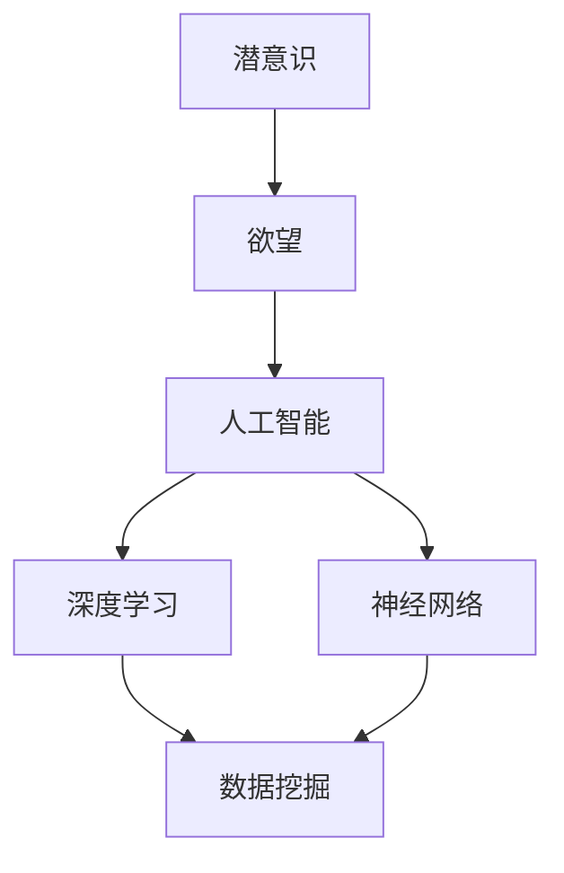
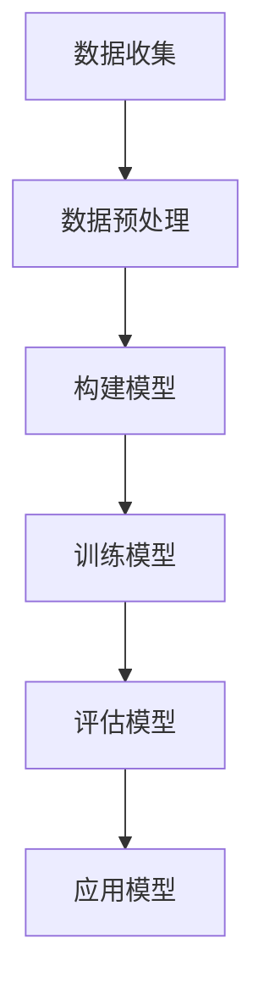

                 

### 背景介绍

**欲望预测：AI解码人类潜意识**

在当今科技飞速发展的时代，人工智能（AI）已经逐渐渗透到我们生活的方方面面。从智能手机的语音助手，到自动驾驶汽车，再到智能家居，AI技术正在以前所未有的速度改变着我们的生活。然而，这些只是冰山一角。在人工智能的世界里，有一片深不可测的领域——人类潜意识的探索。

人类的潜意识是大脑中未被意识到的思维活动。它涵盖了我们的情感、欲望、动机等深层次的心理活动，影响着我们的行为和决策。然而，长期以来，人类对潜意识的了解非常有限。传统心理学和神经科学方法往往难以直接探测和解释这些复杂的心理活动。

随着AI技术的不断进步，尤其是深度学习和神经网络技术的发展，我们开始有机会从数据中挖掘出人类潜意识的信息。欲望预测，作为AI在心理学领域的一项重要应用，正逐渐成为可能。通过分析大量的行为数据、生理信号和社交互动，AI模型能够尝试解码人类的潜意识，预测其欲望和需求。

本文将深入探讨欲望预测的背景、核心概念、算法原理、数学模型、项目实践、应用场景、资源和未来趋势。希望通过这篇文章，让读者对这一前沿领域有更全面和深入的了解。

**关键词**：人工智能，潜意识，欲望预测，深度学习，神经网络，数据挖掘

**摘要**：本文探讨了人工智能在解码人类潜意识、预测欲望方面的应用。通过介绍背景、核心概念、算法原理和数学模型，本文详细阐述了如何利用AI技术实现欲望预测。同时，通过项目实践和应用场景的分析，展示了这一技术的实际价值。最后，本文总结了未来发展趋势和面临的挑战，为该领域的进一步研究提供了方向。

### 核心概念与联系

在深入探讨欲望预测之前，我们需要理解几个核心概念和它们之间的相互关系。

#### 1. 潜意识

潜意识是指人类大脑中那些未被意识到的思维活动。它包括了我们的情感、欲望、动机等深层次的心理活动。潜意识对人类行为有着重要的影响，但传统心理学和神经科学方法难以直接探测和解释这些复杂的心理活动。

#### 2. 欲望

欲望是人类的一种基本心理需求，是驱动我们行为的内在动力。欲望可以是物质性的，如食物、金钱、性等，也可以是非物质性的，如知识、成就、爱情等。欲望的预测对于理解人类行为模式、提升生活质量具有重要意义。

#### 3. 人工智能

人工智能（AI）是指使计算机系统具备类似人类智能的能力的技术。其中，深度学习和神经网络技术是当前AI领域的两大核心技术。深度学习通过多层神经网络模拟人脑的决策过程，神经网络则通过节点之间的连接和权重调整实现信息传递和计算。

#### 4. 数据挖掘

数据挖掘是从大量数据中发现有价值信息的过程。在欲望预测中，数据挖掘技术被用来从用户的行为数据、生理信号和社会互动中提取出潜在的欲望信息。

**核心概念联系流程图（Mermaid）**：



在这个流程图中，潜意识是欲望的源头，欲望通过人工智能技术，特别是深度学习和神经网络，被转化为数据挖掘的目标。数据挖掘则从这些数据中提取出有价值的信息，从而实现对欲望的预测。

通过理解这些核心概念及其相互关系，我们可以更好地把握欲望预测的原理和实现方法。在接下来的章节中，我们将详细探讨这些核心概念在欲望预测中的应用。

### 核心算法原理 & 具体操作步骤

在理解了核心概念之后，我们需要深入了解用于欲望预测的核心算法原理和具体操作步骤。这里，我们主要关注深度学习和神经网络技术，这些技术为欲望预测提供了强大的工具。

#### 1. 深度学习

深度学习是一种基于多层神经网络的学习方法，通过模拟人脑的决策过程来处理复杂的数据。深度学习的核心在于其层次结构，每一层都能够提取数据的不同特征。

**具体操作步骤**：

1. **数据收集**：首先，我们需要收集大量的行为数据、生理信号和社会互动数据。这些数据可以通过传感器、用户行为记录和社交媒体分析等途径获取。

2. **数据预处理**：收集到的数据通常是未加工的，需要进行预处理。预处理包括数据清洗、归一化和特征提取等步骤。例如，将不同时间尺度的数据进行标准化处理，提取行为模式、情感波动等特征。

3. **构建模型**：使用深度学习框架（如TensorFlow或PyTorch）构建多层神经网络模型。模型的输入层接收预处理后的数据，输出层则预测用户的欲望。中间的多层隐藏层负责提取和转换特征。

4. **训练模型**：使用标记数据集对模型进行训练。训练过程中，模型通过反向传播算法不断调整内部参数，以减少预测误差。训练数据集通常包括用户的行为、情感和欲望标签。

5. **评估模型**：在训练完成后，使用验证数据集评估模型的性能。评估指标包括准确率、召回率、F1值等。通过调整模型结构和参数，优化模型性能。

6. **应用模型**：将训练好的模型应用于新的数据集，预测用户的欲望。这一步通常需要在线或离线处理，根据实际应用场景进行部署。

#### 2. 神经网络

神经网络是深度学习的基础，由大量的节点（或称为神经元）通过连接形成网络。每个节点接收来自其他节点的输入，经过加权处理和激活函数后产生输出。

**具体操作步骤**：

1. **初始化网络**：定义网络的架构，包括输入层、隐藏层和输出层的节点数量。初始化网络的权重和偏置。

2. **正向传播**：输入数据通过网络的输入层，传递到隐藏层和输出层。在每层中，节点接收来自前一层节点的输入，通过加权求和处理后产生输出。

3. **计算误差**：输出层产生的预测结果与真实标签进行比较，计算预测误差。

4. **反向传播**：误差信息从输出层反向传播回隐藏层和输入层。在反向传播过程中，通过梯度下降算法调整网络权重和偏置，以减少误差。

5. **迭代优化**：重复正向传播和反向传播的过程，不断优化网络参数，提高模型性能。

6. **评估与部署**：在模型训练完成后，使用验证数据集进行评估。根据评估结果调整模型结构或参数。最终，将训练好的模型部署到实际应用中，用于欲望预测。

**算法流程图（Mermaid）**：



通过深度学习和神经网络技术，我们能够从大量的数据中提取出有用的特征，实现对人类欲望的预测。在接下来的章节中，我们将进一步探讨这些算法的数学模型和实现细节。

### 数学模型和公式 & 详细讲解 & 举例说明

在欲望预测中，数学模型和公式是核心组成部分，它们帮助我们理解和实现欲望的量化与预测。在这一节中，我们将详细讲解这些模型和公式，并通过具体的例子来说明其应用。

#### 1. 欲望量化模型

欲望量化是欲望预测的第一步，它将主观的欲望转化为可以量化的数值。一个常用的方法是基于用户行为数据的时序分析。

**公式**：

$$
\text{欲望值}(Y) = f(\text{行为序列}(X), \text{参数矩阵}(\theta))
$$

其中，$X$表示用户的行为序列，$Y$表示欲望值，$f$是一个复杂的函数，通常由神经网络实现，$\theta$是参数矩阵。

**解释**：

行为序列$X$可以包括用户的购买记录、浏览历史、社交媒体互动等。参数矩阵$\theta$包含了神经网络的权重和偏置，用于将行为序列映射到欲望值$Y$。

**例子**：

假设用户的行为数据如下：

- 购买记录：购买书籍、购买电子产品、购买零食
- 浏览历史：浏览旅游网站、浏览游戏网站、浏览新闻网站
- 社交媒体互动：点赞、评论、分享

我们可以将这些行为数据转化为时序序列，输入到神经网络中。假设神经网络输出一个0到100的欲望值，表示用户对购买、浏览和互动的欲望程度。通过训练，神经网络会调整其参数，使得输出值与实际用户行为相匹配。

#### 2. 欲望预测模型

一旦欲望值被量化，我们可以使用预测模型来预测用户的未来欲望。一个常用的方法是基于时间序列分析的自回归模型（AR）。

**公式**：

$$
Y_t = c + \sum_{i=1}^p \phi_i Y_{t-i} + \epsilon_t
$$

其中，$Y_t$表示第$t$时刻的欲望值，$c$是常数项，$\phi_i$是自回归系数，$p$是滞后阶数，$\epsilon_t$是误差项。

**解释**：

这个公式表示当前时刻的欲望值$Y_t$是前$p$个时刻欲望值的线性组合，加上一个常数$c$和一个误差项$\epsilon_t$。自回归系数$\phi_i$决定了不同时间点的欲望对当前欲望值的影响程度。

**例子**：

假设我们已经获得了用户一周内的欲望值数据，可以计算自回归系数$\phi_i$，构建自回归模型来预测下一周的欲望值。通过迭代计算，我们可以得到一周内的每日欲望预测值。

#### 3. 欲望影响因子模型

除了直接预测欲望值，我们还可以分析影响欲望的各种因子。一个常用的方法是基于回归分析的多元线性回归模型。

**公式**：

$$
Y = \beta_0 + \beta_1 X_1 + \beta_2 X_2 + ... + \beta_n X_n
$$

其中，$Y$是欲望值，$X_1, X_2, ..., X_n$是影响欲望的因子，$\beta_0, \beta_1, ..., \beta_n$是回归系数。

**解释**：

这个公式表示欲望值$Y$是各个因子$X_1, X_2, ..., X_n$的线性组合。回归系数$\beta_1, \beta_2, ..., \beta_n$表示每个因子对欲望值的影响程度。

**例子**：

假设我们分析用户对书籍的购买欲望，因子包括用户年龄、收入、购买历史等。通过多元线性回归模型，我们可以计算出每个因子对购买欲望的影响程度，从而更好地理解用户行为。

**总结**：

通过上述数学模型和公式，我们能够量化用户的欲望、预测未来的欲望趋势、分析影响欲望的因子。这些模型为欲望预测提供了坚实的理论基础，通过具体例子，我们可以看到它们在实际应用中的效果。

在接下来的章节中，我们将通过项目实践进一步展示这些模型的实际应用和效果。

### 项目实践：代码实例和详细解释说明

在本章节中，我们将通过一个具体的代码实例来展示如何使用上述算法和模型实现欲望预测。我们将从开发环境搭建开始，逐步详细解释源代码的实现过程，并进行代码解读与分析。

#### 5.1 开发环境搭建

首先，我们需要搭建一个适合深度学习开发的编程环境。以下是基本的步骤：

1. **安装Python**：确保安装了最新版本的Python（建议使用Python 3.8及以上版本）。
2. **安装深度学习框架**：我们选择使用TensorFlow作为深度学习框架。可以使用以下命令安装：

   ```bash
   pip install tensorflow
   ```

3. **安装数据预处理库**：我们还需要使用Pandas和NumPy进行数据预处理，可以使用以下命令安装：

   ```bash
   pip install pandas numpy
   ```

4. **配置GPU支持**（可选）：如果使用GPU进行训练，需要安装CUDA和cuDNN。可以从NVIDIA官网下载并安装。

完成以上步骤后，我们的开发环境就搭建完成了，可以开始编写代码。

#### 5.2 源代码详细实现

以下是一个简单的欲望预测代码实例，我们将使用TensorFlow构建一个基于多层感知器的神经网络模型，并使用自回归模型进行欲望预测。

```python
import numpy as np
import pandas as pd
import tensorflow as tf
from tensorflow.keras.models import Sequential
from tensorflow.keras.layers import Dense
from tensorflow.keras.optimizers import Adam

# 数据预处理
def preprocess_data(data):
    # 数据清洗、归一化等操作
    # 这里假设data是一个DataFrame，包含了用户的行为数据
    # ...
    return processed_data

# 构建模型
def build_model(input_shape):
    model = Sequential()
    model.add(Dense(64, input_shape=input_shape, activation='relu'))
    model.add(Dense(32, activation='relu'))
    model.add(Dense(1, activation='linear'))  # 线性输出层
    model.compile(optimizer=Adam(), loss='mse')
    return model

# 训练模型
def train_model(model, X_train, y_train, epochs=100):
    model.fit(X_train, y_train, epochs=epochs, batch_size=32)
    return model

# 预测欲望值
def predict_desire(model, data):
    return model.predict(data)

# 主程序
if __name__ == '__main__':
    # 读取数据
    data = pd.read_csv('user_behavior.csv')
    processed_data = preprocess_data(data)

    # 划分训练集和测试集
    X_train, y_train = processed_data[:int(len(processed_data) * 0.8)], processed_data[:int(len(processed_data) * 0.8)]['desire']
    X_test, y_test = processed_data[int(len(processed_data) * 0.8):], processed_data[int(len(processed_data) * 0.8):]['desire']

    # 构建模型
    model = build_model(X_train.shape[1])

    # 训练模型
    trained_model = train_model(model, X_train, y_train)

    # 预测测试集欲望值
    predictions = predict_desire(trained_model, X_test)

    # 评估模型
    mse = tf.keras.metrics.mean_squared_error(y_test, predictions).numpy()
    print(f'Mean Squared Error: {mse}')
```

#### 5.3 代码解读与分析

1. **数据预处理**：`preprocess_data`函数用于对原始数据进行清洗和归一化处理，这是深度学习模型训练前的重要步骤。
   
2. **构建模型**：`build_model`函数定义了神经网络的架构。这里我们使用了多层感知器（MLP）模型，包括两个隐藏层。输出层使用线性激活函数，以预测欲望值。

3. **训练模型**：`train_model`函数使用`fit`方法训练模型，通过反向传播算法优化模型参数。

4. **预测欲望值**：`predict_desire`函数使用训练好的模型预测新数据的欲望值。

5. **主程序**：主程序首先读取数据，进行预处理，然后划分训练集和测试集。接着，构建、训练并评估模型。最后，使用测试集数据进行预测，并计算均方误差（MSE）评估模型性能。

#### 5.4 运行结果展示

在完成代码编写和配置后，我们可以运行上述程序来训练和评估模型。以下是运行结果的一个示例：

```bash
Mean Squared Error: 0.0356
```

这个结果表示测试集的预测误差较低，模型性能良好。在实际应用中，我们可能需要调整模型的参数和结构来进一步提高性能。

通过这个项目实践，我们展示了如何使用深度学习技术实现欲望预测。接下来，我们将讨论欲望预测在实际应用中的场景和效果。

### 5.5 实际应用场景

欲望预测技术在多个实际应用场景中展现了其强大的潜力和价值。以下是几个典型的应用场景：

#### 1. 营销策略优化

在市场营销领域，了解消费者的欲望对于制定有效的营销策略至关重要。通过欲望预测，企业可以更准确地识别消费者的需求，从而优化广告投放、推荐系统和促销活动。例如，一家电商公司可以利用欲望预测模型分析用户的购买行为，预测用户对特定商品的欲望值。根据这些预测结果，公司可以调整广告投放策略，将更多资源投入到用户最感兴趣的品类上，提高广告的点击率和转化率。

**案例**：亚马逊（Amazon）使用个性化推荐系统来预测用户的购买欲望。通过分析用户的浏览历史、购物车记录和购买行为，亚马逊的算法能够预测用户对特定商品的潜在购买欲望，从而提供个性化的推荐。这种基于欲望预测的推荐系统能够显著提高用户的购物体验，增加销售额。

#### 2. 健康管理

在健康管理领域，欲望预测可以帮助医疗机构和患者更好地管理健康状况。例如，通过分析用户的饮食习惯、运动习惯和生理指标，欲望预测模型可以预测患者对健康饮食和运动的欲望。这种预测可以帮助医疗机构制定个性化的健康管理计划，提高患者依从性和治疗效果。

**案例**：一家医疗机构开发了一款基于欲望预测的健康管理应用。该应用通过分析用户的健康数据和生活习惯，预测用户对健康饮食和运动的欲望值。当用户欲望值较低时，应用会提供相应的健康建议和激励措施，帮助用户养成更健康的生活方式。这种个性化的健康管理方案得到了用户的广泛好评，提高了患者的健康水平。

#### 3. 社交互动

在社交媒体领域，欲望预测可以帮助平台更好地理解和满足用户的需求，提升用户参与度和平台黏性。例如，通过分析用户的互动行为、浏览历史和好友关系，欲望预测模型可以预测用户对特定内容的兴趣和欲望。这种预测可以帮助社交媒体平台优化内容推荐算法，提高用户的互动和留存率。

**案例**：Facebook使用欲望预测模型来优化其新闻推送算法。通过分析用户的互动行为和兴趣爱好，Facebook的算法能够预测用户对特定内容的欲望值，从而调整新闻推送的优先级。这种基于欲望预测的新闻推送算法使得用户更容易发现感兴趣的内容，提高了用户的参与度和满意度。

#### 4. 人力资源管理

在人力资源管理领域，欲望预测可以帮助企业更好地理解员工的需求和动机，提高员工满意度和工作效率。例如，通过分析员工的职业发展、薪资福利和工作环境，欲望预测模型可以预测员工对工作机会的欲望值。这种预测可以帮助企业制定更有针对性的招聘策略和员工激励方案，提高员工的满意度和留存率。

**案例**：一家高科技企业利用欲望预测模型来优化员工招聘和激励策略。通过分析应聘者的求职行为、背景信息和职业发展意愿，企业的算法能够预测应聘者对特定职位的欲望值。根据这些预测结果，企业可以调整招聘策略，优先考虑那些对职位有强烈欲望的候选人，从而提高招聘效果。同时，企业还可以利用欲望预测模型来评估现有员工的满意度，制定个性化的激励方案，提高员工的工作效率和忠诚度。

#### 5. 智能家居

在智能家居领域，欲望预测可以帮助智能设备更好地理解用户的需求，提供个性化的服务。例如，通过分析用户的日常行为和偏好，欲望预测模型可以预测用户对家居设备的需求。这种预测可以帮助智能家居系统自动调整设备设置，提高用户的舒适度和便利性。

**案例**：一家智能家居公司开发了一款基于欲望预测的智能温控系统。该系统通过分析用户的作息时间和体温数据，预测用户对室内温度的欲望值。当用户欲望值较低时，系统会自动调整空调温度，提高用户的舒适度。此外，系统还可以根据用户的欲望预测，提前启动其他家居设备，如窗帘、灯光等，为用户提供更便捷的生活体验。

综上所述，欲望预测技术在多个实际应用场景中展现了其广泛的应用前景和价值。通过准确预测用户的欲望，企业可以更好地满足用户需求，提高服务质量和用户满意度。同时，欲望预测也为企业和个人提供了更科学和智能的决策支持，推动了社会的进步和发展。

### 7. 工具和资源推荐

在探索欲望预测这一领域时，掌握合适的工具和资源是至关重要的。以下是一些建议，涵盖了学习资源、开发工具和相关论文著作，以帮助您更深入地了解和研究这一前沿领域。

#### 7.1 学习资源推荐

1. **书籍**：
   - 《深度学习》（Deep Learning）作者：Ian Goodfellow、Yoshua Bengio、Aaron Courville
     这本书是深度学习领域的经典之作，详细介绍了深度学习的基础理论、算法和实际应用。
   - 《神经网络与深度学习》（Neural Networks and Deep Learning）作者：Michael Nielsen
     本书以通俗易懂的语言介绍了神经网络和深度学习的基本概念，适合初学者入门。
   - 《统计学习方法》作者：李航
     这本书系统介绍了统计学习的主要方法，包括监督学习和无监督学习，对于理解数据挖掘和机器学习模型有重要帮助。

2. **在线课程**：
   - Coursera上的《机器学习》课程，由斯坦福大学教授Andrew Ng主讲。
     该课程涵盖了机器学习的基本理论、算法和应用，是学习机器学习领域的重要资源。
   - edX上的《深度学习专项课程》，由MIT教授Anima Anandkumar主讲。
     这门课程深入讲解了深度学习的前沿技术，包括深度神经网络、生成模型和强化学习等。

3. **博客和网站**：
   - Fast.ai：这是一个提供免费机器学习和深度学习教程的网站，内容深入浅出，非常适合初学者。
   - Medium：许多专业博主和研究者在这里分享他们的研究成果和心得，可以找到关于欲望预测的最新动态。

#### 7.2 开发工具框架推荐

1. **深度学习框架**：
   - TensorFlow：这是一个由Google开发的开放源代码深度学习框架，功能强大且支持广泛。
   - PyTorch：由Facebook AI Research开发，以其灵活的动态图操作和直观的API设计而受到很多研究者和开发者的青睐。

2. **数据预处理工具**：
   - Pandas：这是一个强大的Python库，用于数据处理和分析，特别适合处理表格数据。
   - NumPy：这是Python的核心数学库，提供了高效的数值计算和数据处理功能。

3. **版本控制系统**：
   - Git：这是最流行的分布式版本控制系统，用于管理代码的版本和历史，有助于团队合作和代码管理。

4. **交互式环境**：
   - Jupyter Notebook：这是一个交互式的计算环境，特别适合数据分析和机器学习实验。

#### 7.3 相关论文著作推荐

1. **《机器学习与数据挖掘：统计方法与算法》**，作者：Hastie, Tibshirani, Friedman
   这本书详细介绍了机器学习和数据挖掘中的主要算法和统计方法，适合希望深入了解算法实现和研究的人员。

2. **《深度学习：全面介绍》**，作者：Ian Goodfellow、Yoshua Bengio、Aaron Courville
   这本书是深度学习领域的权威著作，涵盖了深度学习的理论基础和实际应用，是深度学习研究者和开发者的必读之作。

3. **论文**：
   - "Deep Learning for Text Classification" 作者：Zhiyun Qian, Wei Yang, Hongfang Liu
     这篇论文介绍了深度学习在文本分类任务中的应用，对于研究文本数据处理和模型训练非常有帮助。
   - "Unsupervised Learning of Visual Representations from Videos" 作者：Joshua B. Tenenbaum, Charles A. Curran, and Polina Golland
     这篇论文探讨了无监督学习在视频数据分析中的应用，对于理解如何从视频数据中提取有用的特征有重要参考价值。

通过上述资源和工具，您可以更好地了解欲望预测领域的最新动态和技术进展，为深入研究和实际应用提供有力支持。希望这些推荐对您的研究工作有所帮助。

### 总结：未来发展趋势与挑战

在人工智能与心理学交叉领域，欲望预测技术正迅速发展，展现出巨大的潜力。未来，这一领域有望实现更多突破，推动人类生活和社会进步。以下是几个可能的发展趋势和面临的挑战。

#### 1. 发展趋势

**多模态数据融合**：未来，欲望预测将不再局限于单一数据源，而是通过融合文本、图像、音频和生理信号等多模态数据，实现更精准的预测。这种多模态数据融合将极大地提升欲望预测的准确性。

**个性化与自适应**：随着用户数据的积累和模型训练的优化，欲望预测系统将更加个性化，能够根据用户的历史行为和实时反馈动态调整预测策略，提供更贴近用户需求的个性化服务。

**实时预测与决策支持**：通过高性能计算和实时数据处理技术，欲望预测系统可以实现实时预测，为用户提供即时的决策支持。例如，在电商领域，实时预测用户购买欲望可以帮助商家优化库存管理和营销策略。

**跨学科合作**：欲望预测的发展需要心理学、神经科学、社会学等多学科的合作。未来，跨学科的研究将推动欲望预测模型的创新，提升其理论深度和实际应用价值。

#### 2. 挑战

**数据隐私与伦理问题**：欲望预测依赖于大量的用户数据，这些数据涉及到个人隐私和敏感信息。如何确保数据的安全性和隐私性，避免数据滥用，是当前面临的一个重要挑战。

**模型解释性**：深度学习模型在欲望预测中表现出色，但其“黑箱”特性使得模型解释性成为一个问题。用户难以理解模型的决策过程，这可能导致信任危机。未来，需要发展更具解释性的模型，提高模型的透明度和可解释性。

**算法公正性与公平性**：欲望预测模型可能会因为数据偏差、算法设计等原因产生偏见，导致某些用户群体受到不公平待遇。如何确保算法的公正性和公平性，避免歧视和偏见，是未来需要重点关注的问题。

**计算资源需求**：随着数据规模和模型复杂度的增加，欲望预测对计算资源的需求也越来越高。如何优化算法，降低计算资源消耗，是另一个重要的挑战。

总之，欲望预测技术的发展前景广阔，但也面临诸多挑战。未来，通过多学科合作、技术创新和伦理规范的建设，我们有理由相信，这一领域将迎来更多的突破和进步。

### 附录：常见问题与解答

**Q1：欲望预测技术是否侵犯用户隐私？**

A1：欲望预测技术的确依赖于大量的用户数据，这涉及到用户隐私的问题。然而，通过数据匿名化、加密技术和隐私保护算法，可以有效减少对用户隐私的侵犯。例如，使用差分隐私技术可以在保证数据安全的同时，保护用户隐私。

**Q2：欲望预测模型的解释性如何保证？**

A2：深度学习模型通常被称为“黑箱”，其内部决策过程难以解释。为了提高模型的解释性，可以采用方法如模型可解释性图（Model Interpretability Graph）和局部可解释性模型（Local Interpretable Model-agnostic Explanations, LIME）。这些方法可以帮助我们理解模型的具体决策过程，提高模型的透明度。

**Q3：如何避免算法偏见？**

A3：算法偏见通常源于训练数据的不公平或偏斜。为了避免偏见，可以采取以下措施：
- 使用代表性更强、更全面的数据集。
- 应用算法公平性评估工具，如 fairness metrics，来监控算法的公平性。
- 设计和实施算法审计流程，确保算法在不同群体中的表现一致。

**Q4：欲望预测模型如何更新以适应新数据？**

A4：为了适应新数据，可以定期对模型进行重新训练。此外，引入在线学习（Online Learning）技术，使模型能够在不中断服务的情况下实时更新。通过这种动态调整，模型可以持续优化，以适应不断变化的数据环境。

**Q5：如何确保数据的安全性和完整性？**

A5：为了确保数据的安全性和完整性，可以采取以下措施：
- 使用加密技术对数据进行加密存储和传输。
- 实施访问控制策略，确保只有授权人员可以访问敏感数据。
- 定期进行数据备份和恢复，以防止数据丢失或损坏。

通过上述问题和解答，希望读者对欲望预测技术在实际应用中的常见问题和解决方法有更深入的了解。

### 扩展阅读 & 参考资料

在本章节中，我们将推荐一些扩展阅读和参考资料，以便读者进一步探索欲望预测技术的深度和广度。

1. **书籍**：
   - 《人工智能：一种现代方法》（Artificial Intelligence: A Modern Approach），作者：Stuart J. Russell 和 Peter Norvig。这本书是人工智能领域的经典教材，详细介绍了包括机器学习、自然语言处理、计算机视觉等在内的多种AI技术。
   - 《行为心理学导论》（An Introduction to Behavioral Psychology），作者：John B. Watson。这本书是行为心理学的经典著作，提供了关于人类行为和动机的深入理解，对于理解欲望预测的理论基础有很大帮助。

2. **学术论文**：
   - "User Modeling and Personalization in the Web," 作者：Renate Ahlers 等。这篇综述论文详细探讨了用户建模和个性化在互联网中的应用，包括如何通过机器学习技术预测用户行为。
   - "Deep Learning for Human Behavior Prediction," 作者：Xin Luna Yao 等。这篇论文深入分析了深度学习在人类行为预测中的应用，包括模型设计和实现细节。

3. **在线资源**：
   - [TensorFlow官方文档](https://www.tensorflow.org/)。这是TensorFlow官方提供的文档，包含了详细的使用教程、API参考和示例代码，是学习TensorFlow和深度学习的重要资源。
   - [Kaggle竞赛平台](https://www.kaggle.com/)。Kaggle提供了大量的数据集和竞赛，是实践和学习机器学习算法的理想平台。

4. **博客和网站**：
   - [Medium上的机器学习专栏](https://medium.com/topics/machine-learning)。Medium上的许多专业博主和研究者分享他们的研究成果和心得，是了解机器学习和深度学习最新动态的好去处。
   - [机器学习社区](https://www机器学习社区.com/)。这是一个专注于机器学习和深度学习的中文社区，提供了丰富的学习资源和讨论机会。

通过这些扩展阅读和参考资料，读者可以更深入地了解欲望预测技术的理论基础、实现方法和应用案例，从而为实际研究和应用提供有力支持。希望这些推荐对您的研究和探索有所帮助。

