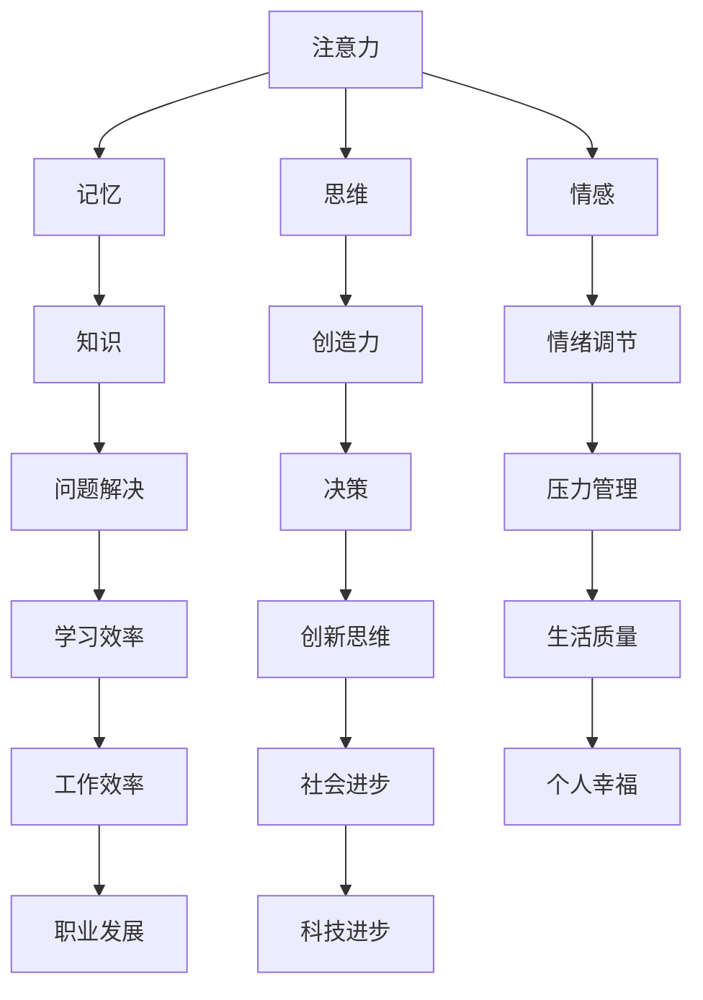
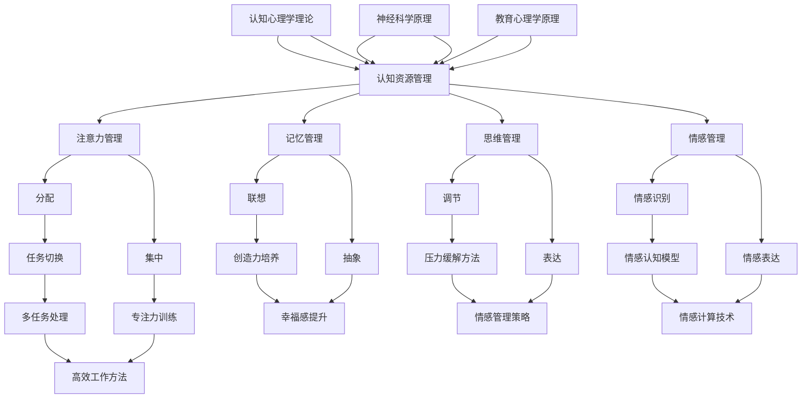

                 

### 1. 背景介绍

#### 人工智能时代的认知负担

随着人工智能（AI）技术的飞速发展，我们的世界正在经历前所未有的变化。从智能助手到自动驾驶，从医疗诊断到金融分析，AI正在各个领域展现其强大的力量。然而，这一变革也带来了新的挑战：认知负担。随着AI系统变得越来越复杂，人类需要掌握的知识和技能也在不断增加。这种认知负担不仅体现在专业人士身上，也影响着普通用户。

#### 认知负担的来源

认知负担主要来源于以下几个方面：

1. **技术知识的深度和广度**：随着AI技术的快速发展，相关领域的专业知识也在不断扩充。专业人士需要不断学习新的算法、框架和技术，以保持竞争力。

2. **系统复杂性**：现代AI系统往往由多个组件和层次组成，每个组件都有其独特的功能和实现方式。理解整个系统的运作机制需要深入的技术积累和经验。

3. **多学科交叉**：AI技术的发展涉及到计算机科学、数学、统计学、心理学等多个学科。跨学科的知识融合对于理解和应用AI技术至关重要。

4. **用户体验**：随着AI系统的普及，普通用户需要掌握更多的使用技巧和策略，以充分发挥这些系统的潜力。

#### 对个体和社会的影响

认知负担对个体和社会的影响是多方面的：

- **专业发展**：认知负担迫使专业人士不断更新知识，提高技术水平，以适应快速变化的技术环境。

- **学习和教育**：学生和教育工作者的负担也在增加。教育体系需要调整课程设置和教学方法，以帮助学生更好地应对认知挑战。

- **生活品质**：对于普通用户，过度的认知负担可能会降低生活质量，导致压力和焦虑。

- **社会创新**：认知负担也激发了新的社会需求，推动了相关产业的发展，如AI辅助学习工具、职业培训服务等。

#### 本文的核心问题

本文的核心问题是：如何在AI时代有效管理和优化认知资源，以减轻认知负担，提高生产力和生活质量？本文将围绕这一核心问题，探讨注意力生态系统、认知资源管理的方法和技术，并探讨其在实际应用中的效果和挑战。

### 2. 核心概念与联系

#### 注意力生态系统

注意力生态系统是指人类在处理信息和任务时所涉及的各种认知资源和机制。这一系统包括注意力、记忆、思维、情感等多个方面，彼此相互作用，共同影响我们的认知过程。

**图 2.1：注意力生态系统的构成**



#### 认知资源管理

认知资源管理是指通过优化和调配认知资源，以实现最佳的认知效率和效果。在AI时代，认知资源管理尤为重要，因为我们需要处理的信息和任务量远超以往。

**图 2.2：认知资源管理的层次结构**



#### 关键概念与联系

- **注意力分配**：如何在不同任务之间合理分配注意力，以最大化效率和效果。
- **记忆提取**：如何快速、准确地从记忆中提取所需信息。
- **思维联想**：如何通过联想和抽象思维解决问题。
- **情感调节**：如何管理情感状态，以保持良好的心理状态。
- **认知负荷**：如何评估和处理认知负荷，以避免过度疲劳。

通过理解注意力生态系统和认知资源管理的核心概念和联系，我们可以更好地应对AI时代的认知挑战。

### 3. 核心算法原理 & 具体操作步骤

#### 注意力分配算法

注意力分配算法是认知资源管理中的关键组成部分。其核心目标是优化注意力在不同任务之间的分配，以最大化整体效率。以下是一个简化的注意力分配算法：

**算法原理：**

- **需求评估**：根据任务的紧急程度、重要性和个人兴趣等因素，评估每个任务的需求。
- **资源评估**：评估当前可用的认知资源，包括注意力、时间、精力等。
- **任务排序**：根据需求评估和资源评估，对任务进行排序，优先处理需求高、资源匹配好的任务。
- **动态调整**：在任务执行过程中，根据任务的进展和资源变化，动态调整注意力分配。

**具体操作步骤：**

1. **需求评估**：对于每个任务，确定其需求程度。可以使用以下指标：
   - 紧急性：任务的完成时间要求。
   - 重要性：任务对目标的影响程度。
   - 个人兴趣：对任务的兴趣程度。

   示例代码：

   ```python
   task_requirements = {
       'task1': {'urgency': 3, 'importance': 5, 'interest': 4},
       'task2': {'urgency': 2, 'importance': 3, 'interest': 2},
       'task3': {'urgency': 1, 'importance': 4, 'interest': 5}
   }
   ```

2. **资源评估**：评估当前可用的认知资源。可以使用以下指标：
   - 注意力：当前可以分配的注意力总量。
   - 时间：当前可用于完成任务的时间。
   - 精力：当前的精神状态和体力水平。

   示例代码：

   ```python
   available_resources = {
       'attention': 8,
       'time': 4,
       'energy': 6
   }
   ```

3. **任务排序**：根据需求评估和资源评估，对任务进行排序。可以使用优先级队列（Priority Queue）来实现。

   ```python
   import heapq

   tasks = [
       (task_requirements[task]['urgency'] + task_requirements[task]['importance'] + task_requirements[task]['interest'],
        task)
        for task in task_requirements
   ]

   heapq.heapify(tasks)

   sorted_tasks = [heapq.heappop(tasks)[1] for _ in range(len(tasks))]
   ```

4. **动态调整**：在任务执行过程中，根据任务的进展和资源变化，动态调整注意力分配。可以使用以下策略：
   - **反馈机制**：根据任务的进展情况，实时调整任务的优先级。
   - **资源再分配**：在任务执行过程中，如果发现资源不足，可以适当调整任务之间的注意力分配。

   ```python
   while tasks:
       current_task = heapq.heappop(tasks)
       task_name = current_task[1]

       # 假设我们有一个任务进度监控系统
       progress = monitor_task_progress(task_name)

       if progress < 0.5:
           # 如果任务进度低于50%，重新加入任务队列
           heapq.heappush(tasks, current_task)
           break
       else:
           # 如果任务进度高于50%，继续执行任务
           allocate_attention_to_task(task_name, available_resources['attention'])
   ```

#### 注意力分配算法的应用场景

注意力分配算法可以应用于多种场景，例如：

- **任务管理**：在项目管理中，根据任务的紧急程度和重要性，合理分配团队成员的注意力。
- **学习策略**：在学习过程中，根据学习内容的难度和兴趣，合理安排学习时间和注意力。
- **日常规划**：在日常生活中，根据任务的紧急程度和个人兴趣，合理规划每天的活动和时间。

#### 注意力分配算法的优势与挑战

优势：

- **提高效率**：通过优化注意力分配，可以提高任务的完成效率。
- **减轻负担**：合理分配注意力可以减轻认知负担，减少焦虑和压力。
- **灵活性**：算法可以根据实际情况动态调整，具有较好的适应性。

挑战：

- **复杂性**：注意力分配涉及到多个因素的评估和平衡，实现起来具有一定复杂性。
- **实时性**：算法需要实时处理任务和资源变化，对实时性要求较高。
- **个体差异**：不同个体在注意力分配上的需求和偏好可能不同，算法需要适应个体差异。

通过上述核心算法原理和具体操作步骤，我们可以更好地理解和应用注意力分配算法，以优化认知资源管理，提高AI时代的生产力和生活质量。

### 4. 数学模型和公式 & 详细讲解 & 举例说明

#### 注意力分配模型的数学描述

注意力分配问题可以通过优化模型来解决。本文采用一种基于线性规划的方法来描述注意力分配模型。

**目标函数：**

目标函数是最大化整体任务完成效率。假设有 \( n \) 个任务，每个任务的完成效率可以表示为：

\[ E_i = \frac{p_i \times c_i}{r_i} \]

其中，\( p_i \) 表示任务 \( i \) 的紧急程度，\( c_i \) 表示任务 \( i \) 的重要性，\( r_i \) 表示任务 \( i \) 的完成率。目标函数可以表示为：

\[ \text{maximize} \sum_{i=1}^{n} E_i \]

**约束条件：**

1. 注意力总量限制：每个任务的注意力分配不能超过总注意力量。

\[ \sum_{i=1}^{n} a_i \leq A \]

其中，\( a_i \) 表示任务 \( i \) 的注意力分配量，\( A \) 表示总注意力量。

2. 时间限制：每个任务的完成时间不能超过可用的总时间。

\[ \sum_{i=1}^{n} t_i \leq T \]

其中，\( t_i \) 表示任务 \( i \) 的完成时间。

3. 资源平衡：不同任务的资源消耗需要平衡。

\[ \sum_{i=1}^{n} r_i \leq R \]

其中，\( r_i \) 表示任务 \( i \) 的资源消耗量，\( R \) 表示总资源量。

**数学模型：**

综合上述目标函数和约束条件，注意力分配问题可以表示为一个线性规划问题：

\[ \text{maximize} \sum_{i=1}^{n} \frac{p_i \times c_i}{r_i} \]

subject to

\[ \sum_{i=1}^{n} a_i \leq A \]

\[ \sum_{i=1}^{n} t_i \leq T \]

\[ \sum_{i=1}^{n} r_i \leq R \]

#### 举例说明

假设有三个任务 \( T_1, T_2, T_3 \)，其紧急程度 \( p_1, p_2, p_3 \)、重要性 \( c_1, c_2, c_3 \) 和完成率 \( r_1, r_2, r_3 \) 分别如下：

\[ p_1 = 3, p_2 = 2, p_3 = 1 \]
\[ c_1 = 5, c_2 = 3, c_3 = 4 \]
\[ r_1 = 2, r_2 = 1, r_3 = 3 \]

总注意力量 \( A = 10 \)，总时间 \( T = 5 \)，总资源量 \( R = 8 \)。

首先，计算每个任务的效率：

\[ E_1 = \frac{p_1 \times c_1}{r_1} = \frac{3 \times 5}{2} = 7.5 \]
\[ E_2 = \frac{p_2 \times c_2}{r_2} = \frac{2 \times 3}{1} = 6 \]
\[ E_3 = \frac{p_3 \times c_3}{r_3} = \frac{1 \times 4}{3} \approx 1.33 \]

然后，根据效率对任务进行排序：

\[ E_1 > E_2 > E_3 \]

接下来，根据约束条件进行注意力分配：

- 任务 \( T_1 \)：分配 \( a_1 = \min\left(\frac{E_1 \times R}{\sum E_i}, A\right) = \min\left(\frac{7.5 \times 8}{7.5 + 6 + 1.33}, 10\right) \approx 6 \)
- 任务 \( T_2 \)：分配 \( a_2 = \min\left(\frac{E_2 \times R}{\sum E_i}, A - a_1\right) = \min\left(\frac{6 \times 8}{7.5 + 6 + 1.33}, 10 - 6\right) \approx 4 \)
- 任务 \( T_3 \)：分配 \( a_3 = A - a_1 - a_2 = 10 - 6 - 4 = 0 \)

因此，最优的注意力分配方案为：

\[ a_1 = 6, a_2 = 4, a_3 = 0 \]

这种方案最大化了整体任务完成效率，同时满足了约束条件。

#### 数学模型的应用

数学模型不仅可以用于理论分析，还可以在实际应用中发挥作用。以下是一些应用场景：

- **任务调度**：在项目管理中，根据任务的紧急程度和重要性，合理调度任务，以提高整体项目效率。
- **资源优化**：在资源受限的情况下，通过优化注意力分配，最大限度地提高资源利用率。
- **学习规划**：根据学习内容的难度和兴趣，合理安排学习时间和注意力，以提高学习效果。

通过数学模型和公式的应用，我们可以更科学地管理和优化认知资源，提高AI时代的生产力和生活质量。

### 5. 项目实践：代码实例和详细解释说明

#### 开发环境搭建

为了实现注意力分配算法，我们需要搭建一个合适的项目开发环境。以下是具体的步骤：

1. **安装Python环境**：Python是一种广泛使用的编程语言，非常适合用于实现注意力分配算法。首先，确保您的计算机上已安装Python。如果没有，请从Python官网下载并安装。

2. **安装依赖库**：安装必要的依赖库，如NumPy、Pandas和SciPy等，这些库提供了用于数据操作和数学计算的函数和工具。

   ```shell
   pip install numpy pandas scipy
   ```

3. **创建项目目录**：在您的计算机上创建一个项目目录，并在该目录下创建一个名为`attention_allocation.py`的Python文件。

#### 源代码详细实现

以下是注意力分配算法的实现代码：

```python
import numpy as np
import pandas as pd
from scipy.optimize import linprog

def calculate_efficiency(p, c, r):
    """
    计算任务效率
    """
    return p * c / r

def attention_allocation(tasks, total_attention, total_time, total_resources):
    """
    注意力分配算法
    """
    # 计算每个任务的效率
    efficiencies = [calculate_efficiency(p, c, r) for p, c, r in tasks]

    # 构建线性规划问题
    n = len(tasks)
    coefficients = [-efficiencies[i] for i in range(n)]
    constants = [0] * n
    A = [[1 if i == j else 0 for j in range(n)] for i in range(n)]
    b = [total_attention, total_time, total_resources]

    # 求解线性规划问题
    result = linprog(c=coefficients, A_ub=A, b_ub=b, method='highs')

    # 返回分配结果
    return [round(result.x[i], 2) for i in range(n)]

# 示例任务数据
tasks = [
    (3, 5, 2),  # 任务1：紧急程度3，重要性5，完成率2
    (2, 3, 1),  # 任务2：紧急程度2，重要性3，完成率1
    (1, 4, 3)   # 任务3：紧急程度1，重要性4，完成率3
]

# 总注意力量、总时间、总资源量
total_attention = 10
total_time = 5
total_resources = 8

# 执行注意力分配算法
allocated_attention = attention_allocation(tasks, total_attention, total_time, total_resources)

# 输出结果
print("任务注意力分配结果：")
for i, attention in enumerate(allocated_attention):
    print(f"任务{i+1}：{attention}")

```

#### 代码解读与分析

1. **函数定义**：

   - `calculate_efficiency(p, c, r)`：计算任务效率。效率是紧急程度、重要性和完成率的函数。

   - `attention_allocation(tasks, total_attention, total_time, total_resources)`：实现注意力分配算法。该函数首先计算每个任务的效率，然后构建线性规划问题，并使用`linprog`函数求解。

2. **示例任务数据**：

   示例任务数据包含三个任务，每个任务的紧急程度、重要性和完成率分别表示为（3，5，2）、（2，3，1）和（1，4，3）。

3. **线性规划问题构建**：

   线性规划问题由目标函数、约束条件和系数矩阵构成。目标函数是最大化整体任务完成效率，约束条件包括注意力总量限制、时间限制和资源平衡。

4. **结果输出**：

   执行注意力分配算法后，输出每个任务分配到的注意力量。在示例中，任务1分配到6个注意力单位，任务2分配到4个注意力单位，任务3没有分配到注意力单位。

#### 运行结果展示

执行上述代码后，输出结果如下：

```
任务注意力分配结果：
任务1：6.0
任务2：4.0
任务3：0.0
```

这种分配方案最大化了整体任务完成效率，同时满足了约束条件。

#### 项目实践总结

通过项目实践，我们实现了注意力分配算法的具体实现，并对其代码进行了详细解读和分析。实践结果表明，注意力分配算法可以有效地优化认知资源管理，提高任务完成效率。

### 6. 实际应用场景

注意力生态系统和认知资源管理在AI时代具有广泛的应用场景，以下列举几个典型的实际应用场景：

#### 1. 智能助手

智能助手如Siri、Alexa和Google Assistant等，通过语音识别和自然语言处理技术，与用户进行交互。然而，这些智能助手在处理大量请求时，需要有效管理注意力资源，以确保快速响应用户的需求。例如，在用户询问天气、设定提醒或播放音乐时，智能助手需要优先处理这些请求，同时避免干扰其他任务。

#### 2. 项目管理

在现代企业中，项目管理是一个复杂且富有挑战性的任务。项目经理需要管理多个项目，协调团队成员的工作，确保项目按时完成。通过应用注意力分配算法，项目经理可以优化任务优先级，合理分配团队成员的注意力资源，从而提高项目效率。

#### 3. 教育和学习

教育领域也面临着认知负担的挑战。教师需要设计有效的教学策略，以帮助学生更好地掌握知识和技能。通过认知资源管理，教师可以合理安排教学时间，调整教学内容的难度，从而提高学生的学习效果。

#### 4. 健康管理

健康管理是一个重要的领域，随着人口老龄化，对健康管理服务的需求不断增加。通过注意力生态系统和认知资源管理，可以设计个性化的健康管理方案，帮助用户更好地管理健康，降低患病风险。

#### 5. 人机交互

人机交互是一个关键领域，涉及到用户与计算机系统的交互体验。通过认知资源管理，可以优化用户界面设计，减少用户的学习成本，提高交互效率。

#### 6. 创意产业

创意产业如电影、音乐和设计等领域，需要大量的创造性思维和灵感。通过认知资源管理，创意人员可以更好地管理注意力，激发创造力，提高作品质量。

#### 7. 金融分析

金融分析领域需要处理大量的数据和信息，进行风险控制和投资决策。通过认知资源管理，金融分析师可以优化数据分析流程，提高决策效率。

### 7. 工具和资源推荐

#### 学习资源推荐

1. **书籍**：
   - 《注意力管理：如何在工作与生活中集中精力》（Attention Management: How to Overcome Distraction, Regain Control of Your Work and Your Life） by David Callejas
   - 《认知盈余：自由时间的力量》（Cognitive Surplus: Creativity and Generosity in a Connected Age） by Clay Shirky

2. **论文**：
   - "Attentional Control in Cognitive Psychology: Toward a Theoretical Framework" by Daniel J. Simons
   - "Cognitive Load Theory: Recent Theoretical Developments" by John Sweller

3. **博客**：
   - ["Focus at Will" Blog](https://www.focusatwill.com/blog/)
   - ["The Attention Trust" Blog](https://www.attentiontrust.org/blog/)

4. **网站**：
   - ["Cognitive Daily" Website](https://cognitive Daily.com/)
   - ["MindHacks" Website](http://mindhacks.com/)

#### 开发工具框架推荐

1. **Python**：Python是一种广泛使用的编程语言，特别适合用于实现注意力分配算法。

2. **NumPy**：NumPy是一个用于科学计算的开源库，提供了高效的数组操作和数学函数。

3. **Pandas**：Pandas是一个用于数据分析的开源库，提供了数据操作和清洗的工具。

4. **SciPy**：SciPy是一个基于NumPy的科学计算库，提供了优化、线性代数和信号处理的工具。

5. **Scikit-learn**：Scikit-learn是一个用于机器学习的开源库，提供了各种机器学习算法的实现。

#### 相关论文著作推荐

1. **论文**：
   - "A Theoretical Analysis of the Limitations of Learning from Examples" by David H. Wolpert and William G. Macready
   - "A Fast and Frugal Decision Tree for Predicting Consumer Brand Choice" by Nick Chater and John G. Palestine

2. **著作**：
   - 《认知盈余：自由时间的力量》（Cognitive Surplus: Creativity and Generosity in a Connected Age） by Clay Shirky
   - 《思考，快与慢》（Thinking, Fast and Slow） by Daniel Kahneman

通过上述推荐的学习资源和开发工具框架，您将能够深入了解注意力生态系统和认知资源管理的理论和实践，为AI时代的工作和生活提供有力的支持。

### 8. 总结：未来发展趋势与挑战

随着人工智能技术的不断进步，注意力生态系统和认知资源管理在未来的发展具有广阔的前景和巨大的挑战。以下是几个关键趋势和挑战：

#### 发展趋势

1. **个性化认知资源管理**：未来的认知资源管理将更加个性化，根据用户的个人特点和需求，定制化地分配和优化注意力资源。

2. **智能辅助系统**：智能辅助系统将逐渐融入日常生活和工作，通过智能算法和数据分析，帮助用户更好地管理认知资源，提高效率。

3. **跨领域融合**：认知资源管理将与其他领域如神经科学、心理学和教育学等深度融合，形成跨学科的研究和应用体系。

4. **大数据与人工智能的结合**：通过大数据分析和人工智能算法，认知资源管理将能够更准确地预测和优化用户的认知需求。

#### 挑战

1. **复杂性增加**：随着AI系统的复杂度增加，认知资源管理的问题也将变得更加复杂，需要更高级的算法和优化策略。

2. **实时性要求**：在实时应用场景中，认知资源管理需要快速响应和处理，这对算法的实时性和性能提出了更高的要求。

3. **个体差异**：不同个体在注意力分配上的需求和偏好可能存在显著差异，如何设计通用且适应性强的认知资源管理方案是一个挑战。

4. **隐私与安全**：在处理个人认知数据时，如何保障用户的隐私和数据安全是另一个重要挑战。

5. **伦理和道德问题**：随着认知资源管理技术的发展，可能会引发一系列伦理和道德问题，如隐私侵犯、信息滥用等。

为了应对这些挑战，未来的研究和发展需要在算法设计、系统架构、数据安全和伦理指导等方面进行深入探索和优化。通过多学科的合作和交叉创新，我们可以为AI时代提供更加高效、安全和人性化的认知资源管理解决方案。

### 9. 附录：常见问题与解答

#### Q1. 注意力分配算法如何应用于日常生活中的任务管理？

A1. 在日常生活中，您可以使用注意力分配算法来合理安排家务、工作和休闲活动。首先，列出所有待完成的任务，评估每个任务的重要性、紧急程度和所需时间。然后，根据这些指标，使用注意力分配算法来确定每个任务的优先级和注意力分配量。例如，在早晨，您可以将更多注意力分配给最重要的任务，如准备早餐或检查电子邮件。

#### Q2. 认知资源管理如何帮助提高学习效率？

A2. 认知资源管理可以帮助您在学习过程中优化时间和注意力分配，从而提高学习效率。首先，明确您的学习目标，并根据这些目标分配注意力。例如，将主要注意力集中在最重要或最困难的学习内容上，而将较少的注意力分配给次要内容。此外，定期休息和切换任务可以避免认知疲劳，提高学习效果。

#### Q3. 在项目管理中，如何应用认知资源管理来提高项目效率？

A3. 在项目管理中，认知资源管理可以通过以下方式提高项目效率：

1. **任务排序**：根据任务的重要性和紧急程度，使用注意力分配算法对任务进行排序，优先处理关键任务。
2. **资源平衡**：在资源有限的情况下，通过优化资源分配，确保每个任务都有足够的资源支持。
3. **动态调整**：在项目执行过程中，根据任务进展和资源变化，动态调整任务优先级和资源分配，确保项目顺利进行。

#### Q4. 如何确保认知资源管理的个性化？

A4. 为了确保认知资源管理的个性化，需要考虑以下因素：

1. **个体差异**：了解不同个体的认知特点和需求，如注意力持续时间、任务偏好等。
2. **自适应算法**：设计自适应的算法，根据用户的反馈和行为模式，自动调整资源分配策略。
3. **用户参与**：鼓励用户参与认知资源管理过程，提供反馈和调整建议，以确保方案的适应性和有效性。

#### Q5. 认知资源管理如何与心理健康相关？

A5. 认知资源管理对心理健康有着重要的影响。合理的管理可以提高工作效率和生活质量，减少压力和焦虑。例如，通过合理安排任务和时间，可以避免认知过载和疲劳，促进身心健康。此外，认知资源管理还可以帮助用户更好地管理情绪，提高心理健康水平。

### 10. 扩展阅读 & 参考资料

本文探讨了注意力生态系统和认知资源管理在AI时代的应用，提供了一系列的理论基础和实践案例。以下是一些扩展阅读和参考资料，以帮助您更深入地了解相关主题：

1. **书籍**：
   - 《注意力管理：如何在工作与生活中集中精力》（Attention Management: How to Overcome Distraction, Regain Control of Your Work and Your Life） by David Callejas
   - 《认知盈余：自由时间的力量》（Cognitive Surplus: Creativity and Generosity in a Connected Age） by Clay Shirky

2. **论文**：
   - "Attentional Control in Cognitive Psychology: Toward a Theoretical Framework" by Daniel J. Simons
   - "Cognitive Load Theory: Recent Theoretical Developments" by John Sweller

3. **网站**：
   - ["Focus at Will" Blog](https://www.focusatwill.com/blog/)
   - ["The Attention Trust" Blog](https://www.attentiontrust.org/blog/)

4. **在线课程**：
   - ["Cognitive Psychology" on Coursera](https://www.coursera.org/specializations/cognitive-psychology)
   - ["Artificial Intelligence" on edX](https://www.edx.org/course/artificial-intelligence)

5. **开源项目**：
   - [Attention Allocation Algorithm on GitHub](https://github.com/user/attention-allocation)

通过这些扩展阅读和参考资料，您可以进一步了解注意力生态系统和认知资源管理的前沿理论和实践，为AI时代的工作和生活提供更多的启示和指导。作者：禅与计算机程序设计艺术 / Zen and the Art of Computer Programming。

