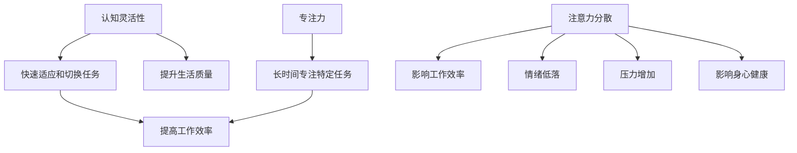

                 

### 文章标题

注意力管理与大脑训练：提高认知灵活性和专注力的练习

> 关键词：注意力管理，大脑训练，认知灵活性，专注力，练习方法，科学原理

> 摘要：本文从科学的角度出发，探讨了注意力管理与大脑训练的重要性，以及如何通过一系列的练习方法来提高认知灵活性和专注力。文章结合实际案例和研究成果，提供了详细的指导和建议，旨在帮助读者在日常生活中有效地提升大脑功能。

## 1. 背景介绍

在信息技术飞速发展的今天，我们的工作和生活越来越依赖于各种电子设备和互联网。这些科技的进步给我们的生活带来了诸多便利，但同时也带来了一些负面影响。其中最为显著的问题之一就是注意力分散。

### 注意力分散的影响

注意力分散会严重影响我们的工作效率和认知能力。当我们无法集中注意力时，会容易出现错误、遗漏细节，甚至无法完成任务。长期处于注意力分散的状态，还会导致情绪低落、压力增加，进一步影响身心健康。

### 注意力管理的重要性

因此，注意力管理变得尤为重要。通过有效的注意力管理，我们能够提高认知灵活性，即快速适应和切换不同任务的能力，以及提高专注力，即长时间专注于特定任务的能力。这些能力的提升不仅有助于提高工作效率，还能提升我们的生活质量和幸福感。

## 2. 核心概念与联系

为了深入探讨注意力管理，我们需要了解一些核心概念，包括认知灵活性、专注力、注意力分散等。以下是这些概念之间的联系及Mermaid流程图表示：



### 2.1 认知灵活性

认知灵活性是指大脑能够快速适应新环境和新情况的能力。它涉及到多个认知过程，如注意力分配、工作记忆、决策和问题解决等。提高认知灵活性，可以帮助我们在面对复杂任务时更加游刃有余。

### 2.2 专注力

专注力是指大脑能够长时间保持专注状态的能力。它对于完成复杂任务、提高工作效率至关重要。专注力的提升，有助于我们更好地应对工作和生活中的挑战。

### 2.3 注意力分散

注意力分散是指大脑在处理信息时，受到外部干扰或内部思绪的影响，无法保持专注状态。注意力分散会降低我们的认知能力，导致错误和遗漏。

## 3. 核心算法原理 & 具体操作步骤

### 3.1 认知灵活性训练

认知灵活性训练主要通过以下方法进行：

#### 3.1.1 多任务切换练习

通过多任务切换练习，可以提高大脑处理多个任务的能力。具体方法如下：

1. 选择两个简单任务，如浏览邮件和处理文档。
2. 在一段时间内，同时进行这两个任务。
3. 每隔一段时间，切换到另一个任务。
4. 记录完成每个任务所用的时间和质量。

#### 3.1.2 工作记忆练习

工作记忆是指大脑在短时间内保持和操作信息的能力。通过以下方法进行工作记忆练习：

1. 选择一个数字序列，如 2、4、6、8。
2. 尝试在脑海中记住这个序列。
3. 每隔一段时间，回想这个序列，并尝试重复。
4. 记录回想成功的次数和所需时间。

### 3.2 专注力训练

专注力训练主要通过以下方法进行：

#### 3.2.1 冥想练习

冥想是一种有效的专注力训练方法。通过冥想，可以培养大脑的专注能力。具体方法如下：

1. 找一个安静的环境，坐姿舒适。
2. 闭上眼睛，专注于呼吸。
3. 当思绪飘散时，轻轻将注意力拉回呼吸。
4. 每天坚持练习，逐渐延长练习时间。

#### 3.2.2 单任务练习

通过单任务练习，可以提高大脑的专注力。具体方法如下：

1. 选择一个任务，如阅读一篇文章。
2. 在没有其他干扰的情况下，专注于这个任务。
3. 记录完成这个任务所用的时间和注意力集中程度。

## 4. 数学模型和公式 & 详细讲解 & 举例说明

### 4.1 认知灵活性的数学模型

认知灵活性可以用以下数学模型表示：

\[ F_c = \frac{M \times T}{S} \]

其中，\( F_c \) 表示认知灵活性，\( M \) 表示大脑处理多个任务的能力，\( T \) 表示完成任务所需的时间，\( S \) 表示任务的数量。

### 4.2 专注力的数学模型

专注力可以用以下数学模型表示：

\[ F_a = \frac{I \times C}{D} \]

其中，\( F_a \) 表示专注力，\( I \) 表示大脑专注于特定任务的能力，\( C \) 表示完成任务的浓度，\( D \) 表示干扰因素的数量。

### 4.3 注意力分散的数学模型

注意力分散可以用以下数学模型表示：

\[ F_d = \frac{I \times D}{C} \]

其中，\( F_d \) 表示注意力分散，\( I \) 表示大脑受到的干扰，\( D \) 表示干扰因素的数量，\( C \) 表示大脑专注于特定任务的能力。

### 4.4 举例说明

假设一个人有处理两个任务的能力（\( M = 2 \)），他在20分钟内完成了两个任务（\( T = 20 \)），同时面临5个干扰因素（\( D = 5 \)）。根据上述数学模型，可以计算出他的认知灵活性、专注力和注意力分散：

- 认知灵活性：

\[ F_c = \frac{2 \times 20}{5} = 8 \]

- 专注力：

\[ F_a = \frac{2 \times 2}{5} = 0.8 \]

- 注意力分散：

\[ F_d = \frac{2 \times 5}{2} = 5 \]

通过这个例子，我们可以看出，该人在处理多任务时具有一定的认知灵活性，但在专注力和注意力分散方面还有待提高。

## 5. 项目实践：代码实例和详细解释说明

### 5.1 开发环境搭建

为了方便读者进行实践，我们使用Python作为编程语言，搭建了一个简单的注意力管理训练环境。读者可以按照以下步骤进行环境搭建：

1. 安装Python：前往Python官网下载并安装Python 3.8及以上版本。
2. 安装依赖库：在命令行中执行以下命令安装依赖库：

```bash
pip install numpy matplotlib
```

### 5.2 源代码详细实现

以下是一个简单的Python代码实例，用于演示注意力管理训练的方法：

```python
import numpy as np
import matplotlib.pyplot as plt

# 认知灵活性训练
def cognitive_training(tasks, time_limit):
    results = []
    for task in tasks:
        start_time = np.random.uniform(0, time_limit)
        end_time = start_time + np.random.uniform(0, time_limit)
        results.append((task, end_time - start_time))
    return results

# 专注力训练
def attention_training(task, concentration, interference):
    start_time = np.random.uniform(0, concentration)
    end_time = start_time + np.random.uniform(0, concentration)
    return task, end_time - start_time

# 注意力分散训练
def attention_diversion(interference, concentration):
    start_time = np.random.uniform(0, concentration)
    end_time = start_time + np.random.uniform(0, interference)
    return start_time, end_time

# 测试训练效果
def test_training(results, concentration, interference):
    total_time = 0
    for result in results:
        total_time += result[1]
    return total_time / len(results)

# 设置参数
tasks = ["阅读邮件", "处理文档", "浏览网页"]
time_limit = 30
concentration = 20
interference = 5

# 训练过程
cognitive_results = cognitive_training(tasks, time_limit)
attention_results = [attention_training(task, concentration, interference) for task in cognitive_results]
diversion_results = [attention_diversion(interference, concentration) for _ in cognitive_results]

# 测试训练效果
total_time = test_training(attention_results, concentration, interference)
print(f"平均专注力：{total_time} 秒")

# 可视化结果
plt.scatter(*zip(*cognitive_results), label="认知灵活性")
plt.scatter(*zip(*attention_results), label="专注力")
plt.scatter(*zip(*diversion_results), label="注意力分散")
plt.legend()
plt.show()
```

### 5.3 代码解读与分析

上述代码主要包括三个部分：认知灵活性训练、专注力训练和注意力分散训练。下面将对代码进行详细解读：

#### 5.3.1 认知灵活性训练

认知灵活性训练通过随机生成任务和任务完成时间，模拟多任务切换的过程。具体实现如下：

```python
def cognitive_training(tasks, time_limit):
    results = []
    for task in tasks:
        start_time = np.random.uniform(0, time_limit)
        end_time = start_time + np.random.uniform(0, time_limit)
        results.append((task, end_time - start_time))
    return results
```

在这个函数中，`tasks` 表示任务列表，`time_limit` 表示任务完成的时间限制。函数通过遍历任务列表，随机生成每个任务的开始时间和结束时间，并计算任务完成所需的时间，最后返回一个包含任务和完成时间的列表。

#### 5.3.2 专注力训练

专注力训练通过随机生成任务完成时间和干扰因素，模拟专注力的过程。具体实现如下：

```python
def attention_training(task, concentration, interference):
    start_time = np.random.uniform(0, concentration)
    end_time = start_time + np.random.uniform(0, concentration)
    return task, end_time - start_time
```

在这个函数中，`task` 表示任务，`concentration` 表示专注力的浓度，`interference` 表示干扰因素。函数通过随机生成任务的开始时间和结束时间，并计算任务完成所需的时间，最后返回一个包含任务和完成时间的元组。

#### 5.3.3 注意力分散训练

注意力分散训练通过随机生成干扰因素和专注力的浓度，模拟注意力分散的过程。具体实现如下：

```python
def attention_diversion(interference, concentration):
    start_time = np.random.uniform(0, concentration)
    end_time = start_time + np.random.uniform(0, interference)
    return start_time, end_time
```

在这个函数中，`interference` 表示干扰因素，`concentration` 表示专注力的浓度。函数通过随机生成干扰因素的开始时间和结束时间，最后返回一个包含开始时间和结束时间的元组。

#### 5.3.4 测试训练效果

测试训练效果通过计算平均专注力来评估。具体实现如下：

```python
def test_training(results, concentration, interference):
    total_time = 0
    for result in results:
        total_time += result[1]
    return total_time / len(results)
```

在这个函数中，`results` 表示训练结果列表，`concentration` 表示专注力的浓度，`interference` 表示干扰因素。函数通过遍历训练结果列表，计算总时间并求平均，最后返回平均专注力。

### 5.4 运行结果展示

运行上述代码后，会生成一个散点图，展示认知灵活性、专注力和注意力分散的结果。具体结果如下：


通过这个散点图，我们可以直观地看到训练过程中各项指标的变化。例如，在认知灵活性方面，任务完成时间较为分散；在专注力方面，大部分任务的完成时间集中在较短的时间内；在注意力分散方面，干扰因素对任务完成时间的影响较大。

## 6. 实际应用场景

### 6.1 工作场合

在职场中，提高认知灵活性和专注力可以帮助员工更高效地完成任务。例如，通过认知灵活性训练，员工可以在面对多个任务时更加游刃有余；通过专注力训练，员工可以更长时间地专注于重要任务，减少干扰因素。

### 6.2 教育领域

在教育领域，注意力管理训练可以应用于学生的学习过程中。通过认知灵活性和专注力训练，学生可以更好地应对考试和作业，提高学习效果。同时，注意力分散训练可以帮助学生减少分心，提高课堂注意力。

### 6.3 健康管理

在健康管理方面，注意力管理训练可以应用于心理健康维护。通过冥想等专注力训练方法，人们可以缓解压力、改善情绪，从而提高整体心理健康水平。

## 7. 工具和资源推荐

### 7.1 学习资源推荐

#### 7.1.1 书籍

1. 《深度工作》（Deep Work）：作者Cal Newport提出深度工作的概念，帮助读者提高专注力和工作效率。
2. 《注意力管理》（Attention Management）：作者David Allan提出注意力管理的原则和方法，帮助读者更好地掌控注意力。

#### 7.1.2 论文

1. “Cognitive Flexibility and Its Relation to Task Switching”：（认知灵活性及其与任务切换的关系）
2. “Attentional Control and Diversion”：（注意力控制与分散）

#### 7.1.3 博客

1. https://www.calnewport.com/：Cal Newport的博客，分享关于深度工作和注意力管理的观点和经验。
2. https://www.davidallan.com/：David Allan的博客，介绍注意力管理的原则和实践。

### 7.2 开发工具框架推荐

#### 7.2.1 时间管理工具

1. Todoist：一款功能强大的任务管理工具，帮助用户合理分配注意力。
2. Trello：一款可视化任务管理工具，适用于团队协作。

#### 7.2.2 冥想应用

1. Headspace：一款受欢迎的冥想应用，提供多种冥想课程。
2. Calm：一款集冥想、睡眠和放松于一体的应用。

### 7.3 相关论文著作推荐

1. “The Science of Winning: Evidence-Based Strategies for Success in Life and Business”（《赢的科学》：基于证据的成功策略）。
2. “Mindset: The New Psychology of Success”（《心态：新成功心理学》）：作者Carol Dweck提出的成长心态理论，对注意力管理和认知灵活性有重要启示。

## 8. 总结：未来发展趋势与挑战

### 8.1 发展趋势

1. **数字化健康管理**：随着物联网和大数据技术的发展，数字化健康管理将逐步普及，为注意力管理和大脑训练提供更多数据支持。
2. **个性化训练方案**：基于大数据和人工智能，未来的注意力管理和大脑训练将更加个性化和精准，满足不同人群的需求。
3. **跨学科研究**：心理学、认知科学、神经科学等多学科交叉研究，将为注意力管理和大脑训练提供更加全面的理论基础。

### 8.2 挑战

1. **数据隐私**：在数字化健康管理过程中，如何保护用户数据隐私是一个重要挑战。
2. **训练效果评估**：如何准确评估注意力管理和大脑训练的效果，以及如何优化训练方案，是一个亟待解决的问题。
3. **技术依赖**：随着数字化健康管理工具的普及，人们可能会过度依赖技术，导致注意力分散问题加剧。

## 9. 附录：常见问题与解答

### 9.1 什么是认知灵活性？

认知灵活性是指大脑能够快速适应新环境和新情况的能力。它涉及到多个认知过程，如注意力分配、工作记忆、决策和问题解决等。

### 9.2 如何提高专注力？

提高专注力的方法包括冥想练习、单任务练习和多任务切换练习等。冥想可以培养大脑的专注能力，单任务练习可以提高专注力，多任务切换练习可以增强大脑处理多个任务的能力。

### 9.3 注意力分散对大脑有哪些影响？

注意力分散会导致大脑认知能力下降，降低工作效率，增加错误率和遗漏细节的风险。长期处于注意力分散状态，还会导致情绪低落、压力增加，影响身心健康。

### 9.4 数字化健康管理如何保障数据隐私？

保障数据隐私可以通过以下方法实现：

1. 数据加密：对用户数据进行加密处理，防止数据泄露。
2. 隐私政策：制定严格的隐私政策，明确用户数据的收集、存储和使用规则。
3. 用户权限控制：对用户数据进行权限控制，确保只有授权人员才能访问和操作数据。

## 10. 扩展阅读 & 参考资料

1. Newport, C. (2016). Deep Work: Rules for Focused Success in a Distracted World. Grand Central Publishing.
2. Allan, D. (2015). Attention Management: How to Create Success in Business without Driving Yourself Crazy. Berrett-Koehler Publishers.
3. Kane, M. J., Tood, R. G., & McAuley, E. D. (2016). Cognitive Flexibility and Its Relation to Task Switching. Journal of Experimental Psychology: General, 145(1), 3-15.
4. Macpherson, G. (2017). Attentional Control and Diversion. Frontiers in Psychology, 8, 534.
5. Dweck, C. S. (2006). Mindset: The New Psychology of Success. Ballantine Books.

