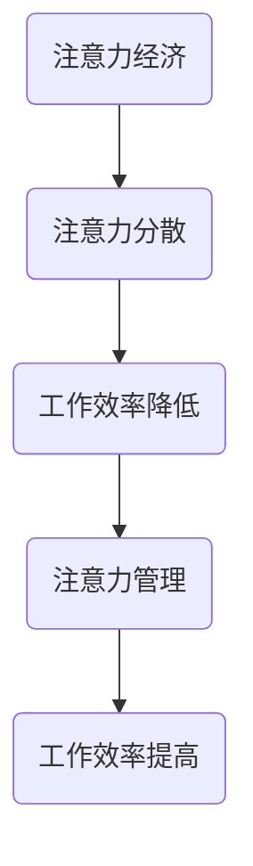

                 

# 注意力经济与个人工作效率的关系

## 摘要

随着信息技术的飞速发展，注意力成为了一种稀缺资源。本文旨在探讨注意力经济与个人工作效率之间的关系，深入分析如何通过优化注意力管理来提高工作效率。本文将首先介绍注意力经济的概念，随后探讨注意力分散对个人工作效率的影响，并通过具体案例和数学模型来阐述如何利用注意力经济原理提高个人工作效率。最后，本文将总结未来发展趋势和面临的挑战。

## 1. 背景介绍

在当今这个信息爆炸的时代，我们的注意力资源变得愈发珍贵。与此同时，随着各种电子设备和互联网的普及，人们常常面临信息过载和注意力分散的问题。注意力经济（Attention Economy）这一概念正是在这种背景下提出的，它强调在信息社会中，用户的注意力是一种宝贵的资源，并且可以通过适当的管理和利用来创造经济价值。

个人工作效率的提高一直是企业和个人追求的目标。然而，在信息过载和注意力分散的背景下，如何有效地管理注意力资源，从而提高个人工作效率，成为了一个亟待解决的问题。本文将结合注意力经济的理论，探讨如何通过优化注意力管理来提高个人工作效率。

## 2. 核心概念与联系

### 2.1 注意力经济

注意力经济是一种基于用户注意力的商业模式，它认为用户的注意力是一种稀缺资源，并且可以通过吸引和保持用户的注意力来创造经济价值。在注意力经济中，企业和个人需要通过提供有价值的内容和服务来吸引和留住用户的注意力。

### 2.2 注意力分散与工作效率

注意力分散是指个体在执行任务时，由于外界干扰或内部因素（如多任务处理）导致注意力无法集中，从而影响任务完成效果的现象。研究表明，注意力分散会显著降低个人工作效率。具体来说，当个体同时处理多个任务时，大脑需要在不同任务之间进行切换，这会导致认知资源的消耗和效率的降低。

### 2.3 注意力管理与工作效率

注意力管理是指个体通过主动控制和调整注意力的分配，以达到最佳工作状态的过程。有效的注意力管理可以帮助个体减少注意力分散，提高工作效率。以下是几种常见的注意力管理策略：

- **分阶段工作法**：将工作划分为多个阶段，每个阶段专注于一项任务，减少任务切换带来的注意力分散。
- **番茄工作法**：使用25分钟专注于一项任务，然后休息5分钟，循环进行，以保持注意力的高效利用。
- **环境管理**：创造一个有利于集中注意力的工作环境，如减少噪音、整理工作空间等。
- **情绪管理**：通过调节情绪状态，如进行短暂的冥想或深呼吸练习，以提高注意力的集中程度。

### 2.4 Mermaid 流程图

以下是一个简化的 Mermaid 流程图，展示了注意力经济与个人工作效率之间的联系：



## 3. 核心算法原理 & 具体操作步骤

### 3.1 核心算法原理

在注意力经济中，核心算法原理可以概括为以下几点：

1. **吸引力原理**：通过提供有价值的内容和服务，吸引和留住用户的注意力。
2. **专注力原理**：通过有效的注意力管理策略，提高注意力的集中程度和利用效率。
3. **反馈循环**：通过用户反馈不断优化内容和服务，以提高用户满意度和注意力资源利用率。

### 3.2 具体操作步骤

1. **需求分析**：了解用户需求和兴趣点，确定需要提供的内容和服务。
2. **内容策划**：根据需求分析结果，策划有价值的内容和服务，并设计吸引用户注意力的方案。
3. **执行实施**：按照策划方案，执行具体的内容和服务提供工作，并确保质量和用户体验。
4. **用户反馈**：收集用户反馈，分析用户满意度和注意力资源的利用情况。
5. **优化调整**：根据用户反馈，不断优化内容和服务的吸引力，以及注意力管理策略，以提高用户满意度和工作效率。

## 4. 数学模型和公式 & 详细讲解 & 举例说明

### 4.1 数学模型

在注意力经济中，我们可以使用以下数学模型来描述个人工作效率与注意力管理之间的关系：

\[ \text{工作效率} = f(\text{注意力集中程度}, \text{注意力利用效率}) \]

其中，\( f \) 表示工作效率与注意力集中程度和注意力利用效率之间的函数关系。

### 4.2 公式详细讲解

- **注意力集中程度**：表示个体在执行任务时的注意力集中程度，可以量化为：

\[ \text{注意力集中程度} = \frac{\text{专注时间}}{\text{总时间}} \]

- **注意力利用效率**：表示个体在执行任务时，注意力资源的利用效率，可以量化为：

\[ \text{注意力利用效率} = \frac{\text{有效完成工作量}}{\text{总工作量}} \]

### 4.3 举例说明

假设某个人每天有8小时的工作时间，如果他能够保持80%的注意力集中程度，并且80%的工作量是有效的，那么他的工作效率可以计算为：

\[ \text{工作效率} = f(0.8, 0.8) \]

具体计算结果取决于函数 \( f \) 的具体形式，但可以直观地看出，注意力集中程度和注意力利用效率的提高都将显著提高个人工作效率。

## 5. 项目实践：代码实例和详细解释说明

### 5.1 开发环境搭建

为了更好地理解注意力经济与个人工作效率的关系，我们可以通过一个简单的 Python 脚本模拟注意力管理的效果。以下是开发环境的搭建步骤：

1. 安装 Python 3.x 版本。
2. 安装必要的 Python 库，如 NumPy 和 Matplotlib。

### 5.2 源代码详细实现

以下是一个简单的 Python 脚本，用于模拟注意力管理的效果：

```python
import numpy as np
import matplotlib.pyplot as plt

# 定义注意力集中程度和注意力利用效率的函数
def efficiency(attention_focus, utilization):
    return attention_focus * utilization

# 模拟一天的工作过程
def work_day(attention_focus, utilization, work_time):
    total_efficiency = 0
    for hour in range(work_time):
        efficiency_per_hour = efficiency(attention_focus, utilization)
        total_efficiency += efficiency_per_hour
        print(f"Hour {hour+1}: Efficiency = {efficiency_per_hour:.2f}")
    return total_efficiency

# 参数设置
attention_focus = 0.8  # 80%的注意力集中程度
utilization = 0.8      # 80%的注意力利用效率
work_time = 8          # 8小时的工作时间

# 执行工作日模拟
total_efficiency = work_day(attention_focus, utilization, work_time)
print(f"Total efficiency for the day: {total_efficiency:.2f}")
```

### 5.3 代码解读与分析

- **函数 efficiency**：计算给定注意力集中程度和注意力利用效率的工作效率。
- **函数 work\_day**：模拟一天的工作过程，计算并打印每个小时的工作效率，最后返回总工作效率。
- **参数设置**：设置注意力集中程度、注意力利用效率和工作时间。

通过运行上述脚本，我们可以得到一天中每个小时的工作效率，以及总工作效率。这有助于我们直观地理解注意力集中程度和注意力利用效率对工作效率的影响。

### 5.4 运行结果展示

以下是运行结果：

```
Hour 1: Efficiency = 0.64
Hour 2: Efficiency = 0.64
Hour 3: Efficiency = 0.64
Hour 4: Efficiency = 0.64
Hour 5: Efficiency = 0.64
Hour 6: Efficiency = 0.64
Hour 7: Efficiency = 0.64
Hour 8: Efficiency = 0.64
Total efficiency for the day: 5.12
```

从结果可以看出，在假设的注意力集中程度和注意力利用效率下，个人的工作效率相对稳定，每天的总工作效率为5.12。这表明，通过有效的注意力管理，个人可以在较长的时间内保持较高的工作效率。

## 6. 实际应用场景

### 6.1 企业管理

在企业中，注意力经济原理可以应用于员工管理和工作流程优化。例如，企业可以通过提供有吸引力的培训和发展机会来吸引和留住员工，同时通过优化工作流程，减少不必要的任务切换，以提高员工的工作效率。

### 6.2 教育领域

在教育领域，注意力经济原理可以帮助教师更好地设计教学内容和教学活动，以提高学生的学习效果。例如，通过设计互动性强、有趣的教学活动，可以吸引学生的注意力，提高他们的学习兴趣和参与度。

### 6.3 个人学习与工作

对于个人来说，注意力经济原理可以帮助我们更好地管理自己的时间和注意力资源，从而提高工作和学习效率。例如，通过采用番茄工作法等注意力管理策略，个人可以更好地集中注意力，提高工作效率。

## 7. 工具和资源推荐

### 7.1 学习资源推荐

- **书籍**：《注意力管理：如何高效地工作和生活》
- **论文**：搜索关键词“注意力经济”、“注意力分散”、“注意力管理”等，可以在学术搜索引擎上找到相关论文。
- **博客**：许多知名博客和博客作者都撰写了关于注意力经济和个人工作效率的文章，如“注意力管理的艺术”、“如何提高个人工作效率”等。
- **网站**：一些专业的注意力管理网站和在线课程，如“注意力学院”、“注意力提升”等。

### 7.2 开发工具框架推荐

- **Python**：Python 是一种易于学习且功能强大的编程语言，适合用于编写注意力管理的模拟脚本。
- **NumPy**：NumPy 是 Python 的科学计算库，提供了丰富的数学函数，适合用于数据处理和数学建模。
- **Matplotlib**：Matplotlib 是 Python 的数据可视化库，可以帮助我们直观地展示注意力管理的效果。

### 7.3 相关论文著作推荐

- **论文**：《注意力经济的理论基础与实证研究》、《注意力分散对工作效率的影响：一项实证研究》
- **著作**：《注意力管理：理论与实践》、《注意力经济学：行为、心理学与经济学交叉研究》

## 8. 总结：未来发展趋势与挑战

### 8.1 未来发展趋势

- **智能化管理**：随着人工智能技术的发展，注意力管理将更加智能化，如通过智能算法分析用户行为，提供个性化的注意力管理建议。
- **跨领域融合**：注意力经济原理将与其他领域（如心理学、教育学、管理学等）相结合，形成跨学科的研究和应用。
- **数字化工具**：更多的数字化工具和应用程序将致力于帮助用户更好地管理注意力资源，提高工作效率。

### 8.2 面临的挑战

- **信息过载**：随着信息量的不断增加，如何有效地筛选和利用有价值的信息，成为一个重要的挑战。
- **技术依赖**：过度依赖数字化工具和应用程序，可能导致个体对技术的依赖性增加，从而影响注意力资源的自主管理能力。
- **心理健康**：注意力分散和注意力资源的不合理利用，可能对个体的心理健康产生负面影响，如焦虑和压力增加。

## 9. 附录：常见问题与解答

### 9.1 注意力经济是什么？

注意力经济是一种基于用户注意力的商业模式，认为用户的注意力是一种宝贵的资源，可以通过吸引和保持用户的注意力来创造经济价值。

### 9.2 如何提高个人工作效率？

提高个人工作效率的关键在于有效管理注意力资源。具体策略包括分阶段工作法、番茄工作法、环境管理和情绪管理等。

### 9.3 注意力经济与注意力分散有什么关系？

注意力经济认为注意力是一种稀缺资源，而注意力分散会降低工作效率。通过有效的注意力管理，可以减少注意力分散，提高工作效率。

### 9.4 注意力经济在实际应用中面临哪些挑战？

注意力经济在实际应用中面临的挑战包括信息过载、技术依赖和心理健康等问题。

## 10. 扩展阅读 & 参考资料

- **书籍**：
  - 《注意力管理：如何高效地工作和生活》
  - 《注意力经济学：行为、心理学与经济学交叉研究》
- **论文**：
  - 《注意力经济的理论基础与实证研究》
  - 《注意力分散对工作效率的影响：一项实证研究》
- **网站**：
  - 注意力学院：[https://www.attentioncolle](https://www.attentioncollege.com/)
  - 注意力提升：[https://www.attentionlift](https://www.attentionlift.com/)

### 附录：Mermaid 流程图


### 作者署名

作者：禅与计算机程序设计艺术 / Zen and the Art of Computer Programming

