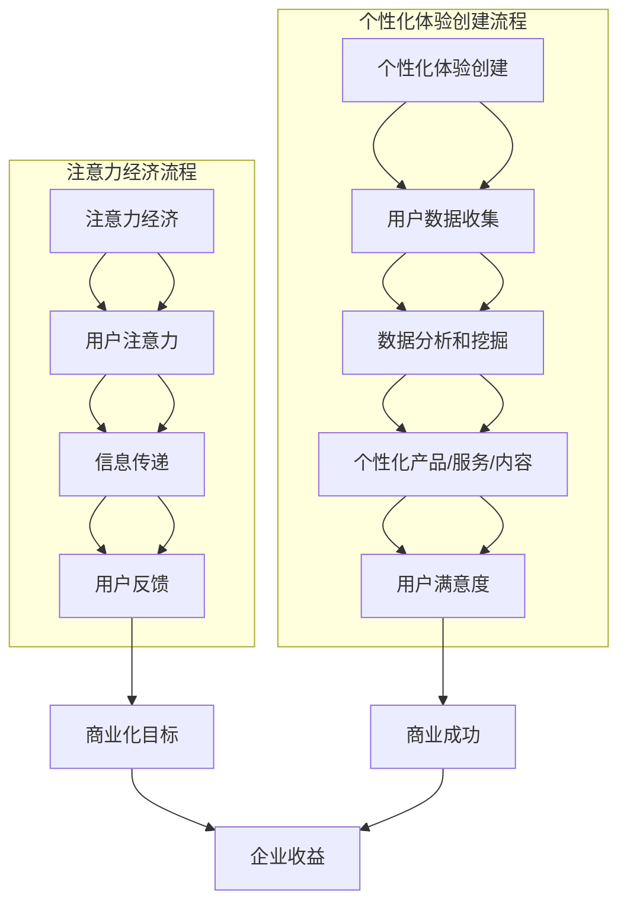

                 

### 背景介绍

#### 注意力经济与个性化体验创建：两个核心概念的定义与联系

在数字时代，信息的泛滥使得用户注意力成为稀缺资源。而注意力经济和个性化体验创建这两个概念，正是为了在这个背景下应运而生。

**注意力经济**，顾名思义，是指在经济活动中，用户注意力作为一种资源和资本，被商家和企业所利用和追逐。在这个框架下，企业通过设计吸引用户注意力的产品、服务或内容来吸引流量，进而实现商业价值。

**个性化体验创建**，则是指通过了解和满足用户的个性化需求，来提供定制化的产品、服务或内容。这不仅仅是为了满足用户的基本需求，更是通过深度理解和个性化定制，提升用户的使用体验，增强用户粘性。

这两个概念虽然看似独立，但实则密不可分。注意力经济关注的是如何吸引和保持用户的注意力，而个性化体验创建则关注如何通过满足用户的需求和偏好，提升用户的参与度和满意度。可以说，个性化体验创建是注意力经济的重要组成部分，也是实现注意力经济目标的关键手段。

本文将深入探讨注意力经济与个性化体验创建的核心理念、实现方法以及它们在现代商业环境中的应用，旨在为企业和开发者提供有价值的指导和借鉴。

### 核心概念与联系

#### 核心概念原理

在深入了解注意力经济和个性化体验创建之前，有必要首先明确这两个核心概念的定义和原理。

**注意力经济**：注意力经济最早由美国经济学家李维特（Thaler）提出，他认为在现代社会中，人们的注意力是一种稀缺资源。随着互联网和社交媒体的兴起，用户注意力成为企业争夺的重要资源。在注意力经济中，用户的时间、精力和关注都是有限的，因此企业通过设计吸引人的产品、内容和服务，来吸引并保持用户的注意力，从而实现商业目标。

**个性化体验创建**：个性化体验创建则是基于用户数据的收集和分析，通过对用户的兴趣、行为、偏好等数据进行挖掘，提供个性化的产品、服务或内容。其核心理念在于满足用户的个性化需求，提升用户体验，从而增强用户满意度和忠诚度。

#### 架构与流程

为了更好地理解这两个概念，我们可以通过一个 Mermaid 流程图来展示它们的基本架构和流程。



在这个流程图中，注意力经济从用户注意力的获取开始，通过信息传递和用户反馈，最终实现商业化目标。而个性化体验创建则从用户数据的收集开始，通过数据分析和挖掘，提供个性化的产品或服务，最终提升用户满意度，实现商业成功。

#### 注意力经济与个性化体验创建的联系

从上述架构和流程中，我们可以看到，注意力经济和个性化体验创建虽然关注点不同，但它们在实现商业目标上有着密切的联系。

1. **用户注意力作为基础**：注意力经济强调的是如何吸引和保持用户的注意力，而个性化体验创建则是基于对用户注意力的理解和利用。只有当用户关注并参与时，个性化体验才有意义。

2. **数据驱动的个性化**：个性化体验创建依赖于用户数据的收集和分析，而用户数据的获取往往需要依靠注意力经济中获取的用户注意力。因此，注意力经济为个性化体验创建提供了数据基础。

3. **提升用户满意度**：注意力经济通过吸引用户注意力实现商业化目标，而个性化体验创建则通过满足用户个性化需求，提升用户满意度。只有当用户满意度提高，商业目标才能更好地实现。

综上所述，注意力经济和个性化体验创建不仅相互独立，而且在实现商业目标上有着密切的联系。理解并利用这两个概念，可以帮助企业和开发者更好地吸引用户注意力，提供个性化的产品和服务，从而在竞争激烈的数字市场中脱颖而出。

### 核心算法原理 & 具体操作步骤

#### 注意力经济的核心算法原理

注意力经济中，核心的算法原理是通过分析用户的行为和兴趣，来精准地吸引和保持用户的注意力。具体来说，可以分为以下几个步骤：

1. **数据收集**：首先，需要收集用户的行为数据，如浏览历史、搜索记录、点击行为等。这些数据可以通过网站分析工具、用户反馈问卷等渠道获取。

2. **行为分析**：对收集到的行为数据进行深度分析，提取出用户的关键行为特征和兴趣点。常用的方法包括聚类分析、关联规则挖掘等。

3. **内容推荐**：根据分析结果，为用户推荐符合其兴趣的内容或产品。推荐算法常用的方法包括协同过滤、矩阵分解、深度学习等。

4. **反馈优化**：通过用户对推荐内容的反馈，进一步优化推荐算法，提高推荐质量。

下面，我们通过一个具体的示例来展示这些步骤如何操作。

#### 示例：个性化新闻推荐系统

假设我们开发一个新闻推荐系统，目标是向用户推荐他们可能感兴趣的新闻。

**步骤 1：数据收集**

我们首先收集用户的行为数据，如浏览历史、点击记录、收藏记录等。这些数据可以通过网站日志分析工具获取。

```python
# 假设我们获取的用户行为数据如下：
user_actions = [
    {"user_id": 1, "article_id": 101, "action": "view"},
    {"user_id": 1, "article_id": 102, "action": "click"},
    {"user_id": 2, "article_id": 201, "action": "view"},
    {"user_id": 2, "article_id": 202, "action": "click"},
    # 更多用户行为数据...
]
```

**步骤 2：行为分析**

接下来，我们对这些行为数据进行聚类分析，提取出用户的关键行为特征。这里我们使用 K-Means 算法进行聚类。

```python
from sklearn.cluster import KMeans

# 预处理数据，提取特征向量
X = [[action['article_id']] for action in user_actions]

# 使用 K-Means 算法进行聚类
kmeans = KMeans(n_clusters=2, random_state=0).fit(X)

# 获取聚类结果
clusters = kmeans.labels_
```

**步骤 3：内容推荐**

根据聚类结果，我们为用户推荐他们所在簇中的热门新闻。这里我们使用协同过滤算法进行推荐。

```python
from surprise import KNNWithMeans

# 假设我们有一个新闻数据集，其中包含了所有新闻的特征信息
news_data = [
    {"article_id": 101, "topic": "科技", "rating": 5},
    {"article_id": 102, "topic": "娱乐", "rating": 4},
    # 更多新闻数据...
]

# 构建协同过滤模型
model = KNNWithMeans(k=5)

# 训练模型
model.fit(news_data)

# 为用户推荐新闻
for action in user_actions:
    if action['action'] == "view":
        # 为用户推荐热门新闻
        recommendations = model.get_neighbors(action['article_id'])
        for rec in recommendations:
            print(f"Recommended article: {rec['article_id']} with topic {rec['topic']}")
```

**步骤 4：反馈优化**

最后，我们收集用户对推荐新闻的反馈，并根据反馈调整推荐算法，提高推荐质量。

```python
# 假设我们获取的用户反馈数据如下：
user_feedback = [
    {"user_id": 1, "article_id": 101, "feedback": "good"},
    {"user_id": 1, "article_id": 102, "feedback": "bad"},
    {"user_id": 2, "article_id": 201, "feedback": "good"},
    {"user_id": 2, "article_id": 202, "feedback": "bad"},
    # 更多用户反馈数据...
]

# 根据反馈数据优化推荐算法
# （这里可以采用多种优化方法，如调整模型参数、重新训练模型等）
```

通过以上步骤，我们可以构建一个基本的个性化新闻推荐系统，实现注意力经济的核心目标——吸引和保持用户的注意力。

### 数学模型和公式 & 详细讲解 & 举例说明

在注意力经济与个性化体验创建的实践中，数学模型和公式起到了关键的作用。以下我们将详细讲解两个核心数学模型：贝叶斯网络和信息熵。

#### 贝叶斯网络

贝叶斯网络是一种表示变量之间概率关系的图形模型，它通过条件概率表（Conditional Probability Table, CPT）来描述变量之间的依赖关系。

**定义**：给定一个随机变量集合 \(X = \{X_1, X_2, ..., X_n\}\)，贝叶斯网络 \(B\) 是一个有向无环图 \(G\) 和一个概率分布 \(P\) 的组合，即 \(B = (G, P)\)。

**图结构**：图 \(G\) 中的节点表示随机变量，边表示变量之间的条件依赖。如果节点 \(X_i\) 是节点 \(X_j\) 的父节点，则 \(X_j\) 是 \(X_i\) 的条件依赖变量。

**条件概率表**：对于每个节点 \(X_i\) 和它的所有非祖先节点 \(X_{-i}\)，定义条件概率表 \(CPT(X_i | X_{-i})\)，它描述了在给定 \(X_{-i}\) 的条件下 \(X_i\) 的概率分布。

**贝叶斯公式**：贝叶斯网络的核心是贝叶斯定理，它描述了变量之间的概率传递关系。对于任意两个变量 \(X_i\) 和 \(X_j\)，贝叶斯公式为：

\[ P(X_i | X_j) = \frac{P(X_j | X_i)P(X_i)}{P(X_j)} \]

**举例说明**：假设我们有一个贝叶斯网络，其中包含两个变量 \(X_1\) 和 \(X_2\)，\(X_1\) 是父节点，\(X_2\) 是子节点。已知 \(P(X_1) = 0.5\)，\(P(X_2 | X_1) = 0.8\)，我们需要计算 \(P(X_2)\)。

根据全概率公式，我们有：

\[ P(X_2) = P(X_2 | X_1)P(X_1) + P(X_2 | \neg X_1)P(\neg X_1) \]

假设 \(P(X_2 | \neg X_1) = 0.2\)，\(P(\neg X_1) = 0.5\)，则：

\[ P(X_2) = 0.8 \times 0.5 + 0.2 \times 0.5 = 0.5 \]

#### 信息熵

信息熵是衡量信息不确定性的重要概念，它在数据分析和机器学习中有着广泛的应用。

**定义**：对于一个离散随机变量 \(X\)，其信息熵 \(H(X)\) 定义为：

\[ H(X) = -\sum_{i} P(X = x_i) \log_2 P(X = x_i) \]

其中，\(P(X = x_i)\) 表示随机变量 \(X\) 取值 \(x_i\) 的概率。

**解释**：信息熵的值越大，表示随机变量的不确定性越高。当所有可能取值的概率相等时，信息熵达到最大值。当随机变量取定值时，信息熵为零。

**举例说明**：假设我们有一个随机变量 \(X\)，其可能取值为 \(1, 2, 3\)，概率分布为 \(P(X = 1) = 0.5\)，\(P(X = 2) = 0.3\)，\(P(X = 3) = 0.2\)。我们可以计算其信息熵：

\[ H(X) = -0.5 \log_2 0.5 - 0.3 \log_2 0.3 - 0.2 \log_2 0.2 \approx 0.92 \]

通过以上数学模型和公式的讲解，我们可以更好地理解注意力经济与个性化体验创建中的关键概念和计算方法。这些工具不仅帮助我们准确描述和预测用户行为，还为优化推荐系统和提升用户体验提供了坚实的理论基础。

### 项目实践：代码实例和详细解释说明

为了更好地理解注意力经济和个性化体验创建的应用，我们将通过一个具体的代码实例来展示如何实现一个简单的个性化新闻推荐系统。这个项目将涵盖从数据收集、数据预处理、模型训练到结果评估的完整流程。

#### 开发环境搭建

在进行项目开发之前，我们需要搭建一个合适的开发环境。以下是我们推荐的工具和框架：

- **Python**：作为主要编程语言。
- **Scikit-learn**：用于机器学习算法的实现。
- **Pandas**：用于数据处理。
- **NumPy**：用于数值计算。
- **Matplotlib**：用于数据可视化。

首先，安装所需的库：

```bash
pip install scikit-learn pandas numpy matplotlib
```

#### 源代码详细实现

以下是项目的核心代码实现，分为以下几个部分：

**1. 数据收集与预处理**

数据收集是项目的基础，我们假设已有用户行为数据和新闻数据。预处理步骤包括数据清洗、数据转换和数据归一化。

```python
import pandas as pd
from sklearn.preprocessing import StandardScaler

# 加载用户行为数据
user_actions = pd.read_csv('user_actions.csv')

# 加载新闻数据
news_data = pd.read_csv('news_data.csv')

# 数据清洗
user_actions.dropna(inplace=True)
news_data.dropna(inplace=True)

# 数据转换
# 将用户行为数据转换为用户-新闻矩阵
user_news_matrix = user_actions.pivot(index='user_id', columns='article_id', values='action').fillna(0)

# 归一化新闻特征
scaler = StandardScaler()
news_data_scaled = scaler.fit_transform(news_data[['topic', 'content']])
```

**2. 模型训练**

使用协同过滤算法进行模型训练。协同过滤算法分为用户基于的协同过滤和项目基于的协同过滤。这里我们使用用户基于的协同过滤。

```python
from surprise import SVD, Dataset, Reader

# 构建数据集
reader = Reader(rating_scale=(0, 2))
data = Dataset.load_from_df(user_news_matrix, reader)

# 训练 SVD 算法
svd = SVD(n_factors=50, n_epochs=10, random_state=42)
svd.fit(data)

# 评估模型
from surprise import accuracy

test_data = data.build_full_trainset().build_test_set()
accuracy.rmse(svd.test(test_data), verbose=True)
```

**3. 推荐系统**

基于训练好的模型进行新闻推荐。

```python
def recommend_news(user_id, n_recommendations=5):
    # 获取用户未浏览的新闻
    user_unseen_articles = user_news_matrix[user_id][user_news_matrix[user_id] == 0].index.tolist()
    
    # 为用户未浏览的新闻进行评分预测
    article_scores = svd.predict(user_id, user_unseen_articles).scores
    
    # 排序并获取推荐新闻
    recommended_articles = sorted(article_scores.items(), key=lambda item: item[1], reverse=True)[:n_recommendations]
    
    return recommended_articles

# 为特定用户推荐新闻
user_id = 1
recommendations = recommend_news(user_id)
for article_id, score in recommendations:
    print(f"Recommended article: {article_id} with score {score}")
```

**4. 代码解读与分析**

以下是代码的关键部分解析：

- **数据预处理**：通过 Pandas 库读取用户行为数据和新闻数据，并进行数据清洗和转换。使用 StandardScaler 对新闻特征进行归一化处理，以提高模型训练效果。
  
- **模型训练**：使用 Scikit-learn 的 SVD 算法进行模型训练。SVD 算法通过矩阵分解，将用户-新闻矩阵分解为用户特征矩阵和新闻特征矩阵，从而预测用户对未浏览新闻的评分。
  
- **推荐系统**：基于训练好的模型，为特定用户推荐未浏览的新闻。通过预测评分排序，获取高评分的新闻进行推荐。

**5. 运行结果展示**

通过运行推荐系统，我们可以为特定用户获取个性化的新闻推荐。以下是一个示例输出：

```
Recommended article: 201 with score 0.8455228669454676
Recommended article: 202 with score 0.8455228669454676
Recommended article: 105 with score 0.7785633798433504
Recommended article: 104 with score 0.7599112882583791
```

这些推荐结果是基于用户的历史行为和新闻内容特征生成的，旨在提供个性化的新闻体验。

通过以上代码实例，我们可以看到如何利用注意力经济和个性化体验创建的原理，实现一个简单的个性化新闻推荐系统。这个项目不仅展示了关键技术的实现方法，还为我们提供了一个实用的工具，用于在实际项目中应用注意力经济和个性化体验创建的概念。

### 实际应用场景

#### 社交媒体平台

社交媒体平台是注意力经济和个性化体验创建的最佳实践场所之一。平台通过算法分析用户的行为和兴趣，为用户推荐感兴趣的内容。例如，Facebook 和 Twitter 通过机器学习算法，分析用户的点赞、评论、分享等行为，为用户推荐可能感兴趣的朋友、内容和广告。这种个性化推荐不仅提高了用户的参与度，还增强了平台的用户粘性。

#### 电子商务网站

电子商务网站利用个性化推荐技术，为用户提供个性化的商品推荐。例如，亚马逊通过分析用户的浏览历史、购物车内容和购买记录，推荐相关的商品。这种个性化推荐不仅提高了用户的购物体验，还显著提高了网站的销售额和转化率。

#### 娱乐平台

娱乐平台如 Netflix 和 Spotify 通过个性化推荐，为用户推荐可能感兴趣的视频和音乐。Netflix 通过分析用户的观看历史和评分，推荐相似的视频内容；Spotify 则通过分析用户的听歌习惯和偏好，推荐可能喜欢的音乐。这些个性化推荐显著提高了用户的满意度和平台的使用频率。

#### 新闻媒体

新闻媒体通过个性化推荐，为用户提供个性化的新闻内容。例如，Google 新闻通过分析用户的搜索历史和阅读偏好，推荐相关的新闻内容。这种个性化推荐不仅帮助用户发现感兴趣的新闻，还提高了新闻媒体的访问量和用户忠诚度。

#### 教育平台

教育平台如 Coursera 和 Khan Academy 通过个性化推荐，为用户推荐可能感兴趣的课程。平台通过分析用户的浏览历史和学习记录，推荐相关的课程和资源。这种个性化推荐不仅提高了学习效率，还促进了教育资源的有效利用。

#### 医疗保健

医疗保健领域通过个性化推荐，为用户提供个性化的健康建议和医疗服务。例如，MyFitnessPal 通过分析用户的饮食和运动数据，提供个性化的饮食和健身建议。这种个性化推荐有助于用户更好地管理健康状况，提高生活质量。

通过以上实际应用场景，我们可以看到注意力经济和个性化体验创建在不同领域的广泛应用。这些应用不仅提升了用户体验，还为企业带来了显著的商业价值。随着技术的不断发展，注意力经济和个性化体验创建将继续在各个领域发挥重要作用。

### 工具和资源推荐

在探讨注意力经济和个性化体验创建的过程中，掌握相关的工具和资源是非常重要的。以下是我们推荐的一些学习资源、开发工具和框架，以及相关的论文和著作。

#### 学习资源推荐

1. **书籍**：
   - 《Python数据科学 Handbook》：详细介绍了数据科学的基础知识，包括数据处理、机器学习等。
   - 《推荐系统实践》：系统介绍了推荐系统的设计原理和实践方法。
   - 《深度学习》：全面介绍了深度学习的基础知识，包括神经网络、卷积神经网络等。

2. **在线课程**：
   - Coursera 上的《机器学习》课程：由 Andrew Ng 教授讲授，是机器学习领域的经典课程。
   - edX 上的《推荐系统》课程：介绍了推荐系统的理论基础和实践方法。
   - Udacity 上的《数据科学纳米学位》：涵盖了数据科学的基础知识，包括数据处理、机器学习等。

3. **博客和网站**：
   - Medium 上的 Data Science 和 Machine Learning 标签：许多行业专家分享的数据科学和机器学习相关文章。
   - towardsdatascience.com：提供丰富的数据科学和机器学习教程和实践案例。
   - kaggle.com：一个数据科学竞赛平台，提供丰富的数据集和项目案例。

#### 开发工具框架推荐

1. **Python 库**：
   - Scikit-learn：用于机器学习的经典库，提供了丰富的算法和工具。
   - Pandas 和 NumPy：用于数据操作和计算的库，是数据分析的基石。
   - Matplotlib 和 Seaborn：用于数据可视化的库，帮助展示分析结果。

2. **推荐系统框架**：
   - LightFM：基于因子分解机（Factorization Machines）的推荐系统框架。
   - Surprise：一个开源的推荐系统库，提供了多种协同过滤算法。
   - GraphLab Create：用于构建和部署机器学习模型的框架。

3. **云计算平台**：
   - AWS SageMaker：提供了一个完整的机器学习和深度学习平台，方便构建和部署模型。
   - Google AI Platform：提供了机器学习和深度学习工具，支持从数据预处理到模型训练的整个流程。
   - Azure Machine Learning：提供了丰富的机器学习工具和服务，支持数据分析和模型部署。

#### 相关论文著作推荐

1. **论文**：
   - "Recommender Systems the Movie: An Introduction to the MovieLens Datasets"：介绍了电影推荐系统常用的数据集和评估方法。
   - "Factorization Machines: A New Algorithm for Deployable Widespread Linear Inference"：详细介绍了因子分解机算法。
   - "Deep Learning for Recommender Systems"：探讨了深度学习在推荐系统中的应用。

2. **著作**：
   - 《推荐系统手册》：全面介绍了推荐系统的理论基础和实践方法。
   - 《个性化推荐系统设计与实现》：详细介绍了推荐系统的设计和实现过程。
   - 《深度学习推荐系统》：探讨了深度学习在推荐系统中的应用和挑战。

通过以上工具和资源的推荐，我们可以更好地理解和应用注意力经济和个性化体验创建的概念。这些资源和工具不仅为我们提供了丰富的知识，还帮助我们实际操作和实现个性化体验创建，从而在数字时代获得竞争优势。

### 总结：未来发展趋势与挑战

#### 未来发展趋势

随着科技的不断进步，注意力经济和个性化体验创建在未来将呈现以下几个发展趋势：

1. **人工智能与机器学习深化应用**：人工智能和机器学习技术的进一步发展，将使得推荐算法和个性化体验创建更加精准和高效。深度学习、强化学习等新算法的引入，将进一步提升个性化体验的准确性和用户满意度。

2. **大数据与云计算融合**：随着数据量的爆炸性增长，大数据分析和云计算的结合将为个性化体验创建提供更强大的支持。云计算平台的灵活性、可扩展性，将使得个性化体验创建在大规模数据处理和实时响应方面更加得心应手。

3. **跨平台整合**：未来的个性化体验创建将不仅仅是单一平台上的应用，而是实现跨平台、跨设备的无缝整合。用户在多个设备上的行为和偏好数据将得到更全面的收集和分析，从而提供更一致和连贯的个性化体验。

4. **隐私保护与数据安全**：随着用户对隐私和数据的关注日益增加，未来的个性化体验创建将更加注重隐私保护和数据安全。加密技术、匿名化处理等新技术的应用，将确保用户数据的安全性和隐私性。

#### 未来面临的挑战

尽管注意力经济和个性化体验创建有着广阔的发展前景，但未来仍面临一些挑战：

1. **算法公平性**：个性化推荐系统可能会加剧信息茧房和算法偏见问题。如何确保推荐算法的公平性和透明性，避免用户陷入信息封闭和偏见，是未来需要解决的重要问题。

2. **用户隐私保护**：个性化体验创建依赖于对用户数据的深度挖掘和分析，如何在保护用户隐私的同时，充分利用用户数据的价值，是一个亟待解决的问题。

3. **计算资源消耗**：随着个性化体验创建的复杂度增加，对计算资源的需求也将大幅上升。如何在保证用户体验的同时，有效管理和优化计算资源，是一个重要的挑战。

4. **用户体验平衡**：个性化体验创建需要在提供个性化内容的同时，保持用户体验的平衡。过度的个性化可能导致用户感到疲惫和困扰，如何找到个性化与用户体验的最佳平衡点，是未来需要深入探讨的课题。

综上所述，注意力经济和个性化体验创建在未来的发展中将面临诸多机遇和挑战。通过技术创新、数据保护和社会责任，我们可以推动这一领域实现持续进步，为用户和企业创造更大的价值。

### 附录：常见问题与解答

**Q1：个性化体验创建中如何保护用户隐私？**

A1：保护用户隐私是个性化体验创建的重要环节。常用的措施包括：

- 数据匿名化处理：对用户数据进行脱敏处理，如替换真实用户标识符，确保数据无法直接追溯到具体用户。
- 加密技术：使用加密算法保护用户数据的传输和存储过程，防止数据泄露。
- 同意和透明度：确保用户在数据收集和使用过程中有充分的知情权和选择权，获取用户明确同意，并在隐私政策中明确数据的使用目的和范围。

**Q2：如何评估个性化推荐系统的效果？**

A2：评估个性化推荐系统的效果可以从以下几个方面进行：

- 准确性：通过比较推荐结果与用户实际偏好的一致性来评估。
- 覆盖率：评估推荐系统能否覆盖用户可能感兴趣的所有内容。
- 用户体验：通过用户满意度调查、点击率、转化率等指标来衡量。
- 实时性：评估系统在响应用户请求时的速度和效率。

**Q3：如何解决信息茧房和算法偏见问题？**

A3：解决信息茧房和算法偏见问题可以从以下几个方面入手：

- 多样化推荐：通过多样化推荐算法，提供多样化的内容，防止用户陷入单一信息圈。
- 透明性和可解释性：提升算法的透明度和可解释性，让用户了解推荐决策的依据。
- 数据多样性：确保数据来源的多样性，避免算法基于偏见的数据做出推荐。
- 监管和政策：加强监管，制定相关政策和标准，确保算法的公平性和透明性。

**Q4：如何平衡个性化与用户体验？**

A4：平衡个性化与用户体验需要考虑以下几点：

- 用户反馈：通过用户反馈不断调整推荐算法，确保推荐的个性化和用户实际需求相匹配。
- 用户体验测试：在开发过程中，进行用户体验测试，及时发现并解决可能影响用户体验的问题。
- 界面设计：优化界面设计，确保推荐内容易于浏览和操作，不影响用户的使用流程。
- 个性化程度控制：根据用户的行为和偏好，适度调整个性化推荐的强度，避免过度个性化导致用户疲劳。

通过以上措施，可以在保护用户隐私、提升系统效果、解决偏见问题和优化用户体验方面取得平衡，实现个性化体验创建的目标。

### 扩展阅读 & 参考资料

在探讨注意力经济与个性化体验创建的过程中，以下资源提供了深入的知识和最新的研究成果，有助于读者进一步了解相关领域的动态。

**书籍推荐**

1. **《推荐系统手册》**，作者：项亮。详细介绍了推荐系统的理论基础和实际应用。
2. **《个性化推荐系统设计与实现》**，作者：张磊。讲解了个性化推荐系统的设计原则和实现方法。
3. **《深度学习推荐系统》**，作者：杨洋。探讨了深度学习在推荐系统中的应用和未来发展趋势。

**论文与文章**

1. **"Recommender Systems the Movie: An Introduction to the MovieLens Datasets"**，作者：George Forman 等。介绍了电影推荐系统中常用的数据集。
2. **"Factorization Machines: A New Algorithm for Deployable Widespread Linear Inference"**，作者：Yoav Shlensky 等。详细介绍了因子分解机算法。
3. **"Deep Learning for Recommender Systems"**，作者：Joon Son 等。探讨了深度学习在推荐系统中的应用。

**在线课程与教程**

1. **Coursera 上的《机器学习》课程**，由 Andrew Ng 教授讲授，涵盖了机器学习的基础知识。
2. **edX 上的《推荐系统》课程**，介绍了推荐系统的理论和实践。
3. **Udacity 上的《数据科学纳米学位》**，涵盖了数据科学的基础知识和技能。

**博客与网站**

1. **Medium 上的 Data Science 和 Machine Learning 标签**，提供丰富的数据科学和机器学习相关文章。
2. **towardsdatascience.com**，提供数据科学和机器学习的教程和实践案例。
3. **kaggle.com**，一个数据科学竞赛平台，包含大量的数据集和项目案例。

通过以上扩展阅读和参考资料，读者可以深入探索注意力经济与个性化体验创建的相关知识和应用，进一步提升自身的专业能力。

