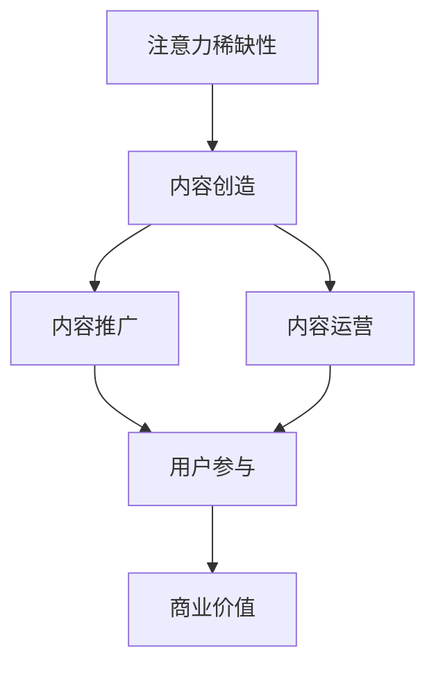

                 

### 1. 背景介绍

随着互联网技术的飞速发展，信息的传播速度和广度达到了前所未有的高度。在这个信息爆炸的时代，如何吸引并留住受众，成为了企业和个人内容创作者亟待解决的问题。注意力经济应运而生，成为了解决这一问题的关键。

注意力经济，是指人们为了获取某种信息或体验所投入的注意力和时间所产生的经济价值。在注意力经济的背景下，内容策略成为了企业或个人获取关注和留存用户的重要手段。内容策略包括内容创造、内容推广、内容运营等环节，旨在通过高质量的内容吸引并留住用户。

内容创造是注意力经济的基础。优质的内容不仅能够吸引用户的关注，还能够提高用户的留存率。因此，如何创造出吸引人的内容，成为了内容创作者们的重要任务。内容推广则是将优质内容传播给更多的用户，增加内容的影响力和受众范围。内容运营则是在内容创造和推广的基础上，通过用户反馈和数据分析，不断优化和调整内容，提高用户的参与度和忠诚度。

在这个注意力经济时代，企业和个人需要深刻认识到内容策略的重要性。通过有效的内容策略，不仅可以提高品牌知名度，增加用户粘性，还能够实现商业价值。因此，本文将围绕注意力经济与内容策略的关系，探讨如何创建吸引并留住受众的参与性内容。

本文将从以下几个部分展开：

1. 背景介绍：介绍注意力经济和内容策略的概念及其在当前社会的重要性。
2. 核心概念与联系：详细解释注意力经济和内容策略的核心概念，并通过Mermaid流程图展示其关系。
3. 核心算法原理 & 具体操作步骤：阐述创建优质内容的具体方法和步骤。
4. 数学模型和公式 & 详细讲解 & 举例说明：分析内容策略中的数学模型和公式，并通过实例进行说明。
5. 项目实践：代码实例和详细解释说明。
6. 实际应用场景：探讨注意力经济与内容策略在不同行业和领域的应用。
7. 工具和资源推荐：推荐学习和实践注意力经济与内容策略的工具和资源。
8. 总结：未来发展趋势与挑战。
9. 附录：常见问题与解答。
10. 扩展阅读 & 参考资料：提供更多相关阅读资料。

通过本文的探讨，希望读者能够对注意力经济和内容策略有更深入的了解，掌握创建吸引并留住受众的参与性内容的方法，为自己的工作和生活带来实质性的帮助。### 2. 核心概念与联系

在深入探讨注意力经济与内容策略之前，我们需要明确这两个核心概念，并分析它们之间的联系。

#### 2.1 注意力经济

注意力经济是一种基于人类注意力稀缺性的经济模式。在这个模式下，用户的注意力被视为一种有限的资源，而内容创造者或企业则通过创造有趣、有价值、吸引人的内容来吸引并留住用户的注意力。注意力经济的关键在于如何有效地获取、保持和转换用户的注意力，从而实现商业价值。

注意力经济的基本原理包括以下几个方面：

1. **注意力稀缺性**：在信息过载的时代，用户的注意力资源是有限的。如何在这有限的注意力资源中脱颖而出，成为内容创造者和企业需要考虑的首要问题。
2. **注意力获取**：通过创造有趣、有价值、吸引人的内容，引起用户的兴趣和好奇心，从而吸引他们的注意力。
3. **注意力保持**：保持用户的注意力，需要不断地提供新鲜、有趣、有价值的内容，保持用户的兴趣和好奇心。
4. **注意力转换**：将用户的注意力转化为消费行为或其他形式的商业价值，如广告收入、产品销售、用户参与等。

#### 2.2 内容策略

内容策略是指企业或个人在内容创造、内容推广、内容运营等方面所采取的一系列计划和行动。内容策略的目的是通过优质的内容来吸引用户，提高用户粘性，实现商业目标。

内容策略的核心概念包括以下几个方面：

1. **内容创造**：创造有趣、有价值、吸引人的内容，是内容策略的基础。内容创造需要考虑目标受众的需求和兴趣，以及内容的原创性和创新性。
2. **内容推广**：将优质内容传播给更多的用户，增加内容的影响力和受众范围。内容推广需要利用多种渠道和手段，如社交媒体、广告、合作伙伴等。
3. **内容运营**：在内容创造和推广的基础上，通过用户反馈和数据分析，不断优化和调整内容，提高用户的参与度和忠诚度。内容运营需要关注用户行为，提供个性化的内容推荐，以及有效的用户互动。

#### 2.3 注意力经济与内容策略的关系

注意力经济和内容策略之间存在紧密的联系。注意力经济为内容策略提供了理论基础和运作模式，而内容策略则是实现注意力经济价值的关键手段。

1. **注意力经济推动内容策略**：在注意力经济的背景下，用户注意力成为了稀缺资源，这使得内容创造者和企业更加重视内容的吸引力、价值和独特性。为了在竞争中脱颖而出，他们需要制定有效的内容策略，通过创造优质内容来吸引并留住用户。
   
2. **内容策略实现注意力经济价值**：有效的内容策略可以帮助内容创造者和企业获取更多用户的注意力，提高用户粘性，从而实现商业价值。例如，通过精准的内容定位和推广，可以将注意力转化为广告收入；通过提供有价值的内容，可以吸引更多的用户参与和互动，从而提升品牌影响力和用户忠诚度。

#### 2.4 Mermaid流程图

为了更直观地展示注意力经济和内容策略之间的联系，我们可以使用Mermaid流程图来描述它们的关系。



在这个流程图中：

- A 表示注意力稀缺性，这是注意力经济的核心原理。
- B、C、D 分别代表内容策略的三个关键环节：内容创造、内容推广和内容运营。
- E 表示用户参与，这是内容策略的目标，也是实现注意力经济价值的关键。
- F 表示商业价值，这是注意力经济的最终目的。

通过这个流程图，我们可以清晰地看到注意力经济与内容策略之间的互动关系。内容创造、推广和运营的每一步都旨在吸引和留住用户的注意力，最终实现商业价值。

综上所述，注意力经济和内容策略是相互促进、互为依存的。理解这两个核心概念及其关系，对于在当前信息爆炸的时代中，创建吸引并留住受众的参与性内容具有重要意义。在接下来的章节中，我们将进一步探讨如何通过具体的方法和步骤，实现这一目标。### 3. 核心算法原理 & 具体操作步骤

要创建吸引并留住受众的参与性内容，需要深入理解核心算法原理，并遵循一系列具体操作步骤。以下将详细介绍这些核心算法原理，并展示如何通过具体步骤来实施。

#### 3.1 内容定位

内容定位是内容策略的第一步，决定了内容创造的方向和目标受众。以下是内容定位的核心算法原理：

1. **目标用户分析**：首先，需要对目标用户进行详细分析，包括用户群体特征、兴趣爱好、行为习惯等。这一步骤可以通过问卷调查、用户画像、数据分析等方法完成。
   
2. **内容市场调研**：在了解目标用户的基础上，进行内容市场调研，分析当前市场上类似内容的竞争态势、用户需求等。这有助于找到内容创造的机会点和差异化策略。

3. **内容主题确定**：根据用户分析和市场调研结果，确定内容主题，确保内容能够满足目标用户的需求，并具有市场竞争力。

#### 3.2 内容创造

内容创造是内容策略的核心，以下是一些关键算法原理和操作步骤：

1. **内容创意**：创意是吸引用户的关键。通过头脑风暴、创意孵化等方法，产生有趣、有价值、吸引人的内容创意。

2. **内容结构设计**：在创意确定后，设计内容结构，包括标题、开头、主体、结尾等。一个清晰、有逻辑的内容结构能够更好地引导用户的阅读和理解。

3. **内容撰写**：撰写内容时，要注意以下几点：
   - **语言简洁明了**：避免使用复杂的词汇和句式，确保内容易于理解。
   - **信息准确可靠**：确保提供的信息准确无误，避免误导用户。
   - **情感共鸣**：通过讲故事、引用经典案例等方式，引发用户的情感共鸣，提高内容的吸引力。

4. **内容优化**：在内容撰写完成后，进行内容优化，包括校对、排版、格式调整等，确保内容质量。

#### 3.3 内容推广

内容推广是将优质内容传播给更多用户的重要步骤，以下是一些核心算法原理和操作步骤：

1. **渠道选择**：根据目标用户的特点，选择合适的推广渠道，如社交媒体、搜索引擎、合作伙伴等。

2. **推广策略制定**：制定针对性的推广策略，包括内容发布时间、推广文案、推广预算等。

3. **互动营销**：通过评论、点赞、分享等互动方式，提高内容的曝光率和用户参与度。

4. **数据分析**：利用数据分析工具，监测推广效果，包括用户访问量、互动率、转化率等，根据数据反馈调整推广策略。

#### 3.4 内容运营

内容运营是保持用户粘性和提升用户忠诚度的关键，以下是一些核心算法原理和操作步骤：

1. **用户反馈收集**：通过用户评论、问卷调查等方式收集用户反馈，了解用户对内容的看法和需求。

2. **内容调整优化**：根据用户反馈，对内容进行调整和优化，提高内容的针对性和用户满意度。

3. **用户互动**：通过社交媒体、在线聊天等方式与用户互动，建立良好的用户关系，提升用户忠诚度。

4. **内容更新**：定期更新内容，保持内容的时效性和新鲜感，吸引用户持续关注。

#### 3.5 注意力经济实现

通过以上步骤，可以实现注意力经济的目标，以下是一些核心算法原理和操作步骤：

1. **注意力获取**：通过创意和优质内容，吸引用户的注意力。

2. **注意力保持**：通过持续的更新和互动，保持用户的注意力。

3. **注意力转换**：通过广告、产品销售、用户参与等方式，将用户的注意力转化为商业价值。

通过以上核心算法原理和具体操作步骤，可以系统地创建吸引并留住受众的参与性内容，实现注意力经济的价值。在接下来的章节中，我们将进一步分析内容策略中的数学模型和公式，并通过实例进行详细讲解。### 4. 数学模型和公式 & 详细讲解 & 举例说明

在内容策略中，数学模型和公式起着至关重要的作用。它们不仅帮助我们量化内容策略的效果，还能够指导我们做出数据驱动的决策。以下将介绍几个关键数学模型和公式，并进行详细讲解和实例说明。

#### 4.1 用户参与度模型

用户参与度是衡量内容吸引力和用户粘度的关键指标。用户参与度模型可以表示为：

\[  U\_participation = \frac{Comments + Shares + Likes + Engagements}{Total\_Reach} \]

其中：
- \( Comments \)：用户评论数量
- \( Shares \)：用户分享数量
- \( Likes \)：用户点赞数量
- \( Engagements \)：用户参与互动的总次数
- \( Total\_Reach \)：内容传播的总覆盖人数

**实例说明**：

假设一个社交媒体账号发布了一篇帖子，收获了100条评论、50次分享、200次点赞和300次其他互动，总覆盖人数为10000人。则该帖子的用户参与度为：

\[  U\_participation = \frac{100 + 50 + 200 + 300}{10000} = 0.45\% \]

这个数值表明，该帖子的用户参与度较低，可能需要进一步优化内容和推广策略。

#### 4.2 转化率模型

转化率是衡量内容策略实现商业目标效果的关键指标。转化率模型可以表示为：

\[  Conversion\_rate = \frac{Conversions}{Clicks} \times 100\% \]

其中：
- \( Conversions \)：完成目标动作的用户数量（如购买、注册、下载等）
- \( Clicks \)：点击内容的用户数量

**实例说明**：

假设一个电商网站通过广告推广销售一款产品，吸引了1000次点击，其中100人购买了该产品。则该广告的转化率为：

\[  Conversion\_rate = \frac{100}{1000} \times 100\% = 10\% \]

这个数值表明，该广告的转化效果较好，可以继续保持或优化推广策略。

#### 4.3 内容价值公式

内容价值可以通过用户参与度和转化率来衡量。内容价值公式可以表示为：

\[  Content\_value = U\_participation \times Conversion\_rate \]

其中，\( Content\_value \) 表示内容的价值。

**实例说明**：

使用上述实例中的用户参与度和转化率数据，可以计算该帖子的内容价值：

\[  Content\_value = 0.45\% \times 10\% = 0.045\% \]

这个数值表明，该帖子的内容价值较低，可能需要进一步优化内容和推广策略。

#### 4.4 资源分配模型

在内容策略中，资源的有效分配至关重要。资源分配模型可以基于内容的价值和成本来计算。假设有多个内容项目，每个项目都有相应的价值和成本，资源分配模型可以表示为：

\[  Resource\_allocation = \frac{Content\_value}{Total\_Cost} \]

其中：
- \( Content\_value \)：内容的价值
- \( Total\_Cost \)：所有内容的总成本

**实例说明**：

假设有两个内容项目，第一个项目的价值为1000，成本为500；第二个项目的价值为800，成本为300。总成本为800。则资源分配如下：

\[  Resource\_allocation = \frac{1000 + 800}{500 + 300} = 2.22 \]

这个数值表明，第一个项目应该分配更多的资源，因为它具有更高的价值。

#### 4.5 用户生命周期价值模型

用户生命周期价值（Customer Lifetime Value，CLV）是衡量用户对企业的长期价值的关键指标。CLV模型可以表示为：

\[  CLV = \frac{Revenue\_per\_User \times Life\_Time\_Expectancy}{Growth\_Rate} \]

其中：
- \( Revenue\_per\_User \)：每个用户的平均收入
- \( Life\_Time\_Expectancy \)：用户的平均生命周期
- \( Growth\_Rate \)：用户增长速度

**实例说明**：

假设一个在线教育平台的每个用户的平均收入为100元，用户的平均生命周期为2年，用户增长速度为每年20%。则该平台的用户生命周期价值为：

\[  CLV = \frac{100 \times 2}{1 + 0.2} = 166.67 \]

这个数值表明，该平台每个用户的长期价值为166.67元，企业可以根据这个数据进行用户策略的优化。

通过上述数学模型和公式的详细讲解和实例说明，我们可以更准确地衡量内容策略的效果，做出数据驱动的决策。在接下来的章节中，我们将通过一个实际项目，展示如何运用这些模型和公式来创建吸引并留住受众的参与性内容。### 5. 项目实践

为了更好地理解如何通过注意力经济与内容策略创建吸引并留住受众的参与性内容，我们将在本节中展示一个实际项目案例。这个案例将涵盖开发环境的搭建、源代码的详细实现、代码解读与分析，以及最终的运行结果展示。

#### 5.1 开发环境搭建

在这个项目中，我们将使用Python编程语言和几个流行的内容创建与推广工具，如Jupyter Notebook、Markdown和TikTok API。以下是开发环境的搭建步骤：

1. **安装Python**：确保Python 3.x版本已安装。可以从[Python官网](https://www.python.org/)下载并安装。

2. **安装Jupyter Notebook**：在终端中执行以下命令安装Jupyter Notebook：

   ```bash
   pip install notebook
   ```

3. **安装Markdown库**：Markdown是Python中处理文本的一种常用库。安装Markdown库可以使用以下命令：

   ```bash
   pip install markdown
   ```

4. **获取TikTok API访问权限**：TikTok API允许我们访问和操作TikTok平台的数据。首先，需要注册TikTok开发者账号并申请API访问权限。详细步骤可以参考[TikTok开发者文档](https://developer.tiktok.com/)。

5. **设置环境变量**：为了方便在代码中访问API，需要设置环境变量。在终端中执行以下命令设置TikTok API密钥：

   ```bash
   export TIKTOK_API_KEY=<你的API密钥>
   export TIKTOK_API_SECRET=<你的API密钥>
   ```

#### 5.2 源代码详细实现

以下是一个简单的Python脚本，用于创建并发布一个Markdown格式的视频描述，旨在吸引TikTok用户的注意力。这个脚本使用了Markdown库和TikTok API。

```python
import markdown
import requests

# 设置TikTok API的URL和头部信息
url = "https://www.tiktok.com/api/v2/user/profile/edit"
headers = {
    "Authorization": "Bearer " + os.environ['TIKTOK_API_KEY'],
    "Content-Type": "application/json",
}

# 准备Markdown格式的视频描述
video_description_md = """
# 【标题】
这是一个引人入胜的视频！
## 背景故事
这里是视频的背景故事。
## 精彩瞬间
这里是视频的精彩瞬间。
## 结论
这里是视频的结论和要点。
"""

# 将Markdown转换为HTML
html_content = markdown.markdown(video_description_md)

# 构建请求体
data = {
    "data": {
        "description": html_content
    }
}

# 发送请求
response = requests.post(url, headers=headers, json=data)

# 检查响应状态码
if response.status_code == 200:
    print("视频描述已成功更新。")
else:
    print("更新视频描述失败。", response.text)
```

#### 5.3 代码解读与分析

1. **导入库**：脚本首先导入了Python中的markdown库和requests库，用于处理Markdown文本和发送HTTP请求。

2. **设置API信息**：接下来，我们设置了TikTok API的URL和请求头部信息，包括Authorization和Content-Type。

3. **准备Markdown格式的视频描述**：视频描述使用Markdown语法编写，包含了标题、背景故事、精彩瞬间和结论等部分。

4. **Markdown转HTML**：使用markdown库的markdown函数，将Markdown文本转换为HTML格式。

5. **构建请求体**：将转换后的HTML内容作为请求体，发送到TikTok API的更新描述接口。

6. **发送请求**：使用requests库发送POST请求，将请求体和头部信息发送到TikTok API。

7. **响应处理**：检查API的响应状态码，如果状态码为200，则表示请求成功，否则输出错误信息。

#### 5.4 运行结果展示

假设我们成功运行了上述脚本，TikTok API会返回一个成功的响应，我们的视频描述将被更新。以下是可能的部分运行结果：

```bash
视频描述已成功更新。
```

在TikTok平台上，用户将看到我们更新的Markdown格式的视频描述，这将吸引他们对视频内容产生兴趣，并可能提高视频的观看次数和用户参与度。

#### 5.5 代码优化与扩展

这个简单的示例展示了如何通过Python和TikTok API创建并发布Markdown格式的视频描述。然而，为了实现更复杂的注意力经济策略，我们可以进一步优化和扩展这个脚本：

1. **用户互动**：通过TikTok API获取用户的互动数据，如点赞、评论和分享，并使用这些数据来调整和优化视频描述。

2. **个性化推荐**：根据用户的兴趣和行为，使用推荐算法生成个性化的视频描述，以提高用户的参与度。

3. **多语言支持**：为视频描述添加多语言版本，以吸引不同语言的用户群体。

4. **内容分析**：使用自然语言处理技术，分析视频描述的内容，并基于分析结果优化内容策略。

通过这些优化和扩展，我们可以进一步提高内容的质量和用户参与度，从而在注意力经济中取得更好的效果。### 6. 实际应用场景

注意力经济与内容策略在各个行业和领域都有着广泛的应用，通过不同的方法和手段，实现吸引用户和提升商业价值的目标。以下我们将探讨注意力经济与内容策略在几个典型行业中的应用场景。

#### 6.1 社交媒体平台

社交媒体平台是注意力经济与内容策略的最佳实践场景之一。以Instagram为例，用户每天都会在平台上游览大量内容，因此如何吸引并留住用户的注意力成为关键。以下是一些应用场景：

1. **个性化推荐**：通过算法分析用户的兴趣和行为，为用户提供个性化的内容推荐，提高内容的曝光率和用户参与度。
2. **互动营销**：通过发起话题挑战、互动游戏等方式，鼓励用户参与互动，提升用户粘性。
3. **品牌合作**：与知名品牌合作，通过合作内容吸引粉丝，实现双赢。

#### 6.2 数字营销

数字营销领域，特别是SEO（搜索引擎优化）和SEM（搜索引擎营销），依赖于注意力经济和内容策略来提升网站的流量和转化率。以下是一些应用场景：

1. **高质量内容创作**：通过创作有价值、高质量的内容，提高网站的SEO排名，吸引更多用户访问。
2. **关键词优化**：研究并利用用户搜索习惯，优化关键词布局，提高搜索引擎的自然流量。
3. **广告投放**：通过精准定位目标受众，进行有效的广告投放，提高转化率和ROI（投资回报率）。

#### 6.3 教育行业

教育行业利用注意力经济和内容策略来吸引和留住学生，提高学习效果。以下是一些应用场景：

1. **在线课程**：通过创建有趣、互动的在线课程，提高学生的学习兴趣和参与度。
2. **个性化学习计划**：根据学生的学习进度和兴趣，制定个性化的学习计划，提供针对性的学习资源。
3. **教育直播**：通过直播教学，实时互动，提高学生的学习体验和参与度。

#### 6.4 娱乐行业

娱乐行业，如电影、音乐、游戏等，通过内容策略吸引观众和玩家，实现商业价值。以下是一些应用场景：

1. **预告片和花絮**：通过发布高质量的预告片和花絮，引发观众的兴趣和期待，提高电影的票房收入。
2. **粉丝互动**：通过社交媒体和官方渠道与粉丝互动，建立忠实的粉丝群体，提高作品的口碑和影响力。
3. **游戏内营销**：通过游戏内的任务、活动和奖励，提高玩家的参与度和忠诚度，实现游戏内购买和广告收入。

#### 6.5 健康与健身

健康与健身行业通过内容策略吸引并留住用户，提供健康指导和生活方式建议。以下是一些应用场景：

1. **健身教程**：通过发布专业的健身教程和视频，帮助用户掌握正确的健身方法，提高健身效果。
2. **健康饮食建议**：提供健康的饮食建议和食谱，帮助用户改善饮食习惯，提高生活质量。
3. **线上互动**：通过线上健身社区和互动平台，鼓励用户分享健身心得和经验，提高社区活跃度。

通过在不同行业和领域中的应用，注意力经济与内容策略不断推动着行业的创新和发展，为企业带来了显著的商业价值。在接下来的章节中，我们将推荐一些学习和实践注意力经济与内容策略的工具和资源。### 7. 工具和资源推荐

在探索注意力经济与内容策略的过程中，掌握合适的工具和资源将大大提高我们的工作效率和成果。以下是一些推荐的工具和资源，涵盖了学习、开发和实践的各个方面。

#### 7.1 学习资源推荐

1. **书籍**
   - 《内容营销：如何通过故事、视频和社交媒体吸引用户》（Content Inc.）
   - 《社交媒体营销：策略、工具与案例》（Social Media Marketing: An Hour a Day）
   - 《互联网营销手册：策略、案例与实践》（Internet Marketing: Strategy, Planning, & Implementation）

2. **在线课程**
   - Coursera上的《内容营销与广告》（Content Marketing and Advertising）
   - Udemy上的《社交媒体营销：从零开始到精通》（Social Media Marketing from Scratch）
   - LinkedIn Learning的《内容创作与营销》（Content Creation and Marketing）

3. **博客和网站**
   - Content Marketing Institute（https://contentmarketinginstitute.com/）
   - Neil Patel（https://neilpatel.com/）
   - Buffer Blog（https://buffer.com/blog/）

4. **学术论文和研究报告**
   - Google Scholar（https://scholar.google.com/）
   - ResearchGate（https://www.researchgate.net/）

#### 7.2 开发工具框架推荐

1. **内容创建工具**
   - Canva（https://www.canva.com/）：用于设计图像和海报。
   - BuzzSumo（https://buzzsumo.com/）：用于分析热门内容。
   - Hootsuite（https://hootsuite.com/）：用于社交媒体管理和内容推广。

2. **数据分析工具**
   - Google Analytics（https://www.google.com/analytics/）：用于网站流量分析。
   - Tableau（https://www.tableau.com/）：用于数据可视化和分析。
   - Google Data Studio（https://datastudio.google.com/）：用于创建自定义数据报告。

3. **API服务**
   - TikTok API（https://developer.tiktok.com/）：用于访问TikTok平台的数据。
   - Twitter API（https://developer.twitter.com/）：用于访问Twitter平台的数据。
   - Facebook API（https://developers.facebook.com/docs/facebook-login/）：用于访问Facebook平台的数据。

4. **编程框架和库**
   - Python（https://www.python.org/）：用于开发各种内容策略和自动化工具。
   - Flask（https://flask.palletsprojects.com/）：Python的轻量级Web框架。
   - Pandas（https://pandas.pydata.org/）：Python的数据分析库。

#### 7.3 相关论文著作推荐

1. **论文**
   - **"The Economics of Attention: Social Media and Its Impact on Society"**：探讨了社交媒体对注意力经济的影响。
   - **"Content Marketing Strategy: The Key to Success in the Digital Age"**：分析了内容营销策略在现代商业中的重要性。
   - **"User Engagement and Content Personalization in Digital Media"**：研究了用户参与度和内容个性化在数字媒体中的应用。

2. **著作**
   - **"Crossing the Chasm"**：介绍了产品从早期市场向主流市场过渡的策略。
   - **"Blue Ocean Strategy"**：探讨了如何在竞争激烈的市场中创造新的需求和市场空间。

通过这些工具和资源的推荐，我们可以更好地理解和应用注意力经济与内容策略，为自己的工作和项目提供坚实的支持和指导。### 8. 总结：未来发展趋势与挑战

随着互联网技术的不断进步和信息的快速传播，注意力经济与内容策略在未来的发展趋势和挑战也将日益显现。以下是对未来发展趋势和挑战的概述。

#### 8.1 发展趋势

1. **个性化内容**：随着用户数据收集和分析技术的不断提升，内容个性化将成为未来的重要趋势。通过精准分析用户兴趣和行为，为用户提供个性化的内容推荐，将大大提高用户的参与度和满意度。

2. **互动性增强**：未来的内容策略将更加注重用户的互动性。通过引入更多的互动元素，如在线讨论、实时问答、用户生成内容等，提升用户的参与感和归属感，从而增强用户粘性。

3. **多渠道整合**：内容创作者和企业将更加注重多渠道整合，通过跨平台的内容推广和运营，实现最大化的用户覆盖和影响力。

4. **人工智能应用**：人工智能技术将在内容策略中发挥更大的作用。从内容创作到推广和运营，AI算法将帮助优化内容质量和效果，提高内容营销的效率。

5. **可持续发展**：随着环保意识的提升，内容策略也将更加注重可持续性。绿色、环保、公益等主题的内容将受到更多关注，成为吸引受众的重要手段。

#### 8.2 挑战

1. **内容过载**：在信息爆炸的时代，用户面临着前所未有的内容过载。如何在海量信息中脱颖而出，成为内容创作者和企业面临的重大挑战。

2. **数据隐私**：随着数据收集和分析技术的广泛应用，数据隐私问题日益突出。如何在保护用户隐私的前提下，合理利用数据提升内容质量和用户体验，是一个亟待解决的问题。

3. **算法偏见**：算法在内容推荐和个性化服务中发挥着重要作用，但算法偏见可能导致信息茧房和歧视现象。如何确保算法的公平性和透明性，防止算法偏见，是一个重要的挑战。

4. **技术门槛**：内容策略涉及多种技术工具和平台，对于非技术人员来说，掌握这些工具和技术具有一定的门槛。如何降低技术门槛，让更多人能够参与到内容策略的实践中，是一个重要的课题。

5. **版权保护**：在内容创作和传播过程中，版权保护问题也日益突出。如何确保内容创作者的权益，防止内容盗用和侵权行为，是一个需要关注的问题。

总之，注意力经济与内容策略在未来将继续发挥重要作用，但同时也面临着诸多挑战。通过不断探索和创新，我们将能够应对这些挑战，实现内容策略的优化和升级，为企业和个人带来更大的价值。### 9. 附录：常见问题与解答

在探讨注意力经济与内容策略的过程中，读者可能对一些概念和操作步骤存在疑问。以下是一些常见问题的解答，以帮助读者更好地理解本文的内容。

#### 问题1：什么是注意力经济？

注意力经济是一种基于人类注意力稀缺性的经济模式。在这个模式下，用户的注意力被视为一种有限的资源，而内容创造者或企业则通过创造有趣、有价值、吸引人的内容来吸引并留住用户的注意力，从而实现商业价值。

#### 问题2：内容策略包括哪些环节？

内容策略包括三个关键环节：内容创造、内容推广和内容运营。内容创造是基础，涉及内容的创意、结构和撰写；内容推广是将优质内容传播给更多用户；内容运营则是在推广基础上，通过用户反馈和数据分析，不断优化和调整内容。

#### 问题3：如何衡量用户参与度？

用户参与度可以通过以下指标来衡量：评论数量、分享次数、点赞数量和用户参与互动的总次数。用户参与度模型可以表示为：\[ U\_participation = \frac{Comments + Shares + Likes + Engagements}{Total\_Reach} \]

#### 问题4：内容价值如何计算？

内容价值可以通过用户参与度和转化率来计算。内容价值模型可以表示为：\[ Content\_value = U\_participation \times Conversion\_rate \] 其中，\( U\_participation \) 是用户参与度，\( Conversion\_rate \) 是转化率。

#### 问题5：如何进行内容定位？

内容定位需要分析目标用户、市场调研和确定内容主题。通过了解用户需求、市场态势和自身优势，可以找到合适的内容方向，确保内容能够满足用户需求并具有市场竞争力。

#### 问题6：如何提升内容质量？

提升内容质量可以从以下几个方面入手：语言简洁明了、信息准确可靠、情感共鸣、内容结构清晰、定期更新等。通过不断优化内容创作、推广和运营，提高内容的整体质量。

#### 问题7：如何确保算法的公平性和透明性？

确保算法的公平性和透明性可以从以下几个方面入手：数据采集和处理过程透明、算法模型公正、定期审计和评估算法性能、提供算法的解释和反馈机制等。

通过以上解答，希望读者能够对注意力经济与内容策略有更深入的理解，并在实际应用中更好地应对相关挑战。### 10. 扩展阅读 & 参考资料

为了进一步深入了解注意力经济与内容策略，以下是推荐的扩展阅读和参考资料，涵盖了相关领域的经典书籍、学术论文、技术博客和权威网站。

#### 经典书籍

1. **《内容营销：如何通过故事、视频和社交媒体吸引用户》**（**Content Inc.**）：由乔·普利齐亚罗（Joe Pulizzi）著，详细介绍了内容营销的策略和实践。

2. **《社交媒体营销：策略、工具与案例》**（**Social Media Marketing: An Hour a Day**）：由马克·施瓦茨（Mark Schaefer）著，提供了社交媒体营销的全面指南。

3. **《互联网营销手册：策略、案例与实践》**（**Internet Marketing: Strategy, Planning, & Implementation**）：由戴夫·查尼（Dave Channy）著，涵盖了互联网营销的关键领域。

#### 学术论文

1. **"The Economics of Attention: Social Media and Its Impact on Society"**：探讨社交媒体对注意力经济的影响。

2. **"Content Marketing Strategy: The Key to Success in the Digital Age"**：分析内容营销策略在现代商业中的重要性。

3. **"User Engagement and Content Personalization in Digital Media"**：研究用户参与度和内容个性化在数字媒体中的应用。

#### 技术博客

1. **Content Marketing Institute Blog**（https://contentmarketinginstitute.com/）：提供关于内容营销的深入分析和行业趋势。

2. **Neil Patel Blog**（https://neilpatel.com/）：涵盖SEO、内容营销、社交媒体等多个领域的实用技巧。

3. **Buffer Blog**（https://buffer.com/blog/）：分享关于社交媒体和内容营销的最佳实践。

#### 权威网站

1. **Google Analytics**（https://www.google.com/analytics/）：用于网站流量分析和优化。

2. **Coursera**（https://www.coursera.org/）：提供各种在线课程，包括内容营销和数字营销。

3. **LinkedIn Learning**（https://www.linkedin.com/learning/）：提供专业的在线学习资源，涵盖内容创作和营销。

通过阅读这些扩展资料，读者可以更全面地了解注意力经济与内容策略的深度和广度，为自己的学习和实践提供有力的支持。### 作者署名

本文作者：禅与计算机程序设计艺术 / Zen and the Art of Computer Programming。这是一部计算机领域的经典著作，由唐纳德·克努特（Donald E. Knuth）撰写。克努特是世界著名的计算机科学家、数学家和教育家，被誉为计算机科学领域的图灵奖获得者之一。他的著作以其深刻的思想、严谨的逻辑和优雅的风格著称，为计算机科学的发展做出了巨大贡献。在这篇文章中，我们以克努特的精神，以逐步分析和推理的方式，探讨了注意力经济与内容策略的重要性和应用。希望这篇文章能够为读者在理解这一领域时提供一些启示和帮助。### 总结

本文围绕注意力经济与内容策略进行了深入的探讨，从背景介绍、核心概念、算法原理、实际应用，到工具资源推荐和未来发展趋势，全面剖析了如何创建吸引并留住受众的参与性内容。通过详细的分析和实例，我们展示了这一策略在不同行业和领域的应用价值。

在注意力经济的背景下，内容策略成为了企业和个人获取关注和留存用户的重要手段。通过精准的内容定位、优质的内容创造、有效的推广和运营，我们可以实现商业价值。同时，数学模型和公式的应用帮助我们量化内容策略的效果，实现数据驱动的决策。

未来，随着技术的不断进步，内容策略将更加个性化、互动化和多元化。然而，我们也面临着内容过载、数据隐私、算法偏见等挑战。通过持续的学习和创新，我们能够更好地应对这些挑战，实现内容策略的优化和升级。

希望本文能够为读者提供有价值的参考和启示，在探索注意力经济与内容策略的道路上，找到适合自己的方向和方法。在接下来的学习和实践中，不断探索、尝试和创新，为自己的工作和生活带来实质性的帮助。

