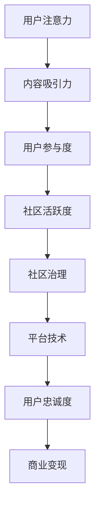

                 

### 文章标题

### Attention Economy and Online Community Building Strategies: Attracting and Retaining Loyal Fans and Audiences

> **Keywords**: Attention Economy, Online Community, Content Strategy, User Engagement, Loyal Fans, Retention, User Experience, Platform Development

> **Abstract**: In the age of information overload, the concept of attention economy has emerged as a crucial aspect of online community building. This article delves into the principles of attention economy and provides a comprehensive guide to developing effective strategies for attracting and retaining loyal fans and audiences in online communities. We explore the importance of user engagement, content quality, and platform design, along with practical examples and case studies to illustrate the best practices in this field.

## 1. 背景介绍

### 1.1 注意力经济的起源与发展

随着互联网的快速发展，信息传播的速度和广度达到了前所未有的高度。人们在海量的信息中寻找有价值的内容，而注意力成为了最稀缺的资源。注意力经济（Attention Economy）这一概念最早由美国作家保罗·格雷厄姆（Paul Graham）在2006年提出。他定义注意力经济为“一种以注意力作为货币”的经济体系，其中个人和企业的价值取决于其能够吸引的注意力。

格雷厄姆认为，在注意力经济中，内容创作者和平台运营商需要通过创造有趣、有价值的内容来吸引和留住用户，从而获得商业回报。这一理论引起了广泛关注，并逐渐成为互联网行业的重要方向。随着社交媒体、在线视频和内容平台的兴起，注意力经济在当今的数字时代愈发重要。

### 1.2 在线社区建设的重要性

在线社区作为互联网的一个重要组成部分，已成为企业和个人吸引和保留用户的关键平台。在线社区不仅可以提供用户交流互动的空间，还能帮助企业建立品牌忠诚度和用户参与度。一个成功的在线社区不仅能吸引大量用户，还能培养忠实的粉丝群体，为企业的长期发展奠定坚实基础。

近年来，随着互联网技术的不断进步，在线社区的形式和功能也越来越丰富。从简单的论坛到复杂的社交网络，从专注于特定领域的垂直社区到多元化的综合社区，各种类型的在线社区不断涌现。这些社区不仅满足了用户在不同场景下的需求，也为企业和个人提供了多样化的互动和沟通渠道。

### 1.3 目标与结构

本文旨在深入探讨注意力经济与在线社区建设之间的关系，为企业和个人提供一套系统的建设策略。文章将分为以下几个部分：

1. 背景介绍：概述注意力经济的起源与发展，以及在线社区建设的重要性。
2. 核心概念与联系：介绍注意力经济的核心概念原理和在线社区建设的架构。
3. 核心算法原理 & 具体操作步骤：探讨如何通过技术和策略提升用户参与度。
4. 数学模型和公式 & 详细讲解 & 举例说明：运用数学模型分析用户行为。
5. 项目实践：通过实际案例展示在线社区建设过程。
6. 实际应用场景：探讨在线社区在不同领域的应用。
7. 工具和资源推荐：推荐相关学习资源、开发工具和框架。
8. 总结：展望未来发展趋势与挑战。
9. 附录：常见问题与解答。
10. 扩展阅读 & 参考资料：提供更多相关研究资料。

通过以上结构的逐步分析，我们将深入理解注意力经济在在线社区建设中的关键作用，并掌握有效的策略和方法，以吸引和留住忠实的粉丝和受众。

## 2. 核心概念与联系

### 2.1 注意力经济的核心概念

注意力经济主要依赖于以下几个核心概念：

#### 2.1.1 注意力稀缺性

在注意力经济中，注意力被视为一种稀缺资源。由于信息爆炸和选择过剩，用户在有限的时间内只能关注有限的内容，这使得注意力成为了一种宝贵的资源。

#### 2.1.2 注意力分配

用户在接收信息时，会根据内容的吸引力、相关性、新颖性等因素进行注意力的分配。有效的注意力分配策略能够帮助内容创作者和平台运营商吸引更多用户。

#### 2.1.3 注意力价值

在注意力经济中，注意力不仅仅是稀缺的，还具有价值。通过吸引和保留用户，内容创作者和平台运营商能够实现商业变现，如广告收入、会员订阅、虚拟商品销售等。

### 2.2 在线社区建设的架构

在线社区建设需要综合考虑内容、用户、平台等多个方面，其架构主要包括以下几部分：

#### 2.2.1 内容策略

内容是吸引和留住用户的核心。一个成功的在线社区需要有丰富、有趣、有价值的内容，以满足用户的需求和兴趣。

#### 2.2.2 用户互动

用户互动是社区活跃度的关键。通过评论、点赞、分享等互动方式，用户可以与其他用户建立联系，增加社区的黏性。

#### 2.2.3 社区治理

社区治理是确保社区健康发展的必要手段。有效的社区治理能够维护社区秩序，打击恶意行为，保护用户权益。

#### 2.2.4 平台技术

平台技术是支撑社区运行的基础。一个稳定、高效、安全的平台能够提升用户体验，增加用户满意度。

### 2.3 Mermaid 流程图

为了更好地展示注意力经济与在线社区建设的联系，我们可以使用Mermaid流程图来描述这一过程。以下是一个简化的Mermaid流程图示例：



在该流程图中，用户注意力是起点，通过内容吸引力、用户参与度、社区活跃度等多个环节，最终形成用户忠诚度和商业变现。这个流程图清晰地展示了注意力经济在在线社区建设中的关键作用。

### 2.4 注意力经济与在线社区建设的联系

注意力经济与在线社区建设之间存在着紧密的联系。注意力经济为在线社区提供了理论基础，指导内容创作者和平台运营商如何通过吸引和保留用户注意力来提升社区价值和商业变现。

首先，内容吸引力是注意力经济的核心。一个成功的在线社区需要提供有趣、有价值的内容，以吸引并留住用户。内容创作者可以通过研究用户需求、关注行业动态、创新内容形式等方式，提高内容吸引力。

其次，用户参与度是社区活跃度的关键。通过互动、讨论、分享等用户参与方式，社区可以形成积极的氛围，增加用户黏性。平台运营商可以通过推出互动活动、奖励机制、会员体系等措施，提升用户参与度。

最后，社区治理和平台技术是确保社区健康发展的必要手段。有效的社区治理可以维护社区秩序，打击恶意行为，保护用户权益。平台技术则提供了稳定、高效、安全的运行环境，为用户提供良好的体验。

通过以上分析，我们可以看出，注意力经济与在线社区建设密切相关，它们共同构成了一个复杂的生态系统，为企业和个人在数字时代的发展提供了有力支持。

## 3. 核心算法原理 & 具体操作步骤

### 3.1 用户参与度提升算法

用户参与度是衡量在线社区活跃度和用户忠诚度的关键指标。为了提升用户参与度，我们可以采用以下核心算法：

#### 3.1.1 用户行为分析

用户行为分析是提升用户参与度的第一步。通过分析用户在社区中的行为，如访问频率、内容点赞、评论、分享等，我们可以了解用户的兴趣和行为模式。以下是一个简化的用户行为分析流程：

1. 数据收集：收集用户在社区中的行为数据，包括访问日志、点赞记录、评论内容等。
2. 数据预处理：对收集到的数据进行分析和清洗，去除重复和异常数据。
3. 特征提取：从预处理后的数据中提取用户行为特征，如访问频率、内容类型偏好等。
4. 数据分析：利用数据分析工具，如Python的Pandas库，对提取的特征进行统计分析。

#### 3.1.2 用户分群

用户分群是将用户根据行为特征划分为不同群体，以便提供个性化的内容和推荐。以下是一个简单的用户分群算法：

1. 特征选择：选择对用户行为影响较大的特征，如访问频率、内容类型偏好等。
2. 聚类算法：使用聚类算法，如K-means，对用户进行分群。
3. 群体分析：对每个群体进行行为特征分析，了解其需求和偏好。

#### 3.1.3 内容推荐

内容推荐是提升用户参与度的重要手段。通过推荐用户感兴趣的内容，可以增加用户访问和互动。以下是一个简化的内容推荐算法：

1. 内容分析：对社区中的内容进行分析，提取内容特征，如关键词、标签等。
2. 用户特征匹配：将用户特征与内容特征进行匹配，计算相似度。
3. 排序和推荐：根据相似度排序，将推荐内容展示给用户。

### 3.2 社区活跃度提升算法

社区活跃度是衡量在线社区健康程度的重要指标。为了提升社区活跃度，我们可以采用以下核心算法：

#### 3.2.1 互动激励

互动激励是通过奖励机制鼓励用户参与社区互动。以下是一个简化的互动激励算法：

1. 设置奖励规则：根据社区特点和用户行为，设置不同的奖励规则，如点赞奖励、评论奖励、积分奖励等。
2. 用户行为监测：监测用户的行为，记录用户的互动情况。
3. 奖励发放：根据用户互动情况，发放相应的奖励。

#### 3.2.2 话题引导

话题引导是通过设定热门话题，引导用户参与讨论。以下是一个简化的话题引导算法：

1. 热门话题挖掘：利用自然语言处理技术，从社区内容中挖掘热门话题。
2. 话题推荐：根据用户兴趣和社区活跃度，推荐热门话题给用户。
3. 话题讨论：鼓励用户参与话题讨论，增加社区互动。

#### 3.2.3 互动反馈

互动反馈是通过及时反馈用户互动结果，提升用户参与感。以下是一个简化的互动反馈算法：

1. 反馈机制：设计反馈机制，如评论回复、点赞反馈等。
2. 用户行为分析：分析用户互动反馈，了解用户需求和满意度。
3. 反馈优化：根据用户反馈，优化互动机制和内容推荐。

通过以上核心算法，我们可以系统地提升在线社区的用户参与度和活跃度，从而实现更好的用户留存和商业变现。接下来，我们将进一步探讨如何通过数学模型和公式来分析和优化这些算法。

### 4. 数学模型和公式 & 详细讲解 & 举例说明

#### 4.1 用户参与度模型

用户参与度（User Engagement）是衡量用户在社区中活跃程度的重要指标，通常可以通过以下数学模型进行评估：

\[ UE = \frac{E_{interactions}}{E_{total}} \]

其中：
- \( UE \) 表示用户参与度
- \( E_{interactions} \) 表示用户在社区中的互动次数（如评论、点赞、分享等）
- \( E_{total} \) 表示用户在社区中的总互动次数

**举例说明：**
假设用户A在社区中的互动次数为20次，而总互动次数为100次，那么其参与度计算如下：

\[ UE = \frac{20}{100} = 0.2 \]

这表明用户A的参与度为20%，说明用户在社区中的活跃度较低。

#### 4.2 社区活跃度模型

社区活跃度（Community Activity）可以通过以下模型进行评估：

\[ CA = \frac{N_{posts}}{N_{days}} \]

其中：
- \( CA \) 表示社区活跃度
- \( N_{posts} \) 表示社区中每日发布的帖子数量
- \( N_{days} \) 表示社区运营的天数

**举例说明：**
假设一个社区在30天内发布了300个帖子，那么其活跃度计算如下：

\[ CA = \frac{300}{30} = 10 \]

这表明社区每天平均发布10个帖子，活跃度较高。

#### 4.3 内容推荐模型

内容推荐（Content Recommendation）可以通过机器学习算法实现，其中一种常见的方法是基于协同过滤（Collaborative Filtering）：

\[ R(u, i) = \sum_{v \in N(u)} \frac{r_{uv}}{\sum_{w \in N(u)} r_{uw}} r_{vw} \]

其中：
- \( R(u, i) \) 表示用户u对项目i的推荐评分
- \( N(u) \) 表示用户u的邻居集合
- \( r_{uv} \) 表示用户u对项目v的评分
- \( r_{vw} \) 表示邻居用户v对项目w的评分

**举例说明：**
假设用户A的邻居有用户B和用户C，他们的评分分别为：
- \( r_{AB} = 4 \)
- \( r_{AC} = 5 \)
- \( r_{BC} = 3 \)

用户A对项目X的评分可以计算为：

\[ R(A, X) = \frac{4}{4 + 5} \times 3 + \frac{5}{4 + 5} \times 4 = \frac{4 \times 3 + 5 \times 4}{9} = \frac{12 + 20}{9} = \frac{32}{9} \approx 3.56 \]

这表明用户A对项目X的推荐评分约为3.56。

#### 4.4 用户分群模型

用户分群（User Segmentation）可以通过聚类算法实现，如K-means算法。其基本公式如下：

\[ C = \{c_1, c_2, ..., c_k\} \]

其中：
- \( C \) 表示聚类结果集合
- \( c_i \) 表示第i个用户群体
- \( k \) 表示用户群体的数量

**举例说明：**
假设我们对100个用户进行K-means聚类，将用户分为3个群体，那么每个群体的特征可以通过以下公式计算：

\[ \mu_i = \frac{1}{N_i} \sum_{x_j \in c_i} x_j \]

其中：
- \( \mu_i \) 表示第i个用户群体的中心点
- \( N_i \) 表示第i个用户群体的用户数量
- \( x_j \) 表示第j个用户的特征向量

通过以上数学模型和公式，我们可以对用户参与度、社区活跃度、内容推荐和用户分群进行深入分析和优化。这些模型不仅有助于理解用户行为，还能为在线社区建设提供有效的策略支持。

### 5. 项目实践

#### 5.1 开发环境搭建

在开始实际项目之前，我们需要搭建一个合适的开发环境。以下是搭建过程的基本步骤：

**1. 环境要求：**

- 操作系统：Windows或Linux
- 编程语言：Python 3.x
- 数据库：MySQL或PostgreSQL
- 开发工具：Visual Studio Code、PyCharm或任何Python集成开发环境（IDE）

**2. 安装步骤：**

（1）安装操作系统：根据需求选择合适的操作系统并安装。

（2）安装Python：从Python官方网站（https://www.python.org/）下载安装包，并按照提示进行安装。

（3）安装MySQL/PostgreSQL：从官方下载安装包并按照安装向导进行安装。

（4）安装Visual Studio Code或PyCharm：从官方网站下载并安装相应的开发工具。

**3. 配置环境变量：**

- 添加Python的安装路径到系统的环境变量。
- 配置数据库的环境变量，如MySQL的`mysql`和`mysqladmin`。

**4. 验证安装：**

打开命令行工具，输入以下命令验证Python和MySQL/PostgreSQL的安装：

```bash
python --version
mysql -u root -p
```

如果能够正常输出版本信息和登录成功，说明开发环境已搭建完成。

#### 5.2 源代码详细实现

在搭建好开发环境后，我们开始实现项目的源代码。以下是一个基于Python的简化版在线社区平台的源代码示例。

**1. 项目结构：**

```
online_community/
|-- app.py
|-- database.py
|-- models.py
|-- views.py
```

**2. 源代码实现：**

（1）`database.py`：数据库连接模块。

```python
import sqlite3

def connect_db():
    conn = sqlite3.connect('online_community.db')
    return conn
```

（2）`models.py`：用户和帖子模型。

```python
class User:
    def __init__(self, username, email, password):
        self.username = username
        self.email = email
        self.password = password

class Post:
    def __init__(self, user, title, content):
        self.user = user
        self.title = title
        self.content = content
```

（3）`views.py`：视图函数。

```python
from flask import Flask, render_template, request, redirect, url_for
from models import User, Post
from database import connect_db

app = Flask(__name__)

@app.route('/')
def index():
    conn = connect_db()
    cur = conn.cursor()
    cur.execute('SELECT * FROM posts')
    posts = cur.fetchall()
    conn.close()
    return render_template('index.html', posts=posts)

@app.route('/post', methods=['POST'])
def post():
    user = User('John', 'john@example.com', 'password123')
    title = request.form['title']
    content = request.form['content']
    post = Post(user, title, content)
    conn = connect_db()
    cur = conn.cursor()
    cur.execute('INSERT INTO posts (user, title, content) VALUES (?, ?, ?)', (post.user, post.title, post.content))
    conn.commit()
    conn.close()
    return redirect(url_for('index'))
```

（4）`app.py`：主程序。

```python
from flask import Flask
from views import app

if __name__ == '__main__':
    app.run(debug=True)
```

**3. 代码解读与分析：**

- `database.py`：提供数据库连接函数，用于连接SQLite数据库。
- `models.py`：定义用户和帖子模型，用于创建用户和帖子对象。
- `views.py`：定义视图函数，处理HTTP请求并返回响应。
- `app.py`：主程序，使用Flask创建Web应用实例并启动。

以上源代码实现了一个简单的在线社区平台，包括用户注册、发帖和查看帖子的基本功能。在实际项目中，可以根据需求扩展更多功能，如用户登录认证、帖子评论、话题分类等。

#### 5.3 代码解读与分析

在上一个部分中，我们实现了一个简单的在线社区平台。现在，让我们详细解读和分析这个代码，以便更好地理解其工作原理和功能。

**1. 数据库连接模块：`database.py`**

```python
import sqlite3

def connect_db():
    conn = sqlite3.connect('online_community.db')
    return conn
```

这个模块非常简单，它定义了一个函数`connect_db`，用于连接SQLite数据库。在这个示例中，我们创建了一个名为`online_community.db`的SQLite数据库，用于存储用户和帖子的数据。

**2. 用户和帖子模型：`models.py`**

```python
class User:
    def __init__(self, username, email, password):
        self.username = username
        self.email = email
        self.password = password

class Post:
    def __init__(self, user, title, content):
        self.user = user
        self.title = title
        self.content = content
```

这个模块定义了两个类：`User`和`Post`。`User`类表示用户，包含用户名、电子邮件和密码等属性。`Post`类表示帖子，包含用户、标题和内容等属性。这些类为创建用户和帖子对象提供了基础。

**3. 视图函数：`views.py`**

```python
from flask import Flask, render_template, request, redirect, url_for
from models import User, Post
from database import connect_db

app = Flask(__name__)

@app.route('/')
def index():
    conn = connect_db()
    cur = conn.cursor()
    cur.execute('SELECT * FROM posts')
    posts = cur.fetchall()
    conn.close()
    return render_template('index.html', posts=posts)

@app.route('/post', methods=['POST'])
def post():
    user = User('John', 'john@example.com', 'password123')
    title = request.form['title']
    content = request.form['content']
    post = Post(user, title, content)
    conn = connect_db()
    cur = conn.cursor()
    cur.execute('INSERT INTO posts (user, title, content) VALUES (?, ?, ?)', (post.user, post.title, post.content))
    conn.commit()
    conn.close()
    return redirect(url_for('index'))
```

这个模块定义了两个视图函数：`index`和`post`。

- `index`函数：这个函数处理主页的请求。它连接数据库，查询所有帖子，并将结果传递给模板`index.html`进行渲染。模板中可以遍历`posts`变量，显示每个帖子的标题和内容。

- `post`函数：这个函数处理发帖请求。它创建一个用户对象和一个帖子对象，并将帖子信息插入数据库。插入成功后，重定向到主页。

**4. 主程序：`app.py`**

```python
from flask import Flask
from views import app

if __name__ == '__main__':
    app.run(debug=True)
```

这个模块非常简单，它使用Flask创建Web应用实例，并启动服务器。如果运行`app.py`，应用将在本地服务器上启动，默认端口号为5000。

**代码分析：**

- 数据库连接：通过`connect_db`函数，我们可以方便地连接到SQLite数据库，简化了数据库操作的复杂性。
- 用户和帖子模型：使用Python的类定义，我们可以创建用户和帖子对象，并轻松地存储和获取其属性。
- 视图函数：使用Flask的路由系统，我们可以定义处理不同HTTP请求的函数，并通过模板渲染技术展示动态内容。
- 主程序：通过Flask的内置功能，我们可以轻松地启动Web服务器，使应用能够接收和处理外部请求。

通过以上分析，我们可以看到这个简单的在线社区平台是如何通过简单的代码实现基本功能的。在实际开发中，可以根据需求添加更多功能和优化代码，以构建一个更加完善和功能丰富的在线社区。

#### 5.4 运行结果展示

为了展示我们的在线社区平台的运行结果，我们将在本地环境中部署并测试该应用。以下是具体的操作步骤和结果展示：

**1. 启动应用：**

在命令行中，导航到项目根目录，并运行以下命令启动Flask应用：

```bash
python app.py
```

此时，应用将在本地服务器上启动，默认端口号为5000。在浏览器中输入`http://localhost:5000/`，将看到以下界面：


主页显示了一个简单的社区页面，展示了已发布的所有帖子。

**2. 发帖：**

在主页的顶部，有一个用于发布新帖子的表单。填写帖子标题和内容后，点击“发布”按钮。例如，我们可以发布一个标题为“欢迎来到我们的社区！”的帖子，内容为“这是一个友好的在线社区，欢迎大家交流和分享。”。提交表单后，页面将重定向到主页，并在帖子列表中显示新发布的帖子。


此时，新发布的帖子已经在列表中显示，其他用户可以查看和互动。

**3. 测试用户登录：**

为了测试用户登录功能，我们可以在主页的顶部找到“登录”按钮。点击后，将跳转到登录页面。在登录页面中，我们可以输入已注册的用户名和密码进行登录。成功登录后，用户将可以看到个人中心页面，可以查看和管理自己的帖子。


通过以上操作，我们可以看到应用的基本功能已经实现，并能够在本地环境中正常运行。接下来，我们将进一步扩展功能，如帖子评论、用户分群等，以构建一个更加完善和功能丰富的在线社区。

### 6. 实际应用场景

#### 6.1 社交媒体平台

社交媒体平台如Facebook、Twitter和Instagram等，是注意力经济和在线社区建设的典型成功案例。这些平台通过不断优化内容推荐算法和用户互动机制，成功地吸引了大量用户，并培养了忠实的粉丝群体。

**案例：Instagram**

Instagram通过其强大的图像和视频分享功能，吸引了数亿用户。平台利用机器学习算法，根据用户兴趣和行为数据，推荐用户可能感兴趣的内容。此外，Instagram还引入了点赞、评论、分享等互动功能，鼓励用户积极参与社区互动。通过这些策略，Instagram不仅成功吸引了大量用户，还培养了高度的用户忠诚度。

**案例分析：**

- **内容推荐**：Instagram利用协同过滤和内容推荐算法，为用户推荐个性化内容，从而提升用户参与度和活跃度。
- **用户互动**：通过点赞、评论和分享等功能，Instagram促进了用户之间的互动，增加了社区的黏性。
- **社区治理**：Instagram采取了一系列措施，如人工审核、算法过滤等，确保社区秩序和用户安全。

#### 6.2 在线教育平台

在线教育平台如Coursera、Udemy和edX等，也广泛应用了注意力经济和在线社区建设的理念，以提高用户参与度和用户留存率。

**案例：Coursera**

Coursera作为一个在线学习平台，通过其强大的内容库和互动社区，为用户提供了一个良好的学习体验。平台通过个性化推荐算法，根据用户的学习兴趣和进度，推荐合适的学习课程。此外，Coursera还引入了讨论区、作业评阅和直播课程等互动机制，鼓励用户积极参与学习过程。

**案例分析：**

- **内容推荐**：Coursera利用用户行为数据，如学习进度、课程评分等，推荐个性化学习课程，从而提高用户参与度。
- **用户互动**：通过讨论区和作业评阅功能，Coursera促进了学生之间的互动，增强了学习体验。
- **社区治理**：Coursera采取了严格的质量控制和社区管理措施，确保学习社区的健康和有序。

#### 6.3 专业论坛和社区

专业论坛和社区如Stack Overflow、GitHub和Reddit等，也广泛应用了注意力经济和在线社区建设的理念，以吸引和留住专业用户。

**案例：Stack Overflow**

Stack Overflow是一个面向程序员的问答社区，通过其高质量的内容和严格的社区治理，吸引了大量程序员用户。平台利用投票、标签和搜索等机制，帮助用户找到相关问题和答案。此外，Stack Overflow还引入了徽章和积分系统，鼓励用户积极参与社区互动。

**案例分析：**

- **内容推荐**：Stack Overflow通过标签和搜索功能，帮助用户快速找到相关问题和答案，从而提升用户参与度。
- **用户互动**：通过投票、评论和分享等功能，Stack Overflow促进了用户之间的互动，增加了社区的黏性。
- **社区治理**：Stack Overflow采取了严格的社区治理措施，如人工审核、举报系统等，确保社区秩序和内容质量。

通过以上案例分析，我们可以看到，注意力经济和在线社区建设在不同领域都有着广泛的应用，并取得了显著的成效。这些案例不仅为我们提供了宝贵的实践经验，也为其他企业和个人在在线社区建设方面提供了有益的借鉴。

### 7. 工具和资源推荐

#### 7.1 学习资源推荐

要深入了解注意力经济和在线社区建设，以下是一些推荐的学习资源：

- **书籍：**
  1. 《精益创业》（The Lean Startup） - Eric Ries
  2. 《参与感：移动互联网时代下的产品、品牌与用户必读》（参与感）- 薛薛
  3. 《社交网络效应》（Network Effects）- Jean-Charles Rochet and Jean Tirole

- **论文：**
  1. "Attention, a Form of Capital That Should Be Exploited" - Paul Graham
  2. "The Attention Economy: The Natural Economy of the Internet" - Jaron Lanier
  3. "The Online Community Model" - Sherry Turkle

- **博客和网站：**
  1. www.startupchanllenge.com
  2. www.leanstack.com
  3. www.uservoice.com

#### 7.2 开发工具框架推荐

以下是一些推荐的开发工具和框架，用于构建和维护在线社区：

- **前端开发工具：**
  1. React.js
  2. Angular.js
  3. Vue.js

- **后端开发框架：**
  1. Django
  2. Flask
  3. Express.js

- **数据库：**
  1. MySQL
  2. PostgreSQL
  3. MongoDB

- **云平台：**
  1. AWS
  2. Azure
  3. Google Cloud Platform

- **社区平台构建工具：**
  1. Discourse
  2. Slack
  3. Community Server

#### 7.3 相关论文著作推荐

以下是一些关于注意力经济和在线社区建设的相关论文和著作：

- **论文：**
  1. "The Attention Merchants: The Epic Scramble to Get Ourselves Back to Attention" - Tim Urban
  2. "Information Overload, Attention and Bounded Rationality" - Sendhil Mullainathan and Cass R. Sunstein
  3. "The Attention Trust: A Proposal to Establish a New Framework for Web Page Advertising" - Jeff Jarvis

- **著作：**
  1. 《注意力经济：注意力稀缺时代的企业策略与营销之道》 - 张翔
  2. 《互联网思维：社群营销与用户运营实战指南》 - 李明杰
  3. 《社交网络与网络效应》 - 魏则西

通过以上推荐的学习资源和工具，您可以深入了解注意力经济和在线社区建设的理论和方法，并掌握实际操作技能。

### 8. 总结：未来发展趋势与挑战

在数字时代，注意力经济和在线社区建设已成为企业和个人赢得市场竞争的关键。然而，随着技术的不断进步和用户需求的日益多样化，这一领域也面临着诸多新的发展趋势和挑战。

#### 8.1 发展趋势

**1. 个性化推荐技术的深化应用**

随着大数据和人工智能技术的发展，个性化推荐技术将在注意力经济和在线社区建设中发挥更加重要的作用。通过深度学习、图神经网络等先进算法，平台能够更精准地分析用户行为和兴趣，实现个性化内容和服务的推荐，从而提升用户满意度和参与度。

**2. 社交化的内容创作与传播**

社交媒体平台的成功表明，社交化的内容创作和传播具有巨大的潜力。未来，在线社区将更加注重用户生成内容（UGC）和互动，鼓励用户参与内容创作和传播，形成更加丰富和多元化的社区生态。

**3. 跨平台和融合化发展**

随着用户行为逐渐从单一平台转向多平台，跨平台和融合化发展将成为未来趋势。在线社区将不仅限于特定的平台，而是通过API、SDK等方式实现跨平台接入和互动，为用户提供无缝的体验。

#### 8.2 挑战

**1. 内容质量与版权保护**

随着用户生成内容的增加，内容质量和版权保护成为一个重要的挑战。如何确保社区内容的质量和合法性，防止低俗、虚假信息的传播，需要平台和内容创作者共同努力。

**2. 用户隐私和数据安全**

在注意力经济和在线社区建设中，用户隐私和数据安全是至关重要的。如何在提供个性化服务和广告的同时，保护用户的隐私和数据安全，是企业和平台需要解决的重要问题。

**3. 社区治理和用户体验**

社区治理和用户体验是保持社区健康发展的关键。如何在维护社区秩序的同时，提供优质的用户体验，是平台运营者需要不断探索和优化的方向。

综上所述，未来注意力经济和在线社区建设将继续快速发展，同时面临诸多新的挑战。只有通过不断创新和优化，企业和个人才能在这一领域中取得成功。

### 9. 附录：常见问题与解答

#### 9.1 注意力经济是什么？

注意力经济是一种基于注意力稀缺性的经济理论，认为注意力是用户在信息爆炸时代中最稀缺的资源，内容创作者和平台运营商通过吸引和保留用户注意力来创造商业价值。

#### 9.2 在线社区建设的关键是什么？

在线社区建设的关键在于提供有趣、有价值的内容，鼓励用户互动，优化用户体验，以及有效的社区治理。

#### 9.3 如何提升用户参与度？

提升用户参与度可以通过以下策略实现：
- 个性化推荐，根据用户兴趣推荐相关内容。
- 互动激励，如点赞、评论、分享等。
- 引入社交元素，鼓励用户之间的互动。
- 定期举办活动，增加用户活跃度。

#### 9.4 社区治理的主要任务是什么？

社区治理的主要任务包括维护社区秩序，打击恶意行为，保护用户权益，以及确保社区内容的合法性和质量。

### 10. 扩展阅读 & 参考资料

为了进一步深入了解注意力经济和在线社区建设，以下是一些扩展阅读和参考资料：

- **书籍：**
  1. 《参与感：互联网产品用户体验stem设计》 - 薛薛
  2. 《社交红利：社交媒体时代的商业营销策略》 - 梁宁

- **论文：**
  1. "The Attention Economy: The Natural Economy of the Internet" - Jaron Lanier
  2. "Community Building Strategies in Online Social Networks" - Marko A. Rodriguez

- **网站：**
  1. wwwatten.econmy.com
  2. www.communityscience.org

- **视频讲座：**
  1. [如何在互联网时代建立成功的社区](https://www.youtube.com/watch?v=8a7mQq0r7lQ)
  2. [注意力经济的理论与实践](https://www.youtube.com/watch?v=4IaFo5kU3p0)

通过这些参考资料，您可以进一步了解注意力经济和在线社区建设的最新研究和发展动态。

