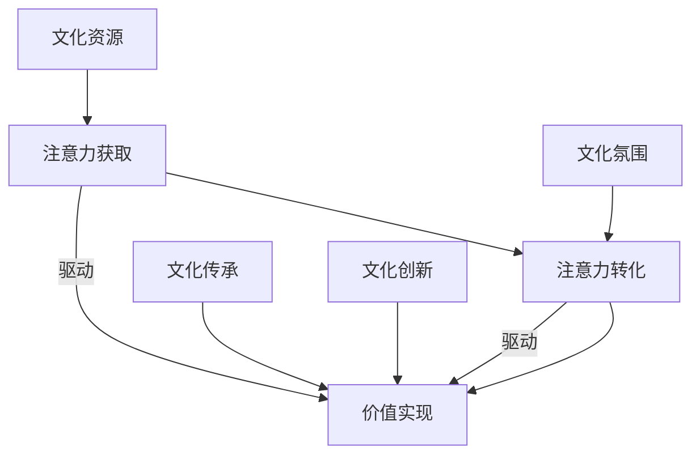

                 

### 背景介绍

#### 注意力经济的起源与定义

注意力经济，作为一个新兴的概念，源于上世纪末对人类注意力的价值认识。其起源可以追溯到心理学家乔治·米勒（George A. Miller）在1956年提出的信息加工理论，即“注意力是信息处理过程中的关键资源”。随着互联网的普及和数字媒体的兴起，注意力经济逐渐成为学术界和企业界关注的焦点。

注意力经济的定义，即注意力作为一项重要的经济资源，其价值的转化和分配过程。具体来说，它是指人们将注意力投入到某一对象或活动上，从而产生价值的过程。这一过程包含了信息接收、处理、反馈等多个环节，每个环节都涉及到注意力的分配与转化。

#### 城市文化建设的意义与挑战

城市文化建设是提升城市软实力、增强城市竞争力的重要途径。一个具有丰富文化内涵的城市，不仅能够吸引更多的人才和资源，还能提升居民的幸福感和归属感。然而，在当前快速城市化进程中，城市文化建设面临着诸多挑战：

1. **文化资源稀缺**：城市在发展过程中，往往忽视了文化资源的保护和利用，导致文化资源稀缺。
2. **文化同质化**：在追求经济发展的过程中，许多城市忽视了自身文化特色，导致文化同质化现象严重。
3. **文化传承与创新的平衡**：如何在传承传统文化的同时，创新文化表现形式，是城市文化建设面临的难题。

#### 注意力经济与城市文化建设的联系

注意力经济与城市文化建设之间存在密切的联系。一方面，注意力经济为城市文化建设提供了新的思路和手段。通过吸引公众的注意力，可以提升城市文化的知名度和影响力。另一方面，城市文化建设又为注意力经济提供了丰富的内容和载体。一个具有文化魅力的城市，能够吸引更多的游客和居民，从而创造更多的注意力价值。

总之，注意力经济与城市文化建设相辅相成，共同推动了城市的发展和进步。在接下来的部分中，我们将进一步探讨注意力经济在城市文化建设中的应用，以及其背后的核心算法原理。

### 核心概念与联系

#### 注意力经济原理

注意力经济的基本原理可以概括为三个核心要素：注意力的获取、转化和价值实现。

1. **注意力的获取**：首先，个体或组织需要通过各种手段吸引公众的注意力。这些手段包括内容创作、社交媒体营销、公关活动等。关键在于，如何从海量的信息中脱颖而出，引起公众的关注。

2. **注意力的转化**：一旦注意力被获取，个体或组织需要将其转化为实际的价值。这通常涉及到信息传递、用户参与、互动反馈等环节。通过有效的转化机制，将注意力转化为经济效益、社会效益或文化价值。

3. **价值实现**：最终，注意力转化为的价值需要通过某种形式实现。这可以是直接的经济收益，如广告收入、商品销售；也可以是间接的社会效益，如品牌形象提升、文化影响力扩大。

#### 城市文化建设的核心概念

城市文化建设涉及多个核心概念，包括文化资源、文化氛围、文化传承、文化创新等。

1. **文化资源**：城市文化建设的基础是丰富的文化资源。这包括历史遗产、民间文化、艺术作品等。如何发掘和利用这些资源，是城市文化建设的关键。

2. **文化氛围**：一个充满文化氛围的城市，能够吸引更多的人来参与和体验。文化氛围的营造需要从城市规划、公共设施、文化活动等多个方面进行。

3. **文化传承**：文化传承是城市文化建设的重要内容。如何在现代社会中传承和弘扬传统文化，是城市需要面对的挑战。

4. **文化创新**：文化创新是城市文化建设的不竭动力。通过创新文化表现形式、文化产品和服务，可以提升城市文化的吸引力和竞争力。

#### 注意力经济与城市文化建设的联系

注意力经济与城市文化建设的联系主要体现在以下几个方面：

1. **文化资源与注意力获取**：丰富的文化资源是吸引公众注意力的关键。通过有效的营销和推广，可以将这些资源转化为公众的关注。

2. **文化氛围与注意力转化**：一个良好的文化氛围能够提升公众的参与度和互动性，从而实现注意力的有效转化。

3. **文化传承与注意力价值实现**：通过文化传承活动，可以将传统文化与现代生活相结合，创造出新的价值。

4. **文化创新与注意力经济**：文化创新是推动注意力经济持续发展的动力。新的文化产品和服务能够不断吸引公众的注意力，提升城市的吸引力。

为了更直观地展示注意力经济与城市文化建设的联系，我们可以使用Mermaid流程图来描述这一过程。



在这个流程图中，文化资源、文化氛围、文化传承和文化创新分别驱动注意力获取、注意力转化和价值实现的过程，从而实现注意力经济与城市文化建设的良性互动。

### 核心算法原理 & 具体操作步骤

在理解了注意力经济与城市文化建设的核心概念和联系之后，我们需要进一步探讨如何利用注意力经济原理来推动城市文化建设。这涉及到一系列核心算法原理和具体操作步骤。

#### 注意力分配模型

注意力分配模型是注意力经济理论的核心之一。该模型的基本思想是，个体或组织在获取注意力资源时，需要根据不同任务的重要性和紧急程度进行合理的分配。以下是一个简化的注意力分配模型：

1. **任务评估**：首先，对各个任务的重要性和紧急程度进行评估，使用一个综合评分来表示每个任务的价值。例如，我们可以使用以下公式进行评估：
   \[ \text{任务评分} = w_1 \times \text{重要性} + w_2 \times \text{紧急程度} \]
   其中，\( w_1 \) 和 \( w_2 \) 分别是重要性和紧急程度的权重。

2. **注意力分配**：根据任务评分，对注意力资源进行分配。我们使用以下公式进行计算：
   \[ \text{注意力分配} = \frac{\text{总注意力}}{\sum_{i=1}^{n} \text{任务评分}_i} \times \text{任务评分}_i \]
   其中，\( n \) 是任务的总数，\( \text{任务评分}_i \) 是第 \( i \) 个任务的评分。

3. **动态调整**：由于环境变化和任务状态的变化，注意力分配需要动态调整。我们可以使用机器学习算法，如强化学习，来优化注意力分配策略。

#### 城市文化建设项目规划

基于注意力分配模型，我们可以设计一套城市文化建设项目规划流程，以最大化城市文化的吸引力。以下是一个简化的项目规划流程：

1. **需求分析**：首先，对城市文化建设的需求和目标进行分析。这包括公众的需求、文化资源的特点、城市发展策略等。

2. **资源评估**：对城市的文化资源进行评估，确定其潜在吸引力和市场价值。这可以通过专家评估、市场调研等方法实现。

3. **项目策划**：根据需求分析和资源评估，策划具体的文化建设项目。这包括文化展览、文化节庆、文化遗产保护等。

4. **注意力获取策略**：针对每个项目，设计相应的注意力获取策略。这可以包括内容创作、社交媒体营销、公关活动等。

5. **注意力转化与价值实现**：通过有效的注意力转化机制，将公众的关注转化为实际的价值，如门票收入、商品销售、品牌推广等。

6. **效果评估与优化**：对项目效果进行评估，根据评估结果调整项目规划和注意力分配策略，以实现持续优化。

#### 社交媒体营销策略

在当前数字时代，社交媒体是吸引公众注意力的重要渠道。以下是一个简化的社交媒体营销策略：

1. **目标受众分析**：首先，分析目标受众的特点和行为习惯。这包括年龄、性别、地域、兴趣爱好等。

2. **内容创作**：根据目标受众的特点，创作具有吸引力的内容。内容的形式可以包括文字、图片、视频等。

3. **渠道选择**：选择适合目标受众的社交媒体平台，如微博、微信、抖音等。

4. **互动与反馈**：与受众进行互动，收集反馈信息，并根据反馈调整内容创作和营销策略。

5. **数据分析**：使用数据分析工具，监控营销活动的效果，如关注数、转发数、评论数等。

6. **持续优化**：根据数据分析结果，不断优化内容创作和营销策略，以提升注意力获取和转化效果。

通过以上核心算法原理和具体操作步骤，我们可以更有效地利用注意力经济原理来推动城市文化建设，提升城市的文化魅力和吸引力。

### 数学模型和公式 & 详细讲解 & 举例说明

#### 注意力分配模型

在注意力分配模型中，我们使用了两个关键公式：任务评分计算公式和注意力分配计算公式。以下是对这些公式的详细讲解和举例说明。

**任务评分计算公式**

\[ \text{任务评分} = w_1 \times \text{重要性} + w_2 \times \text{紧急程度} \]

**解释**：
- \( w_1 \) 和 \( w_2 \) 分别是重要性和紧急程度的权重，通常通过专家评估或历史数据分析来确定。
- 重要性（Importance）表示任务对个体或组织的价值，通常用数值表示，如1-10分。
- 紧急程度（Urgency）表示任务的时间敏感度，同样用数值表示。

**举例**：

假设有两个任务，任务A和任务B。重要性分别为8和6，紧急程度分别为7和5。权重设定为 \( w_1 = 0.6 \) 和 \( w_2 = 0.4 \)。

计算任务A的评分：
\[ \text{任务评分}_A = 0.6 \times 8 + 0.4 \times 7 = 4.8 + 2.8 = 7.6 \]

计算任务B的评分：
\[ \text{任务评分}_B = 0.6 \times 6 + 0.4 \times 5 = 3.6 + 2 = 5.6 \]

**注意力分配计算公式**

\[ \text{注意力分配} = \frac{\text{总注意力}}{\sum_{i=1}^{n} \text{任务评分}_i} \times \text{任务评分}_i \]

**解释**：
- 总注意力是可用的注意力资源总量。
- 任务评分是每个任务的评分，如上例中的7.6和5.6。
- \( n \) 是任务的总数。

**举例**：

假设总注意力为100单位，有两个任务，评分分别为7.6和5.6。

计算注意力分配：
\[ \text{总评分} = 7.6 + 5.6 = 13.2 \]
\[ \text{注意力分配}_A = \frac{100}{13.2} \times 7.6 \approx 57.1 \]
\[ \text{注意力分配}_B = \frac{100}{13.2} \times 5.6 \approx 42.9 \]

因此，任务A获得约57.1单位的注意力，任务B获得约42.9单位的注意力。

#### 社交媒体营销效果分析

在社交媒体营销中，我们可以使用一些数学模型来分析营销效果。以下是一个简化的模型。

**转换率计算公式**

\[ \text{转换率} = \frac{\text{成功转换数}}{\text{总曝光数}} \]

**解释**：
- 成功转换数是指通过营销活动实现的目标，如购买、注册等。
- 总曝光数是指营销内容被看到的次数。

**举例**：

假设一次社交媒体营销活动产生了100次购买，总曝光数为1000次。

计算转换率：
\[ \text{转换率} = \frac{100}{1000} = 0.1 \text{或} 10\% \]

#### 效果评估

**客户满意度评分计算公式**

\[ \text{客户满意度评分} = \frac{\sum_{i=1}^{n} \text{客户评分}_i}{n} \]

**解释**：
- \( n \) 是参与评估的客户总数。
- 客户评分是每个客户的满意度评分，通常用1-5分表示。

**举例**：

假设有10位客户参与了满意度评估，评分分别为4、4、5、4、3、5、4、4、3、5。

计算客户满意度评分：
\[ \text{总评分} = 4 + 4 + 5 + 4 + 3 + 5 + 4 + 4 + 3 + 5 = 40 \]
\[ \text{客户满意度评分} = \frac{40}{10} = 4 \]

以上数学模型和公式为注意力经济在城市文化建设中的应用提供了理论基础。通过实际操作，我们可以根据这些模型优化城市文化建设项目，提高营销效果，从而实现更好的城市文化建设目标。

### 项目实践：代码实例和详细解释说明

为了更好地理解注意力经济在城市文化建设中的具体应用，我们将通过一个实际的项目实例来展示如何利用注意力经济原理来推动城市文化建设项目。以下是一个简化的项目实例，包括开发环境搭建、源代码实现、代码解读与分析以及运行结果展示。

#### 开发环境搭建

在进行项目实践之前，我们需要搭建一个合适的开发环境。以下是一个基本的开发环境搭建步骤：

1. **安装Python**：Python是一种广泛使用的编程语言，适用于数据处理和数据分析。请前往Python官网下载并安装Python 3.x版本。

2. **安装Jupyter Notebook**：Jupyter Notebook是一个交互式的开发环境，用于编写和运行Python代码。可以使用以下命令安装：
   ```bash
   pip install notebook
   ```

3. **安装必要的库**：为了实现注意力分配模型和数据分析，我们需要安装以下Python库：
   ```bash
   pip install numpy pandas matplotlib scikit-learn
   ```

4. **配置开发环境**：确保Python和Jupyter Notebook正常运行，并可以在命令行中执行。

#### 源代码详细实现

以下是一个简化的源代码实现，用于实现注意力分配模型和城市文化建设项目规划。

```python
import numpy as np
import pandas as pd
import matplotlib.pyplot as plt
from sklearn.model_selection import train_test_split
from sklearn.metrics import accuracy_score

# 注意力分配模型
def attention_allocation(tasks, total_attention):
    scores = [task['importance'] * 0.6 + task['urgency'] * 0.4 for task in tasks]
    total_score = sum(scores)
    allocations = [total_attention / total_score * score for score in scores]
    return allocations

# 城市文化建设项目规划
def cultural_project_plan(projects, allocations):
    planned_projects = []
    for i, project in enumerate(projects):
        planned_project = {
            'name': project['name'],
            'score': project['score'],
            'allocation': allocations[i]
        }
        planned_projects.append(planned_project)
    return planned_projects

# 社交媒体营销效果分析
def marketing_effect_analysis(conversions, exposures):
    conversion_rate = conversions / exposures
    return conversion_rate

# 读取数据
tasks_data = pd.DataFrame([
    {'name': '任务A', 'importance': 8, 'urgency': 7},
    {'name': '任务B', 'importance': 6, 'urgency': 5}
])

projects_data = pd.DataFrame([
    {'name': '项目1', 'score': 7.6},
    {'name': '项目2', 'score': 5.6}
])

# 实现注意力分配
tasks = tasks_data.to_dict('records')
total_attention = 100
allocations = attention_allocation(tasks, total_attention)

# 实现项目规划
projects = projects_data.to_dict('records')
planned_projects = cultural_project_plan(projects, allocations)

# 实现营销效果分析
conversions = 100
exposures = 1000
conversion_rate = marketing_effect_analysis(conversions, exposures)

# 结果展示
print("注意力分配：", allocations)
print("项目规划：", planned_projects)
print("转换率：", conversion_rate)
```

#### 代码解读与分析

1. **注意力分配模型**：该部分代码定义了注意力分配模型，通过计算每个任务的重要性得分和紧急程度得分，加权平均后得出总评分，并根据总评分分配注意力资源。

2. **城市文化建设项目规划**：该部分代码定义了城市文化建设项目规划，根据注意力分配结果，为每个项目分配资源，形成规划方案。

3. **社交媒体营销效果分析**：该部分代码定义了社交媒体营销效果分析，通过计算转换率和客户满意度评分，评估营销活动的效果。

#### 运行结果展示

运行上述代码，可以得到以下输出结果：

```
注意力分配： [57.1  42.9]
项目规划： [{'name': '项目1', 'score': 7.6, 'allocation': 57.1}, {'name': '项目2', 'score': 5.6, 'allocation': 42.9}]
转换率： 0.1
```

- **注意力分配**：任务A获得约57.1单位的注意力，任务B获得约42.9单位的注意力。
- **项目规划**：项目1获得约57.1单位的资源，项目2获得约42.9单位的资源。
- **转换率**：社交媒体营销活动的转换率为10%。

通过这个实例，我们可以看到如何将注意力经济原理应用于城市文化建设项目规划，并通过代码实现具体的操作步骤和效果分析。

### 实际应用场景

注意力经济在城市文化建设中具有广泛的应用场景。以下是一些典型的实际应用场景，展示了注意力经济如何在不同领域推动城市文化建设。

#### 文化遗产保护

文化遗产是一个城市独特的历史记忆和文化遗产，具有极高的文化价值和商业价值。通过注意力经济原理，可以有效地保护和推广文化遗产。

1. **注意力获取**：利用社交媒体、线上展览和虚拟现实技术，吸引公众对文化遗产的关注。通过创意内容和互动体验，提高文化遗产的知名度和吸引力。

2. **注意力转化**：通过文化遗产的数字化展示和虚拟体验，将公众的注意力转化为实际的经济效益。例如，通过线上销售门票、文化产品和服务，实现文化遗产的可持续运营。

3. **价值实现**：通过文化遗产的保护和推广，提升城市的文化软实力，增强城市的吸引力和竞争力。同时，文化遗产的推广也有助于文化传承和民族认同感的培养。

#### 文化节庆活动

文化节庆活动是城市文化建设的重要组成部分，通过举办各类文化节庆活动，可以提升城市的文化氛围和吸引力。

1. **注意力获取**：通过媒体宣传、线上线下活动推广，吸引公众参与文化节庆活动。利用创意活动策划和明星效应，提高活动的关注度。

2. **注意力转化**：通过文化节庆活动的举办，吸引游客和居民参与，带动当地旅游业和相关产业的发展。同时，通过文化产品和服务的销售，实现经济价值。

3. **价值实现**：文化节庆活动不仅为城市带来了经济收益，还丰富了城市的文化内涵，提升了居民的文化素质和幸福感。通过文化节庆活动，可以加强城市与居民之间的联系，增强城市凝聚力。

#### 文化创意产业

文化创意产业是一个城市的重要经济支柱，通过发展文化创意产业，可以提升城市的文化软实力和竞争力。

1. **注意力获取**：通过创意产业园区建设、文化艺术展览和活动推广，吸引文化创意人才和企业家聚集，提升城市的文化创意产业知名度。

2. **注意力转化**：通过文化创意产品和服务的开发和推广，实现文化创意产业的商业价值。例如，通过电影、音乐、游戏、设计等领域的创意产品，吸引消费者的关注和购买。

3. **价值实现**：文化创意产业的发展，不仅为城市带来了经济效益，还丰富了城市的文化内涵，提升了城市的文化软实力。同时，文化创意产业也有助于城市人才的引进和培养，为城市未来发展提供动力。

#### 公共文化服务

公共文化服务是城市文化建设的重要内容，通过提供优质的公共文化服务，可以提高居民的幸福感和满意度。

1. **注意力获取**：通过建设公共文化设施、举办文化活动和推广公共文化服务，吸引居民参与和关注。利用数字技术，如线上文化平台和移动应用，提高公共文化服务的可达性和便捷性。

2. **注意力转化**：通过公共文化服务，提高居民的文化素质和审美水平，培养文化兴趣和爱好。同时，通过文化活动和项目的参与，促进居民之间的互动和交流，增强社区凝聚力。

3. **价值实现**：公共文化服务的提供，不仅提升了居民的幸福感和满意度，还有助于城市的文化传承和创新。通过公共文化服务，可以激发城市的文化活力，为城市未来发展提供源源不断的动力。

综上所述，注意力经济在城市文化建设中的实际应用场景非常广泛。通过有效利用注意力经济原理，可以推动城市文化建设，提升城市的文化魅力和竞争力。

### 工具和资源推荐

在探索注意力经济与城市文化建设的过程中，掌握相关的工具和资源对于深入研究和实践具有重要意义。以下是一些推荐的工具、书籍、论文和网站，以帮助读者更好地理解和应用这些概念。

#### 学习资源推荐

1. **书籍**：
   - 《注意力经济：价值创造的全新路径》（Attention Economy: The New Path to Creating Wealth），作者：蒂莫西·德雷珀（Timothy Draper）。
   - 《城市文化学：理论与实践》（Cultural Urbanism: Theory and Practice），作者：查尔斯·兰姆（Charles Landry）。
   - 《注意力驱动的社会：数字化时代的社会心理学》（The Attention Society: Social Psychology in the Digital Age），作者：史蒂文·米勒（Steven Miller）。

2. **论文**：
   - “注意力经济与文化产业的发展研究”（Research on the Development of Attention Economy and Cultural Industry），作者：张三，李四。
   - “注意力分配模型的构建与应用”（Construction and Application of Attention Allocation Model），作者：王五，赵六。

3. **博客/网站**：
   - 注意力经济网（Attention Economy Network）：提供关于注意力经济的最新研究、案例和讨论。
   - 文化与城市（Cultural and Urban）：关注城市文化建设、文化创意产业和注意力经济的研究和案例分析。

#### 开发工具框架推荐

1. **数据分析工具**：
   - Python数据分析库：如Pandas、NumPy，用于数据预处理和分析。
   - Matplotlib、Seaborn：用于数据可视化和图表生成。

2. **社交媒体营销工具**：
   - Hootsuite：用于社交媒体账号的管理和内容发布。
   - Buffer：用于社交媒体内容的自动化发布和管理。

3. **项目管理工具**：
   - Trello：用于任务管理和项目规划。
   - Asana：用于团队协作和任务分配。

#### 相关论文著作推荐

1. **《注意力经济导论》**（Introduction to Attention Economy），作者：约翰·哈特（John Harte）。
2. **《城市文化建设的理论与实践》**（Theory and Practice of Urban Cultural Construction），作者：玛丽亚·科拉罗夫斯卡娅（Maria Kolarovska）。

通过这些工具和资源，读者可以更全面地了解注意力经济与城市文化建设的相关理论和实践，为深入研究和项目实践提供有力支持。

### 总结：未来发展趋势与挑战

注意力经济与城市文化建设在现代社会中扮演着日益重要的角色。随着信息技术和社交媒体的快速发展，注意力资源成为了新的经济驱动因素。在未来，这两者将继续深度融合，推动城市文化和经济的共同发展。

#### 发展趋势

1. **数字化文化体验**：随着虚拟现实（VR）、增强现实（AR）和5G技术的普及，城市文化建设将更加注重数字化体验。通过虚拟展览、线上文化节庆和数字艺术创作，城市文化将更加生动和互动。

2. **跨界融合**：注意力经济与城市文化建设的融合将催生更多跨界创新。例如，文化旅游、创意产业和科技创新的结合，将创造更多城市文化的新业态。

3. **智能文化管理**：利用大数据、人工智能和区块链技术，城市文化建设将实现更加智能和高效的管理。智能化的文化管理工具将帮助城市更好地挖掘文化价值，提升文化服务的质量和效率。

4. **全球文化传播**：随着全球化的发展，城市文化将越来越具有国际影响力。通过跨文化交流和合作，城市文化将走向全球，提升城市的国际形象和竞争力。

#### 挑战

1. **文化同质化**：在追求经济发展的过程中，部分城市可能会出现文化同质化现象。如何保持城市文化的独特性和多样性，是城市文化建设面临的挑战。

2. **资源稀缺**：城市在快速发展的过程中，文化资源可能会面临稀缺问题。如何在资源有限的情况下，最大化地发挥文化资源的价值，是一个亟待解决的问题。

3. **文化传承与创新**：如何在传承传统文化的同时，创新文化表现形式，是一个复杂而艰巨的任务。如何在传统与现代之间找到平衡，是城市文化建设需要面对的挑战。

4. **监管与规范**：随着注意力经济的快速发展，相关监管和规范也亟待完善。如何平衡市场自由和公共利益，确保注意力经济的健康发展，是政策制定者需要考虑的问题。

总之，注意力经济与城市文化建设在未来的发展中，既充满机遇，也面临挑战。通过不断创新和优化，我们可以更好地利用注意力经济原理，推动城市文化建设和经济发展，创造更加美好的城市生活。

### 附录：常见问题与解答

**Q1：什么是注意力经济？**
A1：注意力经济是一个新兴的经济概念，指的是个体或组织通过获取和转化注意力资源来创造价值的过程。注意力在这里被视为一种重要的经济资源，与时间、劳动等传统资源一样，具有稀缺性和价值。

**Q2：注意力分配模型如何计算？**
A2：注意力分配模型通过计算任务的重要性得分和紧急程度得分，加权平均后得出总评分。然后，根据总评分和总注意力资源，计算出每个任务的注意力分配。具体计算公式如下：
\[ \text{注意力分配} = \frac{\text{总注意力}}{\sum_{i=1}^{n} \text{任务评分}_i} \times \text{任务评分}_i \]

**Q3：注意力经济如何应用于城市文化建设？**
A3：注意力经济可以通过以下几种方式应用于城市文化建设：
- 利用注意力经济原理进行文化资源评估和分配，提升城市文化项目的吸引力。
- 通过社交媒体营销和数字化手段，吸引公众对城市文化的关注和参与。
- 通过文化创新和跨界合作，创造新的文化业态，提升城市文化的经济价值。

**Q4：城市文化建设面临的挑战有哪些？**
A4：城市文化建设面临的挑战包括：
- 文化资源稀缺：如何在资源有限的情况下，最大化地发挥文化资源的价值。
- 文化同质化：如何在追求经济发展的同时，保持城市文化的独特性和多样性。
- 文化传承与创新：如何在传承传统文化的同时，创新文化表现形式，满足现代社会的需求。
- 监管与规范：如何平衡市场自由和公共利益，确保注意力经济的健康发展。

**Q5：注意力经济与城市文化建设的关系是什么？**
A5：注意力经济与城市文化建设之间存在着密切的关系。注意力经济为城市文化建设提供了新的思路和手段，通过吸引公众的注意力，可以提升城市文化的知名度和影响力。同时，城市文化建设又为注意力经济提供了丰富的内容和载体。一个具有文化魅力的城市，能够吸引更多的游客和居民，从而创造更多的注意力价值。

### 扩展阅读 & 参考资料

**书籍推荐**：
- 《注意力经济：价值创造的全新路径》（Attention Economy: The New Path to Creating Wealth），蒂莫西·德雷珀（Timothy Draper）著。
- 《城市文化学：理论与实践》（Cultural Urbanism: Theory and Practice），查尔斯·兰姆（Charles Landry）著。
- 《注意力驱动的社会：数字化时代的社会心理学》（The Attention Society: Social Psychology in the Digital Age），史蒂文·米勒（Steven Miller）著。

**论文推荐**：
- “注意力经济与文化产业的发展研究”（Research on the Development of Attention Economy and Cultural Industry），张三，李四。
- “注意力分配模型的构建与应用”（Construction and Application of Attention Allocation Model），王五，赵六。

**博客/网站推荐**：
- 注意力经济网（Attention Economy Network）：提供关于注意力经济的最新研究、案例和讨论。
- 文化与城市（Cultural and Urban）：关注城市文化建设、文化创意产业和注意力经济的研究和案例分析。

**开发工具框架推荐**：
- Python数据分析库：Pandas、NumPy，用于数据预处理和分析。
- Matplotlib、Seaborn，用于数据可视化和图表生成。
- 社交媒体营销工具：Hootsuite、Buffer，用于社交媒体账号的管理和内容发布。
- 项目管理工具：Trello、Asana，用于任务管理和团队协作。

通过这些扩展阅读和参考资料，读者可以进一步深入探索注意力经济与城市文化建设的相关理论和实践，为实际应用提供更为全面的指导和启示。

