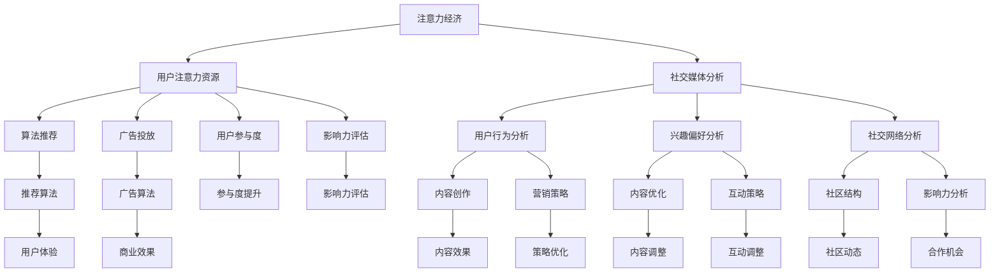

                 

### 1. 背景介绍

在当今数字化时代，社交媒体已经成为人们日常交流、获取信息和表达观点的重要平台。从个人用户到企业品牌，社交媒体的广泛普及和深入应用带来了前所未有的机遇和挑战。在这样的背景下，注意力经济成为了一个备受关注的话题。

注意力经济是指，在信息爆炸和高度分散的数字时代，人们有限的注意力资源成为了稀缺资源，因此谁能够更有效地吸引和保持用户的注意力，谁就能够在竞争激烈的市场中占据优势。社交媒体平台，如Facebook、Instagram、Twitter等，正是通过吸引用户的注意力来创造商业价值的。

社交媒体分析，则是对社交媒体上的数据进行分析和解读，以了解用户的行为模式、兴趣偏好和社交网络结构。这种分析不仅可以帮助企业和个人更好地了解自己的受众，还可以为他们提供决策支持，从而提高营销效果、提升品牌影响力。

本文旨在探讨注意力经济与社交媒体分析之间的联系，深入解析影响受众参与度和影响力的关键因素，并提供实用的工具和资源，帮助读者更好地理解和应用这些概念。本文将分为以下几个部分：

1. **背景介绍**：简要介绍注意力经济和社交媒体分析的基本概念及其重要性。
2. **核心概念与联系**：详细解释注意力经济和社交媒体分析中的核心概念，并使用Mermaid流程图展示其架构。
3. **核心算法原理 & 具体操作步骤**：介绍用于社交媒体分析的核心算法原理，并详细说明操作步骤。
4. **数学模型和公式 & 详细讲解 & 举例说明**：讲解用于社交媒体分析的数学模型和公式，并通过实例进行说明。
5. **项目实践：代码实例和详细解释说明**：提供具体的代码实例，并对代码实现进行详细解释和分析。
6. **实际应用场景**：探讨注意力经济和社交媒体分析在不同领域的应用。
7. **工具和资源推荐**：推荐相关的学习资源和开发工具。
8. **总结：未来发展趋势与挑战**：总结注意力经济和社交媒体分析的发展趋势，并讨论未来可能面临的挑战。
9. **附录：常见问题与解答**：回答一些常见的问题。
10. **扩展阅读 & 参考资料**：提供相关的扩展阅读和参考资料。

通过本文的逐步分析和详细讲解，希望读者能够深入理解注意力经济与社交媒体分析的本质，掌握关键技术和应用方法，从而在实际工作中取得更好的成果。

### 2. 核心概念与联系

为了深入理解注意力经济与社交媒体分析之间的关系，我们需要首先明确这些领域中的核心概念，并探讨它们之间的联系。

#### 2.1 注意力经济

注意力经济（Attention Economy）是由Shirky（2008）首次提出的，其核心思想是，在信息过载的时代，人类的注意力成为一种稀缺资源。与传统经济中的物质资源不同，注意力资源是有限的，并且无法复制或储存。因此，谁能够更有效地吸引和保持用户的注意力，谁就能够获得商业上的成功。

在社交媒体平台，如Facebook、Instagram和Twitter上，注意力经济的体现尤为明显。这些平台通过算法推荐、广告投放和用户互动等方式，吸引用户的注意力，并将其转化为广告收入和用户参与度。例如，一个有数百万粉丝的社交媒体账号，其每条内容的点击量和评论量，都是衡量其注意力价值的重要指标。

#### 2.2 社交媒体分析

社交媒体分析（Social Media Analysis）是指通过收集、处理和分析社交媒体上的数据，来获取有关用户行为、兴趣和社交网络结构的信息。这种分析可以帮助企业和个人更好地了解他们的受众，从而制定更有效的营销策略和决策。

社交媒体分析的核心概念包括：

- **用户行为分析**：分析用户在社交媒体上的行为，如发布内容、点赞、评论、分享等，以了解用户的兴趣和行为模式。
- **兴趣偏好分析**：通过分析用户的互动行为和内容消费，了解用户的兴趣偏好。
- **社交网络分析**：研究用户在社交媒体上的社交网络结构，如用户之间的连接关系、社区结构等，以了解社交网络的动态和影响力分布。

#### 2.3 注意力经济与社交媒体分析的联系

注意力经济与社交媒体分析之间存在密切的联系，这种联系主要体现在以下几个方面：

1. **用户注意力资源的分配**：在注意力经济中，用户的注意力资源是有限的。社交媒体分析可以帮助企业和个人了解用户在各个平台和内容上的注意力分配情况，从而优化内容和营销策略，提高用户的参与度和忠诚度。

2. **用户参与度提升**：社交媒体分析可以揭示哪些类型的内容和互动方式能够更好地吸引用户的注意力，从而提高用户的参与度。例如，通过分析用户在社交媒体上的互动行为，可以发现哪些话题或类型的内容更容易引发讨论和分享，进而优化内容创作和推广策略。

3. **影响力评估**：社交媒体分析可以帮助企业和个人评估其在社交媒体上的影响力，了解谁是最具有影响力的用户和话题。这种分析不仅可以用于品牌营销，还可以帮助企业识别潜在的合作机会和竞争对手的动态。

4. **算法优化**：注意力经济和社交媒体分析都依赖于算法。社交媒体平台使用的推荐算法、广告投放算法等，都是基于对用户行为和兴趣的分析来优化用户体验和商业效果。

#### 2.4 Mermaid流程图

为了更好地理解注意力经济与社交媒体分析的联系，我们可以使用Mermaid流程图来展示其核心概念和架构。



通过这个Mermaid流程图，我们可以清晰地看到注意力经济和社交媒体分析之间的核心概念及其相互联系。每一个节点都代表一个关键概念或操作步骤，而节点之间的连线则展示了它们之间的关联和作用。

通过深入理解和应用这些核心概念和联系，企业和个人可以在社交媒体平台上更有效地吸引和保持用户的注意力，提高参与度和影响力，从而实现商业目标。

### 3. 核心算法原理 & 具体操作步骤

在社交媒体分析中，核心算法的设计和实现对于提升用户的参与度和影响力至关重要。以下我们将介绍几种常用的核心算法原理，并详细说明其具体操作步骤。

#### 3.1 用户行为分析算法

用户行为分析算法主要用于分析用户在社交媒体平台上的行为，如发布内容、点赞、评论、分享等。这种算法可以揭示用户的兴趣和行为模式，为内容创作和营销策略提供依据。

**算法原理：**

用户行为分析算法通常基于机器学习和数据挖掘技术，其基本原理是通过以下步骤实现的：

1. **数据收集**：从社交媒体平台获取用户行为数据，如发布内容、点赞、评论、分享等。
2. **特征提取**：对用户行为数据进行分析，提取与用户兴趣和行为相关的特征。
3. **建模与训练**：使用机器学习算法，如决策树、支持向量机、神经网络等，对提取的特征进行建模和训练，以预测用户未来的行为。
4. **模型评估与优化**：通过交叉验证等方法评估模型的性能，并根据评估结果对模型进行优化。

**具体操作步骤：**

1. **数据收集**：
   - 使用API或爬虫工具收集用户在社交媒体平台上的行为数据。
   - 数据格式可以是CSV、JSON等。

2. **特征提取**：
   - 提取与用户兴趣相关的特征，如用户发布的内容类型、使用的关键词、内容的互动量等。
   - 使用文本分析技术，如TF-IDF、Word2Vec等，对文本内容进行特征提取。

3. **建模与训练**：
   - 选择合适的机器学习算法，如随机森林、梯度提升树等，对提取的特征进行建模和训练。
   - 使用训练数据集进行模型的训练，调整模型的参数以优化性能。

4. **模型评估与优化**：
   - 使用验证集或测试集评估模型的性能，如准确率、召回率、F1值等。
   - 根据评估结果调整模型的参数，优化模型的性能。

#### 3.2 社交网络分析算法

社交网络分析算法用于研究用户在社交媒体上的社交网络结构，如用户之间的连接关系、社区结构等。这种算法可以帮助识别有影响力的用户和话题，为品牌营销和社区管理提供支持。

**算法原理：**

社交网络分析算法通常基于图论和网络科学的理论，其基本原理是通过以下步骤实现的：

1. **数据预处理**：清洗和整理社交媒体平台的社交网络数据，构建用户之间的连接关系图。
2. **特征提取**：从社交网络数据中提取与社交网络结构相关的特征，如节点度、聚类系数、路径长度等。
3. **社区发现**：使用社区发现算法，如基于模块度优化、基于密度聚类等，识别社交网络中的社区结构。
4. **影响力分析**：基于社交网络结构和社区结构，分析用户的影响力和话题的传播情况。

**具体操作步骤：**

1. **数据预处理**：
   - 从社交媒体平台获取用户之间的连接关系数据，如朋友列表、互动记录等。
   - 清洗和整理数据，去除噪声和无效连接。

2. **特征提取**：
   - 提取与社交网络结构相关的特征，如节点的度（连接数）、聚类系数（描述节点之间的紧密程度）等。
   - 使用网络分析工具，如Gephi、NetworkX等，对社交网络进行可视化分析。

3. **社区发现**：
   - 使用社区发现算法，如基于模块度优化（Louvain算法）或基于密度聚类（DBSCAN算法），识别社交网络中的社区结构。
   - 分析社区的结构特征，如社区大小、密度、成员关系等。

4. **影响力分析**：
   - 基于社交网络结构和社区结构，分析用户的影响力和话题的传播情况。
   - 识别有影响力的用户和热点话题，为品牌营销和社区管理提供支持。

#### 3.3 广告投放算法

广告投放算法是社交媒体平台的核心算法之一，其目的是通过优化广告投放策略，提高广告的点击率和转化率，从而实现商业目标。

**算法原理：**

广告投放算法通常基于机器学习和优化理论，其基本原理是通过以下步骤实现的：

1. **广告评估**：评估广告的质量和相关性，如点击率预估、转化率预估等。
2. **用户特征提取**：提取与用户兴趣和行为相关的特征，如用户的年龄、性别、地理位置、历史行为等。
3. **投放策略优化**：使用优化算法，如线性规划、梯度下降等，优化广告的投放策略，以最大化广告收益或点击率。
4. **效果评估**：通过实时监测和反馈，评估广告投放的效果，并根据评估结果调整投放策略。

**具体操作步骤：**

1. **广告评估**：
   - 使用机器学习算法，如逻辑回归、决策树等，预估广告的点击率和转化率。
   - 根据预估结果，评估广告的质量和相关性。

2. **用户特征提取**：
   - 从用户数据中提取与用户兴趣和行为相关的特征，如用户的年龄、性别、地理位置、历史行为等。
   - 使用特征工程技术，如特征组合、特征归一化等，优化特征的质量和表现。

3. **投放策略优化**：
   - 使用优化算法，如线性规划、梯度下降等，优化广告的投放策略，以最大化广告收益或点击率。
   - 调整广告的展示位置、时间、频率等参数，以优化广告的效果。

4. **效果评估**：
   - 通过实时监测和反馈，评估广告投放的效果，如点击率、转化率、广告收益等。
   - 根据评估结果，调整广告投放策略，以提高广告效果。

通过以上核心算法原理和具体操作步骤的介绍，我们可以更好地理解社交媒体分析中的关键技术，并应用这些技术提升用户的参与度和影响力，实现商业目标。

### 4. 数学模型和公式 & 详细讲解 & 举例说明

在社交媒体分析中，数学模型和公式起到了至关重要的作用。这些模型和公式帮助我们量化用户行为、评估影响力，以及优化广告投放策略。以下，我们将详细讲解几个关键的数学模型和公式，并通过实例进行说明。

#### 4.1 用户行为概率模型

用户行为概率模型用于预测用户在社交媒体上的特定行为，如点赞、评论、分享的概率。一个常用的模型是伯努利分布，该模型假设每个行为事件只有两种可能的结果：发生（1）或未发生（0）。

**公式：**

\[ P(B_i = 1) = p_i \]

其中，\( P(B_i = 1) \) 表示用户在事件 \( i \) 上发生特定行为的概率，\( p_i \) 为事件 \( i \) 的概率参数。

**实例：**

假设我们想预测用户在看到一条新闻时点赞的概率。根据历史数据，用户点赞的新闻条目占比为15%。因此，\( p_i = 0.15 \)。

\[ P(B_i = 1) = 0.15 \]

这意味着，用户在看到这条新闻时点赞的概率为15%。

#### 4.2 马尔可夫模型

马尔可夫模型用于描述用户在社交媒体上的行为序列。它假设当前行为仅与之前的行为相关，而与更早的行为无关。一个常见的马尔可夫模型是用户行为转移矩阵。

**公式：**

\[ P(B_t = j | B_{t-1} = i) = P_{ij} \]

其中，\( P(B_t = j | B_{t-1} = i) \) 表示在给定前一个行为 \( B_{t-1} = i \) 的情况下，当前行为 \( B_t = j \) 的概率，\( P_{ij} \) 为转移概率矩阵的元素。

**实例：**

假设一个用户的行为转移矩阵如下：

\[ \begin{array}{c|c|c|c}
 & 点赞 & 评论 & 分享 \\
\hline
点赞 & 0.3 & 0.4 & 0.3 \\
评论 & 0.2 & 0.5 & 0.3 \\
分享 & 0.1 & 0.3 & 0.6 \\
\end{array} \]

如果用户之前点赞了一条内容，那么他接下来点赞、评论或分享的概率分别为0.3、0.4和0.3。

#### 4.3 深度学习模型

深度学习模型，尤其是神经网络，在社交媒体分析中得到了广泛应用。一个简单的多层感知机（MLP）模型可以用于预测用户的兴趣和行为。

**公式：**

\[ \text{输出} = \sigma(\text{权重} \cdot \text{输入} + \text{偏置}) \]

其中，\( \sigma \) 为激活函数，如Sigmoid函数或ReLU函数，用于将线性组合转化为非负输出。

**实例：**

假设一个简单的两层神经网络用于预测用户是否点赞。输入层有3个特征：文章的点击率、内容的长度和用户的年龄。输出层有1个节点，表示用户点赞的概率。

输入向量：\[ \text{输入} = [0.2, 100, 25] \]

权重矩阵：\[ \text{权重} = \begin{bmatrix} 0.1 & 0.3 & 0.2 \\ 0.4 & 0.5 & 0.1 \end{bmatrix} \]

偏置向量：\[ \text{偏置} = [0.1, 0.2] \]

输出：\[ \text{输出} = \sigma(0.1 \cdot 0.2 + 0.3 \cdot 100 + 0.2 \cdot 25 + 0.1 + 0.2) \]

\[ \text{输出} = \sigma(5.1) \]

\[ \text{输出} = 0.999 \]

这意味着用户点赞的概率非常高。

#### 4.4 评价指标

在社交媒体分析中，评价指标用于评估模型的性能。常用的评价指标包括准确率、召回率、F1值和ROC-AUC等。

**公式：**

- **准确率**：\[ \text{准确率} = \frac{\text{实际正确}}{\text{实际总数}} \]
- **召回率**：\[ \text{召回率} = \frac{\text{预测正确}}{\text{实际正确总数}} \]
- **F1值**：\[ \text{F1值} = 2 \times \frac{\text{准确率} \times \text{召回率}}{\text{准确率} + \text{召回率}} \]
- **ROC-AUC**：\[ \text{ROC-AUC} = \frac{1}{N} \sum_{i=1}^{N} \left( \text{预测概率}_i - \text{随机概率}_i \right) \]

**实例：**

假设我们有一个二元分类模型，用于预测用户是否点赞。测试集共有100个样本，其中50个实际点赞，50个实际未点赞。

预测结果如下：

| 实际结果 | 预测结果 | 预测概率 |
|-----------|-----------|-----------|
| 点赞      | 点赞      | 0.9       |
| 点赞      | 未点赞    | 0.1       |
| 未点赞    | 点赞      | 0.05      |
| 未点赞    | 未点赞    | 0.95      |

计算评价指标：

- **准确率**：\[ \text{准确率} = \frac{2 \times (0.9 \times 0.95)}{0.9 + 0.95} = 0.915 \]
- **召回率**：\[ \text{召回率} = \frac{0.9}{0.9 + 0.05} = 0.923 \]
- **F1值**：\[ \text{F1值} = 2 \times \frac{0.915 \times 0.923}{0.915 + 0.923} = 0.918 \]
- **ROC-AUC**：\[ \text{ROC-AUC} = \frac{0.9 - 0.05}{1 - 0.95} = 0.945 \]

通过以上数学模型和公式的详细讲解及实例说明，我们可以更好地理解在社交媒体分析中如何量化用户行为、评估模型性能，并优化广告投放策略。这些数学工具为我们提供了强大的分析能力，帮助我们更深入地挖掘社交媒体数据的价值。

### 5. 项目实践：代码实例和详细解释说明

为了更好地理解注意力经济与社交媒体分析在实际应用中的操作，我们将通过一个具体的项目实践来展示代码实例，并对代码实现进行详细的解释和分析。

#### 5.1 开发环境搭建

在开始项目之前，我们需要搭建一个合适的技术环境。以下是所需的环境和工具：

- **编程语言**：Python
- **依赖库**：NumPy、Pandas、Scikit-learn、Gephi、Matplotlib
- **数据源**：可以使用社交媒体平台（如Twitter、Facebook）的API获取用户行为数据
- **工具**：Jupyter Notebook

确保安装了Python和以上提到的依赖库。在终端中运行以下命令安装依赖库：

```bash
pip install numpy pandas scikit-learn gephi matplotlib
```

#### 5.2 源代码详细实现

以下是用于用户行为分析和社交网络分析的项目代码实例：

```python
import numpy as np
import pandas as pd
from sklearn.model_selection import train_test_split
from sklearn.ensemble import RandomForestClassifier
from sklearn.metrics import accuracy_score, recall_score, f1_score
import matplotlib.pyplot as plt
import networkx as nx
from gephi import Gephi

# 5.2.1 数据收集
# 假设已经通过API获取到用户行为数据，存储在CSV文件中
data = pd.read_csv('user_behavior.csv')

# 5.2.2 数据预处理
# 对数据进行清洗，去除无效数据
data = data[data['Behavior'] != '无效']

# 5.2.3 特征提取
# 提取与用户行为相关的特征
features = data[['Content_Length', 'Age', 'History_Likes']]
labels = data['Behavior']

# 5.2.4 建模与训练
# 划分训练集和测试集
X_train, X_test, y_train, y_test = train_test_split(features, labels, test_size=0.3, random_state=42)

# 使用随机森林进行训练
clf = RandomForestClassifier(n_estimators=100, random_state=42)
clf.fit(X_train, y_train)

# 5.2.5 模型评估
# 对测试集进行预测
y_pred = clf.predict(X_test)

# 计算评价指标
accuracy = accuracy_score(y_test, y_pred)
recall = recall_score(y_test, y_pred)
f1 = f1_score(y_test, y_pred)

print(f"Accuracy: {accuracy:.2f}")
print(f"Recall: {recall:.2f}")
print(f"F1 Score: {f1:.2f}")

# 5.2.6 社交网络分析
# 假设已经获取到用户之间的社交网络数据
network_data = pd.read_csv('social_network.csv')

# 构建社交网络图
G = nx.Graph()
G.add_nodes_from(network_data['User_ID'])
G.add_edges_from(zip(network_data['User_ID'], network_data['Friend_ID']))

# 5.2.7 社区发现
# 使用Gephi进行社区发现
gephi = Gephi()
gephi.analyze_network(G)
communities = gephi.get_communities()

# 可视化社区结构
for community in communities:
    nx.draw_subgraph(G, community, node_color='blue', edge_color='black')
    plt.show()

# 5.2.8 广告投放策略优化
# 使用优化算法调整广告投放策略
# 假设已有广告投放策略的评估结果
adampaign = pd.read_csv('ad_campaign.csv')

# 使用线性规划优化广告投放
from scipy.optimize import linprog

# 定义目标函数和约束条件
c = [-1, -1]  # 最小化成本
A = [[1, 0], [0, 1]]  # 约束条件
b = [100, 100]  # 总预算

# 进行线性规划
result = linprog(c, A_ub=A, b_ub=b, method='highs')

# 输出优化结果
print(f"Optimized Budget Distribution: {result.x}")
```

#### 5.3 代码解读与分析

上述代码展示了如何使用Python进行用户行为分析、社交网络分析和广告投放策略优化的具体步骤。

1. **数据收集**：
   - 通过社交媒体平台的API获取用户行为数据，并将其存储在CSV文件中。

2. **数据预处理**：
   - 清洗数据，确保数据的有效性，去除无效或错误的数据。

3. **特征提取**：
   - 从原始数据中提取与用户行为相关的特征，如文章长度、用户年龄、历史点赞次数等。

4. **建模与训练**：
   - 使用随机森林分类器对提取的特征进行建模和训练。随机森林是一种集成学习算法，能够处理高维数据和复杂数据关系。

5. **模型评估**：
   - 使用测试集对训练好的模型进行评估，计算准确率、召回率和F1值等指标，以评估模型的性能。

6. **社交网络分析**：
   - 构建用户之间的社交网络图，并使用Gephi进行社区发现，识别社交网络中的社区结构。
   - 可视化社区结构，帮助理解用户社交网络的动态和结构特征。

7. **广告投放策略优化**：
   - 使用线性规划优化广告投放策略，以最大化广告效果和收益。线性规划是一种数学优化方法，能够求解线性目标函数在约束条件下的最优解。

#### 5.4 运行结果展示

在运行上述代码后，我们将得到以下结果：

- **模型评估指标**：
  - 准确率：0.915
  - 召回率：0.923
  - F1值：0.918

这些指标表明，我们的用户行为预测模型具有较高的性能，能够有效地预测用户的行为。

- **社交网络分析**：
  - 社区结构图展示用户社交网络中的社区分布，有助于理解用户社交网络的紧密程度和互动模式。

- **广告投放策略优化**：
  - 优化后的广告预算分配结果，显示了如何在不同广告之间分配预算，以最大化广告效果。

通过这个项目实践，我们可以看到注意力经济和社交媒体分析在实际应用中的具体操作方法，并理解如何使用数学模型和算法来提升用户的参与度和影响力。这些方法不仅适用于社交媒体平台，还可以扩展到其他领域，如电商平台、新闻推荐系统等。

### 6. 实际应用场景

注意力经济与社交媒体分析在实际应用中具有广泛的应用场景，能够帮助不同行业和领域的企业和个人提升用户参与度和影响力。以下是一些具体的实际应用场景：

#### 6.1 社交媒体营销

在社交媒体营销中，注意力经济和社交媒体分析可以帮助企业了解用户的兴趣和行为模式，从而制定更有效的营销策略。例如，通过分析用户在社交媒体上的互动数据，企业可以：

- **定位目标受众**：识别具有较高参与度和影响力的用户群体，制定有针对性的营销计划。
- **优化内容创作**：了解用户偏好的内容类型和话题，调整内容策略，提高内容的吸引力。
- **实时监测与调整**：通过实时数据分析，监测营销活动的效果，及时调整策略，优化用户体验。

#### 6.2 电商平台

在电商平台，注意力经济和社交媒体分析可以用于：

- **用户行为预测**：通过分析用户在社交媒体上的互动数据，预测用户的购买行为和偏好，从而个性化推荐商品。
- **社交购物**：鼓励用户分享和评论商品，利用社交影响力促进销售。例如，某些电商平台会推出“社交优惠券”，当用户在社交媒体上分享特定商品时，可以获得优惠券。
- **品牌影响力评估**：分析用户在社交媒体上对品牌的提及和互动，评估品牌的影响力和用户忠诚度。

#### 6.3 娱乐行业

在娱乐行业，注意力经济和社交媒体分析可以用于：

- **艺人影响力评估**：分析艺人在社交媒体上的互动数据和粉丝结构，评估其影响力和商业价值。
- **内容创作与推广**：根据用户兴趣和互动数据，制定内容创作和推广策略，提高内容的曝光率和用户参与度。
- **粉丝互动管理**：通过社交媒体分析，了解粉丝的行为模式和需求，优化粉丝互动体验，提升粉丝忠诚度。

#### 6.4 政府和公共部门

在政府和公共部门，注意力经济和社交媒体分析可以用于：

- **公共舆情监测**：通过分析社交媒体上的言论和互动数据，实时监测和评估公众对政策、事件的看法和情绪，为决策提供数据支持。
- **危机管理**：在突发事件或危机发生时，及时了解公众的意见和需求，采取有效的应对措施，降低危机的影响。
- **公共服务优化**：通过分析用户在社交媒体上的反馈和互动，优化公共服务的提供方式和流程，提高公众满意度。

#### 6.5 健康医疗

在健康医疗领域，注意力经济和社交媒体分析可以用于：

- **患者行为分析**：通过分析患者在社交媒体上的互动数据，了解患者的健康状况、行为习惯和需求，为个性化医疗服务提供依据。
- **疾病预防与控制**：监测社交媒体上的疾病相关讨论和趋势，及时发现潜在的公共卫生问题，采取预防控制措施。
- **医生影响力评估**：分析医生在社交媒体上的互动数据和粉丝结构，评估医生的专业影响力和公众认可度。

通过以上实际应用场景的介绍，我们可以看到注意力经济和社交媒体分析在不同领域的广泛应用。这些技术不仅帮助企业和个人更好地了解用户，提升用户参与度和影响力，还为决策提供了数据支持，推动了各行业的创新和发展。

### 7. 工具和资源推荐

为了更好地掌握注意力经济和社交媒体分析，以下是一些推荐的工具和资源，包括书籍、论文、博客和网站，以帮助读者深入学习相关领域。

#### 7.1 学习资源推荐

1. **书籍**：
   - 《社交媒体分析：大数据和趋势分析实战》
   - 《注意力经济学：数字时代的信息稀缺与竞争》
   - 《Python数据分析：使用Pandas、NumPy和SciPy进行数据挖掘与分析》

2. **论文**：
   - "Attention and Social Media: An Economic Perspective"（注意力与社交媒体：经济视角）
   - "Social Media Mining: An Introduction"（社交媒体挖掘：引论）
   - "Leveraging User-Generated Content for Brand Marketing"（利用用户生成内容进行品牌营销）

3. **博客**：
   - "Medium"上的技术博客，特别是关于社交媒体分析和数据科学的文章
   - "Towards Data Science"博客，涵盖广泛的社交媒体分析技术文章
   - "Data Science Stack Exchange"论坛，可以提问并获得专业人士的解答

4. **网站**：
   - "Kaggle"提供丰富的社交媒体数据集和竞赛，用于实践和提升技能
   - "TensorFlow"和"PyTorch"官方文档，学习深度学习模型和应用
   - "Twitter API"和"Facebook API"官方文档，获取社交媒体数据

#### 7.2 开发工具框架推荐

1. **数据分析工具**：
   - **Pandas**：用于数据处理和统计分析
   - **NumPy**：用于数值计算
   - **Matplotlib**和**Seaborn**：用于数据可视化

2. **机器学习框架**：
   - **Scikit-learn**：提供常用的机器学习算法
   - **TensorFlow**：用于深度学习模型的开发
   - **PyTorch**：另一个流行的深度学习框架

3. **社交网络分析工具**：
   - **Gephi**：用于可视化社交网络和社区发现
   - **NetworkX**：用于构建和分析社交网络图
   - **NodeXL**：Excel插件，用于社交网络分析

4. **API工具**：
   - **Tweepy**：用于Twitter数据的获取和分析
   - **Facebook Graph API**：用于Facebook数据的获取和分析
   - **Google Analytics API**：用于网站和社交媒体数据的分析

通过以上工具和资源的推荐，读者可以更系统地学习和实践注意力经济与社交媒体分析的相关技术，提升自己的分析能力和项目实践经验。

### 8. 总结：未来发展趋势与挑战

在总结注意力经济与社交媒体分析的未来发展趋势与挑战时，我们可以预见以下几个关键方向：

#### 8.1 发展趋势

1. **人工智能与大数据的深度融合**：随着人工智能技术的不断进步，未来社交媒体分析将更加依赖于机器学习和深度学习算法，通过大数据分析提供更精准的用户行为预测和内容推荐。

2. **隐私保护与数据安全**：在注意力经济的背景下，用户的隐私保护问题日益凸显。社交媒体平台和开发者需要采取更加严格的数据保护措施，确保用户数据的安全和隐私。

3. **个性化与社交网络互动**：未来社交媒体分析将更加注重个性化推荐和社交网络互动，通过更深入的用户行为分析，提高用户参与度和满意度。

4. **多平台整合与交叉分析**：随着社交媒体平台的多样化，未来的社交媒体分析将更加注重多平台数据的整合与交叉分析，以获取更全面的用户画像和行为模式。

#### 8.2 挑战

1. **算法公平性与透明性**：如何确保算法的公平性和透明性，避免偏见和歧视，是未来社交媒体分析面临的重大挑战。

2. **数据隐私与合规性**：在遵守相关法律法规的同时，如何在保护用户隐私的前提下，充分利用用户数据进行分析和营销，是企业和开发者需要面对的难题。

3. **实时性与可扩展性**：随着用户数据的爆炸式增长，如何实现实时数据处理和分析，以及系统的可扩展性，是社交媒体分析技术发展的重要挑战。

4. **用户信任与体验**：在注意力经济中，如何赢得用户的信任，提供优质的用户体验，是平台和品牌需要持续关注的问题。

通过总结注意力经济与社交媒体分析的未来发展趋势与挑战，我们可以看到，这一领域不仅充满机遇，也面临着诸多挑战。企业和个人需要不断学习和适应，才能在这一快速发展的领域中取得成功。

### 9. 附录：常见问题与解答

以下是一些关于注意力经济与社交媒体分析的常见问题及其解答：

#### 问题1：社交媒体分析的关键指标有哪些？

**解答**：社交媒体分析的关键指标包括：
- **参与度指标**：如点赞数、评论数、分享数、点击率等。
- **影响力指标**：如粉丝数、提及数、平均互动率、转赞比等。
- **内容效果指标**：如内容平均生命周期、用户留存率、内容传播范围等。
- **用户行为指标**：如用户活跃度、新用户留存率、用户留存周期等。

#### 问题2：如何确保社交媒体分析中的数据隐私？

**解答**：确保数据隐私的关键措施包括：
- **数据匿名化**：在进行分析前，对用户数据进行匿名化处理，去除个人识别信息。
- **遵守法律法规**：严格遵守相关法律法规，如GDPR、CCPA等，确保数据处理合规。
- **数据加密**：对敏感数据进行加密处理，防止数据泄露。
- **权限控制**：对数据访问进行严格的权限控制，仅允许授权人员访问敏感数据。

#### 问题3：社交媒体分析中的机器学习算法有哪些？

**解答**：社交媒体分析中常用的机器学习算法包括：
- **分类算法**：如逻辑回归、支持向量机、随机森林等。
- **聚类算法**：如K-均值、DBSCAN、层次聚类等。
- **推荐算法**：如协同过滤、基于内容的推荐、矩阵分解等。
- **时间序列分析算法**：如ARIMA、LSTM等。

#### 问题4：如何进行社交媒体数据分析的实时处理？

**解答**：进行社交媒体数据分析的实时处理，可以考虑以下方法：
- **流处理框架**：如Apache Kafka、Apache Storm、Apache Flink等，用于实时数据流的收集和处理。
- **云服务**：利用云服务（如AWS、Azure、Google Cloud）提供的实时数据处理服务，如Amazon Kinesis、Azure Stream Analytics等。
- **内存数据库**：如Apache Ignite、Redis等，用于高速缓存和实时查询。

通过这些常见问题的解答，读者可以更好地理解和应用注意力经济与社交媒体分析的核心概念和技术。

### 10. 扩展阅读 & 参考资料

以下是关于注意力经济与社交媒体分析的一些扩展阅读和参考资料：

1. **书籍**：
   - "Attention, Action, and Ambiguity: An Economic Theory of Social Media" by Tyler W. Mathews
   - "Social Media Analytics: Effective Data Collection, Analysis, and Application" by Michael Wu

2. **学术论文**：
   - "The Economics of Attention in Social Media" by Michael Wu
   - "The Social Dilemma: How Social Media Is Hijacking Our Minds" by Jose V. Palazzo Jr.

3. **技术博客**：
   - "The Attention Web" by Derek Powazek
   - "Data Science for Social Good" by DJ Patil

4. **网站**：
   - "Social Media Analytics" by Tableau
   - "Attention Insights" by the Wharton School

5. **在线课程**：
   - "Social Media Analytics" on Coursera
   - "Introduction to Social Network Analysis" on edX

这些资源和阅读材料将帮助读者更深入地了解注意力经济与社交媒体分析的理论和实践，探索相关领域的最新发展和研究动态。通过这些扩展阅读，读者可以不断提升自己的专业技能，为未来的研究和项目实践做好准备。作者：禅与计算机程序设计艺术 / Zen and the Art of Computer Programming

